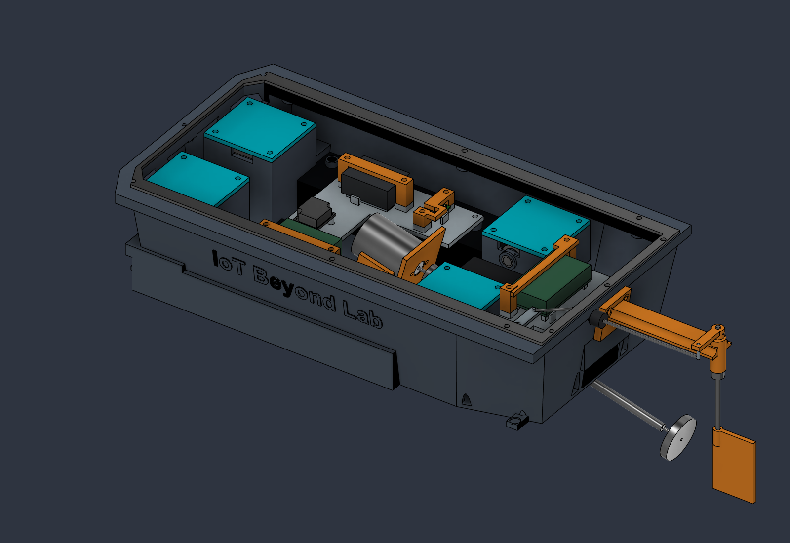
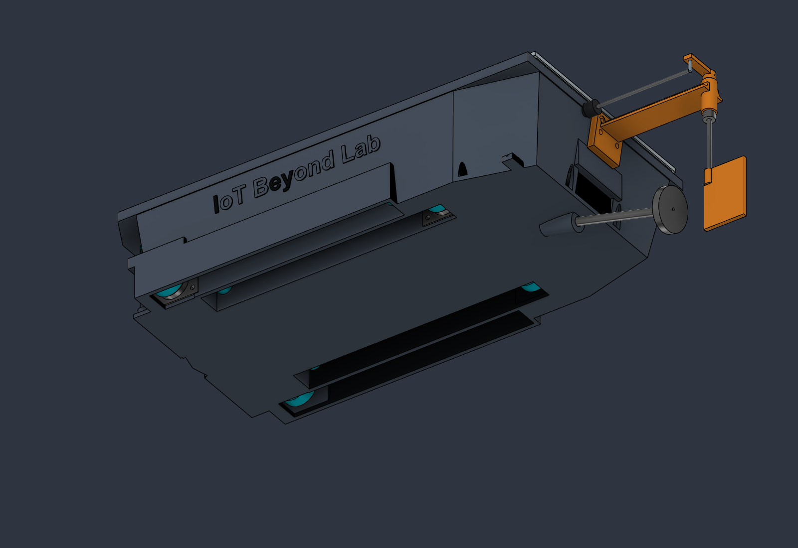

# Project history

Consolidated on 28 September 2026 before Rev E. Historical text records earlier decisions; it is not the current design, BOM, or a new user instruction. Current files in this repository supersede the snapshots below.

Source commit: `a540195012e571918bde7bf43886bd63302e36ab`. Git history is retained; binary CAD revisions and old migration scripts remain recoverable there.
## Git revision record

```text
a540195 2026-09-27 Merge pull request #5 from jhbryan0817-del/codex/revd-internal-servos
dc7900f 2026-09-27 Redesign Rev-D with internal servos and recessed probe channels
c4d6890 2026-09-27 Merge pull request #4 from jhbryan0817-del/codex/revc-articulated-probes
304299c 2026-09-27 Design Rev-C.1 articulated four-probe prototype
cb94758 2026-09-26 Audit supplier geometry and correct Rev-B.4 mechanical interfaces
593cd2b 2026-09-26 Merge pull request #3 from jhbryan0817-del/codex/revb3-assembly-access
3d7ceca 2026-09-25 Add verified E2 motor-support fit coupon
54759d8 2026-09-25 Add E2 motor-support coupon instructions
cb45f23 2026-09-25 Add Rev-B.3 assembly and interface previews
5d7eb04 2026-09-25 Add reproducible Rev-B.3 migrations and audits
d16e88b 2026-09-25 Add Rev-B.3 verification and blocked-access evidence
2454cd6 2026-09-25 Update three print parts and complete STL bundle
4b219dd 2026-09-25 Add verified Rev-B.3 editable CAD and STEP
25366ab 2026-09-25 Rev-B.3: record measured corrections, assembly blockers and printer plan
481abba 2026-09-25 Rev-B.3: document assembly corrections and unresolved build gates
824227b 2026-09-25 Merge pull request #2 from jhbryan0817-del/codex/revb2-electrode-retention
b47ad5f 2026-09-25 Rev-B.2: add electrode access, screw retention and hull branding
4a6ef53 2026-09-25 Document prioritized steps and acceptance gates for working prototype
6f8ef16 2026-09-25 Improve tray harness restraints and document production assembly audit
c00e548 2026-09-24 Merge pull request #1 from jhbryan0817-del/codex/compact-enclosure-revb
4d0b619 2026-09-24 Compact hull to 320 x 170 mm and verify Rev-B service layout
94a349e 2026-09-24 Fix Rev-A mechanical interfaces and document verified Rev-A.1 exports
a364aa5 2026-09-23 Add files via upload
```

---

## Historical document: CHANGELOG.md

# Changelog

## Rev-D — 27 September 2026

- Retain 320 × 170 mm hull footprint; replace underside pods with four integral internal actuator wells and removable covers.
- Add four recessed wet channels, opposing fold directions and 166 mm arms on hinges 16 mm above the bottom, retaining 150 mm deployed tip depth.
- Retain HS-65HB servos with nominal internal timing-drive allocations; document new supplier, tension, horn and retention holds.
- Repackage analog/power cassette, longitudinal battery, overhead controller bridge and separate steering saddle; revise hatch opening/gasket and provide a provisional dogleg linkage.
- Apply graphite/light-gray/cyan appearances and update assembly/BOM, geometry preset, audits and exports.
- Preserve earlier revision history and explicit prototype release limitations.

## Rev-C.1 — 27 September 2026

- Replace four flush electrodes with independently parameterized 0–90° fore–aft arms, 150 mm deployment below the hull bottom and a non-coplanar measurement pose.
- Remove magnetometer hardware and current procurement/print/wiring requirements.
- Add four removable dry HS-65HB pod concepts, replaceable nominal machined seal/bushing cartridges, insulated arms and a separate probe-servo regulator mount.
- Close old wet electrode holes and rail pilots; correct pod/cartridge and motor-foot interference.
- Update BOM, supplier/material references, assembly, waterproofing boundaries, sensing plan and explicit interface holds.
- Add synthetic 3D observability tests, Fusion angle presets, rigid motion/clearance checks and revision-matched exports. No claim of completed horn coupling, qualified waterproofing or validated field measurements.


## Rev-B.4 — 26 September 2026

- Audit all named purchased components against manufacturer/supplier references; record nominal-versus-tolerance limitations and source hashes.
- Compare downloaded official ADC and regulator STEP body bounds/volumes with the live Fusion assembly; verify ADC drill coordinates and regulator edge tolerance.
- Revise PRINT_20 with a connected bypass around the five-pin connection row, preserving its screw centres.
- Enlarge four M4 nut envelopes from Ø7 to Ø8.1 to include hex corners; resolve official D24V10Fx family model provenance.
- Propose Hitec HS-65HB, TE 34145, Ruland MCL-3-A and Scanstrut DS6-P with explicit integration gaps; specify DIN 84 M4×18 A4 electrode screws.
- Record E1 access as builder-accepted without claiming physical seal qualification. Assembly release remains false.
- Export revision-matched editable F3D/STEP, print package and regression evidence; PRINT_20 is the only changed printable geometry.

## Rev-B.3 — 25 September 2026

- Clear battery-tray overlap with front M3 tray screw heads using two open corner reliefs.
- Open the ESP32 capture bridge above the upper header row and reinforce its remaining crossbar.
- Increase four motor-support M3×8 blind-hole tip margins from 0.2 to 2 mm while retaining nominal 2 mm bottom skin.
- Add fastener-head/header-access checks and explicitly failed E1 tool-access evidence; assembly release remains false.
- Document the H2D hull/hatch and X1C small-part plan, staged procurement, missing sealed sensor entry, exact harness/steering interfaces and physical qualification gates.
- Regenerate Rev-B.3 CAD, all sixteen prints, a separate fit coupon and verification evidence. Electronics architecture remains unchanged.

## Rev-B.2 — 25 September 2026

- Added electrode ring-lug/crimp envelopes, an E2 cradle side exit, a tray conductor riser and checked routing allocations.
- Added blind M3 screw interfaces for motor supports, sensor rail and rudder bracket; converted ADC/servo support bores to M2 pilots. Main hatch inserts remain.
- Added four screw-secured electronics capture bridges, locating stops and a motor-cradle liner envelope.
- Joined raised “IoT Beyond Lab” branding into the hull side.
- Regenerated CAD/print exports and documented the remaining hardware, screw coupon, harness, sealing and prototype-test gates.


## Rev-B.1 — 2026-09-25

- Add twelve through-slots to the existing Fusion electronics tray: five harness restraint stations and an ESC retention path; preserve the outer envelope and exact purchased-component sizes.
- Audit all mechanical subsystems for print and assembly risks, and document unresolved production gates.
- Add a wiring connection schedule, power-source isolation, connector mismatch correction, servo/BEC current-budget check and service sequence.
- Assess a compact interconnect PCB without creating a PCB design.
- Regenerate native CAD, physical STEP and twelve STLs; rerun collision, steering, service and mesh/export checks.

## Rev-B — 2026-09-24

- Reduce hull from 400 × 190 to 320 × 170 mm while retaining the stern/shaft datum.
- Rotate the battery across the bow and repack electronics with matching supports and ADC mounting holes.
- Shorten the electronics tray, relocate front pillars and strap passages, and resize hatch/gasket/fastener interfaces together.
- Shorten the magnetometer rail and relocate the sensor assembly; separate revised wiring allocations.
- Document battery/tray removal for USB access and the assembly/service sequence.
- Recheck solid overlaps, 71 steering positions, sampled tray removal, tool/grip access, twelve STL meshes and exported files.
- Save the existing Fusion design and provide Rev-B F3D, STEP, print package, previews and audit documentation.

## Rev-A.1 — 2026-09-24

- Restore clamping contact between all four electrode heads and exterior seal washers.
- Clear the motor rear-terminal service envelope by moving the battery forward 6 mm; extend tray support 3 mm toward the bow.
- Move the reserved power-wire corridor clear of the battery rail and motor mount.
- Add matching tiller/stock cross-pin holes, a purchased retained-pin envelope and a lower stop-collar allocation.
- Increase steering penetration to 7 mm and update the boot allocation after finding a collision at +33…+35 degrees.
- Correct regulator CAD provenance labeling.
- Re-export native CAD, physical-only STEP, all 12 STLs, print ZIP and previews; add reproducible validation and updated assembly documentation.

## Rev-A — 2026-09-23

Original published mechanical packaging audit. Historical reports remain in `verification/`; source commit: `a364aa5ba2249f480e7dcc9e9159f0153d982758`.

---

## Historical document: README.md

# Energized Water Scan

**Rev-D — internal servos, recessed arms and stacked electronics, 27 September 2026.** The hull retains its **320 × 170 mm** footprint. Four HS-65HB probe servos now sit in integral internal wells with top-access covers. Four long underside channels receive the folded arms; electrode reach remains 150 mm below the original bottom at 90°.

**Mechanical packaging / fit prototype.** The internal timing transmissions are nominal allocations, with supplier selection, horn adapters, tension adjustment and retention still unreleased. Existing shaft-seal, wet-wire, protected-front-end and flotation validation gates remain open. The relocated steering servo and dogleg pushrod require a new steering travel check.

## Start here

- [Design, dimensions, sensing geometry and limitations](docs/RevD_Internal_Servos.md)
- [Current 23-piece print and procurement schedule](docs/Print_and_Procurement.md)
- [Wiring and assembly sequence](docs/Wiring_and_Assembly.md)
- [Editable Fusion design](cad/Energized_Water_Scanner_RevD.f3d) and [physical STEP assembly](cad/Energized_Water_Scanner_RevD.step)
- [Revision-matched fit-prototype STLs](prints/Print_STLs.zip)
- [Rigid-body/motion audit](verification/RevD_Assembly_Audit.json), [native angle-control audit](verification/RevD_Native_Pose_Audit.json), [service audit](verification/RevD_Service_Audit.json), [numerical geometry checks](verification/RevD_Observability.json), [export verification](verification/RevD_Export_Check.json)





The front pair folds aft in outer channels; the rear pair folds forward in inner channels. All four use independent 0–90° user parameters. The battery is longitudinal beneath a removable controller bridge; analog and power electronics sit on separate sides of the main cassette. A shaped hatch opening improves access while preserving the original footprint. Graphite, light gray and cyan replace the previous appearance scheme.

“Nearly flat” describes the stowed sensing appendages. The propulsion shaft, propeller, rudder and existing stern sleeve remain below/behind the hull. The channels are wet, open recesses, not sealed exterior doors.

Use [Rev-D pose controls](scripts/revd_set_pose.py) and the [updated geometry demonstrator](scripts/revd_gradient.py). The measurement preset is [60,20,20,45]°; three coherent signed voltage differences are required. The scripts do not drive real actuators or implement instrument firmware. Equal-angle poses cannot recover a 3D gradient. No magnetometer is installed, so results are in the boat frame.

## Repository layout

| Folder | Contents |
|---|---|
| cad/ | Current Rev-D F3D/STEP and historical versions |
| prints/ | Current 23 fit-prototype parts and matching ZIP |
| docs/ | Current design/BOM/assembly, with prior revisions labeled historical |
| previews/ | Open, closed, underside, wells, deployed and measurement views |
| verification/ | RevD evidence; earlier reports retained as historical |
| scripts/ | Reproducible migration/refinement, poses, audits and exports |
| coupons/ | Historical motor-support coupon; not a Rev-D actuator qualification |

Earlier Rev-A/B/C documents do not supersede Rev-D. A CAD clearance pass does not establish water tightness, mechanical life or sensing performance. No production PCB, calibrated instrument firmware or measured flotation result is supplied. A low or absent reading cannot establish that water is safe.

---

## Historical document: docs/Energized_Water_Scan_RevA_Hardware_and_CAD.md

> **Historical revision.** Current geometry, BOM and sensing architecture are [Rev-C.1](RevC_Articulated_Probes.md). Fixed-electrode and magnetometer instructions below are superseded.

# Energized Water Scan — Rev-A Hardware & Mechanical-CAD Baseline

**Repository target:** `jhbryan0817-del/Energized_Water_Scan`  
**Revision:** Rev-A CAD-ready BOM  
**Mechanical-reference audit:** 2026-09-23  
**Primary design priority:** Every enclosure-driving purchased component must have a public mechanical reference sufficient to reproduce or import its geometry.

---

# 1. Project scope

This document defines the first hardware revision of a small remotely controlled surface craft intended to survey flooded water for possible electrical hazards using:

- two orthogonal submerged electrode pairs to sense local electric-potential gradients;
- one 3-axis magnetometer;
- one ESP32-based controller;
- one brushed propulsion motor;
- conventional rudder steering.

This revision intentionally focuses on:

- essential electronics;
- specific purchasable components;
- mechanical-reference availability;
- power architecture;
- component geometry;
- CAD-development direction;
- enclosure/hull serviceability.

The following remain outside Rev A:

- detection/classification algorithms;
- machine learning;
- calibrated hazard thresholds;
- field reliability;
- certification;
- production PCB design.

> **Safety note:** This prototype is an experimental detector, not protective equipment. A negative measurement must never be treated as proof that flooded water is safe to enter. Early testing should use isolated, low-voltage laboratory sources.

---

# 2. CAD-first selection rule

The original BOM contained several mechanically vague entries such as:

- "370/380 motor";
- "SG90-class servo";
- "2S 2200 mAh LiPo";
- generic shaft/coupler/propeller kit.

Those are no longer acceptable for the mechanical baseline.

For Rev A, every purchased component that drives the enclosure geometry is now assigned one of three reference classes:

## Class A — direct CAD reference

The manufacturer provides one or more of:

- STEP;
- DXF;
- official 3D model;
- detailed manufacturing/fabrication drawing.

These parts can be imported directly or reconstructed with high confidence.

## Class B — official dimension-controlled envelope

No trustworthy STEP file is available, but the manufacturer provides enough dimensions to build an accurate simplified solid.

These components should be represented in the boat assembly as clearance envelopes rather than photorealistic models.

## Class C — standardized/non-enclosure-driving hardware

Examples:

- M4 fasteners;
- resistors;
- capacitors;
- flexible wire;
- heat-shrink.

These do not justify individual high-detail boat-assembly models. Standard CAD-library geometry or a bounding volume is sufficient.

---

# 3. Revised CAD-ready BOM

## Budget position

The revised component-only planning total is approximately:

**US$149**

This deliberately excludes:

- international shipping;
- taxes/import charges;
- LiPo charger;
- hull fabrication;
- sealant;
- general workshop fasteners;
- replacement consumables.

Because exact branded parts must be sourced rather than substituted with anonymous equivalents, a **US$200 procurement allowance is recommended** even though the target component subtotal remains near $150.

Prices are planning values, not quotations.

| # | Function | Exact component | Qty | Planning cost | Mechanical reference | CAD class |
|---|---|---|---:|---:|---|---|
| 1 | Main controller / wireless link | **Espressif ESP32-DevKitC V4** | 1 | ~$10 | Official dimensions PDF + **DXF source** + PCB layout | **A** |
| 2 | Magnetometer | **SparkFun SEN-19921 Qwiic Micro MMC5983MA** | 1 | $18.50 | Official board dimensions + Eagle files + hardware repository | **A/B** |
| 3 | Electrode ADC | **Adafruit ADS1115 PID 1085, STEMMA QT/Qwiic** | 1 | $14.95 | Official fab drawing + **3D model** + EagleCAD files | **A** |
| 4 | Logic regulator | **Pololu D24V10F5, item 2831** | 1 | $12.95 | Official dimension drawing + **STEP + DXF drill guide** | **A** |
| 5 | Brushed ESC | **Hobbywing QuicRun WP-1625, product 30120000** | 1 | ~$20 | Manufacturer envelope 34 × 24 × 14 mm + wire specifications | **B** |
| 6 | Propulsion motor | **Mabuchi RS-380PH-4045** | 1 | ~$10 | Detailed Mabuchi mechanical drawing: body, shaft, mounting holes, terminals | **A/B** |
| 7 | Prop shaft / stern tube | **Krick 65220 Eco M2 shaft assembly** | 1 | ~$6.50 | Published shaft/tube diameters and lengths | **B** |
| 8 | Coupling center | **Krick 63800 bridge coupling connector** | 1 | ~$5.50 | Published complete-coupling OD/length when assembled | **B** |
| 9 | Motor-side coupling insert | **Krick 63823, 2.3 mm** | 1 | ~$3.75 | Published bore, hex size, width and setscrew size | **B** |
| 10 | Shaft-side coupling insert | **Krick 63820, 2.0 mm** | 1 | ~$3.75 | Published coupling geometry; 2.0 mm bore | **B** |
| 11 | Propeller | **Krick/Graupner 2307.30, 3-blade, right-hand, M2** | 1 | ~$5 | Published 30 mm diameter, M2 connection, 16 mm pitch | **B** |
| 12 | Rudder servo | **Genuine TowerPro SG90 Digital** | 1 | ~$5 | Manufacturer body and mounting dimensions; third-party STEP models also exist | **A/B** |
| 13 | Battery | **Gens Ace G-Tech Soaring 2200 mAh 2S 30C, SKU GEA222S30X6GT** | 1 | ~$16 | Manufacturer envelope 104 × 34.5 × 14.5 mm and mass | **B** |
| 14 | Wet electrodes | **A4/316 stainless M4 machine bolts, standard geometry** | 4 | ~$4 | ISO-standard fastener geometry / standard CAD libraries | **C** |
| 15 | Electrode input network | 499 kΩ resistors, 100 kΩ resistors, BAT54S clamps, capacitors, bias-divider parts | set | ~$5 | Standard packages; mounted on one defined prototype-board envelope | **C** |
| 16 | Wiring / fuse / internal integration | Silicone wire, XT60 mating lead, Qwiic leads, heat-shrink, inline fuse, perfboard | set | ~$8 | Non-enclosure-driving; model only routing/clearance envelopes | **C** |

**Planning subtotal: approximately US$149**

A delivered build can exceed $150 because several exact parts may come from different suppliers. Therefore the **recommended purchasing ceiling is $200**.

---

# 4. Mechanical-reference audit

## 4.1 ESP32-DevKitC V4

**Status: keep**

Espressif provides:

- ESP32-DevKitC V4 dimensions PDF;
- dimensions source **DXF**;
- PCB layout;
- schematic.

Mechanical reference:

https://docs.espressif.com/projects/esp-dev-kits/en/latest/esp32/esp32-devkitc/user_guide.html

### CAD implementation

Import the DXF or reconstruct the board outline.

The assembly model should include clearance for:

- USB connector;
- pin headers;
- ESP32 module/shield;
- USB-cable insertion;
- wiring bend radius.

Do not create a tight snap-fit around the PCB itself.

---

## 4.2 SparkFun SEN-19921 MMC5983MA

**Status: keep**

SparkFun provides:

- board dimensions;
- Eagle files;
- schematic;
- open hardware repository.

Nominal board size:

**19.05 × 7.62 mm**

Reference:

https://www.sparkfun.com/sparkfun-micro-magnetometer-mmc5983ma-qwiic.html

### CAD implementation

No detailed manufacturer STEP is required.

Create a simplified sensor-board model from:

- PCB outline;
- PCB thickness;
- Qwiic connector volume;
- component-height clearance.

The magnetometer pod should have much more clearance than the PCB requires because the primary requirement is magnetic separation, not packing density.

---

## 4.3 Adafruit ADS1115 PID 1085

**Status: keep**

Adafruit publishes:

- official **ADS1115 3D models**;
- STEMMA QT fab print;
- EagleCAD files.

Official downloads:

https://learn.adafruit.com/adafruit-4-channel-adc-breakouts/downloads

Nominal product envelope:

**25.4 × 17.8 × 4.6 mm**

Product reference:

https://www.adafruit.com/product/1085

### CAD implementation

Import the official model.

Add additional clearance around:

- STEMMA QT connectors;
- screw-terminal/header area if populated;
- electrode-front-end wiring.

---

## 4.4 Pololu D24V10F5

**Status: keep**

The original 1 A regulator is retained.

It only needs to power:

- ESP32;
- ADS1115;
- magnetometer;
- low-current front-end electronics.

The steering servo remains powered from the ESC BEC.

Pololu provides:

- official STEP;
- official drill-guide DXF;
- detailed dimensions.

Reference:

https://www.pololu.com/product/2831/resources

Nominal board size:

**0.5 × 0.7 × 0.14 in**

### Why not change to the larger 3 A regulator?

Pololu's S13V30F5 would be a mechanically excellent alternative because it also has official STEP/DXF files, but it costs more and is unnecessary if the SG90 is powered through the ESC BEC.

If later revisions place all 5 V loads on one rail, S13V30F5 is the preferred upgrade:

https://www.pololu.com/product/4082/resources

---

# 5. Propulsion system — now dimensionally frozen

The most important BOM tightening is the propulsion chain.

Rev A now uses:

```text
Mabuchi RS-380PH-4045
        |
      Ø2.3
        |
Krick 63823 coupling insert
        |
Krick 63800 bridge connector
        |
Krick 63820 coupling insert
        |
      Ø2.0
        |
Krick 65220 shaft assembly
        |
       M2
        |
Krick/Graupner 2307.30 propeller
```

This chain is now mechanically specified instead of being a generic RC-boat drivetrain.

---

# 6. Mabuchi RS-380PH-4045 motor

**Status: replaces generic "370/380 motor"**

Mabuchi provides a detailed mechanical drawing for the RS-380PH family.

Important geometry:

- body length: approximately **37.8 mm**;
- maximum can diameter: **Ø29.2 mm**;
- principal can diameter: **Ø27.7 mm**;
- output shaft: **Ø2.3 mm**;
- two front **M2.6 × 0.45** mounting holes;
- shaft/mounting-face geometry publicly documented;
- approximately **80 g**.

Electrical reference for RS-380PH-4045:

- operating range: approximately 3–12 V;
- nominal data published at 6 V;
- no-load speed around 12,500 rpm in the currently published catalog specification.

Manufacturer reference:

https://product.mabuchi-motor.com/detail.html?id=99

A detailed RS-380PH mechanical drawing is also widely mirrored from Mabuchi's published data.

### CAD implementation

Reconstruct the motor as a parametric component using the drawing.

Model:

- can;
- front boss;
- output shaft;
- M2.6 mounting holes;
- rear terminal clearance.

Do **not** mount by clamping tightly around the thin motor can alone.

Preferred mount:

- front-face screw location control;
- semi-cylindrical cradle for radial support;
- terminal ventilation/clearance.

---

# 7. Krick 65220 M2 shaft / stern-tube assembly

**Status: replaces generic shaft kit**

Exact part:

**Krick 65220 — Ship shaft + stern tube M2 × 153 mm Eco**

Published dimensions:

- stern-tube length: **153 mm**;
- shaft length: approximately **178 mm**;
- stern-tube outside diameter: **5.5 mm**;
- propeller thread: **M2**;
- propeller-thread length: **5 mm**.

Reference:

https://www.krickshop.de/Schiffswelle-Stevenrohr-M2-x-153mm-Eco.htm?ProdNr=65220&a=article

### CAD implementation

Create separate solids for:

- 5.5 mm OD stern tube;
- central 2 mm-class rotating shaft;
- exposed motor-side shaft;
- M2 propeller thread envelope.

The stern tube, not merely the shaft, should define the hull penetration.

---

# 8. Krick bridge coupling

## 8.1 Center connector — 63800

Exact component:

**Krick 63800 Stegkupplung connector**

Reference:

https://www.krickshop.de/Zubehoer-Ersatzteile/Zubehoer-fuer-Schiffsmodelle/Schiffswellen-Kupplungen/Stegkupplung-Verbinder-1-Stck-.htm?ProdNr=63800&a=article

## 8.2 Motor-side insert — 63823

Exact component:

**Krick 63823, 2.3 mm bore**

Published insert geometry includes:

- bore: **2.3 mm**;
- hex: **10 mm**;
- width: **5 mm**;
- setscrew thread: **M3**.

Reference:

https://www.krickshop.de/Zubehoer-Ersatzteile/Zubehoer-fuer-Schiffsmodelle/Schiffswellen-Kupplungen/Welleneinsatz-f-Stegkupplung-2-3mm.htm?ProdNr=63823&a=article&p=192

## 8.3 Shaft-side insert — 63820

Exact component:

**Krick 63820, 2.0 mm bore**

The assembled coupling family is documented at approximately:

- total length: **20 mm**;
- outside diameter: **15 mm**.

Reference:

https://www.krickshop.de/Zubehoer-Ersatzteile/Zubehoer-fuer-Schiffsmodelle/Schiffswellen-Kupplungen/Welleneinsatz-f-Stegkupplung-2mm.htm?ProdNr=63820&a=article&p=192

### CAD implementation

A high-detail coupling model is unnecessary.

Model the assembled coupling as:

- Ø15 mm maximum rotating envelope;
- 20 mm nominal length;
- Ø2.3 mm motor bore;
- Ø2.0 mm shaft bore.

Add axial service clearance for setscrew access.

---

# 9. Krick/Graupner 2307.30 propeller

**Status: replaces generic 30–35 mm propeller**

Exact part:

**2307.30**

Published data:

- 3 blades;
- **30 mm outer diameter**;
- **16 mm pitch**;
- right-hand rotation;
- **M2** threaded connection;
- impact-resistant plastic with brass threaded insert.

Reference:

https://www.krickshop.de/Accessories-Spare-Parts/Accessories-for-Ship-Models/Propellers-for-shipmodels/Schiffsschraube-3Bl-30mm-R-M2.htm?ProdNr=gr2307-30&a=article&p=186&shop=krick_e

### CAD implementation

Do not waste time recreating exact blade surfaces for hull packaging.

Use a propeller keep-out solid:

```text
Diameter: 30 mm
Radial safety envelope: 34–36 mm recommended
```

The hull and rudder must remain outside this swept volume.

---

# 10. Hobbywing QuicRun WP-1625 ESC

**Status: keep**

Exact part:

**Hobbywing QuicRun WP-1625 Brushed, product 30120000**

Manufacturer-published body envelope:

**34 × 24 × 14 mm**

Other mechanical information:

- approximately 23.5–24 g;
- input/output wire size and lengths are manufacturer documented;
- integrated waterproof/dustproof housing.

Reference:

https://www.hobbywing.com/en/products/quicrun-wp-1625-brushed53

North American product page:

https://www.hobbywingdirect.com/products/quicrun-16-esc-brushed

### Important BEC note

Different current Hobbywing regional pages/documentation report the BEC as nominally **5 V or 6 V / 1 A** depending on page/revision.

Both are within the genuine TowerPro SG90's stated practical voltage range, but Rev A should **verify actual BEC output with a multimeter before connecting the servo**.

Do not power the ESP32 from this BEC.

### CAD implementation

Use a conservative envelope rather than an ornamental ESC model:

```text
ESC body: 34 × 24 × 14 mm
CAD allocation: approximately 38 × 28 × 18 mm
```

Add separate wire-bend volumes.

---

# 11. Genuine TowerPro SG90 Digital

**Status: replaces generic "SG90-class servo"**

Exact component:

**TowerPro SG90 Digital**

Manufacturer data:

- body dimension approximately **23 × 12.2 × 29 mm**;
- mass: approximately 9 g;
- detailed dimension table available;
- nominal 4.8 V operation;
- TowerPro states 4.8–6 V is acceptable in its support information.

Reference:

https://towerpro.com.tw/product/sg90-7/

### CAD implementation

A public third-party SG90 STEP can be used for convenience, but it must be checked against the genuine TowerPro dimensions before the mount is frozen.

Do not design around an anonymous SG90 clone.

Recommended printed-clearance allowance:

- approximately 0.3–0.5 mm per constrained side;
- slotted mounting holes;
- servo horn/linkage service envelope above the servo.

---

# 12. Gens Ace G-Tech 2200 mAh 2S battery

**Status: replaces generic "2S 2200 mAh LiPo"**

Exact battery:

**Gens Ace G-Tech Soaring 2200 mAh 7.4 V 30C 2S1P with XT60**  
**SKU: GEA222S30X6GT**

Manufacturer-published data:

- capacity: 2200 mAh;
- nominal voltage: 7.4 V;
- discharge rating: 30C;
- mass: approximately **126 g**;
- dimensions: approximately **104 × 34.5 × 14.5 mm**.

Reference:

https://gensace.de/products/gens-ace-g-tech-soaring-2200mah-7-4v-30c-2s1p-lipo-battery-pack-with-xt60-plug

### CAD implementation

Do **not** make the battery cavity exactly 104 × 34.5 × 14.5 mm.

Use a removable strap tray approximately:

```text
minimum usable bay:
110 × 39 × 19 mm
```

plus:

- XT60 wire exit;
- balance-lead clearance;
- strap thickness;
- finger-removal clearance.

A soft LiPo must not be rigidly compressed by the enclosure.

---

# 13. M4 stainless electrodes

**Status: keep, now mechanically defined**

Use:

**A4 / 316 stainless M4 standard machine bolts**

Exact bolt length remains intentionally undefined until the hull-bottom thickness is fixed.

The required bolt length is approximately:

```text
bolt length =
hull thickness
+ sealing washer/O-ring stack
+ internal washer
+ terminal lug
+ nut thickness
+ desired exposed electrode length
```

M4 hardware is standardized and can be generated from:

- Fusion fastener library;
- SolidWorks Toolbox;
- FreeCAD Fasteners;
- McMaster/MISUMI/TraceParts equivalents.

### CAD implementation

Model electrode bosses parametrically.

Do not model these as fixed holes in an otherwise finished hull.

---

# 14. Electrode sensing arrangement

Use four electrodes arranged as two perpendicular differential axes.

Bottom view:

```text
               BOW

                E1
                |
                |
         E3 ----+---- E4
                |
                |
                E2

               STERN
```

Conceptual measurements:

```text
Vx = V(E1) - V(E2)
Vy = V(E3) - V(E4)
```

Suggested initial parametric ranges:

- E1–E2: **100–160 mm**
- E3–E4: **80–140 mm**

The ADS1115 can configure:

- A0–A1 as one differential pair;
- A2–A3 as the second differential pair.

The channels are multiplexed/sequential rather than truly simultaneous.

---

# 15. Electrode front-end

The electrodes must not connect directly to the ADS1115.

Prototype each electrode input with a high-impedance, current-limited network.

Conceptual direction:

```text
electrode
   |
 499k
   |
 499k
   |
   +------ ADC input
   |
 bias network / filtering / clamps
```

The final values must be validated against the intended experimental voltage range.

The front end should include:

- symmetric current-limiting resistance;
- low-leakage clamping;
- RC filtering;
- controlled bias/common-mode point;
- replaceable prototype board.

### Mechanical implementation

Do not model every resistor in the boat.

Define one front-end module envelope, initially:

```text
~40 × 30 × 12 mm
```

This envelope includes:

- perfboard or prototype PCB;
- passives;
- connectors;
- wiring bend radius.

A future custom PCB can replace this placeholder directly.

---

# 16. Revised power architecture

## Propulsion branch

```text
2S LiPo
   |
inline fuse / battery disconnect
   |
Hobbywing WP-1625
   |
Mabuchi RS-380PH-4045
```

## Steering branch

```text
Hobbywing ESC BEC
   |
verify actual output voltage
   |
TowerPro SG90
```

## Sensing/control branch

```text
2S LiPo
   |
Pololu D24V10F5
   |
5 V
   |
ESP32-DevKitC V4
   |
3.3 V sensor rail as appropriate
   |
ADS1115 + MMC5983MA + front-end
```

Keeping the control/sensing supply independent from the servo load reduces disturbance on the MCU/sensor rail.

---

# 17. Wireless control

Rev A does not require a separate RC transmitter/receiver.

The ESP32 can accept basic commands over:

- Wi-Fi;
- BLE.

This saves both cost and enclosure volume.

A conventional receiver can be added later.

Reserve approximately:

```text
35 × 25 × 15 mm
```

of optional tray space for a future receiver/telemetry module.

---

# 18. Overall mechanical architecture

Recommended starting hull:

**slow displacement monohull**

Suggested initial envelope:

- overall length: **350–450 mm**;
- beam: **160–220 mm**;
- shallow draft;
- substantial electronics freeboard.

The craft is a sensing platform, not a racing boat.

---

# 19. Three functional zones

## Zone A — bow sensing zone

Contains:

- MMC5983MA pod;
- electrode wiring;
- optional future second sensor;
- removable mast/boom.

The magnetometer should be separated from:

- motor;
- ESC;
- battery high-current wiring;
- coupling;
- steel shaft;
- servo;
- ferromagnetic hardware.

Start with an adjustable motor-to-magnetometer separation of approximately:

**150–250 mm**

This is an experimental starting range, not a proven interference threshold.

---

## Zone B — central dry compartment

Contains:

- battery;
- ESP32;
- ADS1115;
- front-end board;
- Pololu regulator;
- internal fuse;
- wiring distribution.

Use one removable electronics tray.

Battery should be low and near the longitudinal center of buoyancy.

---

## Zone C — aft propulsion zone

Contains:

- Mabuchi motor;
- Krick coupling;
- Krick stern tube;
- ESC;
- TowerPro servo;
- rudder linkage.

Keep high-current conductors short and local.

---

# 20. Magnetometer pod

The magnetometer should not be permanently embedded in the hull.

Design a removable pod supporting at least three configurations:

1. flush bow;
2. raised mast;
3. forward boom.

Mechanical requirements:

- repeatable sensor XYZ orientation;
- Qwiic-cable strain relief;
- plastic/non-magnetic fasteners near sensor;
- sensor-board replacement without opening main hull;
- multiple fore-aft mounting positions.

Avoid steel threaded inserts directly beside the magnetometer.

---

# 21. Hull penetration for the stern tube

The Krick 65220 stern tube gives a defined hull-interface diameter:

**5.5 mm OD**

Do not simply create a nominal 5.5 mm hole.

The hull should include:

- shaft-line reference bore;
- local reinforcement;
- bonding/sealant annulus;
- alignment feature;
- adequate stern-wall thickness.

A reasonable first printed/bonded interface can use a slightly oversized controlled bore and epoxy/sealant rather than relying on FDM dimensional sealing.

---

# 22. Motor mount

Build the motor mount from the Mabuchi drawing.

Suggested architecture:

- front mounting plate using M2.6 holes;
- semi-cylindrical lower cradle;
- removable upper retainer if needed;
- terminal clearance behind motor;
- access to mounting screws.

Do not trap the motor permanently between printed hull structures.

---

# 23. Coupling keep-out zone

Because the assembled Krick bridge coupling is approximately:

- **20 mm long**;
- **15 mm OD**,

model a larger rotating/service envelope:

```text
length allowance: 25–30 mm
diameter allowance: 18–20 mm
```

This gives room for:

- shaft alignment error;
- coupling flex;
- setscrew tools;
- installation/removal.

---

# 24. Propeller and rudder clearance

The selected propeller is:

**Ø30 mm**

Use a minimum propeller swept-volume model of:

```text
Ø30 mm actual
Ø34–36 mm preferred keep-out
```

Position the rudder behind the propeller while keeping:

- full prop rotation clear;
- rudder stock clear of blade tips;
- removable propeller access.

The rudder itself can be custom fabricated and therefore does not need a purchased-part CAD reference in Rev A.

---

# 25. Electronics tray

Create one removable tray with dedicated positions for:

- ESP32;
- ADS1115/front-end;
- Pololu regulator;
- ESC;
- battery;
- future receiver reserve.

Recommended features:

- M2/M2.5/M3 standoff grid;
- battery-strap slots;
- zip-tie channels;
- separate sensor and motor wire channels;
- connector access;
- inspection space below boards.

Do not glue PCBs directly to the hull.

---

# 26. Main service hatch

Use one large hatch.

Recommended features:

- continuous perimeter gasket;
- wide flange;
- 6–8 compression screws;
- splash lip;
- all regular-service fasteners above the design waterline where possible.

Avoid:

- snap-fit-only waterproofing;
- many small deck holes;
- separate hatches for every subsystem.

---

# 27. FDM construction direction

If the hull is FDM printed:

- do not assume layer lines are watertight;
- use adequate shell thickness;
- design sealant-compatible joints;
- minimize penetrations below waterline;
- provide flat gasket surfaces;
- use threaded inserts only where their material/location will not compromise the magnetometer;
- consider coating or sealing the lower hull after printing.

The printed hull should define geometry; waterproofing should come from deliberate sealing design.

---

# 28. CAD master parameters

At minimum expose:

```text
hull_length
hull_beam
hull_height
design_waterline
deck_height

hatch_length
hatch_width
hatch_flange_width

battery_length
battery_width
battery_height
battery_clearance

motor_can_diameter
motor_body_length
motor_shaft_diameter

stern_tube_OD
stern_tube_length
shaft_angle

coupling_length
coupling_OD

propeller_diameter
propeller_keepout_diameter

electrode_fore_aft_spacing
electrode_port_starboard_spacing

magnetometer_forward_offset
magnetometer_height

electronics_tray_height
tray_standoff_pitch
```

These parameters should control the design before cosmetic hull refinement.

---

# 29. Component modeling plan

## Import directly

Use supplied models/files where possible:

### ESP32
Official DXF:
https://docs.espressif.com/projects/esp-dev-kits/en/latest/esp32/esp32-devkitc/user_guide.html

### ADS1115
Official 3D model:
https://learn.adafruit.com/adafruit-4-channel-adc-breakouts/downloads

### Pololu regulator
Official STEP:
https://www.pololu.com/product/2831/resources

---

## Reconstruct accurately from published mechanical drawings

### Mabuchi RS-380PH-4045
https://product.mabuchi-motor.com/detail.html?id=99

### SparkFun MMC5983MA
https://www.sparkfun.com/sparkfun-micro-magnetometer-mmc5983ma-qwiic.html

### Krick shaft
https://www.krickshop.de/Schiffswelle-Stevenrohr-M2-x-153mm-Eco.htm?ProdNr=65220&a=article

### Krick coupling
https://www.krickshop.de/Zubehoer-Ersatzteile/Zubehoer-fuer-Schiffsmodelle/Schiffswellen-Kupplungen/Welleneinsatz-f-Stegkupplung-2mm.htm?ProdNr=63820&a=article&p=192

### TowerPro SG90
https://towerpro.com.tw/product/sg90-7/

---

## Use conservative envelopes

### Hobbywing ESC
34 × 24 × 14 mm actual; allow wire and installation clearance.

https://www.hobbywing.com/en/products/quicrun-wp-1625-brushed53

### Gens Ace battery
104 × 34.5 × 14.5 mm nominal; make the tray larger.

https://gensace.de/products/gens-ace-g-tech-soaring-2200mah-7-4v-30c-2s1p-lipo-battery-pack-with-xt60-plug

### Propeller
Use a swept cylinder rather than detailed blades.

https://www.krickshop.de/Accessories-Spare-Parts/Accessories-for-Ship-Models/Propellers-for-shipmodels/Schiffsschraube-3Bl-30mm-R-M2.htm?ProdNr=gr2307-30&a=article&p=186&shop=krick_e

---

# 30. Recommended CAD workflow

## Stage 1 — build the component library

Before drawing the boat, create/import:

- ESP32;
- ADS1115;
- regulator;
- magnetometer;
- ESC envelope;
- battery envelope;
- motor;
- coupling;
- shaft/tube;
- propeller keep-out;
- servo.

Verify all units and coordinate systems.

---

## Stage 2 — create a layout-only master assembly

Place every component in space.

Do **not** make the hull.

Establish:

- centerline;
- shaft line;
- intended waterline;
- battery location;
- sensor separation;
- electrode axes;
- hatch service envelope.

---

## Stage 3 — driveline first

Align:

```text
motor axis
    =
coupling axis
    =
prop shaft axis
```

Then choose the shaft angle based on:

- propeller immersion;
- hull bottom;
- motor height;
- coupling clearance.

Do not bend the CAD around an arbitrary stern shape.

---

## Stage 4 — mass layout

Major known masses include:

- battery ~126 g;
- motor ~80 g;
- ESC ~24 g;
- electronics;
- printed hull.

Place the battery so it can be moved fore-aft during initial flotation tests.

A slotted battery tray is preferable to a fixed pocket.

---

## Stage 5 — sensing geometry

Add:

- four electrode bosses;
- magnetometer pod;
- multiple pod mounting positions.

The sensing geometry must remain adjustable.

---

## Stage 6 — service envelopes

Confirm that the following can be removed without damaging the boat:

- battery;
- ESP32;
- ADC/front-end;
- regulator;
- ESC;
- motor;
- servo;
- magnetometer pod;
- propeller;
- shaft if possible.

---

## Stage 7 — hull shell

Only now create:

- lower hull;
- deck;
- internal ribs;
- hatch flange;
- motor supports;
- shaft penetration;
- electrode bosses.

---

## Stage 8 — print interface coupons first

Before printing an entire 350–450 mm hull, print representative sections for:

- hatch/gasket;
- M4 electrode seal;
- stern-tube bond;
- PCB standoffs;
- motor mounting face.

Correct these interfaces before committing to the full print.

---

# 31. What should NOT be modeled in detail

Do not waste CAD time on:

- resistor bodies;
- individual wires;
- heat-shrink;
- detailed propeller blade aerodynamics;
- ESC decorative features;
- battery label artwork;
- screw threads except where needed for fabrication drawings.

For enclosure development, use:

- interface geometry;
- mounting geometry;
- keep-out envelopes;
- connector clearance;
- service clearance.

That is mechanically more useful than a photorealistic assembly.

---

# 32. Procurement order

Purchase in this order:

1. **Mabuchi RS-380PH-4045**
2. **Krick 65220 shaft**
3. **Krick 63800 + 63820 + 63823 coupling components**
4. **Krick/Graupner 2307.30 propeller**
5. **Gens Ace GEA222S30X6GT battery**
6. **TowerPro SG90**
7. **Hobbywing WP-1625**
8. **ESP32-DevKitC V4**
9. **Adafruit ADS1115**
10. **SparkFun MMC5983MA**
11. **Pololu D24V10F5**
12. electrode/passive/integration hardware

The drivetrain and battery should be physically measured before the hull is frozen even though public references exist.

Supplier dimensions are design inputs; the purchased parts are the final acceptance geometry.

---

# 33. CAD freeze rule

Do not freeze the hull until the following actual parts are physically on hand:

- motor;
- shaft;
- coupling;
- propeller;
- battery;
- servo;
- ESC.

Electronics boards with official CAD can be modeled safely before purchase, but physically checking them is still preferable.

---

# 34. Rev-A success criteria

Rev A is successful if it provides:

- stable low-speed flotation;
- single-motor propulsion;
- rudder steering;
- removable battery;
- removable electronics tray;
- replaceable four-electrode array;
- adjustable magnetometer position;
- physically separated sensing and high-current zones;
- maintainable hatch;
- dimensionally controlled drivetrain;
- room for later radio/GPS/data-logging additions.

Hydrodynamic efficiency and visual polish are secondary.

---

# 35. Final design position

The BOM is now sufficiently specific to begin a real master CAD assembly.

The most important changes from the earlier version are:

1. **Generic 370/380 motor → Mabuchi RS-380PH-4045**
2. **Generic shaft kit → Krick 65220**
3. **Generic coupling → Krick 63800 + 63820 + 63823**
4. **Generic propeller → Krick/Graupner 2307.30**
5. **SG90-class servo → genuine TowerPro SG90 Digital**
6. **Generic 2S battery → Gens Ace GEA222S30X6GT**

The electronics were already comparatively well documented and remain:

- ESP32-DevKitC V4;
- SparkFun SEN-19921;
- Adafruit ADS1115 PID 1085;
- Pololu D24V10F5;
- Hobbywing WP-1625.

The resulting assembly can be built from a combination of:

- official STEP/DXF;
- manufacturer fabrication drawings;
- verified dimensional envelopes.

A detailed STEP file for every object is neither necessary nor desirable. The mechanical design requires trustworthy **interfaces and keep-out geometry**, not photorealistic component models.

---

# 36. Primary reference links

- Espressif ESP32-DevKitC V4  
  https://docs.espressif.com/projects/esp-dev-kits/en/latest/esp32/esp32-devkitc/user_guide.html

- SparkFun MMC5983MA SEN-19921  
  https://www.sparkfun.com/sparkfun-micro-magnetometer-mmc5983ma-qwiic.html

- Adafruit ADS1115 PID 1085  
  https://www.adafruit.com/product/1085

- Adafruit ADS1115 CAD/downloads  
  https://learn.adafruit.com/adafruit-4-channel-adc-breakouts/downloads

- Pololu D24V10F5  
  https://www.pololu.com/product/2831/resources

- Hobbywing WP-1625  
  https://www.hobbywing.com/en/products/quicrun-wp-1625-brushed53

- Mabuchi RS-380PH-4045  
  https://product.mabuchi-motor.com/detail.html?id=99

- Krick 65220 M2 shaft  
  https://www.krickshop.de/Schiffswelle-Stevenrohr-M2-x-153mm-Eco.htm?ProdNr=65220&a=article

- Krick 63800 coupling connector  
  https://www.krickshop.de/Zubehoer-Ersatzteile/Zubehoer-fuer-Schiffsmodelle/Schiffswellen-Kupplungen/Stegkupplung-Verbinder-1-Stck-.htm?ProdNr=63800&a=article&p=192

- Krick 63820 2.0 mm coupling insert  
  https://www.krickshop.de/Zubehoer-Ersatzteile/Zubehoer-fuer-Schiffsmodelle/Schiffswellen-Kupplungen/Welleneinsatz-f-Stegkupplung-2mm.htm?ProdNr=63820&a=article&p=192

- Krick 63823 2.3 mm coupling insert  
  https://www.krickshop.de/Zubehoer-Ersatzteile/Zubehoer-fuer-Schiffsmodelle/Schiffswellen-Kupplungen/Welleneinsatz-f-Stegkupplung-2-3mm.htm?ProdNr=63823&a=article&p=192

- Krick/Graupner 2307.30 propeller  
  https://www.krickshop.de/Accessories-Spare-Parts/Accessories-for-Ship-Models/Propellers-for-shipmodels/Schiffsschraube-3Bl-30mm-R-M2.htm?ProdNr=gr2307-30&a=article&p=186&shop=krick_e

- TowerPro SG90 Digital  
  https://towerpro.com.tw/product/sg90-7/

- Gens Ace G-Tech 2200 mAh 2S, GEA222S30X6GT  
  https://gensace.de/products/gens-ace-g-tech-soaring-2200mah-7-4v-30c-2s1p-lipo-battery-pack-with-xt60-plug

---

## Historical document: docs/Print_and_Procurement.md

# Rev-D print and procurement schedule

See [Rev-D design and holds](RevD_Internal_Servos.md). The [Rev-C schedule](RevC_Print_and_Procurement_Historical.md) is historical. This remains a fit prototype, not a released mechanism or water-ready assembly.

## Current 23-piece print package

| IDs | Parts |
|---|---|
| 01,02 | Hull with four integral wells/channels; extended service hatch |
| 03,04 | Main analog/power cassette; longitudinal battery cradle |
| 09,11,14,16,17 | Retained rudder bracket, motor mounts, rudder blade and tiller |
| 18–21 | Retained electronics capture bridges, relocated |
| 22–25 | Four internal servo covers, replacing external pods |
| 26–29 | Four 166 mm insulating probe arms |
| 30,31 | Steering saddle and removable overhead controller bridge |

STLs are millimetres and arms are exported stowed. Reorient for slicing without scaling. The hull remains within 320 × 170 mm. Check support removal from the wet channels and hollow internal wells in the slicer before printing. PETG remains a fit-prototype candidate; porosity, wall strength, sealing flatness and sustained screw preload are unqualified.

## BOM changes from Rev-C

- Retain four Hitec HS-65HB probe servos, the SKF seal/igus lower-bushing candidates and machined POM cartridges. Relocate them inside the hull; the original seal-duty and horn-survey holds remain.
- Add eight 20T/2 mm pitch pulley allocations, four nominal 96 mm pitch-length × 6 mm belt allocations, and four upper journal/bushing allocations. Exact matched supplier parts, tooth geometry, bore/retention, tension adjustment, torque and life remain HOLD. Smooth CAD envelopes are not functional pulley or belt STLs.
- Replace the four output shafts with the longer nominal shafts shown in CAD. Release shaft surface, pin and axial retention only after the actual transmission is chosen.
- Replace four external pod gaskets and mounting sets with four internal covers and sixteen M3 cover screws. M3×8 is a starting length only; verify blind engagement and tool access.
- Retain the four cartridge face gaskets and sixteen cartridge screws; verify the new installed stack.
- Replace the main hatch gasket with the new shaped continuous sheet gasket. Do not reuse the old rectangular outline. Verify compression and screw lengths at the new opening and shortened rear-center boss.
- Retain the battery cradle with four flush M2 countersunk screws at (88,±13) and (189,±13) mm. Nominal Ø4.6 top countersinks and Ø1.7 blind pilots are fit-prototype starting geometry; verify head seating and screw length before loading the pack.
- Add the separate steering saddle and upper controller bridge with four M3 fasteners each; the main cassette also has four M3 fasteners. Verify engagement and printed-pilot strength.
- Replace the straight steering pushrod with the provisional M2 dogleg envelope. Bend geometry, stiffness, retention and full steering travel require a new validation.
- Four roof-entry potting cups, wet hinge loops and insulated tip terminals require the actual wire/encapsulant and flex/immersion tests.

All other named electronics, battery, motor, shaft/tube, propeller and rudder parts remain. Retain the separate D24V50F5 probe supply. Existing electrical protection and connector omissions remain open. No purchase has been made. Fit one complete actuator/transmission/cartridge before buying four sets or printing the complete hull.

---

## Historical document: docs/RevA1_Design_Audit.md

> **Historical revision.** Current geometry, BOM and sensing architecture are [Rev-C.1](RevC_Articulated_Probes.md). Fixed-electrode and magnetometer instructions below are superseded.

# Rev-A.1 light design audit — 24 September 2026

## Scope and baseline

Reviewed all repository documentation, CAD/print inventories, previews and prior verification reports at commit `a364aa5ba2249f480e7dcc9e9159f0153d982758`. Inspected the open editable Fusion document `Energized_Water_Scanner` through its local MCP server. The live model had the same 950 timeline items, 39 user parameters and corresponding geometry as the published baseline. Its unsaved state was backed up before edits.

This is a mechanical packaging and serviceability revision. The repository still has no validated sensing firmware, production PCB, calibrated hazard thresholds, flotation qualification or field-test evidence. The original hardware document records design intent; its instructions are not an independent authorization to purchase hardware or redesign the project.

## Findings and corrections

| Finding | Evidence before change | Rev-A.1 correction |
|---|---|---|
| Electrode heads cannot clamp the exterior seal | Each head ended at Z=-10 mm; the sealing washer started at Z=-1 mm: a 9 mm air gap | Move the four heads to Z=-4…-1 mm and shorten shank envelopes to 18 mm from Z=-1…17 mm. Preserve internal nut/washer positions and electrode XY spacing. Exposed electrode depth changes from 13 to 4 mm below the hull datum. |
| Battery occupies motor-terminal space | Battery intersects the existing `Motor_rear_terminals` service envelope by 408.198 mm³ | Add `battery_audit_forward_shift=6 mm`; move battery and its removal envelope forward. Extend the tray base and side rails 3 mm toward the bow. Battery is now X=-101…3 mm; tray X=-104…15 mm. |
| Reserved power-wire route is obstructed | Route overlaps the battery tray by 120 mm³ and motor mount by 24.847 mm³ | Move the 6 mm wide reserved route from Y=-26…-20 to Y=-31…-25 mm. It remains a routing envelope, not a printed duct or cable restraint. |
| Tiller has no positive torque/axial connection | A 3 mm shaft sits in a 3.2 mm cylindrical tiller socket; no cross-pin or clamp | Add matching 1.3 mm transverse holes in tiller and stock at X=278, Y=0, Z=67 mm, along X. Include a purchased 1.2 × 8 mm retained-pin envelope. |
| Rudder can lift through its bearing | No lower axial stop | Add a purchased collar allocation: maximum Ø8 × 5 mm, Z=34.5…39.5 mm, 0.5 mm below the bearing. Select a real 3 mm-bore locking collar; the modeled 3.2 mm bore is a clearance envelope. |
| Steering rod clips hull near full travel | First sampled sweep found rod/hull intersections at +33°, +34° and +35° (up to 1.502 mm³) | Enlarge hull steering seat from Ø6 to Ø7 mm; update boot neck allocation to Ø7 and outer flange/bellows allocation to Ø10 mm. Real boot remains to be selected and tested. |
| Regulator model provenance was overstated | Child model source is named D24V10F3 (3.3 V), while BOM specifies D24V10F5 (5 V) | Relabel the actual body-owning component `D24V10F5_PACKAGE_PROXY_from_D24V10F3_STEP_VERIFY`. Electrical procurement remains the F5; geometry is a packaging proxy pending exact-part verification. |

The tiller pin must be retained against walking out. Match-drill/ream the actual shaft and tiller in a jig; the printable 1.3 mm hole is a pilot/clearance intention, not a qualified FDM fit. Verify shaft strength and steering torque. The blade retains the existing bonded stock socket. The lower collar's locking screw and the pin retainers are not detailed in CAD.

The revised electrode envelope corresponds to an 18 mm under-head length. Select or trim actual hardware to the measured seal/lug/nut stack, deburr it and verify thread engagement. The CAD includes no terminal lug thickness and models the seal uncompressed; this correction establishes contact, not a proven watertight joint.

## Verification method

- Recompute the editable design and explicitly collect warning/error states. Unknown timeline-group states and a rolled-back legacy feature are reported separately, not misreported as errors or silently called healthy.
- Check physical solid pairs using exact temporary BRep intersections, including the normally hidden hatch. Exclude `DATUM`, `REFERENCE`, `OPTION` and `CLEARANCES` components; skip pairs within the same occurrence because purchased multi-body representations include intentional intersections.
- Check service volumes separately. Containment of the object being serviced is expected. Battery removal requires the hatch to be removed. The broad provisional linkage box is not a swept-motion proof.
- Solve the ideal 131 mm rigid steering linkage at 71 rudder positions, -35° to +35° in 1° increments. Test moving blade, tiller, pin, horn, link pins and rod against static obstacles. Flexible boot, stock contact and unmodeled clevises/fasteners are excluded. This is sampled geometry, not a continuous collision or load simulation.
- Regenerate all 12 STL files from Fusion and check binary integrity, welded edge incidence, winding, degeneracy, connectedness, dimensions and positive signed volume. These checks do not detect every possible self-intersection or establish watertight manufacture.

Machine-readable results: [assembly and steering](../verification/RevA1_Assembly_Audit.json), [STL checks](../verification/RevA1_STL_Check.json). Earlier JSON files retain the previous revision's evidence only.

## Final CAD results

- 89 physical solids; zero detected cross-component volume overlaps; zero Boolean-operation failures.
- 967 timeline items and 40 user parameters; zero feature warnings/errors. Existing Group2/Group3 report Unknown state (5); legacy Hollow_interior reports RolledBack state (4). They are preserved and explicitly recorded.
- No static obstacles intrude into the revised motor-terminal or power-wire service envelopes. Battery removal is clear with the hatch removed.
- No collisions with tested static obstacles at the 71 sampled steering positions after enlarging the port. Ideal servo rotation ranges from +41.183° at -35° rudder to -43.564° at +35° rudder, relative to the modeled neutral position. These are geometric predictions, not controller calibration values.
- All 12 binary STL exports passed: one connected component each, zero unmatched/nonmanifold edges, zero inconsistent winding edges, zero degenerate triangles and positive signed volume. STEP contains 89 solid records; native F3D reimport into Fusion passes; print ZIP matches all individual STLs. See [export checks and hashes](../verification/RevA1_Export_Check.json).

## Remaining limitations and build gates

1. **Purchased parts and hardware:** Confirm exact motor screw engagement, horn spline and arm length, shaft/coupling fits, collar locking, pin retention, electrode stack, board supports and connector bend radii. Bonded motor supports/rail/rudder bracket still need a qualified attachment process. Do not infer a fastening method from zero interference.
2. **Steering boot:** Confirm the real boot accommodates both rod stroke and lateral movement without leakage or binding; actual clevis geometry is absent. Set servo travel only after dry testing.
3. **Battery adjustment:** The new forward position clears the modeled motor terminal volume. Moving aft undoes this fix. Recheck terminal clearance and battery removal after any trim adjustment; restrain with straps without compressing the pack.
4. **Sealing:** Hatch gasket compression and cover stiffness are not validated. Pod lid/cable exit, four electrodes, stern tube and moving pushrod remain leak-test gates. The collar/pin changes do not seal a joint.
5. **Flotation and strength:** No mass-calibrated center of gravity, displacement/freeboard, stability or structural analysis. Print density and hardware masses are not validated. Conduct ballast/flotation and mechanical load checks before powered water testing.
6. **Manufacturability:** The 400 mm hull requires an appropriate build volume. No split hull joint is introduced in this light audit. Material, orientation, support removal and dimensional process capability remain unqualified.
7. **Parameter limits:** Forty user parameters are retained, but many legacy interfaces and placements use fixed dimensions. This is not a fully scalable boat generator. After changing master dimensions, rerun checks and inspect every dependent interface.
8. **Sensing:** Keep the existing experimental status: a negative reading does not show that water is safe. Mechanical fit does not validate the electrical front end or detection performance.

## API references used

Autodesk's [temporary BRep operations](https://help.autodesk.com/cloudhelp/ENU/Fusion-360-API/files/fusion_TemporaryBRepManager_booleanOperation.htm) and [STL export API](https://help.autodesk.com/cloudhelp/ENU/Fusion-360-API/files/fusion_ExportManager_createSTLExportOptions.htm), plus the installed Fusion server's API documentation, informed the scripts. Supplier prices and availability were not re-audited.

---

## Historical document: docs/RevB1_Production_and_Wiring_Audit.md

> **Historical revision.** Current geometry, BOM and sensing architecture are [Rev-C.1](RevC_Articulated_Probes.md). Fixed-electrode and magnetometer instructions below are superseded.

# Rev-B.1 production and wiring audit — 25 September 2026

> **Follow-up:** [Rev-B.2 interface revision and prototype-production gates](RevB2_Prototype_Readiness.md) addresses electrode access, screw retention and branding. This Rev-B.1 report remains historical evidence and broader reference; its CAD counts and open mechanical findings describe that earlier revision.

## Decision

**Improved prototype; not released for production.** A light CAD audit cannot establish that procurement of the named components alone produces an assemblable, watertight craft. The named electronics and drive parts are retained, but the baseline omits several exact integration parts and physical validation steps. No PCB was designed.

Repository baseline: `c00e548020134553f6556fff40d97cb7c4fb33dc`. The existing Fusion document `Energized_Water_Scanner` (lineage `ybjJzCieRSuTtp7MFNwhCA`) matched Rev-B's 1009 timeline items and component bounds. The repository documentation, part inventory, verification methods and live assembly were reviewed. Historical documents are design evidence, not independent instructions to buy parts or expand the task.

## Changes made directly in Fusion

Added twelve through-slots to PRINT_03, using one fixed-coordinate sketch and one cut feature on a construction plane. The 3 mm tray plate remains one solid. Five stations accept narrow nonconductive cable ties; two additional slots provide an ESC restraint path. No purchased part was resized or substituted. No hull penetration or sealing surface was changed.

Coordinates below are assembly millimeters. Slots run through Z=16–19 mm; the cut starts at Z=15 and ends at Z=20. Paired harness slots leave a 5 mm bridge between them. Use ties no wider than 2.5 mm; verify actual tie thickness and printed passage with a coupon. Install ties from below on the removed tray, with locking heads above the tray and away from connectors. Deburr edges; do not cinch directly against bare conductors, PCB components or the battery.

| Station | Slot centers X,Y (mm) | Each opening X×Y | Purpose |
|---|---|---|---|
| Power aft | (76,44), (84,44) | 3×4 mm | Restrain low-voltage distribution branch near regulator/ESC |
| Logic front | (-4,25), (4,25) | 3×4 mm | Restrain controller branch before connector |
| Sensor front | (-16,-24), (-8,-24) | 3×4 mm | Front-end branch strain relief |
| Sensor middle | (74,-44), (82,-44) | 3×4 mm | ADC/sensor harness restraint |
| Sensor aft | (101,-44), (109,-44) | 3×4 mm | Servo/control branch restraint, separated from shaft |
| ESC retention | (110,27), (110,57) | 4×3 mm | Retention tie over insulated ESC housing, keeping vents/heat-dissipation area clear |

The cut removes 432 mm³. The tray remains 235×122×27 mm overall. At the narrowest relevant slot-to-edge locations there is 2.5 mm nominal material (ESC outer slot); harness stations next to the drive opening leave at least 3 mm nominal material. These are nominal CAD dimensions, not measured print strength. Only PRINT_03 needs reprinting relative to Rev-B. All twelve STLs are regenerated as a consistent package.

The completed design has 1012 timeline items and retains 40 user parameters.

## Whole-design audit

| Area | Finding / disposition |
|---|---|
| Hull/deck | Retained 320×170 mm hull and 245×130 mm hatch. One-piece hull requires a bed exceeding the actual oriented footprint plus brim/support margin. Overhanging deck lip and internal features need slicer review; mesh closure is not watertightness. |
| Hatch | 269×154×3 mm cover with eight screws. Flatness, stiffness, gasket compression and insert retention remain untested. Do not prescribe tightening torque without actual material/insert/gasket tests. |
| Electronics tray | New harness and ESC restraint slots improve assembly. Board support pads do not positively retain the ESP32, front-end or regulator. A board-specific removable clip/carrier and exact connector stack remain unresolved. ADS1115 retains its four mounting locations. |
| Battery | Existing transverse tray and straps remain. Allow main and balance leads to leave freely; fit a pull loop. Battery plus tray must be removed for USB access and main-tray service. No pack compression or lifting by leads. |
| Motor/shaft | Existing aligned face mount, cradle, coupling and bonded stern tube remain. Verify motor screw engagement and reach, solder-tab insulation, coupling screw access, alignment and bond strength using actual parts. |
| Steering | Ideal 17.9 mm horn radius and 131 mm linkage are provisional. The model explicitly labels horn spline fit TBD. A stock SG90 horn is not proven to reproduce that radius; real horn/clevis geometry must be settled before setting travel. Boot, collar and pin retainers lack exact manufacturer parts. |
| Electrodes | Existing heads, seal washers and terminal-access openings retained. Ring-lug thickness, barrel orientation and wiring are absent from CAD; verify under-tray clearance and compression stack before selecting bolt length. Wire these before installing tray. |
| Magnetometer | Pod has a cable exit, but the main-hull sealed cable-entry hardware/path is not released. Do not pinch a cable under the main hatch gasket. Select and measure a sealed bulkhead/potted feedthrough, then locate and model it away from rail and gasket. No arbitrary hole was added. |
| Bonded attachments | Rail, motor supports and rudder bracket need material-compatible surface preparation, bond-line control and load testing. Geometric contact does not specify an assembly process. |
| Fasteners/print fits | Several lengths and pilots remain starting values. Inserts, boot, collar, gasket, connectors, wire and fuse are not a complete exact-part BOM. Procurement of only the main component table is insufficient. |
| Sensing/control | No validated firmware, front-end circuit, thresholds or failsafe behavior. This remains experimental sensing equipment. |

## Wiring findings verified against primary sources

1. **Battery-to-ESC connector mismatch:** the baseline battery specifies XT60, while Hobbywing specifies a small Tamiya battery connector on WP-1625 and 4 mm female motor bullets. Add a correctly polarized, current-rated fused adapter/distribution harness and matching motor terminations. Exact adapter/fuse selection remains open. Do not assume the factory leads reach the compact routed installation.
2. **Servo supply margin:** Hobbywing specifies a 6 V / 1 A linear BEC. TowerPro's SG90 Digital specification lists 4.8 V; its manufacturer response on the same page allows 4.8–6 V and cites approximately 0.5–2 A operation current. Voltage is not a demonstrated incompatibility, but 1 A BEC capacity is not established for the loaded servo. Test current/transients and BEC temperature at steering load; a separately rated servo supply may be necessary and would require another packaging check. Do not connect BEC output to the Pololu 5 V output.
3. **USB power:** Espressif specifies mutually exclusive USB, 5 V header and 3.3 V header powering. Disconnect battery/external 5 V before USB programming. Physical battery removal alone is not an electrical isolation procedure unless the lead is unplugged.
4. **Regulator:** D24V10F5 is a 5 V regulator, with achievable current dependent on dissipation. The CAD remains an explicitly labeled F3-derived package proxy. Verify the actual F5 board and insulated terminals; do not cover its hot components with a restraint.

Sources checked 25 September 2026: [Hobbywing WP-1625](https://www.hobbywing.com/en/products/quicrun-wp-1625-brushed53), [TowerPro SG90 Digital including manufacturer responses](https://towerpro.com.tw/product/sg90-7/), [Espressif DevKitC V4 power and pin headers](https://docs.espressif.com/projects/esp-dev-kits/en/latest/esp32/esp32-devkitc/user_guide.html), [Pololu D24V10F5](https://www.pololu.com/product/2831), [Adafruit ADS1115](https://www.adafruit.com/product/1085). Stock and prices are not procurement guarantees.

## Print process and acceptance

Use the material qualified by the builder for water, sunlight, electronics temperature and the chosen adhesive/sealant. PETG is a reasonable prototype candidate, not a released material specification. Start tray trials with a 0.4 mm nozzle, approximately 0.2 mm layers and at least four perimeters; inspect the slicer's actual remaining walls around holes rather than assuming nominal wall count is achieved. Adjust after coupons.

| Printed part | Orientation / inspection focus |
|---|---|
| Hull | Opening upward is a starting orientation. Inspect support access beneath deck flange and stern sleeve; prevent trapped supports. Check bottom sealing and long-part warping. Do not scale to fit a smaller printer. |
| Hatch | Broad flat face on bed; inspect sealing-face flatness and hole fit. |
| Electronics tray | Base downward, supports upward. New slots are vertical through-cuts requiring no new bridge/support feature. Thread ties before installation. |
| Battery tray | Base downward. Check strap slots, edge finish and pack clearance with padding. |
| Rail | Broad face downward. Check slot strength, captive hardware access and bonded overlap. |
| Pod/lid | Pod cavity upward; lid flat. Inspect shoe support and seal lands. |
| Rudder bracket | Select orientation to strengthen cantilever layers; verify support removal and stock bearing alignment. |
| Motor face/cradle | Inspect screw bores and shaft alignment; orient cradle opening upward where practical. Finish bores without thinning mounting webs. |
| Rudder blade/tiller | Orient for stock socket and torque-path strength; ream/match-drill tiny pin holes, remove burrs and verify retention. |

Print interface coupons first for tie passages, fasteners/inserts, electrode seals, stern tube and gasket. Record printer/material/settings and measured deviation; fit compensation must be based on these measurements. Dry-assemble the whole harness on the tray, inspect underside protrusions, then repeat removal with actual connectors and service loops. Leak-test unpowered, then measure loaded freeboard/trim and test drivetrain/servo heat and electrical noise. These physical tests are outstanding.

## Custom PCB assessment

**Yes: a compact interconnect/carrier PCB would materially improve repeatable assembly.** It can provide keyed labeled connectors, positive board mounting, a controlled sensor-ground layout, service disconnects, test points and separation between servo power and logic power. It would reduce flying junctions and the chance of connecting the BEC to the logic supply.

Initially retain the exact purchased ESP32, ADS1115 and Pololu modules on a carrier or connected harness, keep the magnetometer remote, and keep propulsion current in a separately rated fused harness. Place the high-impedance electrode front end close to its input connectors and away from switching/current loops. Do not route motor current through an unqualified small PCB or run electrode leads alongside motor wiring.

Freeze neither the PCB outline nor pinout yet: resolve front-end protection/bias/filtering, servo current budget, actual connector mating/bend volumes, firmware pin assignments and mounting clearance first. A PCB reduces wiring complexity; it does not solve hull sealing, horn fit or sensing validation. No schematic, layout, Gerbers or PCB manufacture files were created.

## Next steps toward a working prototype

Added 25 September 2026 following this iteration. **All steps below are open; CAD verification does not mark them complete.** The immediate priority is to close the actual-hardware and wiring interfaces, then revise CAD around those measured interfaces before committing to a full build. A custom PCB is optional for the first working prototype.

For this plan, a working prototype means a craft that can be assembled and serviced, remains dry and stable at its intended load, has reliable propulsion/steering and loss-of-command behavior, and logs repeatable sensor measurements against controlled references. It does **not** mean validated detection of hazardous water or a production-qualified product.

### 1. Confirm the build constraints and measure the exact hardware

- [ ] Record the available printer/build volume, nozzle, intended material, and intended prototype payload, operating duration and test conditions. Check that the hull fits with support/brim margin; if it does not, resolve a larger printer or a separately designed sealed hull joint before printing.
- [ ] Obtain or inspect the named motor, shaft, coupling, propeller, battery, servo, ESC and electronics. Record part/revision markings and photographs; measure mounting holes, screw engagement, connector bodies, wire exits and protrusions against CAD.
- [ ] Specifically check the actual D24V10F5 against its proxy, ESP32 header/connector height, battery main/balance leads, and the SG90's supplied horn spline and available hole radii.

**Completion check:** a measured interface record identifies every CAD mismatch. Unavailable or substituted parts are explicitly recorded and trigger a fit review. Nominal supplier dimensions alone do not close this step. The builder supplies physical measurements; the next CAD iteration incorporates them.

### 2. Resolve the power budget and define the complete harness

- [ ] Use the [connection schedule](Wiring_and_Assembly.md) to draw a connector-level wiring diagram, including fuse, disconnect, distribution branches, signal grounds and USB power isolation.
- [ ] Select exact mating parts for battery XT60, ESC small Tamiya input and 4 mm motor bullets, plus sensor/controller adapters. Specify connector cavity/pin mapping, polarity, wire gauge and insulation, terminations and strain relief. Allocate accessible space for the fuse and connector junctions, not just conductors.
- [ ] Measure servo current and rail transients under representative steering load; confirm whether the ESC BEC can support it. If it cannot, select a suitable separate servo supply and reserve its space before freezing CAD. Keep the BEC and Pololu positive outputs separate.
- [ ] Establish motor starting/loaded-current demand and choose the fuse, wire and connectors as a coordinated system. Record the test setup and limits; do not choose a fuse solely from the ESC current rating. Perform initial electrical commissioning with the propeller removed; loaded propulsion testing belongs in a controlled later setup.

**Completion check:** an exact integration BOM and wiring diagram exist, polarity/continuity checks pass, and measured supply/current results justify the power arrangement. No unexplained resets, excessive voltage drops or overheating occur in the defined bench tests. Final wire lengths are confirmed during dry assembly in step 6.

### 3. Finish the unresolved mechanical interfaces in Fusion

- [ ] Add positive, removable retention for ESP32, front-end and regulator using measured board and connector geometry; maintain access to connectors and hot components.
- [ ] Select the magnetometer's main-hull sealed feedthrough and model its opening, seal stack, retention, connector passage and strain relief. Confirm how the cable is assembled through both pod and hull without crossing the hatch gasket.
- [ ] Replace the provisional horn/clevis geometry with the actual arrangement. Recalculate linkage length and travel if the real horn radius differs from 17.9 mm. Select the steering boot, stock collar and pin retention hardware.
- [ ] Finalize electrode bolt/lug/seal stacks, insert and screw selections, and attachment methods for motor supports, rail and rudder bracket. Include tool access and under-tray lug/wire clearance.
- [ ] Model the bulky harness junctions, fuse holder and connector mating/bend envelopes from step 2. Recheck battery removal, USB access and tray removal with those envelopes present.

**Completion check:** no critical mounting/sealing/connector interface remains labeled TBD or represented only by an unchecked proxy. Save a new CAD revision, regenerate affected exports, and rerun assembly, steering, service and mesh checks. Keep measured physical-fit evidence distinct from CAD results.

### 4. Develop and bench-validate the sensing circuit and minimum firmware

This work can proceed alongside steps 1–3, using the selected hardware.

- [ ] Turn the conceptual electrode protection, bias and filtering network into a reviewed schematic with component values and an explicit test input range. Build a removable prototype front end before considering a PCB.
- [ ] Establish the final ESP32 pin map and sensor-bus connections. Implement basic ADC/magnetometer logging with timestamps, supply/status reporting, command handling, startup with propulsion disabled, and a defined stop response to lost or stale commands.
- [ ] Test the front end with controlled, isolated low-energy reference signals. Record offset, noise, repeatability, saturation and channel mapping. Do not use hazardous energized water as a validation source.
- [ ] Compare sensor readings with motor/servo off and operating in a controlled setup. Determine whether wire routing, filtering or magnetometer separation needs revision before hull interfaces are frozen.

**Completion check:** versioned schematic and firmware plus repeatable bench-test logs exist; input limits and limitations are documented; startup and communication-loss behavior are demonstrated. Detection thresholds remain unvalidated until a separate sensing study supports them.

### 5. Print and qualify small interface samples

- [ ] Print coupons for tie slots, board retention, insert/screw fits, gasket land, electrode seal, stern tube and the selected feedthrough using the intended printer/material/settings.
- [ ] Fit actual hardware, check support removal, and test representative sealed/bonded joints. Record dimensional compensation and assembly method rather than silently drilling or filing every part differently.

**Completion check:** repeatable coupon fits and documented sealing/bonding methods support the chosen settings. Correct CAD or print settings before the full hull print. If existing Rev-B parts are being reused, only the tray changed in Rev-B.1; step 3 may introduce further required reprints.

### 6. Print the build set and complete an unpowered dry assembly

- [ ] Print the current, mutually consistent CAD/STL revision. Inspect flatness, walls, bores, support removal and seal lands before installing components.
- [ ] Assemble and wire the removable tray outside the hull. Fit positive board restraints, thread ties, insulate terminations, label both harness ends and keep all leads clear of drivetrain/linkage motion.
- [ ] Install the tray, battery and real linkage. Demonstrate connector mating, tool access, full intended steering travel, battery extraction, USB access and tray removal with actual service loops.
- [ ] Record final harness cut lengths, connector positions and assembly photographs; feed any interference or assembly-order problem back into CAD and instructions.

**Completion check:** the assembly can be installed and serviced without forcing parts, pulling on leads, pinching seals or leaving boards unsecured. A second assembly using the written sequence should not require undocumented improvisation.

### 7. Verify sealing, flotation and retention before powered water trials

- [ ] Check bonded attachments and fastener/shaft retention, then perform unpowered leak tests of hull, hatch, electrodes, stern tube, pod/feedthrough and steering boot. Exercise the steering seal as part of its test.
- [ ] Use secured representative ballast for the final mass distribution; measure loaded freeboard, trim and stability. Record test duration, conditions and observed ingress rather than claiming waterproofness from a brief visual check.

**Completion check:** no detected ingress or mechanical loosening in the documented test, and adequate freeboard/stability for the agreed trial conditions. Resolve leaks or trim problems before adding powered electronics to the water test.

### 8. Run a controlled integrated prototype trial

- [ ] Commission propulsion/steering and verify stop behavior, then run short controlled water trials with a recovery method. Increase duration/load only after inspecting the previous run.
- [ ] Log supply behavior, resets, motor/ESC/regulator/servo temperature, steering response, ingress and sensor data. Compare electrical noise and magnetic interference with the bench baseline.
- [ ] Record failures and corrective actions, repeat affected tests, and tag the CAD, BOM, harness, firmware and print settings used in the successful build.

**Completion check:** the prototype completes its defined trial duration and maneuvering/logging tasks without loss of control, unacceptable heating, ingress or unexplained resets. Quantitative limits must be chosen from the intended use and actual component specifications before the trial; this audit has not established them.

### 9. Revisit the custom PCB after the interfaces are stable

- [ ] Review the proven harness, circuit, power budget and service experience from the first prototype. Decide whether a compact carrier/interconnect PCB is justified, and capture its connector, mounting, test-point and separation requirements.

**Completion check:** a PCB requirements brief can be based on measured hardware and tested circuitry. A PCB design is a separate future task; it is neither created by this plan nor a prerequisite for initial bench validation.

### Records to preserve as work progresses

Keep the exact integration BOM, measured interfaces, wiring diagram, firmware/schematic revisions, print settings, assembly photos and dated test results in the repository. For each step, record the responsible person, status, evidence path, unresolved issues and completion date. Check a box only when its evidence exists. The next practical work package is **steps 1–2, followed by the interface-focused Fusion revision in step 3**; sensing/firmware work in step 4 can proceed concurrently.

## Evidence and scope limits

Final results: 89 physical solids; zero detected cross-component overlaps or Boolean failures; zero feature warnings/errors; zero tested steering collisions at 71 positions; zero tested service-access intersections. All twelve STLs pass topology checks. The native F3D reopens with 1012 timeline items, 40 parameters and the expected tray volume. The physical STEP has 89 solid records, and the print ZIP matches the individual STLs. Historical suppressed/rolled-back/unknown timeline states remain listed in the audit rather than being called healthy.

See `RevB1_Assembly_Audit.json`, `RevB1_Service_Audit.json`, `RevB1_STL_Check.json` and `RevB1_Export_Check.json` in `verification/`. The assembly audit uses temporary exact BRep intersections, skips same-occurrence purchased-part internals, and checks 71 ideal steering positions. Service lift is sampled every 5 mm to 100 mm after stated removals. Cables, ties, connector mating sweeps, hands, fastener engagement, flexible boot, print deformation, seal compression and real loads are not fully represented. Passing these checks supports this geometry revision; it is not a production certificate.

---

## Historical document: docs/RevB2_Prototype_Readiness.md

> **Historical revision.** Current geometry, BOM and sensing architecture are [Rev-C.1](RevC_Articulated_Probes.md). Fixed-electrode and magnetometer instructions below are superseded.

# Rev-B.2 — electrode access, retention and screw mounting

> Current revision: [Rev-B.4 component audit](RevB4_Component_Compatibility.md). Use Rev-B.4 CAD/current print ZIP; only PRINT_20 changes from Rev-B.3. E1 access is now builder-accepted; historical results below are retained. Supplier fit and sealing gates remain open.

> **Superseded in part by [Rev-B.3 assembly audit](RevB3_Assembly_Readiness.md).** Use current Rev-B.3 exports. It corrects front tray screw-head/battery-tray interference, ESP32 header obstruction and motor pilot depth, and identifies unresolved E1 tool access. Results below describe Rev-B.2, not complete assembly release.

25 September 2026. This is a limited interface revision of Rev-B.1, based on repository commit `4a6ef53fa204f29589e1c36442918048740a2d58` and the existing 1012-item Fusion design. The user's four comments define this iteration; the previous audit and historical hardware brief are reference material, not instructions to expand the project.

**Prototype fit-check revision; not a production release.** No new PCB, firmware, propulsion system or hull-size redesign. Actual hardware, printed pilots, connector bodies, seal compression and assembly trials remain release gates.


## Electrode connections and assembly order

The electrodes are four separate signal inputs. Each M4 stainless electrode connects through an internal ring lug to the **protected front end**, then to the corresponding ADS1115 input. They do not connect directly to the motor, battery, hull hardware or unprotected ADC. E1/E2 form the fore/aft pair; E3/E4 form the lateral pair. The protected circuit, bias/reference and final connector pinout still need electrical validation.

| Electrode | Bolt center X,Y (mm) | Lug direction | Route intent |
|---|---|---|---|
| E1 | -100, 0 | +X, toward the tray | Under the bow/battery tray, then to the sensor riser |
| E2 | 40, 0 | -Y | Through the new side opening in the motor cradle, then under the negative-Y tray wing |
| E3 | -30, -55 | +Y | Inboard beneath the tray, then to the sensor riser |
| E4 | -30, 55 | -Y | Inboard beneath the tray, crossing beneath the battery area, then to the sensor riser |

The former internal washer is now a **combined 1 mm ring-lug/crimp packaging envelope**, not a specified purchased lug. The modeled stack is: external bolt head Z=-4…-1, external seal -1…0, hull/boss 0…10, ring lug 10…11, nut 11…14.2, shank tip 17 mm. Lug barrel allocation is Ø4.4 mm with its axis at Z=12.2. Actual barrel, sleeve and lug dimensions must fit or trigger CAD revision. Do not silently add another washer to this stack without checking bolt length and clearance.

E2 previously had a round bolt relief but no side path for the crimp barrel. The cradle now has a **12 mm wide × 7 mm high** side exit at X=34…46, Z=9…16, opening toward negative Y. The hull electrode boss and its sealing bore are retained. Install and tighten E2 **before fitting the motor cradle and motor**. Servicing its nut requires removal of the tray and motor/supports; the new exit is a wiring path, not a socket-access claim with the motor installed.

The original power tie pair moves from (76,44)/(84,44) to **(76,50)/(84,50)**, retaining 3×4 mm openings and a 5 mm bridge, clear of the ESC pedestal. Other Rev-B.1 harness stations remain.

The tray has a **6×8 mm conductor riser** at X=-28…-22, Y=-27…-19. Bundle routes are checked as Ø4 mm corridors at nominal Z=12.2 beneath the tray, rising at (-25,-23). These are conductor allocations, not an assertion that four Ø4 mm cables fit simultaneously, and not connector passage dimensions. Choose the actual four-wire bundle, bending radius, insulation and strain relief during the dry harness build; enlarge the riser if the measured bundle requires it. Keep removable connectors above the tray on the front-end side. Do not pull connector bodies through this riser.

1. Fit the electrode seals, lugs and nuts; orient each barrel as shown. Label both ends E1–E4. Hold the bolt against rotation while tightening so the external seal and internal lead do not twist.
2. Route and secure the low-level leads before installing the drive supports. Keep insulation off sharp edges and clear of the rotating can/shaft/coupling. Fit strain relief near each termination; a crimp lug is not a cable clamp.
3. Fit the cradle and motor, checking the E2 barrel remains visible through its side exit and the leads remain loose enough for assembly without reaching rotating parts.
4. Feed conductors through the tray riser as the tray is lowered. Terminate/plug into the protected front end above the tray, with a measured service loop and restraint at the existing sensor-side tie station. Disconnect before tray removal.
5. Verify continuity, channel labels, insulation and absence of shorts with all power disconnected. The front-end schematic and input limits remain open; mechanical routing does not release the electrical design.

## Retention and fastening schedule

Printed screw pilots are intentionally smaller than the mating screw. **Ø2.5 mm for the new M3 pilots and Ø1.7 mm for M2 are coupon starting dimensions**, not qualified thread specifications. Use the intended material/printer and actual screws to establish pilot compensation, engagement and tightening limits. Modelled holes do not contain helical threads. Upper removable pieces use clearance bores so the screw draws them down onto the receiving boss.

| Assembly | Retention in this revision | Check before building |
|---|---|---|
| Motor cradle and face support → hull | Four M3 screws through added 3 mm lugs into raised hull bosses with blind Ø2.5 pilots; centers (26,±23) and (60,±27) | M3×8 is a starting length: 3 mm lug, 5 mm engagement, 0.2 mm nominal tip margin; verify actual screw length/tip and coupon. No bottom-hull penetration. Remove tray for tool access. |
| ESP32, front end, regulator, ESC → tray | Four separate printed capture bridges (PRINT_18…21), two M3 screws each; integrated tray pedestals and edge stops | Bridges stop on printed pedestals, with 0.5 mm nominal upper capture clearance. They must not be tightened onto components. Check actual board/header/connector locations and prevent sliding/rocking in a physical shake test. |
| ADS1115 → tray | Four existing board positions retained; receiving bores changed to blind Ø1.7 M2 pilots | M2×6 starting length; board 1.57 mm plus about 4.43 mm engagement. Verify head clearance and actual board holes. Do not enlarge the purchased PCB for M3. |
| SG90 → tray | Two Ø1.7 M2 pilots at (127,-39), (156,-39), replacing open support slots; Ø2.2 ear-hole representations | M2×8 starting length. Actual SG90 ear pitch, slot and supplied screw fit must be measured. The ear geometry remains an envelope. |
| Sensor rail → hull | Two flush countersunk M3 holes at (-108,0), (-98,0), blind pilots in internal deck bosses | M3×10 starting length. Use suitable nonmagnetic fasteners; install before the pod. Heads must finish flush below the sliding shoe. |
| Rudder bracket → transom | Four M3 clearance holes into blind backed hull pilots, along X at Y=±9, Z=50/58; Ø6.4 access bores through the upper gussets | Select length from actual raked wall/bracket stack; verify driver reach, seating, engagement and blind tip clearance. Upper head seat is at X=204. A Ø6 driver is checked from the stern. Access bores leave about 1.8 mm nominal material at the narrowest outer margins: inspect slicer walls and load-test the bracket. Seal the interface. |
| Main hatch | Existing eight M3 screws/inserts and gasket retained | Repeated opening requires durable threads; do not replace this interface with direct-thread pilots. |
| Electronics tray → hull | Existing four Ø2.6 M3 receiving pilots and Ø3.4 tray clearance holes retained | Verify screw engagement and removal cycles; use inserts in a future revision if repeated service damages printed threads. |
| Battery | Existing straps through both trays plus pull loop | Secure without compressing the pack; restrain main/balance leads. Battery tray is captured by the strap assembly, not glued. |
| Motor → face mount | Existing factory-compatible M2.6 screws | Do not substitute M3 into the motor. Verify maximum engagement into the can. |
| Magnetometer/pod | Existing adhesive support pad, pod rail bolts and M2 lid pilots | Nonmagnetic hardware; qualify pad retention, pod seal and cable strain relief. |
| Stern tube, rudder blade/stock, steering hardware | Existing bonded sleeve/socket, cross-pin and locking collar | Intentional exceptions to printed screw mounting; verify adhesive, pin retention, collar lock and bearing running clearance. |

Bridge screw starting lengths: M3×20 for ESP32/front-end/ESC; M3×12 for regulator. Do not assume every nominal screw reaches a safe depth: measure the printed pedestal/bridge stack and ensure the tip stays inside the blind hole. The bridges use the existing conservative package envelopes; until real electronics are fitted, they are capture prototypes, not released board-specific clamps.

No component is considered supported merely because it is grounded in Fusion. The verification records solid connectedness, component proximity, and the schedule above identifies each physical support/retention path. Running clearances at the rudder bearings, collar and pin are intentional; changing them to zero would prevent assembly or motion. Purchased multi-body electronic details are not independently mounted parts.


## Branding and motor support

“IoT Beyond Lab” is raised 0.6 mm on the negative-Y outer hull side, using 12 mm bold lettering joined into the hull solid. It adds no separate floating letters or new hull penetration.

The baseline motor had 0.4 mm radial clearance above its lower cradle. A conformal nonconductive liner envelope now bridges this gap, preserving the E2 central relief. The face screws retain the motor; the liner supports the can rather than leaving an unexplained gap. Qualify the actual liner material, thickness/compression, adhesive if used and motor temperature before use. This liner is a purchased/cut material item, not another printed part.

## Prototype-production gates, in priority order

- [ ] **Exact electrode hardware:** choose and measure the M4 lug, insulated barrel, nut/seal stack and bolt. Print the E2 cradle/exit and hull-boss coupon. Demonstrate nut tightening, barrel orientation, wire exit, insulation and removal sequence with actual tools.
- [ ] **Pilot/fastener coupons:** test Ø2.5/M3 and Ø1.7/M2 at the proposed engagement in the chosen material. Record measured hole, screw type, length, pilot compensation, stripping/loosening behavior and safe installation method. Check blind-hole floors; do not drill through the hull.
- [ ] **Capture bridges and supports:** fit actual boards, headers, motor, ESC and servo. Check bridges seat on their pedestals without loading chips, metal shields, headers or hot regulator components. Confirm no board can escape or rattle under the agreed handling test. Adjust only around measured geometry.
- [ ] **Dry harness assembly:** record conductor gauges/ODs, actual bundle cross-section, bend radii, connector mating volumes, fuse/disconnect location and cut lengths. Confirm E2 exit, common riser, separation from power wiring, strain relief, battery removal, USB insertion and tray removal. CAD routes alone do not close this item.
- [ ] **Remaining sealed cable entry:** choose and model the magnetometer's main-hull feedthrough and matching assembly process. It must not cross the hatch gasket. This earlier audit item remains open; no arbitrary unsealed hole was introduced.
- [ ] **Steering and retained hardware:** fit actual horn/spline, clevises, boot, collar and cross-pin retainers. Check full motion, loads and service access. The ideal linkage and supplier envelopes remain provisional.
- [ ] **Print/slicer review:** orient all current parts, inspect thin walls and bridge supports, remove support material, and check dimensions/flatness. Confirm the 320 mm hull fits the printer with brim margin. Do not scale parts to fit.
- [ ] **Unpowered retention/leak/float tests:** test electrode seals, new screw attachments, hatch, pod/feedthrough, stern tube and steering boot. Use representative secured ballast; record freeboard/trim and ingress over an agreed duration.
- [ ] **Electrical and integrated commissioning:** close connector/fuse selections, servo/BEC current budget, USB isolation, front-end protection, pin map and loss-of-command behavior from the Rev-B.1 audit. Bench-test before controlled water trials and record the exact hardware/CAD/firmware revision.

Do not mark a gate complete without dated measurements/photos/test evidence. A successful CAD check cannot validate screw pullout strength, water sealing, real wire bends, flotation or hazardous-water sensing.

## CAD verification results

The physical model contains 94 solids and sixteen single-solid printed parts. The current reports record zero detected cross-component volume overlaps, zero Boolean failures, zero feature warnings/errors, and no isolated component in the support-proximity check. The liner touches both the motor and cradle. Seventy-one ideal steering positions and the sampled tray-removal sequence pass. The declared Ø4 wire corridors and the checked screwdriver corridors pass after the stated removals. E2's modeled lug has minimum clearances of 1.0 mm to the cradle, 1.5 mm to the motor face mount, 5.25 mm to the tray and 5.53 mm to the driveline; these are CAD distances, not print-tolerance allowances.

Expected service-envelope intersections remain: USB insertion requires battery and battery-tray removal; the ESC allocation includes its restraints; coupling/propeller envelopes contain their corresponding hardware. The older broad linkage rectangle is not a motion proof. These are reported separately from physical-solid collisions. Historical suppressed/unknown/rolled-back timeline states are retained and listed.

## Evidence

The current assembly, service, wiring/support, STL and export reports use the `RevB2_` prefix in `verification/`. Older reports describe older CAD only. Scripts in `scripts/` document coordinates, exclusions and test methods. The API's centimeter units are converted explicitly to millimeters. Optional mast/boom, datum, reference and clearance bodies are not manufactured parts.

---

## Historical document: docs/RevB3_Assembly_Readiness.md

> **Historical revision.** Current geometry, BOM and sensing architecture are [Rev-C.1](RevC_Articulated_Probes.md). Fixed-electrode and magnetometer instructions below are superseded.

# Rev-B.3 — assembly access audit

> Current revision: [Rev-B.4 component audit](RevB4_Component_Compatibility.md). Use Rev-B.4 CAD/current print ZIP; only PRINT_20 changes from Rev-B.3. E1 access is now builder-accepted; historical results below are retained. Supplier fit and sealing gates remain open.

25 September 2026. Baseline: `824227bdc18a4d3c60ed47bad331b1d2a50ebcb1`, Rev-B.2, 1216 Fusion timeline items. Reviewed the repository's hardware brief, revision history, assembly/procurement instructions, scripts and verification evidence, and inspected the live `Energized_Water_Scanner` document through Fusion MCP. Document instructions are historical design context, not additional user requests. This revision changes mechanical packaging only; electronics assessment was requested read-only.

## Decision

**Not yet ready to buy the entire BOM, print everything, and expect a complete assembly.** Ready for staged procurement and interface fit trials. Three concrete CAD defects/margins were corrected below, but several critical purchased interfaces still lack exact geometry and physical evidence. The existing zero-overlap report omitted fastener heads and connected-header volumes; it was not proof of assembly readiness.

Builder context: H2D for the hull, X1 Carbon for most smaller parts; only screws, an ESP32 and basic components are currently on hand. The ESP32's exact board revision and print material have not been confirmed. Do not assume any ESP32 development board matches the modeled Espressif DevKitC V4.

## Changes applied in Fusion

All coordinates are assembly millimeters. Purchased part envelopes and electronics architecture are unchanged.

| Finding | Rev-B.3 correction | Remaining qualification |
|---|---|---|
| Front electronics-tray M3 screw heads collide with the battery tray. D5.5 × 3 mm head allocations at (-70, ±55), Z=19–22 intersect by 42.6085 and 47.9021 mm³. | Two open corner reliefs through PRINT_04: X=-75…-66, Y=-60…-51 / 51…60, Z=18.5…26.5 cutting envelopes. Opening to both edges removes the 0.5 mm peripheral lands left by a circular-only cut. The battery tray can seat over installed tray screws. | Verify actual heads/washers fit; inspect nearby strap features and shake-test the finished battery restraint. The scallops are not battery lead passages. |
| PRINT_18 crosses the ESP32 upper header connection area. The baseline leaves only 0.5 mm above its package envelope, insufficient for upward-connected leads. | Remove X=-21…29, Y=54…59 across the bridge top. Add a 2 mm inboard reinforcement at Y=48.5…50.5. The remaining crossbar is 5.5 mm wide, 3 mm thick; original screw centers remain (-24,54.5)/(38,54.5). | Header access allocations now clear, but actual connector bodies, orientation and cable bends must be checked using the owned ESP32. The bridge still captures an envelope; it must seat on pedestals and never clamp components. |
| Four M3×8 motor-support screws have only 0.2 mm nominal tip margin. | Deepen Ø2.5 receiving pilots from Z=3.8 to Z=2.0 at (26,±23)/(60,±27). Screw seat Z=12, tip Z=4: nominal margin becomes 2 mm; nominal bottom skin remains 2 mm. | These are direct-thread coupon pilots, not qualified threads. Verify screw length, actual floor thickness, print compensation and stripping resistance; never drill through the bottom. |

Reprint **PRINT_01, PRINT_04 and PRINT_18** relative to Rev-B.2. Sixteen print parts remain. Use the complete Rev-B.3 export package; historical CAD/reports retain their revision names.


## Additional blocker found: E1 tightening access

E1 at (-100,0) lies under the bow deck; the hatch begins at X=-80. A vertical Ø12 mm socket corridor hits the hull/deck and rail/pod. Removing the pod and rail does not remove the deck obstruction. A candidate low-profile wrench allocation X=-108…-60, Y=±8, Z=19…27 also clips the hull by 1.2204 mm³. The short socket allocation alone clears, but that does not establish insertion, handle sweep or torque access.

**E1 is unresolved, not passed.** Before the full hull print, select the actual M4 nut/lug and compact tool and demonstrate insertion, tightening while holding the exterior bolt, and removal under the bow deck. If that fails, revise the electrode location/access with a new sealing and sensing-spacing review. This iteration does not thin the watertight shell or add an unsealed deck hole to make an arbitrary wrench pass. The extra audit records these blocked volumes and sets `assembly_release_passed: false`.

## Printer-specific plan

The H2D's published single-nozzle build volume is 325 × 320 × 325 mm; its dual-nozzle overlap volume is 300 × 320 × 325 mm. The hull is 320 × 170 mm before print aids. Align its long axis with the single-nozzle 325 mm direction: only 5 mm total width remains (2.5 mm each side when centered). A 5 mm all-around brim would require at least 330 mm, so it cannot simply be added to that orientation. Validate the actual Bambu Studio nozzle profile, exclusion zones, support and adhesion plan before printing; no slicer project has been verified. Do not scale the hull.

The X1C is 256 × 256 × 256 mm. Use **H2D for the 269 × 154 mm hatch as well**, keeping its broad sealing face flat. Do not assume a diagonal placement fits just because the plate diagonal exceeds 269 mm: the full rectangular footprint must fit. The 235 × 122 mm electronics tray and the other smaller nominal envelopes fit within the X1C dimensions, subject to support/brim and machine exclusions. Material/nozzle/settings remain to be qualified with coupons; do not infer carbon-filled filament from the printer's name.

Manufacturer references checked for this plan: [H2D specification](https://au.store.bambulab.com/collections/h2d/products/h2d), [X1C specification](https://public-cdn.bambulab.com/store/bambulab-X1-carbon-tech-specs.pdf?v=20241019045941).

## What still prevents complete prototype assembly

| Priority | Open interface | Required evidence before full build |
|---|---|---|
| Blocker | E1 tool access | Actual nut/socket or wrench geometry and a successful under-deck tightening/removal trial. |
| Blocker | Magnetometer main-hull entry and pod cable seal | Exact gland or potted-feedthrough design, cable OD/connector assembly method, seal stack, strain relief, CAD route and leak test. Neither bare wires across the hatch seal nor an arbitrary drilled hole is an acceptable completion. |
| Blocker | Complete harness packaging | Exact fuse holder, disconnect, XT60/Tamiya adapters, motor bullets, service connectors and mating/bend volumes; locate them in CAD after selection. Existing 6×8 mm corridors are not connector/fuse bays. |
| Blocker | Steering interfaces | Actual SG90 horn spline and usable hole radius, clevises, collar lock, retained cross-pin and flexible boot. Current 17.9 mm horn radius/131 mm ideal link do not establish that a stock horn assembles. |
| Fit gate | Electrode stack and four-wire riser | Actual lug/barrel/sleeve, bolt length, seal compression and nut dimensions. Four overlapping Ø4 route tests do not prove four Ø4 cables fit together; the shared 6×8 riser must be checked with one actual combined bundle and bends. |
| Fit gate | Electronics retention/terminals | Owned ESP32 versus DevKitC V4, actual F5 regulator versus F3 proxy, headers, ESC lead exits, ADC screw heads and bridge restraint. No pressure on chips, solder joints, antenna or hot regulator components. |
| Fit gate | Every fastener and printed fit | Measured screw head/length/washer dimensions, pilot coupons on each intended printer/material, engagement, tip clearance and repeat-removal durability. Typical head envelopes are allocations, not a complete fastener BOM. |
| Test gate | Water sealing and physical loads | Main hatch compression/flatness, pod seal, electrodes, shaft tube and steering boot; liner temperature, restraint strength, mass/trim/freeboard and leak tests with secured ballast. |

The existing bill of materials still omits exact integration part numbers, quantities and qualified lengths. Buy the named drive/servo/sensor parts for measurement and bench trials in stages; do not treat the complete procurement list as an order-ready assembly kit. A carrier PCB is not necessary to resolve the present mechanical work, and no electronic redesign is included here.

## Immediate assembly sequence

1. Confirm the owned ESP32 version. Trial-print PRINT_03 and PRINT_18 on the intended small-part process; fit real header leads and USB plug before any hull print. Tighten bridge screws onto their pedestals only.
2. Obtain the motor/driveline, SG90/horn, exact electrode lugs/nuts/seals, harness connectors and feedthrough hardware. Measure the open interfaces above and close E1 access first.
3. Qualify pilot, fastener and seal coupons. The separate E2/motor-mount hull-section coupon in `coupons/` is an open section for fit testing only, not a usable hull or leak-test specimen.
4. Finish and seal the qualified hull. Install/torque electrodes before tray and drive; route E2 before motor/cradle installation. Fit the motor support M3×8 starting screws only after the deeper-pilot coupon passes.
5. Fit the wired electronics tray and its four screws **before** the battery tray. Check the two front heads sit freely inside the new scallops; fit straps, battery and restrained main/balance leads last.
6. Check actual connector mating, powered-off continuity, steering travel, and tray removal. USB still requires battery disconnection and removal of battery plus its loose tray. Main tray removal still requires disconnection of hull wiring and servo horn/linkage.
7. Complete unpowered leak/float and retention tests before powered commissioning. No CAD result demonstrates sensing accuracy or water safety.

## Verification scope

Rev-B.3 uses named additive timeline features and retains the editable design. The assembly audit checks cross-component solid intersections and 71 ideal steering positions; the service audit samples 21 tray heights. The new fastener/access audit adds typical head volumes and continuous ESP32 header connection allocations while explicitly retaining the failed E1 access cases. Wire corridor and proximity checks retain Rev-B.2's documented exclusions and limitations. No real cables, complete screw set, continuous motion, printer compensation or flexible seals are simulated.

Machine-readable results and revision-matched export hashes are in `verification/RevB3_*`. A successful regression check is distinct from assembly release: the known blocked-access list must not be hidden by a green regression status. Historical suppressed/unknown/rolled-back timeline states remain listed. Do not mark a physical gate complete without dated measurements or test evidence.

---

## Historical document: docs/RevB4_Component_Compatibility.md

> **Historical revision.** Current geometry, BOM and sensing architecture are [Rev-C.1](RevC_Articulated_Probes.md). Fixed-electrode and magnetometer instructions below are superseded.

# Rev-B.4 — purchased-component mechanical audit

26 September 2026. Baseline commit `593cd2b`, live Fusion document `Energized_Water_Scanner`, 1,236 timeline items and no unsaved changes at inspection. The user's request is to check the BOM against reliable mechanical references, correct demonstrated CAD problems through Fusion MCP, propose better-documented alternatives, and commit the results. Repository documents and the supplied screenshot are reference material, not independent instructions.

## Decision

**The nominal models mostly agree with the named products, but the full assembly is still not ready for an unconditional buy-and-print release.** The strongest evidence is for the ADC, regulator and board outlines. The unresolved risks are predominantly mating hardware, servo/horn geometry, cable exits, seals and tolerance stacks, rather than the main electronics' nominal sizes.

Use Rev-B.4 F3D/STEP and the current print ZIP. **Only PRINT_20 changes shape relative to Rev-B.3.** The other fifteen printable geometries remain unchanged. This is a verified CAD correction and procurement audit, not evidence that physical assembly or sealing has passed.

E1 access is **accepted by the builder as a manual assembly workaround**, per the present request. It is no longer presented as a decision the builder must revisit before procurement. The historical obstructed-tool calculations remain true. No heat-assisted procedure was modeled or qualified; if assembly alters the boss or seal seat, inspect that resulting stack and leak-test it. Builder acceptance does not turn an unperformed seal test into a pass.

## Corrections made directly through Fusion MCP

1. **PRINT_20 blocked the regulator's connection row.** The official five-hole pattern places three central pin axes under its crossbar. A connection allocation intersected the old bridge by 84 mm³. Rev-B.4 adds an offset bypass at X=71…74 mm and opens X=56.5…70.5, Y=33.3…37.5 above Z=28.216 mm. The original M3 screw centres (63.5,30)/(63.5,55.78), pedestals and rear capture span remain. The result is one connected solid. This is access space, not an exact model of an unspecified connector.
2. **M4 nuts were too small in plan.** Their Ø7 mm cylinders represented the across-flats dimension and omitted hex corners. The revised Ø8.1 × 3.2 mm rotation envelopes cover an ideal 7 mm-AF hexagon: `7 / cos(30°) = 8.083 mm`. Bore, axial stack and electrode centres are unchanged. These are conservative nut envelopes, not printable nuts or detailed thread models. [DIN 934 supplier dimensions](https://www.accu.co.uk/hexagon-nuts/154956-HPN-M4-A4-BL).
3. **Regulator provenance is now resolved.** The body-owning component is relabeled `D24V10F5_OFFICIAL_D24V10Fx_FAMILY_STEP`. Pololu explicitly links the family drawing and STEP from item 2831; the downloaded model matches the imported body's bounds and volume. An F3 name inside a family file is not evidence of a wrong mechanical part. Procurement remains **F5, 5 V**, not F3. [Official F5 resources](https://www.pololu.com/product/2831/resources).


## Component-by-component findings

Dimensions are millimetres unless stated otherwise. “Nominal match” does not mean a tolerance-certified or fully connected assembly. Measurements come from live BRep geometry, not pixels or an assembly-axis bounding box of a tilted part.

| Purchased part | Online evidence versus live CAD | Disposition / precision limit |
|---|---|---|
| Espressif ESP32-DevKitC V4 | Official dimension PDF: PCB 48.26 × 27.94, row spacing 25.40, pitch 2.54, antenna overhang 6.04. CAD reproduces the outline and antenna. | Keep the exact V4. The 10 mm upper package allocation and USB/header mating bodies are not specified by this 2D drawing. An owned generic ESP32 is not automatically equivalent. [Drawing](https://dl.espressif.com/dl/schematics/esp32_devkitc_v4_dimensions.pdf). |
| SparkFun SEN-19921 | Board drawing gives 0.75 × 0.30 inches = 19.05 × 7.62, matching CAD. The product prose's 24.65 mm conversion is inconsistent; the actual dimension drawing resolves it. | Keep. The 3.5 mm component allocation, attached Qwiic cable and sealed exit still require fit verification. [Board outline](https://cdn.sparkfun.com/assets/c/d/0/5/3/19921_QwiicMagnetometer-MMC5983MA-BoardOutline.png), [product](https://www.sparkfun.com/sparkfun-micro-magnetometer-mmc5983ma-qwiic.html). |
| Adafruit ADS1115 PID 1085, STEMMA QT revision | Official STEP has 27 bodies; translated bounds and volumes agree with the live 27-body model. PCB 25.4 × 17.78 × 1.57; overall 4.53 high. Eagle holes Ø2.5 at (2.54,2.54), (22.86,2.54), (2.54,15.24), (22.86,15.24); tray centres match after translation. | Keep this revision. Do not buy the older larger board under an ambiguous listing. Actual M2 heads, connected JST plugs and analog-header wiring remain assembly items. [Official CAD](https://github.com/adafruit/Adafruit_CAD_Parts/tree/main/1085%20ADS1115%20ADC), [PCB source](https://github.com/adafruit/ADS1X15-Breakout-Board-PCBs). |
| Pololu D24V10F5 / 2831 | Shared STEP: 12.7 × 17.78 × 3.816, exact bounds/volume match. Drawing: 1.02 PCB + 2.8 component height; board-edge tolerance ±0.3, drill location ±0.1, five Ø1.02 holes at 2.54 pitch. | Keep; reprint PRINT_20. Expanded PCB-edge test clears printed parts. The catalogue's 0.14-inch height is rounded; use the larger STEP/drawing height. Headers are optional and not in the STEP. [Dimension drawing](https://www.pololu.com/file/0J1662/d24v10fx-step-down-voltage-regulator-dimensions.pdf). |
| Hobbywing WP-1625 / 30120000 | Maker specifies 34 × 24 × 14, matching the rectangular CAD body. Stock leads are 18 AWG, 75 mm; small Tamiya input and female 4 mm bullets. | Keep nominal case envelope. There is no verified lead-root, switch/jumper, plug, fuse or bend geometry in that box. The 38 × 28 × 18 allocation is not a complete harness bay. [Manufacturer specifications](https://www.hobbywing.com/en/products/quicrun-wp-1625-brushed53). |
| Gens Ace GEA222S30X6GT | Maker gives approximately 104 × 34.5 × 14.5 and 126 g; CAD matches in its transverse orientation. | Keep exact pack; buy one for measurement. Approximate soft-pack dimensions are not maximum material limits. Lead roots, G-Tech/balance connector, straps and non-compressive fit must be checked. No hard tolerance was found. [Maker listing](https://gensace.de/products/gens-ace-g-tech-soaring-2200mah-7-4v-30c-2s1p-lipo-battery-pack-with-xt60-plug). |
| Mabuchi RS-380PH-4045 | Maker's product search lists Ø29.2 × 37.8, matching CAD. Live CAD also assumes Ø2.3 shaft, Ø10 × 2.6 boss, 16.4 face-to-tip and two M2.6 holes on 16 mm pitch. | Main envelope supported; these additional interface dimensions were **not independently verified against a current exact-part drawing** in this audit. Retain as a measurement-first item, not a released mount. Current detail page offers performance/photo, not the required dimension drawing. [Maker data](https://product.mabuchi-motor.com/result.html), [exact winding](https://product.mabuchi-motor.com/detail.html?id=99). |
| Krick 65220 | Supplier: tube Ø5.5 × 153, shaft approximately 178, M2 prop thread 5 long. Live axial measurements: tube 153, shaft 178. Hull bonding bore Ø6.5 gives nominal 0.5 radial annulus. | Keep for prototype measurement. Supplier explicitly describes an economical, non-high-precision shaft; no straightness, bore or axial tolerance is supplied. CAD Ø2.2 tube bore is a placeholder, not the real bearing design. [Supplier](https://www.krickshop.de/Schiffswelle-Stevenrohr-M2-x-153mm-Eco.htm?ProdNr=65220&a=article). |
| Krick 63800 + 63823 + 63820 | Supplier confirms complete coupling 20 long, Ø15; insert bores 2.3/2.0. The 63820 insert is 5 wide, 10 mm hex, M3 setscrew. CAD's external cylinder and split bores match nominal values. | Keep, but CAD omits the inserts' actual seats and setscrews. Do not interpret a zero-overlap cylinder as proof of usable engagement or key access. [Supplier dimensions](https://www.krickshop.de/Zubehoer-Ersatzteile/Zubehoer-fuer-Schiffsmodelle/Schiffswellen-Kupplungen/Welleneinsatz-f-Stegkupplung-2mm.htm?ProdNr=63820&a=article&p=192). |
| Krick/Graupner gr2307-30 / 2307.30 | Supplier confirms Ø30, right rotation and M2 brass threaded insert. | Keep nominal diameter/thread only. CAD's **5 mm axial swept thickness is unverified**; blade/hub axial depth, thread depth, thrust washer and locking arrangement need measurement. No drawing establishes that this prop occupies only that cylinder. [Supplier](https://www.krickshop.de/Accessories-Spare-Parts/Accessories-for-Ship-Models/Propellers-for-shipmodels/Schiffsschraube-3Bl-30mm-R-M2.htm?ProdNr=gr2307-30&a=article&p=186&shop=krick_e). |
| TowerPro SG90 Digital | Product headline 23 × 12.2 × 29; diagram table A=30.3, B=22.7, C=27, D=12.2, E=32.3, F=17. C is case height, **not hole pitch**. CAD is a 23 × 12.2 × 29 box plus spline; lug span 33, mounting pitch 29, underside at 18 above base. | Not precision-verified. Diagram does not dimension hole pitch, spline specification, horn hole radius or horn seating. Existing supports and 17.9 mm horn radius are not demonstrated stock-SG90 interfaces. Prefer the Hitec proposal below if buying new. [TowerPro](https://towerpro.com.tw/product/sg90-7/). |
| Four electrode screws/nuts/lugs/seals | CAD shank length 18, Ø7 × 3 head envelope, 1 mm seal, 10 mm boss, 1 mm lug and 3.2 nut. Revised nut includes corners. | Specify parts below; lug and seal are still unselected geometries. Do not substitute a socket-cap screw with a 4 mm head and call it the same stack. Thread engagement and seal compression remain physical gates. |
| Rudder stock, collar, cross-pin, M2 linkage and boot | Stock Ø3 × 86 and Ø1.3 cross-hole are fabrication dimensions. Collar Ø8 × 5, pin Ø1.2 × 8 and boot Ø7 neck/Ø10 bellows are allocations without exact purchased parts. | None is released as an off-the-shelf fit. Horn, clevis, collar lock and boot stroke remain a steering integration task. See proposed selection route below. |
| Front-end perfboard and complete harness | 40 × 30 × 12 front-end block and 6 × 8 conductor riser are design budgets. | No manufactured board/harness exists to verify. Exact fuse holder, connectors, wire bundle and retained bends must be selected and placed. Four overlapping route cylinders do not verify a four-cable bundle. |

## Recommended substitutions and exact selections

**Servo: propose Hitec HS-65HB with the matching Micro 25T horn/hardware set.** Its current [manufacturer datasheet v2.2](https://www.hiteccs.com/public/uploads/data_sheet/HCS_HS-65HB_Specsheetv2.2_10-1729887930.pdf) provides a dimensioned mounting layout, ±0.1 mm general tolerance and M25T Ø5 spline. Case nominal 23.6 × 11.6 × 24; mounting datum dimensions 20.0 + 8.6 = 28.6 mm between main mounting positions. The drawing distinguishes case, output shaft and fitted horn heights. Use [Hitec's matching set](https://hitecrcd.com/hs-65-65mg-5065mg-horn-hdwr/), not a generic standard-size 25T horn. This is a **proposal, not a drop-in change or procurement release**: modify PRINT_03, model the selected horn/link ends, recalculate the rod and repeat the boot/travel audit. It also draws 1.2 A at stall at 6 V, exceeding the existing 1 A BEC rating; adopting it requires a suitable servo supply or validated load limit. No claim is made that its stock horn offers the current 17.9 mm radius.

**Electrode screws: select four Accu SFE-M4-18-A4, DIN 84, M4 × 18, natural A4.** The [supplier datasheet](https://www.accu.co.uk/api/product-datasheet?id=6700) specifies Ø7 maximum head, 2.6 maximum head height, M4×0.7 thread. The existing Ø7 × 3 head volume conservatively contains it when under-head seating remains Z=-1. Select four natural A4 DIN 934 M4 nuts, 7 AF and maximum 3.2 high. This resolves head/nut identity but does not release the uncompressed 1 mm seal or generic lug stack. No extra inner washer is allocated.

**Lugs: propose four TE Connectivity 34145 PLASTI-GRIP M4 ring terminals** in place of “any M4 lug.” [TE](https://www.te.com/en/product-34145.html) publishes a product drawing and STEP; product data gives 4.34 stud opening, 0.79 tongue thickness and 20.55 overall length. These differ from the current 1 mm / 19.5 mm overall allocation. Direct CAD/drawing download returned Access Denied during this audit, so the complete sleeve/barrel geometry was **not inspected or installed in Fusion**. Do not order it as a proven E2 drop-in: retrieve the drawing, confirm wire/insulation compatibility, then revise all four stacks and the E2 exit if necessary. This is a concrete candidate, not a substitute for a verified drawing.

**Main-hull sensor entry: propose Scanstrut DS6-P with a continuous round jacketed cable.** [Manufacturer](https://www.scanstrut.com/marine/cable-seal/vertical/ds6-p) documents Ø30 × 19 high and cable OD 2–6, with installation drawing and bungs. It gives a defined alternative to an arbitrary hole or wires under the hatch gasket. It is not modeled or selected for the smaller pod: its Ø30 footprint exceeds the pod's 28 mm overall width. A pod redesign or a smaller gland with a fully retrieved drawing is required. Keep stainless fittings away from the sensor where practical and recheck magnetic bias. Do not treat a loose four-wire Qwiic lead as a sealable round cable.

**Collar: propose Ruland MCL-3-A if a documented clamp is preferred.** The [manufacturer](https://www.ruland.com/mcl-3-a.html) specifies a 3 mm bore (+0.012/+0.050), Ø16 body, 9 mm width and **Ø20.8 maximum hardware clearance**. It is substantially larger than the current Ø8×5 allocation and requires bracket/stock-spacing and fastener-access checks; it is not a drop-in or adopted part. For the flexible boot, no dimensionally verified replacement for the current Ø7-seat/Ø10-bellows allocation was established. That selection remains open; do not buy a generic boot based on those invented CAD dimensions.

## Precision and acceptance rules

- **Official CAD accuracy is not production tolerance.** The Adafruit comparison is within 0.000004 mm in stored bounds because it is the same nominal model; it does not establish micrometre manufacturing accuracy. Source hashes and the comparison method are in [reference evidence](../verification/RevB4_Reference_Check.json).
- Use Pololu's published edge/drill tolerances where available. Other overall dimensions without tolerances remain nominal. Do not apply Hitec's ±0.1 to TowerPro or assume an approximate LiPo dimension is a guaranteed maximum.
- Fusion's centimetre API units were converted to millimetres. Driveline lengths were measured along the 15° shaft axis. From the motor face: shaft tip 16.4, coupling 10…30, prop shaft 25…203, stern tube 36…189, prop allocation 198…203. This yields only **5 mm nominal coupling/prop-shaft overlap** and 6.4 mm motor-shaft overlap; neither is a verified insert engagement depth. Resolve axial retention and thrust hardware before bonding the tube.
- Qualify the actual printer/material using coupons. The stated 0.5 mm PCB clearance parameter is not proof of 0.5 mm clearance everywhere in a fixed-coordinate design. Check supports against solder joints and components, and avoid using bridge torque to crush electronics.

## Build disposition

1. Purchase for measurement: exact ADC, F5 regulator, SEN-19921, exact DevKitC V4 if needed, the named battery/ESC and matched Krick/Mabuchi drivetrain. Verify the motor interface drawing or measure its boss/pitch/projection before PRINT_11 is frozen. These are measurement purchases, not a declaration that every attached wire/shaft is packaged.
2. Resolve the servo choice and complete its horn/clevis/boot geometry before printing the final tray. The present model retains SG90 geometry; Hitec is proposed only.
3. Select the exact seals, lugs, collar, pin retainers, glands and harness. Model connected states and strain relief, including the pod and main hull entries. This work remains open.
4. Print interface coupons and the revised PRINT_20 for fit trials. Use H2D for hull/hatch and X1C for smaller parts only after slicer/process qualification. Full hull printing is still premature while penetration and steering designs are unresolved.
5. Dry assemble, check retention/service removal, then perform unpowered leak/float and trim tests. No online reference or CAD regression substitutes for those measurements.

## Verification

Rev-B.4 has 1,250 timeline items and 40 parameters. The physical assembly regression reports 94 solids, zero cross-component volume intersections, zero Boolean failures and zero feature errors/warnings. Legacy suppressed, unknown and rolled-back states remain explicitly listed. The 71 ideal steering samples still clear tested obstacles; this does not validate an actual horn or flexible boot.

The supplier-interface audit tests the regulator PCB's ±0.3 edge expansion, the five upward pin paths and the connection allocation, plus ADC hole centres and enlarged nut envelopes. Revision-specific service, wiring, fastener-access, STL, native-roundtrip and export reports accompany the release. Historical Rev-B.3 evidence is retained. **`assembly_release_passed` remains false**, even though CAD regression checks pass and E1 access is builder-accepted.

---

## Historical document: docs/RevB4_Print_and_Procurement_Historical.md

> **Historical revision.** Current geometry, BOM and sensing architecture are [Rev-C.1](RevC_Articulated_Probes.md). Fixed-electrode and magnetometer instructions below are superseded.

# Rev-B.4 — print, procurement and assembly

Updated 26 September 2026. Use **Rev-B.4** CAD, all sixteen current STLs and the matching ZIP. Reprint **PRINT_20 only** relative to Rev-B.3; the other fifteen print geometries are unchanged. See the [component compatibility audit and source evidence](RevB4_Component_Compatibility.md) and [wiring/assembly schedule](Wiring_and_Assembly.md). This BOM is not a complete exact-part procurement/assembly BOM. The builder has screws, an ESP32 and basic components; nearly all named hardware still requires procurement and measurement.

**Printer plan:** H2D for hull and hatch; X1C for smaller parts. The 320 mm hull has only 5 mm total spare width in the H2D's published 325 mm single-nozzle direction before supports/brim. The hatch is 269 × 154 mm and is not an axis-aligned flat X1C print. Confirm Bambu Studio's actual usable area and adhesion plan; do not scale. Print material is unconfirmed. See the source-linked plan in the current audit.

**New interface overrides:** motor-support Ø2.5 pilots end at Z=2.0 rather than 3.8 mm, giving nominal 2 mm M3×8 tip margin. Battery-tray open corner reliefs clear typical front tray M3 heads. PRINT_18 now has an upper header access window. Exact fastener and owned ESP32 fit remain coupon gates. E1 access is builder-accepted; seal/retention testing remains required. PRINT_20 now leaves the regulator connection row open, and the assembly includes full M4 nut corner envelopes.

## Print — one of each (16 pieces)

The hull is **320 × 170 mm**; the hatch opening is 245 × 130 mm. Rev-B.4 changes PRINT_20 relative to Rev-B.3. Use the complete current package. The hull-section coupon in `coupons/` is separate from the sixteen assembly parts and is not a watertight part.

| STL prefix | Part |
|---|---|
| PRINT_01 | Hull, including stern sleeve, electrode bosses and tray pillars |
| PRINT_02 | Main hatch cover |
| PRINT_03 | Electronics tray, including PCB and servo supports |
| PRINT_04 | Battery slide tray |
| PRINT_06 | Magnetometer adjustment rail |
| PRINT_07 | Magnetometer service pod with mounting shoe |
| PRINT_08 | Pod lid |
| PRINT_09 | Rudder transom bracket |
| PRINT_11 | Motor face mount |
| PRINT_14 | Motor lower cradle |
| PRINT_16 | Rudder blade |
| PRINT_17 | Rudder tiller |
| PRINT_18 | ESP32 capture bridge |
| PRINT_19 | Front-end capture bridge |
| PRINT_20 | Regulator capture bridge |
| PRINT_21 | ESC capture bridge |

STLs are in millimeters and retain assembly coordinates. Position/orient them in the slicer; check that the printer accommodates the 320 mm hull. Optional mast/boom layouts are excluded from this print package. Verify interface coupons, actual hardware fits, print tolerances and sealing before a complete build. FDM is not assumed watertight.

## Procure — electronics and drive (one each unless noted)

| Item | Exact baseline |
|---|---|
| Controller | Espressif ESP32-DevKitC V4 |
| Magnetometer | SparkFun SEN-19921 MMC5983MA |
| ADC | Adafruit ADS1115 PID 1085 STEMMA QT/Qwiic |
| Regulator | Pololu D24V10F5, item 2831 |
| ESC | Hobbywing QuicRun WP-1625, 30120000 |
| Motor | Mabuchi RS-380PH-4045 |
| Shaft/stern tube | Krick 65220 |
| Coupling | Krick 63800 + 63823 (2.3 mm) + 63820 (2.0 mm), one of each |
| Propeller | Krick/Graupner 2307.30, 30 mm, RH, M2 |
| Servo | Current CAD retains TowerPro SG90 Digital; exact mount/horn unverified. **Proposed replacement: Hitec HS-65HB + matching Micro 25T set**, requires mount/linkage and supply revision before purchase as a released assembly. See audit. |
| Battery | Gens Ace GEA222S30X6GT, 2200 mAh 2S 30C XT60 |
| Electrodes | Four Accu SFE-M4-18-A4 DIN 84 screws and four natural A4 DIN 934 M4 nuts. Seal and lug stack remain conditional; TE 34145 lug proposed, not fit-verified. No additional internal washer is allocated. |
| Rudder/linkage | 3 mm metal stock, 86 mm modeled length; match-drilled 1.3 mm cross-hole at 82 mm from lower end. M2 pushrod, compatible horn/clevises; nominal span 131 mm |

## Procure — assembly supplies

See the [current fastening schedule](RevB2_Prototype_Readiness.md#retention-and-fastening-schedule) for all pilot/clearance sizes and provisional screw lengths. New items: four M3 motor-support screws, eight M3 capture-bridge screws, two flush nonmagnetic M3 rail screws, four M3 transom screws, two M2 servo screws and a nominal 0.4 mm nonconductive motor-cradle liner. Qualify actual liner material/thickness and motor temperature. Do not treat screw lengths as released until coupons and dry assembly pass.


- Hatch: eight M3 screws and eight matching brass inserts; nominal M3 x 12 starting length, verify actual insert/gasket stack. Continuous 2 mm gasket.
- Tray: four M3 screws, nominal 8 mm starting length; verify pilot-hole engagement. Battery straps and PCB restraints.
- ADS1115: four M2 x 6 starting screws into new Ø1.7 mm blind pilots; verify board/head clearance and actual engagement.
- Motor face: two M2.6 screws; nominal 6 mm starting length with 3 mm plate, verify actual motor engagement limit before installation.
- Pod lid: four M2 fasteners. Rail/pod: two nonmagnetic M2.5 bolts/nuts/washers, approximately 18 mm starting length. Install captive heads before attaching the rail.
- Steering retention: retained 1.2 × 8 mm transverse pin; locking collar for a 3 mm shaft, fitting within Ø8 × 5 mm. Position collar top 0.5 mm below the bearing; verify axial play and retain the pin.
- Flexible sealed M2 steering pushrod boot compatible with a 7 mm hull seat; CAD allocates a 7 mm neck and 10 mm outer flange/bellows envelope. Verify real boot fit, seal and travel; stern-tube bonding epoxy/sealant; hull coating/sealant; pod sealing material. Confirm rudder axial retention and attachment methods during dry assembly.
- 1 mm nonmagnetic sensor mounting pad and 3 mm ESC mounting foam; cable ties/retainers.
- XT60 mating lead, inline fuse holder and correctly selected fuse, silicone wire, Qwiic leads, heat-shrink, approximately 40 x 30 mm front-end perfboard.
- Front-end parts from the brief: 499 kΩ and 100 kΩ resistors, BAT54S clamps, filter capacitors and bias-divider components; final values/quantities depend on the validated circuit.
- Compatible 2S LiPo balance charger if not already owned.
- Correctly polarized XT60-to-small-Tamiya fused distribution harness for the stock ESC connector; matching 4 mm male motor bullet terminations. Exact manufacturer parts, current ratings, wire gauge and lengths remain to be selected and verified.
- Nonconductive ties up to 2.5 mm wide for new tray slots; four printed M3 capture bridges now provide restraint geometry; actual board fit and the sensor cable sealed bulkhead/potted feedthrough remain integration gates.

Do not order the proposed servo/lug/collar/gland as proven drop-in replacements. They are documented candidates requiring the listed integration changes. In particular, do not buy a generic boot or Ø8×5 collar on the assumption that the modeled allocations describe real catalog parts.

The WP-1625 BEC is specified as 6 V / 1 A. Test loaded servo current and supply transients before accepting this power arrangement; do not parallel it with the Pololu output. Disconnect external power before USB programming. See the source-backed current audit for details.

Manufacturer mechanical references were checked on 26 September 2026; see the part-by-part audit. Prices, local stock and shipping were not established. Fastener lengths above are starting selections, not released manufacturing dimensions.

## Rev-B assembly and service checks

- Mount the battery transversely, centered at X=-52.5, Y=0 mm. Its tray occupies X=-74.5…-30.5, Y=-59.5…59.5 mm. Retain the pack with straps through the matching tray passages and provide a fabric pull loop. Do not lift by wires or compress the pack.
- Assemble and wire boards on the removed electronics tray. Verify actual hardware against the pads/bosses and PRINT_18–21 capture bridges. Fit the tray using the four M3 positions at X=-70/140 and Y=-55/55 mm.
- Remove both battery and battery tray for USB insertion. Remove them, disconnect wiring and remove the servo horn/linkage before lifting the electronics tray.
- Keep power wiring in the Y=59…65, Z=20…28 mm allocation; use the separate sensor-route allocation at Y=-30…-24, Z=40…47 mm. These are free-space reservations, not physical cable restraints or a complete harness.
- The shortened 46 mm sensor rail projects 20 mm beyond the bow. Use its two new flush M3 blind screw positions and verify cantilever strength, cable strain relief and magnetic performance. Keep its 2 mm gap to the closed hatch clear.
- Retain Rev-A.1 electrode head/seal contact, the retained tiller cross-pin, lower locking collar and 7 mm steering-boot seat. Match actual fastener stackups and seal compression.
- Dry-cycle the real horn, rod, clevises and boot before setting controller limits. The ideal CAD linkage uses a 17.9 mm horn radius, 21 mm tiller radius and 131 mm link span.
- The regulator remains D24V10F5 (5 V). Its official D24V10Fx family STEP is verified; the F3 filename provenance issue is resolved. Use revised PRINT_20 and verify the selected wire/header assembly.
- Repeat mass/trim, flotation/freeboard, leak and sensor-interference tests for the smaller hull. CAD checks do not establish these properties.

---

## Historical document: docs/RevB4_Wiring_and_Assembly_Historical.md

> **Historical revision.** Current geometry, BOM and sensing architecture are [Rev-C.1](RevC_Articulated_Probes.md). Fixed-electrode and magnetometer instructions below are superseded.

# Rev-B.3 wiring and assembly work instruction

> Current revision: [Rev-B.4 component audit](RevB4_Component_Compatibility.md). Use Rev-B.4 CAD/current print ZIP; only PRINT_20 changes from Rev-B.3. E1 access is now builder-accepted; historical results below are retained. Supplier fit and sealing gates remain open.

> **Current mechanical overrides:** see [Rev-B.3](RevB3_Assembly_Readiness.md). E1 is beneath the bow deck: straight vertical socket access fails, and the tested low-profile wrench allowance also clips the hull. Qualify actual tooling before the full hull print. Install the four electronics-tray screws before the battery tray; PRINT_04's new scallops clear their front heads. PRINT_18 now opens the ESP32 upper header area. Motor-support M3×8 starting screws have 2 mm nominal tip margin in revised blind pilots. All actual screw, connector and wire fits remain to be checked.

This is a prototype integration plan, not a released electrical schematic or pin-numbered production harness. Resolve the open selections in the [production audit](RevB1_Production_and_Wiring_Audit.md) before building for use. Keep the original named components; additional integration hardware is still required.

> See the [Rev-B.2 electrode route/stack and retention schedule](RevB2_Prototype_Readiness.md) first. E2 must be terminated before motor installation; a 6×8 mm tray riser carries conductors to above-tray service connectors. Capture bridges and screw pilots replace the earlier unsecured-board arrangement. Actual connector passage and wire bends remain dry-assembly checks.

## Connection schedule

| Harness | From → to | Assembly requirement |
|---|---|---|
| P1 | Battery XT60 → fused distribution → ESC small Tamiya input | Mating polarized connector pair and fuse close to battery. Select wire/fuse from measured motor starting/loaded current, connector limits and protection coordination; ESC's 25 A rating alone is not a fuse value. |
| P2 | Fused distribution → Pololu VIN/GND | Separate branch; strain-relieve soldered leads and insulate every joint. Keep return paired with supply. |
| P3 | Pololu VOUT 5 V/GND → ESP32 5 V/GND header | One power source only. Disconnect for USB programming; do not feed ESP32 3V3 with 5 V. |
| P4 | ESC BEC 6 V/GND → servo power/GND | Loaded current test required. BEC positive must remain isolated from Pololu/ESP32 5 V. Logic signals require common reference ground; motor/servo load current must not flow through sensor return wiring. |
| C1 | ESP32 PWM + reference ground → ESC signal + ground | Firmware pin allocation and ESC calibration/failsafe remain to be defined. Identify actual connector pins, not wire colors alone. |
| C2 | ESP32 PWM + reference ground → servo signal + ground | Confirm signal compatibility and travel on bench with linkage disconnected, then limit travel on real mechanism. |
| S1 | ESP32 3.3 V/GND/SDA/SCL → ADS1115 and remote MMC5983MA | Confirm pin order and 3.3 V pull-ups on actual boards. Qwiic/STEMMA connectors do not provide an ESP32 DevKitC socket by themselves: a terminated adapter lead is needed. |
| S2 | E1/E2/E3/E4 ring terminals → protected front end → ADS1115 A0/A1/A2/A3 | Label both ends E1–E4. Keep E1/E2 and E3/E4 as their respective pairs. Never bypass the unvalidated protection/bias network and connect electrodes directly. |
| M1 | ESC motor outputs → motor tabs | Matching 4 mm male bullets / suitably rated insulated terminations and motor-tab solder joints required. Restrain before tabs; keep clear of coupling and motor can. Verify direction with propeller removed. |

Do not publish guessed pin numbers as a released harness. Record actual connector manufacturer/part, mating part, cavity numbers, polarity, wire gauge, insulation, cut length, strip length and crimp tool after a dry harness build. Check continuity and shorts with all power disconnected; verify each supply separately before connecting electronics.

## Routing and assembly sequence

1. Print and finish interfaces. Install and seal electrodes, stern tube, steering boot and qualified attachments. Fit the four ring lugs in their specified orientations and route E2 through the cradle side exit. Tighten E2 before motor/cradle installation. Use the new blind M3 support fasteners and confirm tool access/alignment.
2. On the removed electronics tray, thread the five harness restraint ties and ESC restraint. Tie heads remain above the plate. Fit M2 ADC/servo screws into the new receiving pilots, the four M3 capture bridges and the ESC pad. Bridge feet seat on printed pedestals; verify real electronics cannot escape and no screw load presses on components.
3. Build the fused adapter/distribution harness outside the hull. Put bulky XT60/Tamiya junctions and fuse in a measured accessible free volume; the 6×8 mm side routing allocation is for conductors, not connector bodies or fuse holders. Exact junction placement is an open CAD gate.
4. Route propulsion supply and return together on the positive-Y side; keep motor leads local and paired. Branch to the logic-side restraint at (80,50), with slack to unplug the regulator. Keep antenna area free of bundled wire or metal.
5. Route electrode/ADC wiring on negative Y, using stations (-12,-24) and (78,-44) as appropriate. The front-end-to-ADC run should stay short. Use (105,-44) for the separate servo/control branch; do not bundle that branch with high-impedance electrode conductors. Cross power wiring approximately at right angles where unavoidable.
6. Route the magnetometer cable through a selected sealed bulkhead/potted feedthrough into the main hull. This interface is not yet designed. Provide strain relief on both sides, a drip loop where applicable and a service disconnect inside. Never run it across the hatch gasket. Do not assume an assembled Qwiic plug passes the existing pod's small wire exit; select a feedthrough assembly process compatible with the plug and seal.
7. Leave measured service loops between fixed hull and tray, then disconnect those interfaces before lifting the tray. Do not make a loop large enough to reach the motor shaft, coupling, linkage or gasket. Tie-downs are restraints, not certified clearance corridors; inspect with actual cables in place.
8. Lower and secure tray, reconnect labeled hull/sensor/motor interfaces, fit and adjust the real horn/clevis linkage, and test the mechanism unpowered through its intended travel.
9. Thread battery straps through matching tray passages; fit battery with pull loop and free balance lead. Keep fuse/disconnect accessible. Connect battery only after polarity/continuity inspection and electrical commissioning.
10. For USB, unplug battery and remove battery plus loose battery tray; isolate external 5 V before inserting USB. For tray removal, additionally unplug fixed harnesses, remove servo horn/linkage and release the four tray screws.
11. Inspect all seals and wiring before evenly closing hatch. Perform unpowered leak/float tests, loaded steering/BEC tests, motor thermal/noise tests and controlled sensing validation. No powered-water acceptance is inferred from CAD.

## Harness release record (not yet filled)

Required records: exact connector/fuse/lead BOM; wiring diagram with connector cavities; final GPIO allocation and firmware revision; actual cut lengths and bend radii; restraint and service-loop photographs; continuity/polarity results; motor and servo peak-current traces; BEC/logic rail minima; fuse coordination rationale; sealed-entry drawing and leak results. These are the remaining inputs for repeatable production assembly.

---

## Historical document: docs/RevB_Compact_Enclosure.md

> **Historical revision.** Current geometry, BOM and sensing architecture are [Rev-C.1](RevC_Articulated_Probes.md). Fixed-electrode and magnetometer instructions below are superseded.

# Rev-B compact enclosure — 24 September 2026

Rev-B repacks the existing purchased components into a **320 × 170 mm hull**, down from 400 × 190 mm. Length decreases 80 mm (20%); beam decreases 20 mm (10.5%). The bounding footprint decreases 28.4%. These are hull dimensions, not the complete craft's dimensions including its external rudder and sensor rail.

The request was interpreted as removing **up to 100 mm** of length, not making a 100 mm-long boat. The selected reduction is 80 mm. A further 20 mm has not been validated: it would require another layout iteration while protecting battery extraction, connector access and the fixed-length drivetrain. No purchased part is scaled or substituted.

## Baseline and project status

Reviewed repository commit `94a349e6cefd80b167a822a5c1a2d8cbcfd1020a`, including the hardware brief, Rev-A.1 audit, procurement checklist, scripts, exports and verification reports. The active Fusion document was `Energized_Water_Scanner`, with 967 timeline entries and 40 user parameters. A native backup was made before editing.

This repository remains an experimental mechanical prototype, without validated sensing firmware, a production PCB, calibrated detection thresholds or qualified flotation/sealing. The original hardware brief is historical design intent; its embedded procurement/workflow instructions are not new user instructions.

## Layout and coordinated changes

The original stern datum remains X=200 mm. Bow moves from X=-200 to -120 mm. Maximum half-beam is 85 mm. Hull profiles and cavity were reshaped rather than scaling the assembly; the lower chine retains useful internal width. The aft shaft, motor mounts, steering penetration and rudder remain aligned to the original drive axis.

The battery is rotated 90° across the bow, centered at **X=-52.5, Y=0 mm**. Its full 104 × 34.5 × 14.5 mm envelope is retained. This avoids the lateral battery offset of a side-by-side arrangement; it does not establish the complete boat's trim or center of gravity.

| Item | Final X range (mm) | Final Y range (mm) | Change |
|---|---:|---:|---|
| Battery | -69.75 to -35.25 | -52 to 52 | Transverse, centered laterally |
| Battery tray | -74.5 to -30.5 | -59.5 to 59.5 | Rotated and centered; strap passages aligned with main tray |
| ESP32 including antenna | -20 to 34.3 | 30 to 57.94 | Repacked beside motor; matching support pads relocated |
| Front-end envelope | -20 to 20 | -58 to -28 | Repacked on opposite side; supports relocated |
| ADS1115 | 35 to 60.4 | -53 to -35.22 | Moved with all four mounting bosses and bores |
| Regulator package proxy | 57 to 69.7 | 34 to 51.78 | Moved with support pads |
| ESC | 92 to 126 | 30 to 54 | Existing aft position retained |
| Servo | 125 to 158 | -45 to -32.8 | Existing shaft/linkage relationship retained |

The removable electronics tray is shortened to a 235 × 122 mm total bounding envelope, including the servo tab. Its front attachment pillars and holes move from X=-95 to -70 mm; aft attachment positions remain X=140 mm. Obsolete longitudinal strap cuts are suppressed and replaced by transverse passages. The original E1 tray-access cut is suppressed because that electrode is now ahead of the tray.

The hatch aperture is **245 × 130 mm**, X=-80…165, Y=-65…65. The cover is 269 × 154 mm. Gasket, splash lip, eight cover holes and insert bosses follow the revised hatch. Nominal straight-lift clearance around the tray is 5 mm at each longitudinal end and 4 mm per side; the physical assembly checks below additionally test attached components.

The magnetometer rail is shortened from 68 to 46 mm and moved forward relative to the compact hull: X=-140…-94 mm. It projects 20 mm beyond the bow, with a 2 mm gap to the closed hatch. Sensor center is X=-115 mm. Pod, lid and mounting pad move together. The default complete craft therefore remains approximately **445 mm long** from rail tip to rudder trailing edge, versus approximately 505 mm previously. The rail needs a verified bonded attachment and cantilever load test. Optional mast/boom bodies remain historical alternatives, not verified Rev-B configurations.

Power wiring allocation is now X=5…130, Y=59…65, Z=20…28 mm. The sensor routing allocation is X=-20…80, Y=-30…-24, Z=40…47 mm. These are separate free-space reservations, not modeled ducts or complete cable harnesses. Provide flexible service loops, restraints and real connector bend radii during assembly. The unused future-receiver allocation is removed from the compact default layout.

## Assembly and service order

1. Install and seal electrode hardware, stern tube and other hull penetrations. Install tray pillars/inserts and the motor/drivetrain before the electronics tray. E1 is ahead of the tray; E2 and the lateral electrodes retain their existing geometry.
2. Assemble and wire the controller, front end, ADC, regulator, ESC and servo on the **removed electronics tray**. Fit restraints and check actual board/connector dimensions. Pads alone do not retain a PCB.
3. Fit the tray through the open hatch and secure its four M3 attachment points. Attach and dry-cycle the servo linkage. Keep wiring out of the shaft, coupling and linkage envelopes.
4. Place the transverse battery tray and install the battery using straps through the matching passages. Leave a fabric pull loop above the pack; lift by the loop, not by its electrical leads. Do not compress the LiPo or trap its balance lead.
5. For USB programming, disconnect and remove **both the battery and its loose strap tray**. The modeled USB insertion volume overlaps both when installed; this is a documented service sequence, not a claim of simultaneous clearance.
6. For electronics-tray removal, remove the hatch, battery and battery tray; unplug the harness; disconnect/remove the servo horn/linkage; then undo the four tray screws and lift vertically. Do not pull against connected wires or the pushrod.
7. Before closing, inspect the continuous gasket and tighten the eight hatch screws evenly. Verify screw engagement, gasket compression and real seal performance.

## Verification and limits

Current evidence is in [RevB_Assembly_Audit.json](../verification/RevB_Assembly_Audit.json) and [RevB_Service_Audit.json](../verification/RevB_Service_Audit.json). Exact temporary BRep intersections include the normally hidden hatch, exclude reference/optional/clearance bodies from physical-solid pairs, and skip pairs within each purchased multi-body occurrence. The report lists service-envelope intersections separately, including expected containment and the documented USB access condition.

The assembly audit reports **89 physical solids, no detected cross-component volume overlaps, no Boolean failures, and no feature warnings/errors**. Five obsolete cuts are intentionally suppressed. The two legacy timeline groups retain Unknown states and the legacy cavity feature retains its RolledBack state; these are listed rather than counted as healthy features. Rev-B has 1009 timeline entries and 40 user parameters.

Steering was checked at 71 positions from -35° to +35° in 1° increments, with no tested static-obstacle collision. The ideal linkage geometry and servo angles are unchanged. This is sampled rigid motion, not continuous clearance or validation of the flexible boot, actual clevises or loads.

Service checks reserve an 8 mm screwdriver corridor at each tray screw, a 12 mm tool corridor above each hatch screw, and a 25 mm grip allocation over the battery pull loop. Electronics-tray lift is sampled every 5 mm over 100 mm after the stated removals. These geometric allocations do not simulate every hand size or certify a real assembly.

The smaller hull changes displacement and trim. Weigh the finished parts, measure actual center of gravity, and perform controlled ballast/flotation/freeboard and leak tests before powered testing. Magnetic separation is reduced; test motor/servo/ESC interference again. A negative sensor result still does not establish that water is safe.

The design retains editable sketches, features and placement operations. Some legacy dimensions and interface coordinates remain fixed; changing the master dimensions alone does not produce another verified assembly. Recompute and rerun the audits after any edit. Exact purchased geometry, fasteners, wire bends, print tolerances, bonding strength and waterproofing still require physical verification.

## Files and revision control

Use the Rev-B F3D and STEP, all twelve current STLs and the matching print ZIP together. Reprint the hull, hatch, electronics tray and shortened magnetometer rail. The battery tray and sensor pod/lid retain their part geometry but have new assembly coordinates. The other unchanged-shape prints are regenerated with the same package. Historical Rev-A.1 documents and reports remain for traceability; their coordinates and verification claims are not the current assembly instructions.

The verification scripts use Autodesk's [temporary BRep Boolean operations](https://help.autodesk.com/cloudhelp/ENU/Fusion-360-API/files/fusion_TemporaryBRepManager_booleanOperation.htm). STL export uses explicit millimeter units and high refinement through the [STL export API](https://help.autodesk.com/cloudhelp/ENU/Fusion-360-API/files/fusion_STLExportOptions.htm).

---

## Historical document: docs/RevC_Articulated_Probes.md

# Rev-C.1 — independently articulated four-electrode array

27 September 2026. First mechanical concept iteration, based on repository `cb94758` and the live 1,250-item Rev-B.4 Fusion model. The user's present request and subsequent choice of **compact dry servos with serviceable seals** govern this work. Older briefs and the supplied Fusion-settings screenshot are context, not additional instructions.

## Stage and scope

The project has a detailed mechanical prototype, named electronics and drive components, revisioned Fusion/STEP exports and geometric checks. It does **not** yet have a validated protected front end, working instrument firmware, calibrated angle feedback, qualified seals, or a demonstrated electric-field reconstruction. Rev-C.1 changes the sensing architecture while preserving the 320 × 170 mm hull, battery, propulsion and steering layout.

Four separate electrode channels remain. Four independent servo-driven hinges replace the flush electrode screws. The MMC5983MA, pod, lid, rail, optional mast/boom and mounting pad are removed from the current assembly and procurement list. Old files remain historical records. No heading sensor is substituted: results are boat-frame measurements until a separately validated attitude/heading source is supplied.

This iteration supplies CAD packaging, serviceable cartridge geometry, printable fit prototypes, an updated BOM, a mathematical observability test and an assembly/test plan. **It is not a build-and-operate release.** The stock servo horn adapter, final seal specification and dynamic cable loop remain explicit engineering holds. An absent collision is not evidence that these interfaces work.

## Geometry and angle convention

Coordinates follow existing CAD: +X aft, +Y to the side formerly carrying E4, +Z up; Z=0 is the flat hull bottom. The hinges have transverse axes parallel to Y. Each arm moves in an XZ plane, with its projection parallel to the hull's long axis. At equal angles the arms are parallel; different angles intentionally destroy their 3D parallelism to create depth information.

| Channel | Hinge X,Y,Z (mm) | Exposed head center Y (mm) | Measurement angle |
|---|---|---:|---:|
| E1 / A0 | -75, -77, -18 | -82.3 | 90° |
| E2 / A1 | 90, -77, -18 | -82.3 | 30° |
| E3 / A2 | -75, 77, -18 | 82.3 | 30° |
| E4 / A3 | 90, 77, -18 | 82.3 | 90° |

`probe_E1_angle` through `probe_E4_angle` are editable Fusion angle parameters. 0° points aft, parallel to the bottom; 90° points vertically down. Use `scripts/revc_set_pose.py` for range-checked presets or a four-value list. Fusion itself does not enforce user-parameter limits; do not enter values outside 0–90°. The CAD rotation is not a physical servo calibration.

Hinge-to-electrode-center radius is **132 mm**. Hinge drop is 18 mm, giving **150 mm below the hull bottom at 90°**. This interprets the requested approximately 15 cm as deployed reach from the bottom, rather than adding a 150 mm arm below the hinge offset. At 0° the probes remain 18 mm below the bottom: they fold, but do not retract flush into the hull. Aft tip center reaches X=222 mm, 22 mm aft of the transom; the rudder already extends farther. Pods extend to approximately Z=-36 mm. These appendages change drag, handling and minimum water depth.

For hinge `(xh,yh,-18)` and angle θ:

```
x = xh + 132 cos θ
y = sign(yh) * 82.3
z = -18 - 132 sin θ
```

Lengths other than the four angles are reference parameters/fixed-coordinate geometry in this migration. Editing a displayed radius parameter alone does not rebuild the pods and arms. A geometry revision and audit are required.

## Mechanical and waterproofing architecture

Each printed dry pod bolts upward to a flat land under the hull. A small dry wiring aperture connects the pod interior to the main hull. This deliberately avoids running the servo's unsealed lead through a wet gland. **The pod is an extension of the hull's dry volume, not an independently sealed flood compartment.** A pod leak can flood the main hull.

Water boundaries are:

1. Continuous 1 mm silicone sheet face gasket, modeled at 0.75 mm compressed thickness, between pod and hull land. Four external compression stops set the nominal gap; bolt holes lie outside the continuous seal. This 25% compression is a prototype target requiring coupon validation, not a supplier-certified gasket design.
2. Removable machined POM-C cartridge with a separate sheet face gasket. Four outward-accessible M3 screws retain it; the shaft and seal are serviceable after the arm is detached.
3. Nominal SKF **6 × 16 × 7 HMSA10 RG** radial lip seal running on a smooth Ø6 shaft; igus **GFM-0608-06** flange bushing supports the shaft inboard. Neither the seal nor the servo spline is treated as a structural bearing by itself. Orient the primary lip toward water; keep it lubricated with a supplier-approved compatible lubricant.
4. A separate potted electrode-wire entry in the pod, and encapsulated tip terminal. The metal electrode is electrically isolated from shaft, drive pin, servo and hull fasteners. Only its outer head is intended to contact water electrically.

The seal is an industrial oil/grease seal with a supported dimensional reference, **not a documented subsea assembly rating**. Water compatibility, corrosion of its spring, pressure direction, lubrication, breakaway friction and cycle life require confirmation. POM seat tolerances and a lead-free ground shaft surface are machining tasks; a nominal CAD hole is not an H8 inspection result. General SKF counterface guidance includes Ra 0.2–0.8 μm; obtain the final hardness, lead, chamfer and runout requirements for this exact application before machining. Bare 316 stock is not automatically a qualified long-life seal track. See [mechanical references](RevC_Mechanical_References.md).

The dry Hitec HS-65HB is IP4X and receives no underwater claim. Its manufacturer drawing—not its rounded headline size—governs the 26 mm base-to-horn datum, 28.6 mm middle-lug pitch and M25T Ø5 spline allocation. The adapter between the **supplied horn** and the separate Ø6 shaft is an `INTERFACE_HOLD` volume. Do not print a guessed spline or infer a finished coupling from that volume. Measure the real horn, add retained drive features and axial location, verify alignment, and test the complete torque path before powered assembly. This interface is intentionally excluded from the print package.

The arm uses an external Ø2 cross-pin beyond the shaft's seal track. Pin capture and shaft axial retention must be finalized with the horn adapter; the present pin is a nominal envelope, not a retained spring pin assembly. The printed arm carries a recessed conductor groove and a tip potting pocket. A flexible loop at the hinge must accommodate the full range without entering the shaft seal or dragging on adjacent parts. No loop is approved by the rigid-motion audit. The recessed groove connects to the terminal potting pocket. Radius and deburr its edges during lead fitting, then validate insulation and potting; the rigid model does not establish flex life.

## Sensing changes required by the new geometry

Equal-angle poses are coplanar, including all four at 90°. They cannot recover a full 3D gradient. Use a non-coplanar pose such as **[90,30,30,90]°**, which creates a 66 mm depth separation. The retained two-pair measurement scheme must change: two numbers cannot determine three gradient components.

With positions in metres, set each row of A to `ri-r4`, i=1,2,3. Measure three coherent differences `[V1-V4, V2-V4, V3-V4]` and solve `A g = ΔV`. Here `g=grad(V)` in V/m and electric field `E=-g`. The ADS1115 supports the required 0–3, 1–3 and 2–3 mux selections. Calibration must undo individual analog-path gains, offsets and phase responses before solving. The reference electrode is a mathematical reference, **not a connection to battery ground**.

The supplied NumPy demonstrator verifies rank, conditioning, signed DC and complex-phasor recovery, and invalid-angle rejection. Its default pose condition number is about **3.36**; equal-angle poses are rejected. The threshold of 10 is an engineering screening choice, not an experimentally established instrument limit. For an illustrative 1 mV independent error on each electrode, common-reference noise is correlated and the computed gradient standard deviations are approximately 0.0061, 0.0061, 0.0184 V/m. Actual noise is unknown.

The ADS1115 multiplexes conversions. Its three readings are not simultaneous. DC measurements require a field stable over the scan; AC reconstruction requires timestamped, phase-coherent waveform fitting at a common frequency and phase reference. Three unsigned RMS values lose sign and phase and must **not** be inserted into the vector solve. At 860 conversions/s, three channels share the converter; acquisition timing, conversion latency, external RC settling and 50/60 Hz performance need bench validation. No firmware implementing this acquisition is supplied.

Four electrodes yield an affine field estimate over a finite volume, not a volumetric map, a unique source location, or a complete nonlinear field solution. Hull insulation, conductive shafts/fasteners, local conductivity boundaries and the large probe sweep can distort the field. A map requires repeated spatially registered samples. No magnetometer means no magnetic heading; a vertical boat-axis measurement is also not gravity-vertical when the hull pitches or rolls. Record boat attitude or keep it fixed in the first tests.

## Motion, loading and power

Same-side hinge spacing is 165 mm; the nominal arm including tip envelope reaches 138 mm from its hinge. Its inboard hub reaches 12 mm in the opposite direction, leaving 15 mm nominal longitudinal separation in the worst stowed arrangement. Different sides occupy separate Y lanes. The BRep audit checks each arm against static geometry in 5° increments; flexible wires and real fasteners are additional checks.

A screening drag estimate at 0.2 m/s uses freshwater density 1000 kg/m³, Cd=1.2, an 8 mm wide ×132 mm long arm: `F=0.5*rho*Cd*A*v²≈0.025 N`, moment≈0.0017 N·m at midspan. This omits the tip, pod, acceleration, fouling, impact and seal friction. At 0.5 m/s the same estimate increases 6.25×. Use stopped or very slow sampling, not high-speed deployment. Measure actual breakaway/holding torque; the HS-65HB's stall torque is not its continuous operating torque. Its quoted peak-efficiency torque is only about 0.039 N·m.

Add a **separate Pololu D24V50F5 5 V supply** for the four probe servos. Four HS-65HBs can approach 3.84 A stall at 4.8 V and 4.8 A at 6 V; 5 V operation falls between those endpoints. The manufacturer's 5 A regulator rating depends on input voltage and heat removal. It has up to approximately 1.5 V dropout under load, so a sagging 2S pack can lose 5 V regulation. Commission at the lowest permitted loaded pack voltage in the closed hull. Set power margin, fuse protection, brownout and jam handling from measurements. Do not use the old 1 A ESC BEC for all four probes, and do not parallel any regulator outputs.

Move one probe at a time initially; hold pose and allow mechanical/electrical settling before acquisition. Disabling PWM or servo power may allow backdrive, so do not assume power-off noise reduction preserves angle. A command timeout should inhibit measurement and prevent sustained stall. Emergency retraction is conditional on a clear sweep and available power, not a guaranteed passive behavior.

## Verification completed for this iteration

The final Fusion design has **1,523 timeline items, 47 user parameters and 119 physical solids**. The [BRep audit](../verification/RevC_Assembly_Audit.json) reports no feature warnings/errors, cross-component interference or Boolean failures. Each probe was checked against static solids at 5° increments through 0–90°. This is sampled rigid geometry, not a continuous swept-volume or flexible-harness test. Analytical electrode positions match the CAD to numerical precision.

All **21 STLs** pass connectedness, manifold-edge, winding and degeneracy checks. Mesh bounds agree with the stowed BRep manifest within 0.05 mm and volumes within 0.1%. The ZIP equals the individual meshes byte-for-byte. STEP contains 119 solids. The exported F3D reopened with matching volumes, parameter expressions and timeline, and the original cloud design was saved. The 11 retained printable parts other than the revised hull and electronics tray retain their Rev-B.4 bounds and volumes. See [export checks and hashes](../verification/RevC_Export_Check.json) and [native roundtrip](../verification/RevC_Native_Roundtrip.json).

The [numerical demonstrator](../verification/RevC_Observability.json) passes signed DC and complex-phasor recovery for a synthetic affine field, rejects coplanar poses and invalid angles, and reports correlated reference-noise propagation. These checks establish geometry and numerical consistency only. No powered actuator, waterproofing, flotation or actual field-acquisition test has been performed; `assembly_release_passed` remains false.

## Assembly, printing and release gates

See [current BOM/print plan](Print_and_Procurement.md) and [assembly/wiring](Wiring_and_Assembly.md). Start with one complete pod/arm fit prototype and a machined seal cartridge; do not buy four complete sets before the coupling and seal tests close. PETG arms print flat with their long fibres in the bed plane. Print pods open side up and keep support scars off sealing lands; finish flatness after printing. All flange/pilot fits are coupon starting dimensions. Precision seal and bushing seats must be machined, not printed at nominal size and called finished.

| Gate | Evidence needed before release |
|---|---|
| Servo-to-shaft adapter and pin retention | Exact horn survey, completed coupling drawing, retained shaft/pin, full travel and torque test |
| Seal cartridge | Supplier application confirmation, machining tolerances/finish, measured seal drag, wet cycling and ingress test |
| Printed pod/hull interface | Flatness, gasket compression and bolt retention tests; no porosity or cracking under sustained compression |
| Electrode lead/tip | Actual wire and terminal selection, bond/immersion test, insulation test, repeated 0–90° flex cycling and retained slack |
| Complete assembly/service | Measured hardware, tool access, harness bends, underside pod removal and tray/battery removal |
| Buoyancy/trim | Measured assembly mass, displacement, static/dynamic freeboard and stability with all poses; no validated result yet |
| Electrical | Protected front end, return routing, low-battery supply/load traces, safe input range and motor/servo interference measurements |
| Reconstruction | Per-channel gain/phase/offset and angle calibration; controlled known-field tests including vertical and mixed directions |

The experimental scanner is not protective equipment. A low or absent reading cannot establish that water is safe. First sensing trials should use a controlled isolated laboratory field, with no people contacting the water.

---

## Historical document: docs/RevC_Mechanical_References.md

# Rev-C.1 component and material reference register

Checked 27 September 2026. Links establish nominal dimensions/material properties, not proof that the assembled scanner is waterproof. No purchasing was performed. Part status below distinguishes a modeled candidate from a released interface.

| Item | Primary mechanical reference | CAD use and unresolved detail |
|---|---|---|
| Hitec HS-65HB, four additional units | [Manufacturer v2.2 dimension/specification sheet](https://www.hiteccs.com/public/uploads/data_sheet/HCS_HS-65HB_Specsheetv2.2_10-1729887930.pdf) | Drawing gives 23.6 ×11.6 case plan, 26 base-to-horn datum, 4.4 horn stack and 3.1 spline detail. Mounting positions 20.0 and 8.6 from output axis. General tolerance ±0.1. IP4X. Supplied horn geometry still requires measurement; no invented spline adapter. |
| SKF 6×16×7 HMSA10 RG, four | [SKF dimensional table](https://www.skf.com/mm/09433a92e9164581), [industrial seal engineering handbook](https://www.skf.com/binaries/pub12/Images/0901d196801073eb-Industrial-Shaft-Seals_tcm_12-115527.pdf) | Nominal ID6, OD16, width 7; elastomeric envelope modeled. Nitrile industrial seal, water/spring/lubricant qualification open. Supplier seat/counterface requirements govern final machining. |
| igus GFM-0608-06, four | [igus flange-bearing dimensional table](https://www.igus.com/ContentData/Products/Downloads/iglide_G300_FM_USen.pdf) | ID6, OD8, flange 12, length 6, flange 1. Nominal shaft 5.970–6.000 and housing 8.000–8.015 mm from table. CAD uses nominal seat; verify press-fit, installed clearance and moisture effects. Bearing remains in the dry side. |
| Pololu D24V50F5 /2851, one | [Dimension drawing](https://www.pololu.com/file/0J1436/d24v50f5-step-down-voltage-regulator-dimensions.pdf), [electrical/thermal limits](https://www.pololu.com/product/2851) | PCB17.8×20.3×1.57; upper components 6.1, lower 1.1. TwoØ2.18 holes separated 13.5×16.0. ±0.3 board edge and ±0.1 drill location. Model is a conservative envelope, not official STEP. Keep screw/lead/thermal space open. |
| M4×12 A4 DIN84 electrode screws, four | [TR Fastenings TR00007556](https://www.trfastenings.com/Products/Catalogue/Screws-and-Bolts/Machine-Screws/Cheese-Head/Slotted-Drive/TR00007556) | Replace old18 mm flush-hull screws with 12 mm arm-tip screws. Nominal headØ7×2.6. Confirm actual natural finish and dimensions; do not buy brass or a socket-cap substitution. |
| Printed pod and insulated arm material | [Prusament unfilled PETG technical datasheet](https://prusament.com/wp-content/uploads/2022/10/PETG_Prusament_TDS_2021_10_EN.pdf) | Prototype material choice with published mechanical data. Use unfilled material, not carbon/metal-filled conductive composites. Source print settings are starting points; orientation, water absorption, creep, porosity and sealing remain process tests. |
| Machined seal cartridge material | [Ensinger TECAFORM AH natural POM-C](https://www.ensingerplastics.com/en-us/shapes/acetal-tecaform-ah-natural) | Named machinable material with mechanical data; nominal shape supplied by CAD and interface table. Do not substitute a printed POM cartridge or assume adhesive bonds to it. |
| Pod and cartridge face gaskets | [Polymax 3043956:1 mm clear platinum-cured silicone sheet,60 ShA](https://www.polymax.co.uk/media/documents/Datasheet/platinum-cured-silicone-sheet-clear-1000-1-3043956.pdf) | Cut to CAD outlines, modeled compressed to 0.75 mm. Hard stops/compression and long-term seal performance need coupon tests. |
| Electrode terminal/entry potting | [3M DP270 technical datasheet](https://multimedia.3m.com/mws/media/1235390O/dp270-technical-data-sheets.pdf) | Low-shrinkage nonconductive potting candidate. No claim of certified PETG/wire-jacket immersion bond; qualify preparation, cure and adhesion, or replace before release. |
| Flexible electrode lead, candidate | [Alpha Wire 1854 manufacturer construction/bend data](https://www.alphawire.com/en/products/wire/hook-up-wire/premium/1854) | NominalØ1.12 mm fits 3 mm groove/Ø4 entry allocation. 10×OD minimum bend reference is not repeated underwater flex qualification. Final cable/termination selection remains HOLD; no immersion claim from this reference. |
| Custom shaft and pin | [Alleima Sanmac 316/316L bar mechanical data](https://www.alleima.com/en/technical-center/material-datasheets/bar-and-hollow-bar/bar/sanmac-316316l/), [SKF counterface requirements](https://www.skf.com/binaries/pub12/Images/0901d196801073eb-Industrial-Shaft-Seals_tcm_12-115527.pdf) | Custom 316 shaftØ6×30.5, pinØ2×22; cross-drill outside sealing track. Bar reference provides strength and hardness for a named 316/316L family; obtain a stock certificate and machine the custom diameters. It does not qualify the finished sealing track. Final shaft hardness/finish, pin retention and galvanic/field effects require validation. |

## Custom nominal interface drawing schedule

All values are millimetres. Mirrored module geometry uses transverse local coordinate u=abs(Y); longitudinal dimensions below are relative to its hinge X. Pivot Z=-18. Consult the editable STEP/F3D for the full solids. This table defines custom shapes; it is not a shop release or toleranced production drawing.

| Feature | Nominal geometry |
|---|---|
| Pod body | x=-28…14,u=17…64,Z=-36…-3.75; open-top cavityx=-25…11,u=20…60,Z=-33 upward |
| Mounting flange | x=-35…21,u=13…65,Z=-7.75…-3.75; fourØ3.4 clearances, centresx=-31/17,u=19/59 |
| Hull land | x=-35…21,u=13…65,Z=-3…3;20×20 dry wire aperturex=-16…4,u=25…45 |
| Hull attachment | Ø8 bosses;Ø2.5 blind M3 starting pilots endZ=5, boss topZ=8; M3×10 from flange gives nominal 5.25 mm engagement and 2.75 mm tip margin |
| Motor-foot clearance exception | E2/E4 inboard forward screws at global (59,±19): boss finishes Z=3, pilot ends Z=2; use M3×8, nominal 3.25 mm engagement and 1.75 mm tip margin. Coupon strength check mandatory. |
| Pod compression stop | FourØ6 annular stops around flange holes,0.75 high, outside gasket path |
| Cartridge barrel | Ø22,u=56…71.75; nominal Ø8 bushing seat,Ø12.1 flange reliefu=62.75…64.75;Ø16 seal seatu=64.75…71.75 |
| Cartridge flange |36×26 rectangle,x=±18,Z=-31…-5,u=64.75…67.75; fourØ3.4 holesx=±14,Z=-26/-10 |
| Cartridge gasket |36×26×1 sheet with Ø22.2 center opening and four screw holes; modeled0.75 compressed |
| Shaft |Ø6,u=51…81.5;Ø2 cross-hole throughX at u=77,Z=-18; no hole or flat on seal track |
| Arm |8×8 beam at u=73…81; tip radius132;Ø24 hinge hub;Ø6.2 shaft bore;Ø2.2 cross-hole; recessed3×2.5 wire groove |
| Electrode terminal |Ø4.5 clearance;Ø9 inner potting pocket; exposed headcenteru=82.3. Nut/lug/lead stack remains a measured assembly hold. |
| Potted pod entry | Final center localx=-23,Z=-28,Ø4 bore,Ø8 external boss extending to u=69; clears the cartridge flange. Qualify potting/strain relief and wire bends. |
| Servo mounting | MiddleØ2 lug holesx=-20/8.6,Z=-18; matchingØ1.7 pilots along u in support rails, nominal u=30…37 |
| Regulator tray mount | PCB corner79,-55; mounting centres81.2,-52.8 and94.7,-36.8 at Z=24 |

Fastener tolerances, lead-in chamfers, cartridge retention preload and seal/bushing coaxiality must be specified before manufacture. STEP solid dimensions alone do not convey these requirements. Supplier drawings should be rechecked against the exact purchased revision.

---

## Historical document: docs/RevC_Print_and_Procurement_Historical.md

# Rev-C.1 — print and procurement schedule

Updated 27 September 2026. **First-iteration fit prototype, not an unconditional procurement or water-test release.** Current design and holds: [articulated probes](RevC_Articulated_Probes.md); dimensions and material evidence: [reference register](RevC_Mechanical_References.md). Historical Rev-B.4 lists are preserved separately and must not be used as the current BOM.

## Removed from the current BOM

- SparkFun SEN-19921 / MMC5983MA magnetometer, its dedicated Qwiic lead and adhesive pad.
- PRINT_06 magnetometer rail, PRINT_07 service pod, PRINT_08 lid, optional mast/boom and their mounting hardware.
- Four original flush-hull M4×18 electrode screws, their wet sealing washers and old through-hull lug stack. The four electrical input channels remain, with electrodes at moving arm tips.

The old mounting bores are closed by solid CAD fill; do not simply leave open holes if converting an already printed hull. Reprint the revised hull. Legacy internal electrode bosses remain as harmless solid features rather than editing fragile historical dependencies.

## Added or changed BOM

Quantities are for one boat. Buy one actuator set first for fit/seal/coupling development; all four are required for the intended independent operation.

| Qty | Item | Selection / status |
|---:|---|---|
| 4 | Probe servos | Hitec HS-65HB, dry only; supplied Micro25T horn/hardware. New, additional to the steering servo. Body/lug drawing referenced; horn adapter HOLD. |
| 4 | Radial shaft seals | SKF 6×16×7 HMSA10 RG nominal candidate; water duty, spring, lubrication and drag qualification HOLD. |
| 4 | Shaft bushings | igus GFM-0608-06, nominal 6/8/12×6, flange 1 mm; installed fit check required. |
| 4 | Seal cartridges | Custom machined Ensinger TECAFORM AH natural POM-C; CAD + interface dimensions supplied. Precision drawing/tolerance release HOLD. Do not FDM-print functional seal seats. |
| 4 | Output shafts | Custom 316 Ø6×30.5 with Ø2 cross-hole beyond seal track. Final surface/hardness, coupling and axial retention HOLD. |
| 4 | Arm cross-pins | Custom 316 Ø2×22 nominal; retained-pin solution HOLD. |
| 4 | Tip electrode screws | A4 stainless DIN84 M4×12, TR00007556 dimensional reference; verify finish and head. |
| 4 each | Tip M4 nuts and electrical terminals | Retain natural A4 DIN934 nut family; choose a terminal that fits the Ø9 potting pocket and actual wire. Full terminal/crimp geometry HOLD. Do not reuse the large old under-hull lug blindly. |
| 4 | Horn-to-shaft adapters | Custom design pending actual supplied horn measurements; visible CAD allocation only, not an STL. |
| 1 | Probe-servo regulator | Pololu D24V50F5 /2851, 5 V; separate rail. Nominal modeled dimensions and two tray standoffs. Thermal/dropout/connector commissioning HOLD. |
| 2 | Regulator screws | M2×6 starting length; verify actual board/screw engagement and head clearance. |
| 14+2 | Pod-to-hull screws | Fourteen A4 M3×10 and two M3×8 starting lengths. The two M3×8 positions are E2/E4 inboard-forward at (59,±19), where the boss is flush to clear the motor foot. Actual printed thread life/preload qualification required; do not drill through pilot floors. |
| 16 | Cartridge retention screws | A4 M3×8 starting length; nominal 3 mm flange +0.75 mm gasket leaves 4.25 mm engagement. Verify strip margin and seal compression. |
| 8 | Probe-servo mounting screws | M2×6 starting length; supplied lug and receiving pilot fit to be verified. |
| 4+4 | Pod / cartridge sheet gaskets | Custom cut Polymax 3043956, 1 mm, 60 ShA platinum silicone; CAD outlines, nominal compressed thickness 0.75 mm. |
| As needed | Printed pod and arm stock | Unfilled Prusament PETG; [mechanical datasheet and qualification limits](RevC_Mechanical_References.md). |
| As needed | Tip/entry encapsulant | 3M DP270 candidate; PETG/metal/jacket adhesion and immersion qualification required. |
| 4 runs | Electrode leads | Alpha Wire 1854 Ø1.12 mm candidate for sizing; final repeated-flex/immersion choice HOLD. Lengths determined on one assembled moving prototype. |
| 1 branch | Servo harness/protection | Dedicated fused regulator branch, four keyed service connectors, common signal reference and servo power enable/jam handling. Exact connectors/fuse/current protection remain HOLD; not represented by released harness geometry. |

All newly selected material families have linked manufacturer mechanical data in the reference register. HOLD items are not released purchases or fabricated mechanisms. CAD geometry explicitly labels the incomplete adapter and nominal purchased envelopes.

## Retained electronics, propulsion and steering

One each: ESP32-DevKitC V4; Adafruit ADS1115 PID 1085 STEMMA QT revision; protected 40×30×12 mm front-end allowance; Pololu D24V10F5 logic regulator; Hobbywing WP-1625 ESC; Mabuchi RS-380PH-4045; Krick 65220 shaft/tube; Krick 63800 coupling with 63823/63820 inserts; Krick/Graupner 2307.30 propeller; Gens Ace GEA222S30X6GT battery; existing TowerPro SG90 steering servo and linkage. Rev-B.4's unresolved steering horn/boot/collar and drive-interface qualifications still apply. The new probe-servo selection does not silently replace the steering servo.

Retain hatch gasket/inserts/screws, tray and capture-bridge hardware, battery straps, motor screws/liner, rudder retention, ESC mounting pad and fused XT60-to-Tamiya drive wiring. See the [historical baseline inventory](RevB4_Print_and_Procurement_Historical.md) for unchanged items, excluding all magnetometer and fixed-electrode hardware. Existing exact connector/fuse omissions are not cured by this redesign.

## Current printed parts

Use the revision-matched package. It contains **21 pieces**: 13 retained part IDs and 8 new pieces. PRINT_01 hull and PRINT_03 electronics tray change; PRINT_06–08 are removed.

| Part IDs | Quantity / purpose |
|---|---|
|01,02,03,04|One each: hull, hatch, electronics tray, battery tray|
|09,11,14,16,17|One each: rudder bracket, motor face/cradle, rudder blade/tiller|
|18,19,20,21|One each: existing electronics capture bridges|
|22,23,24,25|One each: E1–E4 dry servo pods|
|26,27,28,29|One each: E1–E4 insulated probe arms|

STLs are millimetres. The export uses the **stowed pose** to keep each arm's local dimensions easy to inspect; reposition/orient in the slicer without scaling. The editable F3D and assembly STEP show the staggered measurement pose. The arm tip, groove, pin holes and pod interfaces are fit prototypes, not water-ready parts.

Use H2D for the 320×170 mm hull and 269×154 mm hatch; the hull leaves only 5 mm in the nominal 325 mm single-nozzle direction before aids. Other parts fit an X1C. Print arms flat, with the long direction in the layer plane; machine/ream cross holes after a coupon. Print pods cavity-up, support the cartridge opening as needed and finish sealing faces without thinning them. Source PETG settings are only a starting point. Inspect slicer walls, support removal and sustained screw/gasket load. FDM is not assumed watertight.

The old E2 motor-support coupon no longer verifies the moving probe system. Do not print it as the new probe coupon. First print one full pod and one arm, then check the actual servo/horn, cartridge, seal/bushing, shaft, wire and screw stack before printing the revised hull or all four sets.

---

## Historical document: docs/RevC_Wiring_and_Assembly_Historical.md

# Rev-C.1 — wiring and assembly

Current design: [four articulated probes](RevC_Articulated_Probes.md). This is an integration plan; no validated schematic, firmware or completed harness is supplied. Older fixed-electrode and magnetometer wiring instructions are superseded.

## Connection changes

| Connection | Rev-C.1 arrangement |
|---|---|
|E1–E4|Four electrically independent exposed arm-tip heads → individually insulated leads → protected/bias/filter front end → ADS1115 A0/A1/A2/A3. No connection to hinge shaft, servo or hull hardware.|
|ADC|Retain 3.3 V I²C interface. For 3D solve use coherent 0–3,1–3,2–3 differential measurements, or four coherently calibrated single-ended channels followed by differencing. Two old perpendicular pairs are insufficient.|
|Magnetometer|Remove sensor, remote cable, firmware initialization/read/calibration requirements and heading dependency. This repository had no firmware implementation to delete.|
|Probe power|Fused 2S branch → added D24V50F5 → four HS-65HB servo supply/returns. Separate from logic supply and ESC BEC positive.|
|Probe controls|Four independent ESP32 PWM channels plus signal ground. Final GPIO/connector cavity map is unassigned; validate 3.3 V signal recognition before fixing hardware. Do not treat vendor wire colours as pinout verification.|
|Logic|Retain D24V10F5 → ESP32 5 V input; disconnect all external power before USB.|
|Steering|Existing ESC BEC → existing SG90 only. Its original loaded-current/boot/linkage gates remain open.|
|Returns|Common signal reference with star distribution. Servo/motor load return must not flow through the high-impedance front-end return. Do not parallel regulator outputs.|

The new regulator has 5 V±4% nominal accuracy; its lower bound is the servo's 4.8 V minimum before cable losses. Measure voltage at each moving servo under load, low battery and closed-hull temperature. Nominal 5 A rating alone does not establish margin. Measure loaded torque/current and handle jams quickly; avoid sustained hard-stop drive. A separately engineered power stage may be needed after tests.

## Build order and service access

1. Resolve the horn adapter, shaft axial/pin retention, electrode terminal stack and seal application first. Print one pod/arm; machine one cartridge. Check actual servo drawing revision and mounting screws. Do not power an incomplete coupling.
2. Measure cartridge bore, coaxiality and shaft finish; install bushing and lubricated seal without lip damage. The seal is not pressed over a cross-drilled edge. Use a protective installation sleeve. Confirm acceptable breakaway torque and smooth 0–90° travel.
3. Install the servo in its dry pod from the open top and wire the service connector. Fit the finished horn adapter, supported shaft, arm and retained cross-pin. Calibrate mechanical 0° and 90° with a physical jig; do not assume PWM endpoints equal these angles.
4. Fit an A4 electrode screw, nut and selected terminal in the tip pocket. Bed the lead in its groove, insulate/encapsulate all metal except the outer head, and verify that copper/terminal metal cannot contact water. Qualify the potting bond and cure before immersion.
5. Route a measured flexible service loop around the hinge into the separate potted pod entry. Protect it from shaft, lip, pin and stops. Dry-cycle the entire range and inspect tension/chafe at intermediate angles. The conductor is not a rotary seal. Keep sensor lead separate from the servo supply/return inside the pod and hull.
6. Finish pod/hull lands. Fit the continuous sheet gasket, pass dry leads through the 20×20 hull aperture, and bolt each pod from below. Nominal hard stops set 0.75 mm compression. Use a coupon-qualified tightening procedure. Inspect all four blind pilot floors and the smooth face-gasket path.
7. Mount the additional D24V50F5 on its two new tray standoffs, with two M2 screws and insulated soldered leads. Leave the connection row, both board sides and surrounding thermal space clear. Confirm screw heads miss components. Route its power branch away from ADC inputs.
8. Assemble the retained drivetrain and electronics tray. Terminate probe harnesses at labeled accessible dry connectors above the tray; provide enough slack to unplug, but not enough to reach the coupling or gasket. Final bundle diameters and connector bodies must be fitted physically.
9. Install tray screws before battery tray; retain the transverse battery and pull loop. For USB, disconnect and remove battery plus battery tray and isolate external 5 V. For tray removal, also unplug pod harnesses and remove the steering horn/linkage before releasing tray screws.
10. To service a pod: disconnect battery, remove battery/tray as needed to access its dry connectors, unplug them, then remove the four underside pod screws. Do not pull wires through the hull while connected. Lift out servo only after withdrawing its cartridge/shaft assembly as required. Replace and requalify disturbed gaskets/potting.
11. Verify polarity, continuity, insulation between all four electrodes and all hardware, and each isolated supply before energizing electronics. Test one motor-free pod on the bench. Then perform unpowered immersion/leak and representative-ballast flotation tests. Only proceed to controlled low-energy laboratory sensing after all earlier gates pass.

## Measurement sequence to implement

- Confirm valid calibrated angles, all four wetted tips, field/pose stability and sufficient clearance.
- Command one axis at a time to the chosen non-coplanar pose. Enforce 0–90° command limits, timeout/jam handling and physical end limits after calibration. The CAD limits are not firmware.
- Stop propulsion; settle until measured noise/repeatability criteria are met. Retain enough holding torque to prevent backdrive. Record servo status and motion state.
- Acquire timestamped coherent signed differences or common-frequency complex phasors. Reject saturated, unsettled or mismatched-phase data. Fit/calibrate electrode offsets and transfer functions in a known field.
- Calculate actual tip coordinates from calibrated angles, assess matrix rank/conditioning, then solve in boat coordinates. Log raw voltages, timestamps, angles, covariance/quality flags and the exact geometry/calibration revision.
- Report no 3D estimate for equal-angle/degenerate poses. Changes in voltage during movement combine spatial and temporal effects; do not label them vertical gradients without a stationary/coherent acquisition model.

Final GPIO assignments, exact keyed connectors, wire lengths, fuse coordination, angle feedback/repeatability, jam protection and firmware state machine remain open. No guessed pin-number harness or automatic powered-water operation is included.

---

## Historical document: docs/RevD_Internal_Servos.md

# Rev-D — internal actuators and recessed folding probes

The user's current request governs this revision: retain the 320 × 170 mm hull footprint, put the four HS-65HB servos inside, expose only the probe arms below the sensing area, provide four stowage channels, repackage electronics for assembly and wiring, and use a robot-like visual palette. Earlier documents are historical engineering context, not new instructions.

## Packaging

The hull floor incorporates four raised actuator wells with removable top covers. The forward wells drive the outer channels; the rear wells drive the inner channels. Front arms fold aft, rear arms fold forward. Opposing fold directions and separate transverse lanes permit long arms without lengthening the hull. The existing propulsion shaft, propeller and rudder remain; “nearly flat” refers to the stowed electrode system, not to removing the propulsion hardware.

The shaft center is 16 mm above the original Z=0 bottom. A 166 mm hinge-to-electrode radius retains the 150 mm fully deployed electrode-center depth. The hub is recessed at least 4 mm above the bottom, and the arm beam is recessed 12 mm. These are open wet channels with a continuous raised roof, not dry slots open to the main electronics compartment. They can collect silt; rinse and inspect before retraction. A flat exterior skin across an open recess is not claimed.

| Channel | Hinge X,Y,Z, mm | Stowed direction | Exposed-head center Y, mm |
|---|---|---|---|
| E1 | -81,-72,16 | aft (+X) | -77.3 |
| E2 | 110,-52,16 | forward (-X) | -57.3 |
| E3 | -81,72,16 | aft (+X) | 77.3 |
| E4 | 110,52,16 | forward (-X) | 57.3 |

Four existing user angle parameters retain the operational convention 0°=stowed and 90°=down. Native rotations reverse sign for the rear pair. The measurement geometry must use the new positions and fold directions; the old Rev-C geometry must not be loaded into an estimator.

## Internal transmission

The retained dry HS-65HB servos sit above the hinge shafts. A nominal 1:1 synchronous belt drive makes this possible without raising the electrode hinge or placing a motor under the hull. The package allocates two 20-tooth, 2 mm pitch pulleys, 6 mm belt width and 28 mm shaft centers per channel. The equal-pulley pitch-length relation is `L = 2C + Np = 96 mm`.

**This is a packaging prototype, not a released transmission.** Pulley solids and belts are smooth clearance envelopes. They are not accurate tooth profiles or STL parts. No supplier stock number, load rating or belt tension is asserted for a 96 mm belt. A supplier-approved matched belt/pulley pair, exact horn survey, journal bearing retention, shaft axial retention, tension adjustment and a torque/cycle test remain required. The upper shaft journal allocation supports belt radial load separately from the servo spline. It does not establish a qualified bearing fit or structural capacity.

Primary design references: [SDP/SI timing profiles](https://sdp-si.com/products/details/timing-belt-detail.php), [SDP/SI belt/pulley alignment and center-distance tools](https://www.sdp-si.com/tools/), and [Gates light-power and precision drive design manual](https://www.gates.com/content/dam/documents-library/catalogs/light-power-and-precision-manual.pdf). These support the drive architecture and sizing method, not the specific unreleased assembly. The original [Rev-C mechanical references](RevC_Mechanical_References.md) continue to govern the HS-65HB envelope, seal, bushing, electrode and materials.

The machined cartridge, radial seal and lower bushing are relocated within the recessed hinge region. The two rear cartridges have a 1.7 mm shorter inboard nose, ending at local absolute Y=32.7 mm, while the lower bushing begins at 32.75 mm; seal and bushing seats remain unchanged. The rear belt plane shifts 3 mm outboard and its servo shifts 5 mm outboard to preserve battery lift access. Their original water-duty and machining holds remain. Removing the external pod flange removes one wet gasket interface per channel. The 319 × 154 mm shaped hatch uses ten fasteners and a new continuous gasket; its aft aperture reaches X=193 mm for tray and battery lift-out. The removable internal covers are service/dust covers, not a second watertight compartment. A failed shaft seal can still flood the hull.

## Electronics and service

The main cassette has separate port analog and starboard power shelves with an open central motor corridor. The battery turns lengthwise into a lower aft cradle. A separately removable upper bridge carries the ESP32 over the battery. The steering servo uses a separate saddle at its original height, shifted 20 mm aft and 15 mm toward port, with a provisional dogleg pushrod returning to the original boot and tiller line.

Assembly order: install and inspect shaft cartridges and actuator mechanisms; fit and route their local harnesses; install the steering saddle and motor hardware; fit the main analog/power cassette; fit the battery cradle and straps; install the controller bridge; then connect the removable harnesses and hatch. Remove the upper bridge and release the two straps to lift the battery alone vertically; the cradle remains installed. The rear upper journals sit outside the battery lift lane. Disconnect the battery before servo service. Remove the main cassette where it obstructs an actuator cover screw. Full actuator replacement may require withdrawing the arm, cartridge and shaft before lifting the servo/belt assembly.

Keep the four electrode conductors individually identified and insulated from shafts and fasteners. Route their dry tails along the port side toward the analog front end. Route servo power and motor power on the starboard side, with a local disconnect at each well and strain relief before each connector. The small internal cover exits are dry passages; they do not replace the required potted wet-to-dry electrode entry and a qualified flexible hinge loop. Exact connector mating, cable bends, wire fatigue, potting and retention remain physical assembly checks.

The dedicated D24V50F5 probe rail is retained. Do not parallel regulator outputs or power all probe servos from the ESC's 1 A BEC. The [Rev-C acquisition and power limitations](RevC_Articulated_Probes.md) remain applicable.

## Measurement geometry

For channel i, `x = xh + direction × 166 cos(theta)`, `y = yh + sign(yh) × 5.3`, `z = 16 - 166 sin(theta)` in mm. The supplied geometry demonstrator uses three coherent signed differences against E4 and rejects rank-deficient/poorly conditioned poses. Its default pose is [60,20,20,45]°; synthetic conditioning is approximately 2.59. The old [90,30,30,90]° pose has condition number approximately 9.15 in the final geometry, so the new preset provides substantially better conditioning.

These mathematical checks do not validate sensing hardware or establish safe water. Equal-angle poses remain planar. Real calibration must include arm-angle error, offsets, phase, water conductivity and boat attitude.

## Appearance and manufacture

Graphite hull, light gray hatch/electronics carriers, cyan actuator covers/arms and restrained orange retained fittings distinguish enclosure, sensing and service parts. These are Fusion appearances, independent of filament selection.

This revision requires a new hull and changed trays/arms; it is not a bolt-on conversion of a printed Rev-C hull. The closed roofs above wet channels require a slicer/support-removal trial. Check access through each bottom groove and cartridge aperture before committing to a hull print. Printed walls, sealing lands, fasteners, sustained load and porosity remain unqualified. Do not machine precision seal seats from the STL or print a guessed servo spline.

## Evidence and release status

Use only the revision-matched RevD reports and exports. The migration preserves earlier timeline history; fixed lengths are reference values, not a fully generative master-parameter model. Angle parameters remain editable. Reports distinguish rigid-solid checks from unavailable flexible-harness, sealing, torque and flotation tests. `assembly_release_passed` remains false until the retained and new interface holds are closed.

The final rigid-body evidence covers 137 physical solids and 1,700 timeline items, with no feature errors, static intersections or sampled probe/static collisions. Each probe is sampled every 5° through 0–90°. A separate native-parameter audit verifies all four actual electrode positions at 0°, 30°, 90° and the measurement preset; this caught and corrected six superseded component-owned rotation drivers. Only one live angle driver remains per probe. Eight enclosed obsolete pod-pilot cavities were filled after STL inspection, with the added material checked against components and probe motion. The final package includes 23 connected manifold meshes, a matching ZIP, physical STEP and a reopened native archive; consult the linked JSON evidence for exact results and limits.

The rigid service audit covers selected driver corridors, the main cassette, controller bridge and battery lift, and two dry bundle corridors. It does not validate cartridge extraction, every cover removal trajectory, belt replacement, connector mating, or the relocated steering sweep; those remain physical-fit checks. The wet cartridge access pockets may require cartridge tilting with the arm removed. Verify the actual tool approach and extraction on one full actuator fit prototype.

---

## Historical document: docs/Wiring_and_Assembly.md

# Rev-D wiring and assembly

Use the [Rev-D design](RevD_Internal_Servos.md) and [current BOM](Print_and_Procurement.md). [Rev-C assembly instructions](RevC_Wiring_and_Assembly_Historical.md) are historical. The transmission, sealing and flexible harness remain unreleased interfaces.

1. Inspect the hull channels, continuous roofs, cartridge lands, potting cups and blind pilots. Confirm support removal and sealing surfaces before assembly.
2. Bench-fit one HS-65HB, actual stock horn adapter, matched timing drive, upper journal, output shaft and cartridge/seal/bushing. Establish retention and tension adjustment before powering it.
3. Install cartridges from the wet channels, arms and retained pins. Route the tip conductor in its arm groove and form a controlled hinge loop clear of the shaft seal and full sweep. The loop returns through its potted groove-roof entry. Check insulation, restraint and flex before potting.
4. Install actuators and internal covers. The forward covers sit partly under the bow flange: use the angled screw approach, then slide/tilt the cover aft before lifting. Confirm this physically; a rigid tool allocation does not prove ergonomics.
5. Install motor supports and the relocated steering saddle/servo. Fit the dogleg pushrod through the existing boot and tiller line. Recheck full steering travel, end stops, retention, stiffness and boot motion; old steering-travel evidence no longer validates this arrangement.
6. Fit the main cassette: protected analog front end and ADS1115 on port; ESC and logic regulator on starboard; separate D24V50F5 probe supply on the forward crosspiece.
7. Secure the longitudinal battery cradle with four flush M2 screws, check that no head protrudes into the pack, and install the two straps, then the upper controller bridge. Remove and disconnect the bridge, undo both battery straps and lift the battery alone; the cradle stays installed. Disconnect power before any actuator service.
8. Route labeled E1/A0, E2/A1, E3/A2 and E4/A3 conductors along the port-side dry corridor. Route servo/motor power on starboard, with a keyed service disconnect and strain relief for each well. Keep electrode leads isolated from shafts and fasteners.
9. Fit the new continuous shaped hatch gasket and cover. Verify compression and fastener lengths rather than assuming nominal printed pilots have rated pullout strength.

Exact connectors, cable bends, lead lengths, potting bonds, flex life and strap/connector hand access require physical checks. The internal cover exits are dry wiring passages; they do not seal the wet electrode entry. Do not parallel regulator outputs or run all probes from the ESC's 1 A BEC.

Test dry first, one actuator at a time through 0–90°, recording angle and current. A jam must inhibit measurement and sustained stall. Perform isolated cartridge ingress/cycle tests before complete-hull tests. The original protected-front-end, calibration, controlled-field and flotation gates remain.

The new geometry preset is **60°/20°/20°/45°** for E1/E2/E3/E4. Use the Rev-D pose and gradient scripts. Three coherent signed differences are required; these scripts do not control hardware or establish safe water.

---

## Historical document: scripts/README.md

# Current verification scripts — Rev-D

Run sequentially in Fusion with `Energized_Water_Scanner` active. These are one-time migrations; never rerun them against their own result. Supply the actual `__file__` when executing through MCP.

1. `revd_build.py`: starts from the 1,523-item Rev-C.1 model; backs up the live model and creates the initial internal-well package (1,664 items).
2. `revd_refine.py`: requires 1,664 items; reconstructs corrected parts from the immutable Rev-C.1 archive and source definitions (1,691 items).
3. `revd_finish.py`: requires 1,691 items; fixes final packaging/shaft/channel clearances and moves the forward stations (1,700 items).
4. `revd_access_finish.py`: requires 1,700 items; completes the lift-out aperture and tube clearance without adding timeline nodes. Do not rerun merely because the timeline count is unchanged.
5. `revd_service_finish.py`: run once after access finishing at 1,700 items; shifts rear transmissions outside the battery lift lane and completes driver/linkage access. Timeline count remains 1,700; do not rerun.

6. `revd_set_pose.py`: checked 0–90° presets. Stowed is 0/0/0/0; deployed is 90/90/90/90; measurement is 60/20/20/45.
7. `revd_audit.py`: temporary BRep intersections, each arm sampled at 5° intervals, feature health and tip coordinates. Run stowed so the exported inventory checks the stowed bottom envelope. Independent arm lanes and axial separation keep probes apart; this does not model flexible cables.
8. `revd_service_audit.py`: explicit screw-tool, bundle-route and sampled lift-out allocations with stated disassembly. Review every remaining intersection; no physical service release is inferred.
9. `revd_cradle_retention.py`: run once after the assembly audit; adds flush battery-cradle retention holes. Proves the modified solids are subsets of the audited solids and updates inventory/evidence.
10. `revd_bridge_clearance.py`: run once after the service audit and cradle retention; expands the steering-horn notch. Records the cut-only subset proof and updates both audit reports. These two finishing scripts retain 1,700 timeline items; do not rerun them.
11. `revd_void_finish.py`: run once after the above finishing passes. Fills eight trapped obsolete Rev-C pilot cavities. Checks added material against every physical body and each probe at 5° intervals, and proves vertical separation from the audited service paths; updates audit evidence. This was prompted by the first STL export's disconnected internal cavity surfaces.
12. `revd_angle_finish.py`: required final motion correction. Fusion assigns body move features to their owning components even when requested through the root. Earlier root-only cleanup loops therefore left superseded drivers. Fix six earlier rotations at zero, retaining only the final axis/driver for each probe. Timeline count and stowed geometry remain unchanged.
13. `revd_native_pose_audit.py`: exercises the actual user parameters at stowed, 30°, 90° and measurement poses, checking all 16 resulting electrode positions against the geometry equations. Always returns to stowed.
14. `revd_visuals.py`: initial robot palette. `revd_previews.py` refreshes the six final native views after motion correction, with a more legible graphite appearance, returning to the open/stowed pose.
15. `revd_export.py`: current 23-part STL/ZIP, native F3D and physical STEP in stowed pose. Removes only explicitly retired current pod/battery STL names.
16. `revd_roundtrip.py`: reopens the archive, compares physical volumes/parameters/health/timeline and saves the authorized cloud design.
17. Outside Fusion: `revd_gradient.py` (Python + NumPy) and `revd_check_exports.py` (standard library, importing the retained mesh checker). The latter verifies topology, ZIP identity, STEP count, native roundtrip, footprint, stowage, sampled probe motion, actual parameter poses and the recorded service checks.

Use only the full final RevD reports to assess the delivered geometry. Historical Rev-C/A/B scripts below are not applicable to the current model.
# Historical verification scripts — Rev-C.1

Run Fusion scripts sequentially with the scanner active. Supply `__file__` when executing source text through MCP so outputs resolve inside this repository.

1. `revc_build.py`: one-time migration from exactly 1,250-item Rev-B.4. Backs up native design outside the repository; result has 1,439 items. Do not rerun on a migrated design.
2. `revc_interface_fixes.py`: one-time follow-up from 1,439 items, completing motor-foot and cartridge/entry clearance changes.
3. `revc_mesh_finish.py`: one-time finishing pass from 1,487 items, removing the tangent entry stub that failed mesh topology checks and trimming old rail-fill projections.
4. `revc_arm_finish.py`: one-time pass from 1,515 items, joining wire grooves to terminal pockets before the angle features. Final model has 1,523 items.
5. `revc_set_pose.py`: change POSE to `stowed`, `deployed`, `measurement`, or four angles in 0–90°. Four native user parameters drive root-level rotate features. Other dimensions are fixed migration geometry, not fully generative master parameters.
6. `revc_audit.py`: read-only BRep intersections, 5° probe-motion samples, feature health and exact electrode head positions. Writes `RevC_Assembly_Audit.json` without asserting a physical release.
7. `revc_gradient.py`: outside Fusion, Python 3 + NumPy. Tests rank/conditioning, signed DC/complex recovery, correlated reference noise and invalid angles. Writes `RevC_Observability.json`.
8. `revc_export.py`: export 21 stowed-pose STLs, ZIP, measurement-pose F3D/physical STEP and previews. Deletes only the three explicitly retired magnetometer STLs from the current print directory.
9. `revc_roundtrip.py`: reopen native export, compare body volumes, parameter expressions and timeline, then save the original cloud scanner design.
10. `revc_check_exports.py`: outside Fusion, check topology, winding, connectedness, BRep/mesh bounds and volume, ZIP contents, STEP count, native roundtrip and hashes. Imports the unchanged standard-library mesh checker from `revb4_check_stl.py`.

No script drives real servos or performs instrument acquisition. A geometric pass does not resolve the documented seal, horn, cable, strength, power or flotation gates. Older scripts below apply only to their original revisions.

# Verification scripts — Rev-B.4

Run `revb4_supplier_fixes.py` **once** on the unchanged 1,236-item Rev-B.3 design. It backs up the native model, changes PRINT_20 and four nut envelopes, and resolves regulator provenance. Final Rev-B.4 has 1,250 timeline items; never rerun this migration on it.

Run `revb4_supplier_audit.py`, `revb4_assembly_audit.py`, `revb4_service_audit.py`, `revb4_wiring_audit.py`, and `revb4_fastener_access_audit.py` through Fusion MCP on the active design. Run sequentially. The source comparison report records downloaded source hashes and translated nominal body bounds/volumes; it is not a manufacturing-tolerance certificate.

Then use `revb4_visuals.py`, `revb4_export.py`, `revb4_roundtrip.py`; the latter saves the authorized updated cloud design. Outside Fusion run `revb4_check_stl.py` then `revb4_check_exports.py`. Existing E2 coupon geometry is unchanged. All new reports use RevB4 filenames and preserve historical evidence. A regression pass never means full assembly release.

# Verification scripts - Rev-B.3

Current revision scripts:

1. `revb3_assembly_fixes.py` is a **one-time migration** from the untouched 1216-item Rev-B.2 model. Then run `revb3_relief_finish.py` to open the corner reliefs and remove thin edge lands. Do not rerun either migration on final Rev-B.3 (1236 items).
2. Run `revb3_assembly_audit.py`, `revb3_service_audit.py`, `revb3_wiring_audit.py` and `revb3_fastener_access_audit.py` inside Fusion with the scanner active. These use temporary BRep geometry and write `RevB3_*` evidence. The last script intentionally records blocked E1 tool volumes and `assembly_release_passed: false`; its regression assertion only requires no new unexpected intersections. It does not release assembly.
3. `revb3_coupon.py` exports the actual E2/motor-support hull subsection and checks the nominal 2 mm pilot floors. This temporary-document operation is not read-only. It does not change the scanner geometry.
4. `revb3_visuals.py` makes revision-specific previews; `revb3_export.py` exports all sixteen STLs/ZIP, native F3D and physical-only STEP. These use temporary documents or visibility changes.
5. `revb3_roundtrip.py` reopens the export, checks body volumes/feature health and saves the original cloud design. Run only as part of an authorized saved revision.
6. Outside Fusion, run `python scripts/revb3_check_stl.py` and then `python scripts/revb3_check_exports.py`. The latter also checks the coupon mesh and includes its hash.

Keep repository paths intact so `__file__` resolves the outputs. When using MCP with script text, set `__file__` to the actual script path or use a wrapper that loads that file. Never run multiple model operations concurrently. See [Rev-B.3 findings](../docs/RevB3_Assembly_Readiness.md).

## Historical Rev-B.2 scripts

The following scripts write Rev-B.2 filenames; do not run them against Rev-B.3 and overwrite historical evidence.

Run `check_stl.py` with Python 3 from the repository root. It checks sixteen binary STLs for welded topology, winding, degeneracy, connectedness, dimensions and volume, and writes `verification/RevB2_STL_Check.json`.

Run the following inside Fusion with `Energized_Water_Scanner` active, retaining this repository directory structure so `__file__` resolves outputs:

- `fusion_audit.py`: physical-solid intersections, feature health, service allocations and 71 ideal steering positions; writes `RevB2_Assembly_Audit.json`.
- `fusion_service_audit.py`: screwdriver/grip allocations and tray lift sampled every 5 mm over 100 mm after the stated disassembly; writes `RevB2_Service_Audit.json`.
- `revb2_wiring_audit.py`: electrode-wire and tool corridors, printed-solid connectedness, E2 lug distances and support proximity; writes `RevB2_Wiring_Support_Audit.json`. Proximity alone is not proof of fastening.
- `revb2_visuals.py`: revision previews, restoring visibility afterward.
- `revb2_export.py`: sixteen STLs, matching print ZIP, native F3D and a physical-only STEP via a disposable design.
- `revb2_roundtrip.py`: reopen the exported F3D; compare all physical-body volumes, timeline, parameters and feature health; close its temporary document and save the original cloud design.

After exports and the native roundtrip, run `check_exports.py` with Python 3. It checks STEP solid count, native results, mesh-to-BRep dimensions/volumes, ZIP equality and SHA-256 hashes.

One-time migration order from the 1012-item Rev-B.1 baseline: `revb2_interfaces.py`, `revb2_finish.py`, `revb2_branding.py`, `revb2_mesh_corrections.py`, `revb2_exit_margin.py`, `revb2_transom_access.py`. Do not rerun migrations on the finished model. These fixed-coordinate scripts preserve the original timeline and add named features. They remove the tangent rail-boss junction, move the power tie slots clear of the ESC pedestal, finish the E2 exit at 12 x 7 mm, and open driver bores through the upper transom gussets.

See [current readiness gates](../docs/RevB2_Prototype_Readiness.md) and [assembly instructions](../docs/Wiring_and_Assembly.md). These scripts do not qualify printed screw strength, real hardware/connector fit, waterproofing, flotation or sensing performance. Historical `RevB1_*` reports describe older geometry.

---

## Historical document: coupons/README.md

# Rev-B.3 E2 / motor-support fit coupon

`COUPON_01_E2_motor_mount_hull_section.stl` is an exact clipped section of the current hull: X=14…66, Y=-34…34, Z=0…16 mm, a 52 × 68 × 16 mm bounding box. Units are millimeters and assembly coordinates are retained. Translate onto the plate; do not scale.

Print using the intended **hull** material/process. Pair it with full PRINT_11 (motor face mount) and PRINT_14 (lower cradle) from the current print set, four intended M3×8 support screws and the actual M4 E2 electrode seal/lug/nut stack. Check blind pilots, screw tip/engagement, cradle seating, lug orientation, E2 wire exit and tool sequence before spending a full hull print. The coupon also lets you section or inspect the nominal 2 mm pilot floors without damaging a hull.

It has open cut edges and omits the deck, stern sleeve and much of the hull. It cannot qualify hull strength, water sealing, motor shaft alignment or E1 tightening access. It is not a seventeenth boat part and is not included in `Print_STLs.zip`. Record printer, material, settings, measured holes, hardware and results; revise fits rather than forcing parts.

---

## Archived verification records

These are historical evidence, not checks of Rev E.

### Assembly_Audit.json

```json
{
  "document": "Energized_Water_Scanner",
  "body_count": 87,
  "interferences_between_components": [],
  "inventory": [
    {
      "component": "D24V10F5_OFFICIAL_STEP:1+pololu-3.3v-1a-step-down-voltage-regulator-d24v10f3:1",
      "body": "Body1",
      "volume_cm3": 0.36501383669925713,
      "min_mm": [
        22.0,
        34.0,
        24.0
      ],
      "max_mm": [
        34.7,
        51.78,
        27.816000000000003
      ]
    },
    {
      "component": "BATTERY_Gens_Ace_GEA222S30X6GT_126g:1",
      "body": "Gens_Ace_104x34_5x14_5",
      "volume_cm3": 52.02600000000001,
      "min_mm": [
        -95.0,
        -17.25,
        21.0
      ],
      "max_mm": [
        9.000000000000004,
        17.25,
        35.5
      ]
    },
    {
      "component": "ESP32_DevKitC_V4_dimension_envelope:1",
      "body": "PCB_48.26x27.94",
      "volume_cm3": 2.157415040000002,
      "min_mm": [
        -90.0,
        30.0,
        24.000000000000004
      ],
      "max_mm": [
        -41.74,
        57.940000000000005,
        25.600000000000005
      ]
    },
    {
      "component": "ESP32_DevKitC_V4_dimension_envelope:1",
      "body": "Header_and_module_clearance",
      "volume_cm3": 13.483844000000001,
      "min_mm": [
        -90.0,
        30.0,
        25.6
      ],
      "max_mm": [
        -41.74,
        57.940000000000005,
        35.6
      ]
    },
    {
      "component": "ESP32_DevKitC_V4_dimension_envelope:1",
      "body": "Antenna_overhang_6_04mm_OFFICIAL",
      "volume_cm3": 0.32616,
      "min_mm": [
        -41.74,
        34.97,
        25.600000000000005
      ],
      "max_mm": [
        -35.7,
        52.970000000000006,
        28.6
      ]
    },
    {
      "component": "FRONT_END_replaceable_40x30x12:1",
      "body": "Input_protection_module",
      "volume_cm3": 14.400000000000004,
      "min_mm": [
        -85.0,
        -58.00000000000001,
        24.000000000000004
      ],
      "max_mm": [
        -45.0,
        -28.000000000000004,
        36.00000000000001
      ]
    },
    {
      "component": "ESC_Hobbywing_WP1625:1",
      "body": "34x24x14_ESC",
      "volume_cm3": 11.424000000000007,
      "min_mm": [
        92.00000000000001,
        30.0,
        22.0
      ],
      "max_mm": [
        126.00000000000001,
        54.0,
        36.00000000000001
      ]
    },
    {
      "component": "SERVO_TowerPro_SG90_Digital_ENVELOPE:1",
      "body": "Body",
      "volume_cm3": 8.137400000000005,
      "min_mm": [
        130.0,
        -45.0,
        25.0
      ],
      "max_mm": [
        153.0,
        -32.8,
        54.0
      ]
    },
    {
      "component": "SERVO_TowerPro_SG90_Digital_ENVELOPE:1",
      "body": "Mount_lugs_VERIFY",
      "volume_cm3": 1.0065000000000004,
      "min_mm": [
        125.0,
        -45.0,
        43.0
      ],
      "max_mm": [
        158.0,
        -32.8,
        45.5
      ]
    },
    {
      "component": "SERVO_TowerPro_SG90_Digital_ENVELOPE:1",
      "body": "Spline_envelope",
      "volume_cm3": 0.07853981633974842,
      "min_mm": [
        144.5,
        -41.400000000000006,
        54.0
      ],
      "max_mm": [
        149.5,
        -36.4,
        58.00000000000001
      ]
    },
    {
      "component": "PRINT_01_Hull_shell:1",
      "body": "Hull_with_sleeve_electrode_bosses_and_tray_pillars",
      "volume_cm3": 486.663223896176,
      "min_mm": [
        -200.0,
        -95.0,
        -10.149137602248663
      ],
      "max_mm": [
        200.0,
        95.0,
        71.0
      ]
    },
    {
      "component": "SEAL_Main_hatch_continuous_gasket:1",
      "body": "Gasket_blank",
      "volume_cm3": 11.782732755698003,
      "min_mm": [
        -115.0,
        -75.0,
        68.0
      ],
      "max_mm": [
        175.0,
        75.0,
        70.0
      ]
    },
    {
      "component": "PRINT_02_Removable_hatch_cover:1",
      "body": "Hatch_cover",
      "volume_cm3": 79.92259913354681,
      "min_mm": [
        -117.0,
        -77.0,
        70.0
      ],
      "max_mm": [
        177.0,
        77.0,
        73.0
      ]
    },
    {
      "component": "PRINT_03_Removable_electronics_tray:1",
      "body": "Electronics_tray_with_all_PCB_and_servo_supports",
      "volume_cm3": 78.72006842099765,
      "min_mm": [
        -100.0,
        -61.00000000000001,
        16.0
      ],
      "max_mm": [
        160.0,
        61.00000000000001,
        43.00000000000001
      ]
    },
    {
      "component": "PRINT_04_Battery_slide_tray:1",
      "body": "Sliding_battery_plate",
      "volume_cm3": 11.472000000000001,
      "min_mm": [
        -101.00000000000001,
        -22.0,
        19.0
      ],
      "max_mm": [
        15.0,
        22.0,
        26.0
      ]
    },
    {
      "component": "ELECTRODE_E1_M4_316_envelope:1",
      "body": "M4_shank",
      "volume_cm3": 0.33929200658768094,
      "min_mm": [
        -102.0,
        -1.999999999999993,
        -10.0
      ],
      "max_mm": [
        -98.0,
        1.999999999999993,
        17.0
      ]
    },
    {
      "component": "ELECTRODE_E1_M4_316_envelope:1",
      "body": "Head",
      "volume_cm3": 0.11545353001942955,
      "min_mm": [
        -103.5,
        -3.4999999999999964,
        -13.0
      ],
      "max_mm": [
        -96.5,
        3.4999999999999964,
        -10.0
      ]
    },
    {
      "component": "ELECTRODE_E1_M4_316_envelope:1",
      "body": "Sealing_washer",
      "volume_cm3": 0.06597344572538856,
      "min_mm": [
        -105.0,
        -5.0,
        -1.0
      ],
      "max_mm": [
        -95.0,
        5.0,
        0.0
      ]
    },
    {
      "component": "ELECTRODE_E1_M4_316_envelope:1",
      "body": "Internal_washer",
      "volume_cm3": 0.051050880620836236,
      "min_mm": [
        -104.5,
        -4.499999999999993,
        10.0
      ],
      "max_mm": [
        -95.5,
        4.499999999999993,
        11.0
      ]
    },
    {
      "component": "ELECTRODE_E1_M4_316_envelope:1",
      "body": "Nut_envelope",
      "volume_cm3": 0.08293804605477409,
      "min_mm": [
        -103.5,
        -3.4999999999999964,
        11.0
      ],
      "max_mm": [
        -96.5,
        3.4999999999999964,
        14.200000000000001
      ]
    },
    {
      "component": "ELECTRODE_E2_M4_316_envelope:1",
      "body": "M4_shank",
      "volume_cm3": 0.33929200658768377,
      "min_mm": [
        38.0,
        -2.0000000000000018,
        -10.0
      ],
      "max_mm": [
        42.0,
        2.0000000000000018,
        17.0
      ]
    },
    {
      "component": "ELECTRODE_E2_M4_316_envelope:1",
      "body": "Head",
      "volume_cm3": 0.11545353001942964,
      "min_mm": [
        36.5,
        -3.4999999999999964,
        -13.0
      ],
      "max_mm": [
        43.5,
        3.4999999999999964,
        -10.0
      ]
    },
    {
      "component": "ELECTRODE_E2_M4_316_envelope:1",
      "body": "Sealing_washer",
      "volume_cm3": 0.06597344572538846,
      "min_mm": [
        35.0,
        -5.0,
        -1.0
      ],
      "max_mm": [
        45.0,
        5.0,
        0.0
      ]
    },
    {
      "component": "ELECTRODE_E2_M4_316_envelope:1",
      "body": "Internal_washer",
      "volume_cm3": 0.05105088062083639,
      "min_mm": [
        35.5,
        -4.500000000000002,
        10.0
      ],
      "max_mm": [
        44.5,
        4.500000000000002,
        11.0
      ]
    },
    {
      "component": "ELECTRODE_E2_M4_316_envelope:1",
      "body": "Nut_envelope",
      "volume_cm3": 0.08293804605477376,
      "min_mm": [
        36.5,
        -3.4999999999999964,
        11.0
      ],
      "max_mm": [
        43.5,
        3.4999999999999964,
        14.200000000000001
      ]
    },
    {
      "component": "ELECTRODE_E3_M4_316_envelope:1",
      "body": "M4_shank",
      "volume_cm3": 0.3392920065876842,
      "min_mm": [
        -32.0,
        -57.0,
        -10.0
      ],
      "max_mm": [
        -28.0,
        -53.0,
        17.0
      ]
    },
    {
      "component": "ELECTRODE_E3_M4_316_envelope:1",
      "body": "Head",
      "volume_cm3": 0.11545353001942994,
      "min_mm": [
        -33.5,
        -58.5,
        -13.0
      ],
      "max_mm": [
        -26.5,
        -51.5,
        -10.0
      ]
    },
    {
      "component": "ELECTRODE_E3_M4_316_envelope:1",
      "body": "Sealing_washer",
      "volume_cm3": 0.06597344572538848,
      "min_mm": [
        -35.0,
        -60.0,
        -1.0
      ],
      "max_mm": [
        -25.0,
        -50.0,
        0.0
      ]
    },
    {
      "component": "ELECTRODE_E3_M4_316_envelope:1",
      "body": "Internal_washer",
      "volume_cm3": 0.051050880620836396,
      "min_mm": [
        -34.5,
        -59.5,
        10.0
      ],
      "max_mm": [
        -25.5,
        -50.5,
        11.0
      ]
    },
    {
      "component": "ELECTRODE_E3_M4_316_envelope:1",
      "body": "Nut_envelope",
      "volume_cm3": 0.08293804605477412,
      "min_mm": [
        -33.5,
        -58.5,
        11.0
      ],
      "max_mm": [
        -26.5,
        -51.5,
        14.200000000000001
      ]
    },
    {
      "component": "ELECTRODE_E4_M4_316_envelope:1",
      "body": "M4_shank",
      "volume_cm3": 0.3392920065876842,
      "min_mm": [
        -32.0,
        53.0,
        -10.0
      ],
      "max_mm": [
        -28.0,
        57.0,
        17.0
      ]
    },
    {
      "component": "ELECTRODE_E4_M4_316_envelope:1",
      "body": "Head",
      "volume_cm3": 0.11545353001942994,
      "min_mm": [
        -33.5,
        51.5,
        -13.0
      ],
      "max_mm": [
        -26.5,
        58.5,
        -10.0
      ]
    },
    {
      "component": "ELECTRODE_E4_M4_316_envelope:1",
      "body": "Sealing_washer",
      "volume_cm3": 0.06597344572538848,
      "min_mm": [
        -35.0,
        50.0,
        -1.0
      ],
      "max_mm": [
        -25.0,
        60.0,
        0.0
      ]
    },
    {
      "component": "ELECTRODE_E4_M4_316_envelope:1",
      "body": "Internal_washer",
      "volume_cm3": 0.051050880620836396,
      "min_mm": [
        -34.5,
        50.5,
        10.0
      ],
      "max_mm": [
        -25.5,
        59.5,
        11.0
      ]
    },
    {
      "component": "ELECTRODE_E4_M4_316_envelope:1",
      "body": "Nut_envelope",
      "volume_cm3": 0.08293804605477412,
      "min_mm": [
        -33.5,
        51.5,
        11.0
      ],
      "max_mm": [
        -26.5,
        58.5,
        14.200000000000001
      ]
    },
    {
      "component": "DRIVELINE_Mabuchi_and_Krick:1",
      "body": "Mabuchi_RS380PH_can",
      "volume_cm3": 25.27074511080632,
      "min_mm": [
        14.709245707776418,
        -14.6,
        15.897482936179612
      ],
      "max_mm": [
        58.7787580584968,
        14.6,
        53.8858769686957
      ]
    },
    {
      "component": "DRIVELINE_Mabuchi_and_Krick:1",
      "body": "Mabuchi_front_boss",
      "volume_cm3": 0.2042035224833449,
      "min_mm": [
        53.70590477448742,
        -5.0,
        24.497441351288106
      ],
      "max_mm": [
        58.805502373864215,
        5.0,
        34.829629131445344
      ]
    },
    {
      "component": "DRIVELINE_Mabuchi_and_Krick:1",
      "body": "Motor_output_shaft",
      "volume_cm3": 0.05733563672434301,
      "min_mm": [
        57.213765246483696,
        -1.15,
        24.644552960086227
      ],
      "max_mm": [
        71.13882545300864,
        1.15,
        30.43788518296588
      ]
    },
    {
      "component": "DRIVELINE_Mabuchi_and_Krick:1",
      "body": "Krick_63800_63823_63820_coupling",
      "volume_cm3": 3.4613282459090478,
      "min_mm": [
        62.718115424621786,
        -7.5,
        14.99098494975637
      ],
      "max_mm": [
        85.91891762694098,
        7.500000000000002,
        34.65625324614281
      ]
    },
    {
      "component": "DRIVELINE_Mabuchi_and_Krick:1",
      "body": "Krick_65220_stern_tube",
      "volume_cm3": 3.053416001785295,
      "min_mm": [
        89.06157737237456,
        -2.75,
        -21.57309554667136
      ],
      "max_mm": [
        238.27173354266588,
        2.75,
        23.338810398604195
      ]
    },
    {
      "component": "DRIVELINE_Mabuchi_and_Krick:1",
      "body": "Krick_65220_shaft_178mm",
      "volume_cm3": 0.5592034923390071,
      "min_mm": [
        78.88932661212422,
        -1.0,
        -23.506191982100766
      ],
      "max_mm": [
        251.34176178178348,
        1.0,
        24.495449698726055
      ]
    },
    {
      "component": "DRIVELINE_Mabuchi_and_Krick:1",
      "body": "Propeller_30mm_swept_volume",
      "volume_cm3": 3.534291735288669,
      "min_mm": [
        242.37102792869786,
        -15.0,
        -37.02915355014777
      ],
      "max_mm": [
        254.9652284132188,
        15.000000000000004,
        -6.757283535963108
      ]
    },
    {
      "component": "PRINT_11_Motor_face_mount:1",
      "body": "PRINT_11_Motor_face_mount",
      "volume_cm3": 12.60494296653927,
      "min_mm": [
        46.00000000000001,
        -24.000000000000004,
        3.0000000000000004
      ],
      "max_mm": [
        65.0,
        24.000000000000004,
        49.31851652578138
      ]
    },
    {
      "component": "PRINT_06_Magnetometer_adjustment_rail:1",
      "body": "Nonmagnetic_bow_rail",
      "volume_cm3": 6.688000000000002,
      "min_mm": [
        -190.0,
        -16.0,
        68.0
      ],
      "max_mm": [
        -122.00000000000001,
        16.0,
        72.0
      ]
    },
    {
      "component": "PRINT_07_Magnetometer_service_pod:1",
      "body": "Pod_with_rail_mounting_shoe",
      "volume_cm3": 9.977247518570477,
      "min_mm": [
        -181.0,
        -14.000000000000002,
        72.0
      ],
      "max_mm": [
        -149.00000000000003,
        14.000000000000002,
        92.99999999999999
      ]
    },
    {
      "component": "SENSOR_SparkFun_SEN19921_MMC5983MA:1",
      "body": "19.05x7.62_PCB",
      "volume_cm3": 0.23225760000000034,
      "min_mm": [
        -174.525,
        -3.81,
        83.0
      ],
      "max_mm": [
        -155.475,
        3.81,
        84.60000000000001
      ]
    },
    {
      "component": "SENSOR_SparkFun_SEN19921_MMC5983MA:1",
      "body": "Qwiic_component_envelope",
      "volume_cm3": 0.5080634999999998,
      "min_mm": [
        -174.525,
        -3.81,
        84.60000000000001
      ],
      "max_mm": [
        -155.475,
        3.81,
        88.10000000000001
      ]
    },
    {
      "component": "PRINT_08_Magnetometer_pod_lid:1",
      "body": "Pod_lid",
      "volume_cm3": 1.5055893831132443,
      "min_mm": [
        -181.0,
        -12.000000000000002,
        93.0
      ],
      "max_mm": [
        -149.00000000000003,
        12.000000000000002,
        95.0
      ]
    },
    {
      "component": "PRINT_09_Rudder_transom_bracket:1",
      "body": "Single_print_rudder_bracket",
      "volume_cm3": 13.979603342945687,
      "min_mm": [
        195.84615384615387,
        -14.000000000000002,
        38.0
      ],
      "max_mm": [
        283.0,
        14.000000000000002,
        63.00000000000001
      ]
    },
    {
      "component": "PROCURE_ESC_mounting_foam_3mm:1",
      "body": "ESC_foam_pad_allocation",
      "volume_cm3": 1.8000000000000003,
      "min_mm": [
        94.0,
        32.0,
        19.0
      ],
      "max_mm": [
        124.0,
        52.0,
        22.0
      ]
    },
    {
      "component": "PRINT_14_Motor_lower_cradle:1",
      "body": "PRINT_14_Motor_lower_cradle",
      "volume_cm3": 19.619037944326326,
      "min_mm": [
        20.0,
        -20.0,
        3.0000000000000004
      ],
      "max_mm": [
        50.17037086855466,
        20.0,
        37.76457135307563
      ]
    },
    {
      "component": "PROCURE_Servo_horn_and_M2_linkage_ENVELOPES:1",
      "body": "Custom_horn_spline_fit_TBD",
      "volume_cm3": 0.311191374382402,
      "min_mm": [
        143.5,
        -42.0,
        58.00000000000001
      ],
      "max_mm": [
        150.5,
        -17.5,
        60.00000000000001
      ]
    },
    {
      "component": "PROCURE_Servo_horn_and_M2_linkage_ENVELOPES:1",
      "body": "Horn_link_pin",
      "volume_cm3": 0.012566370614358554,
      "min_mm": [
        146.0,
        -21.999999999999996,
        58.00000000000001
      ],
      "max_mm": [
        148.0,
        -20.000000000000004,
        62.000000000000014
      ]
    },
    {
      "component": "PROCURE_Servo_horn_and_M2_linkage_ENVELOPES:1",
      "body": "M2_pushrod_131mm",
      "volume_cm3": 0.41154863762024285,
      "min_mm": [
        147.0,
        -21.999999999999996,
        59.0
      ],
      "max_mm": [
        278.00000000000006,
        -20.000000000000004,
        61.0
      ]
    },
    {
      "component": "PROCURE_Servo_horn_and_M2_linkage_ENVELOPES:1",
      "body": "Tiller_drop_link_pin",
      "volume_cm3": 0.03455751918948721,
      "min_mm": [
        277.0,
        -22.000000000000014,
        59.0
      ],
      "max_mm": [
        279.0,
        -19.999999999999986,
        70.0
      ]
    },
    {
      "component": "SEAL_Steering_pushrod_boot_envelope:1",
      "body": "Procured_flexible_boot_envelope",
      "volume_cm3": 0.5277875658030641,
      "min_mm": [
        194.0,
        -25.000000000000004,
        56.0
      ],
      "max_mm": [
        208.0,
        -16.999999999999996,
        64.0
      ]
    },
    {
      "component": "ADS1115_OFFICIAL_STEP:1",
      "body": "Body1",
      "volume_cm3": 0.6495343108800632,
      "min_mm": [
        -16.999999999999996,
        -53.0,
        24.0
      ],
      "max_mm": [
        8.400000000000002,
        -35.22,
        25.57
      ]
    },
    {
      "component": "ADS1115_OFFICIAL_STEP:1",
      "body": "Body2",
      "volume_cm3": 4.6294467859453105e-05,
      "min_mm": [
        -2.545999999999995,
        -42.545,
        25.57
      ],
      "max_mm": [
        -1.5959999999999952,
        -42.40500000000001,
        26.299999999999994
      ]
    },
    {
      "component": "ADS1115_OFFICIAL_STEP:1",
      "body": "Body3",
      "volume_cm3": 0.008676603846706201,
      "min_mm": [
        -5.545999999999996,
        -44.97500000000001,
        25.679999999999996
      ],
      "max_mm": [
        -2.545999999999995,
        -41.97500000000001,
        26.669999999999998
      ]
    },
    {
      "component": "ADS1115_OFFICIAL_STEP:1",
      "body": "Body4",
      "volume_cm3": 5.183627878399101e-06,
      "min_mm": [
        -3.124571428570999,
        -44.696428571429,
        26.596666666667
      ],
      "max_mm": [
        -2.8245714285709953,
        -44.396428571429006,
        26.669999999999998
      ]
    },
    {
      "component": "ADS1115_OFFICIAL_STEP:1",
      "body": "Body5",
      "volume_cm3": 4.6294467859453105e-05,
      "min_mm": [
        -6.495999999999995,
        -42.545,
        25.57
      ],
      "max_mm": [
        -5.545999999999996,
        -42.40500000000001,
        26.299999999999994
      ]
    },
    {
      "component": "ADS1115_OFFICIAL_STEP:1",
      "body": "Body6",
      "volume_cm3": 4.6294467859453105e-05,
      "min_mm": [
        -6.495999999999997,
        -43.045,
        25.57
      ],
      "max_mm": [
        -5.545999999999998,
        -42.90500000000001,
        26.299999999999994
      ]
    },
    {
      "component": "ADS1115_OFFICIAL_STEP:1",
      "body": "Body7",
      "volume_cm3": 4.629446785945604e-05,
      "min_mm": [
        -6.495999999999997,
        -43.54500000000001,
        25.57
      ],
      "max_mm": [
        -5.545999999999998,
        -43.405,
        26.299999999999994
      ]
    },
    {
      "component": "ADS1115_OFFICIAL_STEP:1",
      "body": "Body8",
      "volume_cm3": 4.629446785945604e-05,
      "min_mm": [
        -6.495999999999997,
        -44.045,
        25.57
      ],
      "max_mm": [
        -5.545999999999998,
        -43.905,
        26.299999999999994
      ]
    },
    {
      "component": "ADS1115_OFFICIAL_STEP:1",
      "body": "Body9",
      "volume_cm3": 4.629446785945604e-05,
      "min_mm": [
        -6.495999999999997,
        -44.545,
        25.57
      ],
      "max_mm": [
        -5.545999999999998,
        -44.405,
        26.299999999999994
      ]
    },
    {
      "component": "ADS1115_OFFICIAL_STEP:1",
      "body": "Body10",
      "volume_cm3": 4.6294467859453105e-05,
      "min_mm": [
        -2.545999999999995,
        -43.045,
        25.57
      ],
      "max_mm": [
        -1.5959999999999952,
        -42.90500000000001,
        26.299999999999994
      ]
    },
    {
      "component": "ADS1115_OFFICIAL_STEP:1",
      "body": "Body11",
      "volume_cm3": 4.629446785945604e-05,
      "min_mm": [
        -2.545999999999995,
        -43.54500000000001,
        25.57
      ],
      "max_mm": [
        -1.5959999999999952,
        -43.405,
        26.299999999999994
      ]
    },
    {
      "component": "ADS1115_OFFICIAL_STEP:1",
      "body": "Body12",
      "volume_cm3": 4.629446785945604e-05,
      "min_mm": [
        -2.545999999999997,
        -44.045,
        25.57
      ],
      "max_mm": [
        -1.5959999999999974,
        -43.905,
        26.299999999999994
      ]
    },
    {
      "component": "ADS1115_OFFICIAL_STEP:1",
      "body": "Body13",
      "volume_cm3": 4.629446785945899e-05,
      "min_mm": [
        -2.545999999999997,
        -44.545000000000016,
        25.57
      ],
      "max_mm": [
        -1.5959999999999974,
        -44.405,
        26.299999999999994
      ]
    },
    {
      "component": "ADS1115_OFFICIAL_STEP:1",
      "body": "Body14",
      "volume_cm3": 0.0024961024000000036,
      "min_mm": [
        -9.871999999999996,
        -41.687,
        25.57
      ],
      "max_mm": [
        -7.871999999999996,
        -40.437,
        26.57
      ]
    },
    {
      "component": "ADS1115_OFFICIAL_STEP:1",
      "body": "Body15",
      "volume_cm3": 0.0011499215999999988,
      "min_mm": [
        -9.671999999999997,
        -43.416999999999994,
        25.57
      ],
      "max_mm": [
        -8.071999999999996,
        -42.516999999999996,
        26.37
      ]
    },
    {
      "component": "ADS1115_OFFICIAL_STEP:1",
      "body": "Body16",
      "volume_cm3": 0.0440376312163515,
      "min_mm": [
        3.2580000000000053,
        -47.11,
        25.57
      ],
      "max_mm": [
        8.208000000000006,
        -41.11,
        28.52999999999998
      ]
    },
    {
      "component": "ADS1115_OFFICIAL_STEP:1",
      "body": "Body17",
      "volume_cm3": 1.1353290973949644e-06,
      "min_mm": [
        -13.697999999999997,
        -40.72029393674826,
        25.57
      ],
      "max_mm": [
        -13.189999999999994,
        -40.133706063251736,
        25.57762
      ]
    },
    {
      "component": "ADS1115_OFFICIAL_STEP:1",
      "body": "Body18",
      "volume_cm3": 4.530715772568304e-06,
      "min_mm": [
        -14.2441,
        -40.808,
        25.57127
      ],
      "max_mm": [
        -13.799599999999996,
        -40.046,
        25.87607
      ]
    },
    {
      "component": "ADS1115_OFFICIAL_STEP:1",
      "body": "Body19",
      "volume_cm3": 4.530715772568297e-06,
      "min_mm": [
        -13.088399999999996,
        -40.808,
        25.57127
      ],
      "max_mm": [
        -12.643899999999997,
        -40.046,
        25.87607
      ]
    },
    {
      "component": "ADS1115_OFFICIAL_STEP:1",
      "body": "Body20",
      "volume_cm3": 0.0003340016470952864,
      "min_mm": [
        -14.237749999999995,
        -40.8207,
        25.57762
      ],
      "max_mm": [
        -12.650249999999996,
        -40.0333,
        25.869719999999997
      ]
    },
    {
      "component": "ADS1115_OFFICIAL_STEP:1",
      "body": "Body21",
      "volume_cm3": 0.0003408675567452324,
      "min_mm": [
        -13.989966884240577,
        -40.8207,
        25.872259999999997
      ],
      "max_mm": [
        -12.89803311575942,
        -40.0333,
        26.278660000000002
      ]
    },
    {
      "component": "ADS1115_OFFICIAL_STEP:1",
      "body": "Body22",
      "volume_cm3": 0.002338489999999997,
      "min_mm": [
        -5.824999999999996,
        -47.385999999999996,
        25.57
      ],
      "max_mm": [
        -2.7749999999999964,
        -45.786,
        26.069999999999997
      ]
    },
    {
      "component": "ADS1115_OFFICIAL_STEP:1",
      "body": "Body23",
      "volume_cm3": 0.002496102400000001,
      "min_mm": [
        -9.744999999999994,
        -47.91,
        25.57
      ],
      "max_mm": [
        -7.744999999999997,
        -46.66,
        26.57
      ]
    },
    {
      "component": "ADS1115_OFFICIAL_STEP:1",
      "body": "Body24",
      "volume_cm3": 0.0011499215999999986,
      "min_mm": [
        -9.798999999999998,
        -45.004,
        25.57
      ],
      "max_mm": [
        -8.198999999999996,
        -44.104,
        26.37
      ]
    },
    {
      "component": "ADS1115_OFFICIAL_STEP:1",
      "body": "Body25",
      "volume_cm3": 0.0011499216000000036,
      "min_mm": [
        -0.20999999999999686,
        -43.925,
        25.57
      ],
      "max_mm": [
        1.3900000000000046,
        -43.02499999999999,
        26.37
      ]
    },
    {
      "component": "ADS1115_OFFICIAL_STEP:1",
      "body": "Body26",
      "volume_cm3": 0.0011499215999999954,
      "min_mm": [
        -11.861999999999995,
        -41.480999999999995,
        25.57
      ],
      "max_mm": [
        -10.961999999999996,
        -39.881,
        26.37
      ]
    },
    {
      "component": "ADS1115_OFFICIAL_STEP:1",
      "body": "Body27",
      "volume_cm3": 0.04403763121635152,
      "min_mm": [
        -16.807999999999996,
        -47.10999999999999,
        25.57
      ],
      "max_mm": [
        -11.857999999999995,
        -41.11,
        28.52999999999998
      ]
    },
    {
      "component": "PROCURE_Magnetometer_adhesive_pad_1mm:1",
      "body": "Nonmagnetic_foam_pad",
      "volume_cm3": 0.14516099999999957,
      "min_mm": [
        -174.525,
        -3.81,
        82.0
      ],
      "max_mm": [
        -155.475,
        3.81,
        82.99999999999999
      ]
    },
    {
      "component": "PRINT_16_Rudder_blade:1",
      "body": "Rudder_blade_with_stock_socket",
      "volume_cm3": 3.9931413510371825,
      "min_mm": [
        275.0,
        -3.000000000000007,
        -48.00000000000001
      ],
      "max_mm": [
        305.0,
        3.000000000000007,
        -4.0000000000000036
      ]
    },
    {
      "component": "PRINT_17_Rudder_tiller:1",
      "body": "Tiller_with_stock_socket",
      "volume_cm3": 0.6097760491670241,
      "min_mm": [
        274.0,
        -24.000000000000004,
        64.0
      ],
      "max_mm": [
        282.0,
        3.999999999999986,
        70.0
      ]
    },
    {
      "component": "PROCURE_Rudder_stock_D3_L86:1",
      "body": "Metal_stock_3x86",
      "volume_cm3": 0.6078981784695876,
      "min_mm": [
        276.5,
        -1.4999999999999858,
        -15.0
      ],
      "max_mm": [
        279.5,
        1.4999999999999858,
        71.0
      ]
    }
  ]
}
```

### Feature_and_Print_Check.json

```json
{
  "feature_issues": [],
  "print_components": [
    "PRINT_01_Hull_shell",
    "PRINT_02_Removable_hatch_cover",
    "PRINT_03_Removable_electronics_tray",
    "PRINT_04_Battery_slide_tray",
    "PRINT_11_Motor_face_mount",
    "PRINT_06_Magnetometer_adjustment_rail",
    "PRINT_07_Magnetometer_service_pod",
    "PRINT_08_Magnetometer_pod_lid",
    "PRINT_09_Rudder_transom_bracket",
    "PRINT_14_Motor_lower_cradle",
    "PRINT_16_Rudder_blade",
    "PRINT_17_Rudder_tiller"
  ],
  "parameters": 39,
  "timeline_items": 950
}
```

### RevA1_Assembly_Audit.json

```json
{
  "document": "Energized_Water_Scanner",
  "revision": "Rev-A.1",
  "date": "2026-09-24",
  "body_count": 89,
  "interferences_between_components": [],
  "boolean_failures": [],
  "timeline_items": 967,
  "parameters": 40,
  "feature_errors_and_warnings": [],
  "other_timeline_states": [
    {
      "index": 1,
      "name": "Group2",
      "state": 5
    },
    {
      "index": 3,
      "name": "Group3",
      "state": 5
    },
    {
      "index": 62,
      "name": "Hollow_interior",
      "state": 4
    }
  ],
  "inventory": [
    {
      "component": "D24V10F5_OFFICIAL_STEP:1+D24V10F5_PACKAGE_PROXY_from_D24V10F3_STEP_VERIFY:1",
      "body": "Body1",
      "volume_cm3": 0.36501383669925713,
      "min_mm": [
        22.0,
        34.0,
        24.0
      ],
      "max_mm": [
        34.7,
        51.78,
        27.816
      ]
    },
    {
      "component": "BATTERY_Gens_Ace_GEA222S30X6GT_126g:1",
      "body": "Gens_Ace_104x34_5x14_5",
      "volume_cm3": 52.02600000000001,
      "min_mm": [
        -101.0,
        -17.25,
        21.0
      ],
      "max_mm": [
        3.0,
        17.25,
        35.5
      ]
    },
    {
      "component": "ESP32_DevKitC_V4_dimension_envelope:1",
      "body": "PCB_48.26x27.94",
      "volume_cm3": 2.157415040000002,
      "min_mm": [
        -90.0,
        30.0,
        24.0
      ],
      "max_mm": [
        -41.74,
        57.94,
        25.6
      ]
    },
    {
      "component": "ESP32_DevKitC_V4_dimension_envelope:1",
      "body": "Header_and_module_clearance",
      "volume_cm3": 13.483844000000001,
      "min_mm": [
        -90.0,
        30.0,
        25.6
      ],
      "max_mm": [
        -41.74,
        57.94,
        35.6
      ]
    },
    {
      "component": "ESP32_DevKitC_V4_dimension_envelope:1",
      "body": "Antenna_overhang_6_04mm_OFFICIAL",
      "volume_cm3": 0.32616,
      "min_mm": [
        -41.74,
        34.97,
        25.6
      ],
      "max_mm": [
        -35.7,
        52.97,
        28.6
      ]
    },
    {
      "component": "FRONT_END_replaceable_40x30x12:1",
      "body": "Input_protection_module",
      "volume_cm3": 14.400000000000004,
      "min_mm": [
        -85.0,
        -58.0,
        24.0
      ],
      "max_mm": [
        -45.0,
        -28.0,
        36.0
      ]
    },
    {
      "component": "ESC_Hobbywing_WP1625:1",
      "body": "34x24x14_ESC",
      "volume_cm3": 11.424000000000007,
      "min_mm": [
        92.0,
        30.0,
        22.0
      ],
      "max_mm": [
        126.0,
        54.0,
        36.0
      ]
    },
    {
      "component": "SERVO_TowerPro_SG90_Digital_ENVELOPE:1",
      "body": "Body",
      "volume_cm3": 8.137400000000005,
      "min_mm": [
        130.0,
        -45.0,
        25.0
      ],
      "max_mm": [
        153.0,
        -32.8,
        54.0
      ]
    },
    {
      "component": "SERVO_TowerPro_SG90_Digital_ENVELOPE:1",
      "body": "Mount_lugs_VERIFY",
      "volume_cm3": 1.0065000000000004,
      "min_mm": [
        125.0,
        -45.0,
        43.0
      ],
      "max_mm": [
        158.0,
        -32.8,
        45.5
      ]
    },
    {
      "component": "SERVO_TowerPro_SG90_Digital_ENVELOPE:1",
      "body": "Spline_envelope",
      "volume_cm3": 0.07853981633974842,
      "min_mm": [
        144.5,
        -41.4,
        54.0
      ],
      "max_mm": [
        149.5,
        -36.4,
        58.0
      ]
    },
    {
      "component": "PRINT_01_Hull_shell:1",
      "body": "Hull_with_sleeve_electrode_bosses_and_tray_pillars",
      "volume_cm3": 486.63072337217653,
      "min_mm": [
        -200.0,
        -95.0,
        -10.14914
      ],
      "max_mm": [
        200.0,
        95.0,
        71.0
      ]
    },
    {
      "component": "SEAL_Main_hatch_continuous_gasket:1",
      "body": "Gasket_blank",
      "volume_cm3": 11.782732755698003,
      "min_mm": [
        -115.0,
        -75.0,
        68.0
      ],
      "max_mm": [
        175.0,
        75.0,
        70.0
      ]
    },
    {
      "component": "PRINT_02_Removable_hatch_cover:1",
      "body": "Hatch_cover",
      "volume_cm3": 79.92259913354681,
      "min_mm": [
        -117.0,
        -77.0,
        70.0
      ],
      "max_mm": [
        177.0,
        77.0,
        73.0
      ]
    },
    {
      "component": "PRINT_03_Removable_electronics_tray:1",
      "body": "Electronics_tray_with_all_PCB_and_servo_supports",
      "volume_cm3": 78.72006842099765,
      "min_mm": [
        -100.0,
        -61.0,
        16.0
      ],
      "max_mm": [
        160.0,
        61.0,
        43.0
      ]
    },
    {
      "component": "PRINT_04_Battery_slide_tray:1",
      "body": "Sliding_battery_plate",
      "volume_cm3": 11.796,
      "min_mm": [
        -104.0,
        -22.0,
        19.0
      ],
      "max_mm": [
        15.0,
        22.0,
        26.0
      ]
    },
    {
      "component": "ELECTRODE_E1_M4_316_envelope:1",
      "body": "M4_shank",
      "volume_cm3": 0.22619467105845392,
      "min_mm": [
        -102.0,
        -2.0,
        -1.0
      ],
      "max_mm": [
        -98.0,
        2.0,
        17.0
      ]
    },
    {
      "component": "ELECTRODE_E1_M4_316_envelope:1",
      "body": "Head",
      "volume_cm3": 0.11545353001942955,
      "min_mm": [
        -103.5,
        -3.5,
        -4.0
      ],
      "max_mm": [
        -96.5,
        3.5,
        -1.0
      ]
    },
    {
      "component": "ELECTRODE_E1_M4_316_envelope:1",
      "body": "Sealing_washer",
      "volume_cm3": 0.06597344572538856,
      "min_mm": [
        -105.0,
        -5.0,
        -1.0
      ],
      "max_mm": [
        -95.0,
        5.0,
        0.0
      ]
    },
    {
      "component": "ELECTRODE_E1_M4_316_envelope:1",
      "body": "Internal_washer",
      "volume_cm3": 0.051050880620836236,
      "min_mm": [
        -104.5,
        -4.5,
        10.0
      ],
      "max_mm": [
        -95.5,
        4.5,
        11.0
      ]
    },
    {
      "component": "ELECTRODE_E1_M4_316_envelope:1",
      "body": "Nut_envelope",
      "volume_cm3": 0.08293804605477409,
      "min_mm": [
        -103.5,
        -3.5,
        11.0
      ],
      "max_mm": [
        -96.5,
        3.5,
        14.2
      ]
    },
    {
      "component": "ELECTRODE_E2_M4_316_envelope:1",
      "body": "M4_shank",
      "volume_cm3": 0.22619467105845584,
      "min_mm": [
        38.0,
        -2.0,
        -1.0
      ],
      "max_mm": [
        42.0,
        2.0,
        17.0
      ]
    },
    {
      "component": "ELECTRODE_E2_M4_316_envelope:1",
      "body": "Head",
      "volume_cm3": 0.11545353001942964,
      "min_mm": [
        36.5,
        -3.5,
        -4.0
      ],
      "max_mm": [
        43.5,
        3.5,
        -1.0
      ]
    },
    {
      "component": "ELECTRODE_E2_M4_316_envelope:1",
      "body": "Sealing_washer",
      "volume_cm3": 0.06597344572538846,
      "min_mm": [
        35.0,
        -5.0,
        -1.0
      ],
      "max_mm": [
        45.0,
        5.0,
        0.0
      ]
    },
    {
      "component": "ELECTRODE_E2_M4_316_envelope:1",
      "body": "Internal_washer",
      "volume_cm3": 0.05105088062083639,
      "min_mm": [
        35.5,
        -4.5,
        10.0
      ],
      "max_mm": [
        44.5,
        4.5,
        11.0
      ]
    },
    {
      "component": "ELECTRODE_E2_M4_316_envelope:1",
      "body": "Nut_envelope",
      "volume_cm3": 0.08293804605477376,
      "min_mm": [
        36.5,
        -3.5,
        11.0
      ],
      "max_mm": [
        43.5,
        3.5,
        14.2
      ]
    },
    {
      "component": "ELECTRODE_E3_M4_316_envelope:1",
      "body": "M4_shank",
      "volume_cm3": 0.22619467105845614,
      "min_mm": [
        -32.0,
        -57.0,
        -1.0
      ],
      "max_mm": [
        -28.0,
        -53.0,
        17.0
      ]
    },
    {
      "component": "ELECTRODE_E3_M4_316_envelope:1",
      "body": "Head",
      "volume_cm3": 0.11545353001942994,
      "min_mm": [
        -33.5,
        -58.5,
        -4.0
      ],
      "max_mm": [
        -26.5,
        -51.5,
        -1.0
      ]
    },
    {
      "component": "ELECTRODE_E3_M4_316_envelope:1",
      "body": "Sealing_washer",
      "volume_cm3": 0.06597344572538848,
      "min_mm": [
        -35.0,
        -60.0,
        -1.0
      ],
      "max_mm": [
        -25.0,
        -50.0,
        0.0
      ]
    },
    {
      "component": "ELECTRODE_E3_M4_316_envelope:1",
      "body": "Internal_washer",
      "volume_cm3": 0.051050880620836396,
      "min_mm": [
        -34.5,
        -59.5,
        10.0
      ],
      "max_mm": [
        -25.5,
        -50.5,
        11.0
      ]
    },
    {
      "component": "ELECTRODE_E3_M4_316_envelope:1",
      "body": "Nut_envelope",
      "volume_cm3": 0.08293804605477412,
      "min_mm": [
        -33.5,
        -58.5,
        11.0
      ],
      "max_mm": [
        -26.5,
        -51.5,
        14.2
      ]
    },
    {
      "component": "ELECTRODE_E4_M4_316_envelope:1",
      "body": "M4_shank",
      "volume_cm3": 0.22619467105845614,
      "min_mm": [
        -32.0,
        53.0,
        -1.0
      ],
      "max_mm": [
        -28.0,
        57.0,
        17.0
      ]
    },
    {
      "component": "ELECTRODE_E4_M4_316_envelope:1",
      "body": "Head",
      "volume_cm3": 0.11545353001942994,
      "min_mm": [
        -33.5,
        51.5,
        -4.0
      ],
      "max_mm": [
        -26.5,
        58.5,
        -1.0
      ]
    },
    {
      "component": "ELECTRODE_E4_M4_316_envelope:1",
      "body": "Sealing_washer",
      "volume_cm3": 0.06597344572538848,
      "min_mm": [
        -35.0,
        50.0,
        -1.0
      ],
      "max_mm": [
        -25.0,
        60.0,
        0.0
      ]
    },
    {
      "component": "ELECTRODE_E4_M4_316_envelope:1",
      "body": "Internal_washer",
      "volume_cm3": 0.051050880620836396,
      "min_mm": [
        -34.5,
        50.5,
        10.0
      ],
      "max_mm": [
        -25.5,
        59.5,
        11.0
      ]
    },
    {
      "component": "ELECTRODE_E4_M4_316_envelope:1",
      "body": "Nut_envelope",
      "volume_cm3": 0.08293804605477412,
      "min_mm": [
        -33.5,
        51.5,
        11.0
      ],
      "max_mm": [
        -26.5,
        58.5,
        14.2
      ]
    },
    {
      "component": "DRIVELINE_Mabuchi_and_Krick:1",
      "body": "Mabuchi_RS380PH_can",
      "volume_cm3": 25.27074511080632,
      "min_mm": [
        14.70925,
        -14.6,
        15.89748
      ],
      "max_mm": [
        58.77876,
        14.6,
        53.88588
      ]
    },
    {
      "component": "DRIVELINE_Mabuchi_and_Krick:1",
      "body": "Mabuchi_front_boss",
      "volume_cm3": 0.2042035224833449,
      "min_mm": [
        53.7059,
        -5.0,
        24.49744
      ],
      "max_mm": [
        58.8055,
        5.0,
        34.82963
      ]
    },
    {
      "component": "DRIVELINE_Mabuchi_and_Krick:1",
      "body": "Motor_output_shaft",
      "volume_cm3": 0.05733563672434301,
      "min_mm": [
        57.21377,
        -1.15,
        24.64455
      ],
      "max_mm": [
        71.13883,
        1.15,
        30.43789
      ]
    },
    {
      "component": "DRIVELINE_Mabuchi_and_Krick:1",
      "body": "Krick_63800_63823_63820_coupling",
      "volume_cm3": 3.4613282459090478,
      "min_mm": [
        62.71812,
        -7.5,
        14.99098
      ],
      "max_mm": [
        85.91892,
        7.5,
        34.65625
      ]
    },
    {
      "component": "DRIVELINE_Mabuchi_and_Krick:1",
      "body": "Krick_65220_stern_tube",
      "volume_cm3": 3.053416001785295,
      "min_mm": [
        89.06158,
        -2.75,
        -21.5731
      ],
      "max_mm": [
        238.27173,
        2.75,
        23.33881
      ]
    },
    {
      "component": "DRIVELINE_Mabuchi_and_Krick:1",
      "body": "Krick_65220_shaft_178mm",
      "volume_cm3": 0.5592034923390071,
      "min_mm": [
        78.88933,
        -1.0,
        -23.50619
      ],
      "max_mm": [
        251.34176,
        1.0,
        24.49545
      ]
    },
    {
      "component": "DRIVELINE_Mabuchi_and_Krick:1",
      "body": "Propeller_30mm_swept_volume",
      "volume_cm3": 3.534291735288669,
      "min_mm": [
        242.37103,
        -15.0,
        -37.02915
      ],
      "max_mm": [
        254.96523,
        15.0,
        -6.75728
      ]
    },
    {
      "component": "PRINT_11_Motor_face_mount:1",
      "body": "PRINT_11_Motor_face_mount",
      "volume_cm3": 12.60494296653927,
      "min_mm": [
        46.0,
        -24.0,
        3.0
      ],
      "max_mm": [
        65.0,
        24.0,
        49.31852
      ]
    },
    {
      "component": "PRINT_06_Magnetometer_adjustment_rail:1",
      "body": "Nonmagnetic_bow_rail",
      "volume_cm3": 6.688000000000002,
      "min_mm": [
        -190.0,
        -16.0,
        68.0
      ],
      "max_mm": [
        -122.0,
        16.0,
        72.0
      ]
    },
    {
      "component": "PRINT_07_Magnetometer_service_pod:1",
      "body": "Pod_with_rail_mounting_shoe",
      "volume_cm3": 9.977247518570477,
      "min_mm": [
        -181.0,
        -14.0,
        72.0
      ],
      "max_mm": [
        -149.0,
        14.0,
        93.0
      ]
    },
    {
      "component": "SENSOR_SparkFun_SEN19921_MMC5983MA:1",
      "body": "19.05x7.62_PCB",
      "volume_cm3": 0.23225760000000034,
      "min_mm": [
        -174.525,
        -3.81,
        83.0
      ],
      "max_mm": [
        -155.475,
        3.81,
        84.6
      ]
    },
    {
      "component": "SENSOR_SparkFun_SEN19921_MMC5983MA:1",
      "body": "Qwiic_component_envelope",
      "volume_cm3": 0.5080634999999998,
      "min_mm": [
        -174.525,
        -3.81,
        84.6
      ],
      "max_mm": [
        -155.475,
        3.81,
        88.1
      ]
    },
    {
      "component": "PRINT_08_Magnetometer_pod_lid:1",
      "body": "Pod_lid",
      "volume_cm3": 1.5055893831132443,
      "min_mm": [
        -181.0,
        -12.0,
        93.0
      ],
      "max_mm": [
        -149.0,
        12.0,
        95.0
      ]
    },
    {
      "component": "PRINT_09_Rudder_transom_bracket:1",
      "body": "Single_print_rudder_bracket",
      "volume_cm3": 13.979603342945687,
      "min_mm": [
        195.84615,
        -14.0,
        38.0
      ],
      "max_mm": [
        283.0,
        14.0,
        63.0
      ]
    },
    {
      "component": "PROCURE_ESC_mounting_foam_3mm:1",
      "body": "ESC_foam_pad_allocation",
      "volume_cm3": 1.8000000000000003,
      "min_mm": [
        94.0,
        32.0,
        19.0
      ],
      "max_mm": [
        124.0,
        52.0,
        22.0
      ]
    },
    {
      "component": "PRINT_14_Motor_lower_cradle:1",
      "body": "PRINT_14_Motor_lower_cradle",
      "volume_cm3": 19.619037944326326,
      "min_mm": [
        20.0,
        -20.0,
        3.0
      ],
      "max_mm": [
        50.17037,
        20.0,
        37.76457
      ]
    },
    {
      "component": "PROCURE_Servo_horn_and_M2_linkage_ENVELOPES:1",
      "body": "Custom_horn_spline_fit_TBD",
      "volume_cm3": 0.311191374382402,
      "min_mm": [
        143.5,
        -42.0,
        58.0
      ],
      "max_mm": [
        150.5,
        -17.5,
        60.0
      ]
    },
    {
      "component": "PROCURE_Servo_horn_and_M2_linkage_ENVELOPES:1",
      "body": "Horn_link_pin",
      "volume_cm3": 0.012566370614358554,
      "min_mm": [
        146.0,
        -22.0,
        58.0
      ],
      "max_mm": [
        148.0,
        -20.0,
        62.0
      ]
    },
    {
      "component": "PROCURE_Servo_horn_and_M2_linkage_ENVELOPES:1",
      "body": "M2_pushrod_131mm",
      "volume_cm3": 0.41154863762024285,
      "min_mm": [
        147.0,
        -22.0,
        59.0
      ],
      "max_mm": [
        278.0,
        -20.0,
        61.0
      ]
    },
    {
      "component": "PROCURE_Servo_horn_and_M2_linkage_ENVELOPES:1",
      "body": "Tiller_drop_link_pin",
      "volume_cm3": 0.03455751918948721,
      "min_mm": [
        277.0,
        -22.0,
        59.0
      ],
      "max_mm": [
        279.0,
        -20.0,
        70.0
      ]
    },
    {
      "component": "SEAL_Steering_pushrod_boot_envelope:1",
      "body": "Procured_flexible_boot_envelope",
      "volume_cm3": 0.8152432936065174,
      "min_mm": [
        194.0,
        -26.0,
        55.0
      ],
      "max_mm": [
        208.0,
        -16.0,
        65.0
      ]
    },
    {
      "component": "ADS1115_OFFICIAL_STEP:1",
      "body": "Body1",
      "volume_cm3": 0.6495343108800632,
      "min_mm": [
        -17.0,
        -53.0,
        24.0
      ],
      "max_mm": [
        8.4,
        -35.22,
        25.57
      ]
    },
    {
      "component": "ADS1115_OFFICIAL_STEP:1",
      "body": "Body2",
      "volume_cm3": 4.6294467859453105e-05,
      "min_mm": [
        -2.546,
        -42.545,
        25.57
      ],
      "max_mm": [
        -1.596,
        -42.405,
        26.3
      ]
    },
    {
      "component": "ADS1115_OFFICIAL_STEP:1",
      "body": "Body3",
      "volume_cm3": 0.008676603846706201,
      "min_mm": [
        -5.546,
        -44.975,
        25.68
      ],
      "max_mm": [
        -2.546,
        -41.975,
        26.67
      ]
    },
    {
      "component": "ADS1115_OFFICIAL_STEP:1",
      "body": "Body4",
      "volume_cm3": 5.183627878399101e-06,
      "min_mm": [
        -3.12457,
        -44.69643,
        26.59667
      ],
      "max_mm": [
        -2.82457,
        -44.39643,
        26.67
      ]
    },
    {
      "component": "ADS1115_OFFICIAL_STEP:1",
      "body": "Body5",
      "volume_cm3": 4.6294467859453105e-05,
      "min_mm": [
        -6.496,
        -42.545,
        25.57
      ],
      "max_mm": [
        -5.546,
        -42.405,
        26.3
      ]
    },
    {
      "component": "ADS1115_OFFICIAL_STEP:1",
      "body": "Body6",
      "volume_cm3": 4.6294467859453105e-05,
      "min_mm": [
        -6.496,
        -43.045,
        25.57
      ],
      "max_mm": [
        -5.546,
        -42.905,
        26.3
      ]
    },
    {
      "component": "ADS1115_OFFICIAL_STEP:1",
      "body": "Body7",
      "volume_cm3": 4.629446785945604e-05,
      "min_mm": [
        -6.496,
        -43.545,
        25.57
      ],
      "max_mm": [
        -5.546,
        -43.405,
        26.3
      ]
    },
    {
      "component": "ADS1115_OFFICIAL_STEP:1",
      "body": "Body8",
      "volume_cm3": 4.629446785945604e-05,
      "min_mm": [
        -6.496,
        -44.045,
        25.57
      ],
      "max_mm": [
        -5.546,
        -43.905,
        26.3
      ]
    },
    {
      "component": "ADS1115_OFFICIAL_STEP:1",
      "body": "Body9",
      "volume_cm3": 4.629446785945604e-05,
      "min_mm": [
        -6.496,
        -44.545,
        25.57
      ],
      "max_mm": [
        -5.546,
        -44.405,
        26.3
      ]
    },
    {
      "component": "ADS1115_OFFICIAL_STEP:1",
      "body": "Body10",
      "volume_cm3": 4.6294467859453105e-05,
      "min_mm": [
        -2.546,
        -43.045,
        25.57
      ],
      "max_mm": [
        -1.596,
        -42.905,
        26.3
      ]
    },
    {
      "component": "ADS1115_OFFICIAL_STEP:1",
      "body": "Body11",
      "volume_cm3": 4.629446785945604e-05,
      "min_mm": [
        -2.546,
        -43.545,
        25.57
      ],
      "max_mm": [
        -1.596,
        -43.405,
        26.3
      ]
    },
    {
      "component": "ADS1115_OFFICIAL_STEP:1",
      "body": "Body12",
      "volume_cm3": 4.629446785945604e-05,
      "min_mm": [
        -2.546,
        -44.045,
        25.57
      ],
      "max_mm": [
        -1.596,
        -43.905,
        26.3
      ]
    },
    {
      "component": "ADS1115_OFFICIAL_STEP:1",
      "body": "Body13",
      "volume_cm3": 4.629446785945899e-05,
      "min_mm": [
        -2.546,
        -44.545,
        25.57
      ],
      "max_mm": [
        -1.596,
        -44.405,
        26.3
      ]
    },
    {
      "component": "ADS1115_OFFICIAL_STEP:1",
      "body": "Body14",
      "volume_cm3": 0.0024961024000000036,
      "min_mm": [
        -9.872,
        -41.687,
        25.57
      ],
      "max_mm": [
        -7.872,
        -40.437,
        26.57
      ]
    },
    {
      "component": "ADS1115_OFFICIAL_STEP:1",
      "body": "Body15",
      "volume_cm3": 0.0011499215999999988,
      "min_mm": [
        -9.672,
        -43.417,
        25.57
      ],
      "max_mm": [
        -8.072,
        -42.517,
        26.37
      ]
    },
    {
      "component": "ADS1115_OFFICIAL_STEP:1",
      "body": "Body16",
      "volume_cm3": 0.0440376312163515,
      "min_mm": [
        3.258,
        -47.11,
        25.57
      ],
      "max_mm": [
        8.208,
        -41.11,
        28.53
      ]
    },
    {
      "component": "ADS1115_OFFICIAL_STEP:1",
      "body": "Body17",
      "volume_cm3": 1.1353290973949644e-06,
      "min_mm": [
        -13.698,
        -40.72029,
        25.57
      ],
      "max_mm": [
        -13.19,
        -40.13371,
        25.57762
      ]
    },
    {
      "component": "ADS1115_OFFICIAL_STEP:1",
      "body": "Body18",
      "volume_cm3": 4.530715772568304e-06,
      "min_mm": [
        -14.2441,
        -40.808,
        25.57127
      ],
      "max_mm": [
        -13.7996,
        -40.046,
        25.87607
      ]
    },
    {
      "component": "ADS1115_OFFICIAL_STEP:1",
      "body": "Body19",
      "volume_cm3": 4.530715772568297e-06,
      "min_mm": [
        -13.0884,
        -40.808,
        25.57127
      ],
      "max_mm": [
        -12.6439,
        -40.046,
        25.87607
      ]
    },
    {
      "component": "ADS1115_OFFICIAL_STEP:1",
      "body": "Body20",
      "volume_cm3": 0.0003340016470952864,
      "min_mm": [
        -14.23775,
        -40.8207,
        25.57762
      ],
      "max_mm": [
        -12.65025,
        -40.0333,
        25.86972
      ]
    },
    {
      "component": "ADS1115_OFFICIAL_STEP:1",
      "body": "Body21",
      "volume_cm3": 0.0003408675567452324,
      "min_mm": [
        -13.98997,
        -40.8207,
        25.87226
      ],
      "max_mm": [
        -12.89803,
        -40.0333,
        26.27866
      ]
    },
    {
      "component": "ADS1115_OFFICIAL_STEP:1",
      "body": "Body22",
      "volume_cm3": 0.002338489999999997,
      "min_mm": [
        -5.825,
        -47.386,
        25.57
      ],
      "max_mm": [
        -2.775,
        -45.786,
        26.07
      ]
    },
    {
      "component": "ADS1115_OFFICIAL_STEP:1",
      "body": "Body23",
      "volume_cm3": 0.002496102400000001,
      "min_mm": [
        -9.745,
        -47.91,
        25.57
      ],
      "max_mm": [
        -7.745,
        -46.66,
        26.57
      ]
    },
    {
      "component": "ADS1115_OFFICIAL_STEP:1",
      "body": "Body24",
      "volume_cm3": 0.0011499215999999986,
      "min_mm": [
        -9.799,
        -45.004,
        25.57
      ],
      "max_mm": [
        -8.199,
        -44.104,
        26.37
      ]
    },
    {
      "component": "ADS1115_OFFICIAL_STEP:1",
      "body": "Body25",
      "volume_cm3": 0.0011499216000000036,
      "min_mm": [
        -0.21,
        -43.925,
        25.57
      ],
      "max_mm": [
        1.39,
        -43.025,
        26.37
      ]
    },
    {
      "component": "ADS1115_OFFICIAL_STEP:1",
      "body": "Body26",
      "volume_cm3": 0.0011499215999999954,
      "min_mm": [
        -11.862,
        -41.481,
        25.57
      ],
      "max_mm": [
        -10.962,
        -39.881,
        26.37
      ]
    },
    {
      "component": "ADS1115_OFFICIAL_STEP:1",
      "body": "Body27",
      "volume_cm3": 0.04403763121635152,
      "min_mm": [
        -16.808,
        -47.11,
        25.57
      ],
      "max_mm": [
        -11.858,
        -41.11,
        28.53
      ]
    },
    {
      "component": "PROCURE_Magnetometer_adhesive_pad_1mm:1",
      "body": "Nonmagnetic_foam_pad",
      "volume_cm3": 0.14516099999999957,
      "min_mm": [
        -174.525,
        -3.81,
        82.0
      ],
      "max_mm": [
        -155.475,
        3.81,
        83.0
      ]
    },
    {
      "component": "PRINT_16_Rudder_blade:1",
      "body": "Rudder_blade_with_stock_socket",
      "volume_cm3": 3.9931413510371825,
      "min_mm": [
        275.0,
        -3.0,
        -48.0
      ],
      "max_mm": [
        305.0,
        3.0,
        -4.0
      ]
    },
    {
      "component": "PRINT_17_Rudder_tiller:1",
      "body": "Tiller_with_stock_socket",
      "volume_cm3": 0.6033116486722749,
      "min_mm": [
        274.0,
        -24.0,
        64.0
      ],
      "max_mm": [
        282.0,
        4.0,
        70.0
      ]
    },
    {
      "component": "PROCURE_Rudder_stock_D3_L86:1",
      "body": "Metal_stock_3x86",
      "volume_cm3": 0.6040133445634839,
      "min_mm": [
        276.5,
        -1.5,
        -15.0
      ],
      "max_mm": [
        279.5,
        1.5,
        71.0
      ]
    },
    {
      "component": "PROCURE_Tiller_cross_pin_D1_2_L8_ENVELOPE:1",
      "body": "Body1",
      "volume_cm3": 0.009047786842338108,
      "min_mm": [
        274.0,
        -0.6,
        66.4
      ],
      "max_mm": [
        282.0,
        0.6,
        67.6
      ]
    },
    {
      "component": "PROCURE_Rudder_lower_stop_collar_D8_H5_ENVELOPE:1",
      "body": "Body1",
      "volume_cm3": 0.2111150263212413,
      "min_mm": [
        274.0,
        -4.0,
        34.5
      ],
      "max_mm": [
        282.0,
        4.0,
        39.5
      ]
    }
  ],
  "clearance_intersections": [
    {
      "envelope": "ESC_allocation_38x28x18",
      "component": "ESC_Hobbywing_WP1625:1",
      "body": "34x24x14_ESC",
      "volume_mm3": 11424.0
    },
    {
      "envelope": "ESC_allocation_38x28x18",
      "component": "PROCURE_ESC_mounting_foam_3mm:1",
      "body": "ESC_foam_pad_allocation",
      "volume_mm3": 1200.0
    },
    {
      "envelope": "Battery_vertical_removal",
      "component": "BATTERY_Gens_Ace_GEA222S30X6GT_126g:1",
      "body": "Gens_Ace_104x34_5x14_5",
      "volume_mm3": 1794.0
    },
    {
      "envelope": "Battery_vertical_removal",
      "component": "PRINT_02_Removable_hatch_cover:1",
      "body": "Hatch_cover",
      "volume_mm3": 6600.0
    },
    {
      "envelope": "Coupling_service_D20_L30",
      "component": "DRIVELINE_Mabuchi_and_Krick:1",
      "body": "Motor_output_shaft",
      "volume_mm3": 39.0547
    },
    {
      "envelope": "Coupling_service_D20_L30",
      "component": "DRIVELINE_Mabuchi_and_Krick:1",
      "body": "Krick_63800_63823_63820_coupling",
      "volume_mm3": 3461.3282
    },
    {
      "envelope": "Coupling_service_D20_L30",
      "component": "DRIVELINE_Mabuchi_and_Krick:1",
      "body": "Krick_65220_stern_tube",
      "volume_mm3": 19.957
    },
    {
      "envelope": "Coupling_service_D20_L30",
      "component": "DRIVELINE_Mabuchi_and_Krick:1",
      "body": "Krick_65220_shaft_178mm",
      "volume_mm3": 37.6991
    },
    {
      "envelope": "Propeller_keepout_D36",
      "component": "DRIVELINE_Mabuchi_and_Krick:1",
      "body": "Krick_65220_shaft_178mm",
      "volume_mm3": 25.1327
    },
    {
      "envelope": "Propeller_keepout_D36",
      "component": "DRIVELINE_Mabuchi_and_Krick:1",
      "body": "Propeller_30mm_swept_volume",
      "volume_mm3": 3534.2917
    },
    {
      "envelope": "Linkage_route_PROVISIONAL",
      "component": "PRINT_01_Hull_shell:1",
      "body": "Hull_with_sleeve_electrode_bosses_and_tray_pillars",
      "volume_mm3": 1274.245
    },
    {
      "envelope": "Linkage_route_PROVISIONAL",
      "component": "PROCURE_Servo_horn_and_M2_linkage_ENVELOPES:1",
      "body": "Custom_horn_spline_fit_TBD",
      "volume_mm3": 232.8866
    },
    {
      "envelope": "Linkage_route_PROVISIONAL",
      "component": "PROCURE_Servo_horn_and_M2_linkage_ENVELOPES:1",
      "body": "Horn_link_pin",
      "volume_mm3": 12.5664
    },
    {
      "envelope": "Linkage_route_PROVISIONAL",
      "component": "PROCURE_Servo_horn_and_M2_linkage_ENVELOPES:1",
      "body": "M2_pushrod_131mm",
      "volume_mm3": 411.5486
    },
    {
      "envelope": "Linkage_route_PROVISIONAL",
      "component": "PROCURE_Servo_horn_and_M2_linkage_ENVELOPES:1",
      "body": "Tiller_drop_link_pin",
      "volume_mm3": 21.9911
    },
    {
      "envelope": "Linkage_route_PROVISIONAL",
      "component": "SEAL_Steering_pushrod_boot_envelope:1",
      "body": "Procured_flexible_boot_envelope",
      "volume_mm3": 538.5658
    },
    {
      "envelope": "Rudder_plus_minus_35deg_sweep_bound",
      "component": "PRINT_16_Rudder_blade:1",
      "body": "Rudder_blade_with_stock_socket",
      "volume_mm3": 3993.1414
    },
    {
      "envelope": "Rudder_plus_minus_35deg_sweep_bound",
      "component": "PROCURE_Rudder_stock_D3_L86:1",
      "body": "Metal_stock_3x86",
      "volume_mm3": 77.7544
    }
  ],
  "steering": {
    "method": "Rigid idealized linkage, rudder -35 to +35 degrees in 1-degree increments; flexible boot and unmodeled hardware excluded. No claim of continuous sweep or physical validation.",
    "collisions": [],
    "solutions": [
      {
        "rudder_deg": -35,
        "servo_deg": 41.18311641688024,
        "rod_endpoints_mm": [
          [
            135.2134279135542,
            -25.42829934822568,
            60
          ],
          [
            265.95489483662806,
            -17.20219293006883,
            60
          ]
        ]
      },
      {
        "rudder_deg": -34,
        "servo_deg": 40.02405075402521,
        "rod_endpoints_mm": [
          [
            135.4883469028276,
            -25.192635447674075,
            60
          ],
          [
            266.25694902711433,
            -17.409789023655875,
            60
          ]
        ]
      },
      {
        "rudder_deg": -33,
        "servo_deg": 38.861103888391426,
        "rod_endpoints_mm": [
          [
            135.76892082490153,
            -24.961820041243925,
            60
          ],
          [
            266.5625802646844,
            -17.612081926853904,
            60
          ]
        ]
      },
      {
        "rudder_deg": -32,
        "servo_deg": 37.694723186348256,
        "rod_endpoints_mm": [
          [
            136.0549703987478,
            -24.736090686970872,
            60
          ],
          [
            266.8716954511027,
            -17.809010019284944,
            60
          ]
        ]
      },
      {
        "rudder_deg": -31,
        "servo_deg": 36.52532478937928,
        "rod_endpoints_mm": [
          [
            136.3463131889341,
            -24.515669729468797,
            60
          ],
          [
            267.1842004268889,
            -18.00051331474436,
            60
          ]
        ]
      },
      {
        "rudder_deg": -30,
        "servo_deg": 35.3532953007948,
        "rod_endpoints_mm": [
          [
            136.642764150549,
            -24.3007648981583,
            60
          ],
          [
            267.5,
            -18.186533479473212,
            60
          ]
        ]
      },
      {
        "rudder_deg": -29,
        "servo_deg": 34.178993365251245,
        "rod_endpoints_mm": [
          [
            136.94413614836475,
            -24.091569894233373,
            60
          ],
          [
            267.8189979748269,
            -18.36701384992731,
            60
          ]
        ]
      },
      {
        "rudder_deg": -28,
        "servo_deg": 33.00275114468377,
        "rod_endpoints_mm": [
          [
            137.25024045052223,
            -23.888264966121767,
            60
          ],
          [
            268.1410971814963,
            -18.541899450037466,
            60
          ]
        ]
      },
      {
        "rudder_deg": -27,
        "servo_deg": 31.824875694730963,
        "rod_endpoints_mm": [
          [
            137.56088719710752,
            -23.691017473405022,
            60
          ],
          [
            268.4661995054695,
            -18.711137007955728,
            60
          ]
        ]
      },
      {
        "rudder_deg": -26,
        "servo_deg": 30.645650246030982,
        "rod_endpoints_mm": [
          [
            137.8758858440515,
            -23.499982439321037,
            60
          ],
          [
            268.7942059174294,
            -18.87467497228251,
            60
          ]
        ]
      },
      {
        "rudder_deg": -25,
        "servo_deg": 29.465335394831982,
        "rod_endpoints_mm": [
          [
            138.19504558285595,
            -23.315303092070877,
            60
          ],
          [
            269.1250165034453,
            -19.03246352776965,
            60
          ]
        ]
      },
      {
        "rudder_deg": -24,
        "servo_deg": 28.284170207432453,
        "rod_endpoints_mm": [
          [
            138.51817573667785,
            -23.13711139523852,
            60
          ],
          [
            269.4585304954082,
            -19.18445461049462,
            60
          ]
        ]
      },
      {
        "rudder_deg": -23,
        "servo_deg": 27.10237324275795,
        "rod_endpoints_mm": [
          [
            138.84508613337564,
            -22.965528567663817,
            60
          ],
          [
            269.79464630172527,
            -19.33060192250125,
            60
          ]
        ]
      },
      {
        "rudder_deg": -22,
        "servo_deg": 25.920143497426125,
        "rod_endpoints_mm": [
          [
            139.17558745609963,
            -22.800665593172667,
            60
          ],
          [
            270.13326153826586,
            -19.470860945902537,
            60
          ]
        ]
      },
      {
        "rudder_deg": -21,
        "servo_deg": 24.73766127718818,
        "rod_endpoints_mm": [
          [
            139.50949157210553,
            -22.642623720549434,
            60
          ],
          [
            270.4742730595487,
            -19.605188956441236,
            60
          ]
        ]
      },
      {
        "rudder_deg": -20,
        "servo_deg": 23.555088998625706,
        "rod_endpoints_mm": [
          [
            139.84661184043185,
            -22.491494954184574,
            60
          ],
          [
            270.81757699016094,
            -19.733545036504076,
            60
          ]
        ]
      },
      {
        "rudder_deg": -19,
        "servo_deg": 22.372571924586282,
        "rod_endpoints_mm": [
          [
            140.1867633991342,
            -22.34736253581857,
            60
          ],
          [
            271.1630687563997,
            -19.855890087585653,
            60
          ]
        ]
      },
      {
        "rudder_deg": -18,
        "servo_deg": 21.190238836577464,
        "rod_endpoints_mm": [
          [
            140.52976343278246,
            -22.210301417813415,
            60
          ],
          [
            271.5106431181261,
            -19.972186842198223,
            60
          ]
        ]
      },
      {
        "rudder_deg": -17,
        "servo_deg": 20.00820264704771,
        "rod_endpoints_mm": [
          [
            140.8754314209386,
            -22.08037872839064,
            60
          ],
          [
            271.86019420082255,
            -20.082399875223743,
            60
          ]
        ]
      },
      {
        "rudder_deg": -16,
        "servo_deg": 18.826560954187244,
        "rod_endpoints_mm": [
          [
            141.22358936834303,
            -21.95765422928453,
            60
          ],
          [
            272.21161552784304,
            -20.186495614704697,
            60
          ]
        ]
      },
      {
        "rudder_deg": -15,
        "servo_deg": 17.645396541577156,
        "rod_endpoints_mm": [
          [
            141.57406201754526,
            -21.84218076627159,
            60
          ],
          [
            272.5648000528471,
            -20.284442352070435,
            60
          ]
        ]
      },
      {
        "rudder_deg": -14,
        "servo_deg": 16.4647778245876,
        "rod_endpoints_mm": [
          [
            141.92667704475872,
            -21.734004713043237,
            60
          ],
          [
            272.919640192407,
            -20.376210251795925,
            60
          ]
        ]
      },
      {
        "rudder_deg": -13,
        "servo_deg": 15.284759245348596,
        "rod_endpoints_mm": [
          [
            142.28126523965545,
            -21.633166408935423,
            60
          ],
          [
            273.27602785877883,
            -20.46177136048994,
            60
          ]
        ]
      },
      {
        "rudder_deg": -12,
        "servo_deg": 14.105381617507646,
        "rod_endpoints_mm": [
          [
            142.63766066990905,
            -21.539700591028343,
            60
          ],
          [
            273.633854492827,
            -20.54109961540992,
            60
          ]
        ]
      },
      {
        "rudder_deg": -11,
        "servo_deg": 12.926672421856438,
        "rod_endpoints_mm": [
          [
            142.99570083124325,
            -21.45363682118551,
            60
          ],
          [
            273.99301109709256,
            -20.614170852400942,
            60
          ]
        ]
      },
      {
        "rudder_deg": -10,
        "servo_deg": 11.748646053522407,
        "rod_endpoints_mm": [
          [
            143.35522678376466,
            -21.374999908638703,
            60
          ],
          [
            274.3533882689945,
            -20.680962813256368,
            60
          ]
        ]
      },
      {
        "rudder_deg": -9,
        "servo_deg": 10.571304021020751,
        "rod_endpoints_mm": [
          [
            143.71608327538132,
            -21.30381032877374,
            60
          ],
          [
            274.71487623415516,
            -20.741455152497892,
            60
          ]
        ]
      },
      {
        "rudder_deg": -8,
        "servo_deg": 9.394635097226,
        "rod_endpoints_mm": [
          [
            144.07811885307876,
            -21.240084638841946,
            60
          ],
          [
            275.0773648798386,
            -20.795629443572977,
            60
          ]
        ]
      },
      {
        "rudder_deg": -7,
        "servo_deg": 8.218615421776576,
        "rod_endpoints_mm": [
          [
            144.44118596288348,
            -21.18383589138282,
            60
          ],
          [
            275.4407437884919,
            -20.84346918446776,
            60
          ]
        ]
      },
      {
        "rudder_deg": -6,
        "servo_deg": 7.043208554243847,
        "rod_endpoints_mm": [
          [
            144.80514103928707,
            -21.135074046239932,
            60
          ],
          [
            275.80490227137926,
            -20.88495980273374,
            60
          ]
        ]
      },
      {
        "rudder_deg": -5,
        "servo_deg": 5.868365476778763,
        "rod_endpoints_mm": [
          [
            145.1698445849718,
            -21.093806382136496,
            60
          ],
          [
            276.1697294022992,
            -20.920088659926655,
            60
          ]
        ]
      },
      {
        "rudder_deg": -4,
        "servo_deg": 4.694024544621698,
        "rod_endpoints_mm": [
          [
            145.53516124165156,
            -21.060037908895655,
            60
          ],
          [
            276.53511405137334,
            -20.948845055456307,
            60
          ]
        ]
      },
      {
        "rudder_deg": -3,
        "servo_deg": 3.5201113823518426,
        "rod_endpoints_mm": [
          [
            145.90095985285612,
            -21.033771781515664,
            60
          ],
          [
            276.9009449188982,
            -20.97122022984605,
            60
          ]
        ]
      },
      {
        "rudder_deg": -2,
        "servo_deg": 2.3465387231658497,
        "rod_endpoints_mm": [
          [
            146.26711351951792,
            -21.01500971745507,
            60
          ],
          [
            277.2671105692475,
            -20.987207367401012,
            60
          ]
        ]
      },
      {
        "rudder_deg": -1,
        "servo_deg": 1.1732061879206412,
        "rod_endpoints_mm": [
          [
            146.63349964922145,
            -21.0037524186527,
            60
          ],
          [
            277.633499464817,
            -20.996801598284218,
            60
          ]
        ]
      },
      {
        "rudder_deg": 0,
        "servo_deg": -2.2737367544323206e-12,
        "rod_endpoints_mm": [
          [
            147.0000000000007,
            -21.0,
            60
          ],
          [
            278.0,
            -21.0,
            60
          ]
        ]
      },
      {
        "rudder_deg": 1,
        "servo_deg": -1.1732073686812328,
        "rod_endpoints_mm": [
          [
            147.3665007195873,
            -21.0037524262056,
            60
          ],
          [
            278.366500535183,
            -20.996801598284218,
            60
          ]
        ]
      },
      {
        "rudder_deg": 2,
        "servo_deg": -2.3465576261128263,
        "rod_endpoints_mm": [
          [
            147.73289238107412,
            -21.01500995924897,
            60
          ],
          [
            278.7328894307525,
            -20.987207367401012,
            60
          ]
        ]
      },
      {
        "rudder_deg": 3,
        "servo_deg": -3.520207169542573,
        "rod_endpoints_mm": [
          [
            148.0990700159359,
            -21.03377361891799,
            60
          ],
          [
            279.0990550811018,
            -20.97122022984605,
            60
          ]
        ]
      },
      {
        "rudder_deg": 4,
        "servo_deg": -4.694327683475876,
        "rod_endpoints_mm": [
          [
            148.46493314548374,
            -21.060045659271907,
            60
          ],
          [
            279.46488594862666,
            -20.948845055456307,
            60
          ]
        ]
      },
      {
        "rudder_deg": 5,
        "servo_deg": -5.869106835127695,
        "rod_endpoints_mm": [
          [
            148.83038581178053,
            -21.093830064271753,
            60
          ],
          [
            279.8302705977008,
            -20.920088659926655,
            60
          ]
        ]
      },
      {
        "rudder_deg": 6,
        "servo_deg": -7.0447490779429245,
        "rod_endpoints_mm": [
          [
            149.19533660922767,
            -21.135133066296703,
            60
          ],
          [
            280.19509772862074,
            -20.88495980273374,
            60
          ]
        ]
      },
      {
        "rudder_deg": 7,
        "servo_deg": -8.221476575261022,
        "rod_endpoints_mm": [
          [
            149.55969871801767,
            -21.183963691813602,
            60
          ],
          [
            280.5592562115081,
            -20.84346918446776,
            60
          ]
        ]
      },
      {
        "rudder_deg": 8,
        "servo_deg": -9.399530258508548,
        "rod_endpoints_mm": [
          [
            149.92338994082465,
            -21.240334339125067,
            60
          ],
          [
            280.9226351201614,
            -20.795629443572977,
            60
          ]
        ]
      },
      {
        "rudder_deg": 9,
        "servo_deg": -10.579171036631578,
        "rod_endpoints_mm": [
          [
            150.2863327441922,
            -21.304261393892833,
            60
          ],
          [
            281.28512376584484,
            -20.741455152497892,
            60
          ]
        ]
      },
      {
        "rudder_deg": 10,
        "servo_deg": -11.760681176390335,
        "rod_endpoints_mm": [
          [
            150.64845430623174,
            -21.37576588905127,
            60
          ],
          [
            281.6466117310055,
            -20.680962813256368,
            60
          ]
        ]
      },
      {
        "rudder_deg": 11,
        "servo_deg": -12.944365876726351,
        "rod_endpoints_mm": [
          [
            151.00968657246645,
            -21.454874216831158,
            60
          ],
          [
            282.00698890290744,
            -20.614170852400942,
            60
          ]
        ]
      },
      {
        "rudder_deg": 12,
        "servo_deg": -14.130555064418786,
        "rod_endpoints_mm": [
          [
            151.369966321835,
            -21.541618901924405,
            60
          ],
          [
            282.366145507173,
            -20.54109961540992,
            60
          ]
        ]
      },
      {
        "rudder_deg": 13,
        "servo_deg": -15.319605443380624,
        "rod_endpoints_mm": [
          [
            151.72923524518202,
            -21.636039446415314,
            60
          ],
          [
            282.72397214122117,
            -20.46177136048994,
            60
          ]
        ]
      },
      {
        "rudder_deg": 14,
        "servo_deg": -16.511902836011814,
        "rod_endpoints_mm": [
          [
            152.08744003889848,
            -21.738183259030745,
            60
          ],
          [
            283.080359807593,
            -20.376210251795925,
            60
          ]
        ]
      },
      {
        "rudder_deg": 15,
        "servo_deg": -17.707864862347833,
        "rod_endpoints_mm": [
          [
            152.44453251676563,
            -21.848106683600154,
            60
          ],
          [
            283.4351999471529,
            -20.284442352070435,
            60
          ]
        ]
      },
      {
        "rudder_deg": 16,
        "servo_deg": -18.90794401197354,
        "rod_endpoints_mm": [
          [
            152.8004697436207,
            -21.96587614450217,
            60
          ],
          [
            283.78838447215696,
            -20.186495614704697,
            60
          ]
        ]
      },
      {
        "rudder_deg": 17,
        "servo_deg": -20.112631174708895,
        "rod_endpoints_mm": [
          [
            153.15521419505512,
            -22.09156943040214,
            60
          ],
          [
            284.13980579917745,
            -20.082399875223743,
            60
          ]
        ]
      },
      {
        "rudder_deg": 18,
        "servo_deg": -21.322459709997474,
        "rod_endpoints_mm": [
          [
            153.50873394816966,
            -22.225277141974935,
            60
          ],
          [
            284.4893568818739,
            -19.972186842198223,
            60
          ]
        ]
      },
      {
        "rudder_deg": 19,
        "servo_deg": -22.538010152222796,
        "rod_endpoints_mm": [
          [
            153.86100290940365,
            -22.367104334776847,
            60
          ],
          [
            284.8369312436003,
            -19.855890087585653,
            60
          ]
        ]
      },
      {
        "rudder_deg": 20,
        "servo_deg": -23.759915670864302,
        "rod_endpoints_mm": [
          [
            154.21200108669146,
            -22.51717239529265,
            60
          ],
          [
            285.18242300983906,
            -19.733545036504076,
            60
          ]
        ]
      },
      {
        "rudder_deg": 21,
        "servo_deg": -24.98886843193077,
        "rod_endpoints_mm": [
          [
            154.56171491479205,
            -22.675621196871315,
            60
          ],
          [
            285.5257269404513,
            -19.605188956441236,
            60
          ]
        ]
      },
      {
        "rudder_deg": 22,
        "servo_deg": -26.225627042065298,
        "rod_endpoints_mm": [
          [
            154.9101376446256,
            -22.84261159331702,
            60
          ],
          [
            285.86673846173414,
            -19.470860945902537,
            60
          ]
        ]
      },
      {
        "rudder_deg": 23,
        "servo_deg": -27.471025301745158,
        "rod_endpoints_mm": [
          [
            155.25726981003473,
            -23.018328322110136,
            60
          ],
          [
            286.20535369827473,
            -19.33060192250125,
            60
          ]
        ]
      },
      {
        "rudder_deg": 24,
        "servo_deg": -28.725982552466576,
        "rod_endpoints_mm": [
          [
            155.6031197887561,
            -23.202983407656298,
            60
          ],
          [
            286.5414695045918,
            -19.18445461049462,
            60
          ]
        ]
      },
      {
        "rudder_deg": 25,
        "servo_deg": -29.991515978983898,
        "rod_endpoints_mm": [
          [
            155.9477044786943,
            -23.396820179009925,
            60
          ],
          [
            286.8749834965547,
            -19.03246352776965,
            60
          ]
        ]
      },
      {
        "rudder_deg": 26,
        "servo_deg": -31.268755328726456,
        "rod_endpoints_mm": [
          [
            156.29105011637347,
            -23.60011804833004,
            60
          ],
          [
            287.2057940825706,
            -18.87467497228251,
            60
          ]
        ]
      },
      {
        "rudder_deg": 27,
        "servo_deg": -32.55896064542185,
        "rod_endpoints_mm": [
          [
            156.6331932721162,
            -23.813198238789795,
            60
          ],
          [
            287.5338004945305,
            -18.711137007955728,
            60
          ]
        ]
      },
      {
        "rudder_deg": 28,
        "servo_deg": -33.8635437960761,
        "rod_endpoints_mm": [
          [
            156.97418206678458,
            -24.036430707981587,
            60
          ],
          [
            287.8589028185037,
            -18.541899450037466,
            60
          ]
        ]
      },
      {
        "rudder_deg": 29,
        "servo_deg": -35.1840948201766,
        "rod_endpoints_mm": [
          [
            157.31407766906747,
            -24.270242591333105,
            60
          ],
          [
            288.1810020251731,
            -18.36701384992731,
            60
          ]
        ]
      },
      {
        "rudder_deg": 30,
        "servo_deg": -36.52241447624647,
        "rod_endpoints_mm": [
          [
            157.6529561517907,
            -24.51512859883604,
            60
          ],
          [
            288.5,
            -18.186533479473212,
            60
          ]
        ]
      },
      {
        "rudder_deg": 31,
        "servo_deg": -37.880554848932206,
        "rod_endpoints_mm": [
          [
            157.9909108131614,
            -24.771663951578308,
            60
          ],
          [
            288.8157995731111,
            -18.00051331474436,
            60
          ]
        ]
      },
      {
        "rudder_deg": 32,
        "servo_deg": -39.26087057883933,
        "rod_endpoints_mm": [
          [
            158.32805510801202,
            -25.040520663825696,
            60
          ],
          [
            289.1283045488973,
            -17.809010019284944,
            60
          ]
        ]
      },
      {
        "rudder_deg": 33,
        "servo_deg": -40.66608429718826,
        "rod_endpoints_mm": [
          [
            158.66452639108147,
            -25.322488296018165,
            60
          ],
          [
            289.4374197353156,
            -17.612081926853904,
            60
          ]
        ]
      },
      {
        "rudder_deg": 34,
        "servo_deg": -42.099371365432035,
        "rod_endpoints_mm": [
          [
            159.00049075888867,
            -25.618500779436545,
            60
          ],
          [
            289.74305097288567,
            -17.409789023655875,
            60
          ]
        ]
      },
      {
        "rudder_deg": 35,
        "servo_deg": -43.56447133144002,
        "rod_endpoints_mm": [
          [
            159.33614940506118,
            -25.9296716365387,
            60
          ],
          [
            290.04510516337194,
            -17.20219293006883,
            60
          ]
        ]
      }
    ]
  }
}
```

### RevA1_Export_Check.json

```json
{
  "step_solid_count": 89,
  "f3d_fusion_roundtrip": "passed",
  "print_zip_matches_individual_stls": true,
  "sha256": {
    "cad/Energized_Water_Scanner_RevA1.f3d": "b16b353b78c49a6cb7a0380c1f9c714980ba1cc879f30e47b46a2743cc57cbe7",
    "cad/Energized_Water_Scanner_RevA1.step": "83cbaa9c5260932e43e2c763402b9b2ff0ead8e7a6a6e3c1833e147d2abb6405",
    "previews/RevA1_assembly.png": "4173b33a6b3c9e2bcbc7ef677f6931f3aec846d50f5a40193119c68a06ba066a",
    "previews/RevA1_closed.png": "f137f26702f24d52f02660b375e763629dc9e0a08f4f7cc8b15a9da525ff47fd",
    "prints/PRINT_01_Hull_shell.stl": "88161ff4e594cc4cd792eee3a7648e1da300569088b0d62a0909cc36dfdd6a29",
    "prints/PRINT_02_Removable_hatch_cover.stl": "86d2c88ac8c0b07693c88ccaded385222e55473b9e761e08840b3768f928a6ba",
    "prints/PRINT_03_Removable_electronics_tray.stl": "e383d40358c1a6e924bb779f42d5f24500dada5a38781eac831c82e0068c1096",
    "prints/PRINT_04_Battery_slide_tray.stl": "34b73cfddacdb04cff68849051a3866abb4c8f2ce60042b874e73bc278144470",
    "prints/PRINT_06_Magnetometer_adjustment_rail.stl": "fa9f6a5e77f3e473db27227b13fb17a822e7f47badd7e44bc49ef5c333eb40cb",
    "prints/PRINT_07_Magnetometer_service_pod.stl": "136ecb4304f0b5e774b3ea1d6549a44fa5dc95b8ea5867514d42551fc3b8ca14",
    "prints/PRINT_08_Magnetometer_pod_lid.stl": "fa60430ab520f6d7e8438c13102cc27782352a04e1466239354477b0216c96ca",
    "prints/PRINT_09_Rudder_transom_bracket.stl": "e3aca6cf41e7cdf56398ac821199ce34a476251995278e29b7439da42133073c",
    "prints/PRINT_11_Motor_face_mount.stl": "49595c89c4e4fa9567052bad67d3c169239617edc431252410915c57c11801d1",
    "prints/PRINT_14_Motor_lower_cradle.stl": "4991f7b1283d028f95b3030f896d981e524ab5b915e3a69ebbea8f145e90bcaa",
    "prints/PRINT_16_Rudder_blade.stl": "95c5ce9f2b838f88c9fa01b330ab64c69ec2c8551b464bcb8e7a2798fc71e2d9",
    "prints/PRINT_17_Rudder_tiller.stl": "2b57fa1c56366e92478fc5ecdff3c05b85743946fc70923481916ff93a6045e4",
    "prints/Print_STLs.zip": "183c7a371e6c5af3bb7d978c05768af87ea36777261f1b102a8129eb8d4d81cb"
  }
}

```

### RevA1_Native_Roundtrip.json

```json
{
  "native_reimport": "passed",
  "physical_solids": 89,
  "timeline": 967,
  "user_parameters": 40,
  "total_solid_volume_cm3": 885.3889717756846
}
```

### RevA1_STL_Check.json

```json
[
  {
    "file": "PRINT_01_Hull_shell.stl",
    "triangles": 9246,
    "extent_mm": [
      400.0,
      190.0,
      81.1288
    ],
    "nonmanifold_edge_count": 0,
    "inconsistent_winding_edges": 0,
    "degenerate_triangles": 0,
    "connected_components": 1,
    "signed_volume_mm3": 486579.8196,
    "passed": true
  },
  {
    "file": "PRINT_02_Removable_hatch_cover.stl",
    "triangles": 1212,
    "extent_mm": [
      294.0,
      154.0,
      3.0
    ],
    "nonmanifold_edge_count": 0,
    "inconsistent_winding_edges": 0,
    "degenerate_triangles": 0,
    "connected_components": 1,
    "signed_volume_mm3": 79923.7036,
    "passed": true
  },
  {
    "file": "PRINT_03_Removable_electronics_tray.stl",
    "triangles": 5360,
    "extent_mm": [
      260.0,
      122.0,
      27.0
    ],
    "nonmanifold_edge_count": 0,
    "inconsistent_winding_edges": 0,
    "degenerate_triangles": 0,
    "connected_components": 1,
    "signed_volume_mm3": 78722.7833,
    "passed": true
  },
  {
    "file": "PRINT_04_Battery_slide_tray.stl",
    "triangles": 164,
    "extent_mm": [
      119.0,
      44.0,
      7.0
    ],
    "nonmanifold_edge_count": 0,
    "inconsistent_winding_edges": 0,
    "degenerate_triangles": 0,
    "connected_components": 1,
    "signed_volume_mm3": 11796.0,
    "passed": true
  },
  {
    "file": "PRINT_06_Magnetometer_adjustment_rail.stl",
    "triangles": 84,
    "extent_mm": [
      68.0,
      32.0,
      4.0
    ],
    "nonmanifold_edge_count": 0,
    "inconsistent_winding_edges": 0,
    "degenerate_triangles": 0,
    "connected_components": 1,
    "signed_volume_mm3": 6688.0,
    "passed": true
  },
  {
    "file": "PRINT_07_Magnetometer_service_pod.stl",
    "triangles": 3768,
    "extent_mm": [
      32.0,
      28.0,
      21.0
    ],
    "nonmanifold_edge_count": 0,
    "inconsistent_winding_edges": 0,
    "degenerate_triangles": 0,
    "connected_components": 1,
    "signed_volume_mm3": 9977.5056,
    "passed": true
  },
  {
    "file": "PRINT_08_Magnetometer_pod_lid.stl",
    "triangles": 876,
    "extent_mm": [
      32.0,
      24.0,
      2.0
    ],
    "nonmanifold_edge_count": 0,
    "inconsistent_winding_edges": 0,
    "degenerate_triangles": 0,
    "connected_components": 1,
    "signed_volume_mm3": 1505.6605,
    "passed": true
  },
  {
    "file": "PRINT_09_Rudder_transom_bracket.stl",
    "triangles": 1222,
    "extent_mm": [
      87.1538,
      28.0,
      25.0
    ],
    "nonmanifold_edge_count": 0,
    "inconsistent_winding_edges": 0,
    "degenerate_triangles": 0,
    "connected_components": 1,
    "signed_volume_mm3": 13978.8731,
    "passed": true
  },
  {
    "file": "PRINT_11_Motor_face_mount.stl",
    "triangles": 860,
    "extent_mm": [
      19.0,
      48.0,
      46.3185
    ],
    "nonmanifold_edge_count": 0,
    "inconsistent_winding_edges": 0,
    "degenerate_triangles": 0,
    "connected_components": 1,
    "signed_volume_mm3": 12605.5049,
    "passed": true
  },
  {
    "file": "PRINT_14_Motor_lower_cradle.stl",
    "triangles": 1152,
    "extent_mm": [
      30.1704,
      40.0,
      34.7646
    ],
    "nonmanifold_edge_count": 0,
    "inconsistent_winding_edges": 0,
    "degenerate_triangles": 0,
    "connected_components": 1,
    "signed_volume_mm3": 19621.5426,
    "passed": true
  },
  {
    "file": "PRINT_16_Rudder_blade.stl",
    "triangles": 766,
    "extent_mm": [
      30.0,
      5.9947,
      44.0
    ],
    "nonmanifold_edge_count": 0,
    "inconsistent_winding_edges": 0,
    "degenerate_triangles": 0,
    "connected_components": 1,
    "signed_volume_mm3": 3993.0807,
    "passed": true
  },
  {
    "file": "PRINT_17_Rudder_tiller.stl",
    "triangles": 2112,
    "extent_mm": [
      8.0,
      28.0,
      6.0
    ],
    "nonmanifold_edge_count": 0,
    "inconsistent_winding_edges": 0,
    "degenerate_triangles": 0,
    "connected_components": 1,
    "signed_volume_mm3": 603.3381,
    "passed": true
  }
]

```

### RevB1_Assembly_Audit.json

```json
{
  "document": "Energized_Water_Scanner",
  "revision": "Rev-B.1",
  "date": "2026-09-25",
  "body_count": 89,
  "interferences_between_components": [],
  "boolean_failures": [],
  "timeline_items": 1012,
  "parameters": 40,
  "feature_errors_and_warnings": [],
  "other_timeline_states": [
    {
      "index": 1,
      "name": "Group2",
      "state": 5
    },
    {
      "index": 3,
      "name": "Group3",
      "state": 5
    },
    {
      "index": 62,
      "name": "Hollow_interior",
      "state": 4
    },
    {
      "index": 172,
      "name": "Battery_strap_slot",
      "state": 3
    },
    {
      "index": 175,
      "name": "Battery_strap_slot (1)",
      "state": 3
    },
    {
      "index": 178,
      "name": "Battery_strap_slot (2)",
      "state": 3
    },
    {
      "index": 181,
      "name": "Battery_strap_slot (3)",
      "state": 3
    },
    {
      "index": 642,
      "name": "Electrode_terminal_access",
      "state": 3
    }
  ],
  "inventory": [
    {
      "component": "D24V10F5_OFFICIAL_STEP:1+D24V10F5_PACKAGE_PROXY_from_D24V10F3_STEP_VERIFY:1",
      "body": "Body1",
      "volume_cm3": 0.36501383669925713,
      "min_mm": [
        57.0,
        34.0,
        24.0
      ],
      "max_mm": [
        69.7,
        51.78,
        27.816
      ]
    },
    {
      "component": "BATTERY_Gens_Ace_GEA222S30X6GT_126g:1",
      "body": "Gens_Ace_104x34_5x14_5",
      "volume_cm3": 52.02600000000001,
      "min_mm": [
        -69.75,
        -52.0,
        21.0
      ],
      "max_mm": [
        -35.25,
        52.0,
        35.5
      ]
    },
    {
      "component": "ESP32_DevKitC_V4_dimension_envelope:1",
      "body": "PCB_48.26x27.94",
      "volume_cm3": 2.157415040000002,
      "min_mm": [
        -20.0,
        30.0,
        24.0
      ],
      "max_mm": [
        28.26,
        57.94,
        25.6
      ]
    },
    {
      "component": "ESP32_DevKitC_V4_dimension_envelope:1",
      "body": "Header_and_module_clearance",
      "volume_cm3": 13.483844,
      "min_mm": [
        -20.0,
        30.0,
        25.6
      ],
      "max_mm": [
        28.26,
        57.94,
        35.6
      ]
    },
    {
      "component": "ESP32_DevKitC_V4_dimension_envelope:1",
      "body": "Antenna_overhang_6_04mm_OFFICIAL",
      "volume_cm3": 0.32615999999999995,
      "min_mm": [
        28.26,
        34.97,
        25.6
      ],
      "max_mm": [
        34.3,
        52.97,
        28.6
      ]
    },
    {
      "component": "FRONT_END_replaceable_40x30x12:1",
      "body": "Input_protection_module",
      "volume_cm3": 14.400000000000004,
      "min_mm": [
        -20.0,
        -58.0,
        24.0
      ],
      "max_mm": [
        20.0,
        -28.0,
        36.0
      ]
    },
    {
      "component": "ESC_Hobbywing_WP1625:1",
      "body": "34x24x14_ESC",
      "volume_cm3": 11.424000000000007,
      "min_mm": [
        92.0,
        30.0,
        22.0
      ],
      "max_mm": [
        126.0,
        54.0,
        36.0
      ]
    },
    {
      "component": "SERVO_TowerPro_SG90_Digital_ENVELOPE:1",
      "body": "Body",
      "volume_cm3": 8.137400000000005,
      "min_mm": [
        130.0,
        -45.0,
        25.0
      ],
      "max_mm": [
        153.0,
        -32.8,
        54.0
      ]
    },
    {
      "component": "SERVO_TowerPro_SG90_Digital_ENVELOPE:1",
      "body": "Mount_lugs_VERIFY",
      "volume_cm3": 1.0065000000000004,
      "min_mm": [
        125.0,
        -45.0,
        43.0
      ],
      "max_mm": [
        158.0,
        -32.8,
        45.5
      ]
    },
    {
      "component": "SERVO_TowerPro_SG90_Digital_ENVELOPE:1",
      "body": "Spline_envelope",
      "volume_cm3": 0.07853981633974842,
      "min_mm": [
        144.5,
        -41.4,
        54.0
      ],
      "max_mm": [
        149.5,
        -36.4,
        58.0
      ]
    },
    {
      "component": "PRINT_01_Hull_shell:1",
      "body": "Hull_with_sleeve_electrode_bosses_and_tray_pillars",
      "volume_cm3": 387.8458607612117,
      "min_mm": [
        -120.0,
        -85.0,
        -10.14914
      ],
      "max_mm": [
        200.0,
        85.0,
        71.0
      ]
    },
    {
      "component": "SEAL_Main_hatch_continuous_gasket:1",
      "body": "Gasket_blank",
      "volume_cm3": 11.082732755698,
      "min_mm": [
        -90.0,
        -75.0,
        68.0
      ],
      "max_mm": [
        175.0,
        75.0,
        70.0
      ]
    },
    {
      "component": "PRINT_02_Removable_hatch_cover:1",
      "body": "Hatch_cover",
      "volume_cm3": 73.43509913354683,
      "min_mm": [
        -92.0,
        -77.0,
        70.0
      ],
      "max_mm": [
        177.0,
        77.0,
        73.0
      ]
    },
    {
      "component": "PRINT_03_Removable_electronics_tray:1",
      "body": "Electronics_tray_with_all_PCB_and_servo_supports",
      "volume_cm3": 69.18387814550734,
      "min_mm": [
        -75.0,
        -61.0,
        16.0
      ],
      "max_mm": [
        160.0,
        61.0,
        43.0
      ]
    },
    {
      "component": "PRINT_04_Battery_slide_tray:1",
      "body": "Sliding_battery_plate",
      "volume_cm3": 11.795999999999998,
      "min_mm": [
        -74.5,
        -59.5,
        19.0
      ],
      "max_mm": [
        -30.5,
        59.5,
        26.0
      ]
    },
    {
      "component": "ELECTRODE_E1_M4_316_envelope:1",
      "body": "M4_shank",
      "volume_cm3": 0.22619467105845392,
      "min_mm": [
        -102.0,
        -2.0,
        -1.0
      ],
      "max_mm": [
        -98.0,
        2.0,
        17.0
      ]
    },
    {
      "component": "ELECTRODE_E1_M4_316_envelope:1",
      "body": "Head",
      "volume_cm3": 0.11545353001942955,
      "min_mm": [
        -103.5,
        -3.5,
        -4.0
      ],
      "max_mm": [
        -96.5,
        3.5,
        -1.0
      ]
    },
    {
      "component": "ELECTRODE_E1_M4_316_envelope:1",
      "body": "Sealing_washer",
      "volume_cm3": 0.06597344572538856,
      "min_mm": [
        -105.0,
        -5.0,
        -1.0
      ],
      "max_mm": [
        -95.0,
        5.0,
        0.0
      ]
    },
    {
      "component": "ELECTRODE_E1_M4_316_envelope:1",
      "body": "Internal_washer",
      "volume_cm3": 0.051050880620836236,
      "min_mm": [
        -104.5,
        -4.5,
        10.0
      ],
      "max_mm": [
        -95.5,
        4.5,
        11.0
      ]
    },
    {
      "component": "ELECTRODE_E1_M4_316_envelope:1",
      "body": "Nut_envelope",
      "volume_cm3": 0.08293804605477409,
      "min_mm": [
        -103.5,
        -3.5,
        11.0
      ],
      "max_mm": [
        -96.5,
        3.5,
        14.2
      ]
    },
    {
      "component": "ELECTRODE_E2_M4_316_envelope:1",
      "body": "M4_shank",
      "volume_cm3": 0.22619467105845584,
      "min_mm": [
        38.0,
        -2.0,
        -1.0
      ],
      "max_mm": [
        42.0,
        2.0,
        17.0
      ]
    },
    {
      "component": "ELECTRODE_E2_M4_316_envelope:1",
      "body": "Head",
      "volume_cm3": 0.11545353001942964,
      "min_mm": [
        36.5,
        -3.5,
        -4.0
      ],
      "max_mm": [
        43.5,
        3.5,
        -1.0
      ]
    },
    {
      "component": "ELECTRODE_E2_M4_316_envelope:1",
      "body": "Sealing_washer",
      "volume_cm3": 0.06597344572538846,
      "min_mm": [
        35.0,
        -5.0,
        -1.0
      ],
      "max_mm": [
        45.0,
        5.0,
        0.0
      ]
    },
    {
      "component": "ELECTRODE_E2_M4_316_envelope:1",
      "body": "Internal_washer",
      "volume_cm3": 0.05105088062083639,
      "min_mm": [
        35.5,
        -4.5,
        10.0
      ],
      "max_mm": [
        44.5,
        4.5,
        11.0
      ]
    },
    {
      "component": "ELECTRODE_E2_M4_316_envelope:1",
      "body": "Nut_envelope",
      "volume_cm3": 0.08293804605477376,
      "min_mm": [
        36.5,
        -3.5,
        11.0
      ],
      "max_mm": [
        43.5,
        3.5,
        14.2
      ]
    },
    {
      "component": "ELECTRODE_E3_M4_316_envelope:1",
      "body": "M4_shank",
      "volume_cm3": 0.22619467105845614,
      "min_mm": [
        -32.0,
        -57.0,
        -1.0
      ],
      "max_mm": [
        -28.0,
        -53.0,
        17.0
      ]
    },
    {
      "component": "ELECTRODE_E3_M4_316_envelope:1",
      "body": "Head",
      "volume_cm3": 0.11545353001942994,
      "min_mm": [
        -33.5,
        -58.5,
        -4.0
      ],
      "max_mm": [
        -26.5,
        -51.5,
        -1.0
      ]
    },
    {
      "component": "ELECTRODE_E3_M4_316_envelope:1",
      "body": "Sealing_washer",
      "volume_cm3": 0.06597344572538848,
      "min_mm": [
        -35.0,
        -60.0,
        -1.0
      ],
      "max_mm": [
        -25.0,
        -50.0,
        0.0
      ]
    },
    {
      "component": "ELECTRODE_E3_M4_316_envelope:1",
      "body": "Internal_washer",
      "volume_cm3": 0.051050880620836396,
      "min_mm": [
        -34.5,
        -59.5,
        10.0
      ],
      "max_mm": [
        -25.5,
        -50.5,
        11.0
      ]
    },
    {
      "component": "ELECTRODE_E3_M4_316_envelope:1",
      "body": "Nut_envelope",
      "volume_cm3": 0.08293804605477412,
      "min_mm": [
        -33.5,
        -58.5,
        11.0
      ],
      "max_mm": [
        -26.5,
        -51.5,
        14.2
      ]
    },
    {
      "component": "ELECTRODE_E4_M4_316_envelope:1",
      "body": "M4_shank",
      "volume_cm3": 0.22619467105845614,
      "min_mm": [
        -32.0,
        53.0,
        -1.0
      ],
      "max_mm": [
        -28.0,
        57.0,
        17.0
      ]
    },
    {
      "component": "ELECTRODE_E4_M4_316_envelope:1",
      "body": "Head",
      "volume_cm3": 0.11545353001942994,
      "min_mm": [
        -33.5,
        51.5,
        -4.0
      ],
      "max_mm": [
        -26.5,
        58.5,
        -1.0
      ]
    },
    {
      "component": "ELECTRODE_E4_M4_316_envelope:1",
      "body": "Sealing_washer",
      "volume_cm3": 0.06597344572538848,
      "min_mm": [
        -35.0,
        50.0,
        -1.0
      ],
      "max_mm": [
        -25.0,
        60.0,
        0.0
      ]
    },
    {
      "component": "ELECTRODE_E4_M4_316_envelope:1",
      "body": "Internal_washer",
      "volume_cm3": 0.051050880620836396,
      "min_mm": [
        -34.5,
        50.5,
        10.0
      ],
      "max_mm": [
        -25.5,
        59.5,
        11.0
      ]
    },
    {
      "component": "ELECTRODE_E4_M4_316_envelope:1",
      "body": "Nut_envelope",
      "volume_cm3": 0.08293804605477412,
      "min_mm": [
        -33.5,
        51.5,
        11.0
      ],
      "max_mm": [
        -26.5,
        58.5,
        14.2
      ]
    },
    {
      "component": "DRIVELINE_Mabuchi_and_Krick:1",
      "body": "Mabuchi_RS380PH_can",
      "volume_cm3": 25.27074511080632,
      "min_mm": [
        14.70925,
        -14.6,
        15.89748
      ],
      "max_mm": [
        58.77876,
        14.6,
        53.88588
      ]
    },
    {
      "component": "DRIVELINE_Mabuchi_and_Krick:1",
      "body": "Mabuchi_front_boss",
      "volume_cm3": 0.2042035224833449,
      "min_mm": [
        53.7059,
        -5.0,
        24.49744
      ],
      "max_mm": [
        58.8055,
        5.0,
        34.82963
      ]
    },
    {
      "component": "DRIVELINE_Mabuchi_and_Krick:1",
      "body": "Motor_output_shaft",
      "volume_cm3": 0.05733563672434301,
      "min_mm": [
        57.21377,
        -1.15,
        24.64455
      ],
      "max_mm": [
        71.13883,
        1.15,
        30.43789
      ]
    },
    {
      "component": "DRIVELINE_Mabuchi_and_Krick:1",
      "body": "Krick_63800_63823_63820_coupling",
      "volume_cm3": 3.4613282459090478,
      "min_mm": [
        62.71812,
        -7.5,
        14.99098
      ],
      "max_mm": [
        85.91892,
        7.5,
        34.65625
      ]
    },
    {
      "component": "DRIVELINE_Mabuchi_and_Krick:1",
      "body": "Krick_65220_stern_tube",
      "volume_cm3": 3.053416001785295,
      "min_mm": [
        89.06158,
        -2.75,
        -21.5731
      ],
      "max_mm": [
        238.27173,
        2.75,
        23.33881
      ]
    },
    {
      "component": "DRIVELINE_Mabuchi_and_Krick:1",
      "body": "Krick_65220_shaft_178mm",
      "volume_cm3": 0.5592034923390071,
      "min_mm": [
        78.88933,
        -1.0,
        -23.50619
      ],
      "max_mm": [
        251.34176,
        1.0,
        24.49545
      ]
    },
    {
      "component": "DRIVELINE_Mabuchi_and_Krick:1",
      "body": "Propeller_30mm_swept_volume",
      "volume_cm3": 3.534291735288669,
      "min_mm": [
        242.37103,
        -15.0,
        -37.02915
      ],
      "max_mm": [
        254.96523,
        15.0,
        -6.75728
      ]
    },
    {
      "component": "PRINT_11_Motor_face_mount:1",
      "body": "PRINT_11_Motor_face_mount",
      "volume_cm3": 12.60494296653927,
      "min_mm": [
        46.0,
        -24.0,
        3.0
      ],
      "max_mm": [
        65.0,
        24.0,
        49.31852
      ]
    },
    {
      "component": "PRINT_06_Magnetometer_adjustment_rail:1",
      "body": "Nonmagnetic_bow_rail",
      "volume_cm3": 4.664000000000002,
      "min_mm": [
        -140.0,
        -16.0,
        68.0
      ],
      "max_mm": [
        -94.0,
        16.0,
        72.0
      ]
    },
    {
      "component": "PRINT_07_Magnetometer_service_pod:1",
      "body": "Pod_with_rail_mounting_shoe",
      "volume_cm3": 9.977247518570472,
      "min_mm": [
        -131.0,
        -14.0,
        72.0
      ],
      "max_mm": [
        -99.0,
        14.0,
        93.0
      ]
    },
    {
      "component": "SENSOR_SparkFun_SEN19921_MMC5983MA:1",
      "body": "19.05x7.62_PCB",
      "volume_cm3": 0.23225760000000034,
      "min_mm": [
        -124.525,
        -3.81,
        83.0
      ],
      "max_mm": [
        -105.475,
        3.81,
        84.6
      ]
    },
    {
      "component": "SENSOR_SparkFun_SEN19921_MMC5983MA:1",
      "body": "Qwiic_component_envelope",
      "volume_cm3": 0.5080634999999998,
      "min_mm": [
        -124.525,
        -3.81,
        84.6
      ],
      "max_mm": [
        -105.475,
        3.81,
        88.1
      ]
    },
    {
      "component": "PRINT_08_Magnetometer_pod_lid:1",
      "body": "Pod_lid",
      "volume_cm3": 1.5055893831132445,
      "min_mm": [
        -131.0,
        -12.0,
        93.0
      ],
      "max_mm": [
        -99.0,
        12.0,
        95.0
      ]
    },
    {
      "component": "PRINT_09_Rudder_transom_bracket:1",
      "body": "Single_print_rudder_bracket",
      "volume_cm3": 13.979603342945694,
      "min_mm": [
        195.84615,
        -14.0,
        38.0
      ],
      "max_mm": [
        283.0,
        14.0,
        63.0
      ]
    },
    {
      "component": "PROCURE_ESC_mounting_foam_3mm:1",
      "body": "ESC_foam_pad_allocation",
      "volume_cm3": 1.8000000000000003,
      "min_mm": [
        94.0,
        32.0,
        19.0
      ],
      "max_mm": [
        124.0,
        52.0,
        22.0
      ]
    },
    {
      "component": "PRINT_14_Motor_lower_cradle:1",
      "body": "PRINT_14_Motor_lower_cradle",
      "volume_cm3": 19.619037944326326,
      "min_mm": [
        20.0,
        -20.0,
        3.0
      ],
      "max_mm": [
        50.17037,
        20.0,
        37.76457
      ]
    },
    {
      "component": "PROCURE_Servo_horn_and_M2_linkage_ENVELOPES:1",
      "body": "Custom_horn_spline_fit_TBD",
      "volume_cm3": 0.311191374382402,
      "min_mm": [
        143.5,
        -42.0,
        58.0
      ],
      "max_mm": [
        150.5,
        -17.5,
        60.0
      ]
    },
    {
      "component": "PROCURE_Servo_horn_and_M2_linkage_ENVELOPES:1",
      "body": "Horn_link_pin",
      "volume_cm3": 0.012566370614358554,
      "min_mm": [
        146.0,
        -22.0,
        58.0
      ],
      "max_mm": [
        148.0,
        -20.0,
        62.0
      ]
    },
    {
      "component": "PROCURE_Servo_horn_and_M2_linkage_ENVELOPES:1",
      "body": "M2_pushrod_131mm",
      "volume_cm3": 0.41154863762024285,
      "min_mm": [
        147.0,
        -22.0,
        59.0
      ],
      "max_mm": [
        278.0,
        -20.0,
        61.0
      ]
    },
    {
      "component": "PROCURE_Servo_horn_and_M2_linkage_ENVELOPES:1",
      "body": "Tiller_drop_link_pin",
      "volume_cm3": 0.03455751918948721,
      "min_mm": [
        277.0,
        -22.0,
        59.0
      ],
      "max_mm": [
        279.0,
        -20.0,
        70.0
      ]
    },
    {
      "component": "SEAL_Steering_pushrod_boot_envelope:1",
      "body": "Procured_flexible_boot_envelope",
      "volume_cm3": 0.8152432936065174,
      "min_mm": [
        194.0,
        -26.0,
        55.0
      ],
      "max_mm": [
        208.0,
        -16.0,
        65.0
      ]
    },
    {
      "component": "ADS1115_OFFICIAL_STEP:1",
      "body": "Body1",
      "volume_cm3": 0.6495343108800632,
      "min_mm": [
        35.0,
        -53.0,
        24.0
      ],
      "max_mm": [
        60.4,
        -35.22,
        25.57
      ]
    },
    {
      "component": "ADS1115_OFFICIAL_STEP:1",
      "body": "Body2",
      "volume_cm3": 4.6294467859452936e-05,
      "min_mm": [
        49.454,
        -42.545,
        25.57
      ],
      "max_mm": [
        50.404,
        -42.405,
        26.3
      ]
    },
    {
      "component": "ADS1115_OFFICIAL_STEP:1",
      "body": "Body3",
      "volume_cm3": 0.008676603846706208,
      "min_mm": [
        46.454,
        -44.975,
        25.68
      ],
      "max_mm": [
        49.454,
        -41.975,
        26.67
      ]
    },
    {
      "component": "ADS1115_OFFICIAL_STEP:1",
      "body": "Body4",
      "volume_cm3": 5.183627878399101e-06,
      "min_mm": [
        48.87543,
        -44.69643,
        26.59667
      ],
      "max_mm": [
        49.17543,
        -44.39643,
        26.67
      ]
    },
    {
      "component": "ADS1115_OFFICIAL_STEP:1",
      "body": "Body5",
      "volume_cm3": 4.629446785945295e-05,
      "min_mm": [
        45.504,
        -42.545,
        25.57
      ],
      "max_mm": [
        46.454,
        -42.405,
        26.3
      ]
    },
    {
      "component": "ADS1115_OFFICIAL_STEP:1",
      "body": "Body6",
      "volume_cm3": 4.629446785945295e-05,
      "min_mm": [
        45.504,
        -43.045,
        25.57
      ],
      "max_mm": [
        46.454,
        -42.905,
        26.3
      ]
    },
    {
      "component": "ADS1115_OFFICIAL_STEP:1",
      "body": "Body7",
      "volume_cm3": 4.6294467859455876e-05,
      "min_mm": [
        45.504,
        -43.545,
        25.57
      ],
      "max_mm": [
        46.454,
        -43.405,
        26.3
      ]
    },
    {
      "component": "ADS1115_OFFICIAL_STEP:1",
      "body": "Body8",
      "volume_cm3": 4.6294467859455876e-05,
      "min_mm": [
        45.504,
        -44.045,
        25.57
      ],
      "max_mm": [
        46.454,
        -43.905,
        26.3
      ]
    },
    {
      "component": "ADS1115_OFFICIAL_STEP:1",
      "body": "Body9",
      "volume_cm3": 4.6294467859455876e-05,
      "min_mm": [
        45.504,
        -44.545,
        25.57
      ],
      "max_mm": [
        46.454,
        -44.405,
        26.3
      ]
    },
    {
      "component": "ADS1115_OFFICIAL_STEP:1",
      "body": "Body10",
      "volume_cm3": 4.6294467859452936e-05,
      "min_mm": [
        49.454,
        -43.045,
        25.57
      ],
      "max_mm": [
        50.404,
        -42.905,
        26.3
      ]
    },
    {
      "component": "ADS1115_OFFICIAL_STEP:1",
      "body": "Body11",
      "volume_cm3": 4.629446785945586e-05,
      "min_mm": [
        49.454,
        -43.545,
        25.57
      ],
      "max_mm": [
        50.404,
        -43.405,
        26.3
      ]
    },
    {
      "component": "ADS1115_OFFICIAL_STEP:1",
      "body": "Body12",
      "volume_cm3": 4.629446785945586e-05,
      "min_mm": [
        49.454,
        -44.045,
        25.57
      ],
      "max_mm": [
        50.404,
        -43.905,
        26.3
      ]
    },
    {
      "component": "ADS1115_OFFICIAL_STEP:1",
      "body": "Body13",
      "volume_cm3": 4.6294467859458804e-05,
      "min_mm": [
        49.454,
        -44.545,
        25.57
      ],
      "max_mm": [
        50.404,
        -44.405,
        26.3
      ]
    },
    {
      "component": "ADS1115_OFFICIAL_STEP:1",
      "body": "Body14",
      "volume_cm3": 0.002496102400000007,
      "min_mm": [
        42.128,
        -41.687,
        25.57
      ],
      "max_mm": [
        44.128,
        -40.437,
        26.57
      ]
    },
    {
      "component": "ADS1115_OFFICIAL_STEP:1",
      "body": "Body15",
      "volume_cm3": 0.0011499215999999988,
      "min_mm": [
        42.328,
        -43.417,
        25.57
      ],
      "max_mm": [
        43.928,
        -42.517,
        26.37
      ]
    },
    {
      "component": "ADS1115_OFFICIAL_STEP:1",
      "body": "Body16",
      "volume_cm3": 0.04403763121635145,
      "min_mm": [
        55.258,
        -47.11,
        25.57
      ],
      "max_mm": [
        60.208,
        -41.11,
        28.53
      ]
    },
    {
      "component": "ADS1115_OFFICIAL_STEP:1",
      "body": "Body17",
      "volume_cm3": 1.1353290973949693e-06,
      "min_mm": [
        38.302,
        -40.72029,
        25.57
      ],
      "max_mm": [
        38.81,
        -40.13371,
        25.57762
      ]
    },
    {
      "component": "ADS1115_OFFICIAL_STEP:1",
      "body": "Body18",
      "volume_cm3": 4.530715772567789e-06,
      "min_mm": [
        37.7559,
        -40.808,
        25.57127
      ],
      "max_mm": [
        38.2004,
        -40.046,
        25.87607
      ]
    },
    {
      "component": "ADS1115_OFFICIAL_STEP:1",
      "body": "Body19",
      "volume_cm3": 4.530715772567782e-06,
      "min_mm": [
        38.9116,
        -40.808,
        25.57127
      ],
      "max_mm": [
        39.3561,
        -40.046,
        25.87607
      ]
    },
    {
      "component": "ADS1115_OFFICIAL_STEP:1",
      "body": "Body20",
      "volume_cm3": 0.0003340016470952864,
      "min_mm": [
        37.76225,
        -40.8207,
        25.57762
      ],
      "max_mm": [
        39.34975,
        -40.0333,
        25.86972
      ]
    },
    {
      "component": "ADS1115_OFFICIAL_STEP:1",
      "body": "Body21",
      "volume_cm3": 0.0003408675567452324,
      "min_mm": [
        38.01003,
        -40.8207,
        25.87226
      ],
      "max_mm": [
        39.10197,
        -40.0333,
        26.27866
      ]
    },
    {
      "component": "ADS1115_OFFICIAL_STEP:1",
      "body": "Body22",
      "volume_cm3": 0.00233849000000001,
      "min_mm": [
        46.175,
        -47.386,
        25.57
      ],
      "max_mm": [
        49.225,
        -45.786,
        26.07
      ]
    },
    {
      "component": "ADS1115_OFFICIAL_STEP:1",
      "body": "Body23",
      "volume_cm3": 0.002496102400000007,
      "min_mm": [
        42.255,
        -47.91,
        25.57
      ],
      "max_mm": [
        44.255,
        -46.66,
        26.57
      ]
    },
    {
      "component": "ADS1115_OFFICIAL_STEP:1",
      "body": "Body24",
      "volume_cm3": 0.0011499215999999986,
      "min_mm": [
        42.201,
        -45.004,
        25.57
      ],
      "max_mm": [
        43.801,
        -44.104,
        26.37
      ]
    },
    {
      "component": "ADS1115_OFFICIAL_STEP:1",
      "body": "Body25",
      "volume_cm3": 0.0011499216000000045,
      "min_mm": [
        51.79,
        -43.925,
        25.57
      ],
      "max_mm": [
        53.39,
        -43.025,
        26.37
      ]
    },
    {
      "component": "ADS1115_OFFICIAL_STEP:1",
      "body": "Body26",
      "volume_cm3": 0.0011499215999999954,
      "min_mm": [
        40.138,
        -41.481,
        25.57
      ],
      "max_mm": [
        41.038,
        -39.881,
        26.37
      ]
    },
    {
      "component": "ADS1115_OFFICIAL_STEP:1",
      "body": "Body27",
      "volume_cm3": 0.0440376312163516,
      "min_mm": [
        35.192,
        -47.11,
        25.57
      ],
      "max_mm": [
        40.142,
        -41.11,
        28.53
      ]
    },
    {
      "component": "PROCURE_Magnetometer_adhesive_pad_1mm:1",
      "body": "Nonmagnetic_foam_pad",
      "volume_cm3": 0.14516099999999957,
      "min_mm": [
        -124.525,
        -3.81,
        82.0
      ],
      "max_mm": [
        -105.475,
        3.81,
        83.0
      ]
    },
    {
      "component": "PRINT_16_Rudder_blade:1",
      "body": "Rudder_blade_with_stock_socket",
      "volume_cm3": 3.9931413510371825,
      "min_mm": [
        275.0,
        -3.0,
        -48.0
      ],
      "max_mm": [
        305.0,
        3.0,
        -4.0
      ]
    },
    {
      "component": "PRINT_17_Rudder_tiller:1",
      "body": "Tiller_with_stock_socket",
      "volume_cm3": 0.6033116486722749,
      "min_mm": [
        274.0,
        -24.0,
        64.0
      ],
      "max_mm": [
        282.0,
        4.0,
        70.0
      ]
    },
    {
      "component": "PROCURE_Rudder_stock_D3_L86:1",
      "body": "Metal_stock_3x86",
      "volume_cm3": 0.6040133445634839,
      "min_mm": [
        276.5,
        -1.5,
        -15.0
      ],
      "max_mm": [
        279.5,
        1.5,
        71.0
      ]
    },
    {
      "component": "PROCURE_Tiller_cross_pin_D1_2_L8_ENVELOPE:1",
      "body": "Body1",
      "volume_cm3": 0.009047786842338108,
      "min_mm": [
        274.0,
        -0.6,
        66.4
      ],
      "max_mm": [
        282.0,
        0.6,
        67.6
      ]
    },
    {
      "component": "PROCURE_Rudder_lower_stop_collar_D8_H5_ENVELOPE:1",
      "body": "Body1",
      "volume_cm3": 0.2111150263212413,
      "min_mm": [
        274.0,
        -4.0,
        34.5
      ],
      "max_mm": [
        282.0,
        4.0,
        39.5
      ]
    }
  ],
  "clearance_intersections": [
    {
      "envelope": "USB_plug_insertion",
      "component": "BATTERY_Gens_Ace_GEA222S30X6GT_126g:1",
      "body": "Gens_Ace_104x34_5x14_5",
      "volume_mm3": 1890.0
    },
    {
      "envelope": "USB_plug_insertion",
      "component": "PRINT_04_Battery_slide_tray:1",
      "body": "Sliding_battery_plate",
      "volume_mm3": 116.0
    },
    {
      "envelope": "ESC_allocation_38x28x18",
      "component": "ESC_Hobbywing_WP1625:1",
      "body": "34x24x14_ESC",
      "volume_mm3": 11424.0
    },
    {
      "envelope": "ESC_allocation_38x28x18",
      "component": "PROCURE_ESC_mounting_foam_3mm:1",
      "body": "ESC_foam_pad_allocation",
      "volume_mm3": 1200.0
    },
    {
      "envelope": "Battery_vertical_removal",
      "component": "BATTERY_Gens_Ace_GEA222S30X6GT_126g:1",
      "body": "Gens_Ace_104x34_5x14_5",
      "volume_mm3": 1794.0
    },
    {
      "envelope": "Battery_vertical_removal",
      "component": "PRINT_02_Removable_hatch_cover:1",
      "body": "Hatch_cover",
      "volume_mm3": 6600.0
    },
    {
      "envelope": "Coupling_service_D20_L30",
      "component": "DRIVELINE_Mabuchi_and_Krick:1",
      "body": "Motor_output_shaft",
      "volume_mm3": 39.0547
    },
    {
      "envelope": "Coupling_service_D20_L30",
      "component": "DRIVELINE_Mabuchi_and_Krick:1",
      "body": "Krick_63800_63823_63820_coupling",
      "volume_mm3": 3461.3282
    },
    {
      "envelope": "Coupling_service_D20_L30",
      "component": "DRIVELINE_Mabuchi_and_Krick:1",
      "body": "Krick_65220_stern_tube",
      "volume_mm3": 19.957
    },
    {
      "envelope": "Coupling_service_D20_L30",
      "component": "DRIVELINE_Mabuchi_and_Krick:1",
      "body": "Krick_65220_shaft_178mm",
      "volume_mm3": 37.6991
    },
    {
      "envelope": "Propeller_keepout_D36",
      "component": "DRIVELINE_Mabuchi_and_Krick:1",
      "body": "Krick_65220_shaft_178mm",
      "volume_mm3": 25.1327
    },
    {
      "envelope": "Propeller_keepout_D36",
      "component": "DRIVELINE_Mabuchi_and_Krick:1",
      "body": "Propeller_30mm_swept_volume",
      "volume_mm3": 3534.2917
    },
    {
      "envelope": "Linkage_route_PROVISIONAL",
      "component": "PRINT_01_Hull_shell:1",
      "body": "Hull_with_sleeve_electrode_bosses_and_tray_pillars",
      "volume_mm3": 1274.245
    },
    {
      "envelope": "Linkage_route_PROVISIONAL",
      "component": "PROCURE_Servo_horn_and_M2_linkage_ENVELOPES:1",
      "body": "Custom_horn_spline_fit_TBD",
      "volume_mm3": 232.8866
    },
    {
      "envelope": "Linkage_route_PROVISIONAL",
      "component": "PROCURE_Servo_horn_and_M2_linkage_ENVELOPES:1",
      "body": "Horn_link_pin",
      "volume_mm3": 12.5664
    },
    {
      "envelope": "Linkage_route_PROVISIONAL",
      "component": "PROCURE_Servo_horn_and_M2_linkage_ENVELOPES:1",
      "body": "M2_pushrod_131mm",
      "volume_mm3": 411.5486
    },
    {
      "envelope": "Linkage_route_PROVISIONAL",
      "component": "PROCURE_Servo_horn_and_M2_linkage_ENVELOPES:1",
      "body": "Tiller_drop_link_pin",
      "volume_mm3": 21.9911
    },
    {
      "envelope": "Linkage_route_PROVISIONAL",
      "component": "SEAL_Steering_pushrod_boot_envelope:1",
      "body": "Procured_flexible_boot_envelope",
      "volume_mm3": 538.5658
    },
    {
      "envelope": "Rudder_plus_minus_35deg_sweep_bound",
      "component": "PRINT_16_Rudder_blade:1",
      "body": "Rudder_blade_with_stock_socket",
      "volume_mm3": 3993.1414
    },
    {
      "envelope": "Rudder_plus_minus_35deg_sweep_bound",
      "component": "PROCURE_Rudder_stock_D3_L86:1",
      "body": "Metal_stock_3x86",
      "volume_mm3": 77.7544
    }
  ],
  "steering": {
    "method": "Rigid idealized linkage, rudder -35 to +35 degrees in 1-degree increments; flexible boot and unmodeled hardware excluded. No claim of continuous sweep or physical validation.",
    "collisions": [],
    "solutions": [
      {
        "rudder_deg": -35,
        "servo_deg": 41.18311641688024,
        "rod_endpoints_mm": [
          [
            135.2134279135542,
            -25.42829934822568,
            60
          ],
          [
            265.95489483662806,
            -17.20219293006883,
            60
          ]
        ]
      },
      {
        "rudder_deg": -34,
        "servo_deg": 40.02405075402521,
        "rod_endpoints_mm": [
          [
            135.4883469028276,
            -25.192635447674075,
            60
          ],
          [
            266.25694902711433,
            -17.409789023655875,
            60
          ]
        ]
      },
      {
        "rudder_deg": -33,
        "servo_deg": 38.861103888391426,
        "rod_endpoints_mm": [
          [
            135.76892082490153,
            -24.961820041243925,
            60
          ],
          [
            266.5625802646844,
            -17.612081926853904,
            60
          ]
        ]
      },
      {
        "rudder_deg": -32,
        "servo_deg": 37.694723186348256,
        "rod_endpoints_mm": [
          [
            136.0549703987478,
            -24.736090686970872,
            60
          ],
          [
            266.8716954511027,
            -17.809010019284944,
            60
          ]
        ]
      },
      {
        "rudder_deg": -31,
        "servo_deg": 36.52532478937928,
        "rod_endpoints_mm": [
          [
            136.3463131889341,
            -24.515669729468797,
            60
          ],
          [
            267.1842004268889,
            -18.00051331474436,
            60
          ]
        ]
      },
      {
        "rudder_deg": -30,
        "servo_deg": 35.3532953007948,
        "rod_endpoints_mm": [
          [
            136.642764150549,
            -24.3007648981583,
            60
          ],
          [
            267.5,
            -18.186533479473212,
            60
          ]
        ]
      },
      {
        "rudder_deg": -29,
        "servo_deg": 34.178993365251245,
        "rod_endpoints_mm": [
          [
            136.94413614836475,
            -24.091569894233373,
            60
          ],
          [
            267.8189979748269,
            -18.36701384992731,
            60
          ]
        ]
      },
      {
        "rudder_deg": -28,
        "servo_deg": 33.00275114468377,
        "rod_endpoints_mm": [
          [
            137.25024045052223,
            -23.888264966121767,
            60
          ],
          [
            268.1410971814963,
            -18.541899450037466,
            60
          ]
        ]
      },
      {
        "rudder_deg": -27,
        "servo_deg": 31.824875694730963,
        "rod_endpoints_mm": [
          [
            137.56088719710752,
            -23.691017473405022,
            60
          ],
          [
            268.4661995054695,
            -18.711137007955728,
            60
          ]
        ]
      },
      {
        "rudder_deg": -26,
        "servo_deg": 30.645650246030982,
        "rod_endpoints_mm": [
          [
            137.8758858440515,
            -23.499982439321037,
            60
          ],
          [
            268.7942059174294,
            -18.87467497228251,
            60
          ]
        ]
      },
      {
        "rudder_deg": -25,
        "servo_deg": 29.465335394831982,
        "rod_endpoints_mm": [
          [
            138.19504558285595,
            -23.315303092070877,
            60
          ],
          [
            269.1250165034453,
            -19.03246352776965,
            60
          ]
        ]
      },
      {
        "rudder_deg": -24,
        "servo_deg": 28.284170207432453,
        "rod_endpoints_mm": [
          [
            138.51817573667785,
            -23.13711139523852,
            60
          ],
          [
            269.4585304954082,
            -19.18445461049462,
            60
          ]
        ]
      },
      {
        "rudder_deg": -23,
        "servo_deg": 27.10237324275795,
        "rod_endpoints_mm": [
          [
            138.84508613337564,
            -22.965528567663817,
            60
          ],
          [
            269.79464630172527,
            -19.33060192250125,
            60
          ]
        ]
      },
      {
        "rudder_deg": -22,
        "servo_deg": 25.920143497426125,
        "rod_endpoints_mm": [
          [
            139.17558745609963,
            -22.800665593172667,
            60
          ],
          [
            270.13326153826586,
            -19.470860945902537,
            60
          ]
        ]
      },
      {
        "rudder_deg": -21,
        "servo_deg": 24.73766127718818,
        "rod_endpoints_mm": [
          [
            139.50949157210553,
            -22.642623720549434,
            60
          ],
          [
            270.4742730595487,
            -19.605188956441236,
            60
          ]
        ]
      },
      {
        "rudder_deg": -20,
        "servo_deg": 23.555088998625706,
        "rod_endpoints_mm": [
          [
            139.84661184043185,
            -22.491494954184574,
            60
          ],
          [
            270.81757699016094,
            -19.733545036504076,
            60
          ]
        ]
      },
      {
        "rudder_deg": -19,
        "servo_deg": 22.372571924586282,
        "rod_endpoints_mm": [
          [
            140.1867633991342,
            -22.34736253581857,
            60
          ],
          [
            271.1630687563997,
            -19.855890087585653,
            60
          ]
        ]
      },
      {
        "rudder_deg": -18,
        "servo_deg": 21.190238836577464,
        "rod_endpoints_mm": [
          [
            140.52976343278246,
            -22.210301417813415,
            60
          ],
          [
            271.5106431181261,
            -19.972186842198223,
            60
          ]
        ]
      },
      {
        "rudder_deg": -17,
        "servo_deg": 20.00820264704771,
        "rod_endpoints_mm": [
          [
            140.8754314209386,
            -22.08037872839064,
            60
          ],
          [
            271.86019420082255,
            -20.082399875223743,
            60
          ]
        ]
      },
      {
        "rudder_deg": -16,
        "servo_deg": 18.826560954187244,
        "rod_endpoints_mm": [
          [
            141.22358936834303,
            -21.95765422928453,
            60
          ],
          [
            272.21161552784304,
            -20.186495614704697,
            60
          ]
        ]
      },
      {
        "rudder_deg": -15,
        "servo_deg": 17.645396541577156,
        "rod_endpoints_mm": [
          [
            141.57406201754526,
            -21.84218076627159,
            60
          ],
          [
            272.5648000528471,
            -20.284442352070435,
            60
          ]
        ]
      },
      {
        "rudder_deg": -14,
        "servo_deg": 16.4647778245876,
        "rod_endpoints_mm": [
          [
            141.92667704475872,
            -21.734004713043237,
            60
          ],
          [
            272.919640192407,
            -20.376210251795925,
            60
          ]
        ]
      },
      {
        "rudder_deg": -13,
        "servo_deg": 15.284759245348596,
        "rod_endpoints_mm": [
          [
            142.28126523965545,
            -21.633166408935423,
            60
          ],
          [
            273.27602785877883,
            -20.46177136048994,
            60
          ]
        ]
      },
      {
        "rudder_deg": -12,
        "servo_deg": 14.105381617507646,
        "rod_endpoints_mm": [
          [
            142.63766066990905,
            -21.539700591028343,
            60
          ],
          [
            273.633854492827,
            -20.54109961540992,
            60
          ]
        ]
      },
      {
        "rudder_deg": -11,
        "servo_deg": 12.926672421856438,
        "rod_endpoints_mm": [
          [
            142.99570083124325,
            -21.45363682118551,
            60
          ],
          [
            273.99301109709256,
            -20.614170852400942,
            60
          ]
        ]
      },
      {
        "rudder_deg": -10,
        "servo_deg": 11.748646053522407,
        "rod_endpoints_mm": [
          [
            143.35522678376466,
            -21.374999908638703,
            60
          ],
          [
            274.3533882689945,
            -20.680962813256368,
            60
          ]
        ]
      },
      {
        "rudder_deg": -9,
        "servo_deg": 10.571304021020751,
        "rod_endpoints_mm": [
          [
            143.71608327538132,
            -21.30381032877374,
            60
          ],
          [
            274.71487623415516,
            -20.741455152497892,
            60
          ]
        ]
      },
      {
        "rudder_deg": -8,
        "servo_deg": 9.394635097226,
        "rod_endpoints_mm": [
          [
            144.07811885307876,
            -21.240084638841946,
            60
          ],
          [
            275.0773648798386,
            -20.795629443572977,
            60
          ]
        ]
      },
      {
        "rudder_deg": -7,
        "servo_deg": 8.218615421776576,
        "rod_endpoints_mm": [
          [
            144.44118596288348,
            -21.18383589138282,
            60
          ],
          [
            275.4407437884919,
            -20.84346918446776,
            60
          ]
        ]
      },
      {
        "rudder_deg": -6,
        "servo_deg": 7.043208554243847,
        "rod_endpoints_mm": [
          [
            144.80514103928707,
            -21.135074046239932,
            60
          ],
          [
            275.80490227137926,
            -20.88495980273374,
            60
          ]
        ]
      },
      {
        "rudder_deg": -5,
        "servo_deg": 5.868365476778763,
        "rod_endpoints_mm": [
          [
            145.1698445849718,
            -21.093806382136496,
            60
          ],
          [
            276.1697294022992,
            -20.920088659926655,
            60
          ]
        ]
      },
      {
        "rudder_deg": -4,
        "servo_deg": 4.694024544621698,
        "rod_endpoints_mm": [
          [
            145.53516124165156,
            -21.060037908895655,
            60
          ],
          [
            276.53511405137334,
            -20.948845055456307,
            60
          ]
        ]
      },
      {
        "rudder_deg": -3,
        "servo_deg": 3.5201113823518426,
        "rod_endpoints_mm": [
          [
            145.90095985285612,
            -21.033771781515664,
            60
          ],
          [
            276.9009449188982,
            -20.97122022984605,
            60
          ]
        ]
      },
      {
        "rudder_deg": -2,
        "servo_deg": 2.3465387231658497,
        "rod_endpoints_mm": [
          [
            146.26711351951792,
            -21.01500971745507,
            60
          ],
          [
            277.2671105692475,
            -20.987207367401012,
            60
          ]
        ]
      },
      {
        "rudder_deg": -1,
        "servo_deg": 1.1732061879206412,
        "rod_endpoints_mm": [
          [
            146.63349964922145,
            -21.0037524186527,
            60
          ],
          [
            277.633499464817,
            -20.996801598284218,
            60
          ]
        ]
      },
      {
        "rudder_deg": 0,
        "servo_deg": -2.2737367544323206e-12,
        "rod_endpoints_mm": [
          [
            147.0000000000007,
            -21.0,
            60
          ],
          [
            278.0,
            -21.0,
            60
          ]
        ]
      },
      {
        "rudder_deg": 1,
        "servo_deg": -1.1732073686812328,
        "rod_endpoints_mm": [
          [
            147.3665007195873,
            -21.0037524262056,
            60
          ],
          [
            278.366500535183,
            -20.996801598284218,
            60
          ]
        ]
      },
      {
        "rudder_deg": 2,
        "servo_deg": -2.3465576261128263,
        "rod_endpoints_mm": [
          [
            147.73289238107412,
            -21.01500995924897,
            60
          ],
          [
            278.7328894307525,
            -20.987207367401012,
            60
          ]
        ]
      },
      {
        "rudder_deg": 3,
        "servo_deg": -3.520207169542573,
        "rod_endpoints_mm": [
          [
            148.0990700159359,
            -21.03377361891799,
            60
          ],
          [
            279.0990550811018,
            -20.97122022984605,
            60
          ]
        ]
      },
      {
        "rudder_deg": 4,
        "servo_deg": -4.694327683475876,
        "rod_endpoints_mm": [
          [
            148.46493314548374,
            -21.060045659271907,
            60
          ],
          [
            279.46488594862666,
            -20.948845055456307,
            60
          ]
        ]
      },
      {
        "rudder_deg": 5,
        "servo_deg": -5.869106835127695,
        "rod_endpoints_mm": [
          [
            148.83038581178053,
            -21.093830064271753,
            60
          ],
          [
            279.8302705977008,
            -20.920088659926655,
            60
          ]
        ]
      },
      {
        "rudder_deg": 6,
        "servo_deg": -7.0447490779429245,
        "rod_endpoints_mm": [
          [
            149.19533660922767,
            -21.135133066296703,
            60
          ],
          [
            280.19509772862074,
            -20.88495980273374,
            60
          ]
        ]
      },
      {
        "rudder_deg": 7,
        "servo_deg": -8.221476575261022,
        "rod_endpoints_mm": [
          [
            149.55969871801767,
            -21.183963691813602,
            60
          ],
          [
            280.5592562115081,
            -20.84346918446776,
            60
          ]
        ]
      },
      {
        "rudder_deg": 8,
        "servo_deg": -9.399530258508548,
        "rod_endpoints_mm": [
          [
            149.92338994082465,
            -21.240334339125067,
            60
          ],
          [
            280.9226351201614,
            -20.795629443572977,
            60
          ]
        ]
      },
      {
        "rudder_deg": 9,
        "servo_deg": -10.579171036631578,
        "rod_endpoints_mm": [
          [
            150.2863327441922,
            -21.304261393892833,
            60
          ],
          [
            281.28512376584484,
            -20.741455152497892,
            60
          ]
        ]
      },
      {
        "rudder_deg": 10,
        "servo_deg": -11.760681176390335,
        "rod_endpoints_mm": [
          [
            150.64845430623174,
            -21.37576588905127,
            60
          ],
          [
            281.6466117310055,
            -20.680962813256368,
            60
          ]
        ]
      },
      {
        "rudder_deg": 11,
        "servo_deg": -12.944365876726351,
        "rod_endpoints_mm": [
          [
            151.00968657246645,
            -21.454874216831158,
            60
          ],
          [
            282.00698890290744,
            -20.614170852400942,
            60
          ]
        ]
      },
      {
        "rudder_deg": 12,
        "servo_deg": -14.130555064418786,
        "rod_endpoints_mm": [
          [
            151.369966321835,
            -21.541618901924405,
            60
          ],
          [
            282.366145507173,
            -20.54109961540992,
            60
          ]
        ]
      },
      {
        "rudder_deg": 13,
        "servo_deg": -15.319605443380624,
        "rod_endpoints_mm": [
          [
            151.72923524518202,
            -21.636039446415314,
            60
          ],
          [
            282.72397214122117,
            -20.46177136048994,
            60
          ]
        ]
      },
      {
        "rudder_deg": 14,
        "servo_deg": -16.511902836011814,
        "rod_endpoints_mm": [
          [
            152.08744003889848,
            -21.738183259030745,
            60
          ],
          [
            283.080359807593,
            -20.376210251795925,
            60
          ]
        ]
      },
      {
        "rudder_deg": 15,
        "servo_deg": -17.707864862347833,
        "rod_endpoints_mm": [
          [
            152.44453251676563,
            -21.848106683600154,
            60
          ],
          [
            283.4351999471529,
            -20.284442352070435,
            60
          ]
        ]
      },
      {
        "rudder_deg": 16,
        "servo_deg": -18.90794401197354,
        "rod_endpoints_mm": [
          [
            152.8004697436207,
            -21.96587614450217,
            60
          ],
          [
            283.78838447215696,
            -20.186495614704697,
            60
          ]
        ]
      },
      {
        "rudder_deg": 17,
        "servo_deg": -20.112631174708895,
        "rod_endpoints_mm": [
          [
            153.15521419505512,
            -22.09156943040214,
            60
          ],
          [
            284.13980579917745,
            -20.082399875223743,
            60
          ]
        ]
      },
      {
        "rudder_deg": 18,
        "servo_deg": -21.322459709997474,
        "rod_endpoints_mm": [
          [
            153.50873394816966,
            -22.225277141974935,
            60
          ],
          [
            284.4893568818739,
            -19.972186842198223,
            60
          ]
        ]
      },
      {
        "rudder_deg": 19,
        "servo_deg": -22.538010152222796,
        "rod_endpoints_mm": [
          [
            153.86100290940365,
            -22.367104334776847,
            60
          ],
          [
            284.8369312436003,
            -19.855890087585653,
            60
          ]
        ]
      },
      {
        "rudder_deg": 20,
        "servo_deg": -23.759915670864302,
        "rod_endpoints_mm": [
          [
            154.21200108669146,
            -22.51717239529265,
            60
          ],
          [
            285.18242300983906,
            -19.733545036504076,
            60
          ]
        ]
      },
      {
        "rudder_deg": 21,
        "servo_deg": -24.98886843193077,
        "rod_endpoints_mm": [
          [
            154.56171491479205,
            -22.675621196871315,
            60
          ],
          [
            285.5257269404513,
            -19.605188956441236,
            60
          ]
        ]
      },
      {
        "rudder_deg": 22,
        "servo_deg": -26.225627042065298,
        "rod_endpoints_mm": [
          [
            154.9101376446256,
            -22.84261159331702,
            60
          ],
          [
            285.86673846173414,
            -19.470860945902537,
            60
          ]
        ]
      },
      {
        "rudder_deg": 23,
        "servo_deg": -27.471025301745158,
        "rod_endpoints_mm": [
          [
            155.25726981003473,
            -23.018328322110136,
            60
          ],
          [
            286.20535369827473,
            -19.33060192250125,
            60
          ]
        ]
      },
      {
        "rudder_deg": 24,
        "servo_deg": -28.725982552466576,
        "rod_endpoints_mm": [
          [
            155.6031197887561,
            -23.202983407656298,
            60
          ],
          [
            286.5414695045918,
            -19.18445461049462,
            60
          ]
        ]
      },
      {
        "rudder_deg": 25,
        "servo_deg": -29.991515978983898,
        "rod_endpoints_mm": [
          [
            155.9477044786943,
            -23.396820179009925,
            60
          ],
          [
            286.8749834965547,
            -19.03246352776965,
            60
          ]
        ]
      },
      {
        "rudder_deg": 26,
        "servo_deg": -31.268755328726456,
        "rod_endpoints_mm": [
          [
            156.29105011637347,
            -23.60011804833004,
            60
          ],
          [
            287.2057940825706,
            -18.87467497228251,
            60
          ]
        ]
      },
      {
        "rudder_deg": 27,
        "servo_deg": -32.55896064542185,
        "rod_endpoints_mm": [
          [
            156.6331932721162,
            -23.813198238789795,
            60
          ],
          [
            287.5338004945305,
            -18.711137007955728,
            60
          ]
        ]
      },
      {
        "rudder_deg": 28,
        "servo_deg": -33.8635437960761,
        "rod_endpoints_mm": [
          [
            156.97418206678458,
            -24.036430707981587,
            60
          ],
          [
            287.8589028185037,
            -18.541899450037466,
            60
          ]
        ]
      },
      {
        "rudder_deg": 29,
        "servo_deg": -35.1840948201766,
        "rod_endpoints_mm": [
          [
            157.31407766906747,
            -24.270242591333105,
            60
          ],
          [
            288.1810020251731,
            -18.36701384992731,
            60
          ]
        ]
      },
      {
        "rudder_deg": 30,
        "servo_deg": -36.52241447624647,
        "rod_endpoints_mm": [
          [
            157.6529561517907,
            -24.51512859883604,
            60
          ],
          [
            288.5,
            -18.186533479473212,
            60
          ]
        ]
      },
      {
        "rudder_deg": 31,
        "servo_deg": -37.880554848932206,
        "rod_endpoints_mm": [
          [
            157.9909108131614,
            -24.771663951578308,
            60
          ],
          [
            288.8157995731111,
            -18.00051331474436,
            60
          ]
        ]
      },
      {
        "rudder_deg": 32,
        "servo_deg": -39.26087057883933,
        "rod_endpoints_mm": [
          [
            158.32805510801202,
            -25.040520663825696,
            60
          ],
          [
            289.1283045488973,
            -17.809010019284944,
            60
          ]
        ]
      },
      {
        "rudder_deg": 33,
        "servo_deg": -40.66608429718826,
        "rod_endpoints_mm": [
          [
            158.66452639108147,
            -25.322488296018165,
            60
          ],
          [
            289.4374197353156,
            -17.612081926853904,
            60
          ]
        ]
      },
      {
        "rudder_deg": 34,
        "servo_deg": -42.099371365432035,
        "rod_endpoints_mm": [
          [
            159.00049075888867,
            -25.618500779436545,
            60
          ],
          [
            289.74305097288567,
            -17.409789023655875,
            60
          ]
        ]
      },
      {
        "rudder_deg": 35,
        "servo_deg": -43.56447133144002,
        "rod_endpoints_mm": [
          [
            159.33614940506118,
            -25.9296716365387,
            60
          ],
          [
            290.04510516337194,
            -17.20219293006883,
            60
          ]
        ]
      }
    ]
  }
}

```

### RevB1_Export_Check.json

```json
{
  "step_solid_count": 89,
  "f3d_fusion_roundtrip": {
    "physical_solids": 89,
    "timeline_items": 1012,
    "user_parameters": 40,
    "feature_issues": [],
    "tray_volume_mm3": 69183.87814550733,
    "passed": true
  },
  "print_zip_matches_individual_stls": true,
  "stl_matches_current_brep": [
    {
      "file": "PRINT_01_Hull_shell.stl",
      "max_extent_error_mm": 0.0176400000000001,
      "relative_volume_error": 0.00011247319006093247
    },
    {
      "file": "PRINT_02_Removable_hatch_cover.stl",
      "max_extent_error_mm": 0.0,
      "relative_volume_error": 1.5040034890631323e-05
    },
    {
      "file": "PRINT_03_Removable_electronics_tray.stl",
      "max_extent_error_mm": 0.0,
      "relative_volume_error": 3.090538648574882e-05
    },
    {
      "file": "PRINT_04_Battery_slide_tray.stl",
      "max_extent_error_mm": 0.0,
      "relative_volume_error": 1.542039168824904e-16
    },
    {
      "file": "PRINT_06_Magnetometer_adjustment_rail.stl",
      "max_extent_error_mm": 0.0,
      "relative_volume_error": 5.850094565434784e-16
    },
    {
      "file": "PRINT_07_Magnetometer_service_pod.stl",
      "max_extent_error_mm": 0.0,
      "relative_volume_error": 2.584695118051693e-05
    },
    {
      "file": "PRINT_08_Magnetometer_pod_lid.stl",
      "max_extent_error_mm": 0.0,
      "relative_volume_error": 4.723524724138766e-05
    },
    {
      "file": "PRINT_09_Rudder_transom_bracket.stl",
      "max_extent_error_mm": 5.000000000165983e-05,
      "relative_volume_error": 5.2236313705033365e-05
    },
    {
      "file": "PRINT_11_Motor_face_mount.stl",
      "max_extent_error_mm": 1.9999999999242846e-05,
      "relative_volume_error": 4.458040486359701e-05
    },
    {
      "file": "PRINT_14_Motor_lower_cradle.stl",
      "max_extent_error_mm": 3.0000000002416982e-05,
      "relative_volume_error": 0.00012766455117635398
    },
    {
      "file": "PRINT_16_Rudder_blade.stl",
      "max_extent_error_mm": 0.005300000000000082,
      "relative_volume_error": 1.518880296258435e-05
    },
    {
      "file": "PRINT_17_Rudder_tiller.stl",
      "max_extent_error_mm": 0.0,
      "relative_volume_error": 4.384355545483796e-05
    }
  ],
  "sha256": {
    "cad/Energized_Water_Scanner_RevB1.f3d": "6e5114810c8cb455398266aed4a857ede53385aeef4da9d3196e954f11f65cff",
    "cad/Energized_Water_Scanner_RevB1.step": "8d4b601c8aefd6f6cd8a3199e49838b64a145df2b395cfefdbc1e1e92218b649",
    "prints/PRINT_01_Hull_shell.stl": "0abe3e041c95a43986d80bd4c09c5b1cf55540e06d9ab804b175737a8d4e1c48",
    "prints/PRINT_02_Removable_hatch_cover.stl": "1fb8ca0beda55c82ebf28d4ea34d27fe5f47bc4ca00fc2dd07eb12932cde9fd5",
    "prints/PRINT_03_Removable_electronics_tray.stl": "4c3c451762e7f0aa7f699c4b299e5d1a9fb0475105c1fa0ff0984ce485ef6076",
    "prints/PRINT_04_Battery_slide_tray.stl": "e347481eb6f9c0c1560e0a8e7bfb14e016b714e46d1735932a63ae05fb1278dd",
    "prints/PRINT_06_Magnetometer_adjustment_rail.stl": "8450d12bfc8cee9e42d7300b0fa4a0d6f3eb1c80fc7a547122bd796905aeb2c2",
    "prints/PRINT_07_Magnetometer_service_pod.stl": "3f838eb39f9c8349680ab7e183ed76988b60c40aa685d3117ddd5e0d3ecca992",
    "prints/PRINT_08_Magnetometer_pod_lid.stl": "a46cc0469bd78d4d281c7052e70d38b44cfbd6c070acd0df994b9b60ccc1c097",
    "prints/PRINT_09_Rudder_transom_bracket.stl": "2b45779f31d1f998e35eca611234931d008bb4c34d6d51b6b485989afa19f1a7",
    "prints/PRINT_11_Motor_face_mount.stl": "49595c89c4e4fa9567052bad67d3c169239617edc431252410915c57c11801d1",
    "prints/PRINT_14_Motor_lower_cradle.stl": "4991f7b1283d028f95b3030f896d981e524ab5b915e3a69ebbea8f145e90bcaa",
    "prints/PRINT_16_Rudder_blade.stl": "95c5ce9f2b838f88c9fa01b330ab64c69ec2c8551b464bcb8e7a2798fc71e2d9",
    "prints/PRINT_17_Rudder_tiller.stl": "2b57fa1c56366e92478fc5ecdff3c05b85743946fc70923481916ff93a6045e4",
    "prints/Print_STLs.zip": "caf2afe577bd31156e649479be61fcc7ecac7890d80b8c5dab123442b27f7c52",
    "previews/RevB1_assembly.png": "fac4112ffe85697fa4838f9c0a44458128cd386b8fabbf1cf8894165a212b473",
    "previews/RevB1_tray.png": "27b31aacb89c6069efaa0cf8cb0778d453059b302e256e8920ffb12036aa2762"
  }
}

```

### RevB1_Native_Roundtrip.json

```json
{
  "physical_solids": 89,
  "timeline_items": 1012,
  "user_parameters": 40,
  "feature_issues": [],
  "tray_volume_mm3": 69183.87814550733,
  "passed": true
}

```

### RevB1_Service_Audit.json

```json
{
  "revision": "Rev-B.1",
  "method": "Exact temporary BRep intersections for tool/grip allocations; tray lift sampled every 5 mm from 0 to 100 mm. Cables, fasteners and flexible retainers not fully modeled; this is not a physical assembly trial.",
  "prerequisites": [
    "Remove hatch.",
    "Unplug and remove battery and battery strap tray.",
    "Disconnect and remove servo horn/linkage and unplug tray wiring before lifting electronics tray.",
    "USB insertion requires battery and battery tray removal."
  ],
  "intersections": [],
  "boolean_failures": [],
  "metrics": {
    "PRINT_01": {
      "min_mm": [
        -120.01,
        -85.01,
        -10.159
      ],
      "max_mm": [
        200.01,
        85.01,
        71.01
      ]
    },
    "PRINT_02": {
      "min_mm": [
        -92.01,
        -77.01,
        69.99
      ],
      "max_mm": [
        177.01,
        77.01,
        73.01
      ]
    },
    "PRINT_03": {
      "min_mm": [
        -75.01,
        -61.01,
        15.99
      ],
      "max_mm": [
        160.01,
        61.01,
        43.01
      ]
    },
    "PRINT_04": {
      "min_mm": [
        -74.51,
        -59.51,
        18.99
      ],
      "max_mm": [
        -30.49,
        59.51,
        26.01
      ]
    },
    "BATTERY_": {
      "min_mm": [
        -69.76,
        -52.01,
        20.99
      ],
      "max_mm": [
        -35.24,
        52.01,
        35.51
      ]
    },
    "ESP32_": {
      "min_mm": [
        -20.02,
        29.98,
        23.99
      ],
      "max_mm": [
        34.32,
        57.96,
        35.62
      ]
    },
    "FRONT_END_": {
      "min_mm": [
        -20.01,
        -58.01,
        23.99
      ],
      "max_mm": [
        20.01,
        -27.99,
        36.01
      ]
    },
    "ADS1115_": {
      "min_mm": [
        34.99,
        -53.01,
        23.99
      ],
      "max_mm": [
        60.41,
        -35.21,
        28.55
      ]
    },
    "SENSOR_": {
      "min_mm": [
        -124.545,
        -3.83,
        82.99
      ],
      "max_mm": [
        -105.455,
        3.83,
        88.12
      ]
    }
  }
}

```

### RevB1_STL_Check.json

```json
[
  {
    "file": "PRINT_01_Hull_shell.stl",
    "triangles": 8320,
    "extent_mm": [
      320.0,
      170.0,
      81.1315
    ],
    "nonmanifold_edge_count": 0,
    "inconsistent_winding_edges": 0,
    "degenerate_triangles": 0,
    "connected_components": 1,
    "signed_volume_mm3": 387802.2385,
    "passed": true
  },
  {
    "file": "PRINT_02_Removable_hatch_cover.stl",
    "triangles": 1212,
    "extent_mm": [
      269.0,
      154.0,
      3.0
    ],
    "nonmanifold_edge_count": 0,
    "inconsistent_winding_edges": 0,
    "degenerate_triangles": 0,
    "connected_components": 1,
    "signed_volume_mm3": 73436.2036,
    "passed": true
  },
  {
    "file": "PRINT_03_Removable_electronics_tray.stl",
    "triangles": 5516,
    "extent_mm": [
      235.0,
      122.0,
      27.0
    ],
    "nonmanifold_edge_count": 0,
    "inconsistent_winding_edges": 0,
    "degenerate_triangles": 0,
    "connected_components": 1,
    "signed_volume_mm3": 69186.0163,
    "passed": true
  },
  {
    "file": "PRINT_04_Battery_slide_tray.stl",
    "triangles": 164,
    "extent_mm": [
      44.0,
      119.0,
      7.0
    ],
    "nonmanifold_edge_count": 0,
    "inconsistent_winding_edges": 0,
    "degenerate_triangles": 0,
    "connected_components": 1,
    "signed_volume_mm3": 11796.0,
    "passed": true
  },
  {
    "file": "PRINT_06_Magnetometer_adjustment_rail.stl",
    "triangles": 84,
    "extent_mm": [
      46.0,
      32.0,
      4.0
    ],
    "nonmanifold_edge_count": 0,
    "inconsistent_winding_edges": 0,
    "degenerate_triangles": 0,
    "connected_components": 1,
    "signed_volume_mm3": 4664.0,
    "passed": true
  },
  {
    "file": "PRINT_07_Magnetometer_service_pod.stl",
    "triangles": 3768,
    "extent_mm": [
      32.0,
      28.0,
      21.0
    ],
    "nonmanifold_edge_count": 0,
    "inconsistent_winding_edges": 0,
    "degenerate_triangles": 0,
    "connected_components": 1,
    "signed_volume_mm3": 9977.5054,
    "passed": true
  },
  {
    "file": "PRINT_08_Magnetometer_pod_lid.stl",
    "triangles": 876,
    "extent_mm": [
      32.0,
      24.0,
      2.0
    ],
    "nonmanifold_edge_count": 0,
    "inconsistent_winding_edges": 0,
    "degenerate_triangles": 0,
    "connected_components": 1,
    "signed_volume_mm3": 1505.6605,
    "passed": true
  },
  {
    "file": "PRINT_09_Rudder_transom_bracket.stl",
    "triangles": 1222,
    "extent_mm": [
      87.1538,
      28.0,
      25.0
    ],
    "nonmanifold_edge_count": 0,
    "inconsistent_winding_edges": 0,
    "degenerate_triangles": 0,
    "connected_components": 1,
    "signed_volume_mm3": 13978.8731,
    "passed": true
  },
  {
    "file": "PRINT_11_Motor_face_mount.stl",
    "triangles": 860,
    "extent_mm": [
      19.0,
      48.0,
      46.3185
    ],
    "nonmanifold_edge_count": 0,
    "inconsistent_winding_edges": 0,
    "degenerate_triangles": 0,
    "connected_components": 1,
    "signed_volume_mm3": 12605.5049,
    "passed": true
  },
  {
    "file": "PRINT_14_Motor_lower_cradle.stl",
    "triangles": 1152,
    "extent_mm": [
      30.1704,
      40.0,
      34.7646
    ],
    "nonmanifold_edge_count": 0,
    "inconsistent_winding_edges": 0,
    "degenerate_triangles": 0,
    "connected_components": 1,
    "signed_volume_mm3": 19621.5426,
    "passed": true
  },
  {
    "file": "PRINT_16_Rudder_blade.stl",
    "triangles": 766,
    "extent_mm": [
      30.0,
      5.9947,
      44.0
    ],
    "nonmanifold_edge_count": 0,
    "inconsistent_winding_edges": 0,
    "degenerate_triangles": 0,
    "connected_components": 1,
    "signed_volume_mm3": 3993.0807,
    "passed": true
  },
  {
    "file": "PRINT_17_Rudder_tiller.stl",
    "triangles": 2112,
    "extent_mm": [
      8.0,
      28.0,
      6.0
    ],
    "nonmanifold_edge_count": 0,
    "inconsistent_winding_edges": 0,
    "degenerate_triangles": 0,
    "connected_components": 1,
    "signed_volume_mm3": 603.3381,
    "passed": true
  }
]

```

### RevB2_Additional_Access_Baseline.json

```json
{
  "intersections": [
    [
      "tray M3 head",
      "PRINT_04_Battery_slide_tray:1",
      "Sliding_battery_plate",
      42.6085
    ],
    [
      "tray M3 head",
      "PRINT_04_Battery_slide_tray:1",
      "Sliding_battery_plate",
      47.9021
    ],
    [
      "ESP header wiring probe",
      "PRINT_18_ESP32_capture_bridge:1",
      "PRINT_18_ESP32_capture_bridge",
      14.7262
    ],
    [
      "ESP header wiring probe",
      "PRINT_18_ESP32_capture_bridge:1",
      "PRINT_18_ESP32_capture_bridge",
      14.7262
    ],
    [
      "ESP header wiring probe",
      "PRINT_18_ESP32_capture_bridge:1",
      "PRINT_18_ESP32_capture_bridge",
      14.7262
    ],
    [
      "ESP header wiring probe",
      "PRINT_18_ESP32_capture_bridge:1",
      "PRINT_18_ESP32_capture_bridge",
      14.7262
    ],
    [
      "ESP header wiring probe",
      "PRINT_18_ESP32_capture_bridge:1",
      "PRINT_18_ESP32_capture_bridge",
      14.7262
    ],
    [
      "ESP header wiring probe",
      "PRINT_18_ESP32_capture_bridge:1",
      "PRINT_18_ESP32_capture_bridge",
      14.7262
    ],
    [
      "ESP header wiring probe",
      "PRINT_18_ESP32_capture_bridge:1",
      "PRINT_18_ESP32_capture_bridge",
      14.7262
    ],
    [
      "ESP header wiring probe",
      "PRINT_18_ESP32_capture_bridge:1",
      "PRINT_18_ESP32_capture_bridge",
      14.7262
    ],
    [
      "ESP header wiring probe",
      "PRINT_18_ESP32_capture_bridge:1",
      "PRINT_18_ESP32_capture_bridge",
      14.7262
    ],
    [
      "ESP header wiring probe",
      "PRINT_18_ESP32_capture_bridge:1",
      "PRINT_18_ESP32_capture_bridge",
      14.7262
    ],
    [
      "ESP header wiring probe",
      "PRINT_18_ESP32_capture_bridge:1",
      "PRINT_18_ESP32_capture_bridge",
      14.7262
    ],
    [
      "ESP header wiring probe",
      "PRINT_18_ESP32_capture_bridge:1",
      "PRINT_18_ESP32_capture_bridge",
      14.7262
    ],
    [
      "ESP header wiring probe",
      "PRINT_18_ESP32_capture_bridge:1",
      "PRINT_18_ESP32_capture_bridge",
      14.7262
    ],
    [
      "ESP header wiring probe",
      "PRINT_18_ESP32_capture_bridge:1",
      "PRINT_18_ESP32_capture_bridge",
      14.7262
    ],
    [
      "ESP header wiring probe",
      "PRINT_18_ESP32_capture_bridge:1",
      "PRINT_18_ESP32_capture_bridge",
      14.7262
    ],
    [
      "ESP header wiring probe",
      "PRINT_18_ESP32_capture_bridge:1",
      "PRINT_18_ESP32_capture_bridge",
      14.7262
    ],
    [
      "ESP header wiring probe",
      "PRINT_18_ESP32_capture_bridge:1",
      "PRINT_18_ESP32_capture_bridge",
      14.7262
    ],
    [
      "ESP header wiring probe",
      "PRINT_18_ESP32_capture_bridge:1",
      "PRINT_18_ESP32_capture_bridge",
      14.7262
    ],
    [
      "ESP header wiring probe",
      "PRINT_18_ESP32_capture_bridge:1",
      "PRINT_18_ESP32_capture_bridge",
      14.7262
    ],
    [
      "E1 socket",
      "PRINT_01_Hull_shell:1",
      "Hull_with_sleeve_electrode_bosses_and_tray_pillars",
      742.2082
    ],
    [
      "E1 socket",
      "PRINT_06_Magnetometer_adjustment_rail:1",
      "Nonmagnetic_bow_rail",
      398.9074
    ],
    [
      "E1 socket",
      "PRINT_07_Magnetometer_service_pod:1",
      "Pod_with_rail_mounting_shoe",
      342.5813
    ],
    [
      "E1 socket",
      "SENSOR_SparkFun_SEN19921_MMC5983MA:1",
      "19.05x7.62_PCB",
      2.774
    ],
    [
      "E1 socket",
      "SENSOR_SparkFun_SEN19921_MMC5983MA:1",
      "Qwiic_component_envelope",
      0.6935
    ],
    [
      "E1 socket",
      "PROCURE_Magnetometer_adhesive_pad_1mm:1",
      "Nonmagnetic_foam_pad",
      1.7337
    ]
  ],
  "timeline_items": 1216,
  "revision": "Rev-B.2",
  "method": "Additional provisional cylindrical head/header/tool allocations; see RevB3 report. Header probes are generic row allocations, not verified supplier connector models."
}

```

### RevB2_Assembly_Audit.json

```json
{
  "document": "Energized_Water_Scanner",
  "revision": "Rev-B.2",
  "date": "2026-09-25",
  "body_count": 94,
  "interferences_between_components": [],
  "boolean_failures": [],
  "timeline_items": 1216,
  "parameters": 40,
  "feature_errors_and_warnings": [],
  "other_timeline_states": [
    {
      "index": 1,
      "name": "Group2",
      "state": 5
    },
    {
      "index": 3,
      "name": "Group3",
      "state": 5
    },
    {
      "index": 62,
      "name": "Hollow_interior",
      "state": 4
    },
    {
      "index": 172,
      "name": "Battery_strap_slot",
      "state": 3
    },
    {
      "index": 175,
      "name": "Battery_strap_slot (1)",
      "state": 3
    },
    {
      "index": 178,
      "name": "Battery_strap_slot (2)",
      "state": 3
    },
    {
      "index": 181,
      "name": "Battery_strap_slot (3)",
      "state": 3
    },
    {
      "index": 642,
      "name": "Electrode_terminal_access",
      "state": 3
    }
  ],
  "inventory": [
    {
      "component": "D24V10F5_OFFICIAL_STEP:1+D24V10F5_PACKAGE_PROXY_from_D24V10F3_STEP_VERIFY:1",
      "body": "Body1",
      "volume_cm3": 0.36501383669925713,
      "min_mm": [
        57.0,
        34.0,
        24.0
      ],
      "max_mm": [
        69.7,
        51.78,
        27.816
      ]
    },
    {
      "component": "BATTERY_Gens_Ace_GEA222S30X6GT_126g:1",
      "body": "Gens_Ace_104x34_5x14_5",
      "volume_cm3": 52.02600000000001,
      "min_mm": [
        -69.75,
        -52.0,
        21.0
      ],
      "max_mm": [
        -35.25,
        52.0,
        35.5
      ]
    },
    {
      "component": "ESP32_DevKitC_V4_dimension_envelope:1",
      "body": "PCB_48.26x27.94",
      "volume_cm3": 2.157415040000002,
      "min_mm": [
        -20.0,
        30.0,
        24.0
      ],
      "max_mm": [
        28.26,
        57.94,
        25.6
      ]
    },
    {
      "component": "ESP32_DevKitC_V4_dimension_envelope:1",
      "body": "Header_and_module_clearance",
      "volume_cm3": 13.483844,
      "min_mm": [
        -20.0,
        30.0,
        25.6
      ],
      "max_mm": [
        28.26,
        57.94,
        35.6
      ]
    },
    {
      "component": "ESP32_DevKitC_V4_dimension_envelope:1",
      "body": "Antenna_overhang_6_04mm_OFFICIAL",
      "volume_cm3": 0.32615999999999995,
      "min_mm": [
        28.26,
        34.97,
        25.6
      ],
      "max_mm": [
        34.3,
        52.97,
        28.6
      ]
    },
    {
      "component": "FRONT_END_replaceable_40x30x12:1",
      "body": "Input_protection_module",
      "volume_cm3": 14.400000000000004,
      "min_mm": [
        -20.0,
        -58.0,
        24.0
      ],
      "max_mm": [
        20.0,
        -28.0,
        36.0
      ]
    },
    {
      "component": "ESC_Hobbywing_WP1625:1",
      "body": "34x24x14_ESC",
      "volume_cm3": 11.424000000000007,
      "min_mm": [
        92.0,
        30.0,
        22.0
      ],
      "max_mm": [
        126.0,
        54.0,
        36.0
      ]
    },
    {
      "component": "SERVO_TowerPro_SG90_Digital_ENVELOPE:1",
      "body": "Body",
      "volume_cm3": 8.137400000000005,
      "min_mm": [
        130.0,
        -45.0,
        25.0
      ],
      "max_mm": [
        153.0,
        -32.8,
        54.0
      ]
    },
    {
      "component": "SERVO_TowerPro_SG90_Digital_ENVELOPE:1",
      "body": "Mount_lugs_VERIFY",
      "volume_cm3": 0.9874933644457813,
      "min_mm": [
        125.0,
        -45.0,
        43.0
      ],
      "max_mm": [
        158.0,
        -32.8,
        45.5
      ]
    },
    {
      "component": "SERVO_TowerPro_SG90_Digital_ENVELOPE:1",
      "body": "Spline_envelope",
      "volume_cm3": 0.07853981633974842,
      "min_mm": [
        144.5,
        -41.4,
        54.0
      ],
      "max_mm": [
        149.5,
        -36.4,
        58.0
      ]
    },
    {
      "component": "PRINT_01_Hull_shell:1",
      "body": "Hull_with_sleeve_electrode_bosses_and_tray_pillars",
      "volume_cm3": 391.18222222858884,
      "min_mm": [
        -120.0,
        -85.0,
        -10.14914
      ],
      "max_mm": [
        200.0,
        85.0,
        71.0
      ]
    },
    {
      "component": "SEAL_Main_hatch_continuous_gasket:1",
      "body": "Gasket_blank",
      "volume_cm3": 11.082732755698,
      "min_mm": [
        -90.0,
        -75.0,
        68.0
      ],
      "max_mm": [
        175.0,
        75.0,
        70.0
      ]
    },
    {
      "component": "PRINT_02_Removable_hatch_cover:1",
      "body": "Hatch_cover",
      "volume_cm3": 73.43509913354683,
      "min_mm": [
        -92.0,
        -77.0,
        70.0
      ],
      "max_mm": [
        177.0,
        77.0,
        73.0
      ]
    },
    {
      "component": "PRINT_03_Removable_electronics_tray:1",
      "body": "Electronics_tray_with_all_PCB_and_servo_supports",
      "volume_cm3": 71.30069361105178,
      "min_mm": [
        -75.0,
        -61.0,
        16.0
      ],
      "max_mm": [
        160.0,
        61.0,
        43.0
      ]
    },
    {
      "component": "PRINT_04_Battery_slide_tray:1",
      "body": "Sliding_battery_plate",
      "volume_cm3": 11.795999999999998,
      "min_mm": [
        -74.5,
        -59.5,
        19.0
      ],
      "max_mm": [
        -30.5,
        59.5,
        26.0
      ]
    },
    {
      "component": "ELECTRODE_E1_M4_316_envelope:1",
      "body": "M4_shank",
      "volume_cm3": 0.22619467105845392,
      "min_mm": [
        -102.0,
        -2.0,
        -1.0
      ],
      "max_mm": [
        -98.0,
        2.0,
        17.0
      ]
    },
    {
      "component": "ELECTRODE_E1_M4_316_envelope:1",
      "body": "Head",
      "volume_cm3": 0.11545353001942955,
      "min_mm": [
        -103.5,
        -3.5,
        -4.0
      ],
      "max_mm": [
        -96.5,
        3.5,
        -1.0
      ]
    },
    {
      "component": "ELECTRODE_E1_M4_316_envelope:1",
      "body": "Sealing_washer",
      "volume_cm3": 0.06597344572538856,
      "min_mm": [
        -105.0,
        -5.0,
        -1.0
      ],
      "max_mm": [
        -95.0,
        5.0,
        0.0
      ]
    },
    {
      "component": "ELECTRODE_E1_M4_316_envelope:1",
      "body": "M4_ring_lug_1mm_with_D4_4_crimp_ENVELOPE_VERIFY",
      "volume_cm3": 0.18751202456501015,
      "min_mm": [
        -104.5,
        -4.5,
        10.0
      ],
      "max_mm": [
        -85.0,
        4.5,
        14.4
      ]
    },
    {
      "component": "ELECTRODE_E1_M4_316_envelope:1",
      "body": "Nut_envelope",
      "volume_cm3": 0.08293804605477409,
      "min_mm": [
        -103.5,
        -3.5,
        11.0
      ],
      "max_mm": [
        -96.5,
        3.5,
        14.2
      ]
    },
    {
      "component": "ELECTRODE_E2_M4_316_envelope:1",
      "body": "M4_shank",
      "volume_cm3": 0.22619467105845584,
      "min_mm": [
        38.0,
        -2.0,
        -1.0
      ],
      "max_mm": [
        42.0,
        2.0,
        17.0
      ]
    },
    {
      "component": "ELECTRODE_E2_M4_316_envelope:1",
      "body": "Head",
      "volume_cm3": 0.11545353001942964,
      "min_mm": [
        36.5,
        -3.5,
        -4.0
      ],
      "max_mm": [
        43.5,
        3.5,
        -1.0
      ]
    },
    {
      "component": "ELECTRODE_E2_M4_316_envelope:1",
      "body": "Sealing_washer",
      "volume_cm3": 0.06597344572538846,
      "min_mm": [
        35.0,
        -5.0,
        -1.0
      ],
      "max_mm": [
        45.0,
        5.0,
        0.0
      ]
    },
    {
      "component": "ELECTRODE_E2_M4_316_envelope:1",
      "body": "M4_ring_lug_1mm_with_D4_4_crimp_ENVELOPE_VERIFY",
      "volume_cm3": 0.18751202456500485,
      "min_mm": [
        35.5,
        -15.0,
        10.0
      ],
      "max_mm": [
        44.5,
        4.5,
        14.4
      ]
    },
    {
      "component": "ELECTRODE_E2_M4_316_envelope:1",
      "body": "Nut_envelope",
      "volume_cm3": 0.08293804605477376,
      "min_mm": [
        36.5,
        -3.5,
        11.0
      ],
      "max_mm": [
        43.5,
        3.5,
        14.2
      ]
    },
    {
      "component": "ELECTRODE_E3_M4_316_envelope:1",
      "body": "M4_shank",
      "volume_cm3": 0.22619467105845614,
      "min_mm": [
        -32.0,
        -57.0,
        -1.0
      ],
      "max_mm": [
        -28.0,
        -53.0,
        17.0
      ]
    },
    {
      "component": "ELECTRODE_E3_M4_316_envelope:1",
      "body": "Head",
      "volume_cm3": 0.11545353001942994,
      "min_mm": [
        -33.5,
        -58.5,
        -4.0
      ],
      "max_mm": [
        -26.5,
        -51.5,
        -1.0
      ]
    },
    {
      "component": "ELECTRODE_E3_M4_316_envelope:1",
      "body": "Sealing_washer",
      "volume_cm3": 0.06597344572538848,
      "min_mm": [
        -35.0,
        -60.0,
        -1.0
      ],
      "max_mm": [
        -25.0,
        -50.0,
        0.0
      ]
    },
    {
      "component": "ELECTRODE_E3_M4_316_envelope:1",
      "body": "M4_ring_lug_1mm_with_D4_4_crimp_ENVELOPE_VERIFY",
      "volume_cm3": 0.18751202456500493,
      "min_mm": [
        -34.5,
        -59.5,
        10.0
      ],
      "max_mm": [
        -25.5,
        -40.0,
        14.4
      ]
    },
    {
      "component": "ELECTRODE_E3_M4_316_envelope:1",
      "body": "Nut_envelope",
      "volume_cm3": 0.08293804605477412,
      "min_mm": [
        -33.5,
        -58.5,
        11.0
      ],
      "max_mm": [
        -26.5,
        -51.5,
        14.2
      ]
    },
    {
      "component": "ELECTRODE_E4_M4_316_envelope:1",
      "body": "M4_shank",
      "volume_cm3": 0.22619467105845614,
      "min_mm": [
        -32.0,
        53.0,
        -1.0
      ],
      "max_mm": [
        -28.0,
        57.0,
        17.0
      ]
    },
    {
      "component": "ELECTRODE_E4_M4_316_envelope:1",
      "body": "Head",
      "volume_cm3": 0.11545353001942994,
      "min_mm": [
        -33.5,
        51.5,
        -4.0
      ],
      "max_mm": [
        -26.5,
        58.5,
        -1.0
      ]
    },
    {
      "component": "ELECTRODE_E4_M4_316_envelope:1",
      "body": "Sealing_washer",
      "volume_cm3": 0.06597344572538848,
      "min_mm": [
        -35.0,
        50.0,
        -1.0
      ],
      "max_mm": [
        -25.0,
        60.0,
        0.0
      ]
    },
    {
      "component": "ELECTRODE_E4_M4_316_envelope:1",
      "body": "M4_ring_lug_1mm_with_D4_4_crimp_ENVELOPE_VERIFY",
      "volume_cm3": 0.18751202456500493,
      "min_mm": [
        -34.5,
        40.0,
        10.0
      ],
      "max_mm": [
        -25.5,
        59.5,
        14.4
      ]
    },
    {
      "component": "ELECTRODE_E4_M4_316_envelope:1",
      "body": "Nut_envelope",
      "volume_cm3": 0.08293804605477412,
      "min_mm": [
        -33.5,
        51.5,
        11.0
      ],
      "max_mm": [
        -26.5,
        58.5,
        14.2
      ]
    },
    {
      "component": "DRIVELINE_Mabuchi_and_Krick:1",
      "body": "Mabuchi_RS380PH_can",
      "volume_cm3": 25.27074511080632,
      "min_mm": [
        14.70925,
        -14.6,
        15.89748
      ],
      "max_mm": [
        58.77876,
        14.6,
        53.88588
      ]
    },
    {
      "component": "DRIVELINE_Mabuchi_and_Krick:1",
      "body": "Mabuchi_front_boss",
      "volume_cm3": 0.2042035224833449,
      "min_mm": [
        53.7059,
        -5.0,
        24.49744
      ],
      "max_mm": [
        58.8055,
        5.0,
        34.82963
      ]
    },
    {
      "component": "DRIVELINE_Mabuchi_and_Krick:1",
      "body": "Motor_output_shaft",
      "volume_cm3": 0.05733563672434301,
      "min_mm": [
        57.21377,
        -1.15,
        24.64455
      ],
      "max_mm": [
        71.13883,
        1.15,
        30.43789
      ]
    },
    {
      "component": "DRIVELINE_Mabuchi_and_Krick:1",
      "body": "Krick_63800_63823_63820_coupling",
      "volume_cm3": 3.4613282459090478,
      "min_mm": [
        62.71812,
        -7.5,
        14.99098
      ],
      "max_mm": [
        85.91892,
        7.5,
        34.65625
      ]
    },
    {
      "component": "DRIVELINE_Mabuchi_and_Krick:1",
      "body": "Krick_65220_stern_tube",
      "volume_cm3": 3.053416001785295,
      "min_mm": [
        89.06158,
        -2.75,
        -21.5731
      ],
      "max_mm": [
        238.27173,
        2.75,
        23.33881
      ]
    },
    {
      "component": "DRIVELINE_Mabuchi_and_Krick:1",
      "body": "Krick_65220_shaft_178mm",
      "volume_cm3": 0.5592034923390071,
      "min_mm": [
        78.88933,
        -1.0,
        -23.50619
      ],
      "max_mm": [
        251.34176,
        1.0,
        24.49545
      ]
    },
    {
      "component": "DRIVELINE_Mabuchi_and_Krick:1",
      "body": "Propeller_30mm_swept_volume",
      "volume_cm3": 3.534291735288669,
      "min_mm": [
        242.37103,
        -15.0,
        -37.02915
      ],
      "max_mm": [
        254.96523,
        15.0,
        -6.75728
      ]
    },
    {
      "component": "PRINT_11_Motor_face_mount:1",
      "body": "PRINT_11_Motor_face_mount",
      "volume_cm3": 12.828192773551915,
      "min_mm": [
        46.0,
        -31.0,
        3.0
      ],
      "max_mm": [
        65.0,
        31.0,
        49.31852
      ]
    },
    {
      "component": "PRINT_06_Magnetometer_adjustment_rail:1",
      "body": "Nonmagnetic_bow_rail",
      "volume_cm3": 4.5602646105784554,
      "min_mm": [
        -140.0,
        -16.0,
        68.0
      ],
      "max_mm": [
        -94.0,
        16.0,
        72.0
      ]
    },
    {
      "component": "PRINT_07_Magnetometer_service_pod:1",
      "body": "Pod_with_rail_mounting_shoe",
      "volume_cm3": 9.977247518570472,
      "min_mm": [
        -131.0,
        -14.0,
        72.0
      ],
      "max_mm": [
        -99.0,
        14.0,
        93.0
      ]
    },
    {
      "component": "SENSOR_SparkFun_SEN19921_MMC5983MA:1",
      "body": "19.05x7.62_PCB",
      "volume_cm3": 0.23225760000000034,
      "min_mm": [
        -124.525,
        -3.81,
        83.0
      ],
      "max_mm": [
        -105.475,
        3.81,
        84.6
      ]
    },
    {
      "component": "SENSOR_SparkFun_SEN19921_MMC5983MA:1",
      "body": "Qwiic_component_envelope",
      "volume_cm3": 0.5080634999999998,
      "min_mm": [
        -124.525,
        -3.81,
        84.6
      ],
      "max_mm": [
        -105.475,
        3.81,
        88.1
      ]
    },
    {
      "component": "PRINT_08_Magnetometer_pod_lid:1",
      "body": "Pod_lid",
      "volume_cm3": 1.5055893831132445,
      "min_mm": [
        -131.0,
        -12.0,
        93.0
      ],
      "max_mm": [
        -99.0,
        12.0,
        95.0
      ]
    },
    {
      "component": "PRINT_09_Rudder_transom_bracket:1",
      "body": "Single_print_rudder_bracket",
      "volume_cm3": 11.430671430678096,
      "min_mm": [
        195.84615,
        -14.0,
        38.0
      ],
      "max_mm": [
        283.0,
        14.0,
        63.0
      ]
    },
    {
      "component": "PROCURE_ESC_mounting_foam_3mm:1",
      "body": "ESC_foam_pad_allocation",
      "volume_cm3": 1.8000000000000003,
      "min_mm": [
        94.0,
        32.0,
        19.0
      ],
      "max_mm": [
        124.0,
        52.0,
        22.0
      ]
    },
    {
      "component": "PRINT_14_Motor_lower_cradle:1",
      "body": "PRINT_14_Motor_lower_cradle",
      "volume_cm3": 18.764462672852098,
      "min_mm": [
        20.0,
        -27.0,
        3.0
      ],
      "max_mm": [
        50.17037,
        27.0,
        37.76457
      ]
    },
    {
      "component": "PROCURE_Servo_horn_and_M2_linkage_ENVELOPES:1",
      "body": "Custom_horn_spline_fit_TBD",
      "volume_cm3": 0.311191374382402,
      "min_mm": [
        143.5,
        -42.0,
        58.0
      ],
      "max_mm": [
        150.5,
        -17.5,
        60.0
      ]
    },
    {
      "component": "PROCURE_Servo_horn_and_M2_linkage_ENVELOPES:1",
      "body": "Horn_link_pin",
      "volume_cm3": 0.012566370614358554,
      "min_mm": [
        146.0,
        -22.0,
        58.0
      ],
      "max_mm": [
        148.0,
        -20.0,
        62.0
      ]
    },
    {
      "component": "PROCURE_Servo_horn_and_M2_linkage_ENVELOPES:1",
      "body": "M2_pushrod_131mm",
      "volume_cm3": 0.41154863762024285,
      "min_mm": [
        147.0,
        -22.0,
        59.0
      ],
      "max_mm": [
        278.0,
        -20.0,
        61.0
      ]
    },
    {
      "component": "PROCURE_Servo_horn_and_M2_linkage_ENVELOPES:1",
      "body": "Tiller_drop_link_pin",
      "volume_cm3": 0.03455751918948721,
      "min_mm": [
        277.0,
        -22.0,
        59.0
      ],
      "max_mm": [
        279.0,
        -20.0,
        70.0
      ]
    },
    {
      "component": "SEAL_Steering_pushrod_boot_envelope:1",
      "body": "Procured_flexible_boot_envelope",
      "volume_cm3": 0.8152432936065174,
      "min_mm": [
        194.0,
        -26.0,
        55.0
      ],
      "max_mm": [
        208.0,
        -16.0,
        65.0
      ]
    },
    {
      "component": "ADS1115_OFFICIAL_STEP:1",
      "body": "Body1",
      "volume_cm3": 0.6495343108800632,
      "min_mm": [
        35.0,
        -53.0,
        24.0
      ],
      "max_mm": [
        60.4,
        -35.22,
        25.57
      ]
    },
    {
      "component": "ADS1115_OFFICIAL_STEP:1",
      "body": "Body2",
      "volume_cm3": 4.6294467859452936e-05,
      "min_mm": [
        49.454,
        -42.545,
        25.57
      ],
      "max_mm": [
        50.404,
        -42.405,
        26.3
      ]
    },
    {
      "component": "ADS1115_OFFICIAL_STEP:1",
      "body": "Body3",
      "volume_cm3": 0.008676603846706208,
      "min_mm": [
        46.454,
        -44.975,
        25.68
      ],
      "max_mm": [
        49.454,
        -41.975,
        26.67
      ]
    },
    {
      "component": "ADS1115_OFFICIAL_STEP:1",
      "body": "Body4",
      "volume_cm3": 5.183627878399101e-06,
      "min_mm": [
        48.87543,
        -44.69643,
        26.59667
      ],
      "max_mm": [
        49.17543,
        -44.39643,
        26.67
      ]
    },
    {
      "component": "ADS1115_OFFICIAL_STEP:1",
      "body": "Body5",
      "volume_cm3": 4.629446785945295e-05,
      "min_mm": [
        45.504,
        -42.545,
        25.57
      ],
      "max_mm": [
        46.454,
        -42.405,
        26.3
      ]
    },
    {
      "component": "ADS1115_OFFICIAL_STEP:1",
      "body": "Body6",
      "volume_cm3": 4.629446785945295e-05,
      "min_mm": [
        45.504,
        -43.045,
        25.57
      ],
      "max_mm": [
        46.454,
        -42.905,
        26.3
      ]
    },
    {
      "component": "ADS1115_OFFICIAL_STEP:1",
      "body": "Body7",
      "volume_cm3": 4.6294467859455876e-05,
      "min_mm": [
        45.504,
        -43.545,
        25.57
      ],
      "max_mm": [
        46.454,
        -43.405,
        26.3
      ]
    },
    {
      "component": "ADS1115_OFFICIAL_STEP:1",
      "body": "Body8",
      "volume_cm3": 4.6294467859455876e-05,
      "min_mm": [
        45.504,
        -44.045,
        25.57
      ],
      "max_mm": [
        46.454,
        -43.905,
        26.3
      ]
    },
    {
      "component": "ADS1115_OFFICIAL_STEP:1",
      "body": "Body9",
      "volume_cm3": 4.6294467859455876e-05,
      "min_mm": [
        45.504,
        -44.545,
        25.57
      ],
      "max_mm": [
        46.454,
        -44.405,
        26.3
      ]
    },
    {
      "component": "ADS1115_OFFICIAL_STEP:1",
      "body": "Body10",
      "volume_cm3": 4.6294467859452936e-05,
      "min_mm": [
        49.454,
        -43.045,
        25.57
      ],
      "max_mm": [
        50.404,
        -42.905,
        26.3
      ]
    },
    {
      "component": "ADS1115_OFFICIAL_STEP:1",
      "body": "Body11",
      "volume_cm3": 4.629446785945586e-05,
      "min_mm": [
        49.454,
        -43.545,
        25.57
      ],
      "max_mm": [
        50.404,
        -43.405,
        26.3
      ]
    },
    {
      "component": "ADS1115_OFFICIAL_STEP:1",
      "body": "Body12",
      "volume_cm3": 4.629446785945586e-05,
      "min_mm": [
        49.454,
        -44.045,
        25.57
      ],
      "max_mm": [
        50.404,
        -43.905,
        26.3
      ]
    },
    {
      "component": "ADS1115_OFFICIAL_STEP:1",
      "body": "Body13",
      "volume_cm3": 4.6294467859458804e-05,
      "min_mm": [
        49.454,
        -44.545,
        25.57
      ],
      "max_mm": [
        50.404,
        -44.405,
        26.3
      ]
    },
    {
      "component": "ADS1115_OFFICIAL_STEP:1",
      "body": "Body14",
      "volume_cm3": 0.002496102400000007,
      "min_mm": [
        42.128,
        -41.687,
        25.57
      ],
      "max_mm": [
        44.128,
        -40.437,
        26.57
      ]
    },
    {
      "component": "ADS1115_OFFICIAL_STEP:1",
      "body": "Body15",
      "volume_cm3": 0.0011499215999999988,
      "min_mm": [
        42.328,
        -43.417,
        25.57
      ],
      "max_mm": [
        43.928,
        -42.517,
        26.37
      ]
    },
    {
      "component": "ADS1115_OFFICIAL_STEP:1",
      "body": "Body16",
      "volume_cm3": 0.04403763121635145,
      "min_mm": [
        55.258,
        -47.11,
        25.57
      ],
      "max_mm": [
        60.208,
        -41.11,
        28.53
      ]
    },
    {
      "component": "ADS1115_OFFICIAL_STEP:1",
      "body": "Body17",
      "volume_cm3": 1.1353290973949693e-06,
      "min_mm": [
        38.302,
        -40.72029,
        25.57
      ],
      "max_mm": [
        38.81,
        -40.13371,
        25.57762
      ]
    },
    {
      "component": "ADS1115_OFFICIAL_STEP:1",
      "body": "Body18",
      "volume_cm3": 4.530715772567789e-06,
      "min_mm": [
        37.7559,
        -40.808,
        25.57127
      ],
      "max_mm": [
        38.2004,
        -40.046,
        25.87607
      ]
    },
    {
      "component": "ADS1115_OFFICIAL_STEP:1",
      "body": "Body19",
      "volume_cm3": 4.530715772567782e-06,
      "min_mm": [
        38.9116,
        -40.808,
        25.57127
      ],
      "max_mm": [
        39.3561,
        -40.046,
        25.87607
      ]
    },
    {
      "component": "ADS1115_OFFICIAL_STEP:1",
      "body": "Body20",
      "volume_cm3": 0.0003340016470952864,
      "min_mm": [
        37.76225,
        -40.8207,
        25.57762
      ],
      "max_mm": [
        39.34975,
        -40.0333,
        25.86972
      ]
    },
    {
      "component": "ADS1115_OFFICIAL_STEP:1",
      "body": "Body21",
      "volume_cm3": 0.0003408675567452324,
      "min_mm": [
        38.01003,
        -40.8207,
        25.87226
      ],
      "max_mm": [
        39.10197,
        -40.0333,
        26.27866
      ]
    },
    {
      "component": "ADS1115_OFFICIAL_STEP:1",
      "body": "Body22",
      "volume_cm3": 0.00233849000000001,
      "min_mm": [
        46.175,
        -47.386,
        25.57
      ],
      "max_mm": [
        49.225,
        -45.786,
        26.07
      ]
    },
    {
      "component": "ADS1115_OFFICIAL_STEP:1",
      "body": "Body23",
      "volume_cm3": 0.002496102400000007,
      "min_mm": [
        42.255,
        -47.91,
        25.57
      ],
      "max_mm": [
        44.255,
        -46.66,
        26.57
      ]
    },
    {
      "component": "ADS1115_OFFICIAL_STEP:1",
      "body": "Body24",
      "volume_cm3": 0.0011499215999999986,
      "min_mm": [
        42.201,
        -45.004,
        25.57
      ],
      "max_mm": [
        43.801,
        -44.104,
        26.37
      ]
    },
    {
      "component": "ADS1115_OFFICIAL_STEP:1",
      "body": "Body25",
      "volume_cm3": 0.0011499216000000045,
      "min_mm": [
        51.79,
        -43.925,
        25.57
      ],
      "max_mm": [
        53.39,
        -43.025,
        26.37
      ]
    },
    {
      "component": "ADS1115_OFFICIAL_STEP:1",
      "body": "Body26",
      "volume_cm3": 0.0011499215999999954,
      "min_mm": [
        40.138,
        -41.481,
        25.57
      ],
      "max_mm": [
        41.038,
        -39.881,
        26.37
      ]
    },
    {
      "component": "ADS1115_OFFICIAL_STEP:1",
      "body": "Body27",
      "volume_cm3": 0.0440376312163516,
      "min_mm": [
        35.192,
        -47.11,
        25.57
      ],
      "max_mm": [
        40.142,
        -41.11,
        28.53
      ]
    },
    {
      "component": "PROCURE_Magnetometer_adhesive_pad_1mm:1",
      "body": "Nonmagnetic_foam_pad",
      "volume_cm3": 0.14516099999999957,
      "min_mm": [
        -124.525,
        -3.81,
        82.0
      ],
      "max_mm": [
        -105.475,
        3.81,
        83.0
      ]
    },
    {
      "component": "PRINT_16_Rudder_blade:1",
      "body": "Rudder_blade_with_stock_socket",
      "volume_cm3": 3.9931413510371825,
      "min_mm": [
        275.0,
        -3.0,
        -48.0
      ],
      "max_mm": [
        305.0,
        3.0,
        -4.0
      ]
    },
    {
      "component": "PRINT_17_Rudder_tiller:1",
      "body": "Tiller_with_stock_socket",
      "volume_cm3": 0.6033116486722749,
      "min_mm": [
        274.0,
        -24.0,
        64.0
      ],
      "max_mm": [
        282.0,
        4.0,
        70.0
      ]
    },
    {
      "component": "PROCURE_Rudder_stock_D3_L86:1",
      "body": "Metal_stock_3x86",
      "volume_cm3": 0.6040133445634839,
      "min_mm": [
        276.5,
        -1.5,
        -15.0
      ],
      "max_mm": [
        279.5,
        1.5,
        71.0
      ]
    },
    {
      "component": "PROCURE_Tiller_cross_pin_D1_2_L8_ENVELOPE:1",
      "body": "Body1",
      "volume_cm3": 0.009047786842338108,
      "min_mm": [
        274.0,
        -0.6,
        66.4
      ],
      "max_mm": [
        282.0,
        0.6,
        67.6
      ]
    },
    {
      "component": "PROCURE_Rudder_lower_stop_collar_D8_H5_ENVELOPE:1",
      "body": "Body1",
      "volume_cm3": 0.2111150263212413,
      "min_mm": [
        274.0,
        -4.0,
        34.5
      ],
      "max_mm": [
        282.0,
        4.0,
        39.5
      ]
    },
    {
      "component": "PRINT_18_ESP32_capture_bridge:1",
      "body": "PRINT_18_ESP32_capture_bridge",
      "volume_cm3": 2.854859670842256,
      "min_mm": [
        -28.0,
        50.5,
        23.0
      ],
      "max_mm": [
        42.0,
        58.5,
        39.1
      ]
    },
    {
      "component": "PRINT_19_Front_end_capture_bridge:1",
      "body": "PRINT_19_Front_end_capture_bridge",
      "volume_cm3": 2.664386308627156,
      "min_mm": [
        -28.0,
        -49.0,
        23.0
      ],
      "max_mm": [
        28.0,
        -41.0,
        39.5
      ]
    },
    {
      "component": "PRINT_21_ESC_capture_bridge:1",
      "body": "PRINT_21_ESC_capture_bridge",
      "volume_cm3": 2.5203863086271543,
      "min_mm": [
        84.0,
        38.0,
        23.0
      ],
      "max_mm": [
        134.0,
        46.0,
        39.5
      ]
    },
    {
      "component": "PRINT_20_Regulator_capture_bridge:1",
      "body": "PRINT_20_Regulator_capture_bridge",
      "volume_cm3": 1.2324372595480737,
      "min_mm": [
        59.5,
        26.0,
        23.0
      ],
      "max_mm": [
        67.5,
        58.8,
        31.316
      ]
    },
    {
      "component": "PROCURE_Motor_cradle_liner_0_4mm_VERIFY:1",
      "body": "Body1",
      "volume_cm3": 0.20937833663665376,
      "min_mm": [
        22.13994,
        -14.65132,
        20.63369
      ],
      "max_mm": [
        42.57669,
        14.65132,
        30.0
      ]
    }
  ],
  "clearance_intersections": [
    {
      "envelope": "USB_plug_insertion",
      "component": "BATTERY_Gens_Ace_GEA222S30X6GT_126g:1",
      "body": "Gens_Ace_104x34_5x14_5",
      "volume_mm3": 1890.0
    },
    {
      "envelope": "USB_plug_insertion",
      "component": "PRINT_04_Battery_slide_tray:1",
      "body": "Sliding_battery_plate",
      "volume_mm3": 116.0
    },
    {
      "envelope": "ESC_allocation_38x28x18",
      "component": "ESC_Hobbywing_WP1625:1",
      "body": "34x24x14_ESC",
      "volume_mm3": 11424.0
    },
    {
      "envelope": "ESC_allocation_38x28x18",
      "component": "PRINT_03_Removable_electronics_tray:1",
      "body": "Electronics_tray_with_all_PCB_and_servo_supports",
      "volume_mm3": 186.0
    },
    {
      "envelope": "ESC_allocation_38x28x18",
      "component": "PROCURE_ESC_mounting_foam_3mm:1",
      "body": "ESC_foam_pad_allocation",
      "volume_mm3": 1200.0
    },
    {
      "envelope": "ESC_allocation_38x28x18",
      "component": "PRINT_21_ESC_capture_bridge:1",
      "body": "PRINT_21_ESC_capture_bridge",
      "volume_mm3": 780.0
    },
    {
      "envelope": "Battery_vertical_removal",
      "component": "BATTERY_Gens_Ace_GEA222S30X6GT_126g:1",
      "body": "Gens_Ace_104x34_5x14_5",
      "volume_mm3": 1794.0
    },
    {
      "envelope": "Battery_vertical_removal",
      "component": "PRINT_02_Removable_hatch_cover:1",
      "body": "Hatch_cover",
      "volume_mm3": 6600.0
    },
    {
      "envelope": "Coupling_service_D20_L30",
      "component": "DRIVELINE_Mabuchi_and_Krick:1",
      "body": "Motor_output_shaft",
      "volume_mm3": 39.0547
    },
    {
      "envelope": "Coupling_service_D20_L30",
      "component": "DRIVELINE_Mabuchi_and_Krick:1",
      "body": "Krick_63800_63823_63820_coupling",
      "volume_mm3": 3461.3282
    },
    {
      "envelope": "Coupling_service_D20_L30",
      "component": "DRIVELINE_Mabuchi_and_Krick:1",
      "body": "Krick_65220_stern_tube",
      "volume_mm3": 19.957
    },
    {
      "envelope": "Coupling_service_D20_L30",
      "component": "DRIVELINE_Mabuchi_and_Krick:1",
      "body": "Krick_65220_shaft_178mm",
      "volume_mm3": 37.6991
    },
    {
      "envelope": "Propeller_keepout_D36",
      "component": "DRIVELINE_Mabuchi_and_Krick:1",
      "body": "Krick_65220_shaft_178mm",
      "volume_mm3": 25.1327
    },
    {
      "envelope": "Propeller_keepout_D36",
      "component": "DRIVELINE_Mabuchi_and_Krick:1",
      "body": "Propeller_30mm_swept_volume",
      "volume_mm3": 3534.2917
    },
    {
      "envelope": "Linkage_route_PROVISIONAL",
      "component": "PRINT_01_Hull_shell:1",
      "body": "Hull_with_sleeve_electrode_bosses_and_tray_pillars",
      "volume_mm3": 1274.245
    },
    {
      "envelope": "Linkage_route_PROVISIONAL",
      "component": "PROCURE_Servo_horn_and_M2_linkage_ENVELOPES:1",
      "body": "Custom_horn_spline_fit_TBD",
      "volume_mm3": 232.8866
    },
    {
      "envelope": "Linkage_route_PROVISIONAL",
      "component": "PROCURE_Servo_horn_and_M2_linkage_ENVELOPES:1",
      "body": "Horn_link_pin",
      "volume_mm3": 12.5664
    },
    {
      "envelope": "Linkage_route_PROVISIONAL",
      "component": "PROCURE_Servo_horn_and_M2_linkage_ENVELOPES:1",
      "body": "M2_pushrod_131mm",
      "volume_mm3": 411.5486
    },
    {
      "envelope": "Linkage_route_PROVISIONAL",
      "component": "PROCURE_Servo_horn_and_M2_linkage_ENVELOPES:1",
      "body": "Tiller_drop_link_pin",
      "volume_mm3": 21.9911
    },
    {
      "envelope": "Linkage_route_PROVISIONAL",
      "component": "SEAL_Steering_pushrod_boot_envelope:1",
      "body": "Procured_flexible_boot_envelope",
      "volume_mm3": 538.5658
    },
    {
      "envelope": "Rudder_plus_minus_35deg_sweep_bound",
      "component": "PRINT_16_Rudder_blade:1",
      "body": "Rudder_blade_with_stock_socket",
      "volume_mm3": 3993.1414
    },
    {
      "envelope": "Rudder_plus_minus_35deg_sweep_bound",
      "component": "PROCURE_Rudder_stock_D3_L86:1",
      "body": "Metal_stock_3x86",
      "volume_mm3": 77.7544
    }
  ],
  "steering": {
    "method": "Rigid idealized linkage, rudder -35 to +35 degrees in 1-degree increments; flexible boot and unmodeled hardware excluded. No claim of continuous sweep or physical validation.",
    "collisions": [],
    "solutions": [
      {
        "rudder_deg": -35,
        "servo_deg": 41.18311641688024,
        "rod_endpoints_mm": [
          [
            135.2134279135542,
            -25.42829934822568,
            60
          ],
          [
            265.95489483662806,
            -17.20219293006883,
            60
          ]
        ]
      },
      {
        "rudder_deg": -34,
        "servo_deg": 40.02405075402521,
        "rod_endpoints_mm": [
          [
            135.4883469028276,
            -25.192635447674075,
            60
          ],
          [
            266.25694902711433,
            -17.409789023655875,
            60
          ]
        ]
      },
      {
        "rudder_deg": -33,
        "servo_deg": 38.861103888391426,
        "rod_endpoints_mm": [
          [
            135.76892082490153,
            -24.961820041243925,
            60
          ],
          [
            266.5625802646844,
            -17.612081926853904,
            60
          ]
        ]
      },
      {
        "rudder_deg": -32,
        "servo_deg": 37.694723186348256,
        "rod_endpoints_mm": [
          [
            136.0549703987478,
            -24.736090686970872,
            60
          ],
          [
            266.8716954511027,
            -17.809010019284944,
            60
          ]
        ]
      },
      {
        "rudder_deg": -31,
        "servo_deg": 36.52532478937928,
        "rod_endpoints_mm": [
          [
            136.3463131889341,
            -24.515669729468797,
            60
          ],
          [
            267.1842004268889,
            -18.00051331474436,
            60
          ]
        ]
      },
      {
        "rudder_deg": -30,
        "servo_deg": 35.3532953007948,
        "rod_endpoints_mm": [
          [
            136.642764150549,
            -24.3007648981583,
            60
          ],
          [
            267.5,
            -18.186533479473212,
            60
          ]
        ]
      },
      {
        "rudder_deg": -29,
        "servo_deg": 34.178993365251245,
        "rod_endpoints_mm": [
          [
            136.94413614836475,
            -24.091569894233373,
            60
          ],
          [
            267.8189979748269,
            -18.36701384992731,
            60
          ]
        ]
      },
      {
        "rudder_deg": -28,
        "servo_deg": 33.00275114468377,
        "rod_endpoints_mm": [
          [
            137.25024045052223,
            -23.888264966121767,
            60
          ],
          [
            268.1410971814963,
            -18.541899450037466,
            60
          ]
        ]
      },
      {
        "rudder_deg": -27,
        "servo_deg": 31.824875694730963,
        "rod_endpoints_mm": [
          [
            137.56088719710752,
            -23.691017473405022,
            60
          ],
          [
            268.4661995054695,
            -18.711137007955728,
            60
          ]
        ]
      },
      {
        "rudder_deg": -26,
        "servo_deg": 30.645650246030982,
        "rod_endpoints_mm": [
          [
            137.8758858440515,
            -23.499982439321037,
            60
          ],
          [
            268.7942059174294,
            -18.87467497228251,
            60
          ]
        ]
      },
      {
        "rudder_deg": -25,
        "servo_deg": 29.465335394831982,
        "rod_endpoints_mm": [
          [
            138.19504558285595,
            -23.315303092070877,
            60
          ],
          [
            269.1250165034453,
            -19.03246352776965,
            60
          ]
        ]
      },
      {
        "rudder_deg": -24,
        "servo_deg": 28.284170207432453,
        "rod_endpoints_mm": [
          [
            138.51817573667785,
            -23.13711139523852,
            60
          ],
          [
            269.4585304954082,
            -19.18445461049462,
            60
          ]
        ]
      },
      {
        "rudder_deg": -23,
        "servo_deg": 27.10237324275795,
        "rod_endpoints_mm": [
          [
            138.84508613337564,
            -22.965528567663817,
            60
          ],
          [
            269.79464630172527,
            -19.33060192250125,
            60
          ]
        ]
      },
      {
        "rudder_deg": -22,
        "servo_deg": 25.920143497426125,
        "rod_endpoints_mm": [
          [
            139.17558745609963,
            -22.800665593172667,
            60
          ],
          [
            270.13326153826586,
            -19.470860945902537,
            60
          ]
        ]
      },
      {
        "rudder_deg": -21,
        "servo_deg": 24.73766127718818,
        "rod_endpoints_mm": [
          [
            139.50949157210553,
            -22.642623720549434,
            60
          ],
          [
            270.4742730595487,
            -19.605188956441236,
            60
          ]
        ]
      },
      {
        "rudder_deg": -20,
        "servo_deg": 23.555088998625706,
        "rod_endpoints_mm": [
          [
            139.84661184043185,
            -22.491494954184574,
            60
          ],
          [
            270.81757699016094,
            -19.733545036504076,
            60
          ]
        ]
      },
      {
        "rudder_deg": -19,
        "servo_deg": 22.372571924586282,
        "rod_endpoints_mm": [
          [
            140.1867633991342,
            -22.34736253581857,
            60
          ],
          [
            271.1630687563997,
            -19.855890087585653,
            60
          ]
        ]
      },
      {
        "rudder_deg": -18,
        "servo_deg": 21.190238836577464,
        "rod_endpoints_mm": [
          [
            140.52976343278246,
            -22.210301417813415,
            60
          ],
          [
            271.5106431181261,
            -19.972186842198223,
            60
          ]
        ]
      },
      {
        "rudder_deg": -17,
        "servo_deg": 20.00820264704771,
        "rod_endpoints_mm": [
          [
            140.8754314209386,
            -22.08037872839064,
            60
          ],
          [
            271.86019420082255,
            -20.082399875223743,
            60
          ]
        ]
      },
      {
        "rudder_deg": -16,
        "servo_deg": 18.826560954187244,
        "rod_endpoints_mm": [
          [
            141.22358936834303,
            -21.95765422928453,
            60
          ],
          [
            272.21161552784304,
            -20.186495614704697,
            60
          ]
        ]
      },
      {
        "rudder_deg": -15,
        "servo_deg": 17.645396541577156,
        "rod_endpoints_mm": [
          [
            141.57406201754526,
            -21.84218076627159,
            60
          ],
          [
            272.5648000528471,
            -20.284442352070435,
            60
          ]
        ]
      },
      {
        "rudder_deg": -14,
        "servo_deg": 16.4647778245876,
        "rod_endpoints_mm": [
          [
            141.92667704475872,
            -21.734004713043237,
            60
          ],
          [
            272.919640192407,
            -20.376210251795925,
            60
          ]
        ]
      },
      {
        "rudder_deg": -13,
        "servo_deg": 15.284759245348596,
        "rod_endpoints_mm": [
          [
            142.28126523965545,
            -21.633166408935423,
            60
          ],
          [
            273.27602785877883,
            -20.46177136048994,
            60
          ]
        ]
      },
      {
        "rudder_deg": -12,
        "servo_deg": 14.105381617507646,
        "rod_endpoints_mm": [
          [
            142.63766066990905,
            -21.539700591028343,
            60
          ],
          [
            273.633854492827,
            -20.54109961540992,
            60
          ]
        ]
      },
      {
        "rudder_deg": -11,
        "servo_deg": 12.926672421856438,
        "rod_endpoints_mm": [
          [
            142.99570083124325,
            -21.45363682118551,
            60
          ],
          [
            273.99301109709256,
            -20.614170852400942,
            60
          ]
        ]
      },
      {
        "rudder_deg": -10,
        "servo_deg": 11.748646053522407,
        "rod_endpoints_mm": [
          [
            143.35522678376466,
            -21.374999908638703,
            60
          ],
          [
            274.3533882689945,
            -20.680962813256368,
            60
          ]
        ]
      },
      {
        "rudder_deg": -9,
        "servo_deg": 10.571304021020751,
        "rod_endpoints_mm": [
          [
            143.71608327538132,
            -21.30381032877374,
            60
          ],
          [
            274.71487623415516,
            -20.741455152497892,
            60
          ]
        ]
      },
      {
        "rudder_deg": -8,
        "servo_deg": 9.394635097226,
        "rod_endpoints_mm": [
          [
            144.07811885307876,
            -21.240084638841946,
            60
          ],
          [
            275.0773648798386,
            -20.795629443572977,
            60
          ]
        ]
      },
      {
        "rudder_deg": -7,
        "servo_deg": 8.218615421776576,
        "rod_endpoints_mm": [
          [
            144.44118596288348,
            -21.18383589138282,
            60
          ],
          [
            275.4407437884919,
            -20.84346918446776,
            60
          ]
        ]
      },
      {
        "rudder_deg": -6,
        "servo_deg": 7.043208554243847,
        "rod_endpoints_mm": [
          [
            144.80514103928707,
            -21.135074046239932,
            60
          ],
          [
            275.80490227137926,
            -20.88495980273374,
            60
          ]
        ]
      },
      {
        "rudder_deg": -5,
        "servo_deg": 5.868365476778763,
        "rod_endpoints_mm": [
          [
            145.1698445849718,
            -21.093806382136496,
            60
          ],
          [
            276.1697294022992,
            -20.920088659926655,
            60
          ]
        ]
      },
      {
        "rudder_deg": -4,
        "servo_deg": 4.694024544621698,
        "rod_endpoints_mm": [
          [
            145.53516124165156,
            -21.060037908895655,
            60
          ],
          [
            276.53511405137334,
            -20.948845055456307,
            60
          ]
        ]
      },
      {
        "rudder_deg": -3,
        "servo_deg": 3.5201113823518426,
        "rod_endpoints_mm": [
          [
            145.90095985285612,
            -21.033771781515664,
            60
          ],
          [
            276.9009449188982,
            -20.97122022984605,
            60
          ]
        ]
      },
      {
        "rudder_deg": -2,
        "servo_deg": 2.3465387231658497,
        "rod_endpoints_mm": [
          [
            146.26711351951792,
            -21.01500971745507,
            60
          ],
          [
            277.2671105692475,
            -20.987207367401012,
            60
          ]
        ]
      },
      {
        "rudder_deg": -1,
        "servo_deg": 1.1732061879206412,
        "rod_endpoints_mm": [
          [
            146.63349964922145,
            -21.0037524186527,
            60
          ],
          [
            277.633499464817,
            -20.996801598284218,
            60
          ]
        ]
      },
      {
        "rudder_deg": 0,
        "servo_deg": -2.2737367544323206e-12,
        "rod_endpoints_mm": [
          [
            147.0000000000007,
            -21.0,
            60
          ],
          [
            278.0,
            -21.0,
            60
          ]
        ]
      },
      {
        "rudder_deg": 1,
        "servo_deg": -1.1732073686812328,
        "rod_endpoints_mm": [
          [
            147.3665007195873,
            -21.0037524262056,
            60
          ],
          [
            278.366500535183,
            -20.996801598284218,
            60
          ]
        ]
      },
      {
        "rudder_deg": 2,
        "servo_deg": -2.3465576261128263,
        "rod_endpoints_mm": [
          [
            147.73289238107412,
            -21.01500995924897,
            60
          ],
          [
            278.7328894307525,
            -20.987207367401012,
            60
          ]
        ]
      },
      {
        "rudder_deg": 3,
        "servo_deg": -3.520207169542573,
        "rod_endpoints_mm": [
          [
            148.0990700159359,
            -21.03377361891799,
            60
          ],
          [
            279.0990550811018,
            -20.97122022984605,
            60
          ]
        ]
      },
      {
        "rudder_deg": 4,
        "servo_deg": -4.694327683475876,
        "rod_endpoints_mm": [
          [
            148.46493314548374,
            -21.060045659271907,
            60
          ],
          [
            279.46488594862666,
            -20.948845055456307,
            60
          ]
        ]
      },
      {
        "rudder_deg": 5,
        "servo_deg": -5.869106835127695,
        "rod_endpoints_mm": [
          [
            148.83038581178053,
            -21.093830064271753,
            60
          ],
          [
            279.8302705977008,
            -20.920088659926655,
            60
          ]
        ]
      },
      {
        "rudder_deg": 6,
        "servo_deg": -7.0447490779429245,
        "rod_endpoints_mm": [
          [
            149.19533660922767,
            -21.135133066296703,
            60
          ],
          [
            280.19509772862074,
            -20.88495980273374,
            60
          ]
        ]
      },
      {
        "rudder_deg": 7,
        "servo_deg": -8.221476575261022,
        "rod_endpoints_mm": [
          [
            149.55969871801767,
            -21.183963691813602,
            60
          ],
          [
            280.5592562115081,
            -20.84346918446776,
            60
          ]
        ]
      },
      {
        "rudder_deg": 8,
        "servo_deg": -9.399530258508548,
        "rod_endpoints_mm": [
          [
            149.92338994082465,
            -21.240334339125067,
            60
          ],
          [
            280.9226351201614,
            -20.795629443572977,
            60
          ]
        ]
      },
      {
        "rudder_deg": 9,
        "servo_deg": -10.579171036631578,
        "rod_endpoints_mm": [
          [
            150.2863327441922,
            -21.304261393892833,
            60
          ],
          [
            281.28512376584484,
            -20.741455152497892,
            60
          ]
        ]
      },
      {
        "rudder_deg": 10,
        "servo_deg": -11.760681176390335,
        "rod_endpoints_mm": [
          [
            150.64845430623174,
            -21.37576588905127,
            60
          ],
          [
            281.6466117310055,
            -20.680962813256368,
            60
          ]
        ]
      },
      {
        "rudder_deg": 11,
        "servo_deg": -12.944365876726351,
        "rod_endpoints_mm": [
          [
            151.00968657246645,
            -21.454874216831158,
            60
          ],
          [
            282.00698890290744,
            -20.614170852400942,
            60
          ]
        ]
      },
      {
        "rudder_deg": 12,
        "servo_deg": -14.130555064418786,
        "rod_endpoints_mm": [
          [
            151.369966321835,
            -21.541618901924405,
            60
          ],
          [
            282.366145507173,
            -20.54109961540992,
            60
          ]
        ]
      },
      {
        "rudder_deg": 13,
        "servo_deg": -15.319605443380624,
        "rod_endpoints_mm": [
          [
            151.72923524518202,
            -21.636039446415314,
            60
          ],
          [
            282.72397214122117,
            -20.46177136048994,
            60
          ]
        ]
      },
      {
        "rudder_deg": 14,
        "servo_deg": -16.511902836011814,
        "rod_endpoints_mm": [
          [
            152.08744003889848,
            -21.738183259030745,
            60
          ],
          [
            283.080359807593,
            -20.376210251795925,
            60
          ]
        ]
      },
      {
        "rudder_deg": 15,
        "servo_deg": -17.707864862347833,
        "rod_endpoints_mm": [
          [
            152.44453251676563,
            -21.848106683600154,
            60
          ],
          [
            283.4351999471529,
            -20.284442352070435,
            60
          ]
        ]
      },
      {
        "rudder_deg": 16,
        "servo_deg": -18.90794401197354,
        "rod_endpoints_mm": [
          [
            152.8004697436207,
            -21.96587614450217,
            60
          ],
          [
            283.78838447215696,
            -20.186495614704697,
            60
          ]
        ]
      },
      {
        "rudder_deg": 17,
        "servo_deg": -20.112631174708895,
        "rod_endpoints_mm": [
          [
            153.15521419505512,
            -22.09156943040214,
            60
          ],
          [
            284.13980579917745,
            -20.082399875223743,
            60
          ]
        ]
      },
      {
        "rudder_deg": 18,
        "servo_deg": -21.322459709997474,
        "rod_endpoints_mm": [
          [
            153.50873394816966,
            -22.225277141974935,
            60
          ],
          [
            284.4893568818739,
            -19.972186842198223,
            60
          ]
        ]
      },
      {
        "rudder_deg": 19,
        "servo_deg": -22.538010152222796,
        "rod_endpoints_mm": [
          [
            153.86100290940365,
            -22.367104334776847,
            60
          ],
          [
            284.8369312436003,
            -19.855890087585653,
            60
          ]
        ]
      },
      {
        "rudder_deg": 20,
        "servo_deg": -23.759915670864302,
        "rod_endpoints_mm": [
          [
            154.21200108669146,
            -22.51717239529265,
            60
          ],
          [
            285.18242300983906,
            -19.733545036504076,
            60
          ]
        ]
      },
      {
        "rudder_deg": 21,
        "servo_deg": -24.98886843193077,
        "rod_endpoints_mm": [
          [
            154.56171491479205,
            -22.675621196871315,
            60
          ],
          [
            285.5257269404513,
            -19.605188956441236,
            60
          ]
        ]
      },
      {
        "rudder_deg": 22,
        "servo_deg": -26.225627042065298,
        "rod_endpoints_mm": [
          [
            154.9101376446256,
            -22.84261159331702,
            60
          ],
          [
            285.86673846173414,
            -19.470860945902537,
            60
          ]
        ]
      },
      {
        "rudder_deg": 23,
        "servo_deg": -27.471025301745158,
        "rod_endpoints_mm": [
          [
            155.25726981003473,
            -23.018328322110136,
            60
          ],
          [
            286.20535369827473,
            -19.33060192250125,
            60
          ]
        ]
      },
      {
        "rudder_deg": 24,
        "servo_deg": -28.725982552466576,
        "rod_endpoints_mm": [
          [
            155.6031197887561,
            -23.202983407656298,
            60
          ],
          [
            286.5414695045918,
            -19.18445461049462,
            60
          ]
        ]
      },
      {
        "rudder_deg": 25,
        "servo_deg": -29.991515978983898,
        "rod_endpoints_mm": [
          [
            155.9477044786943,
            -23.396820179009925,
            60
          ],
          [
            286.8749834965547,
            -19.03246352776965,
            60
          ]
        ]
      },
      {
        "rudder_deg": 26,
        "servo_deg": -31.268755328726456,
        "rod_endpoints_mm": [
          [
            156.29105011637347,
            -23.60011804833004,
            60
          ],
          [
            287.2057940825706,
            -18.87467497228251,
            60
          ]
        ]
      },
      {
        "rudder_deg": 27,
        "servo_deg": -32.55896064542185,
        "rod_endpoints_mm": [
          [
            156.6331932721162,
            -23.813198238789795,
            60
          ],
          [
            287.5338004945305,
            -18.711137007955728,
            60
          ]
        ]
      },
      {
        "rudder_deg": 28,
        "servo_deg": -33.8635437960761,
        "rod_endpoints_mm": [
          [
            156.97418206678458,
            -24.036430707981587,
            60
          ],
          [
            287.8589028185037,
            -18.541899450037466,
            60
          ]
        ]
      },
      {
        "rudder_deg": 29,
        "servo_deg": -35.1840948201766,
        "rod_endpoints_mm": [
          [
            157.31407766906747,
            -24.270242591333105,
            60
          ],
          [
            288.1810020251731,
            -18.36701384992731,
            60
          ]
        ]
      },
      {
        "rudder_deg": 30,
        "servo_deg": -36.52241447624647,
        "rod_endpoints_mm": [
          [
            157.6529561517907,
            -24.51512859883604,
            60
          ],
          [
            288.5,
            -18.186533479473212,
            60
          ]
        ]
      },
      {
        "rudder_deg": 31,
        "servo_deg": -37.880554848932206,
        "rod_endpoints_mm": [
          [
            157.9909108131614,
            -24.771663951578308,
            60
          ],
          [
            288.8157995731111,
            -18.00051331474436,
            60
          ]
        ]
      },
      {
        "rudder_deg": 32,
        "servo_deg": -39.26087057883933,
        "rod_endpoints_mm": [
          [
            158.32805510801202,
            -25.040520663825696,
            60
          ],
          [
            289.1283045488973,
            -17.809010019284944,
            60
          ]
        ]
      },
      {
        "rudder_deg": 33,
        "servo_deg": -40.66608429718826,
        "rod_endpoints_mm": [
          [
            158.66452639108147,
            -25.322488296018165,
            60
          ],
          [
            289.4374197353156,
            -17.612081926853904,
            60
          ]
        ]
      },
      {
        "rudder_deg": 34,
        "servo_deg": -42.099371365432035,
        "rod_endpoints_mm": [
          [
            159.00049075888867,
            -25.618500779436545,
            60
          ],
          [
            289.74305097288567,
            -17.409789023655875,
            60
          ]
        ]
      },
      {
        "rudder_deg": 35,
        "servo_deg": -43.56447133144002,
        "rod_endpoints_mm": [
          [
            159.33614940506118,
            -25.9296716365387,
            60
          ],
          [
            290.04510516337194,
            -17.20219293006883,
            60
          ]
        ]
      }
    ]
  }
}
```

### RevB2_Export_Check.json

```json
{
  "step_solid_count": 94,
  "f3d_fusion_roundtrip": {
    "revision": "Rev-B.2",
    "timeline_items": 1216,
    "parameters": 40,
    "body_count": 94,
    "feature_errors_and_warnings": [],
    "all_body_volumes_match": true,
    "passed": true
  },
  "print_zip_matches_individual_stls": true,
  "stl_matches_current_brep": [
    {
      "file": "PRINT_01_Hull_shell.stl",
      "max_extent_error_mm": 0.0176400000000001,
      "relative_volume_error": 0.00013205771032878498
    },
    {
      "file": "PRINT_02_Removable_hatch_cover.stl",
      "max_extent_error_mm": 0.0,
      "relative_volume_error": 1.5040034890631323e-05
    },
    {
      "file": "PRINT_03_Removable_electronics_tray.stl",
      "max_extent_error_mm": 0.0,
      "relative_volume_error": 4.1861990354554845e-05
    },
    {
      "file": "PRINT_04_Battery_slide_tray.stl",
      "max_extent_error_mm": 0.0,
      "relative_volume_error": 1.542039168824904e-16
    },
    {
      "file": "PRINT_06_Magnetometer_adjustment_rail.stl",
      "max_extent_error_mm": 0.0,
      "relative_volume_error": 3.1947580674687015e-05
    },
    {
      "file": "PRINT_07_Magnetometer_service_pod.stl",
      "max_extent_error_mm": 0.0,
      "relative_volume_error": 2.584695118051693e-05
    },
    {
      "file": "PRINT_08_Magnetometer_pod_lid.stl",
      "max_extent_error_mm": 0.0,
      "relative_volume_error": 4.723524724138766e-05
    },
    {
      "file": "PRINT_09_Rudder_transom_bracket.stl",
      "max_extent_error_mm": 5.000000000165983e-05,
      "relative_volume_error": 0.00027486305952873364
    },
    {
      "file": "PRINT_11_Motor_face_mount.stl",
      "max_extent_error_mm": 1.9999999999242846e-05,
      "relative_volume_error": 7.982624412977348e-05
    },
    {
      "file": "PRINT_14_Motor_lower_cradle.stl",
      "max_extent_error_mm": 3.0000000002416982e-05,
      "relative_volume_error": 0.00015706962673478616
    },
    {
      "file": "PRINT_16_Rudder_blade.stl",
      "max_extent_error_mm": 0.005300000000000082,
      "relative_volume_error": 1.518880296258435e-05
    },
    {
      "file": "PRINT_17_Rudder_tiller.stl",
      "max_extent_error_mm": 0.0,
      "relative_volume_error": 4.384355545483796e-05
    },
    {
      "file": "PRINT_18_ESP32_capture_bridge.stl",
      "max_extent_error_mm": 0.0,
      "relative_volume_error": 0.00028037425654211856
    },
    {
      "file": "PRINT_19_Front_end_capture_bridge.stl",
      "max_extent_error_mm": 0.0,
      "relative_volume_error": 0.00025360112783036516
    },
    {
      "file": "PRINT_20_Regulator_capture_bridge.stl",
      "max_extent_error_mm": 1.7763568394002505e-15,
      "relative_volume_error": 0.00016450366974530246
    },
    {
      "file": "PRINT_21_ESC_capture_bridge.stl",
      "max_extent_error_mm": 0.0,
      "relative_volume_error": 0.00022654914879163905
    }
  ],
  "sha256": {
    "cad/Energized_Water_Scanner_RevB2.f3d": "d02d72b080c89ac2729883aa33840562a0bc90bf946fc1559fdbe63939dede70",
    "cad/Energized_Water_Scanner_RevB2.step": "7ccd9ffc0507e0a49a64c6171a0b50ddd2d1ba7e03881a80affc571c09206b2b",
    "prints/PRINT_01_Hull_shell.stl": "941ab03b754c5b165cda0cd7c39613ebbfb80de115d5fba0defe38993d06f995",
    "prints/PRINT_02_Removable_hatch_cover.stl": "1fb8ca0beda55c82ebf28d4ea34d27fe5f47bc4ca00fc2dd07eb12932cde9fd5",
    "prints/PRINT_03_Removable_electronics_tray.stl": "4fbb9839d496061abfff5e991e5c62ddbe658bd64bb4fc638c1af279e1c2ea08",
    "prints/PRINT_04_Battery_slide_tray.stl": "e347481eb6f9c0c1560e0a8e7bfb14e016b714e46d1735932a63ae05fb1278dd",
    "prints/PRINT_06_Magnetometer_adjustment_rail.stl": "6c2d40564c1bf3f16612e3500c88ea0670e66ad1d83057f3064e877ae8cec77d",
    "prints/PRINT_07_Magnetometer_service_pod.stl": "3f838eb39f9c8349680ab7e183ed76988b60c40aa685d3117ddd5e0d3ecca992",
    "prints/PRINT_08_Magnetometer_pod_lid.stl": "a46cc0469bd78d4d281c7052e70d38b44cfbd6c070acd0df994b9b60ccc1c097",
    "prints/PRINT_09_Rudder_transom_bracket.stl": "17503887112ff3c064c3ce86bc94b2cdc9f85e04c6100d7585e4657121a9eae1",
    "prints/PRINT_11_Motor_face_mount.stl": "c5d46a740bba67560495f176e4e141a45c8118799381d8f39103eec672df9ec8",
    "prints/PRINT_14_Motor_lower_cradle.stl": "4b100c1de3f0eb9293a3471f6cf114546c505605388d1fde008254f9cdbae38e",
    "prints/PRINT_16_Rudder_blade.stl": "95c5ce9f2b838f88c9fa01b330ab64c69ec2c8551b464bcb8e7a2798fc71e2d9",
    "prints/PRINT_17_Rudder_tiller.stl": "2b57fa1c56366e92478fc5ecdff3c05b85743946fc70923481916ff93a6045e4",
    "prints/PRINT_18_ESP32_capture_bridge.stl": "f23dee40f706acb787e5d9b53b13b4788f6a39224082106ec012531e18212eb2",
    "prints/PRINT_19_Front_end_capture_bridge.stl": "165ff729f45f3974379cef6b37395f3ada50df656e38b4498961867e293d4ca6",
    "prints/PRINT_20_Regulator_capture_bridge.stl": "3a172e4b970554ee31d85a044850a3dce9343852f290116a1876abf5e3501a64",
    "prints/PRINT_21_ESC_capture_bridge.stl": "3dd801d1875382673522fc3c48ca6f5f0e19bea35536084e392d2773d74f4508",
    "prints/Print_STLs.zip": "6f04f3b98531d94eb21c5d826deaff2b182dd8514e74bd23284bf5ed7431909f",
    "previews/RevB2_assembly.png": "c53fd05f99b6889e8333c34873e1641f67e6c8500347e4a725f35448eb5bb62a",
    "previews/RevB2_branding.png": "a106da7391226da64b48413423a0f085dec6841d635d7dfa954bce892b5509b3",
    "previews/RevB2_E2_side_exit.png": "3928165fbfe25a9fff8f0764abdab63f1b22e7c7565ff2c518736a0e2077ccdf",
    "previews/RevB2_open_assembly.png": "f64156e6f26970b2dbc1801e762f70ccf9f65535f3b7141593da50dc1d3fd91e"
  }
}

```

### RevB2_Native_Roundtrip.json

```json
{
  "revision": "Rev-B.2",
  "timeline_items": 1216,
  "parameters": 40,
  "body_count": 94,
  "feature_errors_and_warnings": [],
  "all_body_volumes_match": true,
  "passed": true
}
```

### RevB2_Service_Audit.json

```json
{
  "revision": "Rev-B.2",
  "method": "Exact temporary BRep intersections for tool/grip allocations; tray lift sampled every 5 mm from 0 to 100 mm. Cables, fasteners and flexible retainers not fully modeled; this is not a physical assembly trial.",
  "prerequisites": [
    "Remove hatch.",
    "Unplug and remove battery and battery strap tray.",
    "Disconnect and remove servo horn/linkage and unplug tray wiring before lifting electronics tray.",
    "USB insertion requires battery and battery tray removal."
  ],
  "intersections": [],
  "boolean_failures": [],
  "metrics": {
    "PRINT_01": {
      "min_mm": [
        -120.01,
        -85.01,
        -10.159
      ],
      "max_mm": [
        200.01,
        85.01,
        71.01
      ]
    },
    "PRINT_02": {
      "min_mm": [
        -92.01,
        -77.01,
        69.99
      ],
      "max_mm": [
        177.01,
        77.01,
        73.01
      ]
    },
    "PRINT_03": {
      "min_mm": [
        -75.01,
        -61.01,
        15.99
      ],
      "max_mm": [
        160.01,
        61.01,
        43.01
      ]
    },
    "PRINT_04": {
      "min_mm": [
        -74.51,
        -59.51,
        18.99
      ],
      "max_mm": [
        -30.49,
        59.51,
        26.01
      ]
    },
    "BATTERY_": {
      "min_mm": [
        -69.76,
        -52.01,
        20.99
      ],
      "max_mm": [
        -35.24,
        52.01,
        35.51
      ]
    },
    "ESP32_": {
      "min_mm": [
        -20.02,
        29.98,
        23.99
      ],
      "max_mm": [
        34.32,
        57.96,
        35.62
      ]
    },
    "FRONT_END_": {
      "min_mm": [
        -20.01,
        -58.01,
        23.99
      ],
      "max_mm": [
        20.01,
        -27.99,
        36.01
      ]
    },
    "ADS1115_": {
      "min_mm": [
        34.99,
        -53.01,
        23.99
      ],
      "max_mm": [
        60.41,
        -35.21,
        28.55
      ]
    },
    "SENSOR_": {
      "min_mm": [
        -124.545,
        -3.83,
        82.99
      ],
      "max_mm": [
        -105.455,
        3.83,
        88.12
      ]
    }
  },
  "timeline_items": 1212,
  "applicability_note": "Executed on the complete Rev-B.2 assembly before the final two subtractive transom-driver bores (timeline 1216). Those cuts only remove bracket material outside the tray/tool service paths and cannot introduce an intersection. Final assembly and expanded driver-access audits were rerun on timeline 1216."
}

```

### RevB2_STL_Check.json

```json
[
  {
    "file": "PRINT_01_Hull_shell.stl",
    "triangles": 15084,
    "extent_mm": [
      320.0,
      170.0,
      81.1315
    ],
    "nonmanifold_edge_count": 0,
    "inconsistent_winding_edges": 0,
    "degenerate_triangles": 0,
    "connected_components": 1,
    "signed_volume_mm3": 391130.5636,
    "passed": true
  },
  {
    "file": "PRINT_02_Removable_hatch_cover.stl",
    "triangles": 1212,
    "extent_mm": [
      269.0,
      154.0,
      3.0
    ],
    "nonmanifold_edge_count": 0,
    "inconsistent_winding_edges": 0,
    "degenerate_triangles": 0,
    "connected_components": 1,
    "signed_volume_mm3": 73436.2036,
    "passed": true
  },
  {
    "file": "PRINT_03_Removable_electronics_tray.stl",
    "triangles": 8346,
    "extent_mm": [
      235.0,
      122.0,
      27.0
    ],
    "nonmanifold_edge_count": 0,
    "inconsistent_winding_edges": 0,
    "degenerate_triangles": 0,
    "connected_components": 1,
    "signed_volume_mm3": 71303.6784,
    "passed": true
  },
  {
    "file": "PRINT_04_Battery_slide_tray.stl",
    "triangles": 164,
    "extent_mm": [
      44.0,
      119.0,
      7.0
    ],
    "nonmanifold_edge_count": 0,
    "inconsistent_winding_edges": 0,
    "degenerate_triangles": 0,
    "connected_components": 1,
    "signed_volume_mm3": 11796.0,
    "passed": true
  },
  {
    "file": "PRINT_06_Magnetometer_adjustment_rail.stl",
    "triangles": 832,
    "extent_mm": [
      46.0,
      32.0,
      4.0
    ],
    "nonmanifold_edge_count": 0,
    "inconsistent_winding_edges": 0,
    "degenerate_triangles": 0,
    "connected_components": 1,
    "signed_volume_mm3": 4560.4103,
    "passed": true
  },
  {
    "file": "PRINT_07_Magnetometer_service_pod.stl",
    "triangles": 3768,
    "extent_mm": [
      32.0,
      28.0,
      21.0
    ],
    "nonmanifold_edge_count": 0,
    "inconsistent_winding_edges": 0,
    "degenerate_triangles": 0,
    "connected_components": 1,
    "signed_volume_mm3": 9977.5054,
    "passed": true
  },
  {
    "file": "PRINT_08_Magnetometer_pod_lid.stl",
    "triangles": 876,
    "extent_mm": [
      32.0,
      24.0,
      2.0
    ],
    "nonmanifold_edge_count": 0,
    "inconsistent_winding_edges": 0,
    "degenerate_triangles": 0,
    "connected_components": 1,
    "signed_volume_mm3": 1505.6605,
    "passed": true
  },
  {
    "file": "PRINT_09_Rudder_transom_bracket.stl",
    "triangles": 3094,
    "extent_mm": [
      87.1538,
      28.0,
      25.0
    ],
    "nonmanifold_edge_count": 0,
    "inconsistent_winding_edges": 0,
    "degenerate_triangles": 0,
    "connected_components": 1,
    "signed_volume_mm3": 11433.8133,
    "passed": true
  },
  {
    "file": "PRINT_11_Motor_face_mount.stl",
    "triangles": 1364,
    "extent_mm": [
      19.0,
      62.0,
      46.3185
    ],
    "nonmanifold_edge_count": 0,
    "inconsistent_winding_edges": 0,
    "degenerate_triangles": 0,
    "connected_components": 1,
    "signed_volume_mm3": 12829.2168,
    "passed": true
  },
  {
    "file": "PRINT_14_Motor_lower_cradle.stl",
    "triangles": 1738,
    "extent_mm": [
      30.1704,
      54.0,
      34.7646
    ],
    "nonmanifold_edge_count": 0,
    "inconsistent_winding_edges": 0,
    "degenerate_triangles": 0,
    "connected_components": 1,
    "signed_volume_mm3": 18767.41,
    "passed": true
  },
  {
    "file": "PRINT_16_Rudder_blade.stl",
    "triangles": 766,
    "extent_mm": [
      30.0,
      5.9947,
      44.0
    ],
    "nonmanifold_edge_count": 0,
    "inconsistent_winding_edges": 0,
    "degenerate_triangles": 0,
    "connected_components": 1,
    "signed_volume_mm3": 3993.0807,
    "passed": true
  },
  {
    "file": "PRINT_17_Rudder_tiller.stl",
    "triangles": 2112,
    "extent_mm": [
      8.0,
      28.0,
      6.0
    ],
    "nonmanifold_edge_count": 0,
    "inconsistent_winding_edges": 0,
    "degenerate_triangles": 0,
    "connected_components": 1,
    "signed_volume_mm3": 603.3381,
    "passed": true
  },
  {
    "file": "PRINT_18_ESP32_capture_bridge.stl",
    "triangles": 1024,
    "extent_mm": [
      70.0,
      8.0,
      16.1
    ],
    "nonmanifold_edge_count": 0,
    "inconsistent_winding_edges": 0,
    "degenerate_triangles": 0,
    "connected_components": 1,
    "signed_volume_mm3": 2855.6601,
    "passed": true
  },
  {
    "file": "PRINT_19_Front_end_capture_bridge.stl",
    "triangles": 1116,
    "extent_mm": [
      56.0,
      8.0,
      16.5
    ],
    "nonmanifold_edge_count": 0,
    "inconsistent_winding_edges": 0,
    "degenerate_triangles": 0,
    "connected_components": 1,
    "signed_volume_mm3": 2665.062,
    "passed": true
  },
  {
    "file": "PRINT_20_Regulator_capture_bridge.stl",
    "triangles": 1156,
    "extent_mm": [
      8.0,
      32.8,
      8.316
    ],
    "nonmanifold_edge_count": 0,
    "inconsistent_winding_edges": 0,
    "degenerate_triangles": 0,
    "connected_components": 1,
    "signed_volume_mm3": 1232.64,
    "passed": true
  },
  {
    "file": "PRINT_21_ESC_capture_bridge.stl",
    "triangles": 1164,
    "extent_mm": [
      50.0,
      8.0,
      16.5
    ],
    "nonmanifold_edge_count": 0,
    "inconsistent_winding_edges": 0,
    "degenerate_triangles": 0,
    "connected_components": 1,
    "signed_volume_mm3": 2520.9573,
    "passed": true
  }
]

```

### RevB2_Wiring_Support_Audit.json

```json
{
  "revision": "Rev-B.2",
  "timeline_items": 1216,
  "E2_lug_to_obstacle_minimum_mm": {
    "PRINT_03_Removable_electronics_tray:1": 5.2498,
    "DRIVELINE_Mabuchi_and_Krick:1": 5.5319,
    "PRINT_11_Motor_face_mount:1": 1.5,
    "PRINT_14_Motor_lower_cradle:1": 1.0
  },
  "route_diameter_mm": 4,
  "routes_mm": {
    "E1": [
      [
        -84,
        0,
        12.2
      ],
      [
        -76,
        0,
        12.2
      ],
      [
        -76,
        -18,
        12.2
      ],
      [
        -25,
        -18,
        12.2
      ],
      [
        -25,
        -23,
        12.2
      ],
      [
        -25,
        -23,
        40
      ]
    ],
    "E2": [
      [
        40,
        -16,
        12.2
      ],
      [
        40,
        -32,
        12.2
      ],
      [
        0,
        -32,
        12.2
      ],
      [
        -25,
        -23,
        12.2
      ],
      [
        -25,
        -23,
        40
      ]
    ],
    "E3": [
      [
        -30,
        -39,
        12.2
      ],
      [
        -30,
        -30,
        12.2
      ],
      [
        -25,
        -23,
        12.2
      ],
      [
        -25,
        -23,
        40
      ]
    ],
    "E4": [
      [
        -30,
        39,
        12.2
      ],
      [
        -25,
        30,
        12.2
      ],
      [
        -25,
        -23,
        12.2
      ],
      [
        -25,
        -23,
        40
      ]
    ]
  },
  "tested_corridors": [
    "E1_D4_route_0",
    "E1_D4_route_1",
    "E1_D4_route_2",
    "E1_D4_route_3",
    "E1_D4_route_4",
    "E2_D4_route_0",
    "E2_D4_route_1",
    "E2_D4_route_2",
    "E2_D4_route_3",
    "E3_D4_route_0",
    "E3_D4_route_1",
    "E3_D4_route_2",
    "E4_D4_route_0",
    "E4_D4_route_1",
    "E4_D4_route_2",
    "M3_motor_support_D6_tool_(26, -23)",
    "M3_motor_support_D6_tool_(26, 23)",
    "M3_motor_support_D6_tool_(60, -27)",
    "M3_motor_support_D6_tool_(60, 27)",
    "capture_M3_D6_tool_ESP_left",
    "capture_M3_D6_tool_ESP_right",
    "capture_M3_D6_tool_FE_left",
    "capture_M3_D6_tool_FE_right",
    "capture_M3_D6_tool_reg_front",
    "capture_M3_D6_tool_reg_back",
    "capture_M3_D6_tool_ESC_front",
    "capture_M3_D6_tool_ESC_back",
    "transom_M3_D6_tool_(-9, 50)",
    "transom_M3_D6_tool_(-9, 58)",
    "transom_M3_D6_tool_(9, 50)",
    "transom_M3_D6_tool_(9, 58)",
    "rail_M3_D6_tool_before_pod_-108",
    "rail_M3_D6_tool_before_pod_-98",
    "E2_D12_socket_before_motor"
  ],
  "intersections": [],
  "boolean_failures": [],
  "support_proximity": [
    {
      "component": "D24V10F5_OFFICIAL_STEP:1+D24V10F5_PACKAGE_PROXY_from_D24V10F3_STEP_VERIFY:1",
      "nearby": [
        {
          "component": "PRINT_03_Removable_electronics_tray:1",
          "distance_mm": 0.0
        },
        {
          "component": "PRINT_20_Regulator_capture_bridge:1",
          "distance_mm": 0.5
        }
      ]
    },
    {
      "component": "BATTERY_Gens_Ace_GEA222S30X6GT_126g:1",
      "nearby": [
        {
          "component": "PRINT_04_Battery_slide_tray:1",
          "distance_mm": 0.0
        }
      ]
    },
    {
      "component": "ESP32_DevKitC_V4_dimension_envelope:1",
      "nearby": [
        {
          "component": "PRINT_03_Removable_electronics_tray:1",
          "distance_mm": 0.0
        },
        {
          "component": "PRINT_18_ESP32_capture_bridge:1",
          "distance_mm": 0.5
        }
      ]
    },
    {
      "component": "FRONT_END_replaceable_40x30x12:1",
      "nearby": [
        {
          "component": "PRINT_03_Removable_electronics_tray:1",
          "distance_mm": 0.0
        },
        {
          "component": "PRINT_19_Front_end_capture_bridge:1",
          "distance_mm": 0.5
        }
      ]
    },
    {
      "component": "ESC_Hobbywing_WP1625:1",
      "nearby": [
        {
          "component": "PRINT_03_Removable_electronics_tray:1",
          "distance_mm": 0.0
        },
        {
          "component": "PROCURE_ESC_mounting_foam_3mm:1",
          "distance_mm": 0.0
        },
        {
          "component": "PRINT_21_ESC_capture_bridge:1",
          "distance_mm": 0.5
        }
      ]
    },
    {
      "component": "SERVO_TowerPro_SG90_Digital_ENVELOPE:1",
      "nearby": [
        {
          "component": "PRINT_03_Removable_electronics_tray:1",
          "distance_mm": 0.0
        },
        {
          "component": "PROCURE_Servo_horn_and_M2_linkage_ENVELOPES:1",
          "distance_mm": 0.0
        }
      ]
    },
    {
      "component": "PRINT_01_Hull_shell:1",
      "nearby": [
        {
          "component": "SEAL_Main_hatch_continuous_gasket:1",
          "distance_mm": 0.0
        },
        {
          "component": "PRINT_02_Removable_hatch_cover:1",
          "distance_mm": 0.5
        },
        {
          "component": "PRINT_03_Removable_electronics_tray:1",
          "distance_mm": 0.0
        },
        {
          "component": "ELECTRODE_E1_M4_316_envelope:1",
          "distance_mm": 0.0
        },
        {
          "component": "ELECTRODE_E2_M4_316_envelope:1",
          "distance_mm": 0.0
        },
        {
          "component": "ELECTRODE_E3_M4_316_envelope:1",
          "distance_mm": 0.0
        },
        {
          "component": "ELECTRODE_E4_M4_316_envelope:1",
          "distance_mm": 0.0
        },
        {
          "component": "DRIVELINE_Mabuchi_and_Krick:1",
          "distance_mm": 0.5
        },
        {
          "component": "PRINT_11_Motor_face_mount:1",
          "distance_mm": 0.0
        },
        {
          "component": "PRINT_06_Magnetometer_adjustment_rail:1",
          "distance_mm": 0.0
        },
        {
          "component": "PRINT_09_Rudder_transom_bracket:1",
          "distance_mm": 0.0
        },
        {
          "component": "PRINT_14_Motor_lower_cradle:1",
          "distance_mm": 0.0
        },
        {
          "component": "SEAL_Steering_pushrod_boot_envelope:1",
          "distance_mm": 0.0
        }
      ]
    },
    {
      "component": "SEAL_Main_hatch_continuous_gasket:1",
      "nearby": [
        {
          "component": "PRINT_01_Hull_shell:1",
          "distance_mm": 0.0
        },
        {
          "component": "PRINT_02_Removable_hatch_cover:1",
          "distance_mm": 0.0
        }
      ]
    },
    {
      "component": "PRINT_02_Removable_hatch_cover:1",
      "nearby": [
        {
          "component": "PRINT_01_Hull_shell:1",
          "distance_mm": 0.5
        },
        {
          "component": "SEAL_Main_hatch_continuous_gasket:1",
          "distance_mm": 0.0
        }
      ]
    },
    {
      "component": "PRINT_03_Removable_electronics_tray:1",
      "nearby": [
        {
          "component": "D24V10F5_OFFICIAL_STEP:1+D24V10F5_PACKAGE_PROXY_from_D24V10F3_STEP_VERIFY:1",
          "distance_mm": 0.0
        },
        {
          "component": "ESP32_DevKitC_V4_dimension_envelope:1",
          "distance_mm": 0.0
        },
        {
          "component": "FRONT_END_replaceable_40x30x12:1",
          "distance_mm": 0.0
        },
        {
          "component": "ESC_Hobbywing_WP1625:1",
          "distance_mm": 0.0
        },
        {
          "component": "SERVO_TowerPro_SG90_Digital_ENVELOPE:1",
          "distance_mm": 0.0
        },
        {
          "component": "PRINT_01_Hull_shell:1",
          "distance_mm": 0.0
        },
        {
          "component": "PRINT_04_Battery_slide_tray:1",
          "distance_mm": 0.0
        },
        {
          "component": "PROCURE_ESC_mounting_foam_3mm:1",
          "distance_mm": 0.0
        },
        {
          "component": "PRINT_14_Motor_lower_cradle:1",
          "distance_mm": 0.0
        },
        {
          "component": "ADS1115_OFFICIAL_STEP:1",
          "distance_mm": 0.0
        },
        {
          "component": "PRINT_18_ESP32_capture_bridge:1",
          "distance_mm": 0.0
        },
        {
          "component": "PRINT_19_Front_end_capture_bridge:1",
          "distance_mm": 0.0
        },
        {
          "component": "PRINT_21_ESC_capture_bridge:1",
          "distance_mm": 0.0
        },
        {
          "component": "PRINT_20_Regulator_capture_bridge:1",
          "distance_mm": 0.0
        }
      ]
    },
    {
      "component": "PRINT_04_Battery_slide_tray:1",
      "nearby": [
        {
          "component": "BATTERY_Gens_Ace_GEA222S30X6GT_126g:1",
          "distance_mm": 0.0
        },
        {
          "component": "PRINT_03_Removable_electronics_tray:1",
          "distance_mm": 0.0
        }
      ]
    },
    {
      "component": "ELECTRODE_E1_M4_316_envelope:1",
      "nearby": [
        {
          "component": "PRINT_01_Hull_shell:1",
          "distance_mm": 0.0
        }
      ]
    },
    {
      "component": "ELECTRODE_E2_M4_316_envelope:1",
      "nearby": [
        {
          "component": "PRINT_01_Hull_shell:1",
          "distance_mm": 0.0
        },
        {
          "component": "PRINT_14_Motor_lower_cradle:1",
          "distance_mm": 1.0
        }
      ]
    },
    {
      "component": "ELECTRODE_E3_M4_316_envelope:1",
      "nearby": [
        {
          "component": "PRINT_01_Hull_shell:1",
          "distance_mm": 0.0
        }
      ]
    },
    {
      "component": "ELECTRODE_E4_M4_316_envelope:1",
      "nearby": [
        {
          "component": "PRINT_01_Hull_shell:1",
          "distance_mm": 0.0
        }
      ]
    },
    {
      "component": "DRIVELINE_Mabuchi_and_Krick:1",
      "nearby": [
        {
          "component": "PRINT_01_Hull_shell:1",
          "distance_mm": 0.5
        },
        {
          "component": "PRINT_11_Motor_face_mount:1",
          "distance_mm": 0.0
        },
        {
          "component": "PRINT_14_Motor_lower_cradle:1",
          "distance_mm": 0.4
        },
        {
          "component": "PROCURE_Motor_cradle_liner_0_4mm_VERIFY:1",
          "distance_mm": 0.0
        }
      ]
    },
    {
      "component": "PRINT_11_Motor_face_mount:1",
      "nearby": [
        {
          "component": "PRINT_01_Hull_shell:1",
          "distance_mm": 0.0
        },
        {
          "component": "DRIVELINE_Mabuchi_and_Krick:1",
          "distance_mm": 0.0
        },
        {
          "component": "PRINT_14_Motor_lower_cradle:1",
          "distance_mm": 0.0
        }
      ]
    },
    {
      "component": "PRINT_06_Magnetometer_adjustment_rail:1",
      "nearby": [
        {
          "component": "PRINT_01_Hull_shell:1",
          "distance_mm": 0.0
        },
        {
          "component": "PRINT_07_Magnetometer_service_pod:1",
          "distance_mm": 0.0
        }
      ]
    },
    {
      "component": "PRINT_07_Magnetometer_service_pod:1",
      "nearby": [
        {
          "component": "PRINT_06_Magnetometer_adjustment_rail:1",
          "distance_mm": 0.0
        },
        {
          "component": "SENSOR_SparkFun_SEN19921_MMC5983MA:1",
          "distance_mm": 1.0
        },
        {
          "component": "PRINT_08_Magnetometer_pod_lid:1",
          "distance_mm": 0.0
        },
        {
          "component": "PROCURE_Magnetometer_adhesive_pad_1mm:1",
          "distance_mm": 0.0
        }
      ]
    },
    {
      "component": "SENSOR_SparkFun_SEN19921_MMC5983MA:1",
      "nearby": [
        {
          "component": "PRINT_07_Magnetometer_service_pod:1",
          "distance_mm": 1.0
        },
        {
          "component": "PROCURE_Magnetometer_adhesive_pad_1mm:1",
          "distance_mm": 0.0
        }
      ]
    },
    {
      "component": "PRINT_08_Magnetometer_pod_lid:1",
      "nearby": [
        {
          "component": "PRINT_07_Magnetometer_service_pod:1",
          "distance_mm": 0.0
        }
      ]
    },
    {
      "component": "PRINT_09_Rudder_transom_bracket:1",
      "nearby": [
        {
          "component": "PRINT_01_Hull_shell:1",
          "distance_mm": 0.0
        },
        {
          "component": "PRINT_17_Rudder_tiller:1",
          "distance_mm": 1.0
        },
        {
          "component": "PROCURE_Rudder_stock_D3_L86:1",
          "distance_mm": 0.2
        },
        {
          "component": "PROCURE_Rudder_lower_stop_collar_D8_H5_ENVELOPE:1",
          "distance_mm": 0.5
        }
      ]
    },
    {
      "component": "PROCURE_ESC_mounting_foam_3mm:1",
      "nearby": [
        {
          "component": "ESC_Hobbywing_WP1625:1",
          "distance_mm": 0.0
        },
        {
          "component": "PRINT_03_Removable_electronics_tray:1",
          "distance_mm": 0.0
        }
      ]
    },
    {
      "component": "PRINT_14_Motor_lower_cradle:1",
      "nearby": [
        {
          "component": "PRINT_01_Hull_shell:1",
          "distance_mm": 0.0
        },
        {
          "component": "PRINT_03_Removable_electronics_tray:1",
          "distance_mm": 0.0
        },
        {
          "component": "ELECTRODE_E2_M4_316_envelope:1",
          "distance_mm": 1.0
        },
        {
          "component": "DRIVELINE_Mabuchi_and_Krick:1",
          "distance_mm": 0.4
        },
        {
          "component": "PRINT_11_Motor_face_mount:1",
          "distance_mm": 0.0
        },
        {
          "component": "PROCURE_Motor_cradle_liner_0_4mm_VERIFY:1",
          "distance_mm": 0.0
        }
      ]
    },
    {
      "component": "PROCURE_Servo_horn_and_M2_linkage_ENVELOPES:1",
      "nearby": [
        {
          "component": "SERVO_TowerPro_SG90_Digital_ENVELOPE:1",
          "distance_mm": 0.0
        },
        {
          "component": "SEAL_Steering_pushrod_boot_envelope:1",
          "distance_mm": 0.0
        },
        {
          "component": "PRINT_17_Rudder_tiller:1",
          "distance_mm": 0.1
        }
      ]
    },
    {
      "component": "SEAL_Steering_pushrod_boot_envelope:1",
      "nearby": [
        {
          "component": "PRINT_01_Hull_shell:1",
          "distance_mm": 0.0
        },
        {
          "component": "PROCURE_Servo_horn_and_M2_linkage_ENVELOPES:1",
          "distance_mm": 0.0
        }
      ]
    },
    {
      "component": "ADS1115_OFFICIAL_STEP:1",
      "nearby": [
        {
          "component": "PRINT_03_Removable_electronics_tray:1",
          "distance_mm": 0.0
        }
      ]
    },
    {
      "component": "PROCURE_Magnetometer_adhesive_pad_1mm:1",
      "nearby": [
        {
          "component": "PRINT_07_Magnetometer_service_pod:1",
          "distance_mm": 0.0
        },
        {
          "component": "SENSOR_SparkFun_SEN19921_MMC5983MA:1",
          "distance_mm": 0.0
        }
      ]
    },
    {
      "component": "PRINT_16_Rudder_blade:1",
      "nearby": [
        {
          "component": "PROCURE_Rudder_stock_D3_L86:1",
          "distance_mm": 0.0
        }
      ]
    },
    {
      "component": "PRINT_17_Rudder_tiller:1",
      "nearby": [
        {
          "component": "PRINT_09_Rudder_transom_bracket:1",
          "distance_mm": 1.0
        },
        {
          "component": "PROCURE_Servo_horn_and_M2_linkage_ENVELOPES:1",
          "distance_mm": 0.1
        },
        {
          "component": "PROCURE_Rudder_stock_D3_L86:1",
          "distance_mm": 0.1
        },
        {
          "component": "PROCURE_Tiller_cross_pin_D1_2_L8_ENVELOPE:1",
          "distance_mm": 0.05
        }
      ]
    },
    {
      "component": "PROCURE_Rudder_stock_D3_L86:1",
      "nearby": [
        {
          "component": "PRINT_09_Rudder_transom_bracket:1",
          "distance_mm": 0.2
        },
        {
          "component": "PRINT_16_Rudder_blade:1",
          "distance_mm": 0.0
        },
        {
          "component": "PRINT_17_Rudder_tiller:1",
          "distance_mm": 0.1
        },
        {
          "component": "PROCURE_Tiller_cross_pin_D1_2_L8_ENVELOPE:1",
          "distance_mm": 0.05
        },
        {
          "component": "PROCURE_Rudder_lower_stop_collar_D8_H5_ENVELOPE:1",
          "distance_mm": 0.1
        }
      ]
    },
    {
      "component": "PROCURE_Tiller_cross_pin_D1_2_L8_ENVELOPE:1",
      "nearby": [
        {
          "component": "PRINT_17_Rudder_tiller:1",
          "distance_mm": 0.05
        },
        {
          "component": "PROCURE_Rudder_stock_D3_L86:1",
          "distance_mm": 0.05
        }
      ]
    },
    {
      "component": "PROCURE_Rudder_lower_stop_collar_D8_H5_ENVELOPE:1",
      "nearby": [
        {
          "component": "PRINT_09_Rudder_transom_bracket:1",
          "distance_mm": 0.5
        },
        {
          "component": "PROCURE_Rudder_stock_D3_L86:1",
          "distance_mm": 0.1
        }
      ]
    },
    {
      "component": "PRINT_18_ESP32_capture_bridge:1",
      "nearby": [
        {
          "component": "ESP32_DevKitC_V4_dimension_envelope:1",
          "distance_mm": 0.5
        },
        {
          "component": "PRINT_03_Removable_electronics_tray:1",
          "distance_mm": 0.0
        }
      ]
    },
    {
      "component": "PRINT_19_Front_end_capture_bridge:1",
      "nearby": [
        {
          "component": "FRONT_END_replaceable_40x30x12:1",
          "distance_mm": 0.5
        },
        {
          "component": "PRINT_03_Removable_electronics_tray:1",
          "distance_mm": 0.0
        }
      ]
    },
    {
      "component": "PRINT_21_ESC_capture_bridge:1",
      "nearby": [
        {
          "component": "ESC_Hobbywing_WP1625:1",
          "distance_mm": 0.5
        },
        {
          "component": "PRINT_03_Removable_electronics_tray:1",
          "distance_mm": 0.0
        }
      ]
    },
    {
      "component": "PRINT_20_Regulator_capture_bridge:1",
      "nearby": [
        {
          "component": "D24V10F5_OFFICIAL_STEP:1+D24V10F5_PACKAGE_PROXY_from_D24V10F3_STEP_VERIFY:1",
          "distance_mm": 0.5
        },
        {
          "component": "PRINT_03_Removable_electronics_tray:1",
          "distance_mm": 0.0
        }
      ]
    },
    {
      "component": "PROCURE_Motor_cradle_liner_0_4mm_VERIFY:1",
      "nearby": [
        {
          "component": "DRIVELINE_Mabuchi_and_Krick:1",
          "distance_mm": 0.0
        },
        {
          "component": "PRINT_14_Motor_lower_cradle:1",
          "distance_mm": 0.0
        }
      ]
    }
  ],
  "printed_connected_solids": [
    {
      "name": "PRINT_01_Hull_shell:1",
      "solids": 1,
      "lumps": [
        1
      ]
    },
    {
      "name": "PRINT_02_Removable_hatch_cover:1",
      "solids": 1,
      "lumps": [
        1
      ]
    },
    {
      "name": "PRINT_03_Removable_electronics_tray:1",
      "solids": 1,
      "lumps": [
        1
      ]
    },
    {
      "name": "PRINT_04_Battery_slide_tray:1",
      "solids": 1,
      "lumps": [
        1
      ]
    },
    {
      "name": "PRINT_11_Motor_face_mount:1",
      "solids": 1,
      "lumps": [
        1
      ]
    },
    {
      "name": "PRINT_06_Magnetometer_adjustment_rail:1",
      "solids": 1,
      "lumps": [
        1
      ]
    },
    {
      "name": "PRINT_07_Magnetometer_service_pod:1",
      "solids": 1,
      "lumps": [
        1
      ]
    },
    {
      "name": "PRINT_08_Magnetometer_pod_lid:1",
      "solids": 1,
      "lumps": [
        1
      ]
    },
    {
      "name": "PRINT_09_Rudder_transom_bracket:1",
      "solids": 1,
      "lumps": [
        1
      ]
    },
    {
      "name": "PRINT_14_Motor_lower_cradle:1",
      "solids": 1,
      "lumps": [
        1
      ]
    },
    {
      "name": "PRINT_16_Rudder_blade:1",
      "solids": 1,
      "lumps": [
        1
      ]
    },
    {
      "name": "PRINT_17_Rudder_tiller:1",
      "solids": 1,
      "lumps": [
        1
      ]
    },
    {
      "name": "PRINT_18_ESP32_capture_bridge:1",
      "solids": 1,
      "lumps": [
        1
      ]
    },
    {
      "name": "PRINT_19_Front_end_capture_bridge:1",
      "solids": 1,
      "lumps": [
        1
      ]
    },
    {
      "name": "PRINT_21_ESC_capture_bridge:1",
      "solids": 1,
      "lumps": [
        1
      ]
    },
    {
      "name": "PRINT_20_Regulator_capture_bridge:1",
      "solids": 1,
      "lumps": [
        1
      ]
    }
  ],
  "limits": "Wire centerline corridors only: route bends, connectors, insulation and strain relief require physical dry assembly. Proximity is not proof of fastening. See the documented retention schedule and service sequence."
}
```

### RevB3_Assembly_Audit.json

```json
{
  "document": "Energized_Water_Scanner",
  "revision": "Rev-B.3",
  "date": "2026-09-25",
  "body_count": 94,
  "interferences_between_components": [],
  "boolean_failures": [],
  "timeline_items": 1236,
  "parameters": 40,
  "feature_errors_and_warnings": [],
  "other_timeline_states": [
    {
      "index": 1,
      "name": "Group2",
      "state": 5
    },
    {
      "index": 3,
      "name": "Group3",
      "state": 5
    },
    {
      "index": 62,
      "name": "Hollow_interior",
      "state": 4
    },
    {
      "index": 172,
      "name": "Battery_strap_slot",
      "state": 3
    },
    {
      "index": 175,
      "name": "Battery_strap_slot (1)",
      "state": 3
    },
    {
      "index": 178,
      "name": "Battery_strap_slot (2)",
      "state": 3
    },
    {
      "index": 181,
      "name": "Battery_strap_slot (3)",
      "state": 3
    },
    {
      "index": 642,
      "name": "Electrode_terminal_access",
      "state": 3
    }
  ],
  "inventory": [
    {
      "component": "D24V10F5_OFFICIAL_STEP:1+D24V10F5_PACKAGE_PROXY_from_D24V10F3_STEP_VERIFY:1",
      "body": "Body1",
      "volume_cm3": 0.36501383669925713,
      "min_mm": [
        57.0,
        34.0,
        24.0
      ],
      "max_mm": [
        69.7,
        51.78,
        27.816
      ]
    },
    {
      "component": "BATTERY_Gens_Ace_GEA222S30X6GT_126g:1",
      "body": "Gens_Ace_104x34_5x14_5",
      "volume_cm3": 52.02600000000001,
      "min_mm": [
        -69.75,
        -52.0,
        21.0
      ],
      "max_mm": [
        -35.25,
        52.0,
        35.5
      ]
    },
    {
      "component": "ESP32_DevKitC_V4_dimension_envelope:1",
      "body": "PCB_48.26x27.94",
      "volume_cm3": 2.157415040000002,
      "min_mm": [
        -20.0,
        30.0,
        24.0
      ],
      "max_mm": [
        28.26,
        57.94,
        25.6
      ]
    },
    {
      "component": "ESP32_DevKitC_V4_dimension_envelope:1",
      "body": "Header_and_module_clearance",
      "volume_cm3": 13.483844,
      "min_mm": [
        -20.0,
        30.0,
        25.6
      ],
      "max_mm": [
        28.26,
        57.94,
        35.6
      ]
    },
    {
      "component": "ESP32_DevKitC_V4_dimension_envelope:1",
      "body": "Antenna_overhang_6_04mm_OFFICIAL",
      "volume_cm3": 0.32615999999999995,
      "min_mm": [
        28.26,
        34.97,
        25.6
      ],
      "max_mm": [
        34.3,
        52.97,
        28.6
      ]
    },
    {
      "component": "FRONT_END_replaceable_40x30x12:1",
      "body": "Input_protection_module",
      "volume_cm3": 14.400000000000004,
      "min_mm": [
        -20.0,
        -58.0,
        24.0
      ],
      "max_mm": [
        20.0,
        -28.0,
        36.0
      ]
    },
    {
      "component": "ESC_Hobbywing_WP1625:1",
      "body": "34x24x14_ESC",
      "volume_cm3": 11.424000000000007,
      "min_mm": [
        92.0,
        30.0,
        22.0
      ],
      "max_mm": [
        126.0,
        54.0,
        36.0
      ]
    },
    {
      "component": "SERVO_TowerPro_SG90_Digital_ENVELOPE:1",
      "body": "Body",
      "volume_cm3": 8.137400000000005,
      "min_mm": [
        130.0,
        -45.0,
        25.0
      ],
      "max_mm": [
        153.0,
        -32.8,
        54.0
      ]
    },
    {
      "component": "SERVO_TowerPro_SG90_Digital_ENVELOPE:1",
      "body": "Mount_lugs_VERIFY",
      "volume_cm3": 0.9874933644457813,
      "min_mm": [
        125.0,
        -45.0,
        43.0
      ],
      "max_mm": [
        158.0,
        -32.8,
        45.5
      ]
    },
    {
      "component": "SERVO_TowerPro_SG90_Digital_ENVELOPE:1",
      "body": "Spline_envelope",
      "volume_cm3": 0.07853981633974842,
      "min_mm": [
        144.5,
        -41.4,
        54.0
      ],
      "max_mm": [
        149.5,
        -36.4,
        58.0
      ]
    },
    {
      "component": "PRINT_01_Hull_shell:1",
      "body": "Hull_with_sleeve_electrode_bosses_and_tray_pillars",
      "volume_cm3": 391.146879311236,
      "min_mm": [
        -120.0,
        -85.0,
        -10.14914
      ],
      "max_mm": [
        200.0,
        85.0,
        71.0
      ]
    },
    {
      "component": "SEAL_Main_hatch_continuous_gasket:1",
      "body": "Gasket_blank",
      "volume_cm3": 11.082732755698,
      "min_mm": [
        -90.0,
        -75.0,
        68.0
      ],
      "max_mm": [
        175.0,
        75.0,
        70.0
      ]
    },
    {
      "component": "PRINT_02_Removable_hatch_cover:1",
      "body": "Hatch_cover",
      "volume_cm3": 73.43509913354683,
      "min_mm": [
        -92.0,
        -77.0,
        70.0
      ],
      "max_mm": [
        177.0,
        77.0,
        73.0
      ]
    },
    {
      "component": "PRINT_03_Removable_electronics_tray:1",
      "body": "Electronics_tray_with_all_PCB_and_servo_supports",
      "volume_cm3": 71.30069361105178,
      "min_mm": [
        -75.0,
        -61.0,
        16.0
      ],
      "max_mm": [
        160.0,
        61.0,
        43.0
      ]
    },
    {
      "component": "PRINT_04_Battery_slide_tray:1",
      "body": "Sliding_battery_plate",
      "volume_cm3": 11.352,
      "min_mm": [
        -74.5,
        -59.5,
        19.0
      ],
      "max_mm": [
        -30.5,
        59.5,
        26.0
      ]
    },
    {
      "component": "ELECTRODE_E1_M4_316_envelope:1",
      "body": "M4_shank",
      "volume_cm3": 0.22619467105845392,
      "min_mm": [
        -102.0,
        -2.0,
        -1.0
      ],
      "max_mm": [
        -98.0,
        2.0,
        17.0
      ]
    },
    {
      "component": "ELECTRODE_E1_M4_316_envelope:1",
      "body": "Head",
      "volume_cm3": 0.11545353001942955,
      "min_mm": [
        -103.5,
        -3.5,
        -4.0
      ],
      "max_mm": [
        -96.5,
        3.5,
        -1.0
      ]
    },
    {
      "component": "ELECTRODE_E1_M4_316_envelope:1",
      "body": "Sealing_washer",
      "volume_cm3": 0.06597344572538856,
      "min_mm": [
        -105.0,
        -5.0,
        -1.0
      ],
      "max_mm": [
        -95.0,
        5.0,
        0.0
      ]
    },
    {
      "component": "ELECTRODE_E1_M4_316_envelope:1",
      "body": "M4_ring_lug_1mm_with_D4_4_crimp_ENVELOPE_VERIFY",
      "volume_cm3": 0.18751202456501015,
      "min_mm": [
        -104.5,
        -4.5,
        10.0
      ],
      "max_mm": [
        -85.0,
        4.5,
        14.4
      ]
    },
    {
      "component": "ELECTRODE_E1_M4_316_envelope:1",
      "body": "Nut_envelope",
      "volume_cm3": 0.08293804605477409,
      "min_mm": [
        -103.5,
        -3.5,
        11.0
      ],
      "max_mm": [
        -96.5,
        3.5,
        14.2
      ]
    },
    {
      "component": "ELECTRODE_E2_M4_316_envelope:1",
      "body": "M4_shank",
      "volume_cm3": 0.22619467105845584,
      "min_mm": [
        38.0,
        -2.0,
        -1.0
      ],
      "max_mm": [
        42.0,
        2.0,
        17.0
      ]
    },
    {
      "component": "ELECTRODE_E2_M4_316_envelope:1",
      "body": "Head",
      "volume_cm3": 0.11545353001942964,
      "min_mm": [
        36.5,
        -3.5,
        -4.0
      ],
      "max_mm": [
        43.5,
        3.5,
        -1.0
      ]
    },
    {
      "component": "ELECTRODE_E2_M4_316_envelope:1",
      "body": "Sealing_washer",
      "volume_cm3": 0.06597344572538846,
      "min_mm": [
        35.0,
        -5.0,
        -1.0
      ],
      "max_mm": [
        45.0,
        5.0,
        0.0
      ]
    },
    {
      "component": "ELECTRODE_E2_M4_316_envelope:1",
      "body": "M4_ring_lug_1mm_with_D4_4_crimp_ENVELOPE_VERIFY",
      "volume_cm3": 0.18751202456500485,
      "min_mm": [
        35.5,
        -15.0,
        10.0
      ],
      "max_mm": [
        44.5,
        4.5,
        14.4
      ]
    },
    {
      "component": "ELECTRODE_E2_M4_316_envelope:1",
      "body": "Nut_envelope",
      "volume_cm3": 0.08293804605477376,
      "min_mm": [
        36.5,
        -3.5,
        11.0
      ],
      "max_mm": [
        43.5,
        3.5,
        14.2
      ]
    },
    {
      "component": "ELECTRODE_E3_M4_316_envelope:1",
      "body": "M4_shank",
      "volume_cm3": 0.22619467105845614,
      "min_mm": [
        -32.0,
        -57.0,
        -1.0
      ],
      "max_mm": [
        -28.0,
        -53.0,
        17.0
      ]
    },
    {
      "component": "ELECTRODE_E3_M4_316_envelope:1",
      "body": "Head",
      "volume_cm3": 0.11545353001942994,
      "min_mm": [
        -33.5,
        -58.5,
        -4.0
      ],
      "max_mm": [
        -26.5,
        -51.5,
        -1.0
      ]
    },
    {
      "component": "ELECTRODE_E3_M4_316_envelope:1",
      "body": "Sealing_washer",
      "volume_cm3": 0.06597344572538848,
      "min_mm": [
        -35.0,
        -60.0,
        -1.0
      ],
      "max_mm": [
        -25.0,
        -50.0,
        0.0
      ]
    },
    {
      "component": "ELECTRODE_E3_M4_316_envelope:1",
      "body": "M4_ring_lug_1mm_with_D4_4_crimp_ENVELOPE_VERIFY",
      "volume_cm3": 0.18751202456500493,
      "min_mm": [
        -34.5,
        -59.5,
        10.0
      ],
      "max_mm": [
        -25.5,
        -40.0,
        14.4
      ]
    },
    {
      "component": "ELECTRODE_E3_M4_316_envelope:1",
      "body": "Nut_envelope",
      "volume_cm3": 0.08293804605477412,
      "min_mm": [
        -33.5,
        -58.5,
        11.0
      ],
      "max_mm": [
        -26.5,
        -51.5,
        14.2
      ]
    },
    {
      "component": "ELECTRODE_E4_M4_316_envelope:1",
      "body": "M4_shank",
      "volume_cm3": 0.22619467105845614,
      "min_mm": [
        -32.0,
        53.0,
        -1.0
      ],
      "max_mm": [
        -28.0,
        57.0,
        17.0
      ]
    },
    {
      "component": "ELECTRODE_E4_M4_316_envelope:1",
      "body": "Head",
      "volume_cm3": 0.11545353001942994,
      "min_mm": [
        -33.5,
        51.5,
        -4.0
      ],
      "max_mm": [
        -26.5,
        58.5,
        -1.0
      ]
    },
    {
      "component": "ELECTRODE_E4_M4_316_envelope:1",
      "body": "Sealing_washer",
      "volume_cm3": 0.06597344572538848,
      "min_mm": [
        -35.0,
        50.0,
        -1.0
      ],
      "max_mm": [
        -25.0,
        60.0,
        0.0
      ]
    },
    {
      "component": "ELECTRODE_E4_M4_316_envelope:1",
      "body": "M4_ring_lug_1mm_with_D4_4_crimp_ENVELOPE_VERIFY",
      "volume_cm3": 0.18751202456500493,
      "min_mm": [
        -34.5,
        40.0,
        10.0
      ],
      "max_mm": [
        -25.5,
        59.5,
        14.4
      ]
    },
    {
      "component": "ELECTRODE_E4_M4_316_envelope:1",
      "body": "Nut_envelope",
      "volume_cm3": 0.08293804605477412,
      "min_mm": [
        -33.5,
        51.5,
        11.0
      ],
      "max_mm": [
        -26.5,
        58.5,
        14.2
      ]
    },
    {
      "component": "DRIVELINE_Mabuchi_and_Krick:1",
      "body": "Mabuchi_RS380PH_can",
      "volume_cm3": 25.27074511080632,
      "min_mm": [
        14.70925,
        -14.6,
        15.89748
      ],
      "max_mm": [
        58.77876,
        14.6,
        53.88588
      ]
    },
    {
      "component": "DRIVELINE_Mabuchi_and_Krick:1",
      "body": "Mabuchi_front_boss",
      "volume_cm3": 0.2042035224833449,
      "min_mm": [
        53.7059,
        -5.0,
        24.49744
      ],
      "max_mm": [
        58.8055,
        5.0,
        34.82963
      ]
    },
    {
      "component": "DRIVELINE_Mabuchi_and_Krick:1",
      "body": "Motor_output_shaft",
      "volume_cm3": 0.05733563672434301,
      "min_mm": [
        57.21377,
        -1.15,
        24.64455
      ],
      "max_mm": [
        71.13883,
        1.15,
        30.43789
      ]
    },
    {
      "component": "DRIVELINE_Mabuchi_and_Krick:1",
      "body": "Krick_63800_63823_63820_coupling",
      "volume_cm3": 3.4613282459090478,
      "min_mm": [
        62.71812,
        -7.5,
        14.99098
      ],
      "max_mm": [
        85.91892,
        7.5,
        34.65625
      ]
    },
    {
      "component": "DRIVELINE_Mabuchi_and_Krick:1",
      "body": "Krick_65220_stern_tube",
      "volume_cm3": 3.053416001785295,
      "min_mm": [
        89.06158,
        -2.75,
        -21.5731
      ],
      "max_mm": [
        238.27173,
        2.75,
        23.33881
      ]
    },
    {
      "component": "DRIVELINE_Mabuchi_and_Krick:1",
      "body": "Krick_65220_shaft_178mm",
      "volume_cm3": 0.5592034923390071,
      "min_mm": [
        78.88933,
        -1.0,
        -23.50619
      ],
      "max_mm": [
        251.34176,
        1.0,
        24.49545
      ]
    },
    {
      "component": "DRIVELINE_Mabuchi_and_Krick:1",
      "body": "Propeller_30mm_swept_volume",
      "volume_cm3": 3.534291735288669,
      "min_mm": [
        242.37103,
        -15.0,
        -37.02915
      ],
      "max_mm": [
        254.96523,
        15.0,
        -6.75728
      ]
    },
    {
      "component": "PRINT_11_Motor_face_mount:1",
      "body": "PRINT_11_Motor_face_mount",
      "volume_cm3": 12.828192773551915,
      "min_mm": [
        46.0,
        -31.0,
        3.0
      ],
      "max_mm": [
        65.0,
        31.0,
        49.31852
      ]
    },
    {
      "component": "PRINT_06_Magnetometer_adjustment_rail:1",
      "body": "Nonmagnetic_bow_rail",
      "volume_cm3": 4.5602646105784554,
      "min_mm": [
        -140.0,
        -16.0,
        68.0
      ],
      "max_mm": [
        -94.0,
        16.0,
        72.0
      ]
    },
    {
      "component": "PRINT_07_Magnetometer_service_pod:1",
      "body": "Pod_with_rail_mounting_shoe",
      "volume_cm3": 9.977247518570472,
      "min_mm": [
        -131.0,
        -14.0,
        72.0
      ],
      "max_mm": [
        -99.0,
        14.0,
        93.0
      ]
    },
    {
      "component": "SENSOR_SparkFun_SEN19921_MMC5983MA:1",
      "body": "19.05x7.62_PCB",
      "volume_cm3": 0.23225760000000034,
      "min_mm": [
        -124.525,
        -3.81,
        83.0
      ],
      "max_mm": [
        -105.475,
        3.81,
        84.6
      ]
    },
    {
      "component": "SENSOR_SparkFun_SEN19921_MMC5983MA:1",
      "body": "Qwiic_component_envelope",
      "volume_cm3": 0.5080634999999998,
      "min_mm": [
        -124.525,
        -3.81,
        84.6
      ],
      "max_mm": [
        -105.475,
        3.81,
        88.1
      ]
    },
    {
      "component": "PRINT_08_Magnetometer_pod_lid:1",
      "body": "Pod_lid",
      "volume_cm3": 1.5055893831132445,
      "min_mm": [
        -131.0,
        -12.0,
        93.0
      ],
      "max_mm": [
        -99.0,
        12.0,
        95.0
      ]
    },
    {
      "component": "PRINT_09_Rudder_transom_bracket:1",
      "body": "Single_print_rudder_bracket",
      "volume_cm3": 11.430671430678096,
      "min_mm": [
        195.84615,
        -14.0,
        38.0
      ],
      "max_mm": [
        283.0,
        14.0,
        63.0
      ]
    },
    {
      "component": "PROCURE_ESC_mounting_foam_3mm:1",
      "body": "ESC_foam_pad_allocation",
      "volume_cm3": 1.8000000000000003,
      "min_mm": [
        94.0,
        32.0,
        19.0
      ],
      "max_mm": [
        124.0,
        52.0,
        22.0
      ]
    },
    {
      "component": "PRINT_14_Motor_lower_cradle:1",
      "body": "PRINT_14_Motor_lower_cradle",
      "volume_cm3": 18.764462672852098,
      "min_mm": [
        20.0,
        -27.0,
        3.0
      ],
      "max_mm": [
        50.17037,
        27.0,
        37.76457
      ]
    },
    {
      "component": "PROCURE_Servo_horn_and_M2_linkage_ENVELOPES:1",
      "body": "Custom_horn_spline_fit_TBD",
      "volume_cm3": 0.311191374382402,
      "min_mm": [
        143.5,
        -42.0,
        58.0
      ],
      "max_mm": [
        150.5,
        -17.5,
        60.0
      ]
    },
    {
      "component": "PROCURE_Servo_horn_and_M2_linkage_ENVELOPES:1",
      "body": "Horn_link_pin",
      "volume_cm3": 0.012566370614358554,
      "min_mm": [
        146.0,
        -22.0,
        58.0
      ],
      "max_mm": [
        148.0,
        -20.0,
        62.0
      ]
    },
    {
      "component": "PROCURE_Servo_horn_and_M2_linkage_ENVELOPES:1",
      "body": "M2_pushrod_131mm",
      "volume_cm3": 0.41154863762024285,
      "min_mm": [
        147.0,
        -22.0,
        59.0
      ],
      "max_mm": [
        278.0,
        -20.0,
        61.0
      ]
    },
    {
      "component": "PROCURE_Servo_horn_and_M2_linkage_ENVELOPES:1",
      "body": "Tiller_drop_link_pin",
      "volume_cm3": 0.03455751918948721,
      "min_mm": [
        277.0,
        -22.0,
        59.0
      ],
      "max_mm": [
        279.0,
        -20.0,
        70.0
      ]
    },
    {
      "component": "SEAL_Steering_pushrod_boot_envelope:1",
      "body": "Procured_flexible_boot_envelope",
      "volume_cm3": 0.8152432936065174,
      "min_mm": [
        194.0,
        -26.0,
        55.0
      ],
      "max_mm": [
        208.0,
        -16.0,
        65.0
      ]
    },
    {
      "component": "ADS1115_OFFICIAL_STEP:1",
      "body": "Body1",
      "volume_cm3": 0.6495343108800632,
      "min_mm": [
        35.0,
        -53.0,
        24.0
      ],
      "max_mm": [
        60.4,
        -35.22,
        25.57
      ]
    },
    {
      "component": "ADS1115_OFFICIAL_STEP:1",
      "body": "Body2",
      "volume_cm3": 4.6294467859452936e-05,
      "min_mm": [
        49.454,
        -42.545,
        25.57
      ],
      "max_mm": [
        50.404,
        -42.405,
        26.3
      ]
    },
    {
      "component": "ADS1115_OFFICIAL_STEP:1",
      "body": "Body3",
      "volume_cm3": 0.008676603846706208,
      "min_mm": [
        46.454,
        -44.975,
        25.68
      ],
      "max_mm": [
        49.454,
        -41.975,
        26.67
      ]
    },
    {
      "component": "ADS1115_OFFICIAL_STEP:1",
      "body": "Body4",
      "volume_cm3": 5.183627878399101e-06,
      "min_mm": [
        48.87543,
        -44.69643,
        26.59667
      ],
      "max_mm": [
        49.17543,
        -44.39643,
        26.67
      ]
    },
    {
      "component": "ADS1115_OFFICIAL_STEP:1",
      "body": "Body5",
      "volume_cm3": 4.629446785945295e-05,
      "min_mm": [
        45.504,
        -42.545,
        25.57
      ],
      "max_mm": [
        46.454,
        -42.405,
        26.3
      ]
    },
    {
      "component": "ADS1115_OFFICIAL_STEP:1",
      "body": "Body6",
      "volume_cm3": 4.629446785945295e-05,
      "min_mm": [
        45.504,
        -43.045,
        25.57
      ],
      "max_mm": [
        46.454,
        -42.905,
        26.3
      ]
    },
    {
      "component": "ADS1115_OFFICIAL_STEP:1",
      "body": "Body7",
      "volume_cm3": 4.6294467859455876e-05,
      "min_mm": [
        45.504,
        -43.545,
        25.57
      ],
      "max_mm": [
        46.454,
        -43.405,
        26.3
      ]
    },
    {
      "component": "ADS1115_OFFICIAL_STEP:1",
      "body": "Body8",
      "volume_cm3": 4.6294467859455876e-05,
      "min_mm": [
        45.504,
        -44.045,
        25.57
      ],
      "max_mm": [
        46.454,
        -43.905,
        26.3
      ]
    },
    {
      "component": "ADS1115_OFFICIAL_STEP:1",
      "body": "Body9",
      "volume_cm3": 4.6294467859455876e-05,
      "min_mm": [
        45.504,
        -44.545,
        25.57
      ],
      "max_mm": [
        46.454,
        -44.405,
        26.3
      ]
    },
    {
      "component": "ADS1115_OFFICIAL_STEP:1",
      "body": "Body10",
      "volume_cm3": 4.6294467859452936e-05,
      "min_mm": [
        49.454,
        -43.045,
        25.57
      ],
      "max_mm": [
        50.404,
        -42.905,
        26.3
      ]
    },
    {
      "component": "ADS1115_OFFICIAL_STEP:1",
      "body": "Body11",
      "volume_cm3": 4.629446785945586e-05,
      "min_mm": [
        49.454,
        -43.545,
        25.57
      ],
      "max_mm": [
        50.404,
        -43.405,
        26.3
      ]
    },
    {
      "component": "ADS1115_OFFICIAL_STEP:1",
      "body": "Body12",
      "volume_cm3": 4.629446785945586e-05,
      "min_mm": [
        49.454,
        -44.045,
        25.57
      ],
      "max_mm": [
        50.404,
        -43.905,
        26.3
      ]
    },
    {
      "component": "ADS1115_OFFICIAL_STEP:1",
      "body": "Body13",
      "volume_cm3": 4.6294467859458804e-05,
      "min_mm": [
        49.454,
        -44.545,
        25.57
      ],
      "max_mm": [
        50.404,
        -44.405,
        26.3
      ]
    },
    {
      "component": "ADS1115_OFFICIAL_STEP:1",
      "body": "Body14",
      "volume_cm3": 0.002496102400000007,
      "min_mm": [
        42.128,
        -41.687,
        25.57
      ],
      "max_mm": [
        44.128,
        -40.437,
        26.57
      ]
    },
    {
      "component": "ADS1115_OFFICIAL_STEP:1",
      "body": "Body15",
      "volume_cm3": 0.0011499215999999988,
      "min_mm": [
        42.328,
        -43.417,
        25.57
      ],
      "max_mm": [
        43.928,
        -42.517,
        26.37
      ]
    },
    {
      "component": "ADS1115_OFFICIAL_STEP:1",
      "body": "Body16",
      "volume_cm3": 0.04403763121635145,
      "min_mm": [
        55.258,
        -47.11,
        25.57
      ],
      "max_mm": [
        60.208,
        -41.11,
        28.53
      ]
    },
    {
      "component": "ADS1115_OFFICIAL_STEP:1",
      "body": "Body17",
      "volume_cm3": 1.1353290973949693e-06,
      "min_mm": [
        38.302,
        -40.72029,
        25.57
      ],
      "max_mm": [
        38.81,
        -40.13371,
        25.57762
      ]
    },
    {
      "component": "ADS1115_OFFICIAL_STEP:1",
      "body": "Body18",
      "volume_cm3": 4.530715772567789e-06,
      "min_mm": [
        37.7559,
        -40.808,
        25.57127
      ],
      "max_mm": [
        38.2004,
        -40.046,
        25.87607
      ]
    },
    {
      "component": "ADS1115_OFFICIAL_STEP:1",
      "body": "Body19",
      "volume_cm3": 4.530715772567782e-06,
      "min_mm": [
        38.9116,
        -40.808,
        25.57127
      ],
      "max_mm": [
        39.3561,
        -40.046,
        25.87607
      ]
    },
    {
      "component": "ADS1115_OFFICIAL_STEP:1",
      "body": "Body20",
      "volume_cm3": 0.0003340016470952864,
      "min_mm": [
        37.76225,
        -40.8207,
        25.57762
      ],
      "max_mm": [
        39.34975,
        -40.0333,
        25.86972
      ]
    },
    {
      "component": "ADS1115_OFFICIAL_STEP:1",
      "body": "Body21",
      "volume_cm3": 0.0003408675567452324,
      "min_mm": [
        38.01003,
        -40.8207,
        25.87226
      ],
      "max_mm": [
        39.10197,
        -40.0333,
        26.27866
      ]
    },
    {
      "component": "ADS1115_OFFICIAL_STEP:1",
      "body": "Body22",
      "volume_cm3": 0.00233849000000001,
      "min_mm": [
        46.175,
        -47.386,
        25.57
      ],
      "max_mm": [
        49.225,
        -45.786,
        26.07
      ]
    },
    {
      "component": "ADS1115_OFFICIAL_STEP:1",
      "body": "Body23",
      "volume_cm3": 0.002496102400000007,
      "min_mm": [
        42.255,
        -47.91,
        25.57
      ],
      "max_mm": [
        44.255,
        -46.66,
        26.57
      ]
    },
    {
      "component": "ADS1115_OFFICIAL_STEP:1",
      "body": "Body24",
      "volume_cm3": 0.0011499215999999986,
      "min_mm": [
        42.201,
        -45.004,
        25.57
      ],
      "max_mm": [
        43.801,
        -44.104,
        26.37
      ]
    },
    {
      "component": "ADS1115_OFFICIAL_STEP:1",
      "body": "Body25",
      "volume_cm3": 0.0011499216000000045,
      "min_mm": [
        51.79,
        -43.925,
        25.57
      ],
      "max_mm": [
        53.39,
        -43.025,
        26.37
      ]
    },
    {
      "component": "ADS1115_OFFICIAL_STEP:1",
      "body": "Body26",
      "volume_cm3": 0.0011499215999999954,
      "min_mm": [
        40.138,
        -41.481,
        25.57
      ],
      "max_mm": [
        41.038,
        -39.881,
        26.37
      ]
    },
    {
      "component": "ADS1115_OFFICIAL_STEP:1",
      "body": "Body27",
      "volume_cm3": 0.0440376312163516,
      "min_mm": [
        35.192,
        -47.11,
        25.57
      ],
      "max_mm": [
        40.142,
        -41.11,
        28.53
      ]
    },
    {
      "component": "PROCURE_Magnetometer_adhesive_pad_1mm:1",
      "body": "Nonmagnetic_foam_pad",
      "volume_cm3": 0.14516099999999957,
      "min_mm": [
        -124.525,
        -3.81,
        82.0
      ],
      "max_mm": [
        -105.475,
        3.81,
        83.0
      ]
    },
    {
      "component": "PRINT_16_Rudder_blade:1",
      "body": "Rudder_blade_with_stock_socket",
      "volume_cm3": 3.9931413510371825,
      "min_mm": [
        275.0,
        -3.0,
        -48.0
      ],
      "max_mm": [
        305.0,
        3.0,
        -4.0
      ]
    },
    {
      "component": "PRINT_17_Rudder_tiller:1",
      "body": "Tiller_with_stock_socket",
      "volume_cm3": 0.6033116486722749,
      "min_mm": [
        274.0,
        -24.0,
        64.0
      ],
      "max_mm": [
        282.0,
        4.0,
        70.0
      ]
    },
    {
      "component": "PROCURE_Rudder_stock_D3_L86:1",
      "body": "Metal_stock_3x86",
      "volume_cm3": 0.6040133445634839,
      "min_mm": [
        276.5,
        -1.5,
        -15.0
      ],
      "max_mm": [
        279.5,
        1.5,
        71.0
      ]
    },
    {
      "component": "PROCURE_Tiller_cross_pin_D1_2_L8_ENVELOPE:1",
      "body": "Body1",
      "volume_cm3": 0.009047786842338108,
      "min_mm": [
        274.0,
        -0.6,
        66.4
      ],
      "max_mm": [
        282.0,
        0.6,
        67.6
      ]
    },
    {
      "component": "PROCURE_Rudder_lower_stop_collar_D8_H5_ENVELOPE:1",
      "body": "Body1",
      "volume_cm3": 0.2111150263212413,
      "min_mm": [
        274.0,
        -4.0,
        34.5
      ],
      "max_mm": [
        282.0,
        4.0,
        39.5
      ]
    },
    {
      "component": "PRINT_18_ESP32_capture_bridge:1",
      "body": "PRINT_18_ESP32_capture_bridge",
      "volume_cm3": 2.6018096708422562,
      "min_mm": [
        -28.0,
        48.5,
        23.0
      ],
      "max_mm": [
        42.0,
        58.5,
        39.1
      ]
    },
    {
      "component": "PRINT_19_Front_end_capture_bridge:1",
      "body": "PRINT_19_Front_end_capture_bridge",
      "volume_cm3": 2.664386308627156,
      "min_mm": [
        -28.0,
        -49.0,
        23.0
      ],
      "max_mm": [
        28.0,
        -41.0,
        39.5
      ]
    },
    {
      "component": "PRINT_21_ESC_capture_bridge:1",
      "body": "PRINT_21_ESC_capture_bridge",
      "volume_cm3": 2.5203863086271543,
      "min_mm": [
        84.0,
        38.0,
        23.0
      ],
      "max_mm": [
        134.0,
        46.0,
        39.5
      ]
    },
    {
      "component": "PRINT_20_Regulator_capture_bridge:1",
      "body": "PRINT_20_Regulator_capture_bridge",
      "volume_cm3": 1.2324372595480737,
      "min_mm": [
        59.5,
        26.0,
        23.0
      ],
      "max_mm": [
        67.5,
        58.8,
        31.316
      ]
    },
    {
      "component": "PROCURE_Motor_cradle_liner_0_4mm_VERIFY:1",
      "body": "Body1",
      "volume_cm3": 0.20937833663665376,
      "min_mm": [
        22.13994,
        -14.65132,
        20.63369
      ],
      "max_mm": [
        42.57669,
        14.65132,
        30.0
      ]
    }
  ],
  "clearance_intersections": [
    {
      "envelope": "USB_plug_insertion",
      "component": "BATTERY_Gens_Ace_GEA222S30X6GT_126g:1",
      "body": "Gens_Ace_104x34_5x14_5",
      "volume_mm3": 1890.0
    },
    {
      "envelope": "USB_plug_insertion",
      "component": "PRINT_04_Battery_slide_tray:1",
      "body": "Sliding_battery_plate",
      "volume_mm3": 116.0
    },
    {
      "envelope": "ESC_allocation_38x28x18",
      "component": "ESC_Hobbywing_WP1625:1",
      "body": "34x24x14_ESC",
      "volume_mm3": 11424.0
    },
    {
      "envelope": "ESC_allocation_38x28x18",
      "component": "PRINT_03_Removable_electronics_tray:1",
      "body": "Electronics_tray_with_all_PCB_and_servo_supports",
      "volume_mm3": 186.0
    },
    {
      "envelope": "ESC_allocation_38x28x18",
      "component": "PROCURE_ESC_mounting_foam_3mm:1",
      "body": "ESC_foam_pad_allocation",
      "volume_mm3": 1200.0
    },
    {
      "envelope": "ESC_allocation_38x28x18",
      "component": "PRINT_21_ESC_capture_bridge:1",
      "body": "PRINT_21_ESC_capture_bridge",
      "volume_mm3": 780.0
    },
    {
      "envelope": "Battery_vertical_removal",
      "component": "BATTERY_Gens_Ace_GEA222S30X6GT_126g:1",
      "body": "Gens_Ace_104x34_5x14_5",
      "volume_mm3": 1794.0
    },
    {
      "envelope": "Battery_vertical_removal",
      "component": "PRINT_02_Removable_hatch_cover:1",
      "body": "Hatch_cover",
      "volume_mm3": 6600.0
    },
    {
      "envelope": "Coupling_service_D20_L30",
      "component": "DRIVELINE_Mabuchi_and_Krick:1",
      "body": "Motor_output_shaft",
      "volume_mm3": 39.0547
    },
    {
      "envelope": "Coupling_service_D20_L30",
      "component": "DRIVELINE_Mabuchi_and_Krick:1",
      "body": "Krick_63800_63823_63820_coupling",
      "volume_mm3": 3461.3282
    },
    {
      "envelope": "Coupling_service_D20_L30",
      "component": "DRIVELINE_Mabuchi_and_Krick:1",
      "body": "Krick_65220_stern_tube",
      "volume_mm3": 19.957
    },
    {
      "envelope": "Coupling_service_D20_L30",
      "component": "DRIVELINE_Mabuchi_and_Krick:1",
      "body": "Krick_65220_shaft_178mm",
      "volume_mm3": 37.6991
    },
    {
      "envelope": "Propeller_keepout_D36",
      "component": "DRIVELINE_Mabuchi_and_Krick:1",
      "body": "Krick_65220_shaft_178mm",
      "volume_mm3": 25.1327
    },
    {
      "envelope": "Propeller_keepout_D36",
      "component": "DRIVELINE_Mabuchi_and_Krick:1",
      "body": "Propeller_30mm_swept_volume",
      "volume_mm3": 3534.2917
    },
    {
      "envelope": "Linkage_route_PROVISIONAL",
      "component": "PRINT_01_Hull_shell:1",
      "body": "Hull_with_sleeve_electrode_bosses_and_tray_pillars",
      "volume_mm3": 1274.245
    },
    {
      "envelope": "Linkage_route_PROVISIONAL",
      "component": "PROCURE_Servo_horn_and_M2_linkage_ENVELOPES:1",
      "body": "Custom_horn_spline_fit_TBD",
      "volume_mm3": 232.8866
    },
    {
      "envelope": "Linkage_route_PROVISIONAL",
      "component": "PROCURE_Servo_horn_and_M2_linkage_ENVELOPES:1",
      "body": "Horn_link_pin",
      "volume_mm3": 12.5664
    },
    {
      "envelope": "Linkage_route_PROVISIONAL",
      "component": "PROCURE_Servo_horn_and_M2_linkage_ENVELOPES:1",
      "body": "M2_pushrod_131mm",
      "volume_mm3": 411.5486
    },
    {
      "envelope": "Linkage_route_PROVISIONAL",
      "component": "PROCURE_Servo_horn_and_M2_linkage_ENVELOPES:1",
      "body": "Tiller_drop_link_pin",
      "volume_mm3": 21.9911
    },
    {
      "envelope": "Linkage_route_PROVISIONAL",
      "component": "SEAL_Steering_pushrod_boot_envelope:1",
      "body": "Procured_flexible_boot_envelope",
      "volume_mm3": 538.5658
    },
    {
      "envelope": "Rudder_plus_minus_35deg_sweep_bound",
      "component": "PRINT_16_Rudder_blade:1",
      "body": "Rudder_blade_with_stock_socket",
      "volume_mm3": 3993.1414
    },
    {
      "envelope": "Rudder_plus_minus_35deg_sweep_bound",
      "component": "PROCURE_Rudder_stock_D3_L86:1",
      "body": "Metal_stock_3x86",
      "volume_mm3": 77.7544
    }
  ],
  "steering": {
    "method": "Rigid idealized linkage, rudder -35 to +35 degrees in 1-degree increments; flexible boot and unmodeled hardware excluded. No claim of continuous sweep or physical validation.",
    "collisions": [],
    "solutions": [
      {
        "rudder_deg": -35,
        "servo_deg": 41.18311641688024,
        "rod_endpoints_mm": [
          [
            135.2134279135542,
            -25.42829934822568,
            60
          ],
          [
            265.95489483662806,
            -17.20219293006883,
            60
          ]
        ]
      },
      {
        "rudder_deg": -34,
        "servo_deg": 40.02405075402521,
        "rod_endpoints_mm": [
          [
            135.4883469028276,
            -25.192635447674075,
            60
          ],
          [
            266.25694902711433,
            -17.409789023655875,
            60
          ]
        ]
      },
      {
        "rudder_deg": -33,
        "servo_deg": 38.861103888391426,
        "rod_endpoints_mm": [
          [
            135.76892082490153,
            -24.961820041243925,
            60
          ],
          [
            266.5625802646844,
            -17.612081926853904,
            60
          ]
        ]
      },
      {
        "rudder_deg": -32,
        "servo_deg": 37.694723186348256,
        "rod_endpoints_mm": [
          [
            136.0549703987478,
            -24.736090686970872,
            60
          ],
          [
            266.8716954511027,
            -17.809010019284944,
            60
          ]
        ]
      },
      {
        "rudder_deg": -31,
        "servo_deg": 36.52532478937928,
        "rod_endpoints_mm": [
          [
            136.3463131889341,
            -24.515669729468797,
            60
          ],
          [
            267.1842004268889,
            -18.00051331474436,
            60
          ]
        ]
      },
      {
        "rudder_deg": -30,
        "servo_deg": 35.3532953007948,
        "rod_endpoints_mm": [
          [
            136.642764150549,
            -24.3007648981583,
            60
          ],
          [
            267.5,
            -18.186533479473212,
            60
          ]
        ]
      },
      {
        "rudder_deg": -29,
        "servo_deg": 34.178993365251245,
        "rod_endpoints_mm": [
          [
            136.94413614836475,
            -24.091569894233373,
            60
          ],
          [
            267.8189979748269,
            -18.36701384992731,
            60
          ]
        ]
      },
      {
        "rudder_deg": -28,
        "servo_deg": 33.00275114468377,
        "rod_endpoints_mm": [
          [
            137.25024045052223,
            -23.888264966121767,
            60
          ],
          [
            268.1410971814963,
            -18.541899450037466,
            60
          ]
        ]
      },
      {
        "rudder_deg": -27,
        "servo_deg": 31.824875694730963,
        "rod_endpoints_mm": [
          [
            137.56088719710752,
            -23.691017473405022,
            60
          ],
          [
            268.4661995054695,
            -18.711137007955728,
            60
          ]
        ]
      },
      {
        "rudder_deg": -26,
        "servo_deg": 30.645650246030982,
        "rod_endpoints_mm": [
          [
            137.8758858440515,
            -23.499982439321037,
            60
          ],
          [
            268.7942059174294,
            -18.87467497228251,
            60
          ]
        ]
      },
      {
        "rudder_deg": -25,
        "servo_deg": 29.465335394831982,
        "rod_endpoints_mm": [
          [
            138.19504558285595,
            -23.315303092070877,
            60
          ],
          [
            269.1250165034453,
            -19.03246352776965,
            60
          ]
        ]
      },
      {
        "rudder_deg": -24,
        "servo_deg": 28.284170207432453,
        "rod_endpoints_mm": [
          [
            138.51817573667785,
            -23.13711139523852,
            60
          ],
          [
            269.4585304954082,
            -19.18445461049462,
            60
          ]
        ]
      },
      {
        "rudder_deg": -23,
        "servo_deg": 27.10237324275795,
        "rod_endpoints_mm": [
          [
            138.84508613337564,
            -22.965528567663817,
            60
          ],
          [
            269.79464630172527,
            -19.33060192250125,
            60
          ]
        ]
      },
      {
        "rudder_deg": -22,
        "servo_deg": 25.920143497426125,
        "rod_endpoints_mm": [
          [
            139.17558745609963,
            -22.800665593172667,
            60
          ],
          [
            270.13326153826586,
            -19.470860945902537,
            60
          ]
        ]
      },
      {
        "rudder_deg": -21,
        "servo_deg": 24.73766127718818,
        "rod_endpoints_mm": [
          [
            139.50949157210553,
            -22.642623720549434,
            60
          ],
          [
            270.4742730595487,
            -19.605188956441236,
            60
          ]
        ]
      },
      {
        "rudder_deg": -20,
        "servo_deg": 23.555088998625706,
        "rod_endpoints_mm": [
          [
            139.84661184043185,
            -22.491494954184574,
            60
          ],
          [
            270.81757699016094,
            -19.733545036504076,
            60
          ]
        ]
      },
      {
        "rudder_deg": -19,
        "servo_deg": 22.372571924586282,
        "rod_endpoints_mm": [
          [
            140.1867633991342,
            -22.34736253581857,
            60
          ],
          [
            271.1630687563997,
            -19.855890087585653,
            60
          ]
        ]
      },
      {
        "rudder_deg": -18,
        "servo_deg": 21.190238836577464,
        "rod_endpoints_mm": [
          [
            140.52976343278246,
            -22.210301417813415,
            60
          ],
          [
            271.5106431181261,
            -19.972186842198223,
            60
          ]
        ]
      },
      {
        "rudder_deg": -17,
        "servo_deg": 20.00820264704771,
        "rod_endpoints_mm": [
          [
            140.8754314209386,
            -22.08037872839064,
            60
          ],
          [
            271.86019420082255,
            -20.082399875223743,
            60
          ]
        ]
      },
      {
        "rudder_deg": -16,
        "servo_deg": 18.826560954187244,
        "rod_endpoints_mm": [
          [
            141.22358936834303,
            -21.95765422928453,
            60
          ],
          [
            272.21161552784304,
            -20.186495614704697,
            60
          ]
        ]
      },
      {
        "rudder_deg": -15,
        "servo_deg": 17.645396541577156,
        "rod_endpoints_mm": [
          [
            141.57406201754526,
            -21.84218076627159,
            60
          ],
          [
            272.5648000528471,
            -20.284442352070435,
            60
          ]
        ]
      },
      {
        "rudder_deg": -14,
        "servo_deg": 16.4647778245876,
        "rod_endpoints_mm": [
          [
            141.92667704475872,
            -21.734004713043237,
            60
          ],
          [
            272.919640192407,
            -20.376210251795925,
            60
          ]
        ]
      },
      {
        "rudder_deg": -13,
        "servo_deg": 15.284759245348596,
        "rod_endpoints_mm": [
          [
            142.28126523965545,
            -21.633166408935423,
            60
          ],
          [
            273.27602785877883,
            -20.46177136048994,
            60
          ]
        ]
      },
      {
        "rudder_deg": -12,
        "servo_deg": 14.105381617507646,
        "rod_endpoints_mm": [
          [
            142.63766066990905,
            -21.539700591028343,
            60
          ],
          [
            273.633854492827,
            -20.54109961540992,
            60
          ]
        ]
      },
      {
        "rudder_deg": -11,
        "servo_deg": 12.926672421856438,
        "rod_endpoints_mm": [
          [
            142.99570083124325,
            -21.45363682118551,
            60
          ],
          [
            273.99301109709256,
            -20.614170852400942,
            60
          ]
        ]
      },
      {
        "rudder_deg": -10,
        "servo_deg": 11.748646053522407,
        "rod_endpoints_mm": [
          [
            143.35522678376466,
            -21.374999908638703,
            60
          ],
          [
            274.3533882689945,
            -20.680962813256368,
            60
          ]
        ]
      },
      {
        "rudder_deg": -9,
        "servo_deg": 10.571304021020751,
        "rod_endpoints_mm": [
          [
            143.71608327538132,
            -21.30381032877374,
            60
          ],
          [
            274.71487623415516,
            -20.741455152497892,
            60
          ]
        ]
      },
      {
        "rudder_deg": -8,
        "servo_deg": 9.394635097226,
        "rod_endpoints_mm": [
          [
            144.07811885307876,
            -21.240084638841946,
            60
          ],
          [
            275.0773648798386,
            -20.795629443572977,
            60
          ]
        ]
      },
      {
        "rudder_deg": -7,
        "servo_deg": 8.218615421776576,
        "rod_endpoints_mm": [
          [
            144.44118596288348,
            -21.18383589138282,
            60
          ],
          [
            275.4407437884919,
            -20.84346918446776,
            60
          ]
        ]
      },
      {
        "rudder_deg": -6,
        "servo_deg": 7.043208554243847,
        "rod_endpoints_mm": [
          [
            144.80514103928707,
            -21.135074046239932,
            60
          ],
          [
            275.80490227137926,
            -20.88495980273374,
            60
          ]
        ]
      },
      {
        "rudder_deg": -5,
        "servo_deg": 5.868365476778763,
        "rod_endpoints_mm": [
          [
            145.1698445849718,
            -21.093806382136496,
            60
          ],
          [
            276.1697294022992,
            -20.920088659926655,
            60
          ]
        ]
      },
      {
        "rudder_deg": -4,
        "servo_deg": 4.694024544621698,
        "rod_endpoints_mm": [
          [
            145.53516124165156,
            -21.060037908895655,
            60
          ],
          [
            276.53511405137334,
            -20.948845055456307,
            60
          ]
        ]
      },
      {
        "rudder_deg": -3,
        "servo_deg": 3.5201113823518426,
        "rod_endpoints_mm": [
          [
            145.90095985285612,
            -21.033771781515664,
            60
          ],
          [
            276.9009449188982,
            -20.97122022984605,
            60
          ]
        ]
      },
      {
        "rudder_deg": -2,
        "servo_deg": 2.3465387231658497,
        "rod_endpoints_mm": [
          [
            146.26711351951792,
            -21.01500971745507,
            60
          ],
          [
            277.2671105692475,
            -20.987207367401012,
            60
          ]
        ]
      },
      {
        "rudder_deg": -1,
        "servo_deg": 1.1732061879206412,
        "rod_endpoints_mm": [
          [
            146.63349964922145,
            -21.0037524186527,
            60
          ],
          [
            277.633499464817,
            -20.996801598284218,
            60
          ]
        ]
      },
      {
        "rudder_deg": 0,
        "servo_deg": -2.2737367544323206e-12,
        "rod_endpoints_mm": [
          [
            147.0000000000007,
            -21.0,
            60
          ],
          [
            278.0,
            -21.0,
            60
          ]
        ]
      },
      {
        "rudder_deg": 1,
        "servo_deg": -1.1732073686812328,
        "rod_endpoints_mm": [
          [
            147.3665007195873,
            -21.0037524262056,
            60
          ],
          [
            278.366500535183,
            -20.996801598284218,
            60
          ]
        ]
      },
      {
        "rudder_deg": 2,
        "servo_deg": -2.3465576261128263,
        "rod_endpoints_mm": [
          [
            147.73289238107412,
            -21.01500995924897,
            60
          ],
          [
            278.7328894307525,
            -20.987207367401012,
            60
          ]
        ]
      },
      {
        "rudder_deg": 3,
        "servo_deg": -3.520207169542573,
        "rod_endpoints_mm": [
          [
            148.0990700159359,
            -21.03377361891799,
            60
          ],
          [
            279.0990550811018,
            -20.97122022984605,
            60
          ]
        ]
      },
      {
        "rudder_deg": 4,
        "servo_deg": -4.694327683475876,
        "rod_endpoints_mm": [
          [
            148.46493314548374,
            -21.060045659271907,
            60
          ],
          [
            279.46488594862666,
            -20.948845055456307,
            60
          ]
        ]
      },
      {
        "rudder_deg": 5,
        "servo_deg": -5.869106835127695,
        "rod_endpoints_mm": [
          [
            148.83038581178053,
            -21.093830064271753,
            60
          ],
          [
            279.8302705977008,
            -20.920088659926655,
            60
          ]
        ]
      },
      {
        "rudder_deg": 6,
        "servo_deg": -7.0447490779429245,
        "rod_endpoints_mm": [
          [
            149.19533660922767,
            -21.135133066296703,
            60
          ],
          [
            280.19509772862074,
            -20.88495980273374,
            60
          ]
        ]
      },
      {
        "rudder_deg": 7,
        "servo_deg": -8.221476575261022,
        "rod_endpoints_mm": [
          [
            149.55969871801767,
            -21.183963691813602,
            60
          ],
          [
            280.5592562115081,
            -20.84346918446776,
            60
          ]
        ]
      },
      {
        "rudder_deg": 8,
        "servo_deg": -9.399530258508548,
        "rod_endpoints_mm": [
          [
            149.92338994082465,
            -21.240334339125067,
            60
          ],
          [
            280.9226351201614,
            -20.795629443572977,
            60
          ]
        ]
      },
      {
        "rudder_deg": 9,
        "servo_deg": -10.579171036631578,
        "rod_endpoints_mm": [
          [
            150.2863327441922,
            -21.304261393892833,
            60
          ],
          [
            281.28512376584484,
            -20.741455152497892,
            60
          ]
        ]
      },
      {
        "rudder_deg": 10,
        "servo_deg": -11.760681176390335,
        "rod_endpoints_mm": [
          [
            150.64845430623174,
            -21.37576588905127,
            60
          ],
          [
            281.6466117310055,
            -20.680962813256368,
            60
          ]
        ]
      },
      {
        "rudder_deg": 11,
        "servo_deg": -12.944365876726351,
        "rod_endpoints_mm": [
          [
            151.00968657246645,
            -21.454874216831158,
            60
          ],
          [
            282.00698890290744,
            -20.614170852400942,
            60
          ]
        ]
      },
      {
        "rudder_deg": 12,
        "servo_deg": -14.130555064418786,
        "rod_endpoints_mm": [
          [
            151.369966321835,
            -21.541618901924405,
            60
          ],
          [
            282.366145507173,
            -20.54109961540992,
            60
          ]
        ]
      },
      {
        "rudder_deg": 13,
        "servo_deg": -15.319605443380624,
        "rod_endpoints_mm": [
          [
            151.72923524518202,
            -21.636039446415314,
            60
          ],
          [
            282.72397214122117,
            -20.46177136048994,
            60
          ]
        ]
      },
      {
        "rudder_deg": 14,
        "servo_deg": -16.511902836011814,
        "rod_endpoints_mm": [
          [
            152.08744003889848,
            -21.738183259030745,
            60
          ],
          [
            283.080359807593,
            -20.376210251795925,
            60
          ]
        ]
      },
      {
        "rudder_deg": 15,
        "servo_deg": -17.707864862347833,
        "rod_endpoints_mm": [
          [
            152.44453251676563,
            -21.848106683600154,
            60
          ],
          [
            283.4351999471529,
            -20.284442352070435,
            60
          ]
        ]
      },
      {
        "rudder_deg": 16,
        "servo_deg": -18.90794401197354,
        "rod_endpoints_mm": [
          [
            152.8004697436207,
            -21.96587614450217,
            60
          ],
          [
            283.78838447215696,
            -20.186495614704697,
            60
          ]
        ]
      },
      {
        "rudder_deg": 17,
        "servo_deg": -20.112631174708895,
        "rod_endpoints_mm": [
          [
            153.15521419505512,
            -22.09156943040214,
            60
          ],
          [
            284.13980579917745,
            -20.082399875223743,
            60
          ]
        ]
      },
      {
        "rudder_deg": 18,
        "servo_deg": -21.322459709997474,
        "rod_endpoints_mm": [
          [
            153.50873394816966,
            -22.225277141974935,
            60
          ],
          [
            284.4893568818739,
            -19.972186842198223,
            60
          ]
        ]
      },
      {
        "rudder_deg": 19,
        "servo_deg": -22.538010152222796,
        "rod_endpoints_mm": [
          [
            153.86100290940365,
            -22.367104334776847,
            60
          ],
          [
            284.8369312436003,
            -19.855890087585653,
            60
          ]
        ]
      },
      {
        "rudder_deg": 20,
        "servo_deg": -23.759915670864302,
        "rod_endpoints_mm": [
          [
            154.21200108669146,
            -22.51717239529265,
            60
          ],
          [
            285.18242300983906,
            -19.733545036504076,
            60
          ]
        ]
      },
      {
        "rudder_deg": 21,
        "servo_deg": -24.98886843193077,
        "rod_endpoints_mm": [
          [
            154.56171491479205,
            -22.675621196871315,
            60
          ],
          [
            285.5257269404513,
            -19.605188956441236,
            60
          ]
        ]
      },
      {
        "rudder_deg": 22,
        "servo_deg": -26.225627042065298,
        "rod_endpoints_mm": [
          [
            154.9101376446256,
            -22.84261159331702,
            60
          ],
          [
            285.86673846173414,
            -19.470860945902537,
            60
          ]
        ]
      },
      {
        "rudder_deg": 23,
        "servo_deg": -27.471025301745158,
        "rod_endpoints_mm": [
          [
            155.25726981003473,
            -23.018328322110136,
            60
          ],
          [
            286.20535369827473,
            -19.33060192250125,
            60
          ]
        ]
      },
      {
        "rudder_deg": 24,
        "servo_deg": -28.725982552466576,
        "rod_endpoints_mm": [
          [
            155.6031197887561,
            -23.202983407656298,
            60
          ],
          [
            286.5414695045918,
            -19.18445461049462,
            60
          ]
        ]
      },
      {
        "rudder_deg": 25,
        "servo_deg": -29.991515978983898,
        "rod_endpoints_mm": [
          [
            155.9477044786943,
            -23.396820179009925,
            60
          ],
          [
            286.8749834965547,
            -19.03246352776965,
            60
          ]
        ]
      },
      {
        "rudder_deg": 26,
        "servo_deg": -31.268755328726456,
        "rod_endpoints_mm": [
          [
            156.29105011637347,
            -23.60011804833004,
            60
          ],
          [
            287.2057940825706,
            -18.87467497228251,
            60
          ]
        ]
      },
      {
        "rudder_deg": 27,
        "servo_deg": -32.55896064542185,
        "rod_endpoints_mm": [
          [
            156.6331932721162,
            -23.813198238789795,
            60
          ],
          [
            287.5338004945305,
            -18.711137007955728,
            60
          ]
        ]
      },
      {
        "rudder_deg": 28,
        "servo_deg": -33.8635437960761,
        "rod_endpoints_mm": [
          [
            156.97418206678458,
            -24.036430707981587,
            60
          ],
          [
            287.8589028185037,
            -18.541899450037466,
            60
          ]
        ]
      },
      {
        "rudder_deg": 29,
        "servo_deg": -35.1840948201766,
        "rod_endpoints_mm": [
          [
            157.31407766906747,
            -24.270242591333105,
            60
          ],
          [
            288.1810020251731,
            -18.36701384992731,
            60
          ]
        ]
      },
      {
        "rudder_deg": 30,
        "servo_deg": -36.52241447624647,
        "rod_endpoints_mm": [
          [
            157.6529561517907,
            -24.51512859883604,
            60
          ],
          [
            288.5,
            -18.186533479473212,
            60
          ]
        ]
      },
      {
        "rudder_deg": 31,
        "servo_deg": -37.880554848932206,
        "rod_endpoints_mm": [
          [
            157.9909108131614,
            -24.771663951578308,
            60
          ],
          [
            288.8157995731111,
            -18.00051331474436,
            60
          ]
        ]
      },
      {
        "rudder_deg": 32,
        "servo_deg": -39.26087057883933,
        "rod_endpoints_mm": [
          [
            158.32805510801202,
            -25.040520663825696,
            60
          ],
          [
            289.1283045488973,
            -17.809010019284944,
            60
          ]
        ]
      },
      {
        "rudder_deg": 33,
        "servo_deg": -40.66608429718826,
        "rod_endpoints_mm": [
          [
            158.66452639108147,
            -25.322488296018165,
            60
          ],
          [
            289.4374197353156,
            -17.612081926853904,
            60
          ]
        ]
      },
      {
        "rudder_deg": 34,
        "servo_deg": -42.099371365432035,
        "rod_endpoints_mm": [
          [
            159.00049075888867,
            -25.618500779436545,
            60
          ],
          [
            289.74305097288567,
            -17.409789023655875,
            60
          ]
        ]
      },
      {
        "rudder_deg": 35,
        "servo_deg": -43.56447133144002,
        "rod_endpoints_mm": [
          [
            159.33614940506118,
            -25.9296716365387,
            60
          ],
          [
            290.04510516337194,
            -17.20219293006883,
            60
          ]
        ]
      }
    ]
  }
}
```

### RevB3_Coupon_Check.json

```json
{
  "revision": "Rev-B.3",
  "clip_min_mm": [
    14,
    -34,
    0
  ],
  "clip_max_mm": [
    66,
    34,
    16
  ],
  "motor_pilot_floor_checks": [
    {
      "center_mm": [
        26,
        -23
      ],
      "floor_z_mm": [
        0,
        2
      ],
      "solid_fraction": 1.0
    },
    {
      "center_mm": [
        26,
        23
      ],
      "floor_z_mm": [
        0,
        2
      ],
      "solid_fraction": 1.0
    },
    {
      "center_mm": [
        60,
        -27
      ],
      "floor_z_mm": [
        0,
        2
      ],
      "solid_fraction": 1.0
    },
    {
      "center_mm": [
        60,
        27
      ],
      "floor_z_mm": [
        0,
        2
      ],
      "solid_fraction": 1.0
    }
  ],
  "limits": "Actual hull subsection for fit trials only; open cut faces invalidate whole-hull stiffness and leak-test claims. No E1 tool access represented."
}
```

### RevB3_Export_Check.json

```json
{
  "step_solid_count": 94,
  "f3d_fusion_roundtrip": {
    "revision": "Rev-B.3",
    "timeline_items": 1236,
    "parameters": 40,
    "body_count": 94,
    "feature_errors_and_warnings": [],
    "all_body_volumes_match": true,
    "passed": true
  },
  "print_zip_matches_individual_stls": true,
  "stl_matches_current_brep": [
    {
      "file": "PRINT_01_Hull_shell.stl",
      "max_extent_error_mm": 0.0176400000000001,
      "relative_volume_error": 0.0001316117140614964
    },
    {
      "file": "PRINT_02_Removable_hatch_cover.stl",
      "max_extent_error_mm": 0.0,
      "relative_volume_error": 1.5040034890631323e-05
    },
    {
      "file": "PRINT_03_Removable_electronics_tray.stl",
      "max_extent_error_mm": 0.0,
      "relative_volume_error": 4.1861990354554845e-05
    },
    {
      "file": "PRINT_04_Battery_slide_tray.stl",
      "max_extent_error_mm": 0.0,
      "relative_volume_error": 0.0
    },
    {
      "file": "PRINT_06_Magnetometer_adjustment_rail.stl",
      "max_extent_error_mm": 0.0,
      "relative_volume_error": 3.1947580674687015e-05
    },
    {
      "file": "PRINT_07_Magnetometer_service_pod.stl",
      "max_extent_error_mm": 0.0,
      "relative_volume_error": 2.584695118051693e-05
    },
    {
      "file": "PRINT_08_Magnetometer_pod_lid.stl",
      "max_extent_error_mm": 0.0,
      "relative_volume_error": 4.723524724138766e-05
    },
    {
      "file": "PRINT_09_Rudder_transom_bracket.stl",
      "max_extent_error_mm": 5.000000000165983e-05,
      "relative_volume_error": 0.00027486305952873364
    },
    {
      "file": "PRINT_11_Motor_face_mount.stl",
      "max_extent_error_mm": 1.9999999999242846e-05,
      "relative_volume_error": 7.982624412977348e-05
    },
    {
      "file": "PRINT_14_Motor_lower_cradle.stl",
      "max_extent_error_mm": 3.0000000002416982e-05,
      "relative_volume_error": 0.00015706962673478616
    },
    {
      "file": "PRINT_16_Rudder_blade.stl",
      "max_extent_error_mm": 0.005300000000000082,
      "relative_volume_error": 1.518880296258435e-05
    },
    {
      "file": "PRINT_17_Rudder_tiller.stl",
      "max_extent_error_mm": 0.0,
      "relative_volume_error": 4.384355545483796e-05
    },
    {
      "file": "PRINT_18_ESP32_capture_bridge.stl",
      "max_extent_error_mm": 0.0,
      "relative_volume_error": 0.0002914237602546252
    },
    {
      "file": "PRINT_19_Front_end_capture_bridge.stl",
      "max_extent_error_mm": 0.0,
      "relative_volume_error": 0.00025360112783036516
    },
    {
      "file": "PRINT_20_Regulator_capture_bridge.stl",
      "max_extent_error_mm": 1.7763568394002505e-15,
      "relative_volume_error": 0.00016450366974530246
    },
    {
      "file": "PRINT_21_ESC_capture_bridge.stl",
      "max_extent_error_mm": 0.0,
      "relative_volume_error": 0.00022654914879163905
    }
  ],
  "sha256": {
    "cad/Energized_Water_Scanner_RevB3.f3d": "243abcb240df7892cf96dade7eee6f2cd47d32d6b545f0502a33bd5077352e32",
    "cad/Energized_Water_Scanner_RevB3.step": "455d21dc8ad057f5dbe808ca41ac3508b01ac6d44e4d14f2c329bd60dd5d456e",
    "prints/PRINT_01_Hull_shell.stl": "1a4b98c401e3d864536e31e0e13d9020f14955bf4f7b12b573c473f1578877d4",
    "prints/PRINT_02_Removable_hatch_cover.stl": "1fb8ca0beda55c82ebf28d4ea34d27fe5f47bc4ca00fc2dd07eb12932cde9fd5",
    "prints/PRINT_03_Removable_electronics_tray.stl": "4fbb9839d496061abfff5e991e5c62ddbe658bd64bb4fc638c1af279e1c2ea08",
    "prints/PRINT_04_Battery_slide_tray.stl": "1eed01aab7edde85db558c86e8f9bf47735fe6ce21913d34bc72a4059984c37a",
    "prints/PRINT_06_Magnetometer_adjustment_rail.stl": "6c2d40564c1bf3f16612e3500c88ea0670e66ad1d83057f3064e877ae8cec77d",
    "prints/PRINT_07_Magnetometer_service_pod.stl": "3f838eb39f9c8349680ab7e183ed76988b60c40aa685d3117ddd5e0d3ecca992",
    "prints/PRINT_08_Magnetometer_pod_lid.stl": "a46cc0469bd78d4d281c7052e70d38b44cfbd6c070acd0df994b9b60ccc1c097",
    "prints/PRINT_09_Rudder_transom_bracket.stl": "17503887112ff3c064c3ce86bc94b2cdc9f85e04c6100d7585e4657121a9eae1",
    "prints/PRINT_11_Motor_face_mount.stl": "c5d46a740bba67560495f176e4e141a45c8118799381d8f39103eec672df9ec8",
    "prints/PRINT_14_Motor_lower_cradle.stl": "4b100c1de3f0eb9293a3471f6cf114546c505605388d1fde008254f9cdbae38e",
    "prints/PRINT_16_Rudder_blade.stl": "95c5ce9f2b838f88c9fa01b330ab64c69ec2c8551b464bcb8e7a2798fc71e2d9",
    "prints/PRINT_17_Rudder_tiller.stl": "2b57fa1c56366e92478fc5ecdff3c05b85743946fc70923481916ff93a6045e4",
    "prints/PRINT_18_ESP32_capture_bridge.stl": "59b7df9237b1fb0dffa0be2366db242a1ae0c3de75293c3e8c8d436b0dc3a60e",
    "prints/PRINT_19_Front_end_capture_bridge.stl": "165ff729f45f3974379cef6b37395f3ada50df656e38b4498961867e293d4ca6",
    "prints/PRINT_20_Regulator_capture_bridge.stl": "3a172e4b970554ee31d85a044850a3dce9343852f290116a1876abf5e3501a64",
    "prints/PRINT_21_ESC_capture_bridge.stl": "3dd801d1875382673522fc3c48ca6f5f0e19bea35536084e392d2773d74f4508",
    "prints/Print_STLs.zip": "1e1e093be5707ec15dcd8f1b6516eb8857a0962edf4eb8c40bde89c6b0e8b735",
    "previews/RevB3_battery_screw_reliefs.png": "a18a72bd6bad7bf1499151bff890c89090059d0c541993967215b06d2023cc99",
    "previews/RevB3_ESP_header_window.png": "a8f239a1ec9b349011608b0ea1278b5b2059af8efeeff1280ff0803f1cac5edf",
    "previews/RevB3_open_assembly.png": "5a25f7813cb5e93d46e623e93ac0dab0b0812182b6081825c25b58ecf3ce6f92",
    "coupons/COUPON_01_E2_motor_mount_hull_section.stl": "d5b7f9780cf2328fd72148dc2a94e8571651706d24b157b100d781b4bc5f4a5c"
  },
  "coupon_mesh": {
    "file": "COUPON_01_E2_motor_mount_hull_section.stl",
    "triangles": 2682,
    "extent_mm": [
      52.0,
      68.0,
      10.0
    ],
    "nonmanifold_edge_count": 0,
    "inconsistent_winding_edges": 0,
    "degenerate_triangles": 0,
    "connected_components": 1,
    "signed_volume_mm3": 12593.8868,
    "passed": true
  }
}

```

### RevB3_Fastener_Access_Audit.json

```json
{
  "revision": "Rev-B.3",
  "timeline_items": 1236,
  "tests": [
    {
      "name": "motor M3 head (26, -23)",
      "excluded_prefixes": [],
      "expected_blocked": false
    },
    {
      "name": "motor M3 head (26, 23)",
      "excluded_prefixes": [],
      "expected_blocked": false
    },
    {
      "name": "motor M3 head (60, -27)",
      "excluded_prefixes": [],
      "expected_blocked": false
    },
    {
      "name": "motor M3 head (60, 27)",
      "excluded_prefixes": [],
      "expected_blocked": false
    },
    {
      "name": "tray M3 head (-70, -55)",
      "excluded_prefixes": [],
      "expected_blocked": false
    },
    {
      "name": "tray M3 head (-70, 55)",
      "excluded_prefixes": [],
      "expected_blocked": false
    },
    {
      "name": "tray M3 head (140, -55)",
      "excluded_prefixes": [],
      "expected_blocked": false
    },
    {
      "name": "tray M3 head (140, 55)",
      "excluded_prefixes": [],
      "expected_blocked": false
    },
    {
      "name": "ADC M2 head (37.54, -37.76)",
      "excluded_prefixes": [],
      "expected_blocked": false
    },
    {
      "name": "ADC M2 head (37.54, -50.46)",
      "excluded_prefixes": [],
      "expected_blocked": false
    },
    {
      "name": "ADC M2 head (57.86, -37.76)",
      "excluded_prefixes": [],
      "expected_blocked": false
    },
    {
      "name": "ADC M2 head (57.86, -50.46)",
      "excluded_prefixes": [],
      "expected_blocked": false
    },
    {
      "name": "servo M2 head 127",
      "excluded_prefixes": [],
      "expected_blocked": false
    },
    {
      "name": "servo M2 head 156",
      "excluded_prefixes": [],
      "expected_blocked": false
    },
    {
      "name": "ESP_L head",
      "excluded_prefixes": [],
      "expected_blocked": false
    },
    {
      "name": "ESP_R head",
      "excluded_prefixes": [],
      "expected_blocked": false
    },
    {
      "name": "FE_L head",
      "excluded_prefixes": [],
      "expected_blocked": false
    },
    {
      "name": "FE_R head",
      "excluded_prefixes": [],
      "expected_blocked": false
    },
    {
      "name": "reg_F head",
      "excluded_prefixes": [],
      "expected_blocked": false
    },
    {
      "name": "reg_B head",
      "excluded_prefixes": [],
      "expected_blocked": false
    },
    {
      "name": "ESC_F head",
      "excluded_prefixes": [],
      "expected_blocked": false
    },
    {
      "name": "ESC_B head",
      "excluded_prefixes": [],
      "expected_blocked": false
    },
    {
      "name": "ESP upper header continuous access allocation",
      "excluded_prefixes": [],
      "expected_blocked": false
    },
    {
      "name": "ESP lower header continuous access allocation",
      "excluded_prefixes": [],
      "expected_blocked": false
    },
    {
      "name": "E1 vertical D12 socket",
      "excluded_prefixes": [
        "ELECTRODE",
        "PRINT_02",
        "PRINT_03",
        "PRINT_04",
        "BATTERY",
        "DRIVELINE",
        "PRINT_11",
        "PRINT_14",
        "PROCURE_Motor",
        "PRINT_18",
        "PRINT_19",
        "PRINT_20",
        "PRINT_21",
        "ESP32",
        "FRONT_END",
        "ADS1115",
        "ESC",
        "D24V10",
        "SERVO"
      ],
      "expected_blocked": true
    },
    {
      "name": "E2 vertical D12 socket",
      "excluded_prefixes": [
        "ELECTRODE",
        "PRINT_02",
        "PRINT_03",
        "PRINT_04",
        "BATTERY",
        "DRIVELINE",
        "PRINT_11",
        "PRINT_14",
        "PROCURE_Motor",
        "PRINT_18",
        "PRINT_19",
        "PRINT_20",
        "PRINT_21",
        "ESP32",
        "FRONT_END",
        "ADS1115",
        "ESC",
        "D24V10",
        "SERVO"
      ],
      "expected_blocked": false
    },
    {
      "name": "E3 vertical D12 socket",
      "excluded_prefixes": [
        "ELECTRODE",
        "PRINT_02",
        "PRINT_03",
        "PRINT_04",
        "BATTERY",
        "DRIVELINE",
        "PRINT_11",
        "PRINT_14",
        "PROCURE_Motor",
        "PRINT_18",
        "PRINT_19",
        "PRINT_20",
        "PRINT_21",
        "ESP32",
        "FRONT_END",
        "ADS1115",
        "ESC",
        "D24V10",
        "SERVO"
      ],
      "expected_blocked": false
    },
    {
      "name": "E4 vertical D12 socket",
      "excluded_prefixes": [
        "ELECTRODE",
        "PRINT_02",
        "PRINT_03",
        "PRINT_04",
        "BATTERY",
        "DRIVELINE",
        "PRINT_11",
        "PRINT_14",
        "PROCURE_Motor",
        "PRINT_18",
        "PRINT_19",
        "PRINT_20",
        "PRINT_21",
        "ESP32",
        "FRONT_END",
        "ADS1115",
        "ESC",
        "D24V10",
        "SERVO"
      ],
      "expected_blocked": false
    },
    {
      "name": "E1 low-profile wrench allocation before tray",
      "excluded_prefixes": [
        "ELECTRODE",
        "PRINT_02",
        "PRINT_03",
        "PRINT_04",
        "BATTERY",
        "DRIVELINE",
        "PRINT_11",
        "PRINT_14",
        "PROCURE_Motor",
        "PRINT_18",
        "PRINT_19",
        "PRINT_20",
        "PRINT_21",
        "ESP32",
        "FRONT_END",
        "ADS1115",
        "ESC",
        "D24V10",
        "SERVO"
      ],
      "expected_blocked": true
    },
    {
      "name": "E1 short socket allocation",
      "excluded_prefixes": [
        "ELECTRODE",
        "PRINT_02",
        "PRINT_03",
        "PRINT_04",
        "BATTERY",
        "DRIVELINE",
        "PRINT_11",
        "PRINT_14",
        "PROCURE_Motor",
        "PRINT_18",
        "PRINT_19",
        "PRINT_20",
        "PRINT_21",
        "ESP32",
        "FRONT_END",
        "ADS1115",
        "ESC",
        "D24V10",
        "SERVO"
      ],
      "expected_blocked": false
    }
  ],
  "unexpected_intersections": [],
  "known_blocked_access": [
    {
      "test": "E1 vertical D12 socket",
      "obstacle": "PRINT_01_Hull_shell:1/Hull_with_sleeve_electrode_bosses_and_tray_pillars",
      "overlap_mm3": 742.2082
    },
    {
      "test": "E1 vertical D12 socket",
      "obstacle": "PRINT_06_Magnetometer_adjustment_rail:1/Nonmagnetic_bow_rail",
      "overlap_mm3": 398.9074
    },
    {
      "test": "E1 vertical D12 socket",
      "obstacle": "PRINT_07_Magnetometer_service_pod:1/Pod_with_rail_mounting_shoe",
      "overlap_mm3": 342.5813
    },
    {
      "test": "E1 vertical D12 socket",
      "obstacle": "SENSOR_SparkFun_SEN19921_MMC5983MA:1/19.05x7.62_PCB",
      "overlap_mm3": 2.774
    },
    {
      "test": "E1 vertical D12 socket",
      "obstacle": "SENSOR_SparkFun_SEN19921_MMC5983MA:1/Qwiic_component_envelope",
      "overlap_mm3": 0.6935
    },
    {
      "test": "E1 vertical D12 socket",
      "obstacle": "PROCURE_Magnetometer_adhesive_pad_1mm:1/Nonmagnetic_foam_pad",
      "overlap_mm3": 1.7337
    },
    {
      "test": "E1 low-profile wrench allocation before tray",
      "obstacle": "PRINT_01_Hull_shell:1/Hull_with_sleeve_electrode_bosses_and_tray_pillars",
      "overlap_mm3": 1.2204
    }
  ],
  "assembly_release_passed": false,
  "boolean_failures": [],
  "limits": "Head envelopes D5.5x3 M3 and D3.8x2 M2; washers and actual fastener tolerances unmodeled. Continuous header access boxes are allocations, not verified connector CAD. E1 straight-down access and the candidate low-profile wrench are blocked; actual installation tooling remains a release blocker."
}
```

### RevB3_Native_Roundtrip.json

```json
{
  "revision": "Rev-B.3",
  "timeline_items": 1236,
  "parameters": 40,
  "body_count": 94,
  "feature_errors_and_warnings": [],
  "all_body_volumes_match": true,
  "passed": true
}
```

### RevB3_Service_Audit.json

```json
{
  "revision": "Rev-B.3",
  "timeline_items": 1236,
  "method": "Exact temporary BRep intersections for tool/grip allocations; tray lift sampled every 5 mm from 0 to 100 mm. Cables, fasteners and flexible retainers not fully modeled; this is not a physical assembly trial.",
  "prerequisites": [
    "Remove hatch.",
    "Unplug and remove battery and battery strap tray.",
    "Disconnect and remove servo horn/linkage and unplug tray wiring before lifting electronics tray.",
    "USB insertion requires battery and battery tray removal."
  ],
  "intersections": [],
  "boolean_failures": [],
  "metrics": {
    "PRINT_01": {
      "min_mm": [
        -120.01,
        -85.01,
        -10.159
      ],
      "max_mm": [
        200.01,
        85.01,
        71.01
      ]
    },
    "PRINT_02": {
      "min_mm": [
        -92.01,
        -77.01,
        69.99
      ],
      "max_mm": [
        177.01,
        77.01,
        73.01
      ]
    },
    "PRINT_03": {
      "min_mm": [
        -75.01,
        -61.01,
        15.99
      ],
      "max_mm": [
        160.01,
        61.01,
        43.01
      ]
    },
    "PRINT_04": {
      "min_mm": [
        -74.51,
        -59.51,
        18.99
      ],
      "max_mm": [
        -30.49,
        59.51,
        26.01
      ]
    },
    "BATTERY_": {
      "min_mm": [
        -69.76,
        -52.01,
        20.99
      ],
      "max_mm": [
        -35.24,
        52.01,
        35.51
      ]
    },
    "ESP32_": {
      "min_mm": [
        -20.02,
        29.98,
        23.99
      ],
      "max_mm": [
        34.32,
        57.96,
        35.62
      ]
    },
    "FRONT_END_": {
      "min_mm": [
        -20.01,
        -58.01,
        23.99
      ],
      "max_mm": [
        20.01,
        -27.99,
        36.01
      ]
    },
    "ADS1115_": {
      "min_mm": [
        34.99,
        -53.01,
        23.99
      ],
      "max_mm": [
        60.41,
        -35.21,
        28.55
      ]
    },
    "SENSOR_": {
      "min_mm": [
        -124.545,
        -3.83,
        82.99
      ],
      "max_mm": [
        -105.455,
        3.83,
        88.12
      ]
    }
  }
}
```

### RevB3_STL_Check.json

```json
[
  {
    "file": "PRINT_01_Hull_shell.stl",
    "triangles": 15084,
    "extent_mm": [
      320.0,
      170.0,
      81.1315
    ],
    "nonmanifold_edge_count": 0,
    "inconsistent_winding_edges": 0,
    "degenerate_triangles": 0,
    "connected_components": 1,
    "signed_volume_mm3": 391095.3998,
    "passed": true
  },
  {
    "file": "PRINT_02_Removable_hatch_cover.stl",
    "triangles": 1212,
    "extent_mm": [
      269.0,
      154.0,
      3.0
    ],
    "nonmanifold_edge_count": 0,
    "inconsistent_winding_edges": 0,
    "degenerate_triangles": 0,
    "connected_components": 1,
    "signed_volume_mm3": 73436.2036,
    "passed": true
  },
  {
    "file": "PRINT_03_Removable_electronics_tray.stl",
    "triangles": 8346,
    "extent_mm": [
      235.0,
      122.0,
      27.0
    ],
    "nonmanifold_edge_count": 0,
    "inconsistent_winding_edges": 0,
    "degenerate_triangles": 0,
    "connected_components": 1,
    "signed_volume_mm3": 71303.6784,
    "passed": true
  },
  {
    "file": "PRINT_04_Battery_slide_tray.stl",
    "triangles": 176,
    "extent_mm": [
      44.0,
      119.0,
      7.0
    ],
    "nonmanifold_edge_count": 0,
    "inconsistent_winding_edges": 0,
    "degenerate_triangles": 0,
    "connected_components": 1,
    "signed_volume_mm3": 11352.0,
    "passed": true
  },
  {
    "file": "PRINT_06_Magnetometer_adjustment_rail.stl",
    "triangles": 832,
    "extent_mm": [
      46.0,
      32.0,
      4.0
    ],
    "nonmanifold_edge_count": 0,
    "inconsistent_winding_edges": 0,
    "degenerate_triangles": 0,
    "connected_components": 1,
    "signed_volume_mm3": 4560.4103,
    "passed": true
  },
  {
    "file": "PRINT_07_Magnetometer_service_pod.stl",
    "triangles": 3768,
    "extent_mm": [
      32.0,
      28.0,
      21.0
    ],
    "nonmanifold_edge_count": 0,
    "inconsistent_winding_edges": 0,
    "degenerate_triangles": 0,
    "connected_components": 1,
    "signed_volume_mm3": 9977.5054,
    "passed": true
  },
  {
    "file": "PRINT_08_Magnetometer_pod_lid.stl",
    "triangles": 876,
    "extent_mm": [
      32.0,
      24.0,
      2.0
    ],
    "nonmanifold_edge_count": 0,
    "inconsistent_winding_edges": 0,
    "degenerate_triangles": 0,
    "connected_components": 1,
    "signed_volume_mm3": 1505.6605,
    "passed": true
  },
  {
    "file": "PRINT_09_Rudder_transom_bracket.stl",
    "triangles": 3094,
    "extent_mm": [
      87.1538,
      28.0,
      25.0
    ],
    "nonmanifold_edge_count": 0,
    "inconsistent_winding_edges": 0,
    "degenerate_triangles": 0,
    "connected_components": 1,
    "signed_volume_mm3": 11433.8133,
    "passed": true
  },
  {
    "file": "PRINT_11_Motor_face_mount.stl",
    "triangles": 1364,
    "extent_mm": [
      19.0,
      62.0,
      46.3185
    ],
    "nonmanifold_edge_count": 0,
    "inconsistent_winding_edges": 0,
    "degenerate_triangles": 0,
    "connected_components": 1,
    "signed_volume_mm3": 12829.2168,
    "passed": true
  },
  {
    "file": "PRINT_14_Motor_lower_cradle.stl",
    "triangles": 1738,
    "extent_mm": [
      30.1704,
      54.0,
      34.7646
    ],
    "nonmanifold_edge_count": 0,
    "inconsistent_winding_edges": 0,
    "degenerate_triangles": 0,
    "connected_components": 1,
    "signed_volume_mm3": 18767.41,
    "passed": true
  },
  {
    "file": "PRINT_16_Rudder_blade.stl",
    "triangles": 766,
    "extent_mm": [
      30.0,
      5.9947,
      44.0
    ],
    "nonmanifold_edge_count": 0,
    "inconsistent_winding_edges": 0,
    "degenerate_triangles": 0,
    "connected_components": 1,
    "signed_volume_mm3": 3993.0807,
    "passed": true
  },
  {
    "file": "PRINT_17_Rudder_tiller.stl",
    "triangles": 2112,
    "extent_mm": [
      8.0,
      28.0,
      6.0
    ],
    "nonmanifold_edge_count": 0,
    "inconsistent_winding_edges": 0,
    "degenerate_triangles": 0,
    "connected_components": 1,
    "signed_volume_mm3": 603.3381,
    "passed": true
  },
  {
    "file": "PRINT_18_ESP32_capture_bridge.stl",
    "triangles": 1044,
    "extent_mm": [
      70.0,
      10.0,
      16.1
    ],
    "nonmanifold_edge_count": 0,
    "inconsistent_winding_edges": 0,
    "degenerate_triangles": 0,
    "connected_components": 1,
    "signed_volume_mm3": 2602.5679,
    "passed": true
  },
  {
    "file": "PRINT_19_Front_end_capture_bridge.stl",
    "triangles": 1116,
    "extent_mm": [
      56.0,
      8.0,
      16.5
    ],
    "nonmanifold_edge_count": 0,
    "inconsistent_winding_edges": 0,
    "degenerate_triangles": 0,
    "connected_components": 1,
    "signed_volume_mm3": 2665.062,
    "passed": true
  },
  {
    "file": "PRINT_20_Regulator_capture_bridge.stl",
    "triangles": 1156,
    "extent_mm": [
      8.0,
      32.8,
      8.316
    ],
    "nonmanifold_edge_count": 0,
    "inconsistent_winding_edges": 0,
    "degenerate_triangles": 0,
    "connected_components": 1,
    "signed_volume_mm3": 1232.64,
    "passed": true
  },
  {
    "file": "PRINT_21_ESC_capture_bridge.stl",
    "triangles": 1164,
    "extent_mm": [
      50.0,
      8.0,
      16.5
    ],
    "nonmanifold_edge_count": 0,
    "inconsistent_winding_edges": 0,
    "degenerate_triangles": 0,
    "connected_components": 1,
    "signed_volume_mm3": 2520.9573,
    "passed": true
  }
]

```

### RevB3_Wiring_Support_Audit.json

```json
{
  "revision": "Rev-B.3",
  "timeline_items": 1236,
  "E2_lug_to_obstacle_minimum_mm": {
    "PRINT_03_Removable_electronics_tray:1": 5.2498,
    "DRIVELINE_Mabuchi_and_Krick:1": 5.5319,
    "PRINT_11_Motor_face_mount:1": 1.5,
    "PRINT_14_Motor_lower_cradle:1": 1.0
  },
  "route_diameter_mm": 4,
  "routes_mm": {
    "E1": [
      [
        -84,
        0,
        12.2
      ],
      [
        -76,
        0,
        12.2
      ],
      [
        -76,
        -18,
        12.2
      ],
      [
        -25,
        -18,
        12.2
      ],
      [
        -25,
        -23,
        12.2
      ],
      [
        -25,
        -23,
        40
      ]
    ],
    "E2": [
      [
        40,
        -16,
        12.2
      ],
      [
        40,
        -32,
        12.2
      ],
      [
        0,
        -32,
        12.2
      ],
      [
        -25,
        -23,
        12.2
      ],
      [
        -25,
        -23,
        40
      ]
    ],
    "E3": [
      [
        -30,
        -39,
        12.2
      ],
      [
        -30,
        -30,
        12.2
      ],
      [
        -25,
        -23,
        12.2
      ],
      [
        -25,
        -23,
        40
      ]
    ],
    "E4": [
      [
        -30,
        39,
        12.2
      ],
      [
        -25,
        30,
        12.2
      ],
      [
        -25,
        -23,
        12.2
      ],
      [
        -25,
        -23,
        40
      ]
    ]
  },
  "tested_corridors": [
    "E1_D4_route_0",
    "E1_D4_route_1",
    "E1_D4_route_2",
    "E1_D4_route_3",
    "E1_D4_route_4",
    "E2_D4_route_0",
    "E2_D4_route_1",
    "E2_D4_route_2",
    "E2_D4_route_3",
    "E3_D4_route_0",
    "E3_D4_route_1",
    "E3_D4_route_2",
    "E4_D4_route_0",
    "E4_D4_route_1",
    "E4_D4_route_2",
    "M3_motor_support_D6_tool_(26, -23)",
    "M3_motor_support_D6_tool_(26, 23)",
    "M3_motor_support_D6_tool_(60, -27)",
    "M3_motor_support_D6_tool_(60, 27)",
    "capture_M3_D6_tool_ESP_left",
    "capture_M3_D6_tool_ESP_right",
    "capture_M3_D6_tool_FE_left",
    "capture_M3_D6_tool_FE_right",
    "capture_M3_D6_tool_reg_front",
    "capture_M3_D6_tool_reg_back",
    "capture_M3_D6_tool_ESC_front",
    "capture_M3_D6_tool_ESC_back",
    "transom_M3_D6_tool_(-9, 50)",
    "transom_M3_D6_tool_(-9, 58)",
    "transom_M3_D6_tool_(9, 50)",
    "transom_M3_D6_tool_(9, 58)",
    "rail_M3_D6_tool_before_pod_-108",
    "rail_M3_D6_tool_before_pod_-98",
    "E2_D12_socket_before_motor"
  ],
  "intersections": [],
  "boolean_failures": [],
  "support_proximity": [
    {
      "component": "D24V10F5_OFFICIAL_STEP:1+D24V10F5_PACKAGE_PROXY_from_D24V10F3_STEP_VERIFY:1",
      "nearby": [
        {
          "component": "PRINT_03_Removable_electronics_tray:1",
          "distance_mm": 0.0
        },
        {
          "component": "PRINT_20_Regulator_capture_bridge:1",
          "distance_mm": 0.5
        }
      ]
    },
    {
      "component": "BATTERY_Gens_Ace_GEA222S30X6GT_126g:1",
      "nearby": [
        {
          "component": "PRINT_04_Battery_slide_tray:1",
          "distance_mm": 0.0
        }
      ]
    },
    {
      "component": "ESP32_DevKitC_V4_dimension_envelope:1",
      "nearby": [
        {
          "component": "PRINT_03_Removable_electronics_tray:1",
          "distance_mm": 0.0
        },
        {
          "component": "PRINT_18_ESP32_capture_bridge:1",
          "distance_mm": 0.5
        }
      ]
    },
    {
      "component": "FRONT_END_replaceable_40x30x12:1",
      "nearby": [
        {
          "component": "PRINT_03_Removable_electronics_tray:1",
          "distance_mm": 0.0
        },
        {
          "component": "PRINT_19_Front_end_capture_bridge:1",
          "distance_mm": 0.5
        }
      ]
    },
    {
      "component": "ESC_Hobbywing_WP1625:1",
      "nearby": [
        {
          "component": "PRINT_03_Removable_electronics_tray:1",
          "distance_mm": 0.0
        },
        {
          "component": "PROCURE_ESC_mounting_foam_3mm:1",
          "distance_mm": 0.0
        },
        {
          "component": "PRINT_21_ESC_capture_bridge:1",
          "distance_mm": 0.5
        }
      ]
    },
    {
      "component": "SERVO_TowerPro_SG90_Digital_ENVELOPE:1",
      "nearby": [
        {
          "component": "PRINT_03_Removable_electronics_tray:1",
          "distance_mm": 0.0
        },
        {
          "component": "PROCURE_Servo_horn_and_M2_linkage_ENVELOPES:1",
          "distance_mm": 0.0
        }
      ]
    },
    {
      "component": "PRINT_01_Hull_shell:1",
      "nearby": [
        {
          "component": "SEAL_Main_hatch_continuous_gasket:1",
          "distance_mm": 0.0
        },
        {
          "component": "PRINT_02_Removable_hatch_cover:1",
          "distance_mm": 0.5
        },
        {
          "component": "PRINT_03_Removable_electronics_tray:1",
          "distance_mm": 0.0
        },
        {
          "component": "ELECTRODE_E1_M4_316_envelope:1",
          "distance_mm": 0.0
        },
        {
          "component": "ELECTRODE_E2_M4_316_envelope:1",
          "distance_mm": 0.0
        },
        {
          "component": "ELECTRODE_E3_M4_316_envelope:1",
          "distance_mm": 0.0
        },
        {
          "component": "ELECTRODE_E4_M4_316_envelope:1",
          "distance_mm": 0.0
        },
        {
          "component": "DRIVELINE_Mabuchi_and_Krick:1",
          "distance_mm": 0.5
        },
        {
          "component": "PRINT_11_Motor_face_mount:1",
          "distance_mm": 0.0
        },
        {
          "component": "PRINT_06_Magnetometer_adjustment_rail:1",
          "distance_mm": 0.0
        },
        {
          "component": "PRINT_09_Rudder_transom_bracket:1",
          "distance_mm": 0.0
        },
        {
          "component": "PRINT_14_Motor_lower_cradle:1",
          "distance_mm": 0.0
        },
        {
          "component": "SEAL_Steering_pushrod_boot_envelope:1",
          "distance_mm": 0.0
        }
      ]
    },
    {
      "component": "SEAL_Main_hatch_continuous_gasket:1",
      "nearby": [
        {
          "component": "PRINT_01_Hull_shell:1",
          "distance_mm": 0.0
        },
        {
          "component": "PRINT_02_Removable_hatch_cover:1",
          "distance_mm": 0.0
        }
      ]
    },
    {
      "component": "PRINT_02_Removable_hatch_cover:1",
      "nearby": [
        {
          "component": "PRINT_01_Hull_shell:1",
          "distance_mm": 0.5
        },
        {
          "component": "SEAL_Main_hatch_continuous_gasket:1",
          "distance_mm": 0.0
        }
      ]
    },
    {
      "component": "PRINT_03_Removable_electronics_tray:1",
      "nearby": [
        {
          "component": "D24V10F5_OFFICIAL_STEP:1+D24V10F5_PACKAGE_PROXY_from_D24V10F3_STEP_VERIFY:1",
          "distance_mm": 0.0
        },
        {
          "component": "ESP32_DevKitC_V4_dimension_envelope:1",
          "distance_mm": 0.0
        },
        {
          "component": "FRONT_END_replaceable_40x30x12:1",
          "distance_mm": 0.0
        },
        {
          "component": "ESC_Hobbywing_WP1625:1",
          "distance_mm": 0.0
        },
        {
          "component": "SERVO_TowerPro_SG90_Digital_ENVELOPE:1",
          "distance_mm": 0.0
        },
        {
          "component": "PRINT_01_Hull_shell:1",
          "distance_mm": 0.0
        },
        {
          "component": "PRINT_04_Battery_slide_tray:1",
          "distance_mm": 0.0
        },
        {
          "component": "PROCURE_ESC_mounting_foam_3mm:1",
          "distance_mm": 0.0
        },
        {
          "component": "PRINT_14_Motor_lower_cradle:1",
          "distance_mm": 0.0
        },
        {
          "component": "ADS1115_OFFICIAL_STEP:1",
          "distance_mm": 0.0
        },
        {
          "component": "PRINT_18_ESP32_capture_bridge:1",
          "distance_mm": 0.0
        },
        {
          "component": "PRINT_19_Front_end_capture_bridge:1",
          "distance_mm": 0.0
        },
        {
          "component": "PRINT_21_ESC_capture_bridge:1",
          "distance_mm": 0.0
        },
        {
          "component": "PRINT_20_Regulator_capture_bridge:1",
          "distance_mm": 0.0
        }
      ]
    },
    {
      "component": "PRINT_04_Battery_slide_tray:1",
      "nearby": [
        {
          "component": "BATTERY_Gens_Ace_GEA222S30X6GT_126g:1",
          "distance_mm": 0.0
        },
        {
          "component": "PRINT_03_Removable_electronics_tray:1",
          "distance_mm": 0.0
        }
      ]
    },
    {
      "component": "ELECTRODE_E1_M4_316_envelope:1",
      "nearby": [
        {
          "component": "PRINT_01_Hull_shell:1",
          "distance_mm": 0.0
        }
      ]
    },
    {
      "component": "ELECTRODE_E2_M4_316_envelope:1",
      "nearby": [
        {
          "component": "PRINT_01_Hull_shell:1",
          "distance_mm": 0.0
        },
        {
          "component": "PRINT_14_Motor_lower_cradle:1",
          "distance_mm": 1.0
        }
      ]
    },
    {
      "component": "ELECTRODE_E3_M4_316_envelope:1",
      "nearby": [
        {
          "component": "PRINT_01_Hull_shell:1",
          "distance_mm": 0.0
        }
      ]
    },
    {
      "component": "ELECTRODE_E4_M4_316_envelope:1",
      "nearby": [
        {
          "component": "PRINT_01_Hull_shell:1",
          "distance_mm": 0.0
        }
      ]
    },
    {
      "component": "DRIVELINE_Mabuchi_and_Krick:1",
      "nearby": [
        {
          "component": "PRINT_01_Hull_shell:1",
          "distance_mm": 0.5
        },
        {
          "component": "PRINT_11_Motor_face_mount:1",
          "distance_mm": 0.0
        },
        {
          "component": "PRINT_14_Motor_lower_cradle:1",
          "distance_mm": 0.4
        },
        {
          "component": "PROCURE_Motor_cradle_liner_0_4mm_VERIFY:1",
          "distance_mm": 0.0
        }
      ]
    },
    {
      "component": "PRINT_11_Motor_face_mount:1",
      "nearby": [
        {
          "component": "PRINT_01_Hull_shell:1",
          "distance_mm": 0.0
        },
        {
          "component": "DRIVELINE_Mabuchi_and_Krick:1",
          "distance_mm": 0.0
        },
        {
          "component": "PRINT_14_Motor_lower_cradle:1",
          "distance_mm": 0.0
        }
      ]
    },
    {
      "component": "PRINT_06_Magnetometer_adjustment_rail:1",
      "nearby": [
        {
          "component": "PRINT_01_Hull_shell:1",
          "distance_mm": 0.0
        },
        {
          "component": "PRINT_07_Magnetometer_service_pod:1",
          "distance_mm": 0.0
        }
      ]
    },
    {
      "component": "PRINT_07_Magnetometer_service_pod:1",
      "nearby": [
        {
          "component": "PRINT_06_Magnetometer_adjustment_rail:1",
          "distance_mm": 0.0
        },
        {
          "component": "SENSOR_SparkFun_SEN19921_MMC5983MA:1",
          "distance_mm": 1.0
        },
        {
          "component": "PRINT_08_Magnetometer_pod_lid:1",
          "distance_mm": 0.0
        },
        {
          "component": "PROCURE_Magnetometer_adhesive_pad_1mm:1",
          "distance_mm": 0.0
        }
      ]
    },
    {
      "component": "SENSOR_SparkFun_SEN19921_MMC5983MA:1",
      "nearby": [
        {
          "component": "PRINT_07_Magnetometer_service_pod:1",
          "distance_mm": 1.0
        },
        {
          "component": "PROCURE_Magnetometer_adhesive_pad_1mm:1",
          "distance_mm": 0.0
        }
      ]
    },
    {
      "component": "PRINT_08_Magnetometer_pod_lid:1",
      "nearby": [
        {
          "component": "PRINT_07_Magnetometer_service_pod:1",
          "distance_mm": 0.0
        }
      ]
    },
    {
      "component": "PRINT_09_Rudder_transom_bracket:1",
      "nearby": [
        {
          "component": "PRINT_01_Hull_shell:1",
          "distance_mm": 0.0
        },
        {
          "component": "PRINT_17_Rudder_tiller:1",
          "distance_mm": 1.0
        },
        {
          "component": "PROCURE_Rudder_stock_D3_L86:1",
          "distance_mm": 0.2
        },
        {
          "component": "PROCURE_Rudder_lower_stop_collar_D8_H5_ENVELOPE:1",
          "distance_mm": 0.5
        }
      ]
    },
    {
      "component": "PROCURE_ESC_mounting_foam_3mm:1",
      "nearby": [
        {
          "component": "ESC_Hobbywing_WP1625:1",
          "distance_mm": 0.0
        },
        {
          "component": "PRINT_03_Removable_electronics_tray:1",
          "distance_mm": 0.0
        }
      ]
    },
    {
      "component": "PRINT_14_Motor_lower_cradle:1",
      "nearby": [
        {
          "component": "PRINT_01_Hull_shell:1",
          "distance_mm": 0.0
        },
        {
          "component": "PRINT_03_Removable_electronics_tray:1",
          "distance_mm": 0.0
        },
        {
          "component": "ELECTRODE_E2_M4_316_envelope:1",
          "distance_mm": 1.0
        },
        {
          "component": "DRIVELINE_Mabuchi_and_Krick:1",
          "distance_mm": 0.4
        },
        {
          "component": "PRINT_11_Motor_face_mount:1",
          "distance_mm": 0.0
        },
        {
          "component": "PROCURE_Motor_cradle_liner_0_4mm_VERIFY:1",
          "distance_mm": 0.0
        }
      ]
    },
    {
      "component": "PROCURE_Servo_horn_and_M2_linkage_ENVELOPES:1",
      "nearby": [
        {
          "component": "SERVO_TowerPro_SG90_Digital_ENVELOPE:1",
          "distance_mm": 0.0
        },
        {
          "component": "SEAL_Steering_pushrod_boot_envelope:1",
          "distance_mm": 0.0
        },
        {
          "component": "PRINT_17_Rudder_tiller:1",
          "distance_mm": 0.1
        }
      ]
    },
    {
      "component": "SEAL_Steering_pushrod_boot_envelope:1",
      "nearby": [
        {
          "component": "PRINT_01_Hull_shell:1",
          "distance_mm": 0.0
        },
        {
          "component": "PROCURE_Servo_horn_and_M2_linkage_ENVELOPES:1",
          "distance_mm": 0.0
        }
      ]
    },
    {
      "component": "ADS1115_OFFICIAL_STEP:1",
      "nearby": [
        {
          "component": "PRINT_03_Removable_electronics_tray:1",
          "distance_mm": 0.0
        }
      ]
    },
    {
      "component": "PROCURE_Magnetometer_adhesive_pad_1mm:1",
      "nearby": [
        {
          "component": "PRINT_07_Magnetometer_service_pod:1",
          "distance_mm": 0.0
        },
        {
          "component": "SENSOR_SparkFun_SEN19921_MMC5983MA:1",
          "distance_mm": 0.0
        }
      ]
    },
    {
      "component": "PRINT_16_Rudder_blade:1",
      "nearby": [
        {
          "component": "PROCURE_Rudder_stock_D3_L86:1",
          "distance_mm": 0.0
        }
      ]
    },
    {
      "component": "PRINT_17_Rudder_tiller:1",
      "nearby": [
        {
          "component": "PRINT_09_Rudder_transom_bracket:1",
          "distance_mm": 1.0
        },
        {
          "component": "PROCURE_Servo_horn_and_M2_linkage_ENVELOPES:1",
          "distance_mm": 0.1
        },
        {
          "component": "PROCURE_Rudder_stock_D3_L86:1",
          "distance_mm": 0.1
        },
        {
          "component": "PROCURE_Tiller_cross_pin_D1_2_L8_ENVELOPE:1",
          "distance_mm": 0.05
        }
      ]
    },
    {
      "component": "PROCURE_Rudder_stock_D3_L86:1",
      "nearby": [
        {
          "component": "PRINT_09_Rudder_transom_bracket:1",
          "distance_mm": 0.2
        },
        {
          "component": "PRINT_16_Rudder_blade:1",
          "distance_mm": 0.0
        },
        {
          "component": "PRINT_17_Rudder_tiller:1",
          "distance_mm": 0.1
        },
        {
          "component": "PROCURE_Tiller_cross_pin_D1_2_L8_ENVELOPE:1",
          "distance_mm": 0.05
        },
        {
          "component": "PROCURE_Rudder_lower_stop_collar_D8_H5_ENVELOPE:1",
          "distance_mm": 0.1
        }
      ]
    },
    {
      "component": "PROCURE_Tiller_cross_pin_D1_2_L8_ENVELOPE:1",
      "nearby": [
        {
          "component": "PRINT_17_Rudder_tiller:1",
          "distance_mm": 0.05
        },
        {
          "component": "PROCURE_Rudder_stock_D3_L86:1",
          "distance_mm": 0.05
        }
      ]
    },
    {
      "component": "PROCURE_Rudder_lower_stop_collar_D8_H5_ENVELOPE:1",
      "nearby": [
        {
          "component": "PRINT_09_Rudder_transom_bracket:1",
          "distance_mm": 0.5
        },
        {
          "component": "PROCURE_Rudder_stock_D3_L86:1",
          "distance_mm": 0.1
        }
      ]
    },
    {
      "component": "PRINT_18_ESP32_capture_bridge:1",
      "nearby": [
        {
          "component": "ESP32_DevKitC_V4_dimension_envelope:1",
          "distance_mm": 0.5
        },
        {
          "component": "PRINT_03_Removable_electronics_tray:1",
          "distance_mm": 0.0
        }
      ]
    },
    {
      "component": "PRINT_19_Front_end_capture_bridge:1",
      "nearby": [
        {
          "component": "FRONT_END_replaceable_40x30x12:1",
          "distance_mm": 0.5
        },
        {
          "component": "PRINT_03_Removable_electronics_tray:1",
          "distance_mm": 0.0
        }
      ]
    },
    {
      "component": "PRINT_21_ESC_capture_bridge:1",
      "nearby": [
        {
          "component": "ESC_Hobbywing_WP1625:1",
          "distance_mm": 0.5
        },
        {
          "component": "PRINT_03_Removable_electronics_tray:1",
          "distance_mm": 0.0
        }
      ]
    },
    {
      "component": "PRINT_20_Regulator_capture_bridge:1",
      "nearby": [
        {
          "component": "D24V10F5_OFFICIAL_STEP:1+D24V10F5_PACKAGE_PROXY_from_D24V10F3_STEP_VERIFY:1",
          "distance_mm": 0.5
        },
        {
          "component": "PRINT_03_Removable_electronics_tray:1",
          "distance_mm": 0.0
        }
      ]
    },
    {
      "component": "PROCURE_Motor_cradle_liner_0_4mm_VERIFY:1",
      "nearby": [
        {
          "component": "DRIVELINE_Mabuchi_and_Krick:1",
          "distance_mm": 0.0
        },
        {
          "component": "PRINT_14_Motor_lower_cradle:1",
          "distance_mm": 0.0
        }
      ]
    }
  ],
  "printed_connected_solids": [
    {
      "name": "PRINT_01_Hull_shell:1",
      "solids": 1,
      "lumps": [
        1
      ]
    },
    {
      "name": "PRINT_02_Removable_hatch_cover:1",
      "solids": 1,
      "lumps": [
        1
      ]
    },
    {
      "name": "PRINT_03_Removable_electronics_tray:1",
      "solids": 1,
      "lumps": [
        1
      ]
    },
    {
      "name": "PRINT_04_Battery_slide_tray:1",
      "solids": 1,
      "lumps": [
        1
      ]
    },
    {
      "name": "PRINT_11_Motor_face_mount:1",
      "solids": 1,
      "lumps": [
        1
      ]
    },
    {
      "name": "PRINT_06_Magnetometer_adjustment_rail:1",
      "solids": 1,
      "lumps": [
        1
      ]
    },
    {
      "name": "PRINT_07_Magnetometer_service_pod:1",
      "solids": 1,
      "lumps": [
        1
      ]
    },
    {
      "name": "PRINT_08_Magnetometer_pod_lid:1",
      "solids": 1,
      "lumps": [
        1
      ]
    },
    {
      "name": "PRINT_09_Rudder_transom_bracket:1",
      "solids": 1,
      "lumps": [
        1
      ]
    },
    {
      "name": "PRINT_14_Motor_lower_cradle:1",
      "solids": 1,
      "lumps": [
        1
      ]
    },
    {
      "name": "PRINT_16_Rudder_blade:1",
      "solids": 1,
      "lumps": [
        1
      ]
    },
    {
      "name": "PRINT_17_Rudder_tiller:1",
      "solids": 1,
      "lumps": [
        1
      ]
    },
    {
      "name": "PRINT_18_ESP32_capture_bridge:1",
      "solids": 1,
      "lumps": [
        1
      ]
    },
    {
      "name": "PRINT_19_Front_end_capture_bridge:1",
      "solids": 1,
      "lumps": [
        1
      ]
    },
    {
      "name": "PRINT_21_ESC_capture_bridge:1",
      "solids": 1,
      "lumps": [
        1
      ]
    },
    {
      "name": "PRINT_20_Regulator_capture_bridge:1",
      "solids": 1,
      "lumps": [
        1
      ]
    }
  ],
  "limits": "Wire centerline corridors only: route bends, connectors, insulation and strain relief require physical dry assembly. Proximity is not proof of fastening. See the documented retention schedule and service sequence."
}
```

### RevB4_Assembly_Audit.json

```json
{
  "document": "Energized_Water_Scanner",
  "revision": "Rev-B.4",
  "date": "2026-09-26",
  "body_count": 94,
  "interferences_between_components": [],
  "boolean_failures": [],
  "timeline_items": 1250,
  "parameters": 40,
  "feature_errors_and_warnings": [],
  "other_timeline_states": [
    {
      "index": 1,
      "name": "Group2",
      "state": 5
    },
    {
      "index": 3,
      "name": "Group3",
      "state": 5
    },
    {
      "index": 62,
      "name": "Hollow_interior",
      "state": 4
    },
    {
      "index": 172,
      "name": "Battery_strap_slot",
      "state": 3
    },
    {
      "index": 175,
      "name": "Battery_strap_slot (1)",
      "state": 3
    },
    {
      "index": 178,
      "name": "Battery_strap_slot (2)",
      "state": 3
    },
    {
      "index": 181,
      "name": "Battery_strap_slot (3)",
      "state": 3
    },
    {
      "index": 642,
      "name": "Electrode_terminal_access",
      "state": 3
    }
  ],
  "inventory": [
    {
      "component": "D24V10F5_OFFICIAL_STEP:1+D24V10F5_OFFICIAL_D24V10Fx_FAMILY_STEP:1",
      "body": "Body1",
      "volume_cm3": 0.36501383669925713,
      "min_mm": [
        57.0,
        34.0,
        24.0
      ],
      "max_mm": [
        69.7,
        51.78,
        27.816
      ]
    },
    {
      "component": "BATTERY_Gens_Ace_GEA222S30X6GT_126g:1",
      "body": "Gens_Ace_104x34_5x14_5",
      "volume_cm3": 52.02600000000001,
      "min_mm": [
        -69.75,
        -52.0,
        21.0
      ],
      "max_mm": [
        -35.25,
        52.0,
        35.5
      ]
    },
    {
      "component": "ESP32_DevKitC_V4_dimension_envelope:1",
      "body": "PCB_48.26x27.94",
      "volume_cm3": 2.157415040000002,
      "min_mm": [
        -20.0,
        30.0,
        24.0
      ],
      "max_mm": [
        28.26,
        57.94,
        25.6
      ]
    },
    {
      "component": "ESP32_DevKitC_V4_dimension_envelope:1",
      "body": "Header_and_module_clearance",
      "volume_cm3": 13.483844,
      "min_mm": [
        -20.0,
        30.0,
        25.6
      ],
      "max_mm": [
        28.26,
        57.94,
        35.6
      ]
    },
    {
      "component": "ESP32_DevKitC_V4_dimension_envelope:1",
      "body": "Antenna_overhang_6_04mm_OFFICIAL",
      "volume_cm3": 0.32615999999999995,
      "min_mm": [
        28.26,
        34.97,
        25.6
      ],
      "max_mm": [
        34.3,
        52.97,
        28.6
      ]
    },
    {
      "component": "FRONT_END_replaceable_40x30x12:1",
      "body": "Input_protection_module",
      "volume_cm3": 14.400000000000004,
      "min_mm": [
        -20.0,
        -58.0,
        24.0
      ],
      "max_mm": [
        20.0,
        -28.0,
        36.0
      ]
    },
    {
      "component": "ESC_Hobbywing_WP1625:1",
      "body": "34x24x14_ESC",
      "volume_cm3": 11.424000000000007,
      "min_mm": [
        92.0,
        30.0,
        22.0
      ],
      "max_mm": [
        126.0,
        54.0,
        36.0
      ]
    },
    {
      "component": "SERVO_TowerPro_SG90_Digital_ENVELOPE:1",
      "body": "Body",
      "volume_cm3": 8.137400000000005,
      "min_mm": [
        130.0,
        -45.0,
        25.0
      ],
      "max_mm": [
        153.0,
        -32.8,
        54.0
      ]
    },
    {
      "component": "SERVO_TowerPro_SG90_Digital_ENVELOPE:1",
      "body": "Mount_lugs_VERIFY",
      "volume_cm3": 0.9874933644457813,
      "min_mm": [
        125.0,
        -45.0,
        43.0
      ],
      "max_mm": [
        158.0,
        -32.8,
        45.5
      ]
    },
    {
      "component": "SERVO_TowerPro_SG90_Digital_ENVELOPE:1",
      "body": "Spline_envelope",
      "volume_cm3": 0.07853981633974842,
      "min_mm": [
        144.5,
        -41.4,
        54.0
      ],
      "max_mm": [
        149.5,
        -36.4,
        58.0
      ]
    },
    {
      "component": "PRINT_01_Hull_shell:1",
      "body": "Hull_with_sleeve_electrode_bosses_and_tray_pillars",
      "volume_cm3": 391.146879311236,
      "min_mm": [
        -120.0,
        -85.0,
        -10.14914
      ],
      "max_mm": [
        200.0,
        85.0,
        71.0
      ]
    },
    {
      "component": "SEAL_Main_hatch_continuous_gasket:1",
      "body": "Gasket_blank",
      "volume_cm3": 11.082732755698,
      "min_mm": [
        -90.0,
        -75.0,
        68.0
      ],
      "max_mm": [
        175.0,
        75.0,
        70.0
      ]
    },
    {
      "component": "PRINT_02_Removable_hatch_cover:1",
      "body": "Hatch_cover",
      "volume_cm3": 73.43509913354683,
      "min_mm": [
        -92.0,
        -77.0,
        70.0
      ],
      "max_mm": [
        177.0,
        77.0,
        73.0
      ]
    },
    {
      "component": "PRINT_03_Removable_electronics_tray:1",
      "body": "Electronics_tray_with_all_PCB_and_servo_supports",
      "volume_cm3": 71.30069361105178,
      "min_mm": [
        -75.0,
        -61.0,
        16.0
      ],
      "max_mm": [
        160.0,
        61.0,
        43.0
      ]
    },
    {
      "component": "PRINT_04_Battery_slide_tray:1",
      "body": "Sliding_battery_plate",
      "volume_cm3": 11.352,
      "min_mm": [
        -74.5,
        -59.5,
        19.0
      ],
      "max_mm": [
        -30.5,
        59.5,
        26.0
      ]
    },
    {
      "component": "ELECTRODE_E1_M4_316_envelope:1",
      "body": "M4_shank",
      "volume_cm3": 0.22619467105845392,
      "min_mm": [
        -102.0,
        -2.0,
        -1.0
      ],
      "max_mm": [
        -98.0,
        2.0,
        17.0
      ]
    },
    {
      "component": "ELECTRODE_E1_M4_316_envelope:1",
      "body": "Head",
      "volume_cm3": 0.11545353001942955,
      "min_mm": [
        -103.5,
        -3.5,
        -4.0
      ],
      "max_mm": [
        -96.5,
        3.5,
        -1.0
      ]
    },
    {
      "component": "ELECTRODE_E1_M4_316_envelope:1",
      "body": "Sealing_washer",
      "volume_cm3": 0.06597344572538856,
      "min_mm": [
        -105.0,
        -5.0,
        -1.0
      ],
      "max_mm": [
        -95.0,
        5.0,
        0.0
      ]
    },
    {
      "component": "ELECTRODE_E1_M4_316_envelope:1",
      "body": "M4_ring_lug_1mm_with_D4_4_crimp_ENVELOPE_VERIFY",
      "volume_cm3": 0.18751202456501015,
      "min_mm": [
        -104.5,
        -4.5,
        10.0
      ],
      "max_mm": [
        -85.0,
        4.5,
        14.4
      ]
    },
    {
      "component": "ELECTRODE_E1_M4_316_envelope:1",
      "body": "Nut_DIN934_7AF_D8p1_rotation_envelope",
      "volume_cm3": 0.12468352923567724,
      "min_mm": [
        -104.05,
        -4.05,
        11.0
      ],
      "max_mm": [
        -95.95,
        4.05,
        14.2
      ]
    },
    {
      "component": "ELECTRODE_E2_M4_316_envelope:1",
      "body": "M4_shank",
      "volume_cm3": 0.22619467105845584,
      "min_mm": [
        38.0,
        -2.0,
        -1.0
      ],
      "max_mm": [
        42.0,
        2.0,
        17.0
      ]
    },
    {
      "component": "ELECTRODE_E2_M4_316_envelope:1",
      "body": "Head",
      "volume_cm3": 0.11545353001942964,
      "min_mm": [
        36.5,
        -3.5,
        -4.0
      ],
      "max_mm": [
        43.5,
        3.5,
        -1.0
      ]
    },
    {
      "component": "ELECTRODE_E2_M4_316_envelope:1",
      "body": "Sealing_washer",
      "volume_cm3": 0.06597344572538846,
      "min_mm": [
        35.0,
        -5.0,
        -1.0
      ],
      "max_mm": [
        45.0,
        5.0,
        0.0
      ]
    },
    {
      "component": "ELECTRODE_E2_M4_316_envelope:1",
      "body": "M4_ring_lug_1mm_with_D4_4_crimp_ENVELOPE_VERIFY",
      "volume_cm3": 0.18751202456500485,
      "min_mm": [
        35.5,
        -15.0,
        10.0
      ],
      "max_mm": [
        44.5,
        4.5,
        14.4
      ]
    },
    {
      "component": "ELECTRODE_E2_M4_316_envelope:1",
      "body": "Nut_DIN934_7AF_D8p1_rotation_envelope",
      "volume_cm3": 0.12468352923567694,
      "min_mm": [
        35.95,
        -4.05,
        11.0
      ],
      "max_mm": [
        44.05,
        4.05,
        14.2
      ]
    },
    {
      "component": "ELECTRODE_E3_M4_316_envelope:1",
      "body": "M4_shank",
      "volume_cm3": 0.22619467105845614,
      "min_mm": [
        -32.0,
        -57.0,
        -1.0
      ],
      "max_mm": [
        -28.0,
        -53.0,
        17.0
      ]
    },
    {
      "component": "ELECTRODE_E3_M4_316_envelope:1",
      "body": "Head",
      "volume_cm3": 0.11545353001942994,
      "min_mm": [
        -33.5,
        -58.5,
        -4.0
      ],
      "max_mm": [
        -26.5,
        -51.5,
        -1.0
      ]
    },
    {
      "component": "ELECTRODE_E3_M4_316_envelope:1",
      "body": "Sealing_washer",
      "volume_cm3": 0.06597344572538848,
      "min_mm": [
        -35.0,
        -60.0,
        -1.0
      ],
      "max_mm": [
        -25.0,
        -50.0,
        0.0
      ]
    },
    {
      "component": "ELECTRODE_E3_M4_316_envelope:1",
      "body": "M4_ring_lug_1mm_with_D4_4_crimp_ENVELOPE_VERIFY",
      "volume_cm3": 0.18751202456500493,
      "min_mm": [
        -34.5,
        -59.5,
        10.0
      ],
      "max_mm": [
        -25.5,
        -40.0,
        14.4
      ]
    },
    {
      "component": "ELECTRODE_E3_M4_316_envelope:1",
      "body": "Nut_DIN934_7AF_D8p1_rotation_envelope",
      "volume_cm3": 0.12468352923567698,
      "min_mm": [
        -34.05,
        -59.05,
        11.0
      ],
      "max_mm": [
        -25.95,
        -50.95,
        14.2
      ]
    },
    {
      "component": "ELECTRODE_E4_M4_316_envelope:1",
      "body": "M4_shank",
      "volume_cm3": 0.22619467105845614,
      "min_mm": [
        -32.0,
        53.0,
        -1.0
      ],
      "max_mm": [
        -28.0,
        57.0,
        17.0
      ]
    },
    {
      "component": "ELECTRODE_E4_M4_316_envelope:1",
      "body": "Head",
      "volume_cm3": 0.11545353001942994,
      "min_mm": [
        -33.5,
        51.5,
        -4.0
      ],
      "max_mm": [
        -26.5,
        58.5,
        -1.0
      ]
    },
    {
      "component": "ELECTRODE_E4_M4_316_envelope:1",
      "body": "Sealing_washer",
      "volume_cm3": 0.06597344572538848,
      "min_mm": [
        -35.0,
        50.0,
        -1.0
      ],
      "max_mm": [
        -25.0,
        60.0,
        0.0
      ]
    },
    {
      "component": "ELECTRODE_E4_M4_316_envelope:1",
      "body": "M4_ring_lug_1mm_with_D4_4_crimp_ENVELOPE_VERIFY",
      "volume_cm3": 0.18751202456500493,
      "min_mm": [
        -34.5,
        40.0,
        10.0
      ],
      "max_mm": [
        -25.5,
        59.5,
        14.4
      ]
    },
    {
      "component": "ELECTRODE_E4_M4_316_envelope:1",
      "body": "Nut_DIN934_7AF_D8p1_rotation_envelope",
      "volume_cm3": 0.12468352923567698,
      "min_mm": [
        -34.05,
        50.95,
        11.0
      ],
      "max_mm": [
        -25.95,
        59.05,
        14.2
      ]
    },
    {
      "component": "DRIVELINE_Mabuchi_and_Krick:1",
      "body": "Mabuchi_RS380PH_can",
      "volume_cm3": 25.27074511080632,
      "min_mm": [
        14.70925,
        -14.6,
        15.89748
      ],
      "max_mm": [
        58.77876,
        14.6,
        53.88588
      ]
    },
    {
      "component": "DRIVELINE_Mabuchi_and_Krick:1",
      "body": "Mabuchi_front_boss",
      "volume_cm3": 0.2042035224833449,
      "min_mm": [
        53.7059,
        -5.0,
        24.49744
      ],
      "max_mm": [
        58.8055,
        5.0,
        34.82963
      ]
    },
    {
      "component": "DRIVELINE_Mabuchi_and_Krick:1",
      "body": "Motor_output_shaft",
      "volume_cm3": 0.05733563672434301,
      "min_mm": [
        57.21377,
        -1.15,
        24.64455
      ],
      "max_mm": [
        71.13883,
        1.15,
        30.43789
      ]
    },
    {
      "component": "DRIVELINE_Mabuchi_and_Krick:1",
      "body": "Krick_63800_63823_63820_coupling",
      "volume_cm3": 3.4613282459090478,
      "min_mm": [
        62.71812,
        -7.5,
        14.99098
      ],
      "max_mm": [
        85.91892,
        7.5,
        34.65625
      ]
    },
    {
      "component": "DRIVELINE_Mabuchi_and_Krick:1",
      "body": "Krick_65220_stern_tube",
      "volume_cm3": 3.053416001785295,
      "min_mm": [
        89.06158,
        -2.75,
        -21.5731
      ],
      "max_mm": [
        238.27173,
        2.75,
        23.33881
      ]
    },
    {
      "component": "DRIVELINE_Mabuchi_and_Krick:1",
      "body": "Krick_65220_shaft_178mm",
      "volume_cm3": 0.5592034923390071,
      "min_mm": [
        78.88933,
        -1.0,
        -23.50619
      ],
      "max_mm": [
        251.34176,
        1.0,
        24.49545
      ]
    },
    {
      "component": "DRIVELINE_Mabuchi_and_Krick:1",
      "body": "Propeller_30mm_swept_volume",
      "volume_cm3": 3.534291735288669,
      "min_mm": [
        242.37103,
        -15.0,
        -37.02915
      ],
      "max_mm": [
        254.96523,
        15.0,
        -6.75728
      ]
    },
    {
      "component": "PRINT_11_Motor_face_mount:1",
      "body": "PRINT_11_Motor_face_mount",
      "volume_cm3": 12.828192773551915,
      "min_mm": [
        46.0,
        -31.0,
        3.0
      ],
      "max_mm": [
        65.0,
        31.0,
        49.31852
      ]
    },
    {
      "component": "PRINT_06_Magnetometer_adjustment_rail:1",
      "body": "Nonmagnetic_bow_rail",
      "volume_cm3": 4.5602646105784554,
      "min_mm": [
        -140.0,
        -16.0,
        68.0
      ],
      "max_mm": [
        -94.0,
        16.0,
        72.0
      ]
    },
    {
      "component": "PRINT_07_Magnetometer_service_pod:1",
      "body": "Pod_with_rail_mounting_shoe",
      "volume_cm3": 9.977247518570472,
      "min_mm": [
        -131.0,
        -14.0,
        72.0
      ],
      "max_mm": [
        -99.0,
        14.0,
        93.0
      ]
    },
    {
      "component": "SENSOR_SparkFun_SEN19921_MMC5983MA:1",
      "body": "19.05x7.62_PCB",
      "volume_cm3": 0.23225760000000034,
      "min_mm": [
        -124.525,
        -3.81,
        83.0
      ],
      "max_mm": [
        -105.475,
        3.81,
        84.6
      ]
    },
    {
      "component": "SENSOR_SparkFun_SEN19921_MMC5983MA:1",
      "body": "Qwiic_component_envelope",
      "volume_cm3": 0.5080634999999998,
      "min_mm": [
        -124.525,
        -3.81,
        84.6
      ],
      "max_mm": [
        -105.475,
        3.81,
        88.1
      ]
    },
    {
      "component": "PRINT_08_Magnetometer_pod_lid:1",
      "body": "Pod_lid",
      "volume_cm3": 1.5055893831132445,
      "min_mm": [
        -131.0,
        -12.0,
        93.0
      ],
      "max_mm": [
        -99.0,
        12.0,
        95.0
      ]
    },
    {
      "component": "PRINT_09_Rudder_transom_bracket:1",
      "body": "Single_print_rudder_bracket",
      "volume_cm3": 11.430671430678096,
      "min_mm": [
        195.84615,
        -14.0,
        38.0
      ],
      "max_mm": [
        283.0,
        14.0,
        63.0
      ]
    },
    {
      "component": "PROCURE_ESC_mounting_foam_3mm:1",
      "body": "ESC_foam_pad_allocation",
      "volume_cm3": 1.8000000000000003,
      "min_mm": [
        94.0,
        32.0,
        19.0
      ],
      "max_mm": [
        124.0,
        52.0,
        22.0
      ]
    },
    {
      "component": "PRINT_14_Motor_lower_cradle:1",
      "body": "PRINT_14_Motor_lower_cradle",
      "volume_cm3": 18.764462672852098,
      "min_mm": [
        20.0,
        -27.0,
        3.0
      ],
      "max_mm": [
        50.17037,
        27.0,
        37.76457
      ]
    },
    {
      "component": "PROCURE_Servo_horn_and_M2_linkage_ENVELOPES:1",
      "body": "Custom_horn_spline_fit_TBD",
      "volume_cm3": 0.311191374382402,
      "min_mm": [
        143.5,
        -42.0,
        58.0
      ],
      "max_mm": [
        150.5,
        -17.5,
        60.0
      ]
    },
    {
      "component": "PROCURE_Servo_horn_and_M2_linkage_ENVELOPES:1",
      "body": "Horn_link_pin",
      "volume_cm3": 0.012566370614358554,
      "min_mm": [
        146.0,
        -22.0,
        58.0
      ],
      "max_mm": [
        148.0,
        -20.0,
        62.0
      ]
    },
    {
      "component": "PROCURE_Servo_horn_and_M2_linkage_ENVELOPES:1",
      "body": "M2_pushrod_131mm",
      "volume_cm3": 0.41154863762024285,
      "min_mm": [
        147.0,
        -22.0,
        59.0
      ],
      "max_mm": [
        278.0,
        -20.0,
        61.0
      ]
    },
    {
      "component": "PROCURE_Servo_horn_and_M2_linkage_ENVELOPES:1",
      "body": "Tiller_drop_link_pin",
      "volume_cm3": 0.03455751918948721,
      "min_mm": [
        277.0,
        -22.0,
        59.0
      ],
      "max_mm": [
        279.0,
        -20.0,
        70.0
      ]
    },
    {
      "component": "SEAL_Steering_pushrod_boot_envelope:1",
      "body": "Procured_flexible_boot_envelope",
      "volume_cm3": 0.8152432936065174,
      "min_mm": [
        194.0,
        -26.0,
        55.0
      ],
      "max_mm": [
        208.0,
        -16.0,
        65.0
      ]
    },
    {
      "component": "ADS1115_OFFICIAL_STEP:1",
      "body": "Body1",
      "volume_cm3": 0.6495343108800632,
      "min_mm": [
        35.0,
        -53.0,
        24.0
      ],
      "max_mm": [
        60.4,
        -35.22,
        25.57
      ]
    },
    {
      "component": "ADS1115_OFFICIAL_STEP:1",
      "body": "Body2",
      "volume_cm3": 4.6294467859452936e-05,
      "min_mm": [
        49.454,
        -42.545,
        25.57
      ],
      "max_mm": [
        50.404,
        -42.405,
        26.3
      ]
    },
    {
      "component": "ADS1115_OFFICIAL_STEP:1",
      "body": "Body3",
      "volume_cm3": 0.008676603846706208,
      "min_mm": [
        46.454,
        -44.975,
        25.68
      ],
      "max_mm": [
        49.454,
        -41.975,
        26.67
      ]
    },
    {
      "component": "ADS1115_OFFICIAL_STEP:1",
      "body": "Body4",
      "volume_cm3": 5.183627878399101e-06,
      "min_mm": [
        48.87543,
        -44.69643,
        26.59667
      ],
      "max_mm": [
        49.17543,
        -44.39643,
        26.67
      ]
    },
    {
      "component": "ADS1115_OFFICIAL_STEP:1",
      "body": "Body5",
      "volume_cm3": 4.629446785945295e-05,
      "min_mm": [
        45.504,
        -42.545,
        25.57
      ],
      "max_mm": [
        46.454,
        -42.405,
        26.3
      ]
    },
    {
      "component": "ADS1115_OFFICIAL_STEP:1",
      "body": "Body6",
      "volume_cm3": 4.629446785945295e-05,
      "min_mm": [
        45.504,
        -43.045,
        25.57
      ],
      "max_mm": [
        46.454,
        -42.905,
        26.3
      ]
    },
    {
      "component": "ADS1115_OFFICIAL_STEP:1",
      "body": "Body7",
      "volume_cm3": 4.6294467859455876e-05,
      "min_mm": [
        45.504,
        -43.545,
        25.57
      ],
      "max_mm": [
        46.454,
        -43.405,
        26.3
      ]
    },
    {
      "component": "ADS1115_OFFICIAL_STEP:1",
      "body": "Body8",
      "volume_cm3": 4.6294467859455876e-05,
      "min_mm": [
        45.504,
        -44.045,
        25.57
      ],
      "max_mm": [
        46.454,
        -43.905,
        26.3
      ]
    },
    {
      "component": "ADS1115_OFFICIAL_STEP:1",
      "body": "Body9",
      "volume_cm3": 4.6294467859455876e-05,
      "min_mm": [
        45.504,
        -44.545,
        25.57
      ],
      "max_mm": [
        46.454,
        -44.405,
        26.3
      ]
    },
    {
      "component": "ADS1115_OFFICIAL_STEP:1",
      "body": "Body10",
      "volume_cm3": 4.6294467859452936e-05,
      "min_mm": [
        49.454,
        -43.045,
        25.57
      ],
      "max_mm": [
        50.404,
        -42.905,
        26.3
      ]
    },
    {
      "component": "ADS1115_OFFICIAL_STEP:1",
      "body": "Body11",
      "volume_cm3": 4.629446785945586e-05,
      "min_mm": [
        49.454,
        -43.545,
        25.57
      ],
      "max_mm": [
        50.404,
        -43.405,
        26.3
      ]
    },
    {
      "component": "ADS1115_OFFICIAL_STEP:1",
      "body": "Body12",
      "volume_cm3": 4.629446785945586e-05,
      "min_mm": [
        49.454,
        -44.045,
        25.57
      ],
      "max_mm": [
        50.404,
        -43.905,
        26.3
      ]
    },
    {
      "component": "ADS1115_OFFICIAL_STEP:1",
      "body": "Body13",
      "volume_cm3": 4.6294467859458804e-05,
      "min_mm": [
        49.454,
        -44.545,
        25.57
      ],
      "max_mm": [
        50.404,
        -44.405,
        26.3
      ]
    },
    {
      "component": "ADS1115_OFFICIAL_STEP:1",
      "body": "Body14",
      "volume_cm3": 0.002496102400000007,
      "min_mm": [
        42.128,
        -41.687,
        25.57
      ],
      "max_mm": [
        44.128,
        -40.437,
        26.57
      ]
    },
    {
      "component": "ADS1115_OFFICIAL_STEP:1",
      "body": "Body15",
      "volume_cm3": 0.0011499215999999988,
      "min_mm": [
        42.328,
        -43.417,
        25.57
      ],
      "max_mm": [
        43.928,
        -42.517,
        26.37
      ]
    },
    {
      "component": "ADS1115_OFFICIAL_STEP:1",
      "body": "Body16",
      "volume_cm3": 0.04403763121635145,
      "min_mm": [
        55.258,
        -47.11,
        25.57
      ],
      "max_mm": [
        60.208,
        -41.11,
        28.53
      ]
    },
    {
      "component": "ADS1115_OFFICIAL_STEP:1",
      "body": "Body17",
      "volume_cm3": 1.1353290973949693e-06,
      "min_mm": [
        38.302,
        -40.72029,
        25.57
      ],
      "max_mm": [
        38.81,
        -40.13371,
        25.57762
      ]
    },
    {
      "component": "ADS1115_OFFICIAL_STEP:1",
      "body": "Body18",
      "volume_cm3": 4.530715772567789e-06,
      "min_mm": [
        37.7559,
        -40.808,
        25.57127
      ],
      "max_mm": [
        38.2004,
        -40.046,
        25.87607
      ]
    },
    {
      "component": "ADS1115_OFFICIAL_STEP:1",
      "body": "Body19",
      "volume_cm3": 4.530715772567782e-06,
      "min_mm": [
        38.9116,
        -40.808,
        25.57127
      ],
      "max_mm": [
        39.3561,
        -40.046,
        25.87607
      ]
    },
    {
      "component": "ADS1115_OFFICIAL_STEP:1",
      "body": "Body20",
      "volume_cm3": 0.0003340016470952864,
      "min_mm": [
        37.76225,
        -40.8207,
        25.57762
      ],
      "max_mm": [
        39.34975,
        -40.0333,
        25.86972
      ]
    },
    {
      "component": "ADS1115_OFFICIAL_STEP:1",
      "body": "Body21",
      "volume_cm3": 0.0003408675567452324,
      "min_mm": [
        38.01003,
        -40.8207,
        25.87226
      ],
      "max_mm": [
        39.10197,
        -40.0333,
        26.27866
      ]
    },
    {
      "component": "ADS1115_OFFICIAL_STEP:1",
      "body": "Body22",
      "volume_cm3": 0.00233849000000001,
      "min_mm": [
        46.175,
        -47.386,
        25.57
      ],
      "max_mm": [
        49.225,
        -45.786,
        26.07
      ]
    },
    {
      "component": "ADS1115_OFFICIAL_STEP:1",
      "body": "Body23",
      "volume_cm3": 0.002496102400000007,
      "min_mm": [
        42.255,
        -47.91,
        25.57
      ],
      "max_mm": [
        44.255,
        -46.66,
        26.57
      ]
    },
    {
      "component": "ADS1115_OFFICIAL_STEP:1",
      "body": "Body24",
      "volume_cm3": 0.0011499215999999986,
      "min_mm": [
        42.201,
        -45.004,
        25.57
      ],
      "max_mm": [
        43.801,
        -44.104,
        26.37
      ]
    },
    {
      "component": "ADS1115_OFFICIAL_STEP:1",
      "body": "Body25",
      "volume_cm3": 0.0011499216000000045,
      "min_mm": [
        51.79,
        -43.925,
        25.57
      ],
      "max_mm": [
        53.39,
        -43.025,
        26.37
      ]
    },
    {
      "component": "ADS1115_OFFICIAL_STEP:1",
      "body": "Body26",
      "volume_cm3": 0.0011499215999999954,
      "min_mm": [
        40.138,
        -41.481,
        25.57
      ],
      "max_mm": [
        41.038,
        -39.881,
        26.37
      ]
    },
    {
      "component": "ADS1115_OFFICIAL_STEP:1",
      "body": "Body27",
      "volume_cm3": 0.0440376312163516,
      "min_mm": [
        35.192,
        -47.11,
        25.57
      ],
      "max_mm": [
        40.142,
        -41.11,
        28.53
      ]
    },
    {
      "component": "PROCURE_Magnetometer_adhesive_pad_1mm:1",
      "body": "Nonmagnetic_foam_pad",
      "volume_cm3": 0.14516099999999957,
      "min_mm": [
        -124.525,
        -3.81,
        82.0
      ],
      "max_mm": [
        -105.475,
        3.81,
        83.0
      ]
    },
    {
      "component": "PRINT_16_Rudder_blade:1",
      "body": "Rudder_blade_with_stock_socket",
      "volume_cm3": 3.9931413510371825,
      "min_mm": [
        275.0,
        -3.0,
        -48.0
      ],
      "max_mm": [
        305.0,
        3.0,
        -4.0
      ]
    },
    {
      "component": "PRINT_17_Rudder_tiller:1",
      "body": "Tiller_with_stock_socket",
      "volume_cm3": 0.6033116486722749,
      "min_mm": [
        274.0,
        -24.0,
        64.0
      ],
      "max_mm": [
        282.0,
        4.0,
        70.0
      ]
    },
    {
      "component": "PROCURE_Rudder_stock_D3_L86:1",
      "body": "Metal_stock_3x86",
      "volume_cm3": 0.6040133445634839,
      "min_mm": [
        276.5,
        -1.5,
        -15.0
      ],
      "max_mm": [
        279.5,
        1.5,
        71.0
      ]
    },
    {
      "component": "PROCURE_Tiller_cross_pin_D1_2_L8_ENVELOPE:1",
      "body": "Body1",
      "volume_cm3": 0.009047786842338108,
      "min_mm": [
        274.0,
        -0.6,
        66.4
      ],
      "max_mm": [
        282.0,
        0.6,
        67.6
      ]
    },
    {
      "component": "PROCURE_Rudder_lower_stop_collar_D8_H5_ENVELOPE:1",
      "body": "Body1",
      "volume_cm3": 0.2111150263212413,
      "min_mm": [
        274.0,
        -4.0,
        34.5
      ],
      "max_mm": [
        282.0,
        4.0,
        39.5
      ]
    },
    {
      "component": "PRINT_18_ESP32_capture_bridge:1",
      "body": "PRINT_18_ESP32_capture_bridge",
      "volume_cm3": 2.6018096708422562,
      "min_mm": [
        -28.0,
        48.5,
        23.0
      ],
      "max_mm": [
        42.0,
        58.5,
        39.1
      ]
    },
    {
      "component": "PRINT_19_Front_end_capture_bridge:1",
      "body": "PRINT_19_Front_end_capture_bridge",
      "volume_cm3": 2.664386308627156,
      "min_mm": [
        -28.0,
        -49.0,
        23.0
      ],
      "max_mm": [
        28.0,
        -41.0,
        39.5
      ]
    },
    {
      "component": "PRINT_21_ESC_capture_bridge:1",
      "body": "PRINT_21_ESC_capture_bridge",
      "volume_cm3": 2.5203863086271543,
      "min_mm": [
        84.0,
        38.0,
        23.0
      ],
      "max_mm": [
        134.0,
        46.0,
        39.5
      ]
    },
    {
      "component": "PRINT_20_Regulator_capture_bridge:1",
      "body": "PRINT_20_Regulator_capture_bridge",
      "volume_cm3": 1.3174772595480766,
      "min_mm": [
        59.5,
        26.0,
        23.0
      ],
      "max_mm": [
        74.0,
        58.8,
        31.316
      ]
    },
    {
      "component": "PROCURE_Motor_cradle_liner_0_4mm_VERIFY:1",
      "body": "Body1",
      "volume_cm3": 0.20937833663665376,
      "min_mm": [
        22.13994,
        -14.65132,
        20.63369
      ],
      "max_mm": [
        42.57669,
        14.65132,
        30.0
      ]
    }
  ],
  "clearance_intersections": [
    {
      "envelope": "USB_plug_insertion",
      "component": "BATTERY_Gens_Ace_GEA222S30X6GT_126g:1",
      "body": "Gens_Ace_104x34_5x14_5",
      "volume_mm3": 1890.0
    },
    {
      "envelope": "USB_plug_insertion",
      "component": "PRINT_04_Battery_slide_tray:1",
      "body": "Sliding_battery_plate",
      "volume_mm3": 116.0
    },
    {
      "envelope": "ESC_allocation_38x28x18",
      "component": "ESC_Hobbywing_WP1625:1",
      "body": "34x24x14_ESC",
      "volume_mm3": 11424.0
    },
    {
      "envelope": "ESC_allocation_38x28x18",
      "component": "PRINT_03_Removable_electronics_tray:1",
      "body": "Electronics_tray_with_all_PCB_and_servo_supports",
      "volume_mm3": 186.0
    },
    {
      "envelope": "ESC_allocation_38x28x18",
      "component": "PROCURE_ESC_mounting_foam_3mm:1",
      "body": "ESC_foam_pad_allocation",
      "volume_mm3": 1200.0
    },
    {
      "envelope": "ESC_allocation_38x28x18",
      "component": "PRINT_21_ESC_capture_bridge:1",
      "body": "PRINT_21_ESC_capture_bridge",
      "volume_mm3": 780.0
    },
    {
      "envelope": "Battery_vertical_removal",
      "component": "BATTERY_Gens_Ace_GEA222S30X6GT_126g:1",
      "body": "Gens_Ace_104x34_5x14_5",
      "volume_mm3": 1794.0
    },
    {
      "envelope": "Battery_vertical_removal",
      "component": "PRINT_02_Removable_hatch_cover:1",
      "body": "Hatch_cover",
      "volume_mm3": 6600.0
    },
    {
      "envelope": "Coupling_service_D20_L30",
      "component": "DRIVELINE_Mabuchi_and_Krick:1",
      "body": "Motor_output_shaft",
      "volume_mm3": 39.0547
    },
    {
      "envelope": "Coupling_service_D20_L30",
      "component": "DRIVELINE_Mabuchi_and_Krick:1",
      "body": "Krick_63800_63823_63820_coupling",
      "volume_mm3": 3461.3282
    },
    {
      "envelope": "Coupling_service_D20_L30",
      "component": "DRIVELINE_Mabuchi_and_Krick:1",
      "body": "Krick_65220_stern_tube",
      "volume_mm3": 19.957
    },
    {
      "envelope": "Coupling_service_D20_L30",
      "component": "DRIVELINE_Mabuchi_and_Krick:1",
      "body": "Krick_65220_shaft_178mm",
      "volume_mm3": 37.6991
    },
    {
      "envelope": "Propeller_keepout_D36",
      "component": "DRIVELINE_Mabuchi_and_Krick:1",
      "body": "Krick_65220_shaft_178mm",
      "volume_mm3": 25.1327
    },
    {
      "envelope": "Propeller_keepout_D36",
      "component": "DRIVELINE_Mabuchi_and_Krick:1",
      "body": "Propeller_30mm_swept_volume",
      "volume_mm3": 3534.2917
    },
    {
      "envelope": "Linkage_route_PROVISIONAL",
      "component": "PRINT_01_Hull_shell:1",
      "body": "Hull_with_sleeve_electrode_bosses_and_tray_pillars",
      "volume_mm3": 1274.245
    },
    {
      "envelope": "Linkage_route_PROVISIONAL",
      "component": "PROCURE_Servo_horn_and_M2_linkage_ENVELOPES:1",
      "body": "Custom_horn_spline_fit_TBD",
      "volume_mm3": 232.8866
    },
    {
      "envelope": "Linkage_route_PROVISIONAL",
      "component": "PROCURE_Servo_horn_and_M2_linkage_ENVELOPES:1",
      "body": "Horn_link_pin",
      "volume_mm3": 12.5664
    },
    {
      "envelope": "Linkage_route_PROVISIONAL",
      "component": "PROCURE_Servo_horn_and_M2_linkage_ENVELOPES:1",
      "body": "M2_pushrod_131mm",
      "volume_mm3": 411.5486
    },
    {
      "envelope": "Linkage_route_PROVISIONAL",
      "component": "PROCURE_Servo_horn_and_M2_linkage_ENVELOPES:1",
      "body": "Tiller_drop_link_pin",
      "volume_mm3": 21.9911
    },
    {
      "envelope": "Linkage_route_PROVISIONAL",
      "component": "SEAL_Steering_pushrod_boot_envelope:1",
      "body": "Procured_flexible_boot_envelope",
      "volume_mm3": 538.5658
    },
    {
      "envelope": "Rudder_plus_minus_35deg_sweep_bound",
      "component": "PRINT_16_Rudder_blade:1",
      "body": "Rudder_blade_with_stock_socket",
      "volume_mm3": 3993.1414
    },
    {
      "envelope": "Rudder_plus_minus_35deg_sweep_bound",
      "component": "PROCURE_Rudder_stock_D3_L86:1",
      "body": "Metal_stock_3x86",
      "volume_mm3": 77.7544
    }
  ],
  "steering": {
    "method": "Rigid idealized linkage, rudder -35 to +35 degrees in 1-degree increments; flexible boot and unmodeled hardware excluded. No claim of continuous sweep or physical validation.",
    "collisions": [],
    "solutions": [
      {
        "rudder_deg": -35,
        "servo_deg": 41.18311641688024,
        "rod_endpoints_mm": [
          [
            135.2134279135542,
            -25.42829934822568,
            60
          ],
          [
            265.95489483662806,
            -17.20219293006883,
            60
          ]
        ]
      },
      {
        "rudder_deg": -34,
        "servo_deg": 40.02405075402521,
        "rod_endpoints_mm": [
          [
            135.4883469028276,
            -25.192635447674075,
            60
          ],
          [
            266.25694902711433,
            -17.409789023655875,
            60
          ]
        ]
      },
      {
        "rudder_deg": -33,
        "servo_deg": 38.861103888391426,
        "rod_endpoints_mm": [
          [
            135.76892082490153,
            -24.961820041243925,
            60
          ],
          [
            266.5625802646844,
            -17.612081926853904,
            60
          ]
        ]
      },
      {
        "rudder_deg": -32,
        "servo_deg": 37.694723186348256,
        "rod_endpoints_mm": [
          [
            136.0549703987478,
            -24.736090686970872,
            60
          ],
          [
            266.8716954511027,
            -17.809010019284944,
            60
          ]
        ]
      },
      {
        "rudder_deg": -31,
        "servo_deg": 36.52532478937928,
        "rod_endpoints_mm": [
          [
            136.3463131889341,
            -24.515669729468797,
            60
          ],
          [
            267.1842004268889,
            -18.00051331474436,
            60
          ]
        ]
      },
      {
        "rudder_deg": -30,
        "servo_deg": 35.3532953007948,
        "rod_endpoints_mm": [
          [
            136.642764150549,
            -24.3007648981583,
            60
          ],
          [
            267.5,
            -18.186533479473212,
            60
          ]
        ]
      },
      {
        "rudder_deg": -29,
        "servo_deg": 34.178993365251245,
        "rod_endpoints_mm": [
          [
            136.94413614836475,
            -24.091569894233373,
            60
          ],
          [
            267.8189979748269,
            -18.36701384992731,
            60
          ]
        ]
      },
      {
        "rudder_deg": -28,
        "servo_deg": 33.00275114468377,
        "rod_endpoints_mm": [
          [
            137.25024045052223,
            -23.888264966121767,
            60
          ],
          [
            268.1410971814963,
            -18.541899450037466,
            60
          ]
        ]
      },
      {
        "rudder_deg": -27,
        "servo_deg": 31.824875694730963,
        "rod_endpoints_mm": [
          [
            137.56088719710752,
            -23.691017473405022,
            60
          ],
          [
            268.4661995054695,
            -18.711137007955728,
            60
          ]
        ]
      },
      {
        "rudder_deg": -26,
        "servo_deg": 30.645650246030982,
        "rod_endpoints_mm": [
          [
            137.8758858440515,
            -23.499982439321037,
            60
          ],
          [
            268.7942059174294,
            -18.87467497228251,
            60
          ]
        ]
      },
      {
        "rudder_deg": -25,
        "servo_deg": 29.465335394831982,
        "rod_endpoints_mm": [
          [
            138.19504558285595,
            -23.315303092070877,
            60
          ],
          [
            269.1250165034453,
            -19.03246352776965,
            60
          ]
        ]
      },
      {
        "rudder_deg": -24,
        "servo_deg": 28.284170207432453,
        "rod_endpoints_mm": [
          [
            138.51817573667785,
            -23.13711139523852,
            60
          ],
          [
            269.4585304954082,
            -19.18445461049462,
            60
          ]
        ]
      },
      {
        "rudder_deg": -23,
        "servo_deg": 27.10237324275795,
        "rod_endpoints_mm": [
          [
            138.84508613337564,
            -22.965528567663817,
            60
          ],
          [
            269.79464630172527,
            -19.33060192250125,
            60
          ]
        ]
      },
      {
        "rudder_deg": -22,
        "servo_deg": 25.920143497426125,
        "rod_endpoints_mm": [
          [
            139.17558745609963,
            -22.800665593172667,
            60
          ],
          [
            270.13326153826586,
            -19.470860945902537,
            60
          ]
        ]
      },
      {
        "rudder_deg": -21,
        "servo_deg": 24.73766127718818,
        "rod_endpoints_mm": [
          [
            139.50949157210553,
            -22.642623720549434,
            60
          ],
          [
            270.4742730595487,
            -19.605188956441236,
            60
          ]
        ]
      },
      {
        "rudder_deg": -20,
        "servo_deg": 23.555088998625706,
        "rod_endpoints_mm": [
          [
            139.84661184043185,
            -22.491494954184574,
            60
          ],
          [
            270.81757699016094,
            -19.733545036504076,
            60
          ]
        ]
      },
      {
        "rudder_deg": -19,
        "servo_deg": 22.372571924586282,
        "rod_endpoints_mm": [
          [
            140.1867633991342,
            -22.34736253581857,
            60
          ],
          [
            271.1630687563997,
            -19.855890087585653,
            60
          ]
        ]
      },
      {
        "rudder_deg": -18,
        "servo_deg": 21.190238836577464,
        "rod_endpoints_mm": [
          [
            140.52976343278246,
            -22.210301417813415,
            60
          ],
          [
            271.5106431181261,
            -19.972186842198223,
            60
          ]
        ]
      },
      {
        "rudder_deg": -17,
        "servo_deg": 20.00820264704771,
        "rod_endpoints_mm": [
          [
            140.8754314209386,
            -22.08037872839064,
            60
          ],
          [
            271.86019420082255,
            -20.082399875223743,
            60
          ]
        ]
      },
      {
        "rudder_deg": -16,
        "servo_deg": 18.826560954187244,
        "rod_endpoints_mm": [
          [
            141.22358936834303,
            -21.95765422928453,
            60
          ],
          [
            272.21161552784304,
            -20.186495614704697,
            60
          ]
        ]
      },
      {
        "rudder_deg": -15,
        "servo_deg": 17.645396541577156,
        "rod_endpoints_mm": [
          [
            141.57406201754526,
            -21.84218076627159,
            60
          ],
          [
            272.5648000528471,
            -20.284442352070435,
            60
          ]
        ]
      },
      {
        "rudder_deg": -14,
        "servo_deg": 16.4647778245876,
        "rod_endpoints_mm": [
          [
            141.92667704475872,
            -21.734004713043237,
            60
          ],
          [
            272.919640192407,
            -20.376210251795925,
            60
          ]
        ]
      },
      {
        "rudder_deg": -13,
        "servo_deg": 15.284759245348596,
        "rod_endpoints_mm": [
          [
            142.28126523965545,
            -21.633166408935423,
            60
          ],
          [
            273.27602785877883,
            -20.46177136048994,
            60
          ]
        ]
      },
      {
        "rudder_deg": -12,
        "servo_deg": 14.105381617507646,
        "rod_endpoints_mm": [
          [
            142.63766066990905,
            -21.539700591028343,
            60
          ],
          [
            273.633854492827,
            -20.54109961540992,
            60
          ]
        ]
      },
      {
        "rudder_deg": -11,
        "servo_deg": 12.926672421856438,
        "rod_endpoints_mm": [
          [
            142.99570083124325,
            -21.45363682118551,
            60
          ],
          [
            273.99301109709256,
            -20.614170852400942,
            60
          ]
        ]
      },
      {
        "rudder_deg": -10,
        "servo_deg": 11.748646053522407,
        "rod_endpoints_mm": [
          [
            143.35522678376466,
            -21.374999908638703,
            60
          ],
          [
            274.3533882689945,
            -20.680962813256368,
            60
          ]
        ]
      },
      {
        "rudder_deg": -9,
        "servo_deg": 10.571304021020751,
        "rod_endpoints_mm": [
          [
            143.71608327538132,
            -21.30381032877374,
            60
          ],
          [
            274.71487623415516,
            -20.741455152497892,
            60
          ]
        ]
      },
      {
        "rudder_deg": -8,
        "servo_deg": 9.394635097226,
        "rod_endpoints_mm": [
          [
            144.07811885307876,
            -21.240084638841946,
            60
          ],
          [
            275.0773648798386,
            -20.795629443572977,
            60
          ]
        ]
      },
      {
        "rudder_deg": -7,
        "servo_deg": 8.218615421776576,
        "rod_endpoints_mm": [
          [
            144.44118596288348,
            -21.18383589138282,
            60
          ],
          [
            275.4407437884919,
            -20.84346918446776,
            60
          ]
        ]
      },
      {
        "rudder_deg": -6,
        "servo_deg": 7.043208554243847,
        "rod_endpoints_mm": [
          [
            144.80514103928707,
            -21.135074046239932,
            60
          ],
          [
            275.80490227137926,
            -20.88495980273374,
            60
          ]
        ]
      },
      {
        "rudder_deg": -5,
        "servo_deg": 5.868365476778763,
        "rod_endpoints_mm": [
          [
            145.1698445849718,
            -21.093806382136496,
            60
          ],
          [
            276.1697294022992,
            -20.920088659926655,
            60
          ]
        ]
      },
      {
        "rudder_deg": -4,
        "servo_deg": 4.694024544621698,
        "rod_endpoints_mm": [
          [
            145.53516124165156,
            -21.060037908895655,
            60
          ],
          [
            276.53511405137334,
            -20.948845055456307,
            60
          ]
        ]
      },
      {
        "rudder_deg": -3,
        "servo_deg": 3.5201113823518426,
        "rod_endpoints_mm": [
          [
            145.90095985285612,
            -21.033771781515664,
            60
          ],
          [
            276.9009449188982,
            -20.97122022984605,
            60
          ]
        ]
      },
      {
        "rudder_deg": -2,
        "servo_deg": 2.3465387231658497,
        "rod_endpoints_mm": [
          [
            146.26711351951792,
            -21.01500971745507,
            60
          ],
          [
            277.2671105692475,
            -20.987207367401012,
            60
          ]
        ]
      },
      {
        "rudder_deg": -1,
        "servo_deg": 1.1732061879206412,
        "rod_endpoints_mm": [
          [
            146.63349964922145,
            -21.0037524186527,
            60
          ],
          [
            277.633499464817,
            -20.996801598284218,
            60
          ]
        ]
      },
      {
        "rudder_deg": 0,
        "servo_deg": -2.2737367544323206e-12,
        "rod_endpoints_mm": [
          [
            147.0000000000007,
            -21.0,
            60
          ],
          [
            278.0,
            -21.0,
            60
          ]
        ]
      },
      {
        "rudder_deg": 1,
        "servo_deg": -1.1732073686812328,
        "rod_endpoints_mm": [
          [
            147.3665007195873,
            -21.0037524262056,
            60
          ],
          [
            278.366500535183,
            -20.996801598284218,
            60
          ]
        ]
      },
      {
        "rudder_deg": 2,
        "servo_deg": -2.3465576261128263,
        "rod_endpoints_mm": [
          [
            147.73289238107412,
            -21.01500995924897,
            60
          ],
          [
            278.7328894307525,
            -20.987207367401012,
            60
          ]
        ]
      },
      {
        "rudder_deg": 3,
        "servo_deg": -3.520207169542573,
        "rod_endpoints_mm": [
          [
            148.0990700159359,
            -21.03377361891799,
            60
          ],
          [
            279.0990550811018,
            -20.97122022984605,
            60
          ]
        ]
      },
      {
        "rudder_deg": 4,
        "servo_deg": -4.694327683475876,
        "rod_endpoints_mm": [
          [
            148.46493314548374,
            -21.060045659271907,
            60
          ],
          [
            279.46488594862666,
            -20.948845055456307,
            60
          ]
        ]
      },
      {
        "rudder_deg": 5,
        "servo_deg": -5.869106835127695,
        "rod_endpoints_mm": [
          [
            148.83038581178053,
            -21.093830064271753,
            60
          ],
          [
            279.8302705977008,
            -20.920088659926655,
            60
          ]
        ]
      },
      {
        "rudder_deg": 6,
        "servo_deg": -7.0447490779429245,
        "rod_endpoints_mm": [
          [
            149.19533660922767,
            -21.135133066296703,
            60
          ],
          [
            280.19509772862074,
            -20.88495980273374,
            60
          ]
        ]
      },
      {
        "rudder_deg": 7,
        "servo_deg": -8.221476575261022,
        "rod_endpoints_mm": [
          [
            149.55969871801767,
            -21.183963691813602,
            60
          ],
          [
            280.5592562115081,
            -20.84346918446776,
            60
          ]
        ]
      },
      {
        "rudder_deg": 8,
        "servo_deg": -9.399530258508548,
        "rod_endpoints_mm": [
          [
            149.92338994082465,
            -21.240334339125067,
            60
          ],
          [
            280.9226351201614,
            -20.795629443572977,
            60
          ]
        ]
      },
      {
        "rudder_deg": 9,
        "servo_deg": -10.579171036631578,
        "rod_endpoints_mm": [
          [
            150.2863327441922,
            -21.304261393892833,
            60
          ],
          [
            281.28512376584484,
            -20.741455152497892,
            60
          ]
        ]
      },
      {
        "rudder_deg": 10,
        "servo_deg": -11.760681176390335,
        "rod_endpoints_mm": [
          [
            150.64845430623174,
            -21.37576588905127,
            60
          ],
          [
            281.6466117310055,
            -20.680962813256368,
            60
          ]
        ]
      },
      {
        "rudder_deg": 11,
        "servo_deg": -12.944365876726351,
        "rod_endpoints_mm": [
          [
            151.00968657246645,
            -21.454874216831158,
            60
          ],
          [
            282.00698890290744,
            -20.614170852400942,
            60
          ]
        ]
      },
      {
        "rudder_deg": 12,
        "servo_deg": -14.130555064418786,
        "rod_endpoints_mm": [
          [
            151.369966321835,
            -21.541618901924405,
            60
          ],
          [
            282.366145507173,
            -20.54109961540992,
            60
          ]
        ]
      },
      {
        "rudder_deg": 13,
        "servo_deg": -15.319605443380624,
        "rod_endpoints_mm": [
          [
            151.72923524518202,
            -21.636039446415314,
            60
          ],
          [
            282.72397214122117,
            -20.46177136048994,
            60
          ]
        ]
      },
      {
        "rudder_deg": 14,
        "servo_deg": -16.511902836011814,
        "rod_endpoints_mm": [
          [
            152.08744003889848,
            -21.738183259030745,
            60
          ],
          [
            283.080359807593,
            -20.376210251795925,
            60
          ]
        ]
      },
      {
        "rudder_deg": 15,
        "servo_deg": -17.707864862347833,
        "rod_endpoints_mm": [
          [
            152.44453251676563,
            -21.848106683600154,
            60
          ],
          [
            283.4351999471529,
            -20.284442352070435,
            60
          ]
        ]
      },
      {
        "rudder_deg": 16,
        "servo_deg": -18.90794401197354,
        "rod_endpoints_mm": [
          [
            152.8004697436207,
            -21.96587614450217,
            60
          ],
          [
            283.78838447215696,
            -20.186495614704697,
            60
          ]
        ]
      },
      {
        "rudder_deg": 17,
        "servo_deg": -20.112631174708895,
        "rod_endpoints_mm": [
          [
            153.15521419505512,
            -22.09156943040214,
            60
          ],
          [
            284.13980579917745,
            -20.082399875223743,
            60
          ]
        ]
      },
      {
        "rudder_deg": 18,
        "servo_deg": -21.322459709997474,
        "rod_endpoints_mm": [
          [
            153.50873394816966,
            -22.225277141974935,
            60
          ],
          [
            284.4893568818739,
            -19.972186842198223,
            60
          ]
        ]
      },
      {
        "rudder_deg": 19,
        "servo_deg": -22.538010152222796,
        "rod_endpoints_mm": [
          [
            153.86100290940365,
            -22.367104334776847,
            60
          ],
          [
            284.8369312436003,
            -19.855890087585653,
            60
          ]
        ]
      },
      {
        "rudder_deg": 20,
        "servo_deg": -23.759915670864302,
        "rod_endpoints_mm": [
          [
            154.21200108669146,
            -22.51717239529265,
            60
          ],
          [
            285.18242300983906,
            -19.733545036504076,
            60
          ]
        ]
      },
      {
        "rudder_deg": 21,
        "servo_deg": -24.98886843193077,
        "rod_endpoints_mm": [
          [
            154.56171491479205,
            -22.675621196871315,
            60
          ],
          [
            285.5257269404513,
            -19.605188956441236,
            60
          ]
        ]
      },
      {
        "rudder_deg": 22,
        "servo_deg": -26.225627042065298,
        "rod_endpoints_mm": [
          [
            154.9101376446256,
            -22.84261159331702,
            60
          ],
          [
            285.86673846173414,
            -19.470860945902537,
            60
          ]
        ]
      },
      {
        "rudder_deg": 23,
        "servo_deg": -27.471025301745158,
        "rod_endpoints_mm": [
          [
            155.25726981003473,
            -23.018328322110136,
            60
          ],
          [
            286.20535369827473,
            -19.33060192250125,
            60
          ]
        ]
      },
      {
        "rudder_deg": 24,
        "servo_deg": -28.725982552466576,
        "rod_endpoints_mm": [
          [
            155.6031197887561,
            -23.202983407656298,
            60
          ],
          [
            286.5414695045918,
            -19.18445461049462,
            60
          ]
        ]
      },
      {
        "rudder_deg": 25,
        "servo_deg": -29.991515978983898,
        "rod_endpoints_mm": [
          [
            155.9477044786943,
            -23.396820179009925,
            60
          ],
          [
            286.8749834965547,
            -19.03246352776965,
            60
          ]
        ]
      },
      {
        "rudder_deg": 26,
        "servo_deg": -31.268755328726456,
        "rod_endpoints_mm": [
          [
            156.29105011637347,
            -23.60011804833004,
            60
          ],
          [
            287.2057940825706,
            -18.87467497228251,
            60
          ]
        ]
      },
      {
        "rudder_deg": 27,
        "servo_deg": -32.55896064542185,
        "rod_endpoints_mm": [
          [
            156.6331932721162,
            -23.813198238789795,
            60
          ],
          [
            287.5338004945305,
            -18.711137007955728,
            60
          ]
        ]
      },
      {
        "rudder_deg": 28,
        "servo_deg": -33.8635437960761,
        "rod_endpoints_mm": [
          [
            156.97418206678458,
            -24.036430707981587,
            60
          ],
          [
            287.8589028185037,
            -18.541899450037466,
            60
          ]
        ]
      },
      {
        "rudder_deg": 29,
        "servo_deg": -35.1840948201766,
        "rod_endpoints_mm": [
          [
            157.31407766906747,
            -24.270242591333105,
            60
          ],
          [
            288.1810020251731,
            -18.36701384992731,
            60
          ]
        ]
      },
      {
        "rudder_deg": 30,
        "servo_deg": -36.52241447624647,
        "rod_endpoints_mm": [
          [
            157.6529561517907,
            -24.51512859883604,
            60
          ],
          [
            288.5,
            -18.186533479473212,
            60
          ]
        ]
      },
      {
        "rudder_deg": 31,
        "servo_deg": -37.880554848932206,
        "rod_endpoints_mm": [
          [
            157.9909108131614,
            -24.771663951578308,
            60
          ],
          [
            288.8157995731111,
            -18.00051331474436,
            60
          ]
        ]
      },
      {
        "rudder_deg": 32,
        "servo_deg": -39.26087057883933,
        "rod_endpoints_mm": [
          [
            158.32805510801202,
            -25.040520663825696,
            60
          ],
          [
            289.1283045488973,
            -17.809010019284944,
            60
          ]
        ]
      },
      {
        "rudder_deg": 33,
        "servo_deg": -40.66608429718826,
        "rod_endpoints_mm": [
          [
            158.66452639108147,
            -25.322488296018165,
            60
          ],
          [
            289.4374197353156,
            -17.612081926853904,
            60
          ]
        ]
      },
      {
        "rudder_deg": 34,
        "servo_deg": -42.099371365432035,
        "rod_endpoints_mm": [
          [
            159.00049075888867,
            -25.618500779436545,
            60
          ],
          [
            289.74305097288567,
            -17.409789023655875,
            60
          ]
        ]
      },
      {
        "rudder_deg": 35,
        "servo_deg": -43.56447133144002,
        "rod_endpoints_mm": [
          [
            159.33614940506118,
            -25.9296716365387,
            60
          ],
          [
            290.04510516337194,
            -17.20219293006883,
            60
          ]
        ]
      }
    ]
  }
}
```

### RevB4_Export_Check.json

```json
{
  "step_solid_count": 94,
  "f3d_fusion_roundtrip": {
    "revision": "Rev-B.4",
    "timeline_items": 1250,
    "parameters": 40,
    "body_count": 94,
    "feature_errors_and_warnings": [],
    "all_body_volumes_match": true,
    "passed": true
  },
  "print_zip_matches_individual_stls": true,
  "stl_matches_current_brep": [
    {
      "file": "PRINT_01_Hull_shell.stl",
      "max_extent_error_mm": 0.0176400000000001,
      "relative_volume_error": 0.0001316117140614964
    },
    {
      "file": "PRINT_02_Removable_hatch_cover.stl",
      "max_extent_error_mm": 0.0,
      "relative_volume_error": 1.5040034890631323e-05
    },
    {
      "file": "PRINT_03_Removable_electronics_tray.stl",
      "max_extent_error_mm": 0.0,
      "relative_volume_error": 4.1861990354554845e-05
    },
    {
      "file": "PRINT_04_Battery_slide_tray.stl",
      "max_extent_error_mm": 0.0,
      "relative_volume_error": 0.0
    },
    {
      "file": "PRINT_06_Magnetometer_adjustment_rail.stl",
      "max_extent_error_mm": 0.0,
      "relative_volume_error": 3.1947580674687015e-05
    },
    {
      "file": "PRINT_07_Magnetometer_service_pod.stl",
      "max_extent_error_mm": 0.0,
      "relative_volume_error": 2.584695118051693e-05
    },
    {
      "file": "PRINT_08_Magnetometer_pod_lid.stl",
      "max_extent_error_mm": 0.0,
      "relative_volume_error": 4.723524724138766e-05
    },
    {
      "file": "PRINT_09_Rudder_transom_bracket.stl",
      "max_extent_error_mm": 5.000000000165983e-05,
      "relative_volume_error": 0.00027486305952873364
    },
    {
      "file": "PRINT_11_Motor_face_mount.stl",
      "max_extent_error_mm": 1.9999999999242846e-05,
      "relative_volume_error": 7.982624412977348e-05
    },
    {
      "file": "PRINT_14_Motor_lower_cradle.stl",
      "max_extent_error_mm": 3.0000000002416982e-05,
      "relative_volume_error": 0.00015706962673478616
    },
    {
      "file": "PRINT_16_Rudder_blade.stl",
      "max_extent_error_mm": 0.005300000000000082,
      "relative_volume_error": 1.518880296258435e-05
    },
    {
      "file": "PRINT_17_Rudder_tiller.stl",
      "max_extent_error_mm": 0.0,
      "relative_volume_error": 4.384355545483796e-05
    },
    {
      "file": "PRINT_18_ESP32_capture_bridge.stl",
      "max_extent_error_mm": 0.0,
      "relative_volume_error": 0.0002914237602546252
    },
    {
      "file": "PRINT_19_Front_end_capture_bridge.stl",
      "max_extent_error_mm": 0.0,
      "relative_volume_error": 0.00025360112783036516
    },
    {
      "file": "PRINT_20_Regulator_capture_bridge.stl",
      "max_extent_error_mm": 1.7763568394002505e-15,
      "relative_volume_error": 0.00015874312092132117
    },
    {
      "file": "PRINT_21_ESC_capture_bridge.stl",
      "max_extent_error_mm": 0.0,
      "relative_volume_error": 0.00022654914879163905
    }
  ],
  "sha256": {
    "cad/Energized_Water_Scanner_RevB4.f3d": "a1e5acd8704902cacaadde733fac3095a83d253a937292ac0948b10f8a5db805",
    "cad/Energized_Water_Scanner_RevB4.step": "d79b97f9e56c35fc45511c279f4015792d8ed3c631904ba65c83fb3529805e44",
    "prints/PRINT_01_Hull_shell.stl": "1a4b98c401e3d864536e31e0e13d9020f14955bf4f7b12b573c473f1578877d4",
    "prints/PRINT_02_Removable_hatch_cover.stl": "1fb8ca0beda55c82ebf28d4ea34d27fe5f47bc4ca00fc2dd07eb12932cde9fd5",
    "prints/PRINT_03_Removable_electronics_tray.stl": "4fbb9839d496061abfff5e991e5c62ddbe658bd64bb4fc638c1af279e1c2ea08",
    "prints/PRINT_04_Battery_slide_tray.stl": "1eed01aab7edde85db558c86e8f9bf47735fe6ce21913d34bc72a4059984c37a",
    "prints/PRINT_06_Magnetometer_adjustment_rail.stl": "6c2d40564c1bf3f16612e3500c88ea0670e66ad1d83057f3064e877ae8cec77d",
    "prints/PRINT_07_Magnetometer_service_pod.stl": "3f838eb39f9c8349680ab7e183ed76988b60c40aa685d3117ddd5e0d3ecca992",
    "prints/PRINT_08_Magnetometer_pod_lid.stl": "a46cc0469bd78d4d281c7052e70d38b44cfbd6c070acd0df994b9b60ccc1c097",
    "prints/PRINT_09_Rudder_transom_bracket.stl": "17503887112ff3c064c3ce86bc94b2cdc9f85e04c6100d7585e4657121a9eae1",
    "prints/PRINT_11_Motor_face_mount.stl": "c5d46a740bba67560495f176e4e141a45c8118799381d8f39103eec672df9ec8",
    "prints/PRINT_14_Motor_lower_cradle.stl": "4b100c1de3f0eb9293a3471f6cf114546c505605388d1fde008254f9cdbae38e",
    "prints/PRINT_16_Rudder_blade.stl": "95c5ce9f2b838f88c9fa01b330ab64c69ec2c8551b464bcb8e7a2798fc71e2d9",
    "prints/PRINT_17_Rudder_tiller.stl": "2b57fa1c56366e92478fc5ecdff3c05b85743946fc70923481916ff93a6045e4",
    "prints/PRINT_18_ESP32_capture_bridge.stl": "59b7df9237b1fb0dffa0be2366db242a1ae0c3de75293c3e8c8d436b0dc3a60e",
    "prints/PRINT_19_Front_end_capture_bridge.stl": "165ff729f45f3974379cef6b37395f3ada50df656e38b4498961867e293d4ca6",
    "prints/PRINT_20_Regulator_capture_bridge.stl": "3ca77c122cbeaa742af4a74aa0023f18e2e445a50282fc52fd02869bb09ffeca",
    "prints/PRINT_21_ESC_capture_bridge.stl": "3dd801d1875382673522fc3c48ca6f5f0e19bea35536084e392d2773d74f4508",
    "prints/Print_STLs.zip": "c265ab3ea70b87fc94e7d920736e930d37a020d0deb2b70167c6c9c253085014",
    "previews/RevB4_regulator_connection_access.png": "d23e7f960de0b1f2c6533e8d528083bdd928eb23f136c24a7dfa97aafe1e5eca",
    "coupons/COUPON_01_E2_motor_mount_hull_section.stl": "d5b7f9780cf2328fd72148dc2a94e8571651706d24b157b100d781b4bc5f4a5c"
  },
  "coupon_mesh": {
    "file": "COUPON_01_E2_motor_mount_hull_section.stl",
    "triangles": 2682,
    "extent_mm": [
      52.0,
      68.0,
      10.0
    ],
    "nonmanifold_edge_count": 0,
    "inconsistent_winding_edges": 0,
    "degenerate_triangles": 0,
    "connected_components": 1,
    "signed_volume_mm3": 12593.8868,
    "passed": true
  }
}

```

### RevB4_Fastener_Access_Audit.json

```json
{
  "revision": "Rev-B.4",
  "timeline_items": 1250,
  "tests": [
    {
      "name": "motor M3 head (26, -23)",
      "excluded_prefixes": [],
      "expected_blocked": false
    },
    {
      "name": "motor M3 head (26, 23)",
      "excluded_prefixes": [],
      "expected_blocked": false
    },
    {
      "name": "motor M3 head (60, -27)",
      "excluded_prefixes": [],
      "expected_blocked": false
    },
    {
      "name": "motor M3 head (60, 27)",
      "excluded_prefixes": [],
      "expected_blocked": false
    },
    {
      "name": "tray M3 head (-70, -55)",
      "excluded_prefixes": [],
      "expected_blocked": false
    },
    {
      "name": "tray M3 head (-70, 55)",
      "excluded_prefixes": [],
      "expected_blocked": false
    },
    {
      "name": "tray M3 head (140, -55)",
      "excluded_prefixes": [],
      "expected_blocked": false
    },
    {
      "name": "tray M3 head (140, 55)",
      "excluded_prefixes": [],
      "expected_blocked": false
    },
    {
      "name": "ADC M2 head (37.54, -37.76)",
      "excluded_prefixes": [],
      "expected_blocked": false
    },
    {
      "name": "ADC M2 head (37.54, -50.46)",
      "excluded_prefixes": [],
      "expected_blocked": false
    },
    {
      "name": "ADC M2 head (57.86, -37.76)",
      "excluded_prefixes": [],
      "expected_blocked": false
    },
    {
      "name": "ADC M2 head (57.86, -50.46)",
      "excluded_prefixes": [],
      "expected_blocked": false
    },
    {
      "name": "servo M2 head 127",
      "excluded_prefixes": [],
      "expected_blocked": false
    },
    {
      "name": "servo M2 head 156",
      "excluded_prefixes": [],
      "expected_blocked": false
    },
    {
      "name": "ESP_L head",
      "excluded_prefixes": [],
      "expected_blocked": false
    },
    {
      "name": "ESP_R head",
      "excluded_prefixes": [],
      "expected_blocked": false
    },
    {
      "name": "FE_L head",
      "excluded_prefixes": [],
      "expected_blocked": false
    },
    {
      "name": "FE_R head",
      "excluded_prefixes": [],
      "expected_blocked": false
    },
    {
      "name": "reg_F head",
      "excluded_prefixes": [],
      "expected_blocked": false
    },
    {
      "name": "reg_B head",
      "excluded_prefixes": [],
      "expected_blocked": false
    },
    {
      "name": "ESC_F head",
      "excluded_prefixes": [],
      "expected_blocked": false
    },
    {
      "name": "ESC_B head",
      "excluded_prefixes": [],
      "expected_blocked": false
    },
    {
      "name": "ESP upper header continuous access allocation",
      "excluded_prefixes": [],
      "expected_blocked": false
    },
    {
      "name": "ESP lower header continuous access allocation",
      "excluded_prefixes": [],
      "expected_blocked": false
    },
    {
      "name": "E1 vertical D12 socket",
      "excluded_prefixes": [
        "ELECTRODE",
        "PRINT_02",
        "PRINT_03",
        "PRINT_04",
        "BATTERY",
        "DRIVELINE",
        "PRINT_11",
        "PRINT_14",
        "PROCURE_Motor",
        "PRINT_18",
        "PRINT_19",
        "PRINT_20",
        "PRINT_21",
        "ESP32",
        "FRONT_END",
        "ADS1115",
        "ESC",
        "D24V10",
        "SERVO"
      ],
      "expected_blocked": true
    },
    {
      "name": "E2 vertical D12 socket",
      "excluded_prefixes": [
        "ELECTRODE",
        "PRINT_02",
        "PRINT_03",
        "PRINT_04",
        "BATTERY",
        "DRIVELINE",
        "PRINT_11",
        "PRINT_14",
        "PROCURE_Motor",
        "PRINT_18",
        "PRINT_19",
        "PRINT_20",
        "PRINT_21",
        "ESP32",
        "FRONT_END",
        "ADS1115",
        "ESC",
        "D24V10",
        "SERVO"
      ],
      "expected_blocked": false
    },
    {
      "name": "E3 vertical D12 socket",
      "excluded_prefixes": [
        "ELECTRODE",
        "PRINT_02",
        "PRINT_03",
        "PRINT_04",
        "BATTERY",
        "DRIVELINE",
        "PRINT_11",
        "PRINT_14",
        "PROCURE_Motor",
        "PRINT_18",
        "PRINT_19",
        "PRINT_20",
        "PRINT_21",
        "ESP32",
        "FRONT_END",
        "ADS1115",
        "ESC",
        "D24V10",
        "SERVO"
      ],
      "expected_blocked": false
    },
    {
      "name": "E4 vertical D12 socket",
      "excluded_prefixes": [
        "ELECTRODE",
        "PRINT_02",
        "PRINT_03",
        "PRINT_04",
        "BATTERY",
        "DRIVELINE",
        "PRINT_11",
        "PRINT_14",
        "PROCURE_Motor",
        "PRINT_18",
        "PRINT_19",
        "PRINT_20",
        "PRINT_21",
        "ESP32",
        "FRONT_END",
        "ADS1115",
        "ESC",
        "D24V10",
        "SERVO"
      ],
      "expected_blocked": false
    },
    {
      "name": "E1 low-profile wrench allocation before tray",
      "excluded_prefixes": [
        "ELECTRODE",
        "PRINT_02",
        "PRINT_03",
        "PRINT_04",
        "BATTERY",
        "DRIVELINE",
        "PRINT_11",
        "PRINT_14",
        "PROCURE_Motor",
        "PRINT_18",
        "PRINT_19",
        "PRINT_20",
        "PRINT_21",
        "ESP32",
        "FRONT_END",
        "ADS1115",
        "ESC",
        "D24V10",
        "SERVO"
      ],
      "expected_blocked": true
    },
    {
      "name": "E1 short socket allocation",
      "excluded_prefixes": [
        "ELECTRODE",
        "PRINT_02",
        "PRINT_03",
        "PRINT_04",
        "BATTERY",
        "DRIVELINE",
        "PRINT_11",
        "PRINT_14",
        "PROCURE_Motor",
        "PRINT_18",
        "PRINT_19",
        "PRINT_20",
        "PRINT_21",
        "ESP32",
        "FRONT_END",
        "ADS1115",
        "ESC",
        "D24V10",
        "SERVO"
      ],
      "expected_blocked": false
    }
  ],
  "unexpected_intersections": [],
  "known_blocked_access": [
    {
      "test": "E1 vertical D12 socket",
      "obstacle": "PRINT_01_Hull_shell:1/Hull_with_sleeve_electrode_bosses_and_tray_pillars",
      "overlap_mm3": 742.2082
    },
    {
      "test": "E1 vertical D12 socket",
      "obstacle": "PRINT_06_Magnetometer_adjustment_rail:1/Nonmagnetic_bow_rail",
      "overlap_mm3": 398.9074
    },
    {
      "test": "E1 vertical D12 socket",
      "obstacle": "PRINT_07_Magnetometer_service_pod:1/Pod_with_rail_mounting_shoe",
      "overlap_mm3": 342.5813
    },
    {
      "test": "E1 vertical D12 socket",
      "obstacle": "SENSOR_SparkFun_SEN19921_MMC5983MA:1/19.05x7.62_PCB",
      "overlap_mm3": 2.774
    },
    {
      "test": "E1 vertical D12 socket",
      "obstacle": "SENSOR_SparkFun_SEN19921_MMC5983MA:1/Qwiic_component_envelope",
      "overlap_mm3": 0.6935
    },
    {
      "test": "E1 vertical D12 socket",
      "obstacle": "PROCURE_Magnetometer_adhesive_pad_1mm:1/Nonmagnetic_foam_pad",
      "overlap_mm3": 1.7337
    },
    {
      "test": "E1 low-profile wrench allocation before tray",
      "obstacle": "PRINT_01_Hull_shell:1/Hull_with_sleeve_electrode_bosses_and_tray_pillars",
      "overlap_mm3": 1.2204
    }
  ],
  "assembly_release_passed": false,
  "E1_builder_acceptance": "Access accepted by builder on 2026-09-26; no physical seal or torque evidence supplied",
  "boolean_failures": [],
  "limits": "Head envelopes D5.5x3 M3 and D3.8x2 M2; washers and actual fastener tolerances unmodeled. Continuous header access boxes are allocations, not verified connector CAD. E1 straight-down access and the candidate low-profile wrench are blocked; builder accepts the access workaround; this is not physical sealing/torque qualification. Full release remains false due to other integration gates."
}
```

### RevB4_Migration.json

```json
{
  "revision": "Rev-B.4",
  "timeline_items": 1250,
  "changed_prints": [
    "PRINT_20"
  ],
  "nut_envelope_diameter_mm": 8.1,
  "backup": "C:\\Users\\jhbryan\\Documents\\Codex\\2026-09-26\\https-github-com-jhbryan0817-del-energized\\work\\RevB3_before_supplier_audit.f3d",
  "assembly_release_passed": false
}
```

### RevB4_Native_Roundtrip.json

```json
{
  "revision": "Rev-B.4",
  "timeline_items": 1250,
  "parameters": 40,
  "body_count": 94,
  "feature_errors_and_warnings": [],
  "all_body_volumes_match": true,
  "passed": true
}
```

### RevB4_Reference_Check.json

```json
{
  "retrieved": "2026-09-26",
  "baseline_commit": "593cd2b",
  "source_comparison": [
    {
      "part": "pololu",
      "method": "Match body order, translated bounds and volume; NOT a symmetric-difference topology proof",
      "translation_mm": [
        57,
        34,
        24
      ],
      "body_count": 1,
      "supplier_body_count": 1,
      "max_bound_error_mm": 0.0,
      "max_volume_error_mm3": 0.0,
      "passed": true
    },
    {
      "part": "adc",
      "method": "Match body order, translated bounds and volume; NOT a symmetric-difference topology proof",
      "translation_mm": [
        35,
        -53,
        24
      ],
      "body_count": 27,
      "supplier_body_count": 27,
      "max_bound_error_mm": 3.936748271371471e-06,
      "max_volume_error_mm3": 1.3500311979441904e-13,
      "passed": true
    }
  ],
  "sources": [
    {
      "retrieval_name": "pololu.pdf",
      "url": "https://www.pololu.com/file/0J1662/d24v10fx-step-down-voltage-regulator-dimensions.pdf",
      "sha256": "270dc755d5a1d6fa18ed64575a91c0eeb1eb4dd69df364b0d1ef85d6251d8291",
      "bytes": 988102
    },
    {
      "retrieval_name": "pololu.step",
      "url": "https://www.pololu.com/file/0J1375/pololu-1a-step-down-voltage-regulator-d24v10fx.step",
      "sha256": "2862eeb6840b8f51f2a6ff7b44dec49e17504cca8bf9baf4e6f64296aa3ba77b",
      "bytes": 3273957
    },
    {
      "retrieval_name": "adc.step",
      "url": "https://raw.githubusercontent.com/adafruit/Adafruit_CAD_Parts/main/1085%20ADS1115%20ADC/1085%20ADS1115%20ADC.step",
      "sha256": "36657e86b2899297a298b77d7b46f16ef9b8c659055429494d7a1f367f983e9b",
      "bytes": 630881
    },
    {
      "retrieval_name": "adc.brd",
      "url": "https://raw.githubusercontent.com/adafruit/ADS1X15-Breakout-Board-PCBs/master/Adafruit%20ADS1115%20ADC%20STEMMA%20QT.brd",
      "sha256": "bdbfce2bca2b78ef24887f2fa0efb9d6b124c98c7596133bd8e6dd1a309705f2",
      "bytes": 265553
    },
    {
      "retrieval_name": "esp32.pdf",
      "url": "https://dl.espressif.com/dl/schematics/esp32_devkitc_v4_dimensions.pdf",
      "sha256": "93769872f5640475a25e6c367230b407606771e4bbee0aba56903263b17d8d30",
      "bytes": 901070
    },
    {
      "retrieval_name": "sensor.png",
      "url": "https://cdn.sparkfun.com/assets/c/d/0/5/3/19921_QwiicMagnetometer-MMC5983MA-BoardOutline.png",
      "sha256": "2ddb230b01105a178a6d02612bc6f7af773afa1a750804b198f46ad223c4b8ec",
      "bytes": 13231
    },
    {
      "retrieval_name": "sg90-dim.jpg",
      "url": "https://towerpro.com.tw/wp-content/uploads/2014/07/小馬達尺寸標示圖B.jpg",
      "sha256": "239562be5f25bb06d03900741d7388dcb30ab004a294155a060c10875b151f8c",
      "bytes": 146730
    },
    {
      "retrieval_name": "hitec.pdf",
      "url": "https://www.hiteccs.com/public/uploads/data_sheet/HCS_HS-65HB_Specsheetv2.2_10-1729887930.pdf",
      "sha256": "75e08540af6edbba20bcfa557b36d3df73554f7892c783a543489a1ad528aa00",
      "bytes": 480786
    },
    {
      "retrieval_name": "electrode-screw.pdf",
      "url": "https://www.accu.co.uk/api/product-datasheet?id=6700",
      "sha256": "b685b517edb3596aec28771f81b2d47bdc611ecf0bdc35895469b19d6255beb6",
      "bytes": 539134
    },
    {
      "retrieval_name": "coupling.html",
      "url": "https://www.krickshop.de/Zubehoer-Ersatzteile/Zubehoer-fuer-Schiffsmodelle/Schiffswellen-Kupplungen/Welleneinsatz-f-Stegkupplung-2mm.htm?ProdNr=63820&a=article&p=192",
      "sha256": "4330312d15a2579d466f235a6c64f06ad3f0bc0e86c4b81d9aab2b808db3b44c",
      "bytes": 477656
    },
    {
      "retrieval_name": "prop.html",
      "url": "https://www.krickshop.de/Accessories-Spare-Parts/Accessories-for-Ship-Models/Propellers-for-shipmodels/Schiffsschraube-3Bl-30mm-R-M2.htm?ProdNr=gr2307-30&a=article&p=186&shop=krick_e",
      "sha256": "a842b017ebf08a3c5c3f55835a863f864079509b3fff6f9e3eee4aaf19bcfbf1",
      "bytes": 453932
    }
  ],
  "failed_downloads": [
    "TE 34145 drawing and STEP: direct download returned Access Denied; proposed only, not integrated or geometry-verified",
    "Current Mabuchi detail page provides performance data and photograph; no accessible exact-part dimension drawing retrieved"
  ],
  "redistribution": "Manufacturer files are linked and hashed, not republished. Comparison results and measurements are retained."
}

```

### RevB4_Service_Audit.json

```json
{
  "revision": "Rev-B.4",
  "timeline_items": 1250,
  "method": "Exact temporary BRep intersections for tool/grip allocations; tray lift sampled every 5 mm from 0 to 100 mm. Cables, fasteners and flexible retainers not fully modeled; this is not a physical assembly trial.",
  "prerequisites": [
    "Remove hatch.",
    "Unplug and remove battery and battery strap tray.",
    "Disconnect and remove servo horn/linkage and unplug tray wiring before lifting electronics tray.",
    "USB insertion requires battery and battery tray removal."
  ],
  "intersections": [],
  "boolean_failures": [],
  "metrics": {
    "PRINT_01": {
      "min_mm": [
        -120.01,
        -85.01,
        -10.159
      ],
      "max_mm": [
        200.01,
        85.01,
        71.01
      ]
    },
    "PRINT_02": {
      "min_mm": [
        -92.01,
        -77.01,
        69.99
      ],
      "max_mm": [
        177.01,
        77.01,
        73.01
      ]
    },
    "PRINT_03": {
      "min_mm": [
        -75.01,
        -61.01,
        15.99
      ],
      "max_mm": [
        160.01,
        61.01,
        43.01
      ]
    },
    "PRINT_04": {
      "min_mm": [
        -74.51,
        -59.51,
        18.99
      ],
      "max_mm": [
        -30.49,
        59.51,
        26.01
      ]
    },
    "BATTERY_": {
      "min_mm": [
        -69.76,
        -52.01,
        20.99
      ],
      "max_mm": [
        -35.24,
        52.01,
        35.51
      ]
    },
    "ESP32_": {
      "min_mm": [
        -20.02,
        29.98,
        23.99
      ],
      "max_mm": [
        34.32,
        57.96,
        35.62
      ]
    },
    "FRONT_END_": {
      "min_mm": [
        -20.01,
        -58.01,
        23.99
      ],
      "max_mm": [
        20.01,
        -27.99,
        36.01
      ]
    },
    "ADS1115_": {
      "min_mm": [
        34.99,
        -53.01,
        23.99
      ],
      "max_mm": [
        60.41,
        -35.21,
        28.55
      ]
    },
    "SENSOR_": {
      "min_mm": [
        -124.545,
        -3.83,
        82.99
      ],
      "max_mm": [
        -105.455,
        3.83,
        88.12
      ]
    }
  }
}
```

### RevB4_STL_Check.json

```json
[
  {
    "file": "PRINT_01_Hull_shell.stl",
    "triangles": 15084,
    "extent_mm": [
      320.0,
      170.0,
      81.1315
    ],
    "nonmanifold_edge_count": 0,
    "inconsistent_winding_edges": 0,
    "degenerate_triangles": 0,
    "connected_components": 1,
    "signed_volume_mm3": 391095.3998,
    "passed": true
  },
  {
    "file": "PRINT_02_Removable_hatch_cover.stl",
    "triangles": 1212,
    "extent_mm": [
      269.0,
      154.0,
      3.0
    ],
    "nonmanifold_edge_count": 0,
    "inconsistent_winding_edges": 0,
    "degenerate_triangles": 0,
    "connected_components": 1,
    "signed_volume_mm3": 73436.2036,
    "passed": true
  },
  {
    "file": "PRINT_03_Removable_electronics_tray.stl",
    "triangles": 8346,
    "extent_mm": [
      235.0,
      122.0,
      27.0
    ],
    "nonmanifold_edge_count": 0,
    "inconsistent_winding_edges": 0,
    "degenerate_triangles": 0,
    "connected_components": 1,
    "signed_volume_mm3": 71303.6784,
    "passed": true
  },
  {
    "file": "PRINT_04_Battery_slide_tray.stl",
    "triangles": 176,
    "extent_mm": [
      44.0,
      119.0,
      7.0
    ],
    "nonmanifold_edge_count": 0,
    "inconsistent_winding_edges": 0,
    "degenerate_triangles": 0,
    "connected_components": 1,
    "signed_volume_mm3": 11352.0,
    "passed": true
  },
  {
    "file": "PRINT_06_Magnetometer_adjustment_rail.stl",
    "triangles": 832,
    "extent_mm": [
      46.0,
      32.0,
      4.0
    ],
    "nonmanifold_edge_count": 0,
    "inconsistent_winding_edges": 0,
    "degenerate_triangles": 0,
    "connected_components": 1,
    "signed_volume_mm3": 4560.4103,
    "passed": true
  },
  {
    "file": "PRINT_07_Magnetometer_service_pod.stl",
    "triangles": 3768,
    "extent_mm": [
      32.0,
      28.0,
      21.0
    ],
    "nonmanifold_edge_count": 0,
    "inconsistent_winding_edges": 0,
    "degenerate_triangles": 0,
    "connected_components": 1,
    "signed_volume_mm3": 9977.5054,
    "passed": true
  },
  {
    "file": "PRINT_08_Magnetometer_pod_lid.stl",
    "triangles": 876,
    "extent_mm": [
      32.0,
      24.0,
      2.0
    ],
    "nonmanifold_edge_count": 0,
    "inconsistent_winding_edges": 0,
    "degenerate_triangles": 0,
    "connected_components": 1,
    "signed_volume_mm3": 1505.6605,
    "passed": true
  },
  {
    "file": "PRINT_09_Rudder_transom_bracket.stl",
    "triangles": 3094,
    "extent_mm": [
      87.1538,
      28.0,
      25.0
    ],
    "nonmanifold_edge_count": 0,
    "inconsistent_winding_edges": 0,
    "degenerate_triangles": 0,
    "connected_components": 1,
    "signed_volume_mm3": 11433.8133,
    "passed": true
  },
  {
    "file": "PRINT_11_Motor_face_mount.stl",
    "triangles": 1364,
    "extent_mm": [
      19.0,
      62.0,
      46.3185
    ],
    "nonmanifold_edge_count": 0,
    "inconsistent_winding_edges": 0,
    "degenerate_triangles": 0,
    "connected_components": 1,
    "signed_volume_mm3": 12829.2168,
    "passed": true
  },
  {
    "file": "PRINT_14_Motor_lower_cradle.stl",
    "triangles": 1738,
    "extent_mm": [
      30.1704,
      54.0,
      34.7646
    ],
    "nonmanifold_edge_count": 0,
    "inconsistent_winding_edges": 0,
    "degenerate_triangles": 0,
    "connected_components": 1,
    "signed_volume_mm3": 18767.41,
    "passed": true
  },
  {
    "file": "PRINT_16_Rudder_blade.stl",
    "triangles": 766,
    "extent_mm": [
      30.0,
      5.9947,
      44.0
    ],
    "nonmanifold_edge_count": 0,
    "inconsistent_winding_edges": 0,
    "degenerate_triangles": 0,
    "connected_components": 1,
    "signed_volume_mm3": 3993.0807,
    "passed": true
  },
  {
    "file": "PRINT_17_Rudder_tiller.stl",
    "triangles": 2112,
    "extent_mm": [
      8.0,
      28.0,
      6.0
    ],
    "nonmanifold_edge_count": 0,
    "inconsistent_winding_edges": 0,
    "degenerate_triangles": 0,
    "connected_components": 1,
    "signed_volume_mm3": 603.3381,
    "passed": true
  },
  {
    "file": "PRINT_18_ESP32_capture_bridge.stl",
    "triangles": 1044,
    "extent_mm": [
      70.0,
      10.0,
      16.1
    ],
    "nonmanifold_edge_count": 0,
    "inconsistent_winding_edges": 0,
    "degenerate_triangles": 0,
    "connected_components": 1,
    "signed_volume_mm3": 2602.5679,
    "passed": true
  },
  {
    "file": "PRINT_19_Front_end_capture_bridge.stl",
    "triangles": 1116,
    "extent_mm": [
      56.0,
      8.0,
      16.5
    ],
    "nonmanifold_edge_count": 0,
    "inconsistent_winding_edges": 0,
    "degenerate_triangles": 0,
    "connected_components": 1,
    "signed_volume_mm3": 2665.062,
    "passed": true
  },
  {
    "file": "PRINT_20_Regulator_capture_bridge.stl",
    "triangles": 1172,
    "extent_mm": [
      14.5,
      32.8,
      8.316
    ],
    "nonmanifold_edge_count": 0,
    "inconsistent_winding_edges": 0,
    "degenerate_triangles": 0,
    "connected_components": 1,
    "signed_volume_mm3": 1317.6864,
    "passed": true
  },
  {
    "file": "PRINT_21_ESC_capture_bridge.stl",
    "triangles": 1164,
    "extent_mm": [
      50.0,
      8.0,
      16.5
    ],
    "nonmanifold_edge_count": 0,
    "inconsistent_winding_edges": 0,
    "degenerate_triangles": 0,
    "connected_components": 1,
    "signed_volume_mm3": 2520.9573,
    "passed": true
  }
]

```

### RevB4_Supplier_Interface_Audit.json

```json
{
  "revision": "Rev-B.4",
  "timeline_items": 1250,
  "tests": [
    {
      "name": "Pololu PCB edges expanded 0.3 mm in every XY direction; drawing tolerance",
      "intersections": []
    },
    {
      "name": "Regulator connection allocation, not a supplied connector model; X56.5..70.2 Y33.5..37 Z25.02..38",
      "intersections": []
    },
    {
      "name": "Regulator pin axis upward D1mm 58.27",
      "intersections": []
    },
    {
      "name": "Regulator pin axis upward D1mm 60.81",
      "intersections": []
    },
    {
      "name": "Regulator pin axis upward D1mm 63.35",
      "intersections": []
    },
    {
      "name": "Regulator pin axis upward D1mm 65.89",
      "intersections": []
    },
    {
      "name": "Regulator pin axis upward D1mm 68.43",
      "intersections": []
    }
  ],
  "M4_nut_envelopes": [
    {
      "name": "ELECTRODE_E1_M4_316_envelope:1",
      "diameter_mm": 8.099999999999987,
      "height_mm": 3.1999999999999984
    },
    {
      "name": "ELECTRODE_E2_M4_316_envelope:1",
      "diameter_mm": 8.100000000000001,
      "height_mm": 3.1999999999999984
    },
    {
      "name": "ELECTRODE_E3_M4_316_envelope:1",
      "diameter_mm": 8.099999999999996,
      "height_mm": 3.1999999999999984
    },
    {
      "name": "ELECTRODE_E4_M4_316_envelope:1",
      "diameter_mm": 8.099999999999996,
      "height_mm": 3.1999999999999984
    }
  ],
  "adc_hole_centres_mm": [
    [
      37.54,
      -50.46
    ],
    [
      37.54,
      -37.76
    ],
    [
      57.86,
      -37.76
    ],
    [
      57.86,
      -50.46
    ]
  ],
  "driveline_along_axis_from_motor_face": [
    {
      "body": "Mabuchi_RS380PH_can",
      "axial_min_mm": -37.800000000000004,
      "axial_max_mm": 6.2803698347351005e-15,
      "axial_length_mm": 37.80000000000001
    },
    {
      "body": "Mabuchi_front_boss",
      "axial_min_mm": 1.4859514574144726e-14,
      "axial_max_mm": 2.600000000000014,
      "axial_length_mm": 2.599999999999999
    },
    {
      "body": "Motor_output_shaft",
      "axial_min_mm": 2.600000000000015,
      "axial_max_mm": 16.400000000000013,
      "axial_length_mm": 13.799999999999997
    },
    {
      "body": "Krick_63800_63823_63820_coupling",
      "axial_min_mm": 10.00000000000001,
      "axial_max_mm": 30.000000000000018,
      "axial_length_mm": 20.000000000000007
    },
    {
      "body": "Krick_65220_stern_tube",
      "axial_min_mm": 36.00000000000002,
      "axial_max_mm": 189.00000000000006,
      "axial_length_mm": 153.00000000000003
    },
    {
      "body": "Krick_65220_shaft_178mm",
      "axial_min_mm": 25.00000000000003,
      "axial_max_mm": 203.00000000000009,
      "axial_length_mm": 178.00000000000006
    },
    {
      "body": "Propeller_30mm_swept_volume",
      "axial_min_mm": 198.0000000000001,
      "axial_max_mm": 203.0000000000001,
      "axial_length_mm": 5.0
    }
  ],
  "regression_passed": true,
  "assembly_release_passed": false,
  "limits": [
    "No manufacturer tolerance inferred from CAD decimal precision.",
    "Regulator connection space is an allocation; actual connector body and wire bending remain a fit trial.",
    "Driveline dimensions measured along shaft, not assembly bounding boxes. Bore fits, threads, thrust washers and insertion depths need actual parts.",
    "E1 access is builder-accepted; seal compression and final leak test remain unverified.",
    "SG90 horn and mounting are not verified; proposed Hitec substitution has not been implemented."
  ]
}
```

### RevB4_Wiring_Support_Audit.json

```json
{
  "revision": "Rev-B.4",
  "timeline_items": 1250,
  "E2_lug_to_obstacle_minimum_mm": {
    "PRINT_03_Removable_electronics_tray:1": 5.2498,
    "DRIVELINE_Mabuchi_and_Krick:1": 5.5319,
    "PRINT_11_Motor_face_mount:1": 1.5,
    "PRINT_14_Motor_lower_cradle:1": 1.0
  },
  "route_diameter_mm": 4,
  "routes_mm": {
    "E1": [
      [
        -84,
        0,
        12.2
      ],
      [
        -76,
        0,
        12.2
      ],
      [
        -76,
        -18,
        12.2
      ],
      [
        -25,
        -18,
        12.2
      ],
      [
        -25,
        -23,
        12.2
      ],
      [
        -25,
        -23,
        40
      ]
    ],
    "E2": [
      [
        40,
        -16,
        12.2
      ],
      [
        40,
        -32,
        12.2
      ],
      [
        0,
        -32,
        12.2
      ],
      [
        -25,
        -23,
        12.2
      ],
      [
        -25,
        -23,
        40
      ]
    ],
    "E3": [
      [
        -30,
        -39,
        12.2
      ],
      [
        -30,
        -30,
        12.2
      ],
      [
        -25,
        -23,
        12.2
      ],
      [
        -25,
        -23,
        40
      ]
    ],
    "E4": [
      [
        -30,
        39,
        12.2
      ],
      [
        -25,
        30,
        12.2
      ],
      [
        -25,
        -23,
        12.2
      ],
      [
        -25,
        -23,
        40
      ]
    ]
  },
  "tested_corridors": [
    "E1_D4_route_0",
    "E1_D4_route_1",
    "E1_D4_route_2",
    "E1_D4_route_3",
    "E1_D4_route_4",
    "E2_D4_route_0",
    "E2_D4_route_1",
    "E2_D4_route_2",
    "E2_D4_route_3",
    "E3_D4_route_0",
    "E3_D4_route_1",
    "E3_D4_route_2",
    "E4_D4_route_0",
    "E4_D4_route_1",
    "E4_D4_route_2",
    "M3_motor_support_D6_tool_(26, -23)",
    "M3_motor_support_D6_tool_(26, 23)",
    "M3_motor_support_D6_tool_(60, -27)",
    "M3_motor_support_D6_tool_(60, 27)",
    "capture_M3_D6_tool_ESP_left",
    "capture_M3_D6_tool_ESP_right",
    "capture_M3_D6_tool_FE_left",
    "capture_M3_D6_tool_FE_right",
    "capture_M3_D6_tool_reg_front",
    "capture_M3_D6_tool_reg_back",
    "capture_M3_D6_tool_ESC_front",
    "capture_M3_D6_tool_ESC_back",
    "transom_M3_D6_tool_(-9, 50)",
    "transom_M3_D6_tool_(-9, 58)",
    "transom_M3_D6_tool_(9, 50)",
    "transom_M3_D6_tool_(9, 58)",
    "rail_M3_D6_tool_before_pod_-108",
    "rail_M3_D6_tool_before_pod_-98",
    "E2_D12_socket_before_motor"
  ],
  "intersections": [],
  "boolean_failures": [],
  "support_proximity": [
    {
      "component": "D24V10F5_OFFICIAL_STEP:1+D24V10F5_OFFICIAL_D24V10Fx_FAMILY_STEP:1",
      "nearby": [
        {
          "component": "PRINT_03_Removable_electronics_tray:1",
          "distance_mm": 0.0
        },
        {
          "component": "PRINT_20_Regulator_capture_bridge:1",
          "distance_mm": 0.5
        }
      ]
    },
    {
      "component": "BATTERY_Gens_Ace_GEA222S30X6GT_126g:1",
      "nearby": [
        {
          "component": "PRINT_04_Battery_slide_tray:1",
          "distance_mm": 0.0
        }
      ]
    },
    {
      "component": "ESP32_DevKitC_V4_dimension_envelope:1",
      "nearby": [
        {
          "component": "PRINT_03_Removable_electronics_tray:1",
          "distance_mm": 0.0
        },
        {
          "component": "PRINT_18_ESP32_capture_bridge:1",
          "distance_mm": 0.5
        }
      ]
    },
    {
      "component": "FRONT_END_replaceable_40x30x12:1",
      "nearby": [
        {
          "component": "PRINT_03_Removable_electronics_tray:1",
          "distance_mm": 0.0
        },
        {
          "component": "PRINT_19_Front_end_capture_bridge:1",
          "distance_mm": 0.5
        }
      ]
    },
    {
      "component": "ESC_Hobbywing_WP1625:1",
      "nearby": [
        {
          "component": "PRINT_03_Removable_electronics_tray:1",
          "distance_mm": 0.0
        },
        {
          "component": "PROCURE_ESC_mounting_foam_3mm:1",
          "distance_mm": 0.0
        },
        {
          "component": "PRINT_21_ESC_capture_bridge:1",
          "distance_mm": 0.5
        }
      ]
    },
    {
      "component": "SERVO_TowerPro_SG90_Digital_ENVELOPE:1",
      "nearby": [
        {
          "component": "PRINT_03_Removable_electronics_tray:1",
          "distance_mm": 0.0
        },
        {
          "component": "PROCURE_Servo_horn_and_M2_linkage_ENVELOPES:1",
          "distance_mm": 0.0
        }
      ]
    },
    {
      "component": "PRINT_01_Hull_shell:1",
      "nearby": [
        {
          "component": "SEAL_Main_hatch_continuous_gasket:1",
          "distance_mm": 0.0
        },
        {
          "component": "PRINT_02_Removable_hatch_cover:1",
          "distance_mm": 0.5
        },
        {
          "component": "PRINT_03_Removable_electronics_tray:1",
          "distance_mm": 0.0
        },
        {
          "component": "ELECTRODE_E1_M4_316_envelope:1",
          "distance_mm": 0.0
        },
        {
          "component": "ELECTRODE_E2_M4_316_envelope:1",
          "distance_mm": 0.0
        },
        {
          "component": "ELECTRODE_E3_M4_316_envelope:1",
          "distance_mm": 0.0
        },
        {
          "component": "ELECTRODE_E4_M4_316_envelope:1",
          "distance_mm": 0.0
        },
        {
          "component": "DRIVELINE_Mabuchi_and_Krick:1",
          "distance_mm": 0.5
        },
        {
          "component": "PRINT_11_Motor_face_mount:1",
          "distance_mm": 0.0
        },
        {
          "component": "PRINT_06_Magnetometer_adjustment_rail:1",
          "distance_mm": 0.0
        },
        {
          "component": "PRINT_09_Rudder_transom_bracket:1",
          "distance_mm": 0.0
        },
        {
          "component": "PRINT_14_Motor_lower_cradle:1",
          "distance_mm": 0.0
        },
        {
          "component": "SEAL_Steering_pushrod_boot_envelope:1",
          "distance_mm": 0.0
        }
      ]
    },
    {
      "component": "SEAL_Main_hatch_continuous_gasket:1",
      "nearby": [
        {
          "component": "PRINT_01_Hull_shell:1",
          "distance_mm": 0.0
        },
        {
          "component": "PRINT_02_Removable_hatch_cover:1",
          "distance_mm": 0.0
        }
      ]
    },
    {
      "component": "PRINT_02_Removable_hatch_cover:1",
      "nearby": [
        {
          "component": "PRINT_01_Hull_shell:1",
          "distance_mm": 0.5
        },
        {
          "component": "SEAL_Main_hatch_continuous_gasket:1",
          "distance_mm": 0.0
        }
      ]
    },
    {
      "component": "PRINT_03_Removable_electronics_tray:1",
      "nearby": [
        {
          "component": "D24V10F5_OFFICIAL_STEP:1+D24V10F5_OFFICIAL_D24V10Fx_FAMILY_STEP:1",
          "distance_mm": 0.0
        },
        {
          "component": "ESP32_DevKitC_V4_dimension_envelope:1",
          "distance_mm": 0.0
        },
        {
          "component": "FRONT_END_replaceable_40x30x12:1",
          "distance_mm": 0.0
        },
        {
          "component": "ESC_Hobbywing_WP1625:1",
          "distance_mm": 0.0
        },
        {
          "component": "SERVO_TowerPro_SG90_Digital_ENVELOPE:1",
          "distance_mm": 0.0
        },
        {
          "component": "PRINT_01_Hull_shell:1",
          "distance_mm": 0.0
        },
        {
          "component": "PRINT_04_Battery_slide_tray:1",
          "distance_mm": 0.0
        },
        {
          "component": "PROCURE_ESC_mounting_foam_3mm:1",
          "distance_mm": 0.0
        },
        {
          "component": "PRINT_14_Motor_lower_cradle:1",
          "distance_mm": 0.0
        },
        {
          "component": "ADS1115_OFFICIAL_STEP:1",
          "distance_mm": 0.0
        },
        {
          "component": "PRINT_18_ESP32_capture_bridge:1",
          "distance_mm": 0.0
        },
        {
          "component": "PRINT_19_Front_end_capture_bridge:1",
          "distance_mm": 0.0
        },
        {
          "component": "PRINT_21_ESC_capture_bridge:1",
          "distance_mm": 0.0
        },
        {
          "component": "PRINT_20_Regulator_capture_bridge:1",
          "distance_mm": 0.0
        }
      ]
    },
    {
      "component": "PRINT_04_Battery_slide_tray:1",
      "nearby": [
        {
          "component": "BATTERY_Gens_Ace_GEA222S30X6GT_126g:1",
          "distance_mm": 0.0
        },
        {
          "component": "PRINT_03_Removable_electronics_tray:1",
          "distance_mm": 0.0
        }
      ]
    },
    {
      "component": "ELECTRODE_E1_M4_316_envelope:1",
      "nearby": [
        {
          "component": "PRINT_01_Hull_shell:1",
          "distance_mm": 0.0
        }
      ]
    },
    {
      "component": "ELECTRODE_E2_M4_316_envelope:1",
      "nearby": [
        {
          "component": "PRINT_01_Hull_shell:1",
          "distance_mm": 0.0
        },
        {
          "component": "PRINT_14_Motor_lower_cradle:1",
          "distance_mm": 1.0
        }
      ]
    },
    {
      "component": "ELECTRODE_E3_M4_316_envelope:1",
      "nearby": [
        {
          "component": "PRINT_01_Hull_shell:1",
          "distance_mm": 0.0
        }
      ]
    },
    {
      "component": "ELECTRODE_E4_M4_316_envelope:1",
      "nearby": [
        {
          "component": "PRINT_01_Hull_shell:1",
          "distance_mm": 0.0
        }
      ]
    },
    {
      "component": "DRIVELINE_Mabuchi_and_Krick:1",
      "nearby": [
        {
          "component": "PRINT_01_Hull_shell:1",
          "distance_mm": 0.5
        },
        {
          "component": "PRINT_11_Motor_face_mount:1",
          "distance_mm": 0.0
        },
        {
          "component": "PRINT_14_Motor_lower_cradle:1",
          "distance_mm": 0.4
        },
        {
          "component": "PROCURE_Motor_cradle_liner_0_4mm_VERIFY:1",
          "distance_mm": 0.0
        }
      ]
    },
    {
      "component": "PRINT_11_Motor_face_mount:1",
      "nearby": [
        {
          "component": "PRINT_01_Hull_shell:1",
          "distance_mm": 0.0
        },
        {
          "component": "DRIVELINE_Mabuchi_and_Krick:1",
          "distance_mm": 0.0
        },
        {
          "component": "PRINT_14_Motor_lower_cradle:1",
          "distance_mm": 0.0
        }
      ]
    },
    {
      "component": "PRINT_06_Magnetometer_adjustment_rail:1",
      "nearby": [
        {
          "component": "PRINT_01_Hull_shell:1",
          "distance_mm": 0.0
        },
        {
          "component": "PRINT_07_Magnetometer_service_pod:1",
          "distance_mm": 0.0
        }
      ]
    },
    {
      "component": "PRINT_07_Magnetometer_service_pod:1",
      "nearby": [
        {
          "component": "PRINT_06_Magnetometer_adjustment_rail:1",
          "distance_mm": 0.0
        },
        {
          "component": "SENSOR_SparkFun_SEN19921_MMC5983MA:1",
          "distance_mm": 1.0
        },
        {
          "component": "PRINT_08_Magnetometer_pod_lid:1",
          "distance_mm": 0.0
        },
        {
          "component": "PROCURE_Magnetometer_adhesive_pad_1mm:1",
          "distance_mm": 0.0
        }
      ]
    },
    {
      "component": "SENSOR_SparkFun_SEN19921_MMC5983MA:1",
      "nearby": [
        {
          "component": "PRINT_07_Magnetometer_service_pod:1",
          "distance_mm": 1.0
        },
        {
          "component": "PROCURE_Magnetometer_adhesive_pad_1mm:1",
          "distance_mm": 0.0
        }
      ]
    },
    {
      "component": "PRINT_08_Magnetometer_pod_lid:1",
      "nearby": [
        {
          "component": "PRINT_07_Magnetometer_service_pod:1",
          "distance_mm": 0.0
        }
      ]
    },
    {
      "component": "PRINT_09_Rudder_transom_bracket:1",
      "nearby": [
        {
          "component": "PRINT_01_Hull_shell:1",
          "distance_mm": 0.0
        },
        {
          "component": "PRINT_17_Rudder_tiller:1",
          "distance_mm": 1.0
        },
        {
          "component": "PROCURE_Rudder_stock_D3_L86:1",
          "distance_mm": 0.2
        },
        {
          "component": "PROCURE_Rudder_lower_stop_collar_D8_H5_ENVELOPE:1",
          "distance_mm": 0.5
        }
      ]
    },
    {
      "component": "PROCURE_ESC_mounting_foam_3mm:1",
      "nearby": [
        {
          "component": "ESC_Hobbywing_WP1625:1",
          "distance_mm": 0.0
        },
        {
          "component": "PRINT_03_Removable_electronics_tray:1",
          "distance_mm": 0.0
        }
      ]
    },
    {
      "component": "PRINT_14_Motor_lower_cradle:1",
      "nearby": [
        {
          "component": "PRINT_01_Hull_shell:1",
          "distance_mm": 0.0
        },
        {
          "component": "PRINT_03_Removable_electronics_tray:1",
          "distance_mm": 0.0
        },
        {
          "component": "ELECTRODE_E2_M4_316_envelope:1",
          "distance_mm": 1.0
        },
        {
          "component": "DRIVELINE_Mabuchi_and_Krick:1",
          "distance_mm": 0.4
        },
        {
          "component": "PRINT_11_Motor_face_mount:1",
          "distance_mm": 0.0
        },
        {
          "component": "PROCURE_Motor_cradle_liner_0_4mm_VERIFY:1",
          "distance_mm": 0.0
        }
      ]
    },
    {
      "component": "PROCURE_Servo_horn_and_M2_linkage_ENVELOPES:1",
      "nearby": [
        {
          "component": "SERVO_TowerPro_SG90_Digital_ENVELOPE:1",
          "distance_mm": 0.0
        },
        {
          "component": "SEAL_Steering_pushrod_boot_envelope:1",
          "distance_mm": 0.0
        },
        {
          "component": "PRINT_17_Rudder_tiller:1",
          "distance_mm": 0.1
        }
      ]
    },
    {
      "component": "SEAL_Steering_pushrod_boot_envelope:1",
      "nearby": [
        {
          "component": "PRINT_01_Hull_shell:1",
          "distance_mm": 0.0
        },
        {
          "component": "PROCURE_Servo_horn_and_M2_linkage_ENVELOPES:1",
          "distance_mm": 0.0
        }
      ]
    },
    {
      "component": "ADS1115_OFFICIAL_STEP:1",
      "nearby": [
        {
          "component": "PRINT_03_Removable_electronics_tray:1",
          "distance_mm": 0.0
        }
      ]
    },
    {
      "component": "PROCURE_Magnetometer_adhesive_pad_1mm:1",
      "nearby": [
        {
          "component": "PRINT_07_Magnetometer_service_pod:1",
          "distance_mm": 0.0
        },
        {
          "component": "SENSOR_SparkFun_SEN19921_MMC5983MA:1",
          "distance_mm": 0.0
        }
      ]
    },
    {
      "component": "PRINT_16_Rudder_blade:1",
      "nearby": [
        {
          "component": "PROCURE_Rudder_stock_D3_L86:1",
          "distance_mm": 0.0
        }
      ]
    },
    {
      "component": "PRINT_17_Rudder_tiller:1",
      "nearby": [
        {
          "component": "PRINT_09_Rudder_transom_bracket:1",
          "distance_mm": 1.0
        },
        {
          "component": "PROCURE_Servo_horn_and_M2_linkage_ENVELOPES:1",
          "distance_mm": 0.1
        },
        {
          "component": "PROCURE_Rudder_stock_D3_L86:1",
          "distance_mm": 0.1
        },
        {
          "component": "PROCURE_Tiller_cross_pin_D1_2_L8_ENVELOPE:1",
          "distance_mm": 0.05
        }
      ]
    },
    {
      "component": "PROCURE_Rudder_stock_D3_L86:1",
      "nearby": [
        {
          "component": "PRINT_09_Rudder_transom_bracket:1",
          "distance_mm": 0.2
        },
        {
          "component": "PRINT_16_Rudder_blade:1",
          "distance_mm": 0.0
        },
        {
          "component": "PRINT_17_Rudder_tiller:1",
          "distance_mm": 0.1
        },
        {
          "component": "PROCURE_Tiller_cross_pin_D1_2_L8_ENVELOPE:1",
          "distance_mm": 0.05
        },
        {
          "component": "PROCURE_Rudder_lower_stop_collar_D8_H5_ENVELOPE:1",
          "distance_mm": 0.1
        }
      ]
    },
    {
      "component": "PROCURE_Tiller_cross_pin_D1_2_L8_ENVELOPE:1",
      "nearby": [
        {
          "component": "PRINT_17_Rudder_tiller:1",
          "distance_mm": 0.05
        },
        {
          "component": "PROCURE_Rudder_stock_D3_L86:1",
          "distance_mm": 0.05
        }
      ]
    },
    {
      "component": "PROCURE_Rudder_lower_stop_collar_D8_H5_ENVELOPE:1",
      "nearby": [
        {
          "component": "PRINT_09_Rudder_transom_bracket:1",
          "distance_mm": 0.5
        },
        {
          "component": "PROCURE_Rudder_stock_D3_L86:1",
          "distance_mm": 0.1
        }
      ]
    },
    {
      "component": "PRINT_18_ESP32_capture_bridge:1",
      "nearby": [
        {
          "component": "ESP32_DevKitC_V4_dimension_envelope:1",
          "distance_mm": 0.5
        },
        {
          "component": "PRINT_03_Removable_electronics_tray:1",
          "distance_mm": 0.0
        }
      ]
    },
    {
      "component": "PRINT_19_Front_end_capture_bridge:1",
      "nearby": [
        {
          "component": "FRONT_END_replaceable_40x30x12:1",
          "distance_mm": 0.5
        },
        {
          "component": "PRINT_03_Removable_electronics_tray:1",
          "distance_mm": 0.0
        }
      ]
    },
    {
      "component": "PRINT_21_ESC_capture_bridge:1",
      "nearby": [
        {
          "component": "ESC_Hobbywing_WP1625:1",
          "distance_mm": 0.5
        },
        {
          "component": "PRINT_03_Removable_electronics_tray:1",
          "distance_mm": 0.0
        }
      ]
    },
    {
      "component": "PRINT_20_Regulator_capture_bridge:1",
      "nearby": [
        {
          "component": "D24V10F5_OFFICIAL_STEP:1+D24V10F5_OFFICIAL_D24V10Fx_FAMILY_STEP:1",
          "distance_mm": 0.5
        },
        {
          "component": "PRINT_03_Removable_electronics_tray:1",
          "distance_mm": 0.0
        }
      ]
    },
    {
      "component": "PROCURE_Motor_cradle_liner_0_4mm_VERIFY:1",
      "nearby": [
        {
          "component": "DRIVELINE_Mabuchi_and_Krick:1",
          "distance_mm": 0.0
        },
        {
          "component": "PRINT_14_Motor_lower_cradle:1",
          "distance_mm": 0.0
        }
      ]
    }
  ],
  "printed_connected_solids": [
    {
      "name": "PRINT_01_Hull_shell:1",
      "solids": 1,
      "lumps": [
        1
      ]
    },
    {
      "name": "PRINT_02_Removable_hatch_cover:1",
      "solids": 1,
      "lumps": [
        1
      ]
    },
    {
      "name": "PRINT_03_Removable_electronics_tray:1",
      "solids": 1,
      "lumps": [
        1
      ]
    },
    {
      "name": "PRINT_04_Battery_slide_tray:1",
      "solids": 1,
      "lumps": [
        1
      ]
    },
    {
      "name": "PRINT_11_Motor_face_mount:1",
      "solids": 1,
      "lumps": [
        1
      ]
    },
    {
      "name": "PRINT_06_Magnetometer_adjustment_rail:1",
      "solids": 1,
      "lumps": [
        1
      ]
    },
    {
      "name": "PRINT_07_Magnetometer_service_pod:1",
      "solids": 1,
      "lumps": [
        1
      ]
    },
    {
      "name": "PRINT_08_Magnetometer_pod_lid:1",
      "solids": 1,
      "lumps": [
        1
      ]
    },
    {
      "name": "PRINT_09_Rudder_transom_bracket:1",
      "solids": 1,
      "lumps": [
        1
      ]
    },
    {
      "name": "PRINT_14_Motor_lower_cradle:1",
      "solids": 1,
      "lumps": [
        1
      ]
    },
    {
      "name": "PRINT_16_Rudder_blade:1",
      "solids": 1,
      "lumps": [
        1
      ]
    },
    {
      "name": "PRINT_17_Rudder_tiller:1",
      "solids": 1,
      "lumps": [
        1
      ]
    },
    {
      "name": "PRINT_18_ESP32_capture_bridge:1",
      "solids": 1,
      "lumps": [
        1
      ]
    },
    {
      "name": "PRINT_19_Front_end_capture_bridge:1",
      "solids": 1,
      "lumps": [
        1
      ]
    },
    {
      "name": "PRINT_21_ESC_capture_bridge:1",
      "solids": 1,
      "lumps": [
        1
      ]
    },
    {
      "name": "PRINT_20_Regulator_capture_bridge:1",
      "solids": 1,
      "lumps": [
        1
      ]
    }
  ],
  "limits": "Wire centerline corridors only: route bends, connectors, insulation and strain relief require physical dry assembly. Proximity is not proof of fastening. See the documented retention schedule and service sequence."
}
```

### RevB_Assembly_Audit.json

```json
{
  "document": "Energized_Water_Scanner",
  "revision": "Rev-B",
  "date": "2026-09-24",
  "body_count": 89,
  "interferences_between_components": [],
  "boolean_failures": [],
  "timeline_items": 1009,
  "parameters": 40,
  "feature_errors_and_warnings": [],
  "other_timeline_states": [
    {
      "index": 1,
      "name": "Group2",
      "state": 5
    },
    {
      "index": 3,
      "name": "Group3",
      "state": 5
    },
    {
      "index": 62,
      "name": "Hollow_interior",
      "state": 4
    },
    {
      "index": 172,
      "name": "Battery_strap_slot",
      "state": 3
    },
    {
      "index": 175,
      "name": "Battery_strap_slot (1)",
      "state": 3
    },
    {
      "index": 178,
      "name": "Battery_strap_slot (2)",
      "state": 3
    },
    {
      "index": 181,
      "name": "Battery_strap_slot (3)",
      "state": 3
    },
    {
      "index": 642,
      "name": "Electrode_terminal_access",
      "state": 3
    }
  ],
  "inventory": [
    {
      "component": "D24V10F5_OFFICIAL_STEP:1+D24V10F5_PACKAGE_PROXY_from_D24V10F3_STEP_VERIFY:1",
      "body": "Body1",
      "volume_cm3": 0.36501383669925713,
      "min_mm": [
        57.0,
        34.0,
        24.0
      ],
      "max_mm": [
        69.7,
        51.78,
        27.816
      ]
    },
    {
      "component": "BATTERY_Gens_Ace_GEA222S30X6GT_126g:1",
      "body": "Gens_Ace_104x34_5x14_5",
      "volume_cm3": 52.02600000000001,
      "min_mm": [
        -69.75,
        -52.0,
        21.0
      ],
      "max_mm": [
        -35.25,
        52.0,
        35.5
      ]
    },
    {
      "component": "ESP32_DevKitC_V4_dimension_envelope:1",
      "body": "PCB_48.26x27.94",
      "volume_cm3": 2.157415040000002,
      "min_mm": [
        -20.0,
        30.0,
        24.0
      ],
      "max_mm": [
        28.26,
        57.94,
        25.6
      ]
    },
    {
      "component": "ESP32_DevKitC_V4_dimension_envelope:1",
      "body": "Header_and_module_clearance",
      "volume_cm3": 13.483844,
      "min_mm": [
        -20.0,
        30.0,
        25.6
      ],
      "max_mm": [
        28.26,
        57.94,
        35.6
      ]
    },
    {
      "component": "ESP32_DevKitC_V4_dimension_envelope:1",
      "body": "Antenna_overhang_6_04mm_OFFICIAL",
      "volume_cm3": 0.32615999999999995,
      "min_mm": [
        28.26,
        34.97,
        25.6
      ],
      "max_mm": [
        34.3,
        52.97,
        28.6
      ]
    },
    {
      "component": "FRONT_END_replaceable_40x30x12:1",
      "body": "Input_protection_module",
      "volume_cm3": 14.400000000000004,
      "min_mm": [
        -20.0,
        -58.0,
        24.0
      ],
      "max_mm": [
        20.0,
        -28.0,
        36.0
      ]
    },
    {
      "component": "ESC_Hobbywing_WP1625:1",
      "body": "34x24x14_ESC",
      "volume_cm3": 11.424000000000007,
      "min_mm": [
        92.0,
        30.0,
        22.0
      ],
      "max_mm": [
        126.0,
        54.0,
        36.0
      ]
    },
    {
      "component": "SERVO_TowerPro_SG90_Digital_ENVELOPE:1",
      "body": "Body",
      "volume_cm3": 8.137400000000005,
      "min_mm": [
        130.0,
        -45.0,
        25.0
      ],
      "max_mm": [
        153.0,
        -32.8,
        54.0
      ]
    },
    {
      "component": "SERVO_TowerPro_SG90_Digital_ENVELOPE:1",
      "body": "Mount_lugs_VERIFY",
      "volume_cm3": 1.0065000000000004,
      "min_mm": [
        125.0,
        -45.0,
        43.0
      ],
      "max_mm": [
        158.0,
        -32.8,
        45.5
      ]
    },
    {
      "component": "SERVO_TowerPro_SG90_Digital_ENVELOPE:1",
      "body": "Spline_envelope",
      "volume_cm3": 0.07853981633974842,
      "min_mm": [
        144.5,
        -41.4,
        54.0
      ],
      "max_mm": [
        149.5,
        -36.4,
        58.0
      ]
    },
    {
      "component": "PRINT_01_Hull_shell:1",
      "body": "Hull_with_sleeve_electrode_bosses_and_tray_pillars",
      "volume_cm3": 387.8458607612117,
      "min_mm": [
        -120.0,
        -85.0,
        -10.14914
      ],
      "max_mm": [
        200.0,
        85.0,
        71.0
      ]
    },
    {
      "component": "SEAL_Main_hatch_continuous_gasket:1",
      "body": "Gasket_blank",
      "volume_cm3": 11.082732755698,
      "min_mm": [
        -90.0,
        -75.0,
        68.0
      ],
      "max_mm": [
        175.0,
        75.0,
        70.0
      ]
    },
    {
      "component": "PRINT_02_Removable_hatch_cover:1",
      "body": "Hatch_cover",
      "volume_cm3": 73.43509913354683,
      "min_mm": [
        -92.0,
        -77.0,
        70.0
      ],
      "max_mm": [
        177.0,
        77.0,
        73.0
      ]
    },
    {
      "component": "PRINT_03_Removable_electronics_tray:1",
      "body": "Electronics_tray_with_all_PCB_and_servo_supports",
      "volume_cm3": 69.61587814550725,
      "min_mm": [
        -75.0,
        -61.0,
        16.0
      ],
      "max_mm": [
        160.0,
        61.0,
        43.0
      ]
    },
    {
      "component": "PRINT_04_Battery_slide_tray:1",
      "body": "Sliding_battery_plate",
      "volume_cm3": 11.795999999999998,
      "min_mm": [
        -74.5,
        -59.5,
        19.0
      ],
      "max_mm": [
        -30.5,
        59.5,
        26.0
      ]
    },
    {
      "component": "ELECTRODE_E1_M4_316_envelope:1",
      "body": "M4_shank",
      "volume_cm3": 0.22619467105845392,
      "min_mm": [
        -102.0,
        -2.0,
        -1.0
      ],
      "max_mm": [
        -98.0,
        2.0,
        17.0
      ]
    },
    {
      "component": "ELECTRODE_E1_M4_316_envelope:1",
      "body": "Head",
      "volume_cm3": 0.11545353001942955,
      "min_mm": [
        -103.5,
        -3.5,
        -4.0
      ],
      "max_mm": [
        -96.5,
        3.5,
        -1.0
      ]
    },
    {
      "component": "ELECTRODE_E1_M4_316_envelope:1",
      "body": "Sealing_washer",
      "volume_cm3": 0.06597344572538856,
      "min_mm": [
        -105.0,
        -5.0,
        -1.0
      ],
      "max_mm": [
        -95.0,
        5.0,
        0.0
      ]
    },
    {
      "component": "ELECTRODE_E1_M4_316_envelope:1",
      "body": "Internal_washer",
      "volume_cm3": 0.051050880620836236,
      "min_mm": [
        -104.5,
        -4.5,
        10.0
      ],
      "max_mm": [
        -95.5,
        4.5,
        11.0
      ]
    },
    {
      "component": "ELECTRODE_E1_M4_316_envelope:1",
      "body": "Nut_envelope",
      "volume_cm3": 0.08293804605477409,
      "min_mm": [
        -103.5,
        -3.5,
        11.0
      ],
      "max_mm": [
        -96.5,
        3.5,
        14.2
      ]
    },
    {
      "component": "ELECTRODE_E2_M4_316_envelope:1",
      "body": "M4_shank",
      "volume_cm3": 0.22619467105845584,
      "min_mm": [
        38.0,
        -2.0,
        -1.0
      ],
      "max_mm": [
        42.0,
        2.0,
        17.0
      ]
    },
    {
      "component": "ELECTRODE_E2_M4_316_envelope:1",
      "body": "Head",
      "volume_cm3": 0.11545353001942964,
      "min_mm": [
        36.5,
        -3.5,
        -4.0
      ],
      "max_mm": [
        43.5,
        3.5,
        -1.0
      ]
    },
    {
      "component": "ELECTRODE_E2_M4_316_envelope:1",
      "body": "Sealing_washer",
      "volume_cm3": 0.06597344572538846,
      "min_mm": [
        35.0,
        -5.0,
        -1.0
      ],
      "max_mm": [
        45.0,
        5.0,
        0.0
      ]
    },
    {
      "component": "ELECTRODE_E2_M4_316_envelope:1",
      "body": "Internal_washer",
      "volume_cm3": 0.05105088062083639,
      "min_mm": [
        35.5,
        -4.5,
        10.0
      ],
      "max_mm": [
        44.5,
        4.5,
        11.0
      ]
    },
    {
      "component": "ELECTRODE_E2_M4_316_envelope:1",
      "body": "Nut_envelope",
      "volume_cm3": 0.08293804605477376,
      "min_mm": [
        36.5,
        -3.5,
        11.0
      ],
      "max_mm": [
        43.5,
        3.5,
        14.2
      ]
    },
    {
      "component": "ELECTRODE_E3_M4_316_envelope:1",
      "body": "M4_shank",
      "volume_cm3": 0.22619467105845614,
      "min_mm": [
        -32.0,
        -57.0,
        -1.0
      ],
      "max_mm": [
        -28.0,
        -53.0,
        17.0
      ]
    },
    {
      "component": "ELECTRODE_E3_M4_316_envelope:1",
      "body": "Head",
      "volume_cm3": 0.11545353001942994,
      "min_mm": [
        -33.5,
        -58.5,
        -4.0
      ],
      "max_mm": [
        -26.5,
        -51.5,
        -1.0
      ]
    },
    {
      "component": "ELECTRODE_E3_M4_316_envelope:1",
      "body": "Sealing_washer",
      "volume_cm3": 0.06597344572538848,
      "min_mm": [
        -35.0,
        -60.0,
        -1.0
      ],
      "max_mm": [
        -25.0,
        -50.0,
        0.0
      ]
    },
    {
      "component": "ELECTRODE_E3_M4_316_envelope:1",
      "body": "Internal_washer",
      "volume_cm3": 0.051050880620836396,
      "min_mm": [
        -34.5,
        -59.5,
        10.0
      ],
      "max_mm": [
        -25.5,
        -50.5,
        11.0
      ]
    },
    {
      "component": "ELECTRODE_E3_M4_316_envelope:1",
      "body": "Nut_envelope",
      "volume_cm3": 0.08293804605477412,
      "min_mm": [
        -33.5,
        -58.5,
        11.0
      ],
      "max_mm": [
        -26.5,
        -51.5,
        14.2
      ]
    },
    {
      "component": "ELECTRODE_E4_M4_316_envelope:1",
      "body": "M4_shank",
      "volume_cm3": 0.22619467105845614,
      "min_mm": [
        -32.0,
        53.0,
        -1.0
      ],
      "max_mm": [
        -28.0,
        57.0,
        17.0
      ]
    },
    {
      "component": "ELECTRODE_E4_M4_316_envelope:1",
      "body": "Head",
      "volume_cm3": 0.11545353001942994,
      "min_mm": [
        -33.5,
        51.5,
        -4.0
      ],
      "max_mm": [
        -26.5,
        58.5,
        -1.0
      ]
    },
    {
      "component": "ELECTRODE_E4_M4_316_envelope:1",
      "body": "Sealing_washer",
      "volume_cm3": 0.06597344572538848,
      "min_mm": [
        -35.0,
        50.0,
        -1.0
      ],
      "max_mm": [
        -25.0,
        60.0,
        0.0
      ]
    },
    {
      "component": "ELECTRODE_E4_M4_316_envelope:1",
      "body": "Internal_washer",
      "volume_cm3": 0.051050880620836396,
      "min_mm": [
        -34.5,
        50.5,
        10.0
      ],
      "max_mm": [
        -25.5,
        59.5,
        11.0
      ]
    },
    {
      "component": "ELECTRODE_E4_M4_316_envelope:1",
      "body": "Nut_envelope",
      "volume_cm3": 0.08293804605477412,
      "min_mm": [
        -33.5,
        51.5,
        11.0
      ],
      "max_mm": [
        -26.5,
        58.5,
        14.2
      ]
    },
    {
      "component": "DRIVELINE_Mabuchi_and_Krick:1",
      "body": "Mabuchi_RS380PH_can",
      "volume_cm3": 25.27074511080632,
      "min_mm": [
        14.70925,
        -14.6,
        15.89748
      ],
      "max_mm": [
        58.77876,
        14.6,
        53.88588
      ]
    },
    {
      "component": "DRIVELINE_Mabuchi_and_Krick:1",
      "body": "Mabuchi_front_boss",
      "volume_cm3": 0.2042035224833449,
      "min_mm": [
        53.7059,
        -5.0,
        24.49744
      ],
      "max_mm": [
        58.8055,
        5.0,
        34.82963
      ]
    },
    {
      "component": "DRIVELINE_Mabuchi_and_Krick:1",
      "body": "Motor_output_shaft",
      "volume_cm3": 0.05733563672434301,
      "min_mm": [
        57.21377,
        -1.15,
        24.64455
      ],
      "max_mm": [
        71.13883,
        1.15,
        30.43789
      ]
    },
    {
      "component": "DRIVELINE_Mabuchi_and_Krick:1",
      "body": "Krick_63800_63823_63820_coupling",
      "volume_cm3": 3.4613282459090478,
      "min_mm": [
        62.71812,
        -7.5,
        14.99098
      ],
      "max_mm": [
        85.91892,
        7.5,
        34.65625
      ]
    },
    {
      "component": "DRIVELINE_Mabuchi_and_Krick:1",
      "body": "Krick_65220_stern_tube",
      "volume_cm3": 3.053416001785295,
      "min_mm": [
        89.06158,
        -2.75,
        -21.5731
      ],
      "max_mm": [
        238.27173,
        2.75,
        23.33881
      ]
    },
    {
      "component": "DRIVELINE_Mabuchi_and_Krick:1",
      "body": "Krick_65220_shaft_178mm",
      "volume_cm3": 0.5592034923390071,
      "min_mm": [
        78.88933,
        -1.0,
        -23.50619
      ],
      "max_mm": [
        251.34176,
        1.0,
        24.49545
      ]
    },
    {
      "component": "DRIVELINE_Mabuchi_and_Krick:1",
      "body": "Propeller_30mm_swept_volume",
      "volume_cm3": 3.534291735288669,
      "min_mm": [
        242.37103,
        -15.0,
        -37.02915
      ],
      "max_mm": [
        254.96523,
        15.0,
        -6.75728
      ]
    },
    {
      "component": "PRINT_11_Motor_face_mount:1",
      "body": "PRINT_11_Motor_face_mount",
      "volume_cm3": 12.60494296653927,
      "min_mm": [
        46.0,
        -24.0,
        3.0
      ],
      "max_mm": [
        65.0,
        24.0,
        49.31852
      ]
    },
    {
      "component": "PRINT_06_Magnetometer_adjustment_rail:1",
      "body": "Nonmagnetic_bow_rail",
      "volume_cm3": 4.664000000000002,
      "min_mm": [
        -140.0,
        -16.0,
        68.0
      ],
      "max_mm": [
        -94.0,
        16.0,
        72.0
      ]
    },
    {
      "component": "PRINT_07_Magnetometer_service_pod:1",
      "body": "Pod_with_rail_mounting_shoe",
      "volume_cm3": 9.977247518570472,
      "min_mm": [
        -131.0,
        -14.0,
        72.0
      ],
      "max_mm": [
        -99.0,
        14.0,
        93.0
      ]
    },
    {
      "component": "SENSOR_SparkFun_SEN19921_MMC5983MA:1",
      "body": "19.05x7.62_PCB",
      "volume_cm3": 0.23225760000000034,
      "min_mm": [
        -124.525,
        -3.81,
        83.0
      ],
      "max_mm": [
        -105.475,
        3.81,
        84.6
      ]
    },
    {
      "component": "SENSOR_SparkFun_SEN19921_MMC5983MA:1",
      "body": "Qwiic_component_envelope",
      "volume_cm3": 0.5080634999999998,
      "min_mm": [
        -124.525,
        -3.81,
        84.6
      ],
      "max_mm": [
        -105.475,
        3.81,
        88.1
      ]
    },
    {
      "component": "PRINT_08_Magnetometer_pod_lid:1",
      "body": "Pod_lid",
      "volume_cm3": 1.5055893831132445,
      "min_mm": [
        -131.0,
        -12.0,
        93.0
      ],
      "max_mm": [
        -99.0,
        12.0,
        95.0
      ]
    },
    {
      "component": "PRINT_09_Rudder_transom_bracket:1",
      "body": "Single_print_rudder_bracket",
      "volume_cm3": 13.979603342945694,
      "min_mm": [
        195.84615,
        -14.0,
        38.0
      ],
      "max_mm": [
        283.0,
        14.0,
        63.0
      ]
    },
    {
      "component": "PROCURE_ESC_mounting_foam_3mm:1",
      "body": "ESC_foam_pad_allocation",
      "volume_cm3": 1.8000000000000003,
      "min_mm": [
        94.0,
        32.0,
        19.0
      ],
      "max_mm": [
        124.0,
        52.0,
        22.0
      ]
    },
    {
      "component": "PRINT_14_Motor_lower_cradle:1",
      "body": "PRINT_14_Motor_lower_cradle",
      "volume_cm3": 19.619037944326326,
      "min_mm": [
        20.0,
        -20.0,
        3.0
      ],
      "max_mm": [
        50.17037,
        20.0,
        37.76457
      ]
    },
    {
      "component": "PROCURE_Servo_horn_and_M2_linkage_ENVELOPES:1",
      "body": "Custom_horn_spline_fit_TBD",
      "volume_cm3": 0.311191374382402,
      "min_mm": [
        143.5,
        -42.0,
        58.0
      ],
      "max_mm": [
        150.5,
        -17.5,
        60.0
      ]
    },
    {
      "component": "PROCURE_Servo_horn_and_M2_linkage_ENVELOPES:1",
      "body": "Horn_link_pin",
      "volume_cm3": 0.012566370614358554,
      "min_mm": [
        146.0,
        -22.0,
        58.0
      ],
      "max_mm": [
        148.0,
        -20.0,
        62.0
      ]
    },
    {
      "component": "PROCURE_Servo_horn_and_M2_linkage_ENVELOPES:1",
      "body": "M2_pushrod_131mm",
      "volume_cm3": 0.41154863762024285,
      "min_mm": [
        147.0,
        -22.0,
        59.0
      ],
      "max_mm": [
        278.0,
        -20.0,
        61.0
      ]
    },
    {
      "component": "PROCURE_Servo_horn_and_M2_linkage_ENVELOPES:1",
      "body": "Tiller_drop_link_pin",
      "volume_cm3": 0.03455751918948721,
      "min_mm": [
        277.0,
        -22.0,
        59.0
      ],
      "max_mm": [
        279.0,
        -20.0,
        70.0
      ]
    },
    {
      "component": "SEAL_Steering_pushrod_boot_envelope:1",
      "body": "Procured_flexible_boot_envelope",
      "volume_cm3": 0.8152432936065174,
      "min_mm": [
        194.0,
        -26.0,
        55.0
      ],
      "max_mm": [
        208.0,
        -16.0,
        65.0
      ]
    },
    {
      "component": "ADS1115_OFFICIAL_STEP:1",
      "body": "Body1",
      "volume_cm3": 0.6495343108800632,
      "min_mm": [
        35.0,
        -53.0,
        24.0
      ],
      "max_mm": [
        60.4,
        -35.22,
        25.57
      ]
    },
    {
      "component": "ADS1115_OFFICIAL_STEP:1",
      "body": "Body2",
      "volume_cm3": 4.6294467859452936e-05,
      "min_mm": [
        49.454,
        -42.545,
        25.57
      ],
      "max_mm": [
        50.404,
        -42.405,
        26.3
      ]
    },
    {
      "component": "ADS1115_OFFICIAL_STEP:1",
      "body": "Body3",
      "volume_cm3": 0.008676603846706208,
      "min_mm": [
        46.454,
        -44.975,
        25.68
      ],
      "max_mm": [
        49.454,
        -41.975,
        26.67
      ]
    },
    {
      "component": "ADS1115_OFFICIAL_STEP:1",
      "body": "Body4",
      "volume_cm3": 5.183627878399101e-06,
      "min_mm": [
        48.87543,
        -44.69643,
        26.59667
      ],
      "max_mm": [
        49.17543,
        -44.39643,
        26.67
      ]
    },
    {
      "component": "ADS1115_OFFICIAL_STEP:1",
      "body": "Body5",
      "volume_cm3": 4.629446785945295e-05,
      "min_mm": [
        45.504,
        -42.545,
        25.57
      ],
      "max_mm": [
        46.454,
        -42.405,
        26.3
      ]
    },
    {
      "component": "ADS1115_OFFICIAL_STEP:1",
      "body": "Body6",
      "volume_cm3": 4.629446785945295e-05,
      "min_mm": [
        45.504,
        -43.045,
        25.57
      ],
      "max_mm": [
        46.454,
        -42.905,
        26.3
      ]
    },
    {
      "component": "ADS1115_OFFICIAL_STEP:1",
      "body": "Body7",
      "volume_cm3": 4.6294467859455876e-05,
      "min_mm": [
        45.504,
        -43.545,
        25.57
      ],
      "max_mm": [
        46.454,
        -43.405,
        26.3
      ]
    },
    {
      "component": "ADS1115_OFFICIAL_STEP:1",
      "body": "Body8",
      "volume_cm3": 4.6294467859455876e-05,
      "min_mm": [
        45.504,
        -44.045,
        25.57
      ],
      "max_mm": [
        46.454,
        -43.905,
        26.3
      ]
    },
    {
      "component": "ADS1115_OFFICIAL_STEP:1",
      "body": "Body9",
      "volume_cm3": 4.6294467859455876e-05,
      "min_mm": [
        45.504,
        -44.545,
        25.57
      ],
      "max_mm": [
        46.454,
        -44.405,
        26.3
      ]
    },
    {
      "component": "ADS1115_OFFICIAL_STEP:1",
      "body": "Body10",
      "volume_cm3": 4.6294467859452936e-05,
      "min_mm": [
        49.454,
        -43.045,
        25.57
      ],
      "max_mm": [
        50.404,
        -42.905,
        26.3
      ]
    },
    {
      "component": "ADS1115_OFFICIAL_STEP:1",
      "body": "Body11",
      "volume_cm3": 4.629446785945586e-05,
      "min_mm": [
        49.454,
        -43.545,
        25.57
      ],
      "max_mm": [
        50.404,
        -43.405,
        26.3
      ]
    },
    {
      "component": "ADS1115_OFFICIAL_STEP:1",
      "body": "Body12",
      "volume_cm3": 4.629446785945586e-05,
      "min_mm": [
        49.454,
        -44.045,
        25.57
      ],
      "max_mm": [
        50.404,
        -43.905,
        26.3
      ]
    },
    {
      "component": "ADS1115_OFFICIAL_STEP:1",
      "body": "Body13",
      "volume_cm3": 4.6294467859458804e-05,
      "min_mm": [
        49.454,
        -44.545,
        25.57
      ],
      "max_mm": [
        50.404,
        -44.405,
        26.3
      ]
    },
    {
      "component": "ADS1115_OFFICIAL_STEP:1",
      "body": "Body14",
      "volume_cm3": 0.002496102400000007,
      "min_mm": [
        42.128,
        -41.687,
        25.57
      ],
      "max_mm": [
        44.128,
        -40.437,
        26.57
      ]
    },
    {
      "component": "ADS1115_OFFICIAL_STEP:1",
      "body": "Body15",
      "volume_cm3": 0.0011499215999999988,
      "min_mm": [
        42.328,
        -43.417,
        25.57
      ],
      "max_mm": [
        43.928,
        -42.517,
        26.37
      ]
    },
    {
      "component": "ADS1115_OFFICIAL_STEP:1",
      "body": "Body16",
      "volume_cm3": 0.04403763121635145,
      "min_mm": [
        55.258,
        -47.11,
        25.57
      ],
      "max_mm": [
        60.208,
        -41.11,
        28.53
      ]
    },
    {
      "component": "ADS1115_OFFICIAL_STEP:1",
      "body": "Body17",
      "volume_cm3": 1.1353290973949693e-06,
      "min_mm": [
        38.302,
        -40.72029,
        25.57
      ],
      "max_mm": [
        38.81,
        -40.13371,
        25.57762
      ]
    },
    {
      "component": "ADS1115_OFFICIAL_STEP:1",
      "body": "Body18",
      "volume_cm3": 4.530715772567789e-06,
      "min_mm": [
        37.7559,
        -40.808,
        25.57127
      ],
      "max_mm": [
        38.2004,
        -40.046,
        25.87607
      ]
    },
    {
      "component": "ADS1115_OFFICIAL_STEP:1",
      "body": "Body19",
      "volume_cm3": 4.530715772567782e-06,
      "min_mm": [
        38.9116,
        -40.808,
        25.57127
      ],
      "max_mm": [
        39.3561,
        -40.046,
        25.87607
      ]
    },
    {
      "component": "ADS1115_OFFICIAL_STEP:1",
      "body": "Body20",
      "volume_cm3": 0.0003340016470952864,
      "min_mm": [
        37.76225,
        -40.8207,
        25.57762
      ],
      "max_mm": [
        39.34975,
        -40.0333,
        25.86972
      ]
    },
    {
      "component": "ADS1115_OFFICIAL_STEP:1",
      "body": "Body21",
      "volume_cm3": 0.0003408675567452324,
      "min_mm": [
        38.01003,
        -40.8207,
        25.87226
      ],
      "max_mm": [
        39.10197,
        -40.0333,
        26.27866
      ]
    },
    {
      "component": "ADS1115_OFFICIAL_STEP:1",
      "body": "Body22",
      "volume_cm3": 0.00233849000000001,
      "min_mm": [
        46.175,
        -47.386,
        25.57
      ],
      "max_mm": [
        49.225,
        -45.786,
        26.07
      ]
    },
    {
      "component": "ADS1115_OFFICIAL_STEP:1",
      "body": "Body23",
      "volume_cm3": 0.002496102400000007,
      "min_mm": [
        42.255,
        -47.91,
        25.57
      ],
      "max_mm": [
        44.255,
        -46.66,
        26.57
      ]
    },
    {
      "component": "ADS1115_OFFICIAL_STEP:1",
      "body": "Body24",
      "volume_cm3": 0.0011499215999999986,
      "min_mm": [
        42.201,
        -45.004,
        25.57
      ],
      "max_mm": [
        43.801,
        -44.104,
        26.37
      ]
    },
    {
      "component": "ADS1115_OFFICIAL_STEP:1",
      "body": "Body25",
      "volume_cm3": 0.0011499216000000045,
      "min_mm": [
        51.79,
        -43.925,
        25.57
      ],
      "max_mm": [
        53.39,
        -43.025,
        26.37
      ]
    },
    {
      "component": "ADS1115_OFFICIAL_STEP:1",
      "body": "Body26",
      "volume_cm3": 0.0011499215999999954,
      "min_mm": [
        40.138,
        -41.481,
        25.57
      ],
      "max_mm": [
        41.038,
        -39.881,
        26.37
      ]
    },
    {
      "component": "ADS1115_OFFICIAL_STEP:1",
      "body": "Body27",
      "volume_cm3": 0.0440376312163516,
      "min_mm": [
        35.192,
        -47.11,
        25.57
      ],
      "max_mm": [
        40.142,
        -41.11,
        28.53
      ]
    },
    {
      "component": "PROCURE_Magnetometer_adhesive_pad_1mm:1",
      "body": "Nonmagnetic_foam_pad",
      "volume_cm3": 0.14516099999999957,
      "min_mm": [
        -124.525,
        -3.81,
        82.0
      ],
      "max_mm": [
        -105.475,
        3.81,
        83.0
      ]
    },
    {
      "component": "PRINT_16_Rudder_blade:1",
      "body": "Rudder_blade_with_stock_socket",
      "volume_cm3": 3.9931413510371825,
      "min_mm": [
        275.0,
        -3.0,
        -48.0
      ],
      "max_mm": [
        305.0,
        3.0,
        -4.0
      ]
    },
    {
      "component": "PRINT_17_Rudder_tiller:1",
      "body": "Tiller_with_stock_socket",
      "volume_cm3": 0.6033116486722749,
      "min_mm": [
        274.0,
        -24.0,
        64.0
      ],
      "max_mm": [
        282.0,
        4.0,
        70.0
      ]
    },
    {
      "component": "PROCURE_Rudder_stock_D3_L86:1",
      "body": "Metal_stock_3x86",
      "volume_cm3": 0.6040133445634839,
      "min_mm": [
        276.5,
        -1.5,
        -15.0
      ],
      "max_mm": [
        279.5,
        1.5,
        71.0
      ]
    },
    {
      "component": "PROCURE_Tiller_cross_pin_D1_2_L8_ENVELOPE:1",
      "body": "Body1",
      "volume_cm3": 0.009047786842338108,
      "min_mm": [
        274.0,
        -0.6,
        66.4
      ],
      "max_mm": [
        282.0,
        0.6,
        67.6
      ]
    },
    {
      "component": "PROCURE_Rudder_lower_stop_collar_D8_H5_ENVELOPE:1",
      "body": "Body1",
      "volume_cm3": 0.2111150263212413,
      "min_mm": [
        274.0,
        -4.0,
        34.5
      ],
      "max_mm": [
        282.0,
        4.0,
        39.5
      ]
    }
  ],
  "clearance_intersections": [
    {
      "envelope": "USB_plug_insertion",
      "component": "BATTERY_Gens_Ace_GEA222S30X6GT_126g:1",
      "body": "Gens_Ace_104x34_5x14_5",
      "volume_mm3": 1890.0
    },
    {
      "envelope": "USB_plug_insertion",
      "component": "PRINT_04_Battery_slide_tray:1",
      "body": "Sliding_battery_plate",
      "volume_mm3": 116.0
    },
    {
      "envelope": "ESC_allocation_38x28x18",
      "component": "ESC_Hobbywing_WP1625:1",
      "body": "34x24x14_ESC",
      "volume_mm3": 11424.0
    },
    {
      "envelope": "ESC_allocation_38x28x18",
      "component": "PROCURE_ESC_mounting_foam_3mm:1",
      "body": "ESC_foam_pad_allocation",
      "volume_mm3": 1200.0
    },
    {
      "envelope": "Battery_vertical_removal",
      "component": "BATTERY_Gens_Ace_GEA222S30X6GT_126g:1",
      "body": "Gens_Ace_104x34_5x14_5",
      "volume_mm3": 1794.0
    },
    {
      "envelope": "Battery_vertical_removal",
      "component": "PRINT_02_Removable_hatch_cover:1",
      "body": "Hatch_cover",
      "volume_mm3": 6600.0
    },
    {
      "envelope": "Coupling_service_D20_L30",
      "component": "DRIVELINE_Mabuchi_and_Krick:1",
      "body": "Motor_output_shaft",
      "volume_mm3": 39.0547
    },
    {
      "envelope": "Coupling_service_D20_L30",
      "component": "DRIVELINE_Mabuchi_and_Krick:1",
      "body": "Krick_63800_63823_63820_coupling",
      "volume_mm3": 3461.3282
    },
    {
      "envelope": "Coupling_service_D20_L30",
      "component": "DRIVELINE_Mabuchi_and_Krick:1",
      "body": "Krick_65220_stern_tube",
      "volume_mm3": 19.957
    },
    {
      "envelope": "Coupling_service_D20_L30",
      "component": "DRIVELINE_Mabuchi_and_Krick:1",
      "body": "Krick_65220_shaft_178mm",
      "volume_mm3": 37.6991
    },
    {
      "envelope": "Propeller_keepout_D36",
      "component": "DRIVELINE_Mabuchi_and_Krick:1",
      "body": "Krick_65220_shaft_178mm",
      "volume_mm3": 25.1327
    },
    {
      "envelope": "Propeller_keepout_D36",
      "component": "DRIVELINE_Mabuchi_and_Krick:1",
      "body": "Propeller_30mm_swept_volume",
      "volume_mm3": 3534.2917
    },
    {
      "envelope": "Linkage_route_PROVISIONAL",
      "component": "PRINT_01_Hull_shell:1",
      "body": "Hull_with_sleeve_electrode_bosses_and_tray_pillars",
      "volume_mm3": 1274.245
    },
    {
      "envelope": "Linkage_route_PROVISIONAL",
      "component": "PROCURE_Servo_horn_and_M2_linkage_ENVELOPES:1",
      "body": "Custom_horn_spline_fit_TBD",
      "volume_mm3": 232.8866
    },
    {
      "envelope": "Linkage_route_PROVISIONAL",
      "component": "PROCURE_Servo_horn_and_M2_linkage_ENVELOPES:1",
      "body": "Horn_link_pin",
      "volume_mm3": 12.5664
    },
    {
      "envelope": "Linkage_route_PROVISIONAL",
      "component": "PROCURE_Servo_horn_and_M2_linkage_ENVELOPES:1",
      "body": "M2_pushrod_131mm",
      "volume_mm3": 411.5486
    },
    {
      "envelope": "Linkage_route_PROVISIONAL",
      "component": "PROCURE_Servo_horn_and_M2_linkage_ENVELOPES:1",
      "body": "Tiller_drop_link_pin",
      "volume_mm3": 21.9911
    },
    {
      "envelope": "Linkage_route_PROVISIONAL",
      "component": "SEAL_Steering_pushrod_boot_envelope:1",
      "body": "Procured_flexible_boot_envelope",
      "volume_mm3": 538.5658
    },
    {
      "envelope": "Rudder_plus_minus_35deg_sweep_bound",
      "component": "PRINT_16_Rudder_blade:1",
      "body": "Rudder_blade_with_stock_socket",
      "volume_mm3": 3993.1414
    },
    {
      "envelope": "Rudder_plus_minus_35deg_sweep_bound",
      "component": "PROCURE_Rudder_stock_D3_L86:1",
      "body": "Metal_stock_3x86",
      "volume_mm3": 77.7544
    }
  ],
  "steering": {
    "method": "Rigid idealized linkage, rudder -35 to +35 degrees in 1-degree increments; flexible boot and unmodeled hardware excluded. No claim of continuous sweep or physical validation.",
    "collisions": [],
    "solutions": [
      {
        "rudder_deg": -35,
        "servo_deg": 41.18311641688024,
        "rod_endpoints_mm": [
          [
            135.2134279135542,
            -25.42829934822568,
            60
          ],
          [
            265.95489483662806,
            -17.20219293006883,
            60
          ]
        ]
      },
      {
        "rudder_deg": -34,
        "servo_deg": 40.02405075402521,
        "rod_endpoints_mm": [
          [
            135.4883469028276,
            -25.192635447674075,
            60
          ],
          [
            266.25694902711433,
            -17.409789023655875,
            60
          ]
        ]
      },
      {
        "rudder_deg": -33,
        "servo_deg": 38.861103888391426,
        "rod_endpoints_mm": [
          [
            135.76892082490153,
            -24.961820041243925,
            60
          ],
          [
            266.5625802646844,
            -17.612081926853904,
            60
          ]
        ]
      },
      {
        "rudder_deg": -32,
        "servo_deg": 37.694723186348256,
        "rod_endpoints_mm": [
          [
            136.0549703987478,
            -24.736090686970872,
            60
          ],
          [
            266.8716954511027,
            -17.809010019284944,
            60
          ]
        ]
      },
      {
        "rudder_deg": -31,
        "servo_deg": 36.52532478937928,
        "rod_endpoints_mm": [
          [
            136.3463131889341,
            -24.515669729468797,
            60
          ],
          [
            267.1842004268889,
            -18.00051331474436,
            60
          ]
        ]
      },
      {
        "rudder_deg": -30,
        "servo_deg": 35.3532953007948,
        "rod_endpoints_mm": [
          [
            136.642764150549,
            -24.3007648981583,
            60
          ],
          [
            267.5,
            -18.186533479473212,
            60
          ]
        ]
      },
      {
        "rudder_deg": -29,
        "servo_deg": 34.178993365251245,
        "rod_endpoints_mm": [
          [
            136.94413614836475,
            -24.091569894233373,
            60
          ],
          [
            267.8189979748269,
            -18.36701384992731,
            60
          ]
        ]
      },
      {
        "rudder_deg": -28,
        "servo_deg": 33.00275114468377,
        "rod_endpoints_mm": [
          [
            137.25024045052223,
            -23.888264966121767,
            60
          ],
          [
            268.1410971814963,
            -18.541899450037466,
            60
          ]
        ]
      },
      {
        "rudder_deg": -27,
        "servo_deg": 31.824875694730963,
        "rod_endpoints_mm": [
          [
            137.56088719710752,
            -23.691017473405022,
            60
          ],
          [
            268.4661995054695,
            -18.711137007955728,
            60
          ]
        ]
      },
      {
        "rudder_deg": -26,
        "servo_deg": 30.645650246030982,
        "rod_endpoints_mm": [
          [
            137.8758858440515,
            -23.499982439321037,
            60
          ],
          [
            268.7942059174294,
            -18.87467497228251,
            60
          ]
        ]
      },
      {
        "rudder_deg": -25,
        "servo_deg": 29.465335394831982,
        "rod_endpoints_mm": [
          [
            138.19504558285595,
            -23.315303092070877,
            60
          ],
          [
            269.1250165034453,
            -19.03246352776965,
            60
          ]
        ]
      },
      {
        "rudder_deg": -24,
        "servo_deg": 28.284170207432453,
        "rod_endpoints_mm": [
          [
            138.51817573667785,
            -23.13711139523852,
            60
          ],
          [
            269.4585304954082,
            -19.18445461049462,
            60
          ]
        ]
      },
      {
        "rudder_deg": -23,
        "servo_deg": 27.10237324275795,
        "rod_endpoints_mm": [
          [
            138.84508613337564,
            -22.965528567663817,
            60
          ],
          [
            269.79464630172527,
            -19.33060192250125,
            60
          ]
        ]
      },
      {
        "rudder_deg": -22,
        "servo_deg": 25.920143497426125,
        "rod_endpoints_mm": [
          [
            139.17558745609963,
            -22.800665593172667,
            60
          ],
          [
            270.13326153826586,
            -19.470860945902537,
            60
          ]
        ]
      },
      {
        "rudder_deg": -21,
        "servo_deg": 24.73766127718818,
        "rod_endpoints_mm": [
          [
            139.50949157210553,
            -22.642623720549434,
            60
          ],
          [
            270.4742730595487,
            -19.605188956441236,
            60
          ]
        ]
      },
      {
        "rudder_deg": -20,
        "servo_deg": 23.555088998625706,
        "rod_endpoints_mm": [
          [
            139.84661184043185,
            -22.491494954184574,
            60
          ],
          [
            270.81757699016094,
            -19.733545036504076,
            60
          ]
        ]
      },
      {
        "rudder_deg": -19,
        "servo_deg": 22.372571924586282,
        "rod_endpoints_mm": [
          [
            140.1867633991342,
            -22.34736253581857,
            60
          ],
          [
            271.1630687563997,
            -19.855890087585653,
            60
          ]
        ]
      },
      {
        "rudder_deg": -18,
        "servo_deg": 21.190238836577464,
        "rod_endpoints_mm": [
          [
            140.52976343278246,
            -22.210301417813415,
            60
          ],
          [
            271.5106431181261,
            -19.972186842198223,
            60
          ]
        ]
      },
      {
        "rudder_deg": -17,
        "servo_deg": 20.00820264704771,
        "rod_endpoints_mm": [
          [
            140.8754314209386,
            -22.08037872839064,
            60
          ],
          [
            271.86019420082255,
            -20.082399875223743,
            60
          ]
        ]
      },
      {
        "rudder_deg": -16,
        "servo_deg": 18.826560954187244,
        "rod_endpoints_mm": [
          [
            141.22358936834303,
            -21.95765422928453,
            60
          ],
          [
            272.21161552784304,
            -20.186495614704697,
            60
          ]
        ]
      },
      {
        "rudder_deg": -15,
        "servo_deg": 17.645396541577156,
        "rod_endpoints_mm": [
          [
            141.57406201754526,
            -21.84218076627159,
            60
          ],
          [
            272.5648000528471,
            -20.284442352070435,
            60
          ]
        ]
      },
      {
        "rudder_deg": -14,
        "servo_deg": 16.4647778245876,
        "rod_endpoints_mm": [
          [
            141.92667704475872,
            -21.734004713043237,
            60
          ],
          [
            272.919640192407,
            -20.376210251795925,
            60
          ]
        ]
      },
      {
        "rudder_deg": -13,
        "servo_deg": 15.284759245348596,
        "rod_endpoints_mm": [
          [
            142.28126523965545,
            -21.633166408935423,
            60
          ],
          [
            273.27602785877883,
            -20.46177136048994,
            60
          ]
        ]
      },
      {
        "rudder_deg": -12,
        "servo_deg": 14.105381617507646,
        "rod_endpoints_mm": [
          [
            142.63766066990905,
            -21.539700591028343,
            60
          ],
          [
            273.633854492827,
            -20.54109961540992,
            60
          ]
        ]
      },
      {
        "rudder_deg": -11,
        "servo_deg": 12.926672421856438,
        "rod_endpoints_mm": [
          [
            142.99570083124325,
            -21.45363682118551,
            60
          ],
          [
            273.99301109709256,
            -20.614170852400942,
            60
          ]
        ]
      },
      {
        "rudder_deg": -10,
        "servo_deg": 11.748646053522407,
        "rod_endpoints_mm": [
          [
            143.35522678376466,
            -21.374999908638703,
            60
          ],
          [
            274.3533882689945,
            -20.680962813256368,
            60
          ]
        ]
      },
      {
        "rudder_deg": -9,
        "servo_deg": 10.571304021020751,
        "rod_endpoints_mm": [
          [
            143.71608327538132,
            -21.30381032877374,
            60
          ],
          [
            274.71487623415516,
            -20.741455152497892,
            60
          ]
        ]
      },
      {
        "rudder_deg": -8,
        "servo_deg": 9.394635097226,
        "rod_endpoints_mm": [
          [
            144.07811885307876,
            -21.240084638841946,
            60
          ],
          [
            275.0773648798386,
            -20.795629443572977,
            60
          ]
        ]
      },
      {
        "rudder_deg": -7,
        "servo_deg": 8.218615421776576,
        "rod_endpoints_mm": [
          [
            144.44118596288348,
            -21.18383589138282,
            60
          ],
          [
            275.4407437884919,
            -20.84346918446776,
            60
          ]
        ]
      },
      {
        "rudder_deg": -6,
        "servo_deg": 7.043208554243847,
        "rod_endpoints_mm": [
          [
            144.80514103928707,
            -21.135074046239932,
            60
          ],
          [
            275.80490227137926,
            -20.88495980273374,
            60
          ]
        ]
      },
      {
        "rudder_deg": -5,
        "servo_deg": 5.868365476778763,
        "rod_endpoints_mm": [
          [
            145.1698445849718,
            -21.093806382136496,
            60
          ],
          [
            276.1697294022992,
            -20.920088659926655,
            60
          ]
        ]
      },
      {
        "rudder_deg": -4,
        "servo_deg": 4.694024544621698,
        "rod_endpoints_mm": [
          [
            145.53516124165156,
            -21.060037908895655,
            60
          ],
          [
            276.53511405137334,
            -20.948845055456307,
            60
          ]
        ]
      },
      {
        "rudder_deg": -3,
        "servo_deg": 3.5201113823518426,
        "rod_endpoints_mm": [
          [
            145.90095985285612,
            -21.033771781515664,
            60
          ],
          [
            276.9009449188982,
            -20.97122022984605,
            60
          ]
        ]
      },
      {
        "rudder_deg": -2,
        "servo_deg": 2.3465387231658497,
        "rod_endpoints_mm": [
          [
            146.26711351951792,
            -21.01500971745507,
            60
          ],
          [
            277.2671105692475,
            -20.987207367401012,
            60
          ]
        ]
      },
      {
        "rudder_deg": -1,
        "servo_deg": 1.1732061879206412,
        "rod_endpoints_mm": [
          [
            146.63349964922145,
            -21.0037524186527,
            60
          ],
          [
            277.633499464817,
            -20.996801598284218,
            60
          ]
        ]
      },
      {
        "rudder_deg": 0,
        "servo_deg": -2.2737367544323206e-12,
        "rod_endpoints_mm": [
          [
            147.0000000000007,
            -21.0,
            60
          ],
          [
            278.0,
            -21.0,
            60
          ]
        ]
      },
      {
        "rudder_deg": 1,
        "servo_deg": -1.1732073686812328,
        "rod_endpoints_mm": [
          [
            147.3665007195873,
            -21.0037524262056,
            60
          ],
          [
            278.366500535183,
            -20.996801598284218,
            60
          ]
        ]
      },
      {
        "rudder_deg": 2,
        "servo_deg": -2.3465576261128263,
        "rod_endpoints_mm": [
          [
            147.73289238107412,
            -21.01500995924897,
            60
          ],
          [
            278.7328894307525,
            -20.987207367401012,
            60
          ]
        ]
      },
      {
        "rudder_deg": 3,
        "servo_deg": -3.520207169542573,
        "rod_endpoints_mm": [
          [
            148.0990700159359,
            -21.03377361891799,
            60
          ],
          [
            279.0990550811018,
            -20.97122022984605,
            60
          ]
        ]
      },
      {
        "rudder_deg": 4,
        "servo_deg": -4.694327683475876,
        "rod_endpoints_mm": [
          [
            148.46493314548374,
            -21.060045659271907,
            60
          ],
          [
            279.46488594862666,
            -20.948845055456307,
            60
          ]
        ]
      },
      {
        "rudder_deg": 5,
        "servo_deg": -5.869106835127695,
        "rod_endpoints_mm": [
          [
            148.83038581178053,
            -21.093830064271753,
            60
          ],
          [
            279.8302705977008,
            -20.920088659926655,
            60
          ]
        ]
      },
      {
        "rudder_deg": 6,
        "servo_deg": -7.0447490779429245,
        "rod_endpoints_mm": [
          [
            149.19533660922767,
            -21.135133066296703,
            60
          ],
          [
            280.19509772862074,
            -20.88495980273374,
            60
          ]
        ]
      },
      {
        "rudder_deg": 7,
        "servo_deg": -8.221476575261022,
        "rod_endpoints_mm": [
          [
            149.55969871801767,
            -21.183963691813602,
            60
          ],
          [
            280.5592562115081,
            -20.84346918446776,
            60
          ]
        ]
      },
      {
        "rudder_deg": 8,
        "servo_deg": -9.399530258508548,
        "rod_endpoints_mm": [
          [
            149.92338994082465,
            -21.240334339125067,
            60
          ],
          [
            280.9226351201614,
            -20.795629443572977,
            60
          ]
        ]
      },
      {
        "rudder_deg": 9,
        "servo_deg": -10.579171036631578,
        "rod_endpoints_mm": [
          [
            150.2863327441922,
            -21.304261393892833,
            60
          ],
          [
            281.28512376584484,
            -20.741455152497892,
            60
          ]
        ]
      },
      {
        "rudder_deg": 10,
        "servo_deg": -11.760681176390335,
        "rod_endpoints_mm": [
          [
            150.64845430623174,
            -21.37576588905127,
            60
          ],
          [
            281.6466117310055,
            -20.680962813256368,
            60
          ]
        ]
      },
      {
        "rudder_deg": 11,
        "servo_deg": -12.944365876726351,
        "rod_endpoints_mm": [
          [
            151.00968657246645,
            -21.454874216831158,
            60
          ],
          [
            282.00698890290744,
            -20.614170852400942,
            60
          ]
        ]
      },
      {
        "rudder_deg": 12,
        "servo_deg": -14.130555064418786,
        "rod_endpoints_mm": [
          [
            151.369966321835,
            -21.541618901924405,
            60
          ],
          [
            282.366145507173,
            -20.54109961540992,
            60
          ]
        ]
      },
      {
        "rudder_deg": 13,
        "servo_deg": -15.319605443380624,
        "rod_endpoints_mm": [
          [
            151.72923524518202,
            -21.636039446415314,
            60
          ],
          [
            282.72397214122117,
            -20.46177136048994,
            60
          ]
        ]
      },
      {
        "rudder_deg": 14,
        "servo_deg": -16.511902836011814,
        "rod_endpoints_mm": [
          [
            152.08744003889848,
            -21.738183259030745,
            60
          ],
          [
            283.080359807593,
            -20.376210251795925,
            60
          ]
        ]
      },
      {
        "rudder_deg": 15,
        "servo_deg": -17.707864862347833,
        "rod_endpoints_mm": [
          [
            152.44453251676563,
            -21.848106683600154,
            60
          ],
          [
            283.4351999471529,
            -20.284442352070435,
            60
          ]
        ]
      },
      {
        "rudder_deg": 16,
        "servo_deg": -18.90794401197354,
        "rod_endpoints_mm": [
          [
            152.8004697436207,
            -21.96587614450217,
            60
          ],
          [
            283.78838447215696,
            -20.186495614704697,
            60
          ]
        ]
      },
      {
        "rudder_deg": 17,
        "servo_deg": -20.112631174708895,
        "rod_endpoints_mm": [
          [
            153.15521419505512,
            -22.09156943040214,
            60
          ],
          [
            284.13980579917745,
            -20.082399875223743,
            60
          ]
        ]
      },
      {
        "rudder_deg": 18,
        "servo_deg": -21.322459709997474,
        "rod_endpoints_mm": [
          [
            153.50873394816966,
            -22.225277141974935,
            60
          ],
          [
            284.4893568818739,
            -19.972186842198223,
            60
          ]
        ]
      },
      {
        "rudder_deg": 19,
        "servo_deg": -22.538010152222796,
        "rod_endpoints_mm": [
          [
            153.86100290940365,
            -22.367104334776847,
            60
          ],
          [
            284.8369312436003,
            -19.855890087585653,
            60
          ]
        ]
      },
      {
        "rudder_deg": 20,
        "servo_deg": -23.759915670864302,
        "rod_endpoints_mm": [
          [
            154.21200108669146,
            -22.51717239529265,
            60
          ],
          [
            285.18242300983906,
            -19.733545036504076,
            60
          ]
        ]
      },
      {
        "rudder_deg": 21,
        "servo_deg": -24.98886843193077,
        "rod_endpoints_mm": [
          [
            154.56171491479205,
            -22.675621196871315,
            60
          ],
          [
            285.5257269404513,
            -19.605188956441236,
            60
          ]
        ]
      },
      {
        "rudder_deg": 22,
        "servo_deg": -26.225627042065298,
        "rod_endpoints_mm": [
          [
            154.9101376446256,
            -22.84261159331702,
            60
          ],
          [
            285.86673846173414,
            -19.470860945902537,
            60
          ]
        ]
      },
      {
        "rudder_deg": 23,
        "servo_deg": -27.471025301745158,
        "rod_endpoints_mm": [
          [
            155.25726981003473,
            -23.018328322110136,
            60
          ],
          [
            286.20535369827473,
            -19.33060192250125,
            60
          ]
        ]
      },
      {
        "rudder_deg": 24,
        "servo_deg": -28.725982552466576,
        "rod_endpoints_mm": [
          [
            155.6031197887561,
            -23.202983407656298,
            60
          ],
          [
            286.5414695045918,
            -19.18445461049462,
            60
          ]
        ]
      },
      {
        "rudder_deg": 25,
        "servo_deg": -29.991515978983898,
        "rod_endpoints_mm": [
          [
            155.9477044786943,
            -23.396820179009925,
            60
          ],
          [
            286.8749834965547,
            -19.03246352776965,
            60
          ]
        ]
      },
      {
        "rudder_deg": 26,
        "servo_deg": -31.268755328726456,
        "rod_endpoints_mm": [
          [
            156.29105011637347,
            -23.60011804833004,
            60
          ],
          [
            287.2057940825706,
            -18.87467497228251,
            60
          ]
        ]
      },
      {
        "rudder_deg": 27,
        "servo_deg": -32.55896064542185,
        "rod_endpoints_mm": [
          [
            156.6331932721162,
            -23.813198238789795,
            60
          ],
          [
            287.5338004945305,
            -18.711137007955728,
            60
          ]
        ]
      },
      {
        "rudder_deg": 28,
        "servo_deg": -33.8635437960761,
        "rod_endpoints_mm": [
          [
            156.97418206678458,
            -24.036430707981587,
            60
          ],
          [
            287.8589028185037,
            -18.541899450037466,
            60
          ]
        ]
      },
      {
        "rudder_deg": 29,
        "servo_deg": -35.1840948201766,
        "rod_endpoints_mm": [
          [
            157.31407766906747,
            -24.270242591333105,
            60
          ],
          [
            288.1810020251731,
            -18.36701384992731,
            60
          ]
        ]
      },
      {
        "rudder_deg": 30,
        "servo_deg": -36.52241447624647,
        "rod_endpoints_mm": [
          [
            157.6529561517907,
            -24.51512859883604,
            60
          ],
          [
            288.5,
            -18.186533479473212,
            60
          ]
        ]
      },
      {
        "rudder_deg": 31,
        "servo_deg": -37.880554848932206,
        "rod_endpoints_mm": [
          [
            157.9909108131614,
            -24.771663951578308,
            60
          ],
          [
            288.8157995731111,
            -18.00051331474436,
            60
          ]
        ]
      },
      {
        "rudder_deg": 32,
        "servo_deg": -39.26087057883933,
        "rod_endpoints_mm": [
          [
            158.32805510801202,
            -25.040520663825696,
            60
          ],
          [
            289.1283045488973,
            -17.809010019284944,
            60
          ]
        ]
      },
      {
        "rudder_deg": 33,
        "servo_deg": -40.66608429718826,
        "rod_endpoints_mm": [
          [
            158.66452639108147,
            -25.322488296018165,
            60
          ],
          [
            289.4374197353156,
            -17.612081926853904,
            60
          ]
        ]
      },
      {
        "rudder_deg": 34,
        "servo_deg": -42.099371365432035,
        "rod_endpoints_mm": [
          [
            159.00049075888867,
            -25.618500779436545,
            60
          ],
          [
            289.74305097288567,
            -17.409789023655875,
            60
          ]
        ]
      },
      {
        "rudder_deg": 35,
        "servo_deg": -43.56447133144002,
        "rod_endpoints_mm": [
          [
            159.33614940506118,
            -25.9296716365387,
            60
          ],
          [
            290.04510516337194,
            -17.20219293006883,
            60
          ]
        ]
      }
    ]
  }
}
```

### RevB_Export_Check.json

```json
{
  "step_solid_count": 89,
  "f3d_fusion_roundtrip": {
    "physical_solids": 89,
    "timeline_items": 1009,
    "user_parameters": 40,
    "feature_issues": [],
    "passed": true
  },
  "print_zip_matches_individual_stls": true,
  "stl_matches_current_brep": [
    {
      "file": "PRINT_01_Hull_shell.stl",
      "max_extent_error_mm": 0.01764,
      "relative_volume_error": 0.00011247
    },
    {
      "file": "PRINT_02_Removable_hatch_cover.stl",
      "max_extent_error_mm": 0.0,
      "relative_volume_error": 1.504e-05
    },
    {
      "file": "PRINT_03_Removable_electronics_tray.stl",
      "max_extent_error_mm": 0.0,
      "relative_volume_error": 3.071e-05
    },
    {
      "file": "PRINT_04_Battery_slide_tray.stl",
      "max_extent_error_mm": 0.0,
      "relative_volume_error": 0.0
    },
    {
      "file": "PRINT_06_Magnetometer_adjustment_rail.stl",
      "max_extent_error_mm": 0.0,
      "relative_volume_error": 0.0
    },
    {
      "file": "PRINT_07_Magnetometer_service_pod.stl",
      "max_extent_error_mm": 0.0,
      "relative_volume_error": 2.585e-05
    },
    {
      "file": "PRINT_08_Magnetometer_pod_lid.stl",
      "max_extent_error_mm": 0.0,
      "relative_volume_error": 4.724e-05
    },
    {
      "file": "PRINT_09_Rudder_transom_bracket.stl",
      "max_extent_error_mm": 5e-05,
      "relative_volume_error": 5.224e-05
    },
    {
      "file": "PRINT_11_Motor_face_mount.stl",
      "max_extent_error_mm": 2e-05,
      "relative_volume_error": 4.458e-05
    },
    {
      "file": "PRINT_14_Motor_lower_cradle.stl",
      "max_extent_error_mm": 3e-05,
      "relative_volume_error": 0.00012766
    },
    {
      "file": "PRINT_16_Rudder_blade.stl",
      "max_extent_error_mm": 0.0053,
      "relative_volume_error": 1.519e-05
    },
    {
      "file": "PRINT_17_Rudder_tiller.stl",
      "max_extent_error_mm": 0.0,
      "relative_volume_error": 4.384e-05
    }
  ],
  "sha256": {
    "cad/Energized_Water_Scanner_RevB.f3d": "36b2dac7577294b6828f4a6b5541e7df8b88b6b5243294efa173af18f25e6a19",
    "cad/Energized_Water_Scanner_RevB.step": "5079439d2edf0739c250b8628085cdb872890c3eb122cee76dac372ea20add51",
    "previews/RevB_assembly.png": "b00849b778540836d7cd0c5d3e92aab9e1ed2e5ce82158ebcab48eddfe7cba93",
    "previews/RevB_closed.png": "26d8d61cdfe31bccacf5ca7e5e22ff017a38a9fb7979a517c81dde5f2fb4784d",
    "prints/PRINT_01_Hull_shell.stl": "0abe3e041c95a43986d80bd4c09c5b1cf55540e06d9ab804b175737a8d4e1c48",
    "prints/PRINT_02_Removable_hatch_cover.stl": "1fb8ca0beda55c82ebf28d4ea34d27fe5f47bc4ca00fc2dd07eb12932cde9fd5",
    "prints/PRINT_03_Removable_electronics_tray.stl": "287b306a4154e2089c1545252816f3d00091a96db829b10bc39d0c4da4694ca4",
    "prints/PRINT_04_Battery_slide_tray.stl": "e347481eb6f9c0c1560e0a8e7bfb14e016b714e46d1735932a63ae05fb1278dd",
    "prints/PRINT_06_Magnetometer_adjustment_rail.stl": "8450d12bfc8cee9e42d7300b0fa4a0d6f3eb1c80fc7a547122bd796905aeb2c2",
    "prints/PRINT_07_Magnetometer_service_pod.stl": "3f838eb39f9c8349680ab7e183ed76988b60c40aa685d3117ddd5e0d3ecca992",
    "prints/PRINT_08_Magnetometer_pod_lid.stl": "a46cc0469bd78d4d281c7052e70d38b44cfbd6c070acd0df994b9b60ccc1c097",
    "prints/PRINT_09_Rudder_transom_bracket.stl": "2b45779f31d1f998e35eca611234931d008bb4c34d6d51b6b485989afa19f1a7",
    "prints/PRINT_11_Motor_face_mount.stl": "49595c89c4e4fa9567052bad67d3c169239617edc431252410915c57c11801d1",
    "prints/PRINT_14_Motor_lower_cradle.stl": "4991f7b1283d028f95b3030f896d981e524ab5b915e3a69ebbea8f145e90bcaa",
    "prints/PRINT_16_Rudder_blade.stl": "95c5ce9f2b838f88c9fa01b330ab64c69ec2c8551b464bcb8e7a2798fc71e2d9",
    "prints/PRINT_17_Rudder_tiller.stl": "2b57fa1c56366e92478fc5ecdff3c05b85743946fc70923481916ff93a6045e4",
    "prints/Print_STLs.zip": "3a704e97acb249305a6f23358a36b96b2be9b6cae3a8e9902477615c6a16e25b"
  }
}

```

### RevB_Native_Roundtrip.json

```json
{
  "physical_solids": 89,
  "timeline_items": 1009,
  "user_parameters": 40,
  "feature_issues": [],
  "passed": true
}
```

### RevB_Service_Audit.json

```json
{
  "revision": "Rev-B",
  "method": "Exact temporary BRep intersections for tool/grip allocations; tray lift sampled every 5 mm from 0 to 100 mm. Cables, fasteners and flexible retainers not fully modeled; this is not a physical assembly trial.",
  "prerequisites": [
    "Remove hatch.",
    "Unplug and remove battery and battery strap tray.",
    "Disconnect and remove servo horn/linkage and unplug tray wiring before lifting electronics tray.",
    "USB insertion requires battery and battery tray removal."
  ],
  "intersections": [],
  "boolean_failures": [],
  "metrics": {
    "PRINT_01": {
      "min_mm": [
        -120.01,
        -85.01,
        -10.159
      ],
      "max_mm": [
        200.01,
        85.01,
        71.01
      ]
    },
    "PRINT_02": {
      "min_mm": [
        -92.01,
        -77.01,
        69.99
      ],
      "max_mm": [
        177.01,
        77.01,
        73.01
      ]
    },
    "PRINT_03": {
      "min_mm": [
        -75.01,
        -61.01,
        15.99
      ],
      "max_mm": [
        160.01,
        61.01,
        43.01
      ]
    },
    "PRINT_04": {
      "min_mm": [
        -74.51,
        -59.51,
        18.99
      ],
      "max_mm": [
        -30.49,
        59.51,
        26.01
      ]
    },
    "BATTERY_": {
      "min_mm": [
        -69.76,
        -52.01,
        20.99
      ],
      "max_mm": [
        -35.24,
        52.01,
        35.51
      ]
    },
    "ESP32_": {
      "min_mm": [
        -20.02,
        29.98,
        23.99
      ],
      "max_mm": [
        34.32,
        57.96,
        35.62
      ]
    },
    "FRONT_END_": {
      "min_mm": [
        -20.01,
        -58.01,
        23.99
      ],
      "max_mm": [
        20.01,
        -27.99,
        36.01
      ]
    },
    "ADS1115_": {
      "min_mm": [
        34.99,
        -53.01,
        23.99
      ],
      "max_mm": [
        60.41,
        -35.21,
        28.55
      ]
    },
    "SENSOR_": {
      "min_mm": [
        -124.545,
        -3.83,
        82.99
      ],
      "max_mm": [
        -105.455,
        3.83,
        88.12
      ]
    }
  }
}
```

### RevB_STL_Check.json

```json
[
  {
    "file": "PRINT_01_Hull_shell.stl",
    "triangles": 8320,
    "extent_mm": [
      320.0,
      170.0,
      81.1315
    ],
    "nonmanifold_edge_count": 0,
    "inconsistent_winding_edges": 0,
    "degenerate_triangles": 0,
    "connected_components": 1,
    "signed_volume_mm3": 387802.2385,
    "passed": true
  },
  {
    "file": "PRINT_02_Removable_hatch_cover.stl",
    "triangles": 1212,
    "extent_mm": [
      269.0,
      154.0,
      3.0
    ],
    "nonmanifold_edge_count": 0,
    "inconsistent_winding_edges": 0,
    "degenerate_triangles": 0,
    "connected_components": 1,
    "signed_volume_mm3": 73436.2036,
    "passed": true
  },
  {
    "file": "PRINT_03_Removable_electronics_tray.stl",
    "triangles": 5276,
    "extent_mm": [
      235.0,
      122.0,
      27.0
    ],
    "nonmanifold_edge_count": 0,
    "inconsistent_winding_edges": 0,
    "degenerate_triangles": 0,
    "connected_components": 1,
    "signed_volume_mm3": 69618.0163,
    "passed": true
  },
  {
    "file": "PRINT_04_Battery_slide_tray.stl",
    "triangles": 164,
    "extent_mm": [
      44.0,
      119.0,
      7.0
    ],
    "nonmanifold_edge_count": 0,
    "inconsistent_winding_edges": 0,
    "degenerate_triangles": 0,
    "connected_components": 1,
    "signed_volume_mm3": 11796.0,
    "passed": true
  },
  {
    "file": "PRINT_06_Magnetometer_adjustment_rail.stl",
    "triangles": 84,
    "extent_mm": [
      46.0,
      32.0,
      4.0
    ],
    "nonmanifold_edge_count": 0,
    "inconsistent_winding_edges": 0,
    "degenerate_triangles": 0,
    "connected_components": 1,
    "signed_volume_mm3": 4664.0,
    "passed": true
  },
  {
    "file": "PRINT_07_Magnetometer_service_pod.stl",
    "triangles": 3768,
    "extent_mm": [
      32.0,
      28.0,
      21.0
    ],
    "nonmanifold_edge_count": 0,
    "inconsistent_winding_edges": 0,
    "degenerate_triangles": 0,
    "connected_components": 1,
    "signed_volume_mm3": 9977.5054,
    "passed": true
  },
  {
    "file": "PRINT_08_Magnetometer_pod_lid.stl",
    "triangles": 876,
    "extent_mm": [
      32.0,
      24.0,
      2.0
    ],
    "nonmanifold_edge_count": 0,
    "inconsistent_winding_edges": 0,
    "degenerate_triangles": 0,
    "connected_components": 1,
    "signed_volume_mm3": 1505.6605,
    "passed": true
  },
  {
    "file": "PRINT_09_Rudder_transom_bracket.stl",
    "triangles": 1222,
    "extent_mm": [
      87.1538,
      28.0,
      25.0
    ],
    "nonmanifold_edge_count": 0,
    "inconsistent_winding_edges": 0,
    "degenerate_triangles": 0,
    "connected_components": 1,
    "signed_volume_mm3": 13978.8731,
    "passed": true
  },
  {
    "file": "PRINT_11_Motor_face_mount.stl",
    "triangles": 860,
    "extent_mm": [
      19.0,
      48.0,
      46.3185
    ],
    "nonmanifold_edge_count": 0,
    "inconsistent_winding_edges": 0,
    "degenerate_triangles": 0,
    "connected_components": 1,
    "signed_volume_mm3": 12605.5049,
    "passed": true
  },
  {
    "file": "PRINT_14_Motor_lower_cradle.stl",
    "triangles": 1152,
    "extent_mm": [
      30.1704,
      40.0,
      34.7646
    ],
    "nonmanifold_edge_count": 0,
    "inconsistent_winding_edges": 0,
    "degenerate_triangles": 0,
    "connected_components": 1,
    "signed_volume_mm3": 19621.5426,
    "passed": true
  },
  {
    "file": "PRINT_16_Rudder_blade.stl",
    "triangles": 766,
    "extent_mm": [
      30.0,
      5.9947,
      44.0
    ],
    "nonmanifold_edge_count": 0,
    "inconsistent_winding_edges": 0,
    "degenerate_triangles": 0,
    "connected_components": 1,
    "signed_volume_mm3": 3993.0807,
    "passed": true
  },
  {
    "file": "PRINT_17_Rudder_tiller.stl",
    "triangles": 2112,
    "extent_mm": [
      8.0,
      28.0,
      6.0
    ],
    "nonmanifold_edge_count": 0,
    "inconsistent_winding_edges": 0,
    "degenerate_triangles": 0,
    "connected_components": 1,
    "signed_volume_mm3": 603.3381,
    "passed": true
  }
]

```

### RevC_Arm_Finish.json

```json
{
  "revision": "Rev-C.1",
  "timeline": 1523,
  "fixes": [
    "Connect the four wire grooves to the terminal potting pockets before their parametric rotations"
  ],
  "assembly_release_passed": false
}

```

### RevC_Assembly_Audit.json

```json
{
  "revision": "Rev-C.1",
  "timeline": 1523,
  "body_count": 119,
  "feature_issues": [],
  "interferences": [],
  "sampled_motion_collisions": [],
  "boolean_failures": [],
  "tip_position_checks": [
    {
      "probe": "E1",
      "actual_tip_mm": [
        -75.00000000000001,
        -82.3,
        -150.00000000000003
      ],
      "expected_tip_mm": [
        -74.99999999999999,
        -82.3,
        -150.0
      ],
      "error_mm": 4.0194366942304644e-14
    },
    {
      "probe": "E2",
      "actual_tip_mm": [
        204.3153532995459,
        -82.3,
        -83.99999999999999
      ],
      "expected_tip_mm": [
        204.3153532995459,
        -82.3,
        -83.99999999999999
      ],
      "error_mm": 0.0
    },
    {
      "probe": "E3",
      "actual_tip_mm": [
        39.315353299545905,
        82.3,
        -83.99999999999999
      ],
      "expected_tip_mm": [
        39.315353299545905,
        82.3,
        -83.99999999999999
      ],
      "error_mm": 0.0
    },
    {
      "probe": "E4",
      "actual_tip_mm": [
        89.99999999999999,
        82.3,
        -149.99999999999997
      ],
      "expected_tip_mm": [
        90.00000000000001,
        82.3,
        -150.0
      ],
      "error_mm": 4.0194366942304644e-14
    }
  ],
  "inventory": [
    {
      "component": "D24V10F5_OFFICIAL_D24V10Fx_FAMILY_STEP",
      "body": "Body1",
      "volume_mm3": 365.0138366992571,
      "lumps": 1,
      "min_mm": [
        57.0,
        34.0,
        24.0
      ],
      "max_mm": [
        69.7,
        51.78,
        27.816
      ]
    },
    {
      "component": "BATTERY_Gens_Ace_GEA222S30X6GT_126g",
      "body": "Gens_Ace_104x34_5x14_5",
      "volume_mm3": 52026.00000000001,
      "lumps": 1,
      "min_mm": [
        -69.75,
        -52.0,
        21.0
      ],
      "max_mm": [
        -35.25,
        52.0,
        35.5
      ]
    },
    {
      "component": "ESP32_DevKitC_V4_dimension_envelope",
      "body": "PCB_48.26x27.94",
      "volume_mm3": 2157.4150400000017,
      "lumps": 1,
      "min_mm": [
        -20.0,
        30.0,
        24.0
      ],
      "max_mm": [
        28.26,
        57.94,
        25.6
      ]
    },
    {
      "component": "ESP32_DevKitC_V4_dimension_envelope",
      "body": "Header_and_module_clearance",
      "volume_mm3": 13483.844,
      "lumps": 1,
      "min_mm": [
        -20.0,
        30.0,
        25.6
      ],
      "max_mm": [
        28.26,
        57.94,
        35.6
      ]
    },
    {
      "component": "ESP32_DevKitC_V4_dimension_envelope",
      "body": "Antenna_overhang_6_04mm_OFFICIAL",
      "volume_mm3": 326.15999999999997,
      "lumps": 1,
      "min_mm": [
        28.26,
        34.97,
        25.6
      ],
      "max_mm": [
        34.3,
        52.97,
        28.6
      ]
    },
    {
      "component": "FRONT_END_replaceable_40x30x12",
      "body": "Input_protection_module",
      "volume_mm3": 14400.000000000004,
      "lumps": 1,
      "min_mm": [
        -20.0,
        -58.0,
        24.0
      ],
      "max_mm": [
        20.0,
        -28.0,
        36.0
      ]
    },
    {
      "component": "ESC_Hobbywing_WP1625",
      "body": "34x24x14_ESC",
      "volume_mm3": 11424.000000000007,
      "lumps": 1,
      "min_mm": [
        92.0,
        30.0,
        22.0
      ],
      "max_mm": [
        126.0,
        54.0,
        36.0
      ]
    },
    {
      "component": "SERVO_TowerPro_SG90_Digital_ENVELOPE",
      "body": "Body",
      "volume_mm3": 8137.400000000005,
      "lumps": 1,
      "min_mm": [
        130.0,
        -45.0,
        25.0
      ],
      "max_mm": [
        153.0,
        -32.8,
        54.0
      ]
    },
    {
      "component": "SERVO_TowerPro_SG90_Digital_ENVELOPE",
      "body": "Mount_lugs_VERIFY",
      "volume_mm3": 987.4933644457813,
      "lumps": 1,
      "min_mm": [
        125.0,
        -45.0,
        43.0
      ],
      "max_mm": [
        158.0,
        -32.8,
        45.5
      ]
    },
    {
      "component": "SERVO_TowerPro_SG90_Digital_ENVELOPE",
      "body": "Spline_envelope",
      "volume_mm3": 78.53981633974843,
      "lumps": 1,
      "min_mm": [
        144.5,
        -41.4,
        54.0
      ],
      "max_mm": [
        149.5,
        -36.4,
        58.0
      ]
    },
    {
      "component": "PRINT_01_Hull_shell",
      "body": "Hull_with_sleeve_electrode_bosses_and_tray_pillars",
      "volume_mm3": 422865.88672127994,
      "lumps": 1,
      "min_mm": [
        -120.0,
        -85.0,
        -10.14914
      ],
      "max_mm": [
        200.0,
        85.0,
        71.0
      ]
    },
    {
      "component": "SEAL_Main_hatch_continuous_gasket",
      "body": "Gasket_blank",
      "volume_mm3": 11082.732755698,
      "lumps": 1,
      "min_mm": [
        -90.0,
        -75.0,
        68.0
      ],
      "max_mm": [
        175.0,
        75.0,
        70.0
      ]
    },
    {
      "component": "PRINT_02_Removable_hatch_cover",
      "body": "Hatch_cover",
      "volume_mm3": 73435.09913354683,
      "lumps": 1,
      "min_mm": [
        -92.0,
        -77.0,
        70.0
      ],
      "max_mm": [
        177.0,
        77.0,
        73.0
      ]
    },
    {
      "component": "PRINT_03_Removable_electronics_tray",
      "body": "Electronics_tray_with_all_PCB_and_servo_supports",
      "volume_mm3": 71408.19891165762,
      "lumps": 1,
      "min_mm": [
        -75.0,
        -61.0,
        16.0
      ],
      "max_mm": [
        160.0,
        61.0,
        43.0
      ]
    },
    {
      "component": "PRINT_04_Battery_slide_tray",
      "body": "Sliding_battery_plate",
      "volume_mm3": 11352.0,
      "lumps": 1,
      "min_mm": [
        -74.5,
        -59.5,
        19.0
      ],
      "max_mm": [
        -30.5,
        59.5,
        26.0
      ]
    },
    {
      "component": "DRIVELINE_Mabuchi_and_Krick",
      "body": "Mabuchi_RS380PH_can",
      "volume_mm3": 25270.74511080632,
      "lumps": 1,
      "min_mm": [
        14.70925,
        -14.6,
        15.89748
      ],
      "max_mm": [
        58.77876,
        14.6,
        53.88588
      ]
    },
    {
      "component": "DRIVELINE_Mabuchi_and_Krick",
      "body": "Mabuchi_front_boss",
      "volume_mm3": 204.2035224833449,
      "lumps": 1,
      "min_mm": [
        53.7059,
        -5.0,
        24.49744
      ],
      "max_mm": [
        58.8055,
        5.0,
        34.82963
      ]
    },
    {
      "component": "DRIVELINE_Mabuchi_and_Krick",
      "body": "Motor_output_shaft",
      "volume_mm3": 57.33563672434301,
      "lumps": 1,
      "min_mm": [
        57.21377,
        -1.15,
        24.64455
      ],
      "max_mm": [
        71.13883,
        1.15,
        30.43789
      ]
    },
    {
      "component": "DRIVELINE_Mabuchi_and_Krick",
      "body": "Krick_63800_63823_63820_coupling",
      "volume_mm3": 3461.328245909048,
      "lumps": 1,
      "min_mm": [
        62.71812,
        -7.5,
        14.99098
      ],
      "max_mm": [
        85.91892,
        7.5,
        34.65625
      ]
    },
    {
      "component": "DRIVELINE_Mabuchi_and_Krick",
      "body": "Krick_65220_stern_tube",
      "volume_mm3": 3053.416001785295,
      "lumps": 1,
      "min_mm": [
        89.06158,
        -2.75,
        -21.5731
      ],
      "max_mm": [
        238.27173,
        2.75,
        23.33881
      ]
    },
    {
      "component": "DRIVELINE_Mabuchi_and_Krick",
      "body": "Krick_65220_shaft_178mm",
      "volume_mm3": 559.2034923390071,
      "lumps": 1,
      "min_mm": [
        78.88933,
        -1.0,
        -23.50619
      ],
      "max_mm": [
        251.34176,
        1.0,
        24.49545
      ]
    },
    {
      "component": "DRIVELINE_Mabuchi_and_Krick",
      "body": "Propeller_30mm_swept_volume",
      "volume_mm3": 3534.2917352886693,
      "lumps": 1,
      "min_mm": [
        242.37103,
        -15.0,
        -37.02915
      ],
      "max_mm": [
        254.96523,
        15.0,
        -6.75728
      ]
    },
    {
      "component": "PRINT_11_Motor_face_mount",
      "body": "PRINT_11_Motor_face_mount",
      "volume_mm3": 12828.192773551915,
      "lumps": 1,
      "min_mm": [
        46.0,
        -31.0,
        3.0
      ],
      "max_mm": [
        65.0,
        31.0,
        49.31852
      ]
    },
    {
      "component": "PRINT_09_Rudder_transom_bracket",
      "body": "Single_print_rudder_bracket",
      "volume_mm3": 11430.671430678096,
      "lumps": 1,
      "min_mm": [
        195.84615,
        -14.0,
        38.0
      ],
      "max_mm": [
        283.0,
        14.0,
        63.0
      ]
    },
    {
      "component": "PROCURE_ESC_mounting_foam_3mm",
      "body": "ESC_foam_pad_allocation",
      "volume_mm3": 1800.0000000000002,
      "lumps": 1,
      "min_mm": [
        94.0,
        32.0,
        19.0
      ],
      "max_mm": [
        124.0,
        52.0,
        22.0
      ]
    },
    {
      "component": "PRINT_14_Motor_lower_cradle",
      "body": "PRINT_14_Motor_lower_cradle",
      "volume_mm3": 18764.462672852096,
      "lumps": 1,
      "min_mm": [
        20.0,
        -27.0,
        3.0
      ],
      "max_mm": [
        50.17037,
        27.0,
        37.76457
      ]
    },
    {
      "component": "PROCURE_Servo_horn_and_M2_linkage_ENVELOPES",
      "body": "Custom_horn_spline_fit_TBD",
      "volume_mm3": 311.19137438240205,
      "lumps": 1,
      "min_mm": [
        143.5,
        -42.0,
        58.0
      ],
      "max_mm": [
        150.5,
        -17.5,
        60.0
      ]
    },
    {
      "component": "PROCURE_Servo_horn_and_M2_linkage_ENVELOPES",
      "body": "Horn_link_pin",
      "volume_mm3": 12.566370614358554,
      "lumps": 1,
      "min_mm": [
        146.0,
        -22.0,
        58.0
      ],
      "max_mm": [
        148.0,
        -20.0,
        62.0
      ]
    },
    {
      "component": "PROCURE_Servo_horn_and_M2_linkage_ENVELOPES",
      "body": "M2_pushrod_131mm",
      "volume_mm3": 411.54863762024286,
      "lumps": 1,
      "min_mm": [
        147.0,
        -22.0,
        59.0
      ],
      "max_mm": [
        278.0,
        -20.0,
        61.0
      ]
    },
    {
      "component": "PROCURE_Servo_horn_and_M2_linkage_ENVELOPES",
      "body": "Tiller_drop_link_pin",
      "volume_mm3": 34.55751918948721,
      "lumps": 1,
      "min_mm": [
        277.0,
        -22.0,
        59.0
      ],
      "max_mm": [
        279.0,
        -20.0,
        70.0
      ]
    },
    {
      "component": "SEAL_Steering_pushrod_boot_envelope",
      "body": "Procured_flexible_boot_envelope",
      "volume_mm3": 815.2432936065173,
      "lumps": 1,
      "min_mm": [
        194.0,
        -26.0,
        55.0
      ],
      "max_mm": [
        208.0,
        -16.0,
        65.0
      ]
    },
    {
      "component": "ADS1115_OFFICIAL_STEP",
      "body": "Body1",
      "volume_mm3": 649.5343108800632,
      "lumps": 1,
      "min_mm": [
        35.0,
        -53.0,
        24.0
      ],
      "max_mm": [
        60.4,
        -35.22,
        25.57
      ]
    },
    {
      "component": "ADS1115_OFFICIAL_STEP",
      "body": "Body2",
      "volume_mm3": 0.04629446785945294,
      "lumps": 1,
      "min_mm": [
        49.454,
        -42.545,
        25.57
      ],
      "max_mm": [
        50.404,
        -42.405,
        26.3
      ]
    },
    {
      "component": "ADS1115_OFFICIAL_STEP",
      "body": "Body3",
      "volume_mm3": 8.67660384670621,
      "lumps": 1,
      "min_mm": [
        46.454,
        -44.975,
        25.68
      ],
      "max_mm": [
        49.454,
        -41.975,
        26.67
      ]
    },
    {
      "component": "ADS1115_OFFICIAL_STEP",
      "body": "Body4",
      "volume_mm3": 0.005183627878399101,
      "lumps": 1,
      "min_mm": [
        48.87543,
        -44.69643,
        26.59667
      ],
      "max_mm": [
        49.17543,
        -44.39643,
        26.67
      ]
    },
    {
      "component": "ADS1115_OFFICIAL_STEP",
      "body": "Body5",
      "volume_mm3": 0.04629446785945295,
      "lumps": 1,
      "min_mm": [
        45.504,
        -42.545,
        25.57
      ],
      "max_mm": [
        46.454,
        -42.405,
        26.3
      ]
    },
    {
      "component": "ADS1115_OFFICIAL_STEP",
      "body": "Body6",
      "volume_mm3": 0.04629446785945295,
      "lumps": 1,
      "min_mm": [
        45.504,
        -43.045,
        25.57
      ],
      "max_mm": [
        46.454,
        -42.905,
        26.3
      ]
    },
    {
      "component": "ADS1115_OFFICIAL_STEP",
      "body": "Body7",
      "volume_mm3": 0.04629446785945587,
      "lumps": 1,
      "min_mm": [
        45.504,
        -43.545,
        25.57
      ],
      "max_mm": [
        46.454,
        -43.405,
        26.3
      ]
    },
    {
      "component": "ADS1115_OFFICIAL_STEP",
      "body": "Body8",
      "volume_mm3": 0.04629446785945587,
      "lumps": 1,
      "min_mm": [
        45.504,
        -44.045,
        25.57
      ],
      "max_mm": [
        46.454,
        -43.905,
        26.3
      ]
    },
    {
      "component": "ADS1115_OFFICIAL_STEP",
      "body": "Body9",
      "volume_mm3": 0.04629446785945587,
      "lumps": 1,
      "min_mm": [
        45.504,
        -44.545,
        25.57
      ],
      "max_mm": [
        46.454,
        -44.405,
        26.3
      ]
    },
    {
      "component": "ADS1115_OFFICIAL_STEP",
      "body": "Body10",
      "volume_mm3": 0.04629446785945294,
      "lumps": 1,
      "min_mm": [
        49.454,
        -43.045,
        25.57
      ],
      "max_mm": [
        50.404,
        -42.905,
        26.3
      ]
    },
    {
      "component": "ADS1115_OFFICIAL_STEP",
      "body": "Body11",
      "volume_mm3": 0.04629446785945586,
      "lumps": 1,
      "min_mm": [
        49.454,
        -43.545,
        25.57
      ],
      "max_mm": [
        50.404,
        -43.405,
        26.3
      ]
    },
    {
      "component": "ADS1115_OFFICIAL_STEP",
      "body": "Body12",
      "volume_mm3": 0.04629446785945586,
      "lumps": 1,
      "min_mm": [
        49.454,
        -44.045,
        25.57
      ],
      "max_mm": [
        50.404,
        -43.905,
        26.3
      ]
    },
    {
      "component": "ADS1115_OFFICIAL_STEP",
      "body": "Body13",
      "volume_mm3": 0.0462944678594588,
      "lumps": 1,
      "min_mm": [
        49.454,
        -44.545,
        25.57
      ],
      "max_mm": [
        50.404,
        -44.405,
        26.3
      ]
    },
    {
      "component": "ADS1115_OFFICIAL_STEP",
      "body": "Body14",
      "volume_mm3": 2.496102400000007,
      "lumps": 1,
      "min_mm": [
        42.128,
        -41.687,
        25.57
      ],
      "max_mm": [
        44.128,
        -40.437,
        26.57
      ]
    },
    {
      "component": "ADS1115_OFFICIAL_STEP",
      "body": "Body15",
      "volume_mm3": 1.1499215999999988,
      "lumps": 1,
      "min_mm": [
        42.328,
        -43.417,
        25.57
      ],
      "max_mm": [
        43.928,
        -42.517,
        26.37
      ]
    },
    {
      "component": "ADS1115_OFFICIAL_STEP",
      "body": "Body16",
      "volume_mm3": 44.03763121635145,
      "lumps": 1,
      "min_mm": [
        55.258,
        -47.11,
        25.57
      ],
      "max_mm": [
        60.208,
        -41.11,
        28.53
      ]
    },
    {
      "component": "ADS1115_OFFICIAL_STEP",
      "body": "Body17",
      "volume_mm3": 0.0011353290973949693,
      "lumps": 1,
      "min_mm": [
        38.302,
        -40.72029,
        25.57
      ],
      "max_mm": [
        38.81,
        -40.13371,
        25.57762
      ]
    },
    {
      "component": "ADS1115_OFFICIAL_STEP",
      "body": "Body18",
      "volume_mm3": 0.004530715772567789,
      "lumps": 1,
      "min_mm": [
        37.7559,
        -40.808,
        25.57127
      ],
      "max_mm": [
        38.2004,
        -40.046,
        25.87607
      ]
    },
    {
      "component": "ADS1115_OFFICIAL_STEP",
      "body": "Body19",
      "volume_mm3": 0.004530715772567782,
      "lumps": 1,
      "min_mm": [
        38.9116,
        -40.808,
        25.57127
      ],
      "max_mm": [
        39.3561,
        -40.046,
        25.87607
      ]
    },
    {
      "component": "ADS1115_OFFICIAL_STEP",
      "body": "Body20",
      "volume_mm3": 0.33400164709528635,
      "lumps": 1,
      "min_mm": [
        37.76225,
        -40.8207,
        25.57762
      ],
      "max_mm": [
        39.34975,
        -40.0333,
        25.86972
      ]
    },
    {
      "component": "ADS1115_OFFICIAL_STEP",
      "body": "Body21",
      "volume_mm3": 0.3408675567452324,
      "lumps": 1,
      "min_mm": [
        38.01003,
        -40.8207,
        25.87226
      ],
      "max_mm": [
        39.10197,
        -40.0333,
        26.27866
      ]
    },
    {
      "component": "ADS1115_OFFICIAL_STEP",
      "body": "Body22",
      "volume_mm3": 2.33849000000001,
      "lumps": 1,
      "min_mm": [
        46.175,
        -47.386,
        25.57
      ],
      "max_mm": [
        49.225,
        -45.786,
        26.07
      ]
    },
    {
      "component": "ADS1115_OFFICIAL_STEP",
      "body": "Body23",
      "volume_mm3": 2.496102400000007,
      "lumps": 1,
      "min_mm": [
        42.255,
        -47.91,
        25.57
      ],
      "max_mm": [
        44.255,
        -46.66,
        26.57
      ]
    },
    {
      "component": "ADS1115_OFFICIAL_STEP",
      "body": "Body24",
      "volume_mm3": 1.1499215999999985,
      "lumps": 1,
      "min_mm": [
        42.201,
        -45.004,
        25.57
      ],
      "max_mm": [
        43.801,
        -44.104,
        26.37
      ]
    },
    {
      "component": "ADS1115_OFFICIAL_STEP",
      "body": "Body25",
      "volume_mm3": 1.1499216000000045,
      "lumps": 1,
      "min_mm": [
        51.79,
        -43.925,
        25.57
      ],
      "max_mm": [
        53.39,
        -43.025,
        26.37
      ]
    },
    {
      "component": "ADS1115_OFFICIAL_STEP",
      "body": "Body26",
      "volume_mm3": 1.1499215999999954,
      "lumps": 1,
      "min_mm": [
        40.138,
        -41.481,
        25.57
      ],
      "max_mm": [
        41.038,
        -39.881,
        26.37
      ]
    },
    {
      "component": "ADS1115_OFFICIAL_STEP",
      "body": "Body27",
      "volume_mm3": 44.0376312163516,
      "lumps": 1,
      "min_mm": [
        35.192,
        -47.11,
        25.57
      ],
      "max_mm": [
        40.142,
        -41.11,
        28.53
      ]
    },
    {
      "component": "PRINT_16_Rudder_blade",
      "body": "Rudder_blade_with_stock_socket",
      "volume_mm3": 3993.1413510371826,
      "lumps": 1,
      "min_mm": [
        275.0,
        -3.0,
        -48.0
      ],
      "max_mm": [
        305.0,
        3.0,
        -4.0
      ]
    },
    {
      "component": "PRINT_17_Rudder_tiller",
      "body": "Tiller_with_stock_socket",
      "volume_mm3": 603.3116486722749,
      "lumps": 1,
      "min_mm": [
        274.0,
        -24.0,
        64.0
      ],
      "max_mm": [
        282.0,
        4.0,
        70.0
      ]
    },
    {
      "component": "PROCURE_Rudder_stock_D3_L86",
      "body": "Metal_stock_3x86",
      "volume_mm3": 604.0133445634839,
      "lumps": 1,
      "min_mm": [
        276.5,
        -1.5,
        -15.0
      ],
      "max_mm": [
        279.5,
        1.5,
        71.0
      ]
    },
    {
      "component": "PROCURE_Tiller_cross_pin_D1_2_L8_ENVELOPE",
      "body": "Body1",
      "volume_mm3": 9.047786842338107,
      "lumps": 1,
      "min_mm": [
        274.0,
        -0.6,
        66.4
      ],
      "max_mm": [
        282.0,
        0.6,
        67.6
      ]
    },
    {
      "component": "PROCURE_Rudder_lower_stop_collar_D8_H5_ENVELOPE",
      "body": "Body1",
      "volume_mm3": 211.1150263212413,
      "lumps": 1,
      "min_mm": [
        274.0,
        -4.0,
        34.5
      ],
      "max_mm": [
        282.0,
        4.0,
        39.5
      ]
    },
    {
      "component": "PRINT_18_ESP32_capture_bridge",
      "body": "PRINT_18_ESP32_capture_bridge",
      "volume_mm3": 2601.8096708422563,
      "lumps": 1,
      "min_mm": [
        -28.0,
        48.5,
        23.0
      ],
      "max_mm": [
        42.0,
        58.5,
        39.1
      ]
    },
    {
      "component": "PRINT_19_Front_end_capture_bridge",
      "body": "PRINT_19_Front_end_capture_bridge",
      "volume_mm3": 2664.3863086271563,
      "lumps": 1,
      "min_mm": [
        -28.0,
        -49.0,
        23.0
      ],
      "max_mm": [
        28.0,
        -41.0,
        39.5
      ]
    },
    {
      "component": "PRINT_21_ESC_capture_bridge",
      "body": "PRINT_21_ESC_capture_bridge",
      "volume_mm3": 2520.3863086271544,
      "lumps": 1,
      "min_mm": [
        84.0,
        38.0,
        23.0
      ],
      "max_mm": [
        134.0,
        46.0,
        39.5
      ]
    },
    {
      "component": "PRINT_20_Regulator_capture_bridge",
      "body": "PRINT_20_Regulator_capture_bridge",
      "volume_mm3": 1317.4772595480765,
      "lumps": 1,
      "min_mm": [
        59.5,
        26.0,
        23.0
      ],
      "max_mm": [
        74.0,
        58.8,
        31.316
      ]
    },
    {
      "component": "PROCURE_Motor_cradle_liner_0_4mm_VERIFY",
      "body": "Body1",
      "volume_mm3": 209.37833663665376,
      "lumps": 1,
      "min_mm": [
        22.13994,
        -14.65132,
        20.63369
      ],
      "max_mm": [
        42.57669,
        14.65132,
        30.0
      ]
    },
    {
      "component": "PRINT_22_E1_dry_servo_pod",
      "body": "Pod",
      "volume_mm3": 26424.85708168589,
      "lumps": 1,
      "min_mm": [
        -110.0,
        -69.0,
        -36.0
      ],
      "max_mm": [
        -54.0,
        -13.0,
        -3.0
      ]
    },
    {
      "component": "SEAL_E1_pod_1mm_silicone_compressed_0p75",
      "body": "Continuous_face_gasket",
      "volume_mm3": 350.999999999999,
      "lumps": 1,
      "min_mm": [
        -102.0,
        -62.0,
        -3.75
      ],
      "max_mm": [
        -62.0,
        -18.0,
        -3.0
      ]
    },
    {
      "component": "MACHINE_E1_POM_C_seal_cartridge",
      "body": "Machined_cartridge_nominal",
      "volume_mm3": 5569.035827497425,
      "lumps": 1,
      "min_mm": [
        -93.0,
        -71.75,
        -31.0
      ],
      "max_mm": [
        -57.0,
        -56.0,
        -5.0
      ]
    },
    {
      "component": "SEAL_E1_cartridge_face_gasket",
      "body": "1mm_sheet_compressed_0p75",
      "volume_mm3": 384.4556685567878,
      "lumps": 1,
      "min_mm": [
        -93.0,
        -64.75,
        -31.0
      ],
      "max_mm": [
        -57.0,
        -64.0,
        -5.0
      ]
    },
    {
      "component": "PROCURE_E1_SKF_6x16x7_and_igus_GFM060806",
      "body": "SKF_seal_NOMINAL_ENVELOPE",
      "volume_mm3": 1209.513171632122,
      "lumps": 1,
      "min_mm": [
        -83.0,
        -71.75,
        -26.0
      ],
      "max_mm": [
        -67.0,
        -64.75,
        -10.0
      ]
    },
    {
      "component": "PROCURE_E1_SKF_6x16x7_and_igus_GFM060806",
      "body": "igus_flanged_bush_nominal",
      "volume_mm3": 193.64588621169074,
      "lumps": 1,
      "min_mm": [
        -81.0,
        -63.75,
        -24.0
      ],
      "max_mm": [
        -69.0,
        -57.75,
        -12.0
      ]
    },
    {
      "component": "PROCURE_E1_HS65HB_drawing_envelope",
      "body": "Case_and_lugs_26mm_datum",
      "volume_mm3": 7307.033629385644,
      "lumps": 1,
      "min_mm": [
        -96.85,
        -46.0,
        -23.8
      ],
      "max_mm": [
        -64.55,
        -20.0,
        -12.2
      ]
    },
    {
      "component": "PROCURE_E1_HS65HB_drawing_envelope",
      "body": "M25T_spline_envelope",
      "volume_mm3": 60.868357663304934,
      "lumps": 1,
      "min_mm": [
        -77.5,
        -49.1,
        -20.5
      ],
      "max_mm": [
        -72.5,
        -46.0,
        -15.5
      ]
    },
    {
      "component": "PROBE_E1_MOVING",
      "body": "PRINT_26_E1_insulated_arm",
      "volume_mm3": 10751.746169656833,
      "lumps": 1,
      "min_mm": [
        -87.0,
        -81.0,
        -156.0
      ],
      "max_mm": [
        -63.0,
        -68.0,
        -6.0
      ]
    },
    {
      "component": "PROBE_E1_MOVING",
      "body": "SHAFT_316_D6_L30p5",
      "volume_mm3": 843.7798151965451,
      "lumps": 1,
      "min_mm": [
        -78.0,
        -81.5,
        -21.0
      ],
      "max_mm": [
        -72.0,
        -51.0,
        -15.0
      ]
    },
    {
      "component": "PROBE_E1_MOVING",
      "body": "PIN_316_D2_L22",
      "volume_mm3": 69.11503837897251,
      "lumps": 1,
      "min_mm": [
        -76.0,
        -78.0,
        -29.0
      ],
      "max_mm": [
        -74.0,
        -76.0,
        -7.0
      ]
    },
    {
      "component": "PROBE_E1_MOVING",
      "body": "ELECTRODE_E1_M4x12_A4_tip",
      "volume_mm3": 250.85617338913335,
      "lumps": 1,
      "min_mm": [
        -78.5,
        -83.6,
        -153.5
      ],
      "max_mm": [
        -71.5,
        -69.0,
        -146.5
      ]
    },
    {
      "component": "PRINT_23_E2_dry_servo_pod",
      "body": "Pod",
      "volume_mm3": 26424.857081685917,
      "lumps": 1,
      "min_mm": [
        55.0,
        -69.0,
        -36.0
      ],
      "max_mm": [
        111.0,
        -13.0,
        -3.0
      ]
    },
    {
      "component": "SEAL_E2_pod_1mm_silicone_compressed_0p75",
      "body": "Continuous_face_gasket",
      "volume_mm3": 351.0,
      "lumps": 1,
      "min_mm": [
        63.0,
        -62.0,
        -3.75
      ],
      "max_mm": [
        103.0,
        -18.0,
        -3.0
      ]
    },
    {
      "component": "MACHINE_E2_POM_C_seal_cartridge",
      "body": "Machined_cartridge_nominal",
      "volume_mm3": 5569.035827497425,
      "lumps": 1,
      "min_mm": [
        72.0,
        -71.75,
        -31.0
      ],
      "max_mm": [
        108.0,
        -56.0,
        -5.0
      ]
    },
    {
      "component": "SEAL_E2_cartridge_face_gasket",
      "body": "1mm_sheet_compressed_0p75",
      "volume_mm3": 384.4556685567878,
      "lumps": 1,
      "min_mm": [
        72.0,
        -64.75,
        -31.0
      ],
      "max_mm": [
        108.0,
        -64.0,
        -5.0
      ]
    },
    {
      "component": "PROCURE_E2_SKF_6x16x7_and_igus_GFM060806",
      "body": "SKF_seal_NOMINAL_ENVELOPE",
      "volume_mm3": 1209.5131716321214,
      "lumps": 1,
      "min_mm": [
        82.0,
        -71.75,
        -26.0
      ],
      "max_mm": [
        98.0,
        -64.75,
        -10.0
      ]
    },
    {
      "component": "PROCURE_E2_SKF_6x16x7_and_igus_GFM060806",
      "body": "igus_flanged_bush_nominal",
      "volume_mm3": 193.64588621169048,
      "lumps": 1,
      "min_mm": [
        84.0,
        -63.75,
        -24.0
      ],
      "max_mm": [
        96.0,
        -57.75,
        -12.0
      ]
    },
    {
      "component": "PROCURE_E2_HS65HB_drawing_envelope",
      "body": "Case_and_lugs_26mm_datum",
      "volume_mm3": 7307.033629385643,
      "lumps": 1,
      "min_mm": [
        68.15,
        -46.0,
        -23.8
      ],
      "max_mm": [
        100.45,
        -20.0,
        -12.2
      ]
    },
    {
      "component": "PROCURE_E2_HS65HB_drawing_envelope",
      "body": "M25T_spline_envelope",
      "volume_mm3": 60.868357663305076,
      "lumps": 1,
      "min_mm": [
        87.5,
        -49.1,
        -20.5
      ],
      "max_mm": [
        92.5,
        -46.0,
        -15.5
      ]
    },
    {
      "component": "PROBE_E2_MOVING",
      "body": "PRINT_27_E2_insulated_arm",
      "volume_mm3": 10751.746177757424,
      "lumps": 1,
      "min_mm": [
        78.0,
        -81.0,
        -90.0
      ],
      "max_mm": [
        210.31535,
        -68.0,
        -6.0
      ]
    },
    {
      "component": "PROBE_E2_MOVING",
      "body": "SHAFT_316_D6_L30p5",
      "volume_mm3": 843.6997566209552,
      "lumps": 1,
      "min_mm": [
        87.0,
        -81.5,
        -21.0
      ],
      "max_mm": [
        93.0,
        -51.0,
        -15.0
      ]
    },
    {
      "component": "PROBE_E2_MOVING",
      "body": "PIN_316_D2_L22",
      "volume_mm3": 69.11503837897254,
      "lumps": 1,
      "min_mm": [
        79.97372,
        -78.0,
        -24.36603
      ],
      "max_mm": [
        100.02628,
        -76.0,
        -11.63397
      ]
    },
    {
      "component": "PROBE_E2_MOVING",
      "body": "ELECTRODE_E2_M4x12_A4_tip",
      "volume_mm3": 250.85617338914952,
      "lumps": 1,
      "min_mm": [
        200.81535,
        -83.6,
        -87.5
      ],
      "max_mm": [
        207.81535,
        -69.0,
        -80.5
      ]
    },
    {
      "component": "PRINT_24_E3_dry_servo_pod",
      "body": "Pod",
      "volume_mm3": 26424.857081685892,
      "lumps": 1,
      "min_mm": [
        -110.0,
        13.0,
        -36.0
      ],
      "max_mm": [
        -54.0,
        69.0,
        -3.0
      ]
    },
    {
      "component": "SEAL_E3_pod_1mm_silicone_compressed_0p75",
      "body": "Continuous_face_gasket",
      "volume_mm3": 350.999999999999,
      "lumps": 1,
      "min_mm": [
        -102.0,
        18.0,
        -3.75
      ],
      "max_mm": [
        -62.0,
        62.0,
        -3.0
      ]
    },
    {
      "component": "MACHINE_E3_POM_C_seal_cartridge",
      "body": "Machined_cartridge_nominal",
      "volume_mm3": 5569.035827497425,
      "lumps": 1,
      "min_mm": [
        -93.0,
        56.0,
        -31.0
      ],
      "max_mm": [
        -57.0,
        71.75,
        -5.0
      ]
    },
    {
      "component": "SEAL_E3_cartridge_face_gasket",
      "body": "1mm_sheet_compressed_0p75",
      "volume_mm3": 384.4556685567878,
      "lumps": 1,
      "min_mm": [
        -93.0,
        64.0,
        -31.0
      ],
      "max_mm": [
        -57.0,
        64.75,
        -5.0
      ]
    },
    {
      "component": "PROCURE_E3_SKF_6x16x7_and_igus_GFM060806",
      "body": "SKF_seal_NOMINAL_ENVELOPE",
      "volume_mm3": 1209.513171632122,
      "lumps": 1,
      "min_mm": [
        -83.0,
        64.75,
        -26.0
      ],
      "max_mm": [
        -67.0,
        71.75,
        -10.0
      ]
    },
    {
      "component": "PROCURE_E3_SKF_6x16x7_and_igus_GFM060806",
      "body": "igus_flanged_bush_nominal",
      "volume_mm3": 193.64588621169065,
      "lumps": 1,
      "min_mm": [
        -81.0,
        57.75,
        -24.0
      ],
      "max_mm": [
        -69.0,
        63.75,
        -12.0
      ]
    },
    {
      "component": "PROCURE_E3_HS65HB_drawing_envelope",
      "body": "Case_and_lugs_26mm_datum",
      "volume_mm3": 7307.033629385644,
      "lumps": 1,
      "min_mm": [
        -96.85,
        20.0,
        -23.8
      ],
      "max_mm": [
        -64.55,
        46.0,
        -12.2
      ]
    },
    {
      "component": "PROCURE_E3_HS65HB_drawing_envelope",
      "body": "M25T_spline_envelope",
      "volume_mm3": 60.868357663304934,
      "lumps": 1,
      "min_mm": [
        -77.5,
        46.0,
        -20.5
      ],
      "max_mm": [
        -72.5,
        49.1,
        -15.5
      ]
    },
    {
      "component": "PROBE_E3_MOVING",
      "body": "PRINT_28_E3_insulated_arm",
      "volume_mm3": 10751.69934165846,
      "lumps": 1,
      "min_mm": [
        -87.0,
        68.0,
        -90.0
      ],
      "max_mm": [
        45.31535,
        81.0,
        -6.0
      ]
    },
    {
      "component": "PROBE_E3_MOVING",
      "body": "SHAFT_316_D6_L30p5",
      "volume_mm3": 843.6788492432041,
      "lumps": 1,
      "min_mm": [
        -78.0,
        51.0,
        -21.0
      ],
      "max_mm": [
        -72.0,
        81.5,
        -15.0
      ]
    },
    {
      "component": "PROBE_E3_MOVING",
      "body": "PIN_316_D2_L22",
      "volume_mm3": 69.11503837897257,
      "lumps": 1,
      "min_mm": [
        -85.02628,
        76.0,
        -24.36603
      ],
      "max_mm": [
        -64.97372,
        78.0,
        -11.63397
      ]
    },
    {
      "component": "PROBE_E3_MOVING",
      "body": "ELECTRODE_E3_M4x12_A4_tip",
      "volume_mm3": 250.85617338914946,
      "lumps": 1,
      "min_mm": [
        35.81535,
        69.0,
        -87.5
      ],
      "max_mm": [
        42.81535,
        83.6,
        -80.5
      ]
    },
    {
      "component": "PRINT_25_E4_dry_servo_pod",
      "body": "Pod",
      "volume_mm3": 26424.85708168592,
      "lumps": 1,
      "min_mm": [
        55.0,
        13.0,
        -36.0
      ],
      "max_mm": [
        111.0,
        69.0,
        -3.0
      ]
    },
    {
      "component": "SEAL_E4_pod_1mm_silicone_compressed_0p75",
      "body": "Continuous_face_gasket",
      "volume_mm3": 351.0,
      "lumps": 1,
      "min_mm": [
        63.0,
        18.0,
        -3.75
      ],
      "max_mm": [
        103.0,
        62.0,
        -3.0
      ]
    },
    {
      "component": "MACHINE_E4_POM_C_seal_cartridge",
      "body": "Machined_cartridge_nominal",
      "volume_mm3": 5569.035827497423,
      "lumps": 1,
      "min_mm": [
        72.0,
        56.0,
        -31.0
      ],
      "max_mm": [
        108.0,
        71.75,
        -5.0
      ]
    },
    {
      "component": "SEAL_E4_cartridge_face_gasket",
      "body": "1mm_sheet_compressed_0p75",
      "volume_mm3": 384.4556685567878,
      "lumps": 1,
      "min_mm": [
        72.0,
        64.0,
        -31.0
      ],
      "max_mm": [
        108.0,
        64.75,
        -5.0
      ]
    },
    {
      "component": "PROCURE_E4_SKF_6x16x7_and_igus_GFM060806",
      "body": "SKF_seal_NOMINAL_ENVELOPE",
      "volume_mm3": 1209.5131716321214,
      "lumps": 1,
      "min_mm": [
        82.0,
        64.75,
        -26.0
      ],
      "max_mm": [
        98.0,
        71.75,
        -10.0
      ]
    },
    {
      "component": "PROCURE_E4_SKF_6x16x7_and_igus_GFM060806",
      "body": "igus_flanged_bush_nominal",
      "volume_mm3": 193.64588621169037,
      "lumps": 1,
      "min_mm": [
        84.0,
        57.75,
        -24.0
      ],
      "max_mm": [
        96.0,
        63.75,
        -12.0
      ]
    },
    {
      "component": "PROCURE_E4_HS65HB_drawing_envelope",
      "body": "Case_and_lugs_26mm_datum",
      "volume_mm3": 7307.033629385642,
      "lumps": 1,
      "min_mm": [
        68.15,
        20.0,
        -23.8
      ],
      "max_mm": [
        100.45,
        46.0,
        -12.2
      ]
    },
    {
      "component": "PROCURE_E4_HS65HB_drawing_envelope",
      "body": "M25T_spline_envelope",
      "volume_mm3": 60.868357663305076,
      "lumps": 1,
      "min_mm": [
        87.5,
        46.0,
        -20.5
      ],
      "max_mm": [
        92.5,
        49.1,
        -15.5
      ]
    },
    {
      "component": "PROBE_E4_MOVING",
      "body": "PRINT_29_E4_insulated_arm",
      "volume_mm3": 10751.699962302708,
      "lumps": 1,
      "min_mm": [
        78.0,
        68.0,
        -156.0
      ],
      "max_mm": [
        102.0,
        81.0,
        -6.0
      ]
    },
    {
      "component": "PROBE_E4_MOVING",
      "body": "SHAFT_316_D6_L30p5",
      "volume_mm3": 843.7380004410495,
      "lumps": 1,
      "min_mm": [
        87.0,
        51.0,
        -21.0
      ],
      "max_mm": [
        93.0,
        81.5,
        -15.0
      ]
    },
    {
      "component": "PROBE_E4_MOVING",
      "body": "PIN_316_D2_L22",
      "volume_mm3": 69.1150383789726,
      "lumps": 1,
      "min_mm": [
        89.0,
        76.0,
        -29.0
      ],
      "max_mm": [
        91.0,
        78.0,
        -7.0
      ]
    },
    {
      "component": "PROBE_E4_MOVING",
      "body": "ELECTRODE_E4_M4x12_A4_tip",
      "volume_mm3": 250.85617338913335,
      "lumps": 1,
      "min_mm": [
        86.5,
        69.0,
        -153.5
      ],
      "max_mm": [
        93.5,
        83.6,
        -146.5
      ]
    },
    {
      "component": "PROCURE_D24V50F5_probe_5V_supply_envelope",
      "body": "PCB_17p8x20p3",
      "volume_mm3": 555.5836676323671,
      "lumps": 1,
      "min_mm": [
        79.0,
        -55.0,
        24.0
      ],
      "max_mm": [
        96.8,
        -34.7,
        25.57
      ]
    },
    {
      "component": "PROCURE_D24V50F5_probe_5V_supply_envelope",
      "body": "Upper_components_6p1",
      "volume_mm3": 1791.9893214676429,
      "lumps": 1,
      "min_mm": [
        79.5,
        -54.5,
        25.57
      ],
      "max_mm": [
        96.3,
        -35.2,
        31.67
      ]
    },
    {
      "component": "PROCURE_D24V50F5_probe_5V_supply_envelope",
      "body": "Lower_components_1p1",
      "volume_mm3": 70.40000000000032,
      "lumps": 1,
      "min_mm": [
        84.0,
        -49.0,
        22.9
      ],
      "max_mm": [
        92.0,
        -41.0,
        24.0
      ]
    }
  ],
  "assembly_release_passed": false,
  "motion_scope": "Each arm 0..90 at5deg against static solids; separate lane-spacing proof covers other arms. Does not test cable loops, horn adapter, fasteners, seal drag, moving water or continuous swept volume."
}

```

### RevC_Export_Check.json

```json
{
  "revision": "Rev-C.1",
  "passed": true,
  "timeline": 1523,
  "mesh_count": 21,
  "step_solid_count": 119,
  "retained_print_ids_with_unchanged_bounds_and_volume": [
    2,
    4,
    9,
    11,
    14,
    16,
    17,
    18,
    19,
    20,
    21
  ],
  "native_roundtrip_passed": true,
  "zip_equals_individual_meshes": true,
  "stl_pose": "stowed; compared with stowed BRep export manifest",
  "assembly_pose": "90,30,30,90 deg",
  "sha256": {
    "cad/Energized_Water_Scanner_RevC1.f3d": "58cae6a42e440f70532a51b103fbac5a0df92cd10186f80e694926f1783e26be",
    "cad/Energized_Water_Scanner_RevC1.step": "9b3bc555411d35f801257a0a522e3cad760a6089ee164306ed08fe7ba9936d8e",
    "prints/PRINT_01_Hull_shell.stl": "79e412576d3fb32b4b04ee776443b7576b8880d651bcead7aa4409176493c451",
    "prints/PRINT_02_Removable_hatch_cover.stl": "1fb8ca0beda55c82ebf28d4ea34d27fe5f47bc4ca00fc2dd07eb12932cde9fd5",
    "prints/PRINT_03_Removable_electronics_tray.stl": "f8e47139e217125f683816d0155bbd1be061edf38926e581f3afd5f7a9721222",
    "prints/PRINT_04_Battery_slide_tray.stl": "65b1ceff55933e45391e2690a57643579f9709e06d0fa69a1fd54c2d87bfe05f",
    "prints/PRINT_09_Rudder_transom_bracket.stl": "4969e1366eb1f3191643c2642af91e1562af26361aa083789108cdb529618b53",
    "prints/PRINT_11_Motor_face_mount.stl": "e93b1c6345245d1a7bb19740e67ab784961d19557745819e7e669706b945fbc4",
    "prints/PRINT_14_Motor_lower_cradle.stl": "8d482752784328563ba49ebb4beb5d3db770a2b678cc297219ac3b09b70f84ae",
    "prints/PRINT_16_Rudder_blade.stl": "e0da3eb0bda4ee1515333a89eae03ce2da06dee6d563eb408505a01fedbe3b77",
    "prints/PRINT_17_Rudder_tiller.stl": "62ddd2c24b570f0d5930dbb6242ad9dc659f4728bda0fd70665bb0aa6250406e",
    "prints/PRINT_18_ESP32_capture_bridge.stl": "59b7df9237b1fb0dffa0be2366db242a1ae0c3de75293c3e8c8d436b0dc3a60e",
    "prints/PRINT_19_Front_end_capture_bridge.stl": "165ff729f45f3974379cef6b37395f3ada50df656e38b4498961867e293d4ca6",
    "prints/PRINT_20_Regulator_capture_bridge.stl": "3ca77c122cbeaa742af4a74aa0023f18e2e445a50282fc52fd02869bb09ffeca",
    "prints/PRINT_21_ESC_capture_bridge.stl": "3dd801d1875382673522fc3c48ca6f5f0e19bea35536084e392d2773d74f4508",
    "prints/PRINT_22_E1_dry_servo_pod.stl": "54e08ba61e36066ce0c20868252dc1c7d95e1f9153de8b71e5c7cf4a7702d697",
    "prints/PRINT_23_E2_dry_servo_pod.stl": "037d503f086b77d019044b6f53a748d1d349fd92c621c7876dac6b7aedb77eeb",
    "prints/PRINT_24_E3_dry_servo_pod.stl": "9a1e86a20154d3b1e56e9917a613092a445abf8a181a5ba60ac91ef82db65431",
    "prints/PRINT_25_E4_dry_servo_pod.stl": "33ef918fb9c0f806f83de148d29abd89f5b5b858cc2db81d87b0f9d5521803be",
    "prints/PRINT_26_E1_insulated_arm.stl": "4913a09190e682add0c4f66e6626377bbbc2cb632871f1998e8081073b46a56e",
    "prints/PRINT_27_E2_insulated_arm.stl": "cbc2f31f0868a9016c8b0a5f1524b05f09f5641a95b89d002c84ea23fe548cf2",
    "prints/PRINT_28_E3_insulated_arm.stl": "bd6a7a3b81e15238db624b4b841860b48f1b0d9fcd0ca3fe5156c87b768d5ec2",
    "prints/PRINT_29_E4_insulated_arm.stl": "4c7b1270c0da1a0b93f57626a6f1fb558dc4ce1166ab88d8cdedeac4cb81d9db",
    "prints/Print_STLs.zip": "39c32e20797457873b44fbc1ac9fd50961607c2bc4bc0cc416e8a732b87a5f30",
    "previews/RevC_deployed.png": "074f3443e450f3f789ad8160a840ee67d998d4f8c5d68a68e1d1466451809aec",
    "previews/RevC_E4_module.png": "33961e99902e359f84a19952b5021462df79bcf1fc27eb8132216b072b7df6c2",
    "previews/RevC_measurement.png": "d0293bc17ebb9ec4f62690e7bbcc1d5fdeb7b803a287bd13ae4a56639421fa9a",
    "previews/RevC_stowed.png": "41f5d70c195ebab293d7efd195cc6c05fc0341bf0d429b79dbe0286d1221858e"
  },
  "assembly_release_passed": false
}

```

### RevC_Export_Manifest.json

```json
{
  "revision": "Rev-C.1",
  "stl_pose": "stowed",
  "assembly_pose": [
    90,
    30,
    30,
    90
  ],
  "prints": [
    {
      "file": "PRINT_01_Hull_shell.stl",
      "volume_mm3": 422865.88672127994,
      "extent_mm": [
        320.0,
        170.0,
        81.14913760224866
      ]
    },
    {
      "file": "PRINT_02_Removable_hatch_cover.stl",
      "volume_mm3": 73435.09913354683,
      "extent_mm": [
        269.0,
        154.0,
        2.9999999999999982
      ]
    },
    {
      "file": "PRINT_03_Removable_electronics_tray.stl",
      "volume_mm3": 71408.19891165762,
      "extent_mm": [
        235.0,
        122.00000000000001,
        27.000000000000007
      ]
    },
    {
      "file": "PRINT_04_Battery_slide_tray.stl",
      "volume_mm3": 11352.0,
      "extent_mm": [
        44.000000000000014,
        119.00000000000003,
        7.0
      ]
    },
    {
      "file": "PRINT_11_Motor_face_mount.stl",
      "volume_mm3": 12828.192773551915,
      "extent_mm": [
        18.999999999999993,
        61.99999999999999,
        46.31851652578138
      ]
    },
    {
      "file": "PRINT_09_Rudder_transom_bracket.stl",
      "volume_mm3": 11430.671430678096,
      "extent_mm": [
        87.15384615384615,
        28.000000000000004,
        25.000000000000004
      ]
    },
    {
      "file": "PRINT_14_Motor_lower_cradle.stl",
      "volume_mm3": 18764.462672852096,
      "extent_mm": [
        30.170370868554663,
        54.0,
        34.76457135307563
      ]
    },
    {
      "file": "PRINT_16_Rudder_blade.stl",
      "volume_mm3": 3993.1413510371826,
      "extent_mm": [
        30.0,
        6.000000000000014,
        44.0
      ]
    },
    {
      "file": "PRINT_17_Rudder_tiller.stl",
      "volume_mm3": 603.3116486722749,
      "extent_mm": [
        7.999999999999972,
        27.99999999999999,
        5.9999999999999964
      ]
    },
    {
      "file": "PRINT_18_ESP32_capture_bridge.stl",
      "volume_mm3": 2601.8096708422563,
      "extent_mm": [
        70.0,
        10.000000000000009,
        16.1
      ]
    },
    {
      "file": "PRINT_19_Front_end_capture_bridge.stl",
      "volume_mm3": 2664.3863086271563,
      "extent_mm": [
        56.0,
        8.000000000000007,
        16.5
      ]
    },
    {
      "file": "PRINT_21_ESC_capture_bridge.stl",
      "volume_mm3": 2520.3863086271544,
      "extent_mm": [
        50.0,
        8.000000000000004,
        16.5
      ]
    },
    {
      "file": "PRINT_20_Regulator_capture_bridge.stl",
      "volume_mm3": 1317.4772595480765,
      "extent_mm": [
        14.50000000000001,
        32.800000000000004,
        8.315999999999999
      ]
    },
    {
      "file": "PRINT_22_E1_dry_servo_pod.stl",
      "volume_mm3": 26424.85708168589,
      "extent_mm": [
        56.0,
        56.00000000000001,
        33.0
      ]
    },
    {
      "file": "PRINT_26_E1_insulated_arm.stl",
      "volume_mm3": 10751.746169656837,
      "extent_mm": [
        149.99999999999997,
        13.000000000000007,
        24.0
      ]
    },
    {
      "file": "PRINT_23_E2_dry_servo_pod.stl",
      "volume_mm3": 26424.857081685917,
      "extent_mm": [
        56.0,
        56.00000000000001,
        33.0
      ]
    },
    {
      "file": "PRINT_27_E2_insulated_arm.stl",
      "volume_mm3": 10751.74616965685,
      "extent_mm": [
        150.0,
        13.000000000000007,
        24.0
      ]
    },
    {
      "file": "PRINT_24_E3_dry_servo_pod.stl",
      "volume_mm3": 26424.857081685892,
      "extent_mm": [
        56.0,
        56.00000000000001,
        33.0
      ]
    },
    {
      "file": "PRINT_28_E3_insulated_arm.stl",
      "volume_mm3": 10751.699962302686,
      "extent_mm": [
        150.0,
        13.000000000000007,
        24.0
      ]
    },
    {
      "file": "PRINT_25_E4_dry_servo_pod.stl",
      "volume_mm3": 26424.85708168592,
      "extent_mm": [
        56.0,
        56.00000000000001,
        33.0
      ]
    },
    {
      "file": "PRINT_29_E4_insulated_arm.stl",
      "volume_mm3": 10751.699962302693,
      "extent_mm": [
        149.99999999999997,
        13.000000000000007,
        24.0
      ]
    }
  ],
  "step_solids": 119,
  "timeline": 1523,
  "assembly_release_passed": false
}

```

### RevC_Interface_Fixes.json

```json
{
  "revision": "Rev-C.1",
  "timeline": 1487,
  "fixes": [
    "Two aft-pod forward/inboard hull bosses flush atZ3; closed pilot floorZ2; use M3x8 here",
    "Cartridge flange clears pod flange; electrode entry moves to localx=-23"
  ],
  "assembly_release_passed": false
}

```

### RevC_Mesh_Finish.json

```json
{
  "revision": "Rev-C.1",
  "timeline": 1515,
  "fixes": [
    "Remove tangential old entry stub at pod floor; rejoin offset entry",
    "Trim obsolete rail bore fills flush to deckZ68"
  ],
  "assembly_release_passed": false
}

```

### RevC_Migration.json

```json
{
  "revision": "Rev-C.1",
  "baseline_timeline": 1250,
  "timeline": 1439,
  "removed": [
    "ELECTRODE_E1_M4_316_envelope:1",
    "ELECTRODE_E2_M4_316_envelope:1",
    "ELECTRODE_E3_M4_316_envelope:1",
    "ELECTRODE_E4_M4_316_envelope:1",
    "PRINT_06_Magnetometer_adjustment_rail:1",
    "PRINT_07_Magnetometer_service_pod:1",
    "SENSOR_SparkFun_SEN19921_MMC5983MA:1",
    "PRINT_08_Magnetometer_pod_lid:1",
    "OPTION_Magnetometer_raised_mast_60mm:1",
    "OPTION_Magnetometer_forward_boom_80mm:1",
    "PROCURE_Magnetometer_adhesive_pad_1mm:1"
  ],
  "stations": [
    [
      "E1",
      -75,
      -1,
      90
    ],
    [
      "E2",
      90,
      -1,
      30
    ],
    [
      "E3",
      -75,
      1,
      30
    ],
    [
      "E4",
      90,
      1,
      90
    ]
  ],
  "hinge_drop_mm": 18,
  "tip_radius_mm": 132,
  "assembly_release_passed": false,
  "status": "mechanical concept; supplier horn adapter, seal qualification and harness unfinished"
}

```

### RevC_Native_Roundtrip.json

```json
{
  "revision": "Rev-C.1",
  "timeline": 1523,
  "body_count": 119,
  "parameters": 47,
  "feature_issues": [],
  "volumes_match": true,
  "passed": true
}

```

### RevC_Observability.json

```json
{
  "revision": "Rev-C.1",
  "poses": [
    {
      "pose": "stowed",
      "angles_deg": [
        0,
        0,
        0,
        0
      ],
      "tip_positions_mm": [
        [
          57.0,
          -82.3,
          -18.0
        ],
        [
          222.0,
          -82.3,
          -18.0
        ],
        [
          57.0,
          82.3,
          -18.0
        ],
        [
          222.0,
          82.3,
          -18.0
        ]
      ],
      "rank": 2,
      "condition_number": null,
      "det_m3": 0.0
    },
    {
      "pose": "equal_45",
      "angles_deg": [
        45,
        45,
        45,
        45
      ],
      "tip_positions_mm": [
        [
          18.338095116624274,
          -82.3,
          -111.33809511662427
        ],
        [
          183.3380951166243,
          -82.3,
          -111.33809511662427
        ],
        [
          18.338095116624274,
          82.3,
          -111.33809511662427
        ],
        [
          183.3380951166243,
          82.3,
          -111.33809511662427
        ]
      ],
      "rank": 2,
      "condition_number": null,
      "det_m3": 0.0
    },
    {
      "pose": "fully_down",
      "angles_deg": [
        90,
        90,
        90,
        90
      ],
      "tip_positions_mm": [
        [
          -74.99999999999999,
          -82.3,
          -150.0
        ],
        [
          90.00000000000001,
          -82.3,
          -150.0
        ],
        [
          -74.99999999999999,
          82.3,
          -150.0
        ],
        [
          90.00000000000001,
          82.3,
          -150.0
        ]
      ],
      "rank": 2,
      "condition_number": null,
      "det_m3": 0.0
    },
    {
      "pose": "measurement",
      "angles_deg": [
        90.0,
        30.0,
        30.0,
        90.0
      ],
      "tip_positions_mm": [
        [
          -74.99999999999999,
          -82.3,
          -150.0
        ],
        [
          204.3153532995459,
          -82.3,
          -83.99999999999999
        ],
        [
          39.315353299545905,
          82.3,
          -83.99999999999999
        ],
        [
          90.00000000000001,
          82.3,
          -150.0
        ]
      ],
      "rank": 3,
      "condition_number": 3.364663484997335,
      "det_m3": 0.003584988
    }
  ],
  "synthetic_recovery_passed": true,
  "invalid_pose_rejection_passed": true,
  "one_mV_independent_electrode_noise_gradient_std_V_per_m": [
    0.0060606060606060615,
    0.006075334143377886,
    0.018432613728176422
  ],
  "one_degree_calibration_error_examples_V_per_m": [
    [
      6.135311162204175e-05,
      6.150220788355256e-05,
      4.7116072523278874e-05
    ],
    [
      0.006064734158506605,
      -0.0060794722731080785,
      0.004657407699334426
    ],
    [
      -0.006149998054594229,
      0.006164943371859342,
      0.026027104233492526
    ],
    [
      -6.05150861777311e-05,
      -6.066214592541579e-05,
      0.00025610291932864904
    ]
  ],
  "limitations": "Affine field only; synthetic math does not validate ADC, angle repeatability, conductivity boundaries, electrode offsets or moving water measurements"
}

```

### RevC_Reference_Check.json

```json
{
  "date": "2026-09-27",
  "sources": [
    {
      "part": "HS-65HB",
      "url": "https://www.hiteccs.com/public/uploads/data_sheet/HCS_HS-65HB_Specsheetv2.2_10-1729887930.pdf",
      "sha256": "75e08540af6edbba20bcfa557b36d3df73554f7892c783a543489a1ad528aa00",
      "visual_review": true
    },
    {
      "part": "D24V50F5",
      "url": "https://www.pololu.com/file/0J1436/d24v50f5-step-down-voltage-regulator-dimensions.pdf",
      "sha256": "41e757f88eae7391346ae7c6f67c841b421d8ffc1a94e425366dffc827f8fc2a",
      "visual_review": true
    }
  ],
  "other_references": "docs/RevC_Mechanical_References.md",
  "supplier_models_are_nominal_envelopes": true,
  "waterproof_system_qualification_passed": false
}

```

### RevC_STL_Check.json

```json
[
  {
    "file": "PRINT_01_Hull_shell.stl",
    "triangles": 19516,
    "extent_mm": [
      320.0,
      170.0,
      81.1315
    ],
    "nonmanifold_edge_count": 0,
    "inconsistent_winding_edges": 0,
    "degenerate_triangles": 0,
    "connected_components": 1,
    "signed_volume_mm3": 422808.1194,
    "passed": true,
    "extent_error_mm": 0.01763760224865507,
    "volume_relative_error": 0.00013660908362179711
  },
  {
    "file": "PRINT_02_Removable_hatch_cover.stl",
    "triangles": 1212,
    "extent_mm": [
      269.0,
      154.0,
      3.0
    ],
    "nonmanifold_edge_count": 0,
    "inconsistent_winding_edges": 0,
    "degenerate_triangles": 0,
    "connected_components": 1,
    "signed_volume_mm3": 73436.2036,
    "passed": true,
    "extent_error_mm": 1.7763568394002505e-15,
    "volume_relative_error": 1.5040034890631323e-05
  },
  {
    "file": "PRINT_03_Removable_electronics_tray.stl",
    "triangles": 9066,
    "extent_mm": [
      235.0,
      122.0,
      27.0
    ],
    "nonmanifold_edge_count": 0,
    "inconsistent_winding_edges": 0,
    "degenerate_triangles": 0,
    "connected_components": 1,
    "signed_volume_mm3": 71410.6388,
    "passed": true,
    "extent_error_mm": 1.4210854715202004e-14,
    "volume_relative_error": 3.4168182079540026e-05
  },
  {
    "file": "PRINT_04_Battery_slide_tray.stl",
    "triangles": 176,
    "extent_mm": [
      44.0,
      119.0,
      7.0
    ],
    "nonmanifold_edge_count": 0,
    "inconsistent_winding_edges": 0,
    "degenerate_triangles": 0,
    "connected_components": 1,
    "signed_volume_mm3": 11352.0,
    "passed": true,
    "extent_error_mm": 2.842170943040401e-14,
    "volume_relative_error": 0.0
  },
  {
    "file": "PRINT_11_Motor_face_mount.stl",
    "triangles": 1364,
    "extent_mm": [
      19.0,
      62.0,
      46.3185
    ],
    "nonmanifold_edge_count": 0,
    "inconsistent_winding_edges": 0,
    "degenerate_triangles": 0,
    "connected_components": 1,
    "signed_volume_mm3": 12829.2168,
    "passed": true,
    "extent_error_mm": 1.6525781376230952e-05,
    "volume_relative_error": 7.982624412977348e-05
  },
  {
    "file": "PRINT_09_Rudder_transom_bracket.stl",
    "triangles": 3094,
    "extent_mm": [
      87.1538,
      28.0,
      25.0
    ],
    "nonmanifold_edge_count": 0,
    "inconsistent_winding_edges": 0,
    "degenerate_triangles": 0,
    "connected_components": 1,
    "signed_volume_mm3": 11433.8133,
    "passed": true,
    "extent_error_mm": 4.615384614226059e-05,
    "volume_relative_error": 0.00027486305952873364
  },
  {
    "file": "PRINT_14_Motor_lower_cradle.stl",
    "triangles": 1738,
    "extent_mm": [
      30.1704,
      54.0,
      34.7646
    ],
    "nonmanifold_edge_count": 0,
    "inconsistent_winding_edges": 0,
    "degenerate_triangles": 0,
    "connected_components": 1,
    "signed_volume_mm3": 18767.41,
    "passed": true,
    "extent_error_mm": 2.9131445337782225e-05,
    "volume_relative_error": 0.00015706962673478616
  },
  {
    "file": "PRINT_16_Rudder_blade.stl",
    "triangles": 766,
    "extent_mm": [
      30.0,
      5.9947,
      44.0
    ],
    "nonmanifold_edge_count": 0,
    "inconsistent_winding_edges": 0,
    "degenerate_triangles": 0,
    "connected_components": 1,
    "signed_volume_mm3": 3993.0807,
    "passed": true,
    "extent_error_mm": 0.005300000000014293,
    "volume_relative_error": 1.518880296258435e-05
  },
  {
    "file": "PRINT_17_Rudder_tiller.stl",
    "triangles": 2112,
    "extent_mm": [
      8.0,
      28.0,
      6.0
    ],
    "nonmanifold_edge_count": 0,
    "inconsistent_winding_edges": 0,
    "degenerate_triangles": 0,
    "connected_components": 1,
    "signed_volume_mm3": 603.3381,
    "passed": true,
    "extent_error_mm": 2.842170943040401e-14,
    "volume_relative_error": 4.384355545483796e-05
  },
  {
    "file": "PRINT_18_ESP32_capture_bridge.stl",
    "triangles": 1044,
    "extent_mm": [
      70.0,
      10.0,
      16.1
    ],
    "nonmanifold_edge_count": 0,
    "inconsistent_winding_edges": 0,
    "degenerate_triangles": 0,
    "connected_components": 1,
    "signed_volume_mm3": 2602.5679,
    "passed": true,
    "extent_error_mm": 8.881784197001252e-15,
    "volume_relative_error": 0.0002914237602546252
  },
  {
    "file": "PRINT_19_Front_end_capture_bridge.stl",
    "triangles": 1116,
    "extent_mm": [
      56.0,
      8.0,
      16.5
    ],
    "nonmanifold_edge_count": 0,
    "inconsistent_winding_edges": 0,
    "degenerate_triangles": 0,
    "connected_components": 1,
    "signed_volume_mm3": 2665.062,
    "passed": true,
    "extent_error_mm": 7.105427357601002e-15,
    "volume_relative_error": 0.00025360112783036516
  },
  {
    "file": "PRINT_21_ESC_capture_bridge.stl",
    "triangles": 1164,
    "extent_mm": [
      50.0,
      8.0,
      16.5
    ],
    "nonmanifold_edge_count": 0,
    "inconsistent_winding_edges": 0,
    "degenerate_triangles": 0,
    "connected_components": 1,
    "signed_volume_mm3": 2520.9573,
    "passed": true,
    "extent_error_mm": 3.552713678800501e-15,
    "volume_relative_error": 0.00022654914879163905
  },
  {
    "file": "PRINT_20_Regulator_capture_bridge.stl",
    "triangles": 1172,
    "extent_mm": [
      14.5,
      32.8,
      8.316
    ],
    "nonmanifold_edge_count": 0,
    "inconsistent_winding_edges": 0,
    "degenerate_triangles": 0,
    "connected_components": 1,
    "signed_volume_mm3": 1317.6864,
    "passed": true,
    "extent_error_mm": 1.0658141036401503e-14,
    "volume_relative_error": 0.00015874312092132117
  },
  {
    "file": "PRINT_22_E1_dry_servo_pod.stl",
    "triangles": 4662,
    "extent_mm": [
      56.0,
      56.0,
      33.0
    ],
    "nonmanifold_edge_count": 0,
    "inconsistent_winding_edges": 0,
    "degenerate_triangles": 0,
    "connected_components": 1,
    "signed_volume_mm3": 26426.8359,
    "passed": true,
    "extent_error_mm": 7.105427357601002e-15,
    "volume_relative_error": 7.488473099373565e-05
  },
  {
    "file": "PRINT_26_E1_insulated_arm.stl",
    "triangles": 1908,
    "extent_mm": [
      150.0,
      13.0,
      23.9924
    ],
    "nonmanifold_edge_count": 0,
    "inconsistent_winding_edges": 0,
    "degenerate_triangles": 0,
    "connected_components": 1,
    "signed_volume_mm3": 10749.3501,
    "passed": true,
    "extent_error_mm": 0.007600000000000051,
    "volume_relative_error": 0.000222854001482989
  },
  {
    "file": "PRINT_23_E2_dry_servo_pod.stl",
    "triangles": 4662,
    "extent_mm": [
      56.0,
      56.0,
      33.0
    ],
    "nonmanifold_edge_count": 0,
    "inconsistent_winding_edges": 0,
    "degenerate_triangles": 0,
    "connected_components": 1,
    "signed_volume_mm3": 26426.836,
    "passed": true,
    "extent_error_mm": 7.105427357601002e-15,
    "volume_relative_error": 7.488851530831856e-05
  },
  {
    "file": "PRINT_27_E2_insulated_arm.stl",
    "triangles": 1908,
    "extent_mm": [
      150.0,
      13.0,
      23.9924
    ],
    "nonmanifold_edge_count": 0,
    "inconsistent_winding_edges": 0,
    "degenerate_triangles": 0,
    "connected_components": 1,
    "signed_volume_mm3": 10749.35,
    "passed": true,
    "extent_error_mm": 0.007600000000000051,
    "volume_relative_error": 0.00022286330229891646
  },
  {
    "file": "PRINT_24_E3_dry_servo_pod.stl",
    "triangles": 4662,
    "extent_mm": [
      56.0,
      56.0,
      33.0
    ],
    "nonmanifold_edge_count": 0,
    "inconsistent_winding_edges": 0,
    "degenerate_triangles": 0,
    "connected_components": 1,
    "signed_volume_mm3": 26426.8488,
    "passed": true,
    "extent_error_mm": 7.105427357601002e-15,
    "volume_relative_error": 7.537290771151395e-05
  },
  {
    "file": "PRINT_28_E3_insulated_arm.stl",
    "triangles": 1908,
    "extent_mm": [
      150.0,
      13.0,
      23.9924
    ],
    "nonmanifold_edge_count": 0,
    "inconsistent_winding_edges": 0,
    "degenerate_triangles": 0,
    "connected_components": 1,
    "signed_volume_mm3": 10749.3506,
    "passed": true,
    "extent_error_mm": 0.007600000000000051,
    "volume_relative_error": 0.00021851077605619583
  },
  {
    "file": "PRINT_25_E4_dry_servo_pod.stl",
    "triangles": 4662,
    "extent_mm": [
      56.0,
      56.0,
      33.0
    ],
    "nonmanifold_edge_count": 0,
    "inconsistent_winding_edges": 0,
    "degenerate_triangles": 0,
    "connected_components": 1,
    "signed_volume_mm3": 26426.8489,
    "passed": true,
    "extent_error_mm": 7.105427357601002e-15,
    "volume_relative_error": 7.537669202609687e-05
  },
  {
    "file": "PRINT_29_E4_insulated_arm.stl",
    "triangles": 1908,
    "extent_mm": [
      150.0,
      13.0,
      23.9924
    ],
    "nonmanifold_edge_count": 0,
    "inconsistent_winding_edges": 0,
    "degenerate_triangles": 0,
    "connected_components": 1,
    "signed_volume_mm3": 10749.3505,
    "passed": true,
    "extent_error_mm": 0.007600000000000051,
    "volume_relative_error": 0.0002185200769115878
  }
]

```

### RevD_Access_Finish.json

```json
{
  "revision": "Rev-D",
  "timeline": 1700,
  "hatch_fastener_centres_mm": [
    [
      -115.5,
      0
    ],
    [
      -105,
      -70
    ],
    [
      -105,
      70
    ],
    [
      42.5,
      -71
    ],
    [
      42.5,
      71
    ],
    [
      171,
      -71
    ],
    [
      171,
      71
    ],
    [
      196.5,
      -60
    ],
    [
      196.5,
      0
    ],
    [
      196.5,
      60
    ]
  ],
  "hatch_aperture_aft_x_mm": 193,
  "hatch_max_length_mm": 319,
  "assembly_release_passed": false
}

```

### RevD_Angle_Finish.json

```json
{
  "revision": "Rev-D",
  "timeline": 1700,
  "rotations": [
    {
      "component": "PROBE_E1_MOVING (1)",
      "index": 1636,
      "prior_expression": "probe_E1_angle",
      "new_expression": "0 deg"
    },
    {
      "component": "PROBE_E1_MOVING (1)",
      "index": 1672,
      "prior_expression": "probe_E1_angle",
      "new_expression": "0 deg"
    },
    {
      "component": "PROBE_E1_MOVING (1)",
      "index": 1693,
      "live_expression": "probe_E1_angle"
    },
    {
      "component": "PROBE_E2_MOVING (1)",
      "index": 1641,
      "prior_expression": "-probe_E2_angle",
      "new_expression": "0 deg"
    },
    {
      "component": "PROBE_E2_MOVING (1)",
      "index": 1675,
      "live_expression": "-probe_E2_angle"
    },
    {
      "component": "PROBE_E3_MOVING (1)",
      "index": 1646,
      "prior_expression": "probe_E3_angle",
      "new_expression": "0 deg"
    },
    {
      "component": "PROBE_E3_MOVING (1)",
      "index": 1678,
      "prior_expression": "probe_E3_angle",
      "new_expression": "0 deg"
    },
    {
      "component": "PROBE_E3_MOVING (1)",
      "index": 1696,
      "live_expression": "probe_E3_angle"
    },
    {
      "component": "PROBE_E4_MOVING (1)",
      "index": 1651,
      "prior_expression": "-probe_E4_angle",
      "new_expression": "0 deg"
    },
    {
      "component": "PROBE_E4_MOVING (1)",
      "index": 1681,
      "live_expression": "-probe_E4_angle"
    }
  ],
  "reason": "Fusion stores these root-requested body moves on the owning component. Earlier root-only deletion loops found none; six superseded rotations are now fixed at zero. Four final-axis moves remain parameter driven."
}

```

### RevD_Assembly_Audit.json

```json
{
  "revision": "Rev-D",
  "timeline": 1700,
  "body_count": 137,
  "feature_issues": [],
  "interferences": [],
  "sampled_motion_collisions": [],
  "boolean_failures": [],
  "tip_position_checks": [
    {
      "probe": "E1",
      "actual_tip_mm": [
        85.00000000000001,
        -77.3,
        16.0
      ],
      "expected_tip_mm": [
        85.0,
        -77.3,
        16.0
      ],
      "error_mm": 1.4210854715202004e-14
    },
    {
      "probe": "E2",
      "actual_tip_mm": [
        -56.000000000000014,
        -57.30000000000001,
        16.0
      ],
      "expected_tip_mm": [
        -56.0,
        -57.3,
        16.0
      ],
      "error_mm": 2.0097183471152322e-14
    },
    {
      "probe": "E3",
      "actual_tip_mm": [
        85.00000000000001,
        77.3,
        16.0
      ],
      "expected_tip_mm": [
        85.0,
        77.3,
        16.0
      ],
      "error_mm": 1.4210854715202004e-14
    },
    {
      "probe": "E4",
      "actual_tip_mm": [
        -56.000000000000014,
        57.30000000000001,
        16.0
      ],
      "expected_tip_mm": [
        -56.0,
        57.3,
        16.0
      ],
      "error_mm": 2.0097183471152322e-14
    }
  ],
  "inventory": [
    {
      "component": "D24V10F5_OFFICIAL_D24V10Fx_FAMILY_STEP",
      "body": "Body1",
      "volume_mm3": 365.0138366992566,
      "lumps": 1,
      "min_mm": [
        33.0,
        34.0,
        40.0
      ],
      "max_mm": [
        45.7,
        51.78,
        43.816
      ]
    },
    {
      "component": "BATTERY_Gens_Ace_GEA222S30X6GT_126g",
      "body": "Gens_Ace_104x34_5x14_5",
      "volume_mm3": 52025.99999999999,
      "lumps": 1,
      "min_mm": [
        86.5,
        -17.25,
        25.0
      ],
      "max_mm": [
        190.5,
        17.25,
        39.5
      ]
    },
    {
      "component": "ESP32_DevKitC_V4_dimension_envelope",
      "body": "PCB_48.26x27.94",
      "volume_mm3": 2157.415040000002,
      "lumps": 1,
      "min_mm": [
        140.0,
        -24.13,
        49.0
      ],
      "max_mm": [
        167.94,
        24.13,
        50.6
      ]
    },
    {
      "component": "ESP32_DevKitC_V4_dimension_envelope",
      "body": "Header_and_module_clearance",
      "volume_mm3": 13483.844000000003,
      "lumps": 1,
      "min_mm": [
        140.0,
        -24.13,
        50.6
      ],
      "max_mm": [
        167.94,
        24.13,
        60.6
      ]
    },
    {
      "component": "ESP32_DevKitC_V4_dimension_envelope",
      "body": "Antenna_overhang_6_04mm_OFFICIAL",
      "volume_mm3": 326.1599999999995,
      "lumps": 1,
      "min_mm": [
        144.97,
        24.13,
        50.6
      ],
      "max_mm": [
        162.97,
        30.17,
        53.6
      ]
    },
    {
      "component": "FRONT_END_replaceable_40x30x12",
      "body": "Input_protection_module",
      "volume_mm3": 14400.000000000015,
      "lumps": 1,
      "min_mm": [
        -20.0,
        -58.0,
        40.0
      ],
      "max_mm": [
        20.0,
        -28.0,
        52.0
      ]
    },
    {
      "component": "ESC_Hobbywing_WP1625",
      "body": "34x24x14_ESC",
      "volume_mm3": 11424.000000000011,
      "lumps": 1,
      "min_mm": [
        -20.0,
        30.0,
        38.0
      ],
      "max_mm": [
        14.0,
        54.0,
        52.0
      ]
    },
    {
      "component": "SERVO_TowerPro_SG90_Digital_ENVELOPE",
      "body": "Body",
      "volume_mm3": 8137.400000000009,
      "lumps": 1,
      "min_mm": [
        150.0,
        -60.0,
        25.0
      ],
      "max_mm": [
        173.0,
        -47.8,
        54.0
      ]
    },
    {
      "component": "SERVO_TowerPro_SG90_Digital_ENVELOPE",
      "body": "Mount_lugs_VERIFY",
      "volume_mm3": 987.4933644457816,
      "lumps": 1,
      "min_mm": [
        145.0,
        -60.0,
        43.0
      ],
      "max_mm": [
        178.0,
        -47.8,
        45.5
      ]
    },
    {
      "component": "SERVO_TowerPro_SG90_Digital_ENVELOPE",
      "body": "Spline_envelope",
      "volume_mm3": 78.5398163397479,
      "lumps": 1,
      "min_mm": [
        164.5,
        -56.4,
        54.0
      ],
      "max_mm": [
        169.5,
        -51.4,
        58.0
      ]
    },
    {
      "component": "DRIVELINE_Mabuchi_and_Krick",
      "body": "Mabuchi_RS380PH_can",
      "volume_mm3": 25270.74511080632,
      "lumps": 1,
      "min_mm": [
        14.70925,
        -14.6,
        15.89748
      ],
      "max_mm": [
        58.77876,
        14.6,
        53.88588
      ]
    },
    {
      "component": "DRIVELINE_Mabuchi_and_Krick",
      "body": "Mabuchi_front_boss",
      "volume_mm3": 204.2035224833449,
      "lumps": 1,
      "min_mm": [
        53.7059,
        -5.0,
        24.49744
      ],
      "max_mm": [
        58.8055,
        5.0,
        34.82963
      ]
    },
    {
      "component": "DRIVELINE_Mabuchi_and_Krick",
      "body": "Motor_output_shaft",
      "volume_mm3": 57.33563672434301,
      "lumps": 1,
      "min_mm": [
        57.21377,
        -1.15,
        24.64455
      ],
      "max_mm": [
        71.13883,
        1.15,
        30.43789
      ]
    },
    {
      "component": "DRIVELINE_Mabuchi_and_Krick",
      "body": "Krick_63800_63823_63820_coupling",
      "volume_mm3": 3461.328245909048,
      "lumps": 1,
      "min_mm": [
        62.71812,
        -7.5,
        14.99098
      ],
      "max_mm": [
        85.91892,
        7.5,
        34.65625
      ]
    },
    {
      "component": "DRIVELINE_Mabuchi_and_Krick",
      "body": "Krick_65220_stern_tube",
      "volume_mm3": 3053.416001785295,
      "lumps": 1,
      "min_mm": [
        89.06158,
        -2.75,
        -21.5731
      ],
      "max_mm": [
        238.27173,
        2.75,
        23.33881
      ]
    },
    {
      "component": "DRIVELINE_Mabuchi_and_Krick",
      "body": "Krick_65220_shaft_178mm",
      "volume_mm3": 559.2034923390071,
      "lumps": 1,
      "min_mm": [
        78.88933,
        -1.0,
        -23.50619
      ],
      "max_mm": [
        251.34176,
        1.0,
        24.49545
      ]
    },
    {
      "component": "DRIVELINE_Mabuchi_and_Krick",
      "body": "Propeller_30mm_swept_volume",
      "volume_mm3": 3534.2917352886693,
      "lumps": 1,
      "min_mm": [
        242.37103,
        -15.0,
        -37.02915
      ],
      "max_mm": [
        254.96523,
        15.0,
        -6.75728
      ]
    },
    {
      "component": "PRINT_11_Motor_face_mount",
      "body": "PRINT_11_Motor_face_mount",
      "volume_mm3": 12828.192773551915,
      "lumps": 1,
      "min_mm": [
        46.0,
        -31.0,
        3.0
      ],
      "max_mm": [
        65.0,
        31.0,
        49.31852
      ]
    },
    {
      "component": "PRINT_09_Rudder_transom_bracket",
      "body": "Single_print_rudder_bracket",
      "volume_mm3": 11430.671430678096,
      "lumps": 1,
      "min_mm": [
        195.84615,
        -14.0,
        38.0
      ],
      "max_mm": [
        283.0,
        14.0,
        63.0
      ]
    },
    {
      "component": "PROCURE_ESC_mounting_foam_3mm",
      "body": "ESC_foam_pad_allocation",
      "volume_mm3": 1800.0000000000016,
      "lumps": 1,
      "min_mm": [
        -18.0,
        32.0,
        35.0
      ],
      "max_mm": [
        12.0,
        52.0,
        38.0
      ]
    },
    {
      "component": "PRINT_14_Motor_lower_cradle",
      "body": "PRINT_14_Motor_lower_cradle",
      "volume_mm3": 18764.462672852096,
      "lumps": 1,
      "min_mm": [
        20.0,
        -27.0,
        3.0
      ],
      "max_mm": [
        50.17037,
        27.0,
        37.76457
      ]
    },
    {
      "component": "PROCURE_Servo_horn_and_M2_linkage_ENVELOPES",
      "body": "Custom_horn_spline_fit_TBD",
      "volume_mm3": 311.1913743824019,
      "lumps": 1,
      "min_mm": [
        163.5,
        -57.0,
        58.0
      ],
      "max_mm": [
        170.5,
        -32.5,
        60.0
      ]
    },
    {
      "component": "PROCURE_Servo_horn_and_M2_linkage_ENVELOPES",
      "body": "Horn_link_pin",
      "volume_mm3": 12.566370614358554,
      "lumps": 1,
      "min_mm": [
        166.0,
        -37.0,
        58.0
      ],
      "max_mm": [
        168.0,
        -35.0,
        62.0
      ]
    },
    {
      "component": "PROCURE_Servo_horn_and_M2_linkage_ENVELOPES",
      "body": "Tiller_drop_link_pin",
      "volume_mm3": 34.55751918948721,
      "lumps": 1,
      "min_mm": [
        277.0,
        -22.0,
        59.0
      ],
      "max_mm": [
        279.0,
        -20.0,
        70.0
      ]
    },
    {
      "component": "SEAL_Steering_pushrod_boot_envelope",
      "body": "Procured_flexible_boot_envelope",
      "volume_mm3": 815.2432936065173,
      "lumps": 1,
      "min_mm": [
        194.0,
        -26.0,
        55.0
      ],
      "max_mm": [
        208.0,
        -16.0,
        65.0
      ]
    },
    {
      "component": "ADS1115_OFFICIAL_STEP",
      "body": "Body1",
      "volume_mm3": 649.5343108800632,
      "lumps": 1,
      "min_mm": [
        35.0,
        -53.0,
        40.0
      ],
      "max_mm": [
        60.4,
        -35.22,
        41.57
      ]
    },
    {
      "component": "ADS1115_OFFICIAL_STEP",
      "body": "Body2",
      "volume_mm3": 0.04629446785945336,
      "lumps": 1,
      "min_mm": [
        49.454,
        -42.545,
        41.57
      ],
      "max_mm": [
        50.404,
        -42.405,
        42.3
      ]
    },
    {
      "component": "ADS1115_OFFICIAL_STEP",
      "body": "Body3",
      "volume_mm3": 8.676603846706211,
      "lumps": 1,
      "min_mm": [
        46.454,
        -44.975,
        41.68
      ],
      "max_mm": [
        49.454,
        -41.975,
        42.67
      ]
    },
    {
      "component": "ADS1115_OFFICIAL_STEP",
      "body": "Body4",
      "volume_mm3": 0.005183627878399101,
      "lumps": 1,
      "min_mm": [
        48.87543,
        -44.69643,
        42.59667
      ],
      "max_mm": [
        49.17543,
        -44.39643,
        42.67
      ]
    },
    {
      "component": "ADS1115_OFFICIAL_STEP",
      "body": "Body5",
      "volume_mm3": 0.04629446785945338,
      "lumps": 1,
      "min_mm": [
        45.504,
        -42.545,
        41.57
      ],
      "max_mm": [
        46.454,
        -42.405,
        42.3
      ]
    },
    {
      "component": "ADS1115_OFFICIAL_STEP",
      "body": "Body6",
      "volume_mm3": 0.04629446785945338,
      "lumps": 1,
      "min_mm": [
        45.504,
        -43.045,
        41.57
      ],
      "max_mm": [
        46.454,
        -42.905,
        42.3
      ]
    },
    {
      "component": "ADS1115_OFFICIAL_STEP",
      "body": "Body7",
      "volume_mm3": 0.046294467859456324,
      "lumps": 1,
      "min_mm": [
        45.504,
        -43.545,
        41.57
      ],
      "max_mm": [
        46.454,
        -43.405,
        42.3
      ]
    },
    {
      "component": "ADS1115_OFFICIAL_STEP",
      "body": "Body8",
      "volume_mm3": 0.046294467859456324,
      "lumps": 1,
      "min_mm": [
        45.504,
        -44.045,
        41.57
      ],
      "max_mm": [
        46.454,
        -43.905,
        42.3
      ]
    },
    {
      "component": "ADS1115_OFFICIAL_STEP",
      "body": "Body9",
      "volume_mm3": 0.046294467859456324,
      "lumps": 1,
      "min_mm": [
        45.504,
        -44.545,
        41.57
      ],
      "max_mm": [
        46.454,
        -44.405,
        42.3
      ]
    },
    {
      "component": "ADS1115_OFFICIAL_STEP",
      "body": "Body10",
      "volume_mm3": 0.04629446785945336,
      "lumps": 1,
      "min_mm": [
        49.454,
        -43.045,
        41.57
      ],
      "max_mm": [
        50.404,
        -42.905,
        42.3
      ]
    },
    {
      "component": "ADS1115_OFFICIAL_STEP",
      "body": "Body11",
      "volume_mm3": 0.0462944678594563,
      "lumps": 1,
      "min_mm": [
        49.454,
        -43.545,
        41.57
      ],
      "max_mm": [
        50.404,
        -43.405,
        42.3
      ]
    },
    {
      "component": "ADS1115_OFFICIAL_STEP",
      "body": "Body12",
      "volume_mm3": 0.0462944678594563,
      "lumps": 1,
      "min_mm": [
        49.454,
        -44.045,
        41.57
      ],
      "max_mm": [
        50.404,
        -43.905,
        42.3
      ]
    },
    {
      "component": "ADS1115_OFFICIAL_STEP",
      "body": "Body13",
      "volume_mm3": 0.04629446785945923,
      "lumps": 1,
      "min_mm": [
        49.454,
        -44.545,
        41.57
      ],
      "max_mm": [
        50.404,
        -44.405,
        42.3
      ]
    },
    {
      "component": "ADS1115_OFFICIAL_STEP",
      "body": "Body14",
      "volume_mm3": 2.4961024000000025,
      "lumps": 1,
      "min_mm": [
        42.128,
        -41.687,
        41.57
      ],
      "max_mm": [
        44.128,
        -40.437,
        42.57
      ]
    },
    {
      "component": "ADS1115_OFFICIAL_STEP",
      "body": "Body15",
      "volume_mm3": 1.1499216000000052,
      "lumps": 1,
      "min_mm": [
        42.328,
        -43.417,
        41.57
      ],
      "max_mm": [
        43.928,
        -42.517,
        42.37
      ]
    },
    {
      "component": "ADS1115_OFFICIAL_STEP",
      "body": "Body16",
      "volume_mm3": 44.037631216351336,
      "lumps": 1,
      "min_mm": [
        55.258,
        -47.11,
        41.57
      ],
      "max_mm": [
        60.208,
        -41.11,
        44.53
      ]
    },
    {
      "component": "ADS1115_OFFICIAL_STEP",
      "body": "Body17",
      "volume_mm3": 0.0011353290973949693,
      "lumps": 1,
      "min_mm": [
        38.302,
        -40.72029,
        41.57
      ],
      "max_mm": [
        38.81,
        -40.13371,
        41.57762
      ]
    },
    {
      "component": "ADS1115_OFFICIAL_STEP",
      "body": "Body18",
      "volume_mm3": 0.004530715772567789,
      "lumps": 1,
      "min_mm": [
        37.7559,
        -40.808,
        41.57127
      ],
      "max_mm": [
        38.2004,
        -40.046,
        41.87607
      ]
    },
    {
      "component": "ADS1115_OFFICIAL_STEP",
      "body": "Body19",
      "volume_mm3": 0.004530715772567782,
      "lumps": 1,
      "min_mm": [
        38.9116,
        -40.808,
        41.57127
      ],
      "max_mm": [
        39.3561,
        -40.046,
        41.87607
      ]
    },
    {
      "component": "ADS1115_OFFICIAL_STEP",
      "body": "Body20",
      "volume_mm3": 0.33400164709528635,
      "lumps": 1,
      "min_mm": [
        37.76225,
        -40.8207,
        41.57762
      ],
      "max_mm": [
        39.34975,
        -40.0333,
        41.86972
      ]
    },
    {
      "component": "ADS1115_OFFICIAL_STEP",
      "body": "Body21",
      "volume_mm3": 0.34086755674523533,
      "lumps": 1,
      "min_mm": [
        38.01003,
        -40.8207,
        41.87226
      ],
      "max_mm": [
        39.10197,
        -40.0333,
        42.27866
      ]
    },
    {
      "component": "ADS1115_OFFICIAL_STEP",
      "body": "Body22",
      "volume_mm3": 2.338489999999996,
      "lumps": 1,
      "min_mm": [
        46.175,
        -47.386,
        41.57
      ],
      "max_mm": [
        49.225,
        -45.786,
        42.07
      ]
    },
    {
      "component": "ADS1115_OFFICIAL_STEP",
      "body": "Body23",
      "volume_mm3": 2.4961024000000025,
      "lumps": 1,
      "min_mm": [
        42.255,
        -47.91,
        41.57
      ],
      "max_mm": [
        44.255,
        -46.66,
        42.57
      ]
    },
    {
      "component": "ADS1115_OFFICIAL_STEP",
      "body": "Body24",
      "volume_mm3": 1.1499216000000052,
      "lumps": 1,
      "min_mm": [
        42.201,
        -45.004,
        41.57
      ],
      "max_mm": [
        43.801,
        -44.104,
        42.37
      ]
    },
    {
      "component": "ADS1115_OFFICIAL_STEP",
      "body": "Body25",
      "volume_mm3": 1.1499216000000108,
      "lumps": 1,
      "min_mm": [
        51.79,
        -43.925,
        41.57
      ],
      "max_mm": [
        53.39,
        -43.025,
        42.37
      ]
    },
    {
      "component": "ADS1115_OFFICIAL_STEP",
      "body": "Body26",
      "volume_mm3": 1.1499216000000019,
      "lumps": 1,
      "min_mm": [
        40.138,
        -41.481,
        41.57
      ],
      "max_mm": [
        41.038,
        -39.881,
        42.37
      ]
    },
    {
      "component": "ADS1115_OFFICIAL_STEP",
      "body": "Body27",
      "volume_mm3": 44.037631216351485,
      "lumps": 1,
      "min_mm": [
        35.192,
        -47.11,
        41.57
      ],
      "max_mm": [
        40.142,
        -41.11,
        44.53
      ]
    },
    {
      "component": "PRINT_16_Rudder_blade",
      "body": "Rudder_blade_with_stock_socket",
      "volume_mm3": 3993.1413510371826,
      "lumps": 1,
      "min_mm": [
        275.0,
        -3.0,
        -48.0
      ],
      "max_mm": [
        305.0,
        3.0,
        -4.0
      ]
    },
    {
      "component": "PRINT_17_Rudder_tiller",
      "body": "Tiller_with_stock_socket",
      "volume_mm3": 603.3116486722749,
      "lumps": 1,
      "min_mm": [
        274.0,
        -24.0,
        64.0
      ],
      "max_mm": [
        282.0,
        4.0,
        70.0
      ]
    },
    {
      "component": "PROCURE_Rudder_stock_D3_L86",
      "body": "Metal_stock_3x86",
      "volume_mm3": 604.0133445634839,
      "lumps": 1,
      "min_mm": [
        276.5,
        -1.5,
        -15.0
      ],
      "max_mm": [
        279.5,
        1.5,
        71.0
      ]
    },
    {
      "component": "PROCURE_Tiller_cross_pin_D1_2_L8_ENVELOPE",
      "body": "Body1",
      "volume_mm3": 9.047786842338107,
      "lumps": 1,
      "min_mm": [
        274.0,
        -0.6,
        66.4
      ],
      "max_mm": [
        282.0,
        0.6,
        67.6
      ]
    },
    {
      "component": "PROCURE_Rudder_lower_stop_collar_D8_H5_ENVELOPE",
      "body": "Body1",
      "volume_mm3": 211.1150263212413,
      "lumps": 1,
      "min_mm": [
        274.0,
        -4.0,
        34.5
      ],
      "max_mm": [
        282.0,
        4.0,
        39.5
      ]
    },
    {
      "component": "PRINT_18_ESP32_capture_bridge",
      "body": "PRINT_18_ESP32_capture_bridge",
      "volume_mm3": 2601.809670842258,
      "lumps": 1,
      "min_mm": [
        139.44,
        -32.13,
        48.0
      ],
      "max_mm": [
        149.44,
        37.87,
        64.1
      ]
    },
    {
      "component": "PRINT_19_Front_end_capture_bridge",
      "body": "PRINT_19_Front_end_capture_bridge",
      "volume_mm3": 2664.3863086271567,
      "lumps": 1,
      "min_mm": [
        -28.0,
        -49.0,
        39.0
      ],
      "max_mm": [
        28.0,
        -41.0,
        55.5
      ]
    },
    {
      "component": "PRINT_21_ESC_capture_bridge",
      "body": "PRINT_21_ESC_capture_bridge",
      "volume_mm3": 2520.386308627155,
      "lumps": 1,
      "min_mm": [
        -28.0,
        38.0,
        39.0
      ],
      "max_mm": [
        22.0,
        46.0,
        55.5
      ]
    },
    {
      "component": "PRINT_20_Regulator_capture_bridge",
      "body": "PRINT_20_Regulator_capture_bridge",
      "volume_mm3": 1317.4772595480779,
      "lumps": 1,
      "min_mm": [
        35.5,
        26.0,
        39.0
      ],
      "max_mm": [
        50.0,
        58.8,
        47.316
      ]
    },
    {
      "component": "PROCURE_Motor_cradle_liner_0_4mm_VERIFY",
      "body": "Body1",
      "volume_mm3": 209.37833663665376,
      "lumps": 1,
      "min_mm": [
        22.13994,
        -14.65132,
        20.63369
      ],
      "max_mm": [
        42.57669,
        14.65132,
        30.0
      ]
    },
    {
      "component": "PROCURE_D24V50F5_probe_5V_supply_envelope",
      "body": "PCB_17p8x20p3",
      "volume_mm3": 555.5836676323671,
      "lumps": 1,
      "min_mm": [
        -25.0,
        -15.0,
        40.0
      ],
      "max_mm": [
        -7.2,
        5.3,
        41.57
      ]
    },
    {
      "component": "PROCURE_D24V50F5_probe_5V_supply_envelope",
      "body": "Upper_components_6p1",
      "volume_mm3": 1791.9893214676429,
      "lumps": 1,
      "min_mm": [
        -24.5,
        -14.5,
        41.57
      ],
      "max_mm": [
        -7.7,
        4.8,
        47.67
      ]
    },
    {
      "component": "PROCURE_D24V50F5_probe_5V_supply_envelope",
      "body": "Lower_components_1p1",
      "volume_mm3": 70.40000000000032,
      "lumps": 1,
      "min_mm": [
        -20.0,
        -9.0,
        38.9
      ],
      "max_mm": [
        -12.0,
        -1.0,
        40.0
      ]
    },
    {
      "component": "PRINT_22_E1_internal_servo_cover",
      "body": "Top_access_cover",
      "volume_mm3": 6941.049566773519,
      "lumps": 1,
      "min_mm": [
        -109.0,
        -59.0,
        55.0
      ],
      "max_mm": [
        -59.0,
        -12.0,
        58.0
      ]
    },
    {
      "component": "MACHINE_E1_POM_C_seal_cartridge (1)",
      "body": "Machined_cartridge_nominal",
      "volume_mm3": 5569.035827497424,
      "lumps": 1,
      "min_mm": [
        -99.0,
        -66.75,
        3.0
      ],
      "max_mm": [
        -63.0,
        -51.0,
        29.0
      ]
    },
    {
      "component": "SEAL_E1_cartridge_face_gasket (1)",
      "body": "1mm_sheet_compressed_0p75",
      "volume_mm3": 384.4556685567878,
      "lumps": 1,
      "min_mm": [
        -99.0,
        -59.75,
        3.0
      ],
      "max_mm": [
        -63.0,
        -59.0,
        29.0
      ]
    },
    {
      "component": "PROCURE_E1_SKF_6x16x7_and_igus_GFM060806 (1)",
      "body": "SKF_seal_NOMINAL_ENVELOPE",
      "volume_mm3": 1209.5131716321218,
      "lumps": 1,
      "min_mm": [
        -89.0,
        -66.75,
        8.0
      ],
      "max_mm": [
        -73.0,
        -59.75,
        24.0
      ]
    },
    {
      "component": "PROCURE_E1_SKF_6x16x7_and_igus_GFM060806 (1)",
      "body": "igus_flanged_bush_nominal",
      "volume_mm3": 193.64588621169034,
      "lumps": 1,
      "min_mm": [
        -87.0,
        -58.75,
        10.0
      ],
      "max_mm": [
        -75.0,
        -52.75,
        22.0
      ]
    },
    {
      "component": "PROCURE_E1_HS65HB_drawing_envelope (1)",
      "body": "Case_and_lugs_26mm_datum",
      "volume_mm3": 7307.033629385644,
      "lumps": 1,
      "min_mm": [
        -102.85,
        -41.0,
        38.2
      ],
      "max_mm": [
        -70.55,
        -15.0,
        49.8
      ]
    },
    {
      "component": "PROCURE_E1_HS65HB_drawing_envelope (1)",
      "body": "M25T_spline_envelope",
      "volume_mm3": 60.86835766330498,
      "lumps": 1,
      "min_mm": [
        -83.5,
        -44.1,
        41.5
      ],
      "max_mm": [
        -78.5,
        -41.0,
        46.5
      ]
    },
    {
      "component": "PROCURE_E1_timing_drive_ALLOCATION",
      "body": "20T_2mm_pulley_ALLOCATION_16.0",
      "volume_mm3": 864.2917230700239,
      "lumps": 1,
      "min_mm": [
        -89.0,
        -50.5,
        8.0
      ],
      "max_mm": [
        -73.0,
        -42.5,
        24.0
      ]
    },
    {
      "component": "PROCURE_E1_timing_drive_ALLOCATION",
      "body": "20T_2mm_pulley_ALLOCATION_44",
      "volume_mm3": 864.2917230700239,
      "lumps": 1,
      "min_mm": [
        -89.0,
        -50.5,
        36.0
      ],
      "max_mm": [
        -73.0,
        -42.5,
        52.0
      ]
    },
    {
      "component": "PROCURE_E1_timing_drive_ALLOCATION",
      "body": "96mm_pitch_6mm_belt_ALLOCATION",
      "volume_mm3": 739.2643534210574,
      "lumps": 1,
      "min_mm": [
        -88.4,
        -49.5,
        8.6
      ],
      "max_mm": [
        -73.6,
        -43.5,
        51.4
      ]
    },
    {
      "component": "PROCURE_E1_upper_journal_ALLOCATION",
      "body": "D8_D6_L6_bush",
      "volume_mm3": 130.81403313989205,
      "lumps": 1,
      "min_mm": [
        -85.0,
        -58.0,
        40.0
      ],
      "max_mm": [
        -77.0,
        -52.0,
        48.0
      ]
    },
    {
      "component": "PROCURE_E1_upper_journal_ALLOCATION",
      "body": "D6_upper_journal_shaft",
      "volume_mm3": 387.3583741876389,
      "lumps": 1,
      "min_mm": [
        -84.0,
        -58.0,
        41.0
      ],
      "max_mm": [
        -78.0,
        -44.3,
        47.0
      ]
    },
    {
      "component": "PRINT_23_E2_internal_servo_cover",
      "body": "Top_access_cover_wide_drive_bay",
      "volume_mm3": 6588.549566773516,
      "lumps": 1,
      "min_mm": [
        90.5,
        -67.0,
        55.0
      ],
      "max_mm": [
        138.0,
        -20.0,
        58.0
      ]
    },
    {
      "component": "MACHINE_E2_POM_C_seal_cartridge (1)",
      "body": "Machined_cartridge_nominal",
      "volume_mm3": 5008.261538831218,
      "lumps": 1,
      "min_mm": [
        92.0,
        -46.75,
        3.0
      ],
      "max_mm": [
        128.0,
        -32.7,
        29.0
      ]
    },
    {
      "component": "SEAL_E2_cartridge_face_gasket (1)",
      "body": "1mm_sheet_compressed_0p75",
      "volume_mm3": 384.45566855678805,
      "lumps": 1,
      "min_mm": [
        92.0,
        -39.75,
        3.0
      ],
      "max_mm": [
        128.0,
        -39.0,
        29.0
      ]
    },
    {
      "component": "PROCURE_E2_SKF_6x16x7_and_igus_GFM060806 (1)",
      "body": "SKF_seal_NOMINAL_ENVELOPE",
      "volume_mm3": 1209.5131716321214,
      "lumps": 1,
      "min_mm": [
        102.0,
        -46.75,
        8.0
      ],
      "max_mm": [
        118.0,
        -39.75,
        24.0
      ]
    },
    {
      "component": "PROCURE_E2_SKF_6x16x7_and_igus_GFM060806 (1)",
      "body": "igus_flanged_bush_nominal",
      "volume_mm3": 193.64588621169048,
      "lumps": 1,
      "min_mm": [
        104.0,
        -38.75,
        10.0
      ],
      "max_mm": [
        116.0,
        -32.75,
        22.0
      ]
    },
    {
      "component": "PROCURE_E2_HS65HB_drawing_envelope (1)",
      "body": "Case_and_lugs_26mm_datum",
      "volume_mm3": 7307.033629385644,
      "lumps": 1,
      "min_mm": [
        99.55,
        -64.0,
        38.2
      ],
      "max_mm": [
        131.85,
        -38.0,
        49.8
      ]
    },
    {
      "component": "PROCURE_E2_HS65HB_drawing_envelope (1)",
      "body": "M25T_spline_envelope",
      "volume_mm3": 60.868357663305076,
      "lumps": 1,
      "min_mm": [
        107.5,
        -38.0,
        41.5
      ],
      "max_mm": [
        112.5,
        -34.9,
        46.5
      ]
    },
    {
      "component": "PROCURE_E2_timing_drive_ALLOCATION",
      "body": "20T_2mm_pulley_ALLOCATION_16.0",
      "volume_mm3": 864.2917230700235,
      "lumps": 1,
      "min_mm": [
        102.0,
        -32.5,
        8.0
      ],
      "max_mm": [
        118.0,
        -24.5,
        24.0
      ]
    },
    {
      "component": "PROCURE_E2_timing_drive_ALLOCATION",
      "body": "20T_2mm_pulley_ALLOCATION_44",
      "volume_mm3": 864.2917230700235,
      "lumps": 1,
      "min_mm": [
        102.0,
        -32.5,
        36.0
      ],
      "max_mm": [
        118.0,
        -24.5,
        52.0
      ]
    },
    {
      "component": "PROCURE_E2_timing_drive_ALLOCATION",
      "body": "96mm_pitch_6mm_belt_ALLOCATION",
      "volume_mm3": 739.2643534210564,
      "lumps": 1,
      "min_mm": [
        102.6,
        -31.5,
        8.6
      ],
      "max_mm": [
        117.4,
        -25.5,
        51.4
      ]
    },
    {
      "component": "PROCURE_E2_upper_journal_ALLOCATION",
      "body": "D8_D6_L6_bush",
      "volume_mm3": 130.8140331398921,
      "lumps": 1,
      "min_mm": [
        106.0,
        -24.5,
        40.0
      ],
      "max_mm": [
        114.0,
        -18.5,
        48.0
      ]
    },
    {
      "component": "PROCURE_E2_upper_journal_ALLOCATION",
      "body": "D6_upper_journal_shaft",
      "volume_mm3": 395.8406743523313,
      "lumps": 1,
      "min_mm": [
        107.0,
        -32.5,
        41.0
      ],
      "max_mm": [
        113.0,
        -18.5,
        47.0
      ]
    },
    {
      "component": "PRINT_24_E3_internal_servo_cover",
      "body": "Top_access_cover",
      "volume_mm3": 6941.049566773519,
      "lumps": 1,
      "min_mm": [
        -109.0,
        12.0,
        55.0
      ],
      "max_mm": [
        -59.0,
        59.0,
        58.0
      ]
    },
    {
      "component": "MACHINE_E3_POM_C_seal_cartridge (1)",
      "body": "Machined_cartridge_nominal",
      "volume_mm3": 5569.035827497425,
      "lumps": 1,
      "min_mm": [
        -99.0,
        51.0,
        3.0
      ],
      "max_mm": [
        -63.0,
        66.75,
        29.0
      ]
    },
    {
      "component": "SEAL_E3_cartridge_face_gasket (1)",
      "body": "1mm_sheet_compressed_0p75",
      "volume_mm3": 384.4556685567878,
      "lumps": 1,
      "min_mm": [
        -99.0,
        59.0,
        3.0
      ],
      "max_mm": [
        -63.0,
        59.75,
        29.0
      ]
    },
    {
      "component": "PROCURE_E3_SKF_6x16x7_and_igus_GFM060806 (1)",
      "body": "SKF_seal_NOMINAL_ENVELOPE",
      "volume_mm3": 1209.5131716321218,
      "lumps": 1,
      "min_mm": [
        -89.0,
        59.75,
        8.0
      ],
      "max_mm": [
        -73.0,
        66.75,
        24.0
      ]
    },
    {
      "component": "PROCURE_E3_SKF_6x16x7_and_igus_GFM060806 (1)",
      "body": "igus_flanged_bush_nominal",
      "volume_mm3": 193.64588621169065,
      "lumps": 1,
      "min_mm": [
        -87.0,
        52.75,
        10.0
      ],
      "max_mm": [
        -75.0,
        58.75,
        22.0
      ]
    },
    {
      "component": "PROCURE_E3_HS65HB_drawing_envelope (1)",
      "body": "Case_and_lugs_26mm_datum",
      "volume_mm3": 7307.033629385645,
      "lumps": 1,
      "min_mm": [
        -102.85,
        15.0,
        38.2
      ],
      "max_mm": [
        -70.55,
        41.0,
        49.8
      ]
    },
    {
      "component": "PROCURE_E3_HS65HB_drawing_envelope (1)",
      "body": "M25T_spline_envelope",
      "volume_mm3": 60.86835766330498,
      "lumps": 1,
      "min_mm": [
        -83.5,
        41.0,
        41.5
      ],
      "max_mm": [
        -78.5,
        44.1,
        46.5
      ]
    },
    {
      "component": "PROCURE_E3_timing_drive_ALLOCATION",
      "body": "20T_2mm_pulley_ALLOCATION_16.0",
      "volume_mm3": 864.2917230700239,
      "lumps": 1,
      "min_mm": [
        -89.0,
        42.5,
        8.0
      ],
      "max_mm": [
        -73.0,
        50.5,
        24.0
      ]
    },
    {
      "component": "PROCURE_E3_timing_drive_ALLOCATION",
      "body": "20T_2mm_pulley_ALLOCATION_44",
      "volume_mm3": 864.2917230700239,
      "lumps": 1,
      "min_mm": [
        -89.0,
        42.5,
        36.0
      ],
      "max_mm": [
        -73.0,
        50.5,
        52.0
      ]
    },
    {
      "component": "PROCURE_E3_timing_drive_ALLOCATION",
      "body": "96mm_pitch_6mm_belt_ALLOCATION",
      "volume_mm3": 739.2643534210574,
      "lumps": 1,
      "min_mm": [
        -88.4,
        43.5,
        8.6
      ],
      "max_mm": [
        -73.6,
        49.5,
        51.4
      ]
    },
    {
      "component": "PROCURE_E3_upper_journal_ALLOCATION",
      "body": "D8_D6_L6_bush",
      "volume_mm3": 130.81403313989205,
      "lumps": 1,
      "min_mm": [
        -85.0,
        52.0,
        40.0
      ],
      "max_mm": [
        -77.0,
        58.0,
        48.0
      ]
    },
    {
      "component": "PROCURE_E3_upper_journal_ALLOCATION",
      "body": "D6_upper_journal_shaft",
      "volume_mm3": 387.3583741876389,
      "lumps": 1,
      "min_mm": [
        -84.0,
        44.3,
        41.0
      ],
      "max_mm": [
        -78.0,
        58.0,
        47.0
      ]
    },
    {
      "component": "PRINT_25_E4_internal_servo_cover",
      "body": "Top_access_cover_wide_drive_bay",
      "volume_mm3": 6588.549566773516,
      "lumps": 1,
      "min_mm": [
        90.5,
        20.0,
        55.0
      ],
      "max_mm": [
        138.0,
        67.0,
        58.0
      ]
    },
    {
      "component": "MACHINE_E4_POM_C_seal_cartridge (1)",
      "body": "Machined_cartridge_nominal",
      "volume_mm3": 5008.261538831621,
      "lumps": 1,
      "min_mm": [
        92.0,
        32.7,
        3.0
      ],
      "max_mm": [
        128.0,
        46.75,
        29.0
      ]
    },
    {
      "component": "SEAL_E4_cartridge_face_gasket (1)",
      "body": "1mm_sheet_compressed_0p75",
      "volume_mm3": 384.45566855678805,
      "lumps": 1,
      "min_mm": [
        92.0,
        39.0,
        3.0
      ],
      "max_mm": [
        128.0,
        39.75,
        29.0
      ]
    },
    {
      "component": "PROCURE_E4_SKF_6x16x7_and_igus_GFM060806 (1)",
      "body": "SKF_seal_NOMINAL_ENVELOPE",
      "volume_mm3": 1209.5131716321214,
      "lumps": 1,
      "min_mm": [
        102.0,
        39.75,
        8.0
      ],
      "max_mm": [
        118.0,
        46.75,
        24.0
      ]
    },
    {
      "component": "PROCURE_E4_SKF_6x16x7_and_igus_GFM060806 (1)",
      "body": "igus_flanged_bush_nominal",
      "volume_mm3": 193.64588621169037,
      "lumps": 1,
      "min_mm": [
        104.0,
        32.75,
        10.0
      ],
      "max_mm": [
        116.0,
        38.75,
        22.0
      ]
    },
    {
      "component": "PROCURE_E4_HS65HB_drawing_envelope (1)",
      "body": "Case_and_lugs_26mm_datum",
      "volume_mm3": 7307.033629385645,
      "lumps": 1,
      "min_mm": [
        99.55,
        38.0,
        38.2
      ],
      "max_mm": [
        131.85,
        64.0,
        49.8
      ]
    },
    {
      "component": "PROCURE_E4_HS65HB_drawing_envelope (1)",
      "body": "M25T_spline_envelope",
      "volume_mm3": 60.868357663305076,
      "lumps": 1,
      "min_mm": [
        107.5,
        34.9,
        41.5
      ],
      "max_mm": [
        112.5,
        38.0,
        46.5
      ]
    },
    {
      "component": "PROCURE_E4_timing_drive_ALLOCATION",
      "body": "20T_2mm_pulley_ALLOCATION_16.0",
      "volume_mm3": 864.2917230700235,
      "lumps": 1,
      "min_mm": [
        102.0,
        24.5,
        8.0
      ],
      "max_mm": [
        118.0,
        32.5,
        24.0
      ]
    },
    {
      "component": "PROCURE_E4_timing_drive_ALLOCATION",
      "body": "20T_2mm_pulley_ALLOCATION_44",
      "volume_mm3": 864.2917230700235,
      "lumps": 1,
      "min_mm": [
        102.0,
        24.5,
        36.0
      ],
      "max_mm": [
        118.0,
        32.5,
        52.0
      ]
    },
    {
      "component": "PROCURE_E4_timing_drive_ALLOCATION",
      "body": "96mm_pitch_6mm_belt_ALLOCATION",
      "volume_mm3": 739.2643534210564,
      "lumps": 1,
      "min_mm": [
        102.6,
        25.5,
        8.6
      ],
      "max_mm": [
        117.4,
        31.5,
        51.4
      ]
    },
    {
      "component": "PROCURE_E4_upper_journal_ALLOCATION",
      "body": "D8_D6_L6_bush",
      "volume_mm3": 130.8140331398921,
      "lumps": 1,
      "min_mm": [
        106.0,
        18.5,
        40.0
      ],
      "max_mm": [
        114.0,
        24.5,
        48.0
      ]
    },
    {
      "component": "PROCURE_E4_upper_journal_ALLOCATION",
      "body": "D6_upper_journal_shaft",
      "volume_mm3": 395.8406743523313,
      "lumps": 1,
      "min_mm": [
        107.0,
        18.5,
        41.0
      ],
      "max_mm": [
        113.0,
        32.5,
        47.0
      ]
    },
    {
      "component": "PRINT_03_Removable_electronics_tray (1)",
      "body": "Analog_and_power_service_cassette",
      "volume_mm3": 29909.68821072408,
      "lumps": 1,
      "min_mm": [
        -34.0,
        -62.0,
        32.0
      ],
      "max_mm": [
        63.0,
        62.0,
        40.0
      ]
    },
    {
      "component": "PRINT_30_Steering_service_saddle",
      "body": "Original_steering_datums",
      "volume_mm3": 6967.7134831670755,
      "lumps": 1,
      "min_mm": [
        140.0,
        -66.0,
        16.0
      ],
      "max_mm": [
        181.0,
        -40.0,
        43.0
      ]
    },
    {
      "component": "PRINT_04_Longitudinal_battery_cradle",
      "body": "Two_strap_battery_cradle",
      "volume_mm3": 9418.155000036835,
      "lumps": 1,
      "min_mm": [
        84.5,
        -20.0,
        23.0
      ],
      "max_mm": [
        192.0,
        20.0,
        29.0
      ]
    },
    {
      "component": "PRINT_31_Upper_controller_bridge",
      "body": "Controller_bridge_with_driver_and_linkage_clearance",
      "volume_mm3": 11824.373317062385,
      "lumps": 1,
      "min_mm": [
        138.5,
        -40.0,
        41.0
      ],
      "max_mm": [
        188.0,
        40.0,
        50.0
      ]
    },
    {
      "component": "PRINT_01_Hull_shell (1)",
      "body": "Hull_four_internal_wells_and_recessed_channels",
      "volume_mm3": 591100.9764491874,
      "lumps": 1,
      "min_mm": [
        -120.0,
        -85.0,
        -10.14914
      ],
      "max_mm": [
        200.0,
        85.0,
        68.0
      ]
    },
    {
      "component": "PROBE_E1_MOVING (1)",
      "body": "PRINT_26_E1_insulated_arm",
      "volume_mm3": 12672.746169656823,
      "lumps": 1,
      "min_mm": [
        -93.0,
        -76.0,
        4.0
      ],
      "max_mm": [
        91.0,
        -63.0,
        28.0
      ]
    },
    {
      "component": "PROBE_E1_MOVING (1)",
      "body": "SHAFT_316_D6_extended",
      "volume_mm3": 942.7399837846189,
      "lumps": 1,
      "min_mm": [
        -84.0,
        -76.5,
        13.0
      ],
      "max_mm": [
        -78.0,
        -42.5,
        19.0
      ]
    },
    {
      "component": "PROBE_E1_MOVING (1)",
      "body": "PIN_316_D2_L22",
      "volume_mm3": 69.11503837897256,
      "lumps": 1,
      "min_mm": [
        -92.0,
        -73.0,
        15.0
      ],
      "max_mm": [
        -70.0,
        -71.0,
        17.0
      ]
    },
    {
      "component": "PROBE_E1_MOVING (1)",
      "body": "ELECTRODE_E1_M4x12_A4_tip",
      "volume_mm3": 250.8561733891553,
      "lumps": 1,
      "min_mm": [
        81.5,
        -78.6,
        12.5
      ],
      "max_mm": [
        88.5,
        -64.0,
        19.5
      ]
    },
    {
      "component": "PROBE_E2_MOVING (1)",
      "body": "PRINT_27_E2_insulated_arm",
      "volume_mm3": 12672.746169656826,
      "lumps": 1,
      "min_mm": [
        -62.0,
        -56.0,
        4.0
      ],
      "max_mm": [
        122.0,
        -43.0,
        28.0
      ]
    },
    {
      "component": "PROBE_E2_MOVING (1)",
      "body": "SHAFT_316_D6_extended",
      "volume_mm3": 971.0143176669262,
      "lumps": 1,
      "min_mm": [
        107.0,
        -56.5,
        13.0
      ],
      "max_mm": [
        113.0,
        -21.5,
        19.0
      ]
    },
    {
      "component": "PROBE_E2_MOVING (1)",
      "body": "PIN_316_D2_L22",
      "volume_mm3": 69.11503837897256,
      "lumps": 1,
      "min_mm": [
        99.0,
        -53.0,
        15.0
      ],
      "max_mm": [
        121.0,
        -51.0,
        17.0
      ]
    },
    {
      "component": "PROBE_E2_MOVING (1)",
      "body": "ELECTRODE_E2_M4x12_A4_tip",
      "volume_mm3": 250.85617338915645,
      "lumps": 1,
      "min_mm": [
        -59.5,
        -58.6,
        12.5
      ],
      "max_mm": [
        -52.5,
        -44.0,
        19.5
      ]
    },
    {
      "component": "PROBE_E3_MOVING (1)",
      "body": "PRINT_28_E3_insulated_arm",
      "volume_mm3": 12672.69996230267,
      "lumps": 1,
      "min_mm": [
        -93.0,
        63.0,
        4.0
      ],
      "max_mm": [
        91.0,
        76.0,
        28.0
      ]
    },
    {
      "component": "PROBE_E3_MOVING (1)",
      "body": "SHAFT_316_D6_extended",
      "volume_mm3": 942.6981690291225,
      "lumps": 1,
      "min_mm": [
        -84.0,
        42.5,
        13.0
      ],
      "max_mm": [
        -78.0,
        76.5,
        19.0
      ]
    },
    {
      "component": "PROBE_E3_MOVING (1)",
      "body": "PIN_316_D2_L22",
      "volume_mm3": 69.11503837897256,
      "lumps": 1,
      "min_mm": [
        -92.0,
        71.0,
        15.0
      ],
      "max_mm": [
        -70.0,
        73.0,
        17.0
      ]
    },
    {
      "component": "PROBE_E3_MOVING (1)",
      "body": "ELECTRODE_E3_M4x12_A4_tip",
      "volume_mm3": 250.8561733891553,
      "lumps": 1,
      "min_mm": [
        81.5,
        64.0,
        12.5
      ],
      "max_mm": [
        88.5,
        78.6,
        19.5
      ]
    },
    {
      "component": "PROBE_E4_MOVING (1)",
      "body": "PRINT_29_E4_insulated_arm",
      "volume_mm3": 12672.699962302673,
      "lumps": 1,
      "min_mm": [
        -62.0,
        43.0,
        4.0
      ],
      "max_mm": [
        122.0,
        56.0,
        28.0
      ]
    },
    {
      "component": "PROBE_E4_MOVING (1)",
      "body": "SHAFT_316_D6_extended",
      "volume_mm3": 970.9725029114289,
      "lumps": 1,
      "min_mm": [
        107.0,
        21.5,
        13.0
      ],
      "max_mm": [
        113.0,
        56.5,
        19.0
      ]
    },
    {
      "component": "PROBE_E4_MOVING (1)",
      "body": "PIN_316_D2_L22",
      "volume_mm3": 69.11503837897256,
      "lumps": 1,
      "min_mm": [
        99.0,
        51.0,
        15.0
      ],
      "max_mm": [
        121.0,
        53.0,
        17.0
      ]
    },
    {
      "component": "PROBE_E4_MOVING (1)",
      "body": "ELECTRODE_E4_M4x12_A4_tip",
      "volume_mm3": 250.85617338915645,
      "lumps": 1,
      "min_mm": [
        -59.5,
        44.0,
        12.5
      ],
      "max_mm": [
        -52.5,
        58.6,
        19.5
      ]
    },
    {
      "component": "PRINT_02_Removable_hatch_cover (1)",
      "body": "Extended_service_hatch",
      "volume_mm3": 146493.6239169337,
      "lumps": 1,
      "min_mm": [
        -119.0,
        -77.0,
        70.0
      ],
      "max_mm": [
        200.0,
        77.0,
        73.0
      ]
    },
    {
      "component": "SEAL_Main_hatch_continuous_gasket (1)",
      "body": "RevD_continuous_sheet_gasket",
      "volume_mm3": 13268.28842135606,
      "lumps": 1,
      "min_mm": [
        -112.0,
        -74.0,
        68.0
      ],
      "max_mm": [
        199.0,
        74.0,
        70.0
      ]
    },
    {
      "component": "PROCURE_Steering_dogleg_pushrod_ALLOCATION",
      "body": "M2_dogleg_bend_VERIFY",
      "volume_mm3": 351.2604589285667,
      "lumps": 1,
      "min_mm": [
        166.71186,
        -36.47485,
        59.0
      ],
      "max_mm": [
        277.54174,
        -20.0,
        61.0
      ]
    }
  ],
  "assembly_release_passed": false,
  "motion_scope": "Each arm 0..90 at5deg against static solids; separate lane-spacing proof covers other arms. Does not test cable loops, horn adapter, fasteners, seal drag, moving water or continuous swept volume.",
  "cut_only_clearance_preservation": {
    "baseline_report_sha256": "898ed9c870ea6ce92dd4022524b0747b8a01026990d372e42353e0d637144c0f",
    "proof": [
      {
        "component": "PRINT_01",
        "old_volume_mm3": 591089.5113646368,
        "new_volume_mm3": 591044.1153507925,
        "added_volume_mm3": 0.0
      },
      {
        "component": "PRINT_04",
        "old_volume_mm3": 9475.708977450606,
        "new_volume_mm3": 9418.155000036835,
        "added_volume_mm3": 0.0
      }
    ],
    "reason": "Only hull/cradle material removed; each final solid minus its fully motion-audited predecessor is empty. No new collision can be introduced by these cuts. No other body/pose changed."
  },
  "bridge_notch_subset_proof": {
    "preceding_report_sha256": "8a135c8ff026f6a05afd8340b2e95bed372aac290133388e9241d9f0be2eb8fc",
    "component": "PRINT_31_Upper_controller_bridge",
    "old_volume_mm3": 11950.373317062385,
    "new_volume_mm3": 11824.373317062385,
    "added_volume_mm3": 0.0,
    "reason": "Cut-only notch enlarged to X162.5..171.5,Y-40.2..-30,Z40.9..56; clears the full horn envelope between the coarse service lift samples."
  },
  "obsolete_pilot_fill_delta_audit": {
    "preceding_report_sha256": "01c24a405bee945a24f7d086fc5f4b3d99e7d95c6be2907ff8e9911f23048612",
    "revision": "Rev-D",
    "timeline": 1700,
    "filled_pilot_centres_mm": [
      [
        -106,
        -19
      ],
      [
        -106,
        -59
      ],
      [
        -58,
        -19
      ],
      [
        107,
        -19
      ],
      [
        -106,
        19
      ],
      [
        -106,
        59
      ],
      [
        -58,
        19
      ],
      [
        107,
        19
      ]
    ],
    "added_volume_mm3": 56.86109839489264,
    "added_material_z_mm": [
      3,
      5
    ],
    "delta_static_and_motion_tests": 440,
    "delta_collisions": 0,
    "service_moving_parts_min_z_mm": 25.0,
    "service_preservation": "All checked lift parts start above added material and lift upward; driver corridors start at Z35.1 or higher, dry bundle corridors above Z31. No tested service allocation reaches the filled Z3..5 cavities.",
    "assembly_release_passed": false
  }
}

```

### RevD_Bridge_Clearance.json

```json
{
  "component": "PRINT_31_Upper_controller_bridge",
  "old_volume_mm3": 11950.373317062385,
  "new_volume_mm3": 11824.373317062385,
  "added_volume_mm3": 0.0,
  "reason": "Cut-only notch enlarged to X162.5..171.5,Y-40.2..-30,Z40.9..56; clears the full horn envelope between the coarse service lift samples."
}

```

### RevD_Cradle_Retention.json

```json
{
  "revision": "Rev-D",
  "timeline": 1700,
  "M2_flush_screw_centres_mm": [
    [
      88,
      -13
    ],
    [
      88,
      13
    ],
    [
      189,
      -13
    ],
    [
      189,
      13
    ]
  ],
  "countersink_top_diameter_mm": 4.6,
  "pilot_diameter_mm": 1.7,
  "pilot_bottom_z_mm": 18,
  "proof": [
    {
      "component": "PRINT_01",
      "old_volume_mm3": 591089.5113646368,
      "new_volume_mm3": 591044.1153507925,
      "added_volume_mm3": 0.0
    },
    {
      "component": "PRINT_04",
      "old_volume_mm3": 9475.708977450606,
      "new_volume_mm3": 9418.155000036835,
      "added_volume_mm3": 0.0
    }
  ],
  "assembly_release_passed": false
}

```

### RevD_Export_Check.json

```json
{
  "revision": "Rev-D",
  "passed": true,
  "timeline": 1700,
  "mesh_count": 23,
  "step_solid_count": 137,
  "hull_footprint_mm": [
    320,
    170
  ],
  "stowed_probe_solids_above_bottom": true,
  "native_roundtrip_passed": true,
  "zip_equals_individual_meshes": true,
  "assembly_pose": [
    0,
    0,
    0,
    0
  ],
  "service_report_intersections": 0,
  "sha256": {
    "cad/Energized_Water_Scanner_RevD.f3d": "d157a18d3bead9be3544da82561f53275e486881dc5d0a61e3c9d0a331131457",
    "cad/Energized_Water_Scanner_RevD.step": "ff74ec974a2a279eaa42a4bbc0dbe2caecfe88cc970aff7bd92b1f3bda271513",
    "prints/PRINT_01_Hull_shell.stl": "36d1cbcf1fdbb9993007aebee5e5722b11c06f2f5f385a506dd84441310c5453",
    "prints/PRINT_02_Removable_hatch_cover.stl": "de6e29de3ed716ba040efccb745937878b9869ffa2ef33d06a82377f502c8de4",
    "prints/PRINT_03_Removable_electronics_tray.stl": "ee631fb2a60de1872ef6e4e2dbb094c43e32c4b432b0466bb9dae08354cbea60",
    "prints/PRINT_04_Longitudinal_battery_cradle.stl": "d0e0a40c42d548276a786cfa24427764bb058a98f51207c7ad25487b5fbd6a3f",
    "prints/PRINT_09_Rudder_transom_bracket.stl": "60713238552eb8ed0bb6cf66a55f5881d0d03896889469c5328fb2d1ac4442db",
    "prints/PRINT_11_Motor_face_mount.stl": "bbfca96f2581893a906f17b4142d4e478fc84db3b477cc24beff7af6891cc932",
    "prints/PRINT_14_Motor_lower_cradle.stl": "c8e6aec1fd49ce96517a12523342b9948cf3814b4602153a6cc15f52ad21cd83",
    "prints/PRINT_16_Rudder_blade.stl": "8b13ea8a5647cd75a3b4a603b6e807dad8900c90450ac48c450973a407dabd95",
    "prints/PRINT_17_Rudder_tiller.stl": "33355faa85f58893d3ede1cafec550023a33c853f787991d9058b6804aa8b43b",
    "prints/PRINT_18_ESP32_capture_bridge.stl": "742cc270ef7ed5fcb353bfd2996f8c32b9f049687cc4b92e5d2b7db5f2b80391",
    "prints/PRINT_19_Front_end_capture_bridge.stl": "84c1099bbe6587326554e75933356b5b007cad35ace55b0d82d56eadc7b37aef",
    "prints/PRINT_20_Regulator_capture_bridge.stl": "3d2ca5657abc541214fd4b7341fa29b404e52eb99d1a197298f17bdeb55d324c",
    "prints/PRINT_21_ESC_capture_bridge.stl": "66ed5851da4b772ad2d153094b2cfd544bd4772db0dfb076b842f869dec949d4",
    "prints/PRINT_22_E1_internal_servo_cover.stl": "5b755c587e8d18e40238d4847622f399007ba92c47aadbeadc75e6d26dce44c4",
    "prints/PRINT_23_E2_internal_servo_cover.stl": "d905600915590231db77ffe3219905f4961126733b89f80e69d6309b0677a55b",
    "prints/PRINT_24_E3_internal_servo_cover.stl": "c5aec7a085583fc825112cd934e355ce3524986b5c3943ae16ee081cb92a4911",
    "prints/PRINT_25_E4_internal_servo_cover.stl": "df2b88c9d5d6421c6181655ec28b708809505f4f6456152344fe3fa6ffe1a073",
    "prints/PRINT_26_E1_insulated_arm.stl": "ba76d2bd1eb2b4ebefe61b9f3a5412ef4be517dad39254bb8ac4e8b6b464d2b4",
    "prints/PRINT_27_E2_insulated_arm.stl": "fcff3341980ade95fc6d2c6f0698fa246fc1ab4505058885cf7465ff9753e124",
    "prints/PRINT_28_E3_insulated_arm.stl": "6949d698580b49954145af18d1c40c093f7ff2da96e0a10a5d6de4c5ae93e65c",
    "prints/PRINT_29_E4_insulated_arm.stl": "da8dae8b84019f5097af37cec2e65803bc40bf590c8ebed25c87657e2ff29e72",
    "prints/PRINT_30_Steering_service_saddle.stl": "84e9b4a941653f9003c3c5cf9d0dd74f86d07f7f0ff8ba85bb9502c3a756c4b6",
    "prints/PRINT_31_Upper_controller_bridge.stl": "3f44d9cd9e95eb0e5d84754c7c05f6066490683ee3a0ce68413395552c1d0b8f",
    "prints/Print_STLs.zip": "2c67e99ca98a9a12b8b92839bde0f2851848e13a9fa12785073e3b44bb5783ed",
    "previews/RevD_closed.png": "08c66622d898a48fd3725a6bd2edad2192bba3fc56cfd6c73e978d4c5fe549ac",
    "previews/RevD_deployed.png": "d8c328425c664690a17e35d2e5638605936ef3d91aa7dd60b4db1bdd0b48463a",
    "previews/RevD_four_wells.png": "d979d5037460a9258443119fc41040242c6b6eda2b445906785176e1c858fbed",
    "previews/RevD_measurement.png": "77504193428de74a19c0d8234d3013a300002bc2ef17df185f2fb3544dec9a53",
    "previews/RevD_open.png": "bd3970fe96fd2e6e283cd7fae122ebf8c95b2d39245e693b5fee603891531e0f",
    "previews/RevD_stowed.png": "0f804450abad21b0279c1956412c2e6df0963176d8ec90cfd08605e7072e75d8",
    "previews/RevD_stowed_bottom.png": "47e48294b9d18a8910762d7a0c8e2403f4aaaf6579f50b202b8d79ce1befed49"
  },
  "assembly_release_passed": false
}

```

### RevD_Export_Manifest.json

```json
{
  "revision": "Rev-D",
  "stl_pose": "stowed",
  "assembly_pose": [
    0,
    0,
    0,
    0
  ],
  "prints": [
    {
      "file": "PRINT_11_Motor_face_mount.stl",
      "volume_mm3": 12828.192773551915,
      "extent_mm": [
        18.999999999999993,
        61.99999999999999,
        46.31851652578138
      ]
    },
    {
      "file": "PRINT_09_Rudder_transom_bracket.stl",
      "volume_mm3": 11430.671430678096,
      "extent_mm": [
        87.15384615384615,
        28.000000000000004,
        25.000000000000004
      ]
    },
    {
      "file": "PRINT_14_Motor_lower_cradle.stl",
      "volume_mm3": 18764.462672852096,
      "extent_mm": [
        30.170370868554663,
        54.0,
        34.76457135307563
      ]
    },
    {
      "file": "PRINT_16_Rudder_blade.stl",
      "volume_mm3": 3993.1413510371826,
      "extent_mm": [
        30.0,
        6.000000000000014,
        44.0
      ]
    },
    {
      "file": "PRINT_17_Rudder_tiller.stl",
      "volume_mm3": 603.3116486722749,
      "extent_mm": [
        7.999999999999972,
        27.99999999999999,
        5.9999999999999964
      ]
    },
    {
      "file": "PRINT_18_ESP32_capture_bridge.stl",
      "volume_mm3": 2601.809670842258,
      "extent_mm": [
        10.000000000000018,
        70.0,
        16.1
      ]
    },
    {
      "file": "PRINT_19_Front_end_capture_bridge.stl",
      "volume_mm3": 2664.3863086271567,
      "extent_mm": [
        56.0,
        8.000000000000007,
        16.5
      ]
    },
    {
      "file": "PRINT_21_ESC_capture_bridge.stl",
      "volume_mm3": 2520.386308627155,
      "extent_mm": [
        50.0,
        8.000000000000004,
        16.5
      ]
    },
    {
      "file": "PRINT_20_Regulator_capture_bridge.stl",
      "volume_mm3": 1317.4772595480779,
      "extent_mm": [
        14.500000000000007,
        32.800000000000004,
        8.316000000000003
      ]
    },
    {
      "file": "PRINT_22_E1_internal_servo_cover.stl",
      "volume_mm3": 6941.049566773519,
      "extent_mm": [
        49.99999999999999,
        47.000000000000014,
        3.000000000000007
      ]
    },
    {
      "file": "PRINT_23_E2_internal_servo_cover.stl",
      "volume_mm3": 6588.549566773516,
      "extent_mm": [
        47.5,
        46.99999999999999,
        3.000000000000007
      ]
    },
    {
      "file": "PRINT_24_E3_internal_servo_cover.stl",
      "volume_mm3": 6941.049566773519,
      "extent_mm": [
        49.99999999999999,
        47.000000000000014,
        3.000000000000007
      ]
    },
    {
      "file": "PRINT_25_E4_internal_servo_cover.stl",
      "volume_mm3": 6588.549566773516,
      "extent_mm": [
        47.5,
        46.99999999999999,
        3.000000000000007
      ]
    },
    {
      "file": "PRINT_03_Removable_electronics_tray.stl",
      "volume_mm3": 29909.68821072408,
      "extent_mm": [
        97.0,
        124.0,
        7.999999999999998
      ]
    },
    {
      "file": "PRINT_30_Steering_service_saddle.stl",
      "volume_mm3": 6967.7134831670755,
      "extent_mm": [
        41.000000000000014,
        25.999999999999996,
        27.000000000000007
      ]
    },
    {
      "file": "PRINT_04_Longitudinal_battery_cradle.stl",
      "volume_mm3": 9418.155000036835,
      "extent_mm": [
        107.5,
        40.0,
        6.000000000000001
      ]
    },
    {
      "file": "PRINT_31_Upper_controller_bridge.stl",
      "volume_mm3": 11824.373317062385,
      "extent_mm": [
        49.49999999999999,
        80.0,
        9.000000000000004
      ]
    },
    {
      "file": "PRINT_01_Hull_shell.stl",
      "volume_mm3": 591100.9764491874,
      "extent_mm": [
        320.0,
        170.0,
        78.14913760224866
      ]
    },
    {
      "file": "PRINT_26_E1_insulated_arm.stl",
      "volume_mm3": 12672.746169656823,
      "extent_mm": [
        184.0,
        13.000000000000007,
        23.999999999999993
      ]
    },
    {
      "file": "PRINT_27_E2_insulated_arm.stl",
      "volume_mm3": 12672.746169656826,
      "extent_mm": [
        184.0,
        13.000000000000007,
        23.999999999999993
      ]
    },
    {
      "file": "PRINT_28_E3_insulated_arm.stl",
      "volume_mm3": 12672.69996230267,
      "extent_mm": [
        184.00000000000006,
        13.000000000000007,
        23.999999999999993
      ]
    },
    {
      "file": "PRINT_29_E4_insulated_arm.stl",
      "volume_mm3": 12672.699962302673,
      "extent_mm": [
        184.0,
        13.000000000000007,
        23.999999999999993
      ]
    },
    {
      "file": "PRINT_02_Removable_hatch_cover.stl",
      "volume_mm3": 146493.6239169337,
      "extent_mm": [
        319.0,
        154.0,
        2.9999999999999982
      ]
    }
  ],
  "step_solids": 137,
  "timeline": 1700,
  "assembly_release_passed": false
}

```

### RevD_Finish.json

```json
{
  "revision": "Rev-D",
  "timeline": 1700,
  "forward_station_x_mm": -81,
  "rear_station_x_mm": 110,
  "assembly_release_passed": false
}

```

### RevD_Migration.json

```json
{
  "revision": "Rev-D",
  "timeline": 1664,
  "hull_footprint_mm": [
    320,
    170
  ],
  "hinge_height_mm": 16,
  "radius_mm": 166,
  "deployed_tip_depth_mm": 150,
  "stations": [
    [
      "E1",
      -70,
      -1,
      72,
      1
    ],
    [
      "E2",
      85,
      -1,
      52,
      -1
    ],
    [
      "E3",
      -70,
      1,
      72,
      1
    ],
    [
      "E4",
      85,
      1,
      52,
      -1
    ]
  ],
  "retired": [
    "PRINT_01_Hull_shell:1",
    "PRINT_03_Removable_electronics_tray:1",
    "PRINT_04_Battery_slide_tray:1",
    "PRINT_22_E1_dry_servo_pod:1",
    "SEAL_E1_pod_1mm_silicone_compressed_0p75:1",
    "MACHINE_E1_POM_C_seal_cartridge:1",
    "SEAL_E1_cartridge_face_gasket:1",
    "PROCURE_E1_SKF_6x16x7_and_igus_GFM060806:1",
    "PROCURE_E1_HS65HB_drawing_envelope:1",
    "INTERFACE_HOLD_E1_horn_to_shaft_adapter:1",
    "PROBE_E1_MOVING:1",
    "PRINT_23_E2_dry_servo_pod:1",
    "SEAL_E2_pod_1mm_silicone_compressed_0p75:1",
    "MACHINE_E2_POM_C_seal_cartridge:1",
    "SEAL_E2_cartridge_face_gasket:1",
    "PROCURE_E2_SKF_6x16x7_and_igus_GFM060806:1",
    "PROCURE_E2_HS65HB_drawing_envelope:1",
    "INTERFACE_HOLD_E2_horn_to_shaft_adapter:1",
    "PROBE_E2_MOVING:1",
    "PRINT_24_E3_dry_servo_pod:1",
    "SEAL_E3_pod_1mm_silicone_compressed_0p75:1",
    "MACHINE_E3_POM_C_seal_cartridge:1",
    "SEAL_E3_cartridge_face_gasket:1",
    "PROCURE_E3_SKF_6x16x7_and_igus_GFM060806:1",
    "PROCURE_E3_HS65HB_drawing_envelope:1",
    "INTERFACE_HOLD_E3_horn_to_shaft_adapter:1",
    "PROBE_E3_MOVING:1",
    "PRINT_25_E4_dry_servo_pod:1",
    "SEAL_E4_pod_1mm_silicone_compressed_0p75:1",
    "MACHINE_E4_POM_C_seal_cartridge:1",
    "SEAL_E4_cartridge_face_gasket:1",
    "PROCURE_E4_SKF_6x16x7_and_igus_GFM060806:1",
    "PROCURE_E4_HS65HB_drawing_envelope:1",
    "INTERFACE_HOLD_E4_horn_to_shaft_adapter:1",
    "PROBE_E4_MOVING:1"
  ],
  "assembly_release_passed": false
}

```

### RevD_Native_Pose_Audit.json

```json
{
  "revision": "Rev-D",
  "timeline": 1700,
  "checks": [
    {
      "pose": [
        0,
        0,
        0,
        0
      ],
      "probe": "E1",
      "actual_mm": [
        85.00000000000001,
        -77.3,
        16.0
      ],
      "expected_mm": [
        85.0,
        -77.3,
        16.0
      ],
      "error_mm": 1.4210854715202004e-14
    },
    {
      "pose": [
        0,
        0,
        0,
        0
      ],
      "probe": "E2",
      "actual_mm": [
        -56.000000000000014,
        -57.30000000000001,
        16.0
      ],
      "expected_mm": [
        -56.0,
        -57.3,
        16.0
      ],
      "error_mm": 2.0097183471152322e-14
    },
    {
      "pose": [
        0,
        0,
        0,
        0
      ],
      "probe": "E3",
      "actual_mm": [
        85.00000000000001,
        77.3,
        16.0
      ],
      "expected_mm": [
        85.0,
        77.3,
        16.0
      ],
      "error_mm": 1.4210854715202004e-14
    },
    {
      "pose": [
        0,
        0,
        0,
        0
      ],
      "probe": "E4",
      "actual_mm": [
        -56.000000000000014,
        57.30000000000001,
        16.0
      ],
      "expected_mm": [
        -56.0,
        57.3,
        16.0
      ],
      "error_mm": 2.0097183471152322e-14
    },
    {
      "pose": [
        30,
        30,
        30,
        30
      ],
      "probe": "E1",
      "actual_mm": [
        62.760217028216836,
        -77.3,
        -67.0
      ],
      "expected_mm": [
        62.76021702821683,
        -77.3,
        -66.99999999999999
      ],
      "error_mm": 1.5888218580782548e-14
    },
    {
      "pose": [
        30,
        30,
        30,
        30
      ],
      "probe": "E2",
      "actual_mm": [
        -33.76021702821683,
        -57.30000000000001,
        -67.0
      ],
      "expected_mm": [
        -33.76021702821683,
        -57.3,
        -66.99999999999999
      ],
      "error_mm": 2.0097183471152322e-14
    },
    {
      "pose": [
        30,
        30,
        30,
        30
      ],
      "probe": "E3",
      "actual_mm": [
        62.760217028216836,
        77.3,
        -67.0
      ],
      "expected_mm": [
        62.76021702821683,
        77.3,
        -66.99999999999999
      ],
      "error_mm": 1.5888218580782548e-14
    },
    {
      "pose": [
        30,
        30,
        30,
        30
      ],
      "probe": "E4",
      "actual_mm": [
        -33.76021702821683,
        57.30000000000001,
        -67.0
      ],
      "expected_mm": [
        -33.76021702821683,
        57.3,
        -66.99999999999999
      ],
      "error_mm": 2.0097183471152322e-14
    },
    {
      "pose": [
        90,
        90,
        90,
        90
      ],
      "probe": "E1",
      "actual_mm": [
        -81.00000000000006,
        -77.3,
        -150.00000000000003
      ],
      "expected_mm": [
        -80.99999999999999,
        -77.3,
        -150.0
      ],
      "error_mm": 7.652779469160725e-14
    },
    {
      "pose": [
        90,
        90,
        90,
        90
      ],
      "probe": "E2",
      "actual_mm": [
        110.00000000000003,
        -57.30000000000001,
        -150.00000000000003
      ],
      "expected_mm": [
        109.99999999999999,
        -57.3,
        -150.0
      ],
      "error_mm": 5.317214951750687e-14
    },
    {
      "pose": [
        90,
        90,
        90,
        90
      ],
      "probe": "E3",
      "actual_mm": [
        -81.00000000000006,
        77.3,
        -150.00000000000003
      ],
      "expected_mm": [
        -80.99999999999999,
        77.3,
        -150.0
      ],
      "error_mm": 7.652779469160725e-14
    },
    {
      "pose": [
        90,
        90,
        90,
        90
      ],
      "probe": "E4",
      "actual_mm": [
        110.00000000000003,
        57.30000000000001,
        -150.00000000000003
      ],
      "expected_mm": [
        109.99999999999999,
        57.3,
        -150.0
      ],
      "error_mm": 5.317214951750687e-14
    },
    {
      "pose": [
        60,
        20,
        20,
        45
      ],
      "probe": "E1",
      "actual_mm": [
        2.0000000000000284,
        -77.3,
        -127.76021702821681
      ],
      "expected_mm": [
        2.000000000000014,
        -77.3,
        -127.7602170282168
      ],
      "error_mm": 2.0097183471152322e-14
    },
    {
      "pose": [
        60,
        20,
        20,
        45
      ],
      "probe": "E2",
      "actual_mm": [
        -45.98897505046081,
        -57.30000000000001,
        -40.775343792061
      ],
      "expected_mm": [
        -45.988975050460795,
        -57.3,
        -40.77534379206101
      ],
      "error_mm": 2.1316282072803006e-14
    },
    {
      "pose": [
        60,
        20,
        20,
        45
      ],
      "probe": "E3",
      "actual_mm": [
        74.98897505046082,
        77.3,
        -40.775343792061
      ],
      "expected_mm": [
        74.9889750504608,
        77.3,
        -40.77534379206101
      ],
      "error_mm": 2.929642751054232e-14
    },
    {
      "pose": [
        60,
        20,
        20,
        45
      ],
      "probe": "E4",
      "actual_mm": [
        -7.3797256769668795,
        57.30000000000001,
        -101.37972567696691
      ],
      "expected_mm": [
        -7.379725676966899,
        57.3,
        -101.3797256769669
      ],
      "error_mm": 2.8030438127152556e-14
    }
  ],
  "passed": true
}

```

### RevD_Native_Roundtrip.json

```json
{
  "revision": "Rev-D",
  "timeline": 1700,
  "body_count": 137,
  "parameters": 50,
  "feature_issues": [],
  "volumes_match": true,
  "audited_stowed_geometry_matches": true,
  "native_rotation_expressions_match": true,
  "passed": true
}

```

### RevD_Observability.json

```json
{
  "revision": "Rev-D",
  "poses": [
    {
      "pose": "stowed",
      "angles_deg": [
        0,
        0,
        0,
        0
      ],
      "tip_positions_mm": [
        [
          85.0,
          -77.3,
          16.0
        ],
        [
          -56.0,
          -57.3,
          16.0
        ],
        [
          85.0,
          77.3,
          16.0
        ],
        [
          -56.0,
          57.3,
          16.0
        ]
      ],
      "rank": 2,
      "condition_number": null,
      "det_m3": 0.0
    },
    {
      "pose": "equal_45",
      "angles_deg": [
        45,
        45,
        45,
        45
      ],
      "tip_positions_mm": [
        [
          36.3797256769669,
          -77.3,
          -101.3797256769669
        ],
        [
          -7.379725676966899,
          -57.3,
          -101.3797256769669
        ],
        [
          36.3797256769669,
          77.3,
          -101.3797256769669
        ],
        [
          -7.379725676966899,
          57.3,
          -101.3797256769669
        ]
      ],
      "rank": 2,
      "condition_number": null,
      "det_m3": 0.0
    },
    {
      "pose": "fully_down",
      "angles_deg": [
        90,
        90,
        90,
        90
      ],
      "tip_positions_mm": [
        [
          -80.99999999999999,
          -77.3,
          -150.0
        ],
        [
          109.99999999999999,
          -57.3,
          -150.0
        ],
        [
          -80.99999999999999,
          77.3,
          -150.0
        ],
        [
          109.99999999999999,
          57.3,
          -150.0
        ]
      ],
      "rank": 2,
      "condition_number": null,
      "det_m3": 0.0
    },
    {
      "pose": "measurement",
      "angles_deg": [
        60.0,
        20.0,
        20.0,
        45.0
      ],
      "tip_positions_mm": [
        [
          2.000000000000014,
          -77.3,
          -127.7602170282168
        ],
        [
          -45.988975050460795,
          -57.3,
          -40.77534379206101
        ],
        [
          74.9889750504608,
          77.3,
          -40.77534379206101
        ],
        [
          -7.379725676966899,
          57.3,
          -101.3797256769669
        ]
      ],
      "rank": 3,
      "condition_number": 2.5896371317397673,
      "det_m3": -0.0012920199522282057
    }
  ],
  "synthetic_recovery_passed": true,
  "invalid_pose_rejection_passed": true,
  "one_mV_independent_electrode_noise_gradient_std_V_per_m": [
    0.015222890722314898,
    0.010156923458496026,
    0.013854124582534702
  ],
  "one_degree_calibration_error_examples_V_per_m": [
    [
      0.009064946000673937,
      -0.008147537778135877,
      -0.009631598417844223
    ],
    [
      -0.016515420207537327,
      -0.005934020138235467,
      0.024404738753641686
    ],
    [
      0.024010544028694247,
      -0.0009665558028903434,
      0.013468692553222583
    ],
    [
      -0.018490055810041834,
      0.01661878936961736,
      -0.01402191632826455
    ]
  ],
  "limitations": "Affine field only; synthetic math does not validate ADC, angle repeatability, conductivity boundaries, electrode offsets or moving water measurements"
}

```

### RevD_Refinement.json

```json
{
  "revision": "Rev-D",
  "timeline": 1691,
  "stations": [
    [
      "E1",
      -86,
      -1,
      72,
      1
    ],
    [
      "E2",
      110,
      -1,
      52,
      -1
    ],
    [
      "E3",
      -86,
      1,
      72,
      1
    ],
    [
      "E4",
      110,
      1,
      52,
      -1
    ]
  ],
  "changes": [
    "Opposed arm stations separated from other shaft cartridges",
    "Cartridge, belt flange and shaft access pockets",
    "Fore-aft battery/transom and stern-tube rail relief",
    "Rotated overhead controller; lower hatch boss clearance",
    "Relocated steering servo with provisional dogleg pushrod",
    "Four potted lead roof entries"
  ],
  "assembly_release_passed": false
}

```

### RevD_Service_Audit.json

```json
{
  "revision": "Rev-D",
  "timeline": 1700,
  "intersections": [],
  "boolean_failures": [],
  "tested_allocations": [
    "main tray screw (-30, -58.5)",
    "main tray screw (-30, 58.5)",
    "main tray screw (59, -58.5)",
    "main tray screw (59, 58.5)",
    "controller bridge screw (154, -35)",
    "controller bridge screw (154, 35)",
    "controller bridge screw (184, -35)",
    "controller bridge screw (184, 35)",
    "forward cover angled tool (-104, -17)",
    "forward cover angled tool (-64, -17)",
    "forward cover angled tool (-104, -54)",
    "forward cover angled tool (-64, -54)",
    "forward cover angled tool (-104, 17)",
    "forward cover angled tool (-64, 17)",
    "forward cover angled tool (-104, 54)",
    "forward cover angled tool (-64, 54)",
    "controller bridge lift 0 ESP32_DevKitC_V4_dimension_envelope:1/PCB_48.26x27.94",
    "controller bridge lift 0 ESP32_DevKitC_V4_dimension_envelope:1/Header_and_module_clearance",
    "controller bridge lift 0 ESP32_DevKitC_V4_dimension_envelope:1/Antenna_overhang_6_04mm_OFFICIAL",
    "controller bridge lift 0 PRINT_18_ESP32_capture_bridge:1/PRINT_18_ESP32_capture_bridge",
    "controller bridge lift 0 PRINT_31_Upper_controller_bridge:1/Controller_bridge_with_driver_and_linkage_clearance",
    "controller bridge lift 10 ESP32_DevKitC_V4_dimension_envelope:1/PCB_48.26x27.94",
    "controller bridge lift 10 ESP32_DevKitC_V4_dimension_envelope:1/Header_and_module_clearance",
    "controller bridge lift 10 ESP32_DevKitC_V4_dimension_envelope:1/Antenna_overhang_6_04mm_OFFICIAL",
    "controller bridge lift 10 PRINT_18_ESP32_capture_bridge:1/PRINT_18_ESP32_capture_bridge",
    "controller bridge lift 10 PRINT_31_Upper_controller_bridge:1/Controller_bridge_with_driver_and_linkage_clearance",
    "controller bridge lift 20 ESP32_DevKitC_V4_dimension_envelope:1/PCB_48.26x27.94",
    "controller bridge lift 20 ESP32_DevKitC_V4_dimension_envelope:1/Header_and_module_clearance",
    "controller bridge lift 20 ESP32_DevKitC_V4_dimension_envelope:1/Antenna_overhang_6_04mm_OFFICIAL",
    "controller bridge lift 20 PRINT_18_ESP32_capture_bridge:1/PRINT_18_ESP32_capture_bridge",
    "controller bridge lift 20 PRINT_31_Upper_controller_bridge:1/Controller_bridge_with_driver_and_linkage_clearance",
    "controller bridge lift 30 ESP32_DevKitC_V4_dimension_envelope:1/PCB_48.26x27.94",
    "controller bridge lift 30 ESP32_DevKitC_V4_dimension_envelope:1/Header_and_module_clearance",
    "controller bridge lift 30 ESP32_DevKitC_V4_dimension_envelope:1/Antenna_overhang_6_04mm_OFFICIAL",
    "controller bridge lift 30 PRINT_18_ESP32_capture_bridge:1/PRINT_18_ESP32_capture_bridge",
    "controller bridge lift 30 PRINT_31_Upper_controller_bridge:1/Controller_bridge_with_driver_and_linkage_clearance",
    "controller bridge lift 40 ESP32_DevKitC_V4_dimension_envelope:1/PCB_48.26x27.94",
    "controller bridge lift 40 ESP32_DevKitC_V4_dimension_envelope:1/Header_and_module_clearance",
    "controller bridge lift 40 ESP32_DevKitC_V4_dimension_envelope:1/Antenna_overhang_6_04mm_OFFICIAL",
    "controller bridge lift 40 PRINT_18_ESP32_capture_bridge:1/PRINT_18_ESP32_capture_bridge",
    "controller bridge lift 40 PRINT_31_Upper_controller_bridge:1/Controller_bridge_with_driver_and_linkage_clearance",
    "controller bridge lift 50 ESP32_DevKitC_V4_dimension_envelope:1/PCB_48.26x27.94",
    "controller bridge lift 50 ESP32_DevKitC_V4_dimension_envelope:1/Header_and_module_clearance",
    "controller bridge lift 50 ESP32_DevKitC_V4_dimension_envelope:1/Antenna_overhang_6_04mm_OFFICIAL",
    "controller bridge lift 50 PRINT_18_ESP32_capture_bridge:1/PRINT_18_ESP32_capture_bridge",
    "controller bridge lift 50 PRINT_31_Upper_controller_bridge:1/Controller_bridge_with_driver_and_linkage_clearance",
    "controller bridge lift 60 ESP32_DevKitC_V4_dimension_envelope:1/PCB_48.26x27.94",
    "controller bridge lift 60 ESP32_DevKitC_V4_dimension_envelope:1/Header_and_module_clearance",
    "controller bridge lift 60 ESP32_DevKitC_V4_dimension_envelope:1/Antenna_overhang_6_04mm_OFFICIAL",
    "controller bridge lift 60 PRINT_18_ESP32_capture_bridge:1/PRINT_18_ESP32_capture_bridge",
    "controller bridge lift 60 PRINT_31_Upper_controller_bridge:1/Controller_bridge_with_driver_and_linkage_clearance",
    "controller bridge lift 70 ESP32_DevKitC_V4_dimension_envelope:1/PCB_48.26x27.94",
    "controller bridge lift 70 ESP32_DevKitC_V4_dimension_envelope:1/Header_and_module_clearance",
    "controller bridge lift 70 ESP32_DevKitC_V4_dimension_envelope:1/Antenna_overhang_6_04mm_OFFICIAL",
    "controller bridge lift 70 PRINT_18_ESP32_capture_bridge:1/PRINT_18_ESP32_capture_bridge",
    "controller bridge lift 70 PRINT_31_Upper_controller_bridge:1/Controller_bridge_with_driver_and_linkage_clearance",
    "controller bridge lift 80 ESP32_DevKitC_V4_dimension_envelope:1/PCB_48.26x27.94",
    "controller bridge lift 80 ESP32_DevKitC_V4_dimension_envelope:1/Header_and_module_clearance",
    "controller bridge lift 80 ESP32_DevKitC_V4_dimension_envelope:1/Antenna_overhang_6_04mm_OFFICIAL",
    "controller bridge lift 80 PRINT_18_ESP32_capture_bridge:1/PRINT_18_ESP32_capture_bridge",
    "controller bridge lift 80 PRINT_31_Upper_controller_bridge:1/Controller_bridge_with_driver_and_linkage_clearance",
    "battery alone lift 0 BATTERY_Gens_Ace_GEA222S30X6GT_126g:1/Gens_Ace_104x34_5x14_5",
    "battery alone lift 10 BATTERY_Gens_Ace_GEA222S30X6GT_126g:1/Gens_Ace_104x34_5x14_5",
    "battery alone lift 20 BATTERY_Gens_Ace_GEA222S30X6GT_126g:1/Gens_Ace_104x34_5x14_5",
    "battery alone lift 30 BATTERY_Gens_Ace_GEA222S30X6GT_126g:1/Gens_Ace_104x34_5x14_5",
    "battery alone lift 40 BATTERY_Gens_Ace_GEA222S30X6GT_126g:1/Gens_Ace_104x34_5x14_5",
    "battery alone lift 50 BATTERY_Gens_Ace_GEA222S30X6GT_126g:1/Gens_Ace_104x34_5x14_5",
    "battery alone lift 60 BATTERY_Gens_Ace_GEA222S30X6GT_126g:1/Gens_Ace_104x34_5x14_5",
    "battery alone lift 70 BATTERY_Gens_Ace_GEA222S30X6GT_126g:1/Gens_Ace_104x34_5x14_5",
    "battery alone lift 80 BATTERY_Gens_Ace_GEA222S30X6GT_126g:1/Gens_Ace_104x34_5x14_5",
    "main cassette lift 0 D24V10F5_OFFICIAL_D24V10Fx_FAMILY_STEP:1/Body1",
    "main cassette lift 0 FRONT_END_replaceable_40x30x12:1/Input_protection_module",
    "main cassette lift 0 ESC_Hobbywing_WP1625:1/34x24x14_ESC",
    "main cassette lift 0 PROCURE_ESC_mounting_foam_3mm:1/ESC_foam_pad_allocation",
    "main cassette lift 0 ADS1115_OFFICIAL_STEP:1/Body1",
    "main cassette lift 0 ADS1115_OFFICIAL_STEP:1/Body2",
    "main cassette lift 0 ADS1115_OFFICIAL_STEP:1/Body3",
    "main cassette lift 0 ADS1115_OFFICIAL_STEP:1/Body4",
    "main cassette lift 0 ADS1115_OFFICIAL_STEP:1/Body5",
    "main cassette lift 0 ADS1115_OFFICIAL_STEP:1/Body6",
    "main cassette lift 0 ADS1115_OFFICIAL_STEP:1/Body7",
    "main cassette lift 0 ADS1115_OFFICIAL_STEP:1/Body8",
    "main cassette lift 0 ADS1115_OFFICIAL_STEP:1/Body9",
    "main cassette lift 0 ADS1115_OFFICIAL_STEP:1/Body10",
    "main cassette lift 0 ADS1115_OFFICIAL_STEP:1/Body11",
    "main cassette lift 0 ADS1115_OFFICIAL_STEP:1/Body12",
    "main cassette lift 0 ADS1115_OFFICIAL_STEP:1/Body13",
    "main cassette lift 0 ADS1115_OFFICIAL_STEP:1/Body14",
    "main cassette lift 0 ADS1115_OFFICIAL_STEP:1/Body15",
    "main cassette lift 0 ADS1115_OFFICIAL_STEP:1/Body16",
    "main cassette lift 0 ADS1115_OFFICIAL_STEP:1/Body17",
    "main cassette lift 0 ADS1115_OFFICIAL_STEP:1/Body18",
    "main cassette lift 0 ADS1115_OFFICIAL_STEP:1/Body19",
    "main cassette lift 0 ADS1115_OFFICIAL_STEP:1/Body20",
    "main cassette lift 0 ADS1115_OFFICIAL_STEP:1/Body21",
    "main cassette lift 0 ADS1115_OFFICIAL_STEP:1/Body22",
    "main cassette lift 0 ADS1115_OFFICIAL_STEP:1/Body23",
    "main cassette lift 0 ADS1115_OFFICIAL_STEP:1/Body24",
    "main cassette lift 0 ADS1115_OFFICIAL_STEP:1/Body25",
    "main cassette lift 0 ADS1115_OFFICIAL_STEP:1/Body26",
    "main cassette lift 0 ADS1115_OFFICIAL_STEP:1/Body27",
    "main cassette lift 0 PRINT_19_Front_end_capture_bridge:1/PRINT_19_Front_end_capture_bridge",
    "main cassette lift 0 PRINT_21_ESC_capture_bridge:1/PRINT_21_ESC_capture_bridge",
    "main cassette lift 0 PRINT_20_Regulator_capture_bridge:1/PRINT_20_Regulator_capture_bridge",
    "main cassette lift 0 PROCURE_D24V50F5_probe_5V_supply_envelope:1/PCB_17p8x20p3",
    "main cassette lift 0 PROCURE_D24V50F5_probe_5V_supply_envelope:1/Upper_components_6p1",
    "main cassette lift 0 PROCURE_D24V50F5_probe_5V_supply_envelope:1/Lower_components_1p1",
    "main cassette lift 0 PRINT_03_Removable_electronics_tray (1):1/Analog_and_power_service_cassette",
    "main cassette lift 10 D24V10F5_OFFICIAL_D24V10Fx_FAMILY_STEP:1/Body1",
    "main cassette lift 10 FRONT_END_replaceable_40x30x12:1/Input_protection_module",
    "main cassette lift 10 ESC_Hobbywing_WP1625:1/34x24x14_ESC",
    "main cassette lift 10 PROCURE_ESC_mounting_foam_3mm:1/ESC_foam_pad_allocation",
    "main cassette lift 10 ADS1115_OFFICIAL_STEP:1/Body1",
    "main cassette lift 10 ADS1115_OFFICIAL_STEP:1/Body2",
    "main cassette lift 10 ADS1115_OFFICIAL_STEP:1/Body3",
    "main cassette lift 10 ADS1115_OFFICIAL_STEP:1/Body4",
    "main cassette lift 10 ADS1115_OFFICIAL_STEP:1/Body5",
    "main cassette lift 10 ADS1115_OFFICIAL_STEP:1/Body6",
    "main cassette lift 10 ADS1115_OFFICIAL_STEP:1/Body7",
    "main cassette lift 10 ADS1115_OFFICIAL_STEP:1/Body8",
    "main cassette lift 10 ADS1115_OFFICIAL_STEP:1/Body9",
    "main cassette lift 10 ADS1115_OFFICIAL_STEP:1/Body10",
    "main cassette lift 10 ADS1115_OFFICIAL_STEP:1/Body11",
    "main cassette lift 10 ADS1115_OFFICIAL_STEP:1/Body12",
    "main cassette lift 10 ADS1115_OFFICIAL_STEP:1/Body13",
    "main cassette lift 10 ADS1115_OFFICIAL_STEP:1/Body14",
    "main cassette lift 10 ADS1115_OFFICIAL_STEP:1/Body15",
    "main cassette lift 10 ADS1115_OFFICIAL_STEP:1/Body16",
    "main cassette lift 10 ADS1115_OFFICIAL_STEP:1/Body17",
    "main cassette lift 10 ADS1115_OFFICIAL_STEP:1/Body18",
    "main cassette lift 10 ADS1115_OFFICIAL_STEP:1/Body19",
    "main cassette lift 10 ADS1115_OFFICIAL_STEP:1/Body20",
    "main cassette lift 10 ADS1115_OFFICIAL_STEP:1/Body21",
    "main cassette lift 10 ADS1115_OFFICIAL_STEP:1/Body22",
    "main cassette lift 10 ADS1115_OFFICIAL_STEP:1/Body23",
    "main cassette lift 10 ADS1115_OFFICIAL_STEP:1/Body24",
    "main cassette lift 10 ADS1115_OFFICIAL_STEP:1/Body25",
    "main cassette lift 10 ADS1115_OFFICIAL_STEP:1/Body26",
    "main cassette lift 10 ADS1115_OFFICIAL_STEP:1/Body27",
    "main cassette lift 10 PRINT_19_Front_end_capture_bridge:1/PRINT_19_Front_end_capture_bridge",
    "main cassette lift 10 PRINT_21_ESC_capture_bridge:1/PRINT_21_ESC_capture_bridge",
    "main cassette lift 10 PRINT_20_Regulator_capture_bridge:1/PRINT_20_Regulator_capture_bridge",
    "main cassette lift 10 PROCURE_D24V50F5_probe_5V_supply_envelope:1/PCB_17p8x20p3",
    "main cassette lift 10 PROCURE_D24V50F5_probe_5V_supply_envelope:1/Upper_components_6p1",
    "main cassette lift 10 PROCURE_D24V50F5_probe_5V_supply_envelope:1/Lower_components_1p1",
    "main cassette lift 10 PRINT_03_Removable_electronics_tray (1):1/Analog_and_power_service_cassette",
    "main cassette lift 20 D24V10F5_OFFICIAL_D24V10Fx_FAMILY_STEP:1/Body1",
    "main cassette lift 20 FRONT_END_replaceable_40x30x12:1/Input_protection_module",
    "main cassette lift 20 ESC_Hobbywing_WP1625:1/34x24x14_ESC",
    "main cassette lift 20 PROCURE_ESC_mounting_foam_3mm:1/ESC_foam_pad_allocation",
    "main cassette lift 20 ADS1115_OFFICIAL_STEP:1/Body1",
    "main cassette lift 20 ADS1115_OFFICIAL_STEP:1/Body2",
    "main cassette lift 20 ADS1115_OFFICIAL_STEP:1/Body3",
    "main cassette lift 20 ADS1115_OFFICIAL_STEP:1/Body4",
    "main cassette lift 20 ADS1115_OFFICIAL_STEP:1/Body5",
    "main cassette lift 20 ADS1115_OFFICIAL_STEP:1/Body6",
    "main cassette lift 20 ADS1115_OFFICIAL_STEP:1/Body7",
    "main cassette lift 20 ADS1115_OFFICIAL_STEP:1/Body8",
    "main cassette lift 20 ADS1115_OFFICIAL_STEP:1/Body9",
    "main cassette lift 20 ADS1115_OFFICIAL_STEP:1/Body10",
    "main cassette lift 20 ADS1115_OFFICIAL_STEP:1/Body11",
    "main cassette lift 20 ADS1115_OFFICIAL_STEP:1/Body12",
    "main cassette lift 20 ADS1115_OFFICIAL_STEP:1/Body13",
    "main cassette lift 20 ADS1115_OFFICIAL_STEP:1/Body14",
    "main cassette lift 20 ADS1115_OFFICIAL_STEP:1/Body15",
    "main cassette lift 20 ADS1115_OFFICIAL_STEP:1/Body16",
    "main cassette lift 20 ADS1115_OFFICIAL_STEP:1/Body17",
    "main cassette lift 20 ADS1115_OFFICIAL_STEP:1/Body18",
    "main cassette lift 20 ADS1115_OFFICIAL_STEP:1/Body19",
    "main cassette lift 20 ADS1115_OFFICIAL_STEP:1/Body20",
    "main cassette lift 20 ADS1115_OFFICIAL_STEP:1/Body21",
    "main cassette lift 20 ADS1115_OFFICIAL_STEP:1/Body22",
    "main cassette lift 20 ADS1115_OFFICIAL_STEP:1/Body23",
    "main cassette lift 20 ADS1115_OFFICIAL_STEP:1/Body24",
    "main cassette lift 20 ADS1115_OFFICIAL_STEP:1/Body25",
    "main cassette lift 20 ADS1115_OFFICIAL_STEP:1/Body26",
    "main cassette lift 20 ADS1115_OFFICIAL_STEP:1/Body27",
    "main cassette lift 20 PRINT_19_Front_end_capture_bridge:1/PRINT_19_Front_end_capture_bridge",
    "main cassette lift 20 PRINT_21_ESC_capture_bridge:1/PRINT_21_ESC_capture_bridge",
    "main cassette lift 20 PRINT_20_Regulator_capture_bridge:1/PRINT_20_Regulator_capture_bridge",
    "main cassette lift 20 PROCURE_D24V50F5_probe_5V_supply_envelope:1/PCB_17p8x20p3",
    "main cassette lift 20 PROCURE_D24V50F5_probe_5V_supply_envelope:1/Upper_components_6p1",
    "main cassette lift 20 PROCURE_D24V50F5_probe_5V_supply_envelope:1/Lower_components_1p1",
    "main cassette lift 20 PRINT_03_Removable_electronics_tray (1):1/Analog_and_power_service_cassette",
    "main cassette lift 30 D24V10F5_OFFICIAL_D24V10Fx_FAMILY_STEP:1/Body1",
    "main cassette lift 30 FRONT_END_replaceable_40x30x12:1/Input_protection_module",
    "main cassette lift 30 ESC_Hobbywing_WP1625:1/34x24x14_ESC",
    "main cassette lift 30 PROCURE_ESC_mounting_foam_3mm:1/ESC_foam_pad_allocation",
    "main cassette lift 30 ADS1115_OFFICIAL_STEP:1/Body1",
    "main cassette lift 30 ADS1115_OFFICIAL_STEP:1/Body2",
    "main cassette lift 30 ADS1115_OFFICIAL_STEP:1/Body3",
    "main cassette lift 30 ADS1115_OFFICIAL_STEP:1/Body4",
    "main cassette lift 30 ADS1115_OFFICIAL_STEP:1/Body5",
    "main cassette lift 30 ADS1115_OFFICIAL_STEP:1/Body6",
    "main cassette lift 30 ADS1115_OFFICIAL_STEP:1/Body7",
    "main cassette lift 30 ADS1115_OFFICIAL_STEP:1/Body8",
    "main cassette lift 30 ADS1115_OFFICIAL_STEP:1/Body9",
    "main cassette lift 30 ADS1115_OFFICIAL_STEP:1/Body10",
    "main cassette lift 30 ADS1115_OFFICIAL_STEP:1/Body11",
    "main cassette lift 30 ADS1115_OFFICIAL_STEP:1/Body12",
    "main cassette lift 30 ADS1115_OFFICIAL_STEP:1/Body13",
    "main cassette lift 30 ADS1115_OFFICIAL_STEP:1/Body14",
    "main cassette lift 30 ADS1115_OFFICIAL_STEP:1/Body15",
    "main cassette lift 30 ADS1115_OFFICIAL_STEP:1/Body16",
    "main cassette lift 30 ADS1115_OFFICIAL_STEP:1/Body17",
    "main cassette lift 30 ADS1115_OFFICIAL_STEP:1/Body18",
    "main cassette lift 30 ADS1115_OFFICIAL_STEP:1/Body19",
    "main cassette lift 30 ADS1115_OFFICIAL_STEP:1/Body20",
    "main cassette lift 30 ADS1115_OFFICIAL_STEP:1/Body21",
    "main cassette lift 30 ADS1115_OFFICIAL_STEP:1/Body22",
    "main cassette lift 30 ADS1115_OFFICIAL_STEP:1/Body23",
    "main cassette lift 30 ADS1115_OFFICIAL_STEP:1/Body24",
    "main cassette lift 30 ADS1115_OFFICIAL_STEP:1/Body25",
    "main cassette lift 30 ADS1115_OFFICIAL_STEP:1/Body26",
    "main cassette lift 30 ADS1115_OFFICIAL_STEP:1/Body27",
    "main cassette lift 30 PRINT_19_Front_end_capture_bridge:1/PRINT_19_Front_end_capture_bridge",
    "main cassette lift 30 PRINT_21_ESC_capture_bridge:1/PRINT_21_ESC_capture_bridge",
    "main cassette lift 30 PRINT_20_Regulator_capture_bridge:1/PRINT_20_Regulator_capture_bridge",
    "main cassette lift 30 PROCURE_D24V50F5_probe_5V_supply_envelope:1/PCB_17p8x20p3",
    "main cassette lift 30 PROCURE_D24V50F5_probe_5V_supply_envelope:1/Upper_components_6p1",
    "main cassette lift 30 PROCURE_D24V50F5_probe_5V_supply_envelope:1/Lower_components_1p1",
    "main cassette lift 30 PRINT_03_Removable_electronics_tray (1):1/Analog_and_power_service_cassette",
    "main cassette lift 40 D24V10F5_OFFICIAL_D24V10Fx_FAMILY_STEP:1/Body1",
    "main cassette lift 40 FRONT_END_replaceable_40x30x12:1/Input_protection_module",
    "main cassette lift 40 ESC_Hobbywing_WP1625:1/34x24x14_ESC",
    "main cassette lift 40 PROCURE_ESC_mounting_foam_3mm:1/ESC_foam_pad_allocation",
    "main cassette lift 40 ADS1115_OFFICIAL_STEP:1/Body1",
    "main cassette lift 40 ADS1115_OFFICIAL_STEP:1/Body2",
    "main cassette lift 40 ADS1115_OFFICIAL_STEP:1/Body3",
    "main cassette lift 40 ADS1115_OFFICIAL_STEP:1/Body4",
    "main cassette lift 40 ADS1115_OFFICIAL_STEP:1/Body5",
    "main cassette lift 40 ADS1115_OFFICIAL_STEP:1/Body6",
    "main cassette lift 40 ADS1115_OFFICIAL_STEP:1/Body7",
    "main cassette lift 40 ADS1115_OFFICIAL_STEP:1/Body8",
    "main cassette lift 40 ADS1115_OFFICIAL_STEP:1/Body9",
    "main cassette lift 40 ADS1115_OFFICIAL_STEP:1/Body10",
    "main cassette lift 40 ADS1115_OFFICIAL_STEP:1/Body11",
    "main cassette lift 40 ADS1115_OFFICIAL_STEP:1/Body12",
    "main cassette lift 40 ADS1115_OFFICIAL_STEP:1/Body13",
    "main cassette lift 40 ADS1115_OFFICIAL_STEP:1/Body14",
    "main cassette lift 40 ADS1115_OFFICIAL_STEP:1/Body15",
    "main cassette lift 40 ADS1115_OFFICIAL_STEP:1/Body16",
    "main cassette lift 40 ADS1115_OFFICIAL_STEP:1/Body17",
    "main cassette lift 40 ADS1115_OFFICIAL_STEP:1/Body18",
    "main cassette lift 40 ADS1115_OFFICIAL_STEP:1/Body19",
    "main cassette lift 40 ADS1115_OFFICIAL_STEP:1/Body20",
    "main cassette lift 40 ADS1115_OFFICIAL_STEP:1/Body21",
    "main cassette lift 40 ADS1115_OFFICIAL_STEP:1/Body22",
    "main cassette lift 40 ADS1115_OFFICIAL_STEP:1/Body23",
    "main cassette lift 40 ADS1115_OFFICIAL_STEP:1/Body24",
    "main cassette lift 40 ADS1115_OFFICIAL_STEP:1/Body25",
    "main cassette lift 40 ADS1115_OFFICIAL_STEP:1/Body26",
    "main cassette lift 40 ADS1115_OFFICIAL_STEP:1/Body27",
    "main cassette lift 40 PRINT_19_Front_end_capture_bridge:1/PRINT_19_Front_end_capture_bridge",
    "main cassette lift 40 PRINT_21_ESC_capture_bridge:1/PRINT_21_ESC_capture_bridge",
    "main cassette lift 40 PRINT_20_Regulator_capture_bridge:1/PRINT_20_Regulator_capture_bridge",
    "main cassette lift 40 PROCURE_D24V50F5_probe_5V_supply_envelope:1/PCB_17p8x20p3",
    "main cassette lift 40 PROCURE_D24V50F5_probe_5V_supply_envelope:1/Upper_components_6p1",
    "main cassette lift 40 PROCURE_D24V50F5_probe_5V_supply_envelope:1/Lower_components_1p1",
    "main cassette lift 40 PRINT_03_Removable_electronics_tray (1):1/Analog_and_power_service_cassette",
    "main cassette lift 50 D24V10F5_OFFICIAL_D24V10Fx_FAMILY_STEP:1/Body1",
    "main cassette lift 50 FRONT_END_replaceable_40x30x12:1/Input_protection_module",
    "main cassette lift 50 ESC_Hobbywing_WP1625:1/34x24x14_ESC",
    "main cassette lift 50 PROCURE_ESC_mounting_foam_3mm:1/ESC_foam_pad_allocation",
    "main cassette lift 50 ADS1115_OFFICIAL_STEP:1/Body1",
    "main cassette lift 50 ADS1115_OFFICIAL_STEP:1/Body2",
    "main cassette lift 50 ADS1115_OFFICIAL_STEP:1/Body3",
    "main cassette lift 50 ADS1115_OFFICIAL_STEP:1/Body4",
    "main cassette lift 50 ADS1115_OFFICIAL_STEP:1/Body5",
    "main cassette lift 50 ADS1115_OFFICIAL_STEP:1/Body6",
    "main cassette lift 50 ADS1115_OFFICIAL_STEP:1/Body7",
    "main cassette lift 50 ADS1115_OFFICIAL_STEP:1/Body8",
    "main cassette lift 50 ADS1115_OFFICIAL_STEP:1/Body9",
    "main cassette lift 50 ADS1115_OFFICIAL_STEP:1/Body10",
    "main cassette lift 50 ADS1115_OFFICIAL_STEP:1/Body11",
    "main cassette lift 50 ADS1115_OFFICIAL_STEP:1/Body12",
    "main cassette lift 50 ADS1115_OFFICIAL_STEP:1/Body13",
    "main cassette lift 50 ADS1115_OFFICIAL_STEP:1/Body14",
    "main cassette lift 50 ADS1115_OFFICIAL_STEP:1/Body15",
    "main cassette lift 50 ADS1115_OFFICIAL_STEP:1/Body16",
    "main cassette lift 50 ADS1115_OFFICIAL_STEP:1/Body17",
    "main cassette lift 50 ADS1115_OFFICIAL_STEP:1/Body18",
    "main cassette lift 50 ADS1115_OFFICIAL_STEP:1/Body19",
    "main cassette lift 50 ADS1115_OFFICIAL_STEP:1/Body20",
    "main cassette lift 50 ADS1115_OFFICIAL_STEP:1/Body21",
    "main cassette lift 50 ADS1115_OFFICIAL_STEP:1/Body22",
    "main cassette lift 50 ADS1115_OFFICIAL_STEP:1/Body23",
    "main cassette lift 50 ADS1115_OFFICIAL_STEP:1/Body24",
    "main cassette lift 50 ADS1115_OFFICIAL_STEP:1/Body25",
    "main cassette lift 50 ADS1115_OFFICIAL_STEP:1/Body26",
    "main cassette lift 50 ADS1115_OFFICIAL_STEP:1/Body27",
    "main cassette lift 50 PRINT_19_Front_end_capture_bridge:1/PRINT_19_Front_end_capture_bridge",
    "main cassette lift 50 PRINT_21_ESC_capture_bridge:1/PRINT_21_ESC_capture_bridge",
    "main cassette lift 50 PRINT_20_Regulator_capture_bridge:1/PRINT_20_Regulator_capture_bridge",
    "main cassette lift 50 PROCURE_D24V50F5_probe_5V_supply_envelope:1/PCB_17p8x20p3",
    "main cassette lift 50 PROCURE_D24V50F5_probe_5V_supply_envelope:1/Upper_components_6p1",
    "main cassette lift 50 PROCURE_D24V50F5_probe_5V_supply_envelope:1/Lower_components_1p1",
    "main cassette lift 50 PRINT_03_Removable_electronics_tray (1):1/Analog_and_power_service_cassette",
    "main cassette lift 60 D24V10F5_OFFICIAL_D24V10Fx_FAMILY_STEP:1/Body1",
    "main cassette lift 60 FRONT_END_replaceable_40x30x12:1/Input_protection_module",
    "main cassette lift 60 ESC_Hobbywing_WP1625:1/34x24x14_ESC",
    "main cassette lift 60 PROCURE_ESC_mounting_foam_3mm:1/ESC_foam_pad_allocation",
    "main cassette lift 60 ADS1115_OFFICIAL_STEP:1/Body1",
    "main cassette lift 60 ADS1115_OFFICIAL_STEP:1/Body2",
    "main cassette lift 60 ADS1115_OFFICIAL_STEP:1/Body3",
    "main cassette lift 60 ADS1115_OFFICIAL_STEP:1/Body4",
    "main cassette lift 60 ADS1115_OFFICIAL_STEP:1/Body5",
    "main cassette lift 60 ADS1115_OFFICIAL_STEP:1/Body6",
    "main cassette lift 60 ADS1115_OFFICIAL_STEP:1/Body7",
    "main cassette lift 60 ADS1115_OFFICIAL_STEP:1/Body8",
    "main cassette lift 60 ADS1115_OFFICIAL_STEP:1/Body9",
    "main cassette lift 60 ADS1115_OFFICIAL_STEP:1/Body10",
    "main cassette lift 60 ADS1115_OFFICIAL_STEP:1/Body11",
    "main cassette lift 60 ADS1115_OFFICIAL_STEP:1/Body12",
    "main cassette lift 60 ADS1115_OFFICIAL_STEP:1/Body13",
    "main cassette lift 60 ADS1115_OFFICIAL_STEP:1/Body14",
    "main cassette lift 60 ADS1115_OFFICIAL_STEP:1/Body15",
    "main cassette lift 60 ADS1115_OFFICIAL_STEP:1/Body16",
    "main cassette lift 60 ADS1115_OFFICIAL_STEP:1/Body17",
    "main cassette lift 60 ADS1115_OFFICIAL_STEP:1/Body18",
    "main cassette lift 60 ADS1115_OFFICIAL_STEP:1/Body19",
    "main cassette lift 60 ADS1115_OFFICIAL_STEP:1/Body20",
    "main cassette lift 60 ADS1115_OFFICIAL_STEP:1/Body21",
    "main cassette lift 60 ADS1115_OFFICIAL_STEP:1/Body22",
    "main cassette lift 60 ADS1115_OFFICIAL_STEP:1/Body23",
    "main cassette lift 60 ADS1115_OFFICIAL_STEP:1/Body24",
    "main cassette lift 60 ADS1115_OFFICIAL_STEP:1/Body25",
    "main cassette lift 60 ADS1115_OFFICIAL_STEP:1/Body26",
    "main cassette lift 60 ADS1115_OFFICIAL_STEP:1/Body27",
    "main cassette lift 60 PRINT_19_Front_end_capture_bridge:1/PRINT_19_Front_end_capture_bridge",
    "main cassette lift 60 PRINT_21_ESC_capture_bridge:1/PRINT_21_ESC_capture_bridge",
    "main cassette lift 60 PRINT_20_Regulator_capture_bridge:1/PRINT_20_Regulator_capture_bridge",
    "main cassette lift 60 PROCURE_D24V50F5_probe_5V_supply_envelope:1/PCB_17p8x20p3",
    "main cassette lift 60 PROCURE_D24V50F5_probe_5V_supply_envelope:1/Upper_components_6p1",
    "main cassette lift 60 PROCURE_D24V50F5_probe_5V_supply_envelope:1/Lower_components_1p1",
    "main cassette lift 60 PRINT_03_Removable_electronics_tray (1):1/Analog_and_power_service_cassette",
    "main cassette lift 70 D24V10F5_OFFICIAL_D24V10Fx_FAMILY_STEP:1/Body1",
    "main cassette lift 70 FRONT_END_replaceable_40x30x12:1/Input_protection_module",
    "main cassette lift 70 ESC_Hobbywing_WP1625:1/34x24x14_ESC",
    "main cassette lift 70 PROCURE_ESC_mounting_foam_3mm:1/ESC_foam_pad_allocation",
    "main cassette lift 70 ADS1115_OFFICIAL_STEP:1/Body1",
    "main cassette lift 70 ADS1115_OFFICIAL_STEP:1/Body2",
    "main cassette lift 70 ADS1115_OFFICIAL_STEP:1/Body3",
    "main cassette lift 70 ADS1115_OFFICIAL_STEP:1/Body4",
    "main cassette lift 70 ADS1115_OFFICIAL_STEP:1/Body5",
    "main cassette lift 70 ADS1115_OFFICIAL_STEP:1/Body6",
    "main cassette lift 70 ADS1115_OFFICIAL_STEP:1/Body7",
    "main cassette lift 70 ADS1115_OFFICIAL_STEP:1/Body8",
    "main cassette lift 70 ADS1115_OFFICIAL_STEP:1/Body9",
    "main cassette lift 70 ADS1115_OFFICIAL_STEP:1/Body10",
    "main cassette lift 70 ADS1115_OFFICIAL_STEP:1/Body11",
    "main cassette lift 70 ADS1115_OFFICIAL_STEP:1/Body12",
    "main cassette lift 70 ADS1115_OFFICIAL_STEP:1/Body13",
    "main cassette lift 70 ADS1115_OFFICIAL_STEP:1/Body14",
    "main cassette lift 70 ADS1115_OFFICIAL_STEP:1/Body15",
    "main cassette lift 70 ADS1115_OFFICIAL_STEP:1/Body16",
    "main cassette lift 70 ADS1115_OFFICIAL_STEP:1/Body17",
    "main cassette lift 70 ADS1115_OFFICIAL_STEP:1/Body18",
    "main cassette lift 70 ADS1115_OFFICIAL_STEP:1/Body19",
    "main cassette lift 70 ADS1115_OFFICIAL_STEP:1/Body20",
    "main cassette lift 70 ADS1115_OFFICIAL_STEP:1/Body21",
    "main cassette lift 70 ADS1115_OFFICIAL_STEP:1/Body22",
    "main cassette lift 70 ADS1115_OFFICIAL_STEP:1/Body23",
    "main cassette lift 70 ADS1115_OFFICIAL_STEP:1/Body24",
    "main cassette lift 70 ADS1115_OFFICIAL_STEP:1/Body25",
    "main cassette lift 70 ADS1115_OFFICIAL_STEP:1/Body26",
    "main cassette lift 70 ADS1115_OFFICIAL_STEP:1/Body27",
    "main cassette lift 70 PRINT_19_Front_end_capture_bridge:1/PRINT_19_Front_end_capture_bridge",
    "main cassette lift 70 PRINT_21_ESC_capture_bridge:1/PRINT_21_ESC_capture_bridge",
    "main cassette lift 70 PRINT_20_Regulator_capture_bridge:1/PRINT_20_Regulator_capture_bridge",
    "main cassette lift 70 PROCURE_D24V50F5_probe_5V_supply_envelope:1/PCB_17p8x20p3",
    "main cassette lift 70 PROCURE_D24V50F5_probe_5V_supply_envelope:1/Upper_components_6p1",
    "main cassette lift 70 PROCURE_D24V50F5_probe_5V_supply_envelope:1/Lower_components_1p1",
    "main cassette lift 70 PRINT_03_Removable_electronics_tray (1):1/Analog_and_power_service_cassette",
    "main cassette lift 80 D24V10F5_OFFICIAL_D24V10Fx_FAMILY_STEP:1/Body1",
    "main cassette lift 80 FRONT_END_replaceable_40x30x12:1/Input_protection_module",
    "main cassette lift 80 ESC_Hobbywing_WP1625:1/34x24x14_ESC",
    "main cassette lift 80 PROCURE_ESC_mounting_foam_3mm:1/ESC_foam_pad_allocation",
    "main cassette lift 80 ADS1115_OFFICIAL_STEP:1/Body1",
    "main cassette lift 80 ADS1115_OFFICIAL_STEP:1/Body2",
    "main cassette lift 80 ADS1115_OFFICIAL_STEP:1/Body3",
    "main cassette lift 80 ADS1115_OFFICIAL_STEP:1/Body4",
    "main cassette lift 80 ADS1115_OFFICIAL_STEP:1/Body5",
    "main cassette lift 80 ADS1115_OFFICIAL_STEP:1/Body6",
    "main cassette lift 80 ADS1115_OFFICIAL_STEP:1/Body7",
    "main cassette lift 80 ADS1115_OFFICIAL_STEP:1/Body8",
    "main cassette lift 80 ADS1115_OFFICIAL_STEP:1/Body9",
    "main cassette lift 80 ADS1115_OFFICIAL_STEP:1/Body10",
    "main cassette lift 80 ADS1115_OFFICIAL_STEP:1/Body11",
    "main cassette lift 80 ADS1115_OFFICIAL_STEP:1/Body12",
    "main cassette lift 80 ADS1115_OFFICIAL_STEP:1/Body13",
    "main cassette lift 80 ADS1115_OFFICIAL_STEP:1/Body14",
    "main cassette lift 80 ADS1115_OFFICIAL_STEP:1/Body15",
    "main cassette lift 80 ADS1115_OFFICIAL_STEP:1/Body16",
    "main cassette lift 80 ADS1115_OFFICIAL_STEP:1/Body17",
    "main cassette lift 80 ADS1115_OFFICIAL_STEP:1/Body18",
    "main cassette lift 80 ADS1115_OFFICIAL_STEP:1/Body19",
    "main cassette lift 80 ADS1115_OFFICIAL_STEP:1/Body20",
    "main cassette lift 80 ADS1115_OFFICIAL_STEP:1/Body21",
    "main cassette lift 80 ADS1115_OFFICIAL_STEP:1/Body22",
    "main cassette lift 80 ADS1115_OFFICIAL_STEP:1/Body23",
    "main cassette lift 80 ADS1115_OFFICIAL_STEP:1/Body24",
    "main cassette lift 80 ADS1115_OFFICIAL_STEP:1/Body25",
    "main cassette lift 80 ADS1115_OFFICIAL_STEP:1/Body26",
    "main cassette lift 80 ADS1115_OFFICIAL_STEP:1/Body27",
    "main cassette lift 80 PRINT_19_Front_end_capture_bridge:1/PRINT_19_Front_end_capture_bridge",
    "main cassette lift 80 PRINT_21_ESC_capture_bridge:1/PRINT_21_ESC_capture_bridge",
    "main cassette lift 80 PRINT_20_Regulator_capture_bridge:1/PRINT_20_Regulator_capture_bridge",
    "main cassette lift 80 PROCURE_D24V50F5_probe_5V_supply_envelope:1/PCB_17p8x20p3",
    "main cassette lift 80 PROCURE_D24V50F5_probe_5V_supply_envelope:1/Upper_components_6p1",
    "main cassette lift 80 PROCURE_D24V50F5_probe_5V_supply_envelope:1/Lower_components_1p1",
    "main cassette lift 80 PRINT_03_Removable_electronics_tray (1):1/Analog_and_power_service_cassette",
    "port_analog0",
    "port_analog1",
    "starboard_power0",
    "starboard_power1"
  ],
  "dry_routes_mm": {
    "port_analog": [
      [
        -40,
        -66,
        33
      ],
      [
        55,
        -66,
        33
      ],
      [
        55,
        -66,
        45
      ]
    ],
    "starboard_power": [
      [
        -40,
        70,
        33
      ],
      [
        116,
        70,
        33
      ],
      [
        116,
        70,
        48
      ]
    ]
  },
  "assembly_release_passed": false,
  "limits": "Sampled 10mm rigid lift; explicit disassembly exclusions. Does not test cables, actual connectors, strap release, hand/tool ergonomics, lid flex, wet lead loop, or installed fastener tolerances.",
  "bridge_notch_subset_proof": {
    "preceding_report_sha256": "f220568efbdca5465483ad8aad07b81f1d5063358dc4e6cc12a604fb3dd30569",
    "component": "PRINT_31_Upper_controller_bridge",
    "old_volume_mm3": 11950.373317062385,
    "new_volume_mm3": 11824.373317062385,
    "added_volume_mm3": 0.0,
    "reason": "Cut-only notch enlarged to X162.5..171.5,Y-40.2..-30,Z40.9..56; clears the full horn envelope between the coarse service lift samples."
  },
  "obsolete_pilot_fill_delta_audit": {
    "preceding_report_sha256": "1402306475833eb395b2b5f82abf5e524909046551c7bc8c74fee9659b3cc7b1",
    "revision": "Rev-D",
    "timeline": 1700,
    "filled_pilot_centres_mm": [
      [
        -106,
        -19
      ],
      [
        -106,
        -59
      ],
      [
        -58,
        -19
      ],
      [
        107,
        -19
      ],
      [
        -106,
        19
      ],
      [
        -106,
        59
      ],
      [
        -58,
        19
      ],
      [
        107,
        19
      ]
    ],
    "added_volume_mm3": 56.86109839489264,
    "added_material_z_mm": [
      3,
      5
    ],
    "delta_static_and_motion_tests": 440,
    "delta_collisions": 0,
    "service_moving_parts_min_z_mm": 25.0,
    "service_preservation": "All checked lift parts start above added material and lift upward; driver corridors start at Z35.1 or higher, dry bundle corridors above Z31. No tested service allocation reaches the filled Z3..5 cavities.",
    "assembly_release_passed": false
  }
}

```

### RevD_Service_Finish.json

```json
{
  "revision": "Rev-D",
  "timeline": 1700,
  "upper_bridge_screws_mm": [
    [
      154,
      -35
    ],
    [
      154,
      35
    ],
    [
      184,
      -35
    ],
    [
      184,
      35
    ]
  ],
  "battery_removal": "Remove upper bridge, unstrap battery and lift battery alone. Cradle remains installed.",
  "rear_upper_journal_min_abs_y_mm": 18.5,
  "rear_servo_shift_outboard_mm": 5,
  "rear_belt_shift_outboard_mm": 3,
  "cartridge_nose_trim_mm": 1.7,
  "assembly_release_passed": false
}

```

### RevD_STL_Check.json

```json
[
  {
    "file": "PRINT_11_Motor_face_mount.stl",
    "triangles": 1364,
    "extent_mm": [
      19.0,
      62.0,
      46.3185
    ],
    "nonmanifold_edge_count": 0,
    "inconsistent_winding_edges": 0,
    "degenerate_triangles": 0,
    "connected_components": 1,
    "signed_volume_mm3": 12829.2168,
    "passed": true,
    "extent_error_mm": 1.6525781376230952e-05,
    "volume_relative_error": 7.982624412977348e-05
  },
  {
    "file": "PRINT_09_Rudder_transom_bracket.stl",
    "triangles": 3094,
    "extent_mm": [
      87.1538,
      28.0,
      25.0
    ],
    "nonmanifold_edge_count": 0,
    "inconsistent_winding_edges": 0,
    "degenerate_triangles": 0,
    "connected_components": 1,
    "signed_volume_mm3": 11433.8133,
    "passed": true,
    "extent_error_mm": 4.615384614226059e-05,
    "volume_relative_error": 0.00027486305952873364
  },
  {
    "file": "PRINT_14_Motor_lower_cradle.stl",
    "triangles": 1738,
    "extent_mm": [
      30.1704,
      54.0,
      34.7646
    ],
    "nonmanifold_edge_count": 0,
    "inconsistent_winding_edges": 0,
    "degenerate_triangles": 0,
    "connected_components": 1,
    "signed_volume_mm3": 18767.41,
    "passed": true,
    "extent_error_mm": 2.9131445337782225e-05,
    "volume_relative_error": 0.00015706962673478616
  },
  {
    "file": "PRINT_16_Rudder_blade.stl",
    "triangles": 766,
    "extent_mm": [
      30.0,
      5.9947,
      44.0
    ],
    "nonmanifold_edge_count": 0,
    "inconsistent_winding_edges": 0,
    "degenerate_triangles": 0,
    "connected_components": 1,
    "signed_volume_mm3": 3993.0807,
    "passed": true,
    "extent_error_mm": 0.005300000000014293,
    "volume_relative_error": 1.518880296258435e-05
  },
  {
    "file": "PRINT_17_Rudder_tiller.stl",
    "triangles": 2112,
    "extent_mm": [
      8.0,
      28.0,
      6.0
    ],
    "nonmanifold_edge_count": 0,
    "inconsistent_winding_edges": 0,
    "degenerate_triangles": 0,
    "connected_components": 1,
    "signed_volume_mm3": 603.3381,
    "passed": true,
    "extent_error_mm": 2.842170943040401e-14,
    "volume_relative_error": 4.384355545483796e-05
  },
  {
    "file": "PRINT_18_ESP32_capture_bridge.stl",
    "triangles": 1044,
    "extent_mm": [
      10.0,
      70.0,
      16.1
    ],
    "nonmanifold_edge_count": 0,
    "inconsistent_winding_edges": 0,
    "degenerate_triangles": 0,
    "connected_components": 1,
    "signed_volume_mm3": 2602.5675,
    "passed": true,
    "extent_error_mm": 1.7763568394002505e-14,
    "volume_relative_error": 0.0002912700211067537
  },
  {
    "file": "PRINT_19_Front_end_capture_bridge.stl",
    "triangles": 1116,
    "extent_mm": [
      56.0,
      8.0,
      16.5
    ],
    "nonmanifold_edge_count": 0,
    "inconsistent_winding_edges": 0,
    "degenerate_triangles": 0,
    "connected_components": 1,
    "signed_volume_mm3": 2665.062,
    "passed": true,
    "extent_error_mm": 7.105427357601002e-15,
    "volume_relative_error": 0.00025360112783019445
  },
  {
    "file": "PRINT_21_ESC_capture_bridge.stl",
    "triangles": 1164,
    "extent_mm": [
      50.0,
      8.0,
      16.5
    ],
    "nonmanifold_edge_count": 0,
    "inconsistent_winding_edges": 0,
    "degenerate_triangles": 0,
    "connected_components": 1,
    "signed_volume_mm3": 2520.9579,
    "passed": true,
    "extent_error_mm": 3.552713678800501e-15,
    "volume_relative_error": 0.00022678720753578505
  },
  {
    "file": "PRINT_20_Regulator_capture_bridge.stl",
    "triangles": 1172,
    "extent_mm": [
      14.5,
      32.8,
      8.316
    ],
    "nonmanifold_edge_count": 0,
    "inconsistent_winding_edges": 0,
    "degenerate_triangles": 0,
    "connected_components": 1,
    "signed_volume_mm3": 1317.6864,
    "passed": true,
    "extent_error_mm": 7.105427357601002e-15,
    "volume_relative_error": 0.0001587431209202855
  },
  {
    "file": "PRINT_22_E1_internal_servo_cover.stl",
    "triangles": 828,
    "extent_mm": [
      50.0,
      47.0,
      3.0
    ],
    "nonmanifold_edge_count": 0,
    "inconsistent_winding_edges": 0,
    "degenerate_triangles": 0,
    "connected_components": 1,
    "signed_volume_mm3": 6941.3362,
    "passed": true,
    "extent_error_mm": 1.4210854715202004e-14,
    "volume_relative_error": 4.12953723674978e-05
  },
  {
    "file": "PRINT_23_E2_internal_servo_cover.stl",
    "triangles": 844,
    "extent_mm": [
      47.5,
      47.0,
      3.0
    ],
    "nonmanifold_edge_count": 0,
    "inconsistent_winding_edges": 0,
    "degenerate_triangles": 0,
    "connected_components": 1,
    "signed_volume_mm3": 6588.8249,
    "passed": true,
    "extent_error_mm": 7.105427357601002e-15,
    "volume_relative_error": 4.178965699405287e-05
  },
  {
    "file": "PRINT_24_E3_internal_servo_cover.stl",
    "triangles": 828,
    "extent_mm": [
      50.0,
      47.0,
      3.0
    ],
    "nonmanifold_edge_count": 0,
    "inconsistent_winding_edges": 0,
    "degenerate_triangles": 0,
    "connected_components": 1,
    "signed_volume_mm3": 6941.3362,
    "passed": true,
    "extent_error_mm": 1.4210854715202004e-14,
    "volume_relative_error": 4.12953723674978e-05
  },
  {
    "file": "PRINT_25_E4_internal_servo_cover.stl",
    "triangles": 844,
    "extent_mm": [
      47.5,
      47.0,
      3.0
    ],
    "nonmanifold_edge_count": 0,
    "inconsistent_winding_edges": 0,
    "degenerate_triangles": 0,
    "connected_components": 1,
    "signed_volume_mm3": 6588.8249,
    "passed": true,
    "extent_error_mm": 7.105427357601002e-15,
    "volume_relative_error": 4.178965699405287e-05
  },
  {
    "file": "PRINT_03_Removable_electronics_tray.stl",
    "triangles": 3980,
    "extent_mm": [
      97.0,
      124.0,
      8.0
    ],
    "nonmanifold_edge_count": 0,
    "inconsistent_winding_edges": 0,
    "degenerate_triangles": 0,
    "connected_components": 1,
    "signed_volume_mm3": 29908.9102,
    "passed": true,
    "extent_error_mm": 1.7763568394002505e-15,
    "volume_relative_error": 2.6011997136243396e-05
  },
  {
    "file": "PRINT_30_Steering_service_saddle.stl",
    "triangles": 1490,
    "extent_mm": [
      41.0,
      26.0,
      27.0
    ],
    "nonmanifold_edge_count": 0,
    "inconsistent_winding_edges": 0,
    "degenerate_triangles": 0,
    "connected_components": 1,
    "signed_volume_mm3": 6968.0445,
    "passed": true,
    "extent_error_mm": 1.4210854715202004e-14,
    "volume_relative_error": 4.750723945870036e-05
  },
  {
    "file": "PRINT_04_Longitudinal_battery_cradle.stl",
    "triangles": 1186,
    "extent_mm": [
      107.5,
      40.0,
      6.0
    ],
    "nonmanifold_edge_count": 0,
    "inconsistent_winding_edges": 0,
    "degenerate_triangles": 0,
    "connected_components": 1,
    "signed_volume_mm3": 9418.3769,
    "passed": true,
    "extent_error_mm": 8.881784197001252e-16,
    "volume_relative_error": 2.356087398893282e-05
  },
  {
    "file": "PRINT_31_Upper_controller_bridge.stl",
    "triangles": 1528,
    "extent_mm": [
      49.5,
      80.0,
      9.0
    ],
    "nonmanifold_edge_count": 0,
    "inconsistent_winding_edges": 0,
    "degenerate_triangles": 0,
    "connected_components": 1,
    "signed_volume_mm3": 11825.1009,
    "passed": true,
    "extent_error_mm": 7.105427357601002e-15,
    "volume_relative_error": 6.153247348543178e-05
  },
  {
    "file": "PRINT_01_Hull_shell.stl",
    "triangles": 35244,
    "extent_mm": [
      320.0,
      170.0,
      78.1315
    ],
    "nonmanifold_edge_count": 0,
    "inconsistent_winding_edges": 0,
    "degenerate_triangles": 0,
    "connected_components": 1,
    "signed_volume_mm3": 591054.5224,
    "passed": true,
    "extent_error_mm": 0.01763760224865507,
    "volume_relative_error": 7.858902461372679e-05
  },
  {
    "file": "PRINT_26_E1_insulated_arm.stl",
    "triangles": 1812,
    "extent_mm": [
      184.0,
      13.0,
      23.9976
    ],
    "nonmanifold_edge_count": 0,
    "inconsistent_winding_edges": 0,
    "degenerate_triangles": 0,
    "connected_components": 1,
    "signed_volume_mm3": 12669.7326,
    "passed": true,
    "extent_error_mm": 0.0023999999999944066,
    "volume_relative_error": 0.0002377992596457704
  },
  {
    "file": "PRINT_27_E2_insulated_arm.stl",
    "triangles": 1812,
    "extent_mm": [
      184.0,
      13.0,
      23.9976
    ],
    "nonmanifold_edge_count": 0,
    "inconsistent_winding_edges": 0,
    "degenerate_triangles": 0,
    "connected_components": 1,
    "signed_volume_mm3": 12670.3415,
    "passed": true,
    "extent_error_mm": 0.0023999999999944066,
    "volume_relative_error": 0.00018975126816501487
  },
  {
    "file": "PRINT_28_E3_insulated_arm.stl",
    "triangles": 1812,
    "extent_mm": [
      184.0,
      13.0,
      23.9976
    ],
    "nonmanifold_edge_count": 0,
    "inconsistent_winding_edges": 0,
    "degenerate_triangles": 0,
    "connected_components": 1,
    "signed_volume_mm3": 12669.7316,
    "passed": true,
    "extent_error_mm": 0.0023999999999944066,
    "volume_relative_error": 0.00023423282422059302
  },
  {
    "file": "PRINT_29_E4_insulated_arm.stl",
    "triangles": 1812,
    "extent_mm": [
      184.0,
      13.0,
      23.9976
    ],
    "nonmanifold_edge_count": 0,
    "inconsistent_winding_edges": 0,
    "degenerate_triangles": 0,
    "connected_components": 1,
    "signed_volume_mm3": 12670.3411,
    "passed": true,
    "extent_error_mm": 0.0023999999999944066,
    "volume_relative_error": 0.0001861373116771007
  },
  {
    "file": "PRINT_02_Removable_hatch_cover.stl",
    "triangles": 1500,
    "extent_mm": [
      319.0,
      154.0,
      3.0
    ],
    "nonmanifold_edge_count": 0,
    "inconsistent_winding_edges": 0,
    "degenerate_triangles": 0,
    "connected_components": 1,
    "signed_volume_mm3": 146495.0045,
    "passed": true,
    "extent_error_mm": 1.7763568394002505e-15,
    "volume_relative_error": 9.424185363190156e-06
  }
]

```

### RevD_Void_Finish.json

```json
{
  "revision": "Rev-D",
  "timeline": 1700,
  "filled_pilot_centres_mm": [
    [
      -106,
      -19
    ],
    [
      -106,
      -59
    ],
    [
      -58,
      -19
    ],
    [
      107,
      -19
    ],
    [
      -106,
      19
    ],
    [
      -106,
      59
    ],
    [
      -58,
      19
    ],
    [
      107,
      19
    ]
  ],
  "added_volume_mm3": 56.86109839489264,
  "added_material_z_mm": [
    3,
    5
  ],
  "delta_static_and_motion_tests": 440,
  "delta_collisions": 0,
  "service_moving_parts_min_z_mm": 25.0,
  "service_preservation": "All checked lift parts start above added material and lift upward; driver corridors start at Z35.1 or higher, dry bundle corridors above Z31. No tested service allocation reaches the filled Z3..5 cavities.",
  "assembly_release_passed": false
}

```

### STL_Check.json

```json
[
  {
    "file": "PRINT_01_Hull_shell.stl",
    "triangles": 9246,
    "extent_mm": [
      400.0,
      190.0,
      81.1288
    ],
    "nonmanifold_edge_count": 0
  },
  {
    "file": "PRINT_02_Removable_hatch_cover.stl",
    "triangles": 1212,
    "extent_mm": [
      294.0,
      154.0,
      3.0
    ],
    "nonmanifold_edge_count": 0
  },
  {
    "file": "PRINT_03_Removable_electronics_tray.stl",
    "triangles": 5360,
    "extent_mm": [
      260.0,
      122.0,
      27.0
    ],
    "nonmanifold_edge_count": 0
  },
  {
    "file": "PRINT_04_Battery_slide_tray.stl",
    "triangles": 164,
    "extent_mm": [
      116.0,
      44.0,
      7.0
    ],
    "nonmanifold_edge_count": 0
  },
  {
    "file": "PRINT_06_Magnetometer_adjustment_rail.stl",
    "triangles": 84,
    "extent_mm": [
      68.0,
      32.0,
      4.0
    ],
    "nonmanifold_edge_count": 0
  },
  {
    "file": "PRINT_07_Magnetometer_service_pod.stl",
    "triangles": 3768,
    "extent_mm": [
      32.0,
      28.0,
      21.0
    ],
    "nonmanifold_edge_count": 0
  },
  {
    "file": "PRINT_08_Magnetometer_pod_lid.stl",
    "triangles": 876,
    "extent_mm": [
      32.0,
      24.0,
      2.0
    ],
    "nonmanifold_edge_count": 0
  },
  {
    "file": "PRINT_09_Rudder_transom_bracket.stl",
    "triangles": 1222,
    "extent_mm": [
      87.15379999999999,
      28.0,
      25.0
    ],
    "nonmanifold_edge_count": 0
  },
  {
    "file": "PRINT_11_Motor_face_mount.stl",
    "triangles": 860,
    "extent_mm": [
      19.0,
      48.0,
      46.3185
    ],
    "nonmanifold_edge_count": 0
  },
  {
    "file": "PRINT_14_Motor_lower_cradle.stl",
    "triangles": 1152,
    "extent_mm": [
      30.1704,
      40.0,
      34.7646
    ],
    "nonmanifold_edge_count": 0
  },
  {
    "file": "PRINT_16_Rudder_blade.stl",
    "triangles": 766,
    "extent_mm": [
      30.0,
      5.9948,
      44.0
    ],
    "nonmanifold_edge_count": 0
  },
  {
    "file": "PRINT_17_Rudder_tiller.stl",
    "triangles": 1464,
    "extent_mm": [
      8.0,
      28.0,
      6.0
    ],
    "nonmanifold_edge_count": 0
  }
]
```

## Removed superseded working-tree files

Recover exact content at the source commit above.

| Path | SHA-256 |
|---|---|
| cad/Energized_Water_Scanner_RevA1.f3d | b16b353b78c49a6cb7a0380c1f9c714980ba1cc879f30e47b46a2743cc57cbe7 |
| cad/Energized_Water_Scanner_RevA1.step | 83cbaa9c5260932e43e2c763402b9b2ff0ead8e7a6a6e3c1833e147d2abb6405 |
| cad/Energized_Water_Scanner_RevB.f3d | 36b2dac7577294b6828f4a6b5541e7df8b88b6b5243294efa173af18f25e6a19 |
| cad/Energized_Water_Scanner_RevB.step | 5079439d2edf0739c250b8628085cdb872890c3eb122cee76dac372ea20add51 |
| cad/Energized_Water_Scanner_RevB1.f3d | 6e5114810c8cb455398266aed4a857ede53385aeef4da9d3196e954f11f65cff |
| cad/Energized_Water_Scanner_RevB1.step | 8d4b601c8aefd6f6cd8a3199e49838b64a145df2b395cfefdbc1e1e92218b649 |
| cad/Energized_Water_Scanner_RevB2.f3d | d02d72b080c89ac2729883aa33840562a0bc90bf946fc1559fdbe63939dede70 |
| cad/Energized_Water_Scanner_RevB2.step | 7ccd9ffc0507e0a49a64c6171a0b50ddd2d1ba7e03881a80affc571c09206b2b |
| cad/Energized_Water_Scanner_RevB3.f3d | 243abcb240df7892cf96dade7eee6f2cd47d32d6b545f0502a33bd5077352e32 |
| cad/Energized_Water_Scanner_RevB3.step | 455d21dc8ad057f5dbe808ca41ac3508b01ac6d44e4d14f2c329bd60dd5d456e |
| cad/Energized_Water_Scanner_RevB4.f3d | a1e5acd8704902cacaadde733fac3095a83d253a937292ac0948b10f8a5db805 |
| cad/Energized_Water_Scanner_RevB4.step | d79b97f9e56c35fc45511c279f4015792d8ed3c631904ba65c83fb3529805e44 |
| cad/Energized_Water_Scanner_RevC1.f3d | 58cae6a42e440f70532a51b103fbac5a0df92cd10186f80e694926f1783e26be |
| cad/Energized_Water_Scanner_RevC1.step | 9b3bc555411d35f801257a0a522e3cad760a6089ee164306ed08fe7ba9936d8e |
| previews/RevA1_assembly.png | 4173b33a6b3c9e2bcbc7ef677f6931f3aec846d50f5a40193119c68a06ba066a |
| previews/RevA1_closed.png | f137f26702f24d52f02660b375e763629dc9e0a08f4f7cc8b15a9da525ff47fd |
| previews/RevA_assembly.png | 39c5336412623b7fea4bca69f7949fbc7e435b501b85eb31a91bf7042ae572de |
| previews/RevA_closed.png | 5b39079e75950b3301339541f52bff833455abe2b6dc0825fe7e7bfc155f1ea0 |
| previews/RevB1_assembly.png | fac4112ffe85697fa4838f9c0a44458128cd386b8fabbf1cf8894165a212b473 |
| previews/RevB1_tray.png | 27b31aacb89c6069efaa0cf8cb0778d453059b302e256e8920ffb12036aa2762 |
| previews/RevB2_assembly.png | c53fd05f99b6889e8333c34873e1641f67e6c8500347e4a725f35448eb5bb62a |
| previews/RevB2_branding.png | a106da7391226da64b48413423a0f085dec6841d635d7dfa954bce892b5509b3 |
| previews/RevB2_E2_side_exit.png | 3928165fbfe25a9fff8f0764abdab63f1b22e7c7565ff2c518736a0e2077ccdf |
| previews/RevB2_open_assembly.png | f64156e6f26970b2dbc1801e762f70ccf9f65535f3b7141593da50dc1d3fd91e |
| previews/RevB3_battery_screw_reliefs.png | a18a72bd6bad7bf1499151bff890c89090059d0c541993967215b06d2023cc99 |
| previews/RevB3_ESP_header_window.png | a8f239a1ec9b349011608b0ea1278b5b2059af8efeeff1280ff0803f1cac5edf |
| previews/RevB3_open_assembly.png | 5a25f7813cb5e93d46e623e93ac0dab0b0812182b6081825c25b58ecf3ce6f92 |
| previews/RevB4_regulator_connection_access.png | d23e7f960de0b1f2c6533e8d528083bdd928eb23f136c24a7dfa97aafe1e5eca |
| previews/RevB_assembly.png | b00849b778540836d7cd0c5d3e92aab9e1ed2e5ce82158ebcab48eddfe7cba93 |
| previews/RevB_closed.png | 26d8d61cdfe31bccacf5ca7e5e22ff017a38a9fb7979a517c81dde5f2fb4784d |
| previews/RevC_deployed.png | 074f3443e450f3f789ad8160a840ee67d998d4f8c5d68a68e1d1466451809aec |
| previews/RevC_E4_module.png | 33961e99902e359f84a19952b5021462df79bcf1fc27eb8132216b072b7df6c2 |
| previews/RevC_measurement.png | d0293bc17ebb9ec4f62690e7bbcc1d5fdeb7b803a287bd13ae4a56639421fa9a |
| previews/RevC_stowed.png | 41f5d70c195ebab293d7efd195cc6c05fc0341bf0d429b79dbe0286d1221858e |
| verification/Assembly_Audit.json | 7932267aaf717f8b51316211330e61215b1face565da909223867302aaa23495 |
| verification/Feature_and_Print_Check.json | fbd6da93d9ecdd6f2d8d0cbc3845921c29504843eb2508c2be1b2a4e3dbabf88 |
| verification/RevA1_Assembly_Audit.json | 84a90a35e1faac12bc5ca751d193c3476b63f57110c2c7f8bda6de69a337dc3e |
| verification/RevA1_Export_Check.json | 8e7ac9a79a838cdc766202a4e57579f10f5c528be86e593203ba5545a90b50de |
| verification/RevA1_Native_Roundtrip.json | cd1fcc005d0da460961051b4f203c7c634f41d4f13eb997223f04e3cb0f31fd4 |
| verification/RevA1_STL_Check.json | b280064d2294226ee17f24fd909fb20e349944858a846eab38ad84cbbbe6a9a2 |
| verification/RevB1_Assembly_Audit.json | 294837b0d21efc18d5bfea1d596f4221e93c98ee8f8df52e7f02ec4559d61845 |
| verification/RevB1_Export_Check.json | 79e99d15438473633b4e96fae1ca35b3b0871987c1d321990237a09f3b5b900f |
| verification/RevB1_Native_Roundtrip.json | 6c8626de81aae3e60e957bceedc25c0b7fce1d3da4b23aaa8313408e5dc2e8c1 |
| verification/RevB1_Service_Audit.json | a4ec81ba8f0dba228cbfce4e906fd35abc342cf48dfae4ede69d196031dcd718 |
| verification/RevB1_STL_Check.json | 0c322cc808a9884bc1b9efaa00e136b9cf299590a9befbcef1a2a03ddaf87646 |
| verification/RevB2_Additional_Access_Baseline.json | 4bf19a4f805751918976fdff0f606e31fa4cbf252dc0c5a0cbed2b7c9dd226f4 |
| verification/RevB2_Assembly_Audit.json | a82732fa8e9a83fced01ec46c1b32501a94d3cdd4e1b5c6fe37407dcf1236fae |
| verification/RevB2_Export_Check.json | 0c3ffa83a689b0214ebf9ab0454fa21a97bf5fae550adbf1d5b9be700fbc3f59 |
| verification/RevB2_Native_Roundtrip.json | d8240b4bf5fd1e41ec8975b9d68289932f8ced83c026c911a2b3dd3c170f8532 |
| verification/RevB2_Service_Audit.json | 101997051822279fcb4d4aeff621974abbe96a4967c92a4498c415a0d84ffe94 |
| verification/RevB2_STL_Check.json | 7dd0dac17dbddf6ec7d8d074f49b5663e22f524e1107554e9ebac82dc75129c3 |
| verification/RevB2_Wiring_Support_Audit.json | a8b3d0c20ebce88c11b2c78e43bba6944be20257a9b495987a353f651aa23dd8 |
| verification/RevB3_Assembly_Audit.json | dab0ba9050019f7b5c96857a99958f6ed0f4f6444e9e488fddf5b640bf000a0f |
| verification/RevB3_Coupon_Check.json | a9d166580bd6fa1ab997b8e2e900269e8493067022e58f2efe9d6a7877f89940 |
| verification/RevB3_Export_Check.json | ac3fbeaf0fb183e69df5508533009e163dc22baac3cadb486060253a2999b53f |
| verification/RevB3_Fastener_Access_Audit.json | 0ba0ecf529a403de07cce2062236fa4b5a403d56d1e553edaa3b19dc519a00ad |
| verification/RevB3_Native_Roundtrip.json | 63e64a661fee0072b65c1fb68f60c10f842ca78e297425891d0426de02e0917d |
| verification/RevB3_Service_Audit.json | 7f4538851226a95d5112f878997eac181f4819465a3ae6b919d3b8d0eb7e59b4 |
| verification/RevB3_STL_Check.json | 2d380bfe4d93ed057bf741ba676eac2a549916a6464aede66faef8e6df16a15e |
| verification/RevB3_Wiring_Support_Audit.json | 6e3f0adc2d67e9daf324a181e9d6f79ffca1b644657e827286aab30f7db7a357 |
| verification/RevB4_Assembly_Audit.json | 736dfd9f00f8d9789e757f77f0b251fa830af3647511d8252c71672a04288d75 |
| verification/RevB4_Export_Check.json | e755cce9fc83267655273f5feb274ee24eed97419248e44d3e2b81640a2d604a |
| verification/RevB4_Fastener_Access_Audit.json | 6a42ddc2420b3cd282b82fe561d9cd540573c3eb41c94cde4b41c0f7844fa249 |
| verification/RevB4_Migration.json | 3aebc0b1764aa9fedbcadaeb428eb37ffad38c096a94b2a4e3e7dfb15115da61 |
| verification/RevB4_Native_Roundtrip.json | f97ac15a287baeedba3438b02923118090b20da4a84817c43e4059cba44e934c |
| verification/RevB4_Reference_Check.json | a729adb30cac38fdf48686035c4d2441520db086971024837962dec96d20fba7 |
| verification/RevB4_Service_Audit.json | 90fb40cebaa4e4f552420535a5f665e0fc5ca89b3feacf7bf1fc67bdecfca2c7 |
| verification/RevB4_STL_Check.json | 31d03eaab3a1535c2e057eb874dabbe64c049adbd69a31dc97ca4497442c6ea2 |
| verification/RevB4_Supplier_Interface_Audit.json | b3f34686b83cdee4740568d682687f64bb7856b96ee28b8e5954edc5c4b5b560 |
| verification/RevB4_Wiring_Support_Audit.json | 6e5e467f1feef611c7ea7c6a93d37a3396db75487391a5eddc07119de509da3c |
| verification/RevB_Assembly_Audit.json | 5a6e244f08efd7cf41f43714958d8fefc637224fde418d369942a0a7b7191e8b |
| verification/RevB_Export_Check.json | a7507e2749b47f66c2cc1324046c46621f5ee657c0727037ca6ff861c3e72695 |
| verification/RevB_Native_Roundtrip.json | 24752920349c3c24a7598d0001fb9dcd1876a18d1881065dd83cd6c185c7a797 |
| verification/RevB_Service_Audit.json | 64804e1c8be9b9055d5f6934c210a74b72682384fc89e02ef1ca5f56e97e48d5 |
| verification/RevB_STL_Check.json | 73d7f478a6ebeb81e912fd0eca47209a4b570540288148e6768d544ee3f4faf8 |
| verification/RevC_Arm_Finish.json | 5ebf54f5709e873a5866c284057ee2c414d81c2e5e8cdd4fec4fb7147a838ed5 |
| verification/RevC_Assembly_Audit.json | a8982583ad57b96d9875d8524f6b6f280a18dbe5fc4efed2e838d448121844cd |
| verification/RevC_Export_Check.json | e7e5c534400e6a1822defba5962e9cfb88d4dcdd241d51d7cea94eee02839913 |
| verification/RevC_Export_Manifest.json | c0e01573931834b32939d9d08f184f4c0c202e3ecd2c08cad0e8c2b8017f8e79 |
| verification/RevC_Interface_Fixes.json | 44e57253f47a28b335ade93db25f6cfa29a738f43da4c35997a7aa0e90a2ded4 |
| verification/RevC_Mesh_Finish.json | cc93bdc8a89a1b4139bd8f6c816f9749dbbffb38a2f3105322b9731aa0f67aad |
| verification/RevC_Migration.json | e0ec4851ce090c1f608adbb550469c0a87b5b4c4c52467ee411519234d940d7b |
| verification/RevC_Native_Roundtrip.json | 218eec774c689c44414a36cde606f58d2c00493425658a62242ec8c4c856ca14 |
| verification/RevC_Observability.json | 6e1b6cf4cad79a4ec23d885770a2c6ce318c96254e33d87ef862fe9a5340c016 |
| verification/RevC_Reference_Check.json | 99f7b682c496689842d7b7c5768d0e39dd51bf883ac6703601d097a7c3498e20 |
| verification/RevC_STL_Check.json | 841c1d727d428edd234aa41696fcac892a46bed979e302ec5581293e9444bee3 |
| verification/STL_Check.json | 52c347c57431e98f68d04d97ba655e24716c03026b137b4dade9fb1e652d807c |
| scripts/check_exports.py | 25dab359b78b35f5b3e0af214b64efacf30477abdf8967d298aef70d4033eefc |
| scripts/check_stl.py | e0d4f9d1273e441cfdea9cc380c52422b2e9ba25edcefc5511ffdb2865f8631c |
| scripts/fusion_audit.py | 7b60626e2203675d3f2c14b4832a1a6ab3679a29e5e269cbe9ceed03d49ddd26 |
| scripts/fusion_service_audit.py | 19e292fb029411684cda8b04a9265d84be45b8a4c9a14f509d0b5fd79e3678b8 |
| scripts/revb2_branding.py | 03ebe53187a758bf8425eff81cdf1906b3ae8181326ca15a45f18094b277ab5d |
| scripts/revb2_exit_margin.py | fa4c209db614bdd28c13aebf388ac9b4bcb7e0ecdf522cfc03a904fdabc4fb14 |
| scripts/revb2_export.py | d790cbcf414125346f76ef8ff5645c8c72f7570ba9e94d419f27d86f24532500 |
| scripts/revb2_finish.py | e0c51b4afa5a38cfb2e4dfc6c0b920c7dc2230b674150b71232888add8ace539 |
| scripts/revb2_interfaces.py | 1ca8a7a8bec793a424e37070ecd9def68b8a007a7687b8531b8cd2d74dc3650a |
| scripts/revb2_mesh_corrections.py | 8a5227095d571e7b685d7ab58de5b0e2c9a62c479e4ceafa394fd41769715f2e |
| scripts/revb2_roundtrip.py | 1fa8b080fab806ce7201e38abc4391b7a82682dd10b747917bd152cffd2176a6 |
| scripts/revb2_transom_access.py | efc289f9fb365670e1c48007cccbb30b98806ffbedfda273456fae635cf21173 |
| scripts/revb2_visuals.py | dde1f20eaabaee5db60dff03f163a95342c35d60e18dd23274c368e6e91c94f8 |
| scripts/revb2_wiring_audit.py | 4370a4095eb4056b9895455727b1c9820976749fcf89e31de305581f7bad3a79 |
| scripts/revb3_assembly_audit.py | e5cbac00626fa3dfbf340febd4a2e56912050e29ba0b3228376e34c2ebd61770 |
| scripts/revb3_assembly_fixes.py | e0c37b743629597a39dd696535ddc3a001e3273947c0f6db6c684201a29f2181 |
| scripts/revb3_check_exports.py | 8102d4d1fa7eb2daaf835f203afb173dc792562ec7e49ecb369b23a819d723ed |
| scripts/revb3_check_stl.py | 32499d1b99a01a897a247c7ddd967a3fac412bd69b49e9707e4d5f7b58eee4b5 |
| scripts/revb3_coupon.py | 6745a2238ad7e7b7d9996245c78b70b4fd4640afa6ad14ab3c7d1e356f44bae6 |
| scripts/revb3_export.py | d549f8a9c6fa209a828088cf00ea65b7cd1334e5fb1494d2ca725d0a3babdaa1 |
| scripts/revb3_fastener_access_audit.py | 742cee884a311b737aa6f9b915dcd3414c24782556157ff08c937631e9ebd5ed |
| scripts/revb3_relief_finish.py | 2bf643895e41d5897bffb08f73bf6bedb9a96ce253018baa2d84c0e58441f6ca |
| scripts/revb3_roundtrip.py | 544bb3ff5cfc4ea7135ee0f35b65a37389da9a2b65a8b3421499ebdf90621533 |
| scripts/revb3_service_audit.py | 36155f9a0545d566e708371fe0ca54c1c99521c6dbde82493a0ae24548db66f4 |
| scripts/revb3_visuals.py | 6006638bfa7386d85c7e53cbc83582435df2639422b4753d6402f44b95c2ef62 |
| scripts/revb3_wiring_audit.py | 493665bd25a71d3720d2561a594311f309e100206b0b83e682fd692c86b83c13 |
| scripts/revb4_assembly_audit.py | 0bd2654dfd1c7cd23837541e33551c36336322fc5f1b0dc630f19f210d8f6db7 |
| scripts/revb4_check_exports.py | f68a58b1dddabe901ee58c3688ddf92251e0396c3692edff4ef33814481e81ab |
| scripts/revb4_export.py | 296d985116d7c643f32accb5b40b7b2563799c2349ac6eaa9a204224a9ca0d99 |
| scripts/revb4_fastener_access_audit.py | 8c5f16195b855497c7e40638ee99da824aaa055c2d2ddf2f33cd1ef2dfb34495 |
| scripts/revb4_roundtrip.py | 32c9c500ce5e72a27560d41322621e0f0e342394936fda675d2183da5628a4c9 |
| scripts/revb4_service_audit.py | 2d3d5a5fa9908021211c908fb37717df5344caa0669de115fcaf2dc0e5621f19 |
| scripts/revb4_supplier_audit.py | 76cd3b90d9c0a684f888ac11df945274f888c620d227aadb1ca44de501c7ca84 |
| scripts/revb4_supplier_fixes.py | 4b1c16141d93e44b0121ff465cb93b270929d1f35da8438d9a380e877c3c81e4 |
| scripts/revb4_visuals.py | 283e7051cfa78c5510185421d5b79eaf4a4aaad8b868b5457d7969711dcf4795 |
| scripts/revb4_wiring_audit.py | 7c525869e0fb88940a20beccba18bc956d00ae04aa7e791cec91098c38e5207d |
| scripts/revc_arm_finish.py | 14c1ea38e1f88701da59a548e7ec04e22bb32d1371e29a896666e9912111ad72 |
| scripts/revc_audit.py | b8b8ea0f4298c5708dc4fe007cff87bece00a72d384c0a8c6ba0fe94b2e28b63 |
| scripts/revc_build.py | 43c5b8f802856c91036f3f7647081fe2a646d54ffc54145a8b4a5966b4a3170e |
| scripts/revc_check_exports.py | 37874fe4b51e9be5c9d152a1c0c8f0a84e96c9ba5854053f61f1040cc381ae2d |
| scripts/revc_export.py | 30128a344cdd7f2404419b0997cfc0a69c4b285f04f1a8a3531bcea57ce1b8fc |
| scripts/revc_gradient.py | 9c344c6bd344bfa9496e676d274729291f0d9de9977703470c7bbd1ab50c2880 |
| scripts/revc_interface_fixes.py | 9d9a526db051c0be370e012663abd9e4f3b8301b7ab3ab5da27f3eed4329b62f |
| scripts/revc_mesh_finish.py | 46cc4340590a8e12518491c91bd6934d284bf780289c940192ed80773cb02b51 |
| scripts/revc_roundtrip.py | 689666efa7491cebc2b8d3deed140b662c55272c37e47dc9aa3e70284d8e56ac |
| scripts/revc_set_pose.py | c9fb8f8ec312dea9bdc515c83cc751b1ec8a7082b3f95add676dc049469e0b9e |
| scripts/revd_access_finish.py | dcf4d83e2e9b1e4034a5ff4d0693cf9a723a682bef80b02c4a1a736fa404d49e |
| scripts/revd_angle_finish.py | f4b7ee081748f252d4377c875fab72a88a9d4bfc25b447a43f3d71843c0ccefc |
| scripts/revd_bridge_clearance.py | 7b279d7d3bd16390bbd5dd97a3e1e361a0d168ecebc6d16e7f24f9da46be2c6a |
| scripts/revd_build.py | 1ecd5243c8e90fddb1fd258915a78366680abe77dc967b3fc32885f8d515aefa |
| scripts/revd_cradle_retention.py | fad0f15956ee470471a6214a7c07884c15ce7a39aa29121747a5f3c2285d6a71 |
| scripts/revd_finish.py | 45a635afdceed097f45f190da1b711e27495036521f7a4c924da99d606159ec7 |
| scripts/revd_refine.py | 6ab5f1c60dcc096962c4e84b27e20066248365f686e3914509edaeb6fb2e29b2 |
| scripts/revd_service_finish.py | 110690eedd5a641c783104741ffdfae8b888811d545eb80245e1b3417259938a |
| scripts/revd_visuals.py | 48f3376eb3de3b8dd00590f1d54abd44e59b057b788d35e255777b481e08a8da |
| scripts/revd_void_finish.py | 6427fce75b8766ea190b8db36cda6503361fc3ee8de27261c89563694a902f65 |
| coupons/COUPON_01_E2_motor_mount_hull_section.stl | d5b7f9780cf2328fd72148dc2a94e8571651706d24b157b100d781b4bc5f4a5c |
| coupons/README.md | 1721e44bb73ab7ce9a2691212948cbab3210b951a6894185064994bc503aafbd |
| docs/Energized_Water_Scan_RevA_Hardware_and_CAD.md | 7162c446cf4f6bad2f5cb606bbedf49fadc144f89cb99c55b1908e5fdcfa7d2f |
| docs/RevA1_Design_Audit.md | 20707f1a649f10a73f0ad44e5d3d04e779ef131a47ca6813256a1c6abcd6ad7b |
| docs/RevB1_Production_and_Wiring_Audit.md | 32a4e01ddd99635456bca8a7e3053dcce14fbef688424b775f897a16ef90a344 |
| docs/RevB2_Prototype_Readiness.md | e7c18b093db73db1c1f6b4685c580bd9007eac4c59ea4e5cbef331ab68a68317 |
| docs/RevB3_Assembly_Readiness.md | 48c8fd109d408c5f65bb63ad15a0425a6d321f66e86ec491ad5cad15b1a492a9 |
| docs/RevB4_Component_Compatibility.md | f94daa919c0097370248304a5482236c6ea6fb64f9e2b494514680cb7aa2e986 |
| docs/RevB4_Print_and_Procurement_Historical.md | b9c2f6ac8e8785e7a3e7f59075f23d97b147ac61ffa015e063e9bcd9f5080c95 |
| docs/RevB4_Wiring_and_Assembly_Historical.md | 9001225655fe8ced9a291ec580021ed04f06b8f83b234600336f4ac793b3f8cd |
| docs/RevB_Compact_Enclosure.md | a739652ad2d160001b65b1e01f075502ec6117a9a1e1bfd4e4d04da114651950 |
| docs/RevC_Articulated_Probes.md | 2b6718598c674b0257d2db1d446a97cae585b91bec7107e73432680e2a94118f |
| docs/RevC_Mechanical_References.md | a6eaa25c5ca2b4f1edcd94330b7697b265efb59b3cbe568cfcc186187ce38bcc |
| docs/RevC_Print_and_Procurement_Historical.md | fd1817dd12b3c3f45131b4deffead73c212b717513824c91beeb6686092f7ce9 |
| docs/RevC_Wiring_and_Assembly_Historical.md | 75024ebaddc1e0e2657eeab4187750021116a37bb1fb3fe811e1862a72defc3c |
