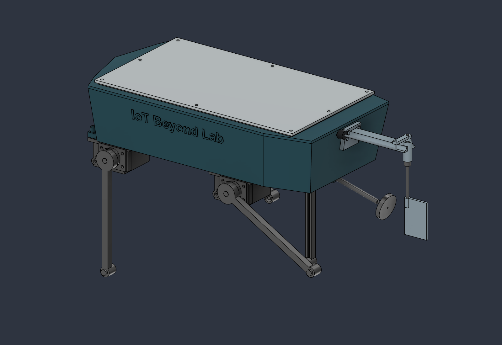

# Energized Water Scan

**Rev-C.1 — four independently articulated probes, 27 September 2026.** This first redesign iteration adds 0–90° probe angles and 150 mm deployed reach below the hull bottom, and removes the magnetometer.

**Mechanical concept / fit prototype, not a water-ready assembly.** Compact dry servos drive external insulated arms through replaceable seal cartridges. Servo-horn coupling, shaft/pin retention, wet lead routing and seal qualification remain explicit holds. Existing steering, harness, flotation and front-end validation gates remain open.

## Start here

- [Design decisions, geometry, 3D sensing and limitations](docs/RevC_Articulated_Probes.md)
- [Current BOM and 21-piece print schedule](docs/Print_and_Procurement.md)
- [New component/material references and nominal interface drawing schedule](docs/RevC_Mechanical_References.md)
- [Wiring, assembly and measurement sequence](docs/Wiring_and_Assembly.md)
- [Editable Fusion design](cad/Energized_Water_Scanner_RevC1.f3d) and [physical STEP assembly](cad/Energized_Water_Scanner_RevC1.step)
- [Revision-matched fit-prototype STL package](prints/Print_STLs.zip)
- [BRep and sampled-motion audit](verification/RevC_Assembly_Audit.json), [observability/math tests](verification/RevC_Observability.json), [export evidence](verification/RevC_Export_Check.json)

Four fore–aft arms fold parallel to the bottom at 0° and point down at 90°. Their 132 mm hinge-to-tip radius plus 18 mm hinge drop gives 150 mm deployment depth. Stowed probes remain below the hull; the pods are not flush. All four angles are independently editable in Fusion as `probe_E1_angle` through `probe_E4_angle`; use the [pose script](scripts/revc_set_pose.py) for checked 0–90° presets.

The default measurement pose is 90°, 30°, 30°, 90°, giving a non-coplanar set of electrode tips. Equal-angle poses cannot recover the vertical gradient. The new measurement plan requires three coherent signed voltage differences, not the original two pairs. A [tested geometry demonstrator](scripts/revc_gradient.py) shows the local affine-gradient calculation; it is not instrument firmware or proof of sensing performance.

The 320×170 mm hull, transverse battery, propulsion and steering remain. PRINT_01 and PRINT_03 change, four pods and four arms are added, and PRINT_06–08 are removed. Precision seal cartridges are machined parts; they are not included as functional FDM prints. Every new selected component/material has a mechanical source; incomplete interfaces are marked HOLD rather than presented as proven fits.

No production PCB, calibrated instrument firmware, validated seal lifetime or measured flotation result is supplied. The scanner remains experimental equipment; a negative reading cannot establish that water is safe. Without the magnetometer there is no magnetic heading reference; estimates are in the boat's coordinate frame.

## Repository layout

| Folder | Contents |
|---|---|
|cad/|Current Rev-C.1 F3D/STEP and historical exports|
|prints/|Current 21 fit-prototype STLs and matching ZIP|
|docs/|Current design/BOM/assembly instructions and clearly historical revisions|
|previews/|Stowed, deployed, measurement and module inspection images|
|verification/|Current `RevC_*` evidence; prior revision reports retained|
|scripts/|Reproducible migration, angle presets, audits, exports and numerical checks|
|coupons/|Historical E2 motor-support coupon; not a Rev-C probe-interface qualification|

Rev-A/B documents describe earlier designs and do not supersede Rev-C.1. The [Rev-B.4 audit](docs/RevB4_Component_Compatibility.md) remains useful for unchanged purchased parts, subject to the current BOM removals and new holds.
