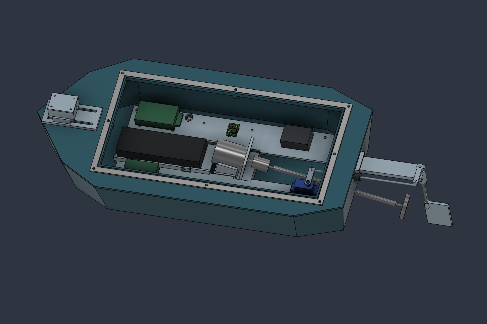

# Energized Water Scan

**Rev-A.1 — light mechanical design audit, 24 September 2026.** An experimental remotely controlled surface craft with four electrodes and a magnetometer. This is a prototype packaging design, not a qualified production release.

## Start here

- [Audit findings, fixes, verification scope and remaining limitations](docs/RevA1_Design_Audit.md)
- [Print, procurement and assembly checklist](docs/Print_and_Procurement.md)
- [Editable Fusion design — Rev-A.1](cad/Energized_Water_Scanner_RevA1.f3d)
- [Physical assembly STEP — Rev-A.1](cad/Energized_Water_Scanner_RevA1.step)
- [All 12 printable parts](prints/Print_STLs.zip), or [individual STLs](prints/)
- [Current assembly/steering report](verification/RevA1_Assembly_Audit.json) and [mesh report](verification/RevA1_STL_Check.json)
- [Original hardware baseline](docs/Energized_Water_Scan_RevA_Hardware_and_CAD.md), retained as historical design intent

## What changed

Closed the 9 mm electrode head/seal gaps; moved the battery 6 mm forward to clear the motor-terminal space and extended its tray; cleared the reserved power-wire route; added a tiller cross-pin interface and lower rudder collar envelope; enlarged the steering port after finding a near-full-travel rod/hull collision. The regulator CAD is now labeled as a package proxy rather than an exact F5 model.

**Changed prints:** hull (PRINT_01), battery tray (PRINT_04), and tiller (PRINT_17). The complete set still contains 12 parts. Additional purchased pin/collar hardware and a boot compatible with the revised port are required; see the checklist.

## CAD and printing

The F3D retains 40 user parameters and the editable timeline. Some legacy dimensions are fixed; parameter changes require another audit. The STEP includes physical printed and purchased-part representations, including the hatch, and excludes hidden optional/reference/clearance geometry. It is not a print plate.

STLs are in millimeters and retain assembly coordinates. Orient/place each in the slicer. The 400 mm hull requires an appropriate build volume. Default hull supports and stern sleeve are integral. Optional mast/boom layouts are retained only in the native design.

## Verification and limits

CAD results: **89 physical solids, zero detected cross-component overlaps, zero feature warnings/errors, and no collisions with tested static obstacles at 71 sampled steering positions (±35°).** See the audit and JSON reports for exclusions. Static solid intersections, sampled ideal steering motion and mesh topology are CAD checks; they do not establish continuous steering clearance, real boot behavior, manufacturing tolerances, structural strength, sealing or flotation. Validate these in a dry assembly and controlled prototype tests.

The sensing system is experimental and is not protective equipment. A negative measurement does not establish that water is safe. This repository contains no validated detection firmware, production PCB or calibrated hazard thresholds.

## Repository layout

| Folder | Contents |
|---|---|
| `cad/` | Current native F3D and physical STEP |
| `prints/` | Twelve current individual STLs and matching ZIP |
| `docs/` | Current audit/checklist and historical hardware baseline |
| `previews/` | Current RevA1 and previous RevA assembly views |
| `verification/` | Current `RevA1_*` reports; unprefixed reports are historical Rev-A evidence |
| `scripts/` | Re-runnable Fusion and STL verification scripts |

Earlier CAD exports are available in Git history. Do not mix the previous print package or verification claims with the current release.
