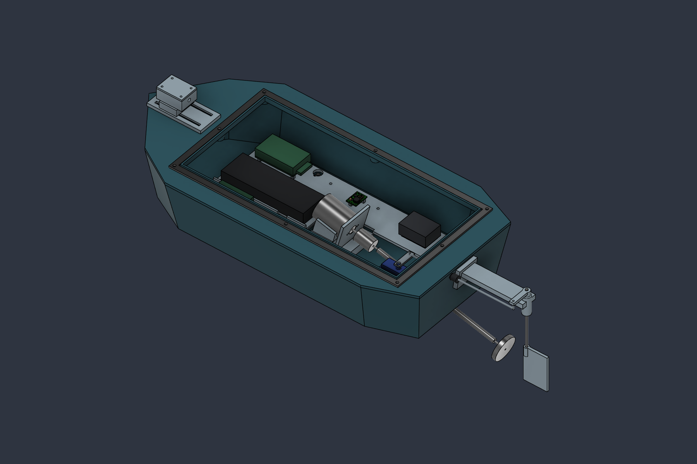

# Energized Water Scan

Rev-A mechanical prototype for a small remotely controlled surface craft with four electrodes and a magnetometer. This repository contains the **audited CAD revision dated 2026-09-23**.

## Start here

- [Print and procurement checklist, audit changes and limitations](docs/Print_and_Procurement.md)
- [Original hardware and CAD baseline](docs/Energized_Water_Scan_RevA_Hardware_and_CAD.md)
- [Editable Autodesk Fusion design](cad/Energized_Water_Scanner_RevA.f3d)
- [Neutral STEP assembly](cad/Energized_Water_Scanner_RevA.step)
- [All 12 printable parts (ZIP)](prints/Print_STLs.zip), or [individual STL files](prints/)
- [Verification reports](verification/)

## CAD and printing

Open the F3D archive in Autodesk Fusion to retain the 39 parameters and editable timeline. The STEP assembly represents purchased components and physical printed parts; it is not a print plate. Imported and simplified purchased-part geometry is for packaging.

Print one of each of the 12 STL files. Units are millimeters; files retain assembly coordinates, so orient and place each part on the bed in the slicer. The hull is 400 mm long. Hull supports and the stern-tube sleeve are integral, not separate prints. Alternative mast/boom configurations remain in the Fusion file but are excluded from the default print set. Hidden datum/reference components preserve design history.

Audit results: 87 physical solids, no detected cross-component volume overlaps, no timeline warnings/errors, and 12 closed STL meshes with no unmatched/nonmanifold edges in the export check. This check does not establish full steering travel, print process capability, sealing, strength or flotation.

## Prototype status

This is a prototype packaging design, **not a qualified production release**. Verify purchased-part fits, attachment/retention, wiring and full steering motion in a dry assembly; test sealing and flotation before use. The servo horn and flexible boot are procurement envelopes. Fastener lengths in the checklist are starting selections to verify against the actual assembly.

The sensing system is experimental and is not protective equipment. A negative reading does not establish that water is safe. The repository does not contain validated detection firmware, a production PCB or calibrated hazard thresholds.

## Contents

| Folder | Contents |
|---|---|
| `cad/` | Current audited native F3D and physical STEP assembly |
| `prints/` | Twelve individual STL files and a matching ZIP |
| `docs/` | Original requirements, build/procurement checklist and audit notes |
| `previews/` | Open and closed assembly images |
| `verification/` | Assembly interference inventory, feature health and STL checks |

The original baseline describes intent; the audited checklist documents the delivered geometry and unresolved fit checks. Earlier superseded CAD exports and temporary automation files are excluded.
