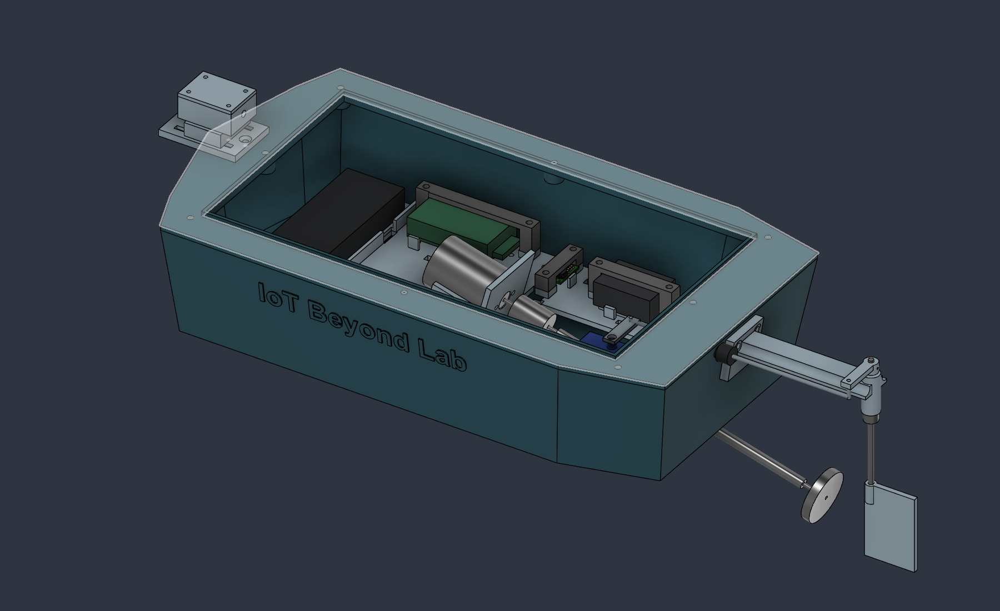

# Energized Water Scan

**Rev-B.2 — electrode access and screw retention, 25 September 2026.** Focused revision of the existing 320 × 170 mm boat: E2 side wire exit, electrode ring-lug envelopes, tray wire riser, screw mounting, electronics capture bridges, and **IoT Beyond Lab** hull branding.

**Not released for production.** Exact hardware, screw-fit coupons, actual cable/connector clearances, sealed magnetometer entry and physical assembly/leak tests remain open.

## Start here

- [Current changes and prioritized prototype-production gates](docs/RevB2_Prototype_Readiness.md)
- [Wiring and assembly sequence](docs/Wiring_and_Assembly.md)
- [Print and procurement checklist](docs/Print_and_Procurement.md)
- [Rev-B.1 audit and broader next-step reference](docs/RevB1_Production_and_Wiring_Audit.md)
- [Editable Rev-B.2 Fusion design](cad/Energized_Water_Scanner_RevB2.f3d)
- [Physical Rev-B.2 STEP assembly](cad/Energized_Water_Scanner_RevB2.step)
- [All 16 printable parts](prints/Print_STLs.zip), or [individual STLs](prints/)
- [Assembly/steering audit](verification/RevB2_Assembly_Audit.json), [service audit](verification/RevB2_Service_Audit.json), [wiring/support audit](verification/RevB2_Wiring_Support_Audit.json)
- [STL checks](verification/RevB2_STL_Check.json) and [export verification](verification/RevB2_Export_Check.json)

## Assembly intent

E1–E4 connect by labeled ring lugs to the protected front end, then the ADC. E2 sits beneath the motor: wire and tighten it before installing the cradle/motor. Its new side exit leads toward the sensor side of the tray. The new tray riser is for conductors; install service connectors above the tray. The front-end circuit and connector pinout are still unvalidated.

PRINT_18–21 are four screw-secured capture bridges for the ESP32, front-end envelope, regulator proxy and ESC. They seat on tray pedestals, leaving nominal package clearance rather than using screw torque to press on electronics. Verify the real boards, headers, connectors and thermal clearances before accepting the restraints.

Permanent printed attachments use M3 blind pilots where space allows. M2 remains at small board/servo interfaces, and the motor retains its factory M2.6 interface. The regularly removed main hatch retains M3 screws/inserts and its gasket. The [retention schedule](docs/RevB2_Prototype_Readiness.md#retention-and-fastening-schedule) records screw starting lengths and the deliberate bonded/strapped exceptions.

## CAD, printing and verification limits

Use Rev-B.2 exports together. STLs use millimeters and assembly coordinates; orient them in the slicer. The hull requires a build volume larger than its 320 × 170 mm footprint plus print-process margins. Reprint PRINT_01, PRINT_03, PRINT_06, PRINT_09, PRINT_11 and PRINT_14 relative to Rev-B.1; add PRINT_18–21. Other parts retain their shapes and are included in the consistent export set.

The 245 × 130 mm hatch and the transverse battery layout remain. Disconnect and remove the battery and its tray for USB access. Disconnect hull wiring and remove the servo horn/linkage before electronics-tray removal. Some legacy geometry uses fixed coordinates; changing master parameters requires a new audit.

The reports distinguish physical-solid collisions, sampled motion/service checks, route allocations and intentional bearing/fastener fits. They do not certify real connector fit, printed screw strength, water sealing, flotation, continuous motion or sensing performance. The experimental sensing system is not protective equipment; a negative measurement does not establish that water is safe. No production PCB, validated firmware or calibrated hazard threshold is supplied.

## Repository layout

| Folder | Contents |
|---|---|
| `cad/` | Current Rev-B.2 F3D/STEP and historical exports |
| `prints/` | Sixteen current STLs and matching ZIP |
| `docs/` | Current integration instructions/readiness gates and historical design evidence |
| `previews/` | Revision-specific assembly and interface images |
| `verification/` | Current `RevB2_*` reports; previous revisions retained as historical evidence |
| `scripts/` | Re-runnable Fusion audits, migration source and export checks |

Historical [Rev-B layout](docs/RevB_Compact_Enclosure.md), [Rev-A.1 audit](docs/RevA1_Design_Audit.md) and [original hardware brief](docs/Energized_Water_Scan_RevA_Hardware_and_CAD.md) explain prior design intent. Their coordinates and fabrication instructions do not supersede the current revision.
