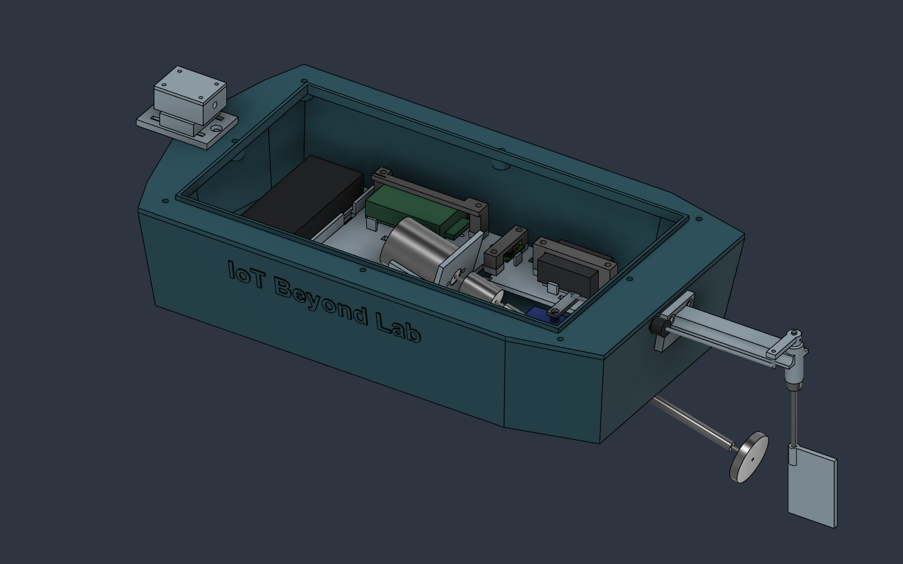

# Energized Water Scan

**Rev-B.3 — assembly access corrections, 25 September 2026.** Clears front tray screw heads in the battery tray, opens the ESP32 header connection area and increases motor-support screw tip clearance. Prior E2 wiring, screw retention and branding are retained.

**Not ready for complete prototype assembly.** Staged procurement and interface trials can proceed. E1 tightening access, exact hardware, cable/connector packaging, sealed magnetometer entry and physical assembly/leak tests remain open. The extra access audit explicitly sets `assembly_release_passed: false`.

## Start here

- [Current changes, assembly blockers and H2D/X1C print plan](docs/RevB3_Assembly_Readiness.md)
- [Historical Rev-B.2 interfaces and retained fastening schedule](docs/RevB2_Prototype_Readiness.md)
- [Wiring and assembly sequence](docs/Wiring_and_Assembly.md)
- [Print and procurement checklist](docs/Print_and_Procurement.md)
- [Rev-B.1 audit and broader next-step reference](docs/RevB1_Production_and_Wiring_Audit.md)
- [Editable Rev-B.3 Fusion design](cad/Energized_Water_Scanner_RevB3.f3d)
- [Physical Rev-B.3 STEP assembly](cad/Energized_Water_Scanner_RevB3.step)
- [All 16 printable parts](prints/Print_STLs.zip), or [individual STLs](prints/)
- [Assembly/steering audit](verification/RevB3_Assembly_Audit.json), [service audit](verification/RevB3_Service_Audit.json), [wiring/support audit](verification/RevB3_Wiring_Support_Audit.json), [fastener/access audit including blocked E1 access](verification/RevB3_Fastener_Access_Audit.json)
- [STL checks](verification/RevB3_STL_Check.json) and [export verification](verification/RevB3_Export_Check.json)
- [Separate motor/electrode fit coupon](coupons/)

## Assembly intent

Install the electronics-tray screws before the battery tray; its new front scallops clear typical M3 heads. The revised ESP32 bridge leaves an upper header access window, but the real board, leads and retention still need a fit trial. E1 cannot be reached by a straight-down socket through the fixed bow deck; actual compact-tool access is an unresolved blocker. Four motor-support pilots now provide 2 mm nominal M3×8 tip clearance.

E1–E4 connect by labeled ring lugs to the protected front end, then the ADC. E2 sits beneath the motor: wire and tighten it before installing the cradle/motor. Its new side exit leads toward the sensor side of the tray. The new tray riser is for conductors; install service connectors above the tray. The front-end circuit and connector pinout are still unvalidated.

PRINT_18–21 are four screw-secured capture bridges for the ESP32, front-end envelope, regulator proxy and ESC. They seat on tray pedestals, leaving nominal package clearance rather than using screw torque to press on electronics. Verify the real boards, headers, connectors and thermal clearances before accepting the restraints.

Permanent printed attachments use M3 blind pilots where space allows. M2 remains at small board/servo interfaces, and the motor retains its factory M2.6 interface. The regularly removed main hatch retains M3 screws/inserts and its gasket. The [retention schedule](docs/RevB2_Prototype_Readiness.md#retention-and-fastening-schedule) records screw starting lengths and the deliberate bonded/strapped exceptions.

## CAD, printing and verification limits

Use Rev-B.3 exports together. STLs use millimeters and assembly coordinates; orient them in the slicer without scaling. Reprint PRINT_01, PRINT_04 and PRINT_18 relative to Rev-B.2. Plan both the 320 × 170 mm hull and 269 × 154 mm hatch on the H2D; smaller parts can use the X1C. The hull leaves only 5 mm total in the H2D's 325 mm single-nozzle width before print aids. See the current report for profile, brim and material qualification limits.

The 245 × 130 mm hatch and the transverse battery layout remain. Disconnect and remove the battery and its tray for USB access. Disconnect hull wiring and remove the servo horn/linkage before electronics-tray removal. Some legacy geometry uses fixed coordinates; changing master parameters requires a new audit.

The reports distinguish physical-solid collisions, sampled motion/service checks, route allocations and intentional bearing/fastener fits. They do not certify real connector fit, printed screw strength, water sealing, flotation, continuous motion or sensing performance. The experimental sensing system is not protective equipment; a negative measurement does not establish that water is safe. No production PCB, validated firmware or calibrated hazard threshold is supplied.

## Repository layout

| Folder | Contents |
|---|---|
| `cad/` | Current Rev-B.3 F3D/STEP and historical exports |
| `prints/` | Sixteen current STLs and matching ZIP |
| `docs/` | Current integration instructions/readiness gates and historical design evidence |
| `previews/` | Revision-specific assembly and interface images |
| `verification/` | Current `RevB3_*` reports; previous revisions retained as historical evidence |
| `coupons/` | Separate open-section interface sample; not a watertight assembly part |
| `scripts/` | Re-runnable Fusion audits, migration source and export checks |

Historical [Rev-B layout](docs/RevB_Compact_Enclosure.md), [Rev-A.1 audit](docs/RevA1_Design_Audit.md) and [original hardware brief](docs/Energized_Water_Scan_RevA_Hardware_and_CAD.md) explain prior design intent. Their coordinates and fabrication instructions do not supersede the current revision.

