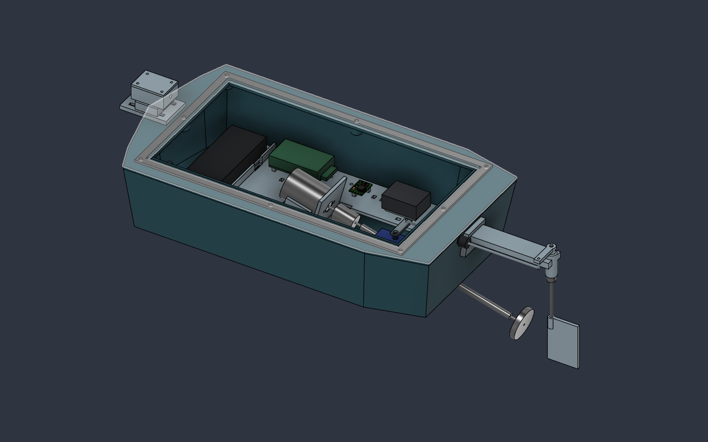

# Energized Water Scan

**Rev-B.1 — wiring/assembly audit, 25 September 2026.** Added twelve tray slots for harness strain relief and ESC retention. Hull remains **320 × 170 mm** and purchased components retain their original sizes. **Not production-ready:** exact integration hardware, board retention, sealed sensor-cable entry, loaded power tests and physical print/assembly validation remain open.

## Start here

- [Current production audit, print guidance and custom-PCB assessment](docs/RevB1_Production_and_Wiring_Audit.md)
- [Wiring connection schedule and assembly/service instructions](docs/Wiring_and_Assembly.md)
- [Compact layout, dimensions, assembly order and limits](docs/RevB_Compact_Enclosure.md)
- [Current print and procurement checklist](docs/Print_and_Procurement.md)
- [Editable Fusion design — Rev-B.1](cad/Energized_Water_Scanner_RevB1.f3d)
- [Physical assembly STEP — Rev-B.1](cad/Energized_Water_Scanner_RevB1.step)
- [All 12 current printable parts](prints/Print_STLs.zip), or [individual STLs](prints/)
- [Assembly and steering audit](verification/RevB1_Assembly_Audit.json), [service audit](verification/RevB1_Service_Audit.json), and [STL checks](verification/RevB1_STL_Check.json)
- [Export verification](verification/RevB1_Export_Check.json)

## What changed

Rev-B.1 adds five paired harness tie-down stations and two ESC restraint slots to the electronics tray. Reprint **PRINT_03 only** if you already have Rev-B parts. The audit identifies the XT60/small-Tamiya mismatch, the servo/BEC current-budget check and USB power-isolation requirement. A compact interconnect PCB is recommended for repeatability after circuit and connector validation; none was designed.

The following describes the retained Rev-B layout:

The battery sits transversely across the bow, centered laterally. The controller, front-end board, ADC and regulator are repacked beside the drivetrain, with matching supports. The shorter electronics tray has relocated mounting pillars and transverse strap passages. Hatch, gasket, lip and fasteners follow the shorter opening. The magnetometer rail is shortened and moved with its pod; shaft and steering alignment remain intact.

The 245 × 130 mm hatch allows the electronics tray to lift out after removing the battery and its tray, disconnecting wiring, and removing the servo horn/linkage. **USB access also requires removal of the battery and battery tray.** Assemble and wire the boards outside the hull before installing the tray.

The chosen length reduction is 80 mm of the requested maximum 100 mm. A 300 mm hull has not been validated. The default craft including its forward sensor rail and external rudder is approximately **445 mm long**; 320 mm refers to the hull alone.

## CAD and printing

Use the Rev-B.1 files together. Only the electronics tray changes shape from Rev-B; all STLs are regenerated in millimeters and retain assembly coordinates. Place and orient them in the slicer. The 320 mm hull still requires an appropriate printer build volume. See the current audit for part-specific print considerations.

The native F3D retains 40 user parameters and an editable timeline. Some interfaces remain fixed dimensions; changing master parameters requires a new audit. STEP contains physical printed and purchased-part representations, including the hatch, with optional/reference/clearance geometry excluded.

## Verification and limits

CAD checks report **89 physical solids, zero detected cross-component volume overlaps and zero feature warnings/errors**. The 71 sampled steering positions (±35°), sampled tray lift, screwdriver corridors and battery pull-loop allocation have no detected tested-obstacle collisions. The reports document exclusions, expected service-volume intersections and required disassembly. All twelve STL meshes pass the topology checks.

These are geometric checks, not proof of real connector fit, hand assembly, print tolerances, continuous motion, strength, waterproofing, flotation or sensing performance. Dry-assemble actual hardware and repeat trim, leak and magnetic-interference tests for the smaller hull.

The sensing system is experimental and is not protective equipment. A negative measurement does not establish that water is safe. There is no validated detection firmware, production PCB or calibrated hazard threshold in this repository.

## Repository layout

| Folder | Contents |
|---|---|
| `cad/` | Rev-B.1 F3D and physical STEP; previous exports retained for reference |
| `prints/` | Twelve current Rev-B.1 STLs and matching ZIP |
| `docs/` | Current compact-layout report/checklist and historical baseline/audit |
| `previews/` | Current Rev-B and historical assembly views |
| `verification/` | Current `RevB1_*` evidence; other reports are historical |
| `scripts/` | Re-runnable current Fusion, service-access and STL audits |

Historical [Rev-A.1 audit](docs/RevA1_Design_Audit.md) and [original hardware baseline](docs/Energized_Water_Scan_RevA_Hardware_and_CAD.md) explain prior design intent. Their coordinates and print instructions do not supersede Rev-B.
