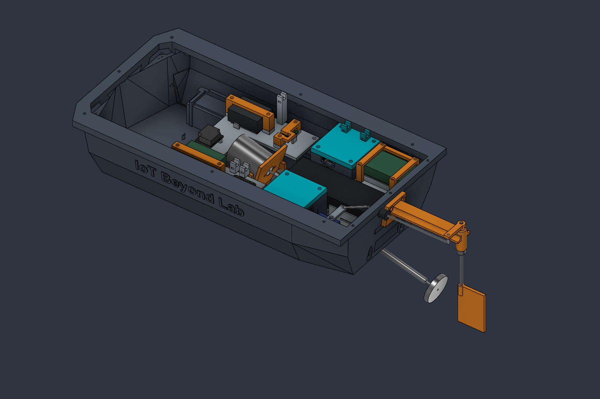

# Energized Water Scanner USV

Energized Water Scanner is a small unmanned surface vessel research platform for measuring voltage differences in water. The current **Rev-F** design has **two** independently actuated probes, a rear ESP32 controller, a shorter electronics cassette and a narrower lower hull.

## Current design — 2 October 2026

- Remove the forward-driven outer E1/E3 probes and their mechanisms; retain E2/E4, their two recessed wet channels and two internal covers.
- Move the ESP32 onto a removable rear starboard shelf beside the battery.
- Move the main electronics cassette 8 mm aft and shorten its forward edge, freeing 34 mm ahead of it.
- Replace the outer channels and projecting strips with sloping sealed hull stock. Bottom beam is now 125.2 mm; the upper hatch flange remains 170 mm wide. Hull length remains 320 mm.
- Remove obsolete mounts and reference components. The current print package has **19 pieces**, down from 23.

The source of truth is the saved live **Energized_Water_Scanner** Fusion document. Repository STL/STEP/F3D files are historical. This update contains **written documentation and native viewport PNGs only**.

## Build documents

- [Rev-F changes, images and measured CAD checks](docs/RevF_Changes.md)
- [Current mechanical layout and interfaces](docs/Design.md)
- [Current print list and procurement delta](docs/RevF_Procurement.md)
- [Wiring and assembly](docs/Wiring_and_Assembly.md)
- [Build qualification and leakage paths](docs/Build_Qualification.md)
- [Waterproofing audit](docs/Waterproofing_and_Design_Audit.md)

The existing BOM.xlsx, BOM.csv and connected Google Sheet were prepared for the earlier four-probe design. Use the **Rev-F procurement delta** for current quantities and fasteners. Do not purchase or print the old four-probe package unchanged. Prior [Rev-E2](docs/RevE2_Changes.md), [Rev-E1](docs/RevE1_Changes.md) and [component audit](docs/Mechanical_Audit_2026-10-01.md) remain historical references.

## Measurement and build status

Two electrodes provide **one differential measurement along their separation**. They cannot reproduce the previous four-electrode three-dimensional gradient estimate. The old four-probe presets and gradient scripts are historical and are not validated for Rev-F. The protected analog front end, calibration and firmware still require engineering validation.

The design supports a staged **mechanical fit prototype**. CAD clearance checks do not qualify a printed hull for water operation. Exact horn/pulley/belt and shaft retention, actual controller clamp contacts/connectors, seal water duty, potting, stern-tube internal sealing, steering motion and loaded flotation remain qualification gates. Fit one retained actuator before duplicating it or committing to a full hull build.

This is not a certified electrical-safety instrument. A low or absent reading does not establish that water is safe.

## PCB redesign work in progress

The requested tray-replacement PCB now has a [measured mechanical template](pcb/engineering/EWS_mechanical_template.kicad_pcb) and [engineering requirements/findings](docs/PCB_Engineering_Draft.md). The new requirement is separate sensitive and high-voltage ranges with a 600 V AC RMS utility-mains fault target. **This is not a completed or fabrication-ready PCB:** the protected dual-range circuit, component layout, routing and validation remain unfinished. The Fusion assembly and current print set have not been changed for this draft. The template's mechanical DRC is not electrical or high-voltage qualification.
