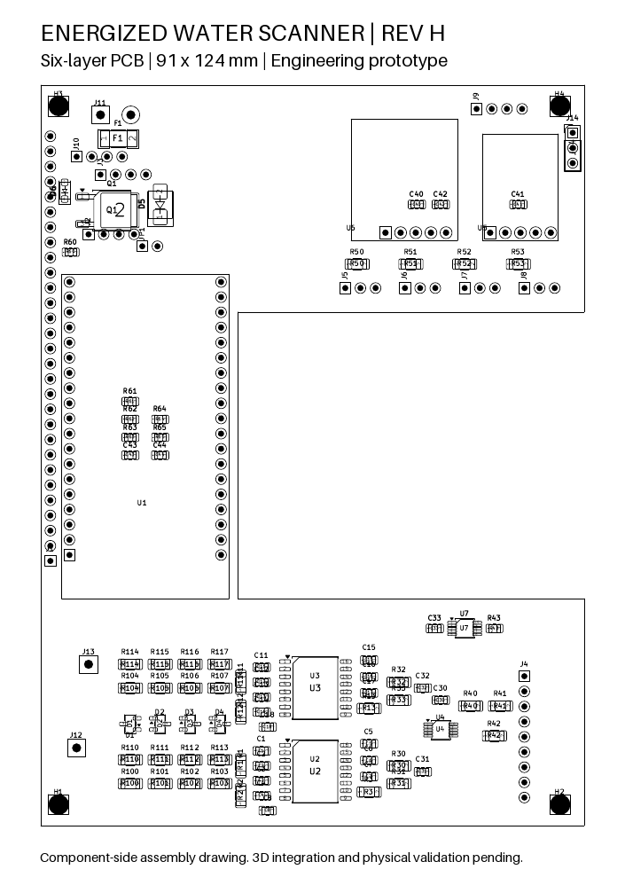

# Energized Water Scanner USV

A small unmanned surface vessel for research into detecting and mapping electrical hazards in flooded areas. Two deployable electrodes, E2/E4, measure voltage difference; the vessel must combine that measurement with validated probe pose, orientation and location. A low reading cannot establish that water is safe.

## Current state — 4 October 2026

**Electronics: Rev H engineering prototype. Mechanical assembly: live Fusion Rev I.** The PCB retains the 91 × 124 mm U-shaped perimeter, 58 × 48 mm motor opening, four mounting holes and 2 mm thickness. Six copper layers accommodate the revised electronics. The live Fusion assembly has been updated for Rev H placement, hull cleanup and corrective closure of obsolete bow/stern openings. Repository 3D exports remain historical; this update contains documentation and BOM changes only. See the [CAD audit](docs/CAD_Audit_2026-10-04.md) for verified results and remaining holds.

- [PCB design, operating limits and assembly](pcb/RevH/README.md)
- [Editable KiCad project](pcb/RevH/EWS_RevH.kicad_pro), [schematic PDF](pcb/RevH/EWS_RevH_schematic.pdf), [PCB BOM](pcb/RevH/BOM.csv), [connector pin map](pcb/RevH/PIN_MAP.md)
- [System design](docs/Design.md), [assembly and procurement](docs/Wiring_and_Assembly.md), [remaining qualification work](docs/Build_Qualification.md)
- [System BOM](BOM.csv): mechanical/harness items plus one assembled carrier. Components on that carrier are listed only in its PCB BOM.

Rev H adds a dedicated ADC per voltage range, hard-wired diagnostic/ready signals, reverse-input protection, a PCB-branch fuse and transient suppressor, battery monitoring and a dry-compartment ingress-sensor interface. The circuit targets sensitive measurements and a separate 600 V RMS, 50/60 Hz fault range. These are unqualified design targets. Bench calibration, insulation/protection review, physical fault testing and environmental qualification remain open. No validated acquisition firmware is supplied.

Historical Rev G previews and 3D exports are not the current mechanical authority. Use the saved live `Energized_Water_Scanner` Fusion document.

Two electrodes provide one field projection, not a full 3D field map or a direct measurement of floodwater current. Current-density estimates require independently measured conductivity and a valid field/geometry model. Fast transient measurement and an electrical-safety clearance decision are not released capabilities.

## Next milestones

1. Review the new PCB and validate components, protection, calibration, acquisition timing and fault behavior on a controlled bench.
2. Resolve the remaining mechanical holds in the CAD audit; verify actual components, wiring, seal compression and assembly tolerances.
3. Resolve actuator hardware and sealing, then test the unpowered hull for leakage and loaded flotation.
4. Implement and validate acquisition, invalid-state handling, pose/location logging and mapping; obtain appropriate laboratory qualification before hazardous exposure.

Detailed revision narratives and superseded preview images have been removed from the current documentation; Git history preserves them. Existing exported CAD releases are unchanged and superseded by the live Fusion assembly for this iteration. The `pcb/RevG` files are retained as the historical electrical baseline; use Rev H for new electronics work. Historical scripts and verification records retain their original scope and must not be treated as current acceptance evidence.
