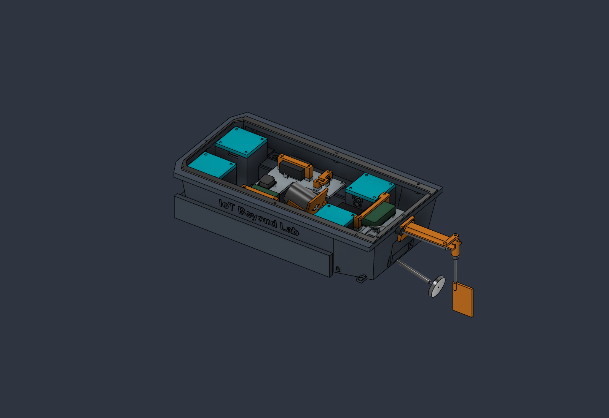

# Energized Water Scan

**Rev-E — alignment and strength update, 28 September 2026.** The hull is restored to its assembly datum and grounded. Thicker probe channels, arms, covers, motor supports and battery cradle improve the fit prototype. The hull footprint is **320 × 176 mm**; there are **23 printed parts**.

- [Design, alignment findings and wet/dry interfaces](docs/Design.md)
- [Current BOM workbook](BOM.xlsx) · [CSV](BOM.csv) · [live Google BOM](https://docs.google.com/spreadsheets/d/129cdgjaWSUko2g8DQrpoiBbZISE-RidNFI1MubGNuU8/edit#gid=372890739)
- [Print and procurement schedule](docs/Print_and_Procurement.md) · [assembly and wiring](docs/Wiring_and_Assembly.md)
- [Editable Fusion archive](cad/Energized_Water_Scanner_RevE.f3d) · [physical STEP](cad/Energized_Water_Scanner_RevE.step) · [STL package](prints/Print_STLs.zip)
- [Assembly audit](verification/RevE_Assembly_Audit.json) · [interface clearances](verification/RevE_Interfaces.json) · [service audit](verification/RevE_Service_Audit.json) · [export verification](verification/RevE_Export_Check.json)
- [Current scripts](scripts/README.md) · [consolidated history](HISTORY.md)

The hull's accidental translation caused the systematic misalignment. The propulsion train itself is coaxial at its intended 15° inclination. Moving the battery 1.5 mm aft increases its nominal coupling clearance to 2.081 mm.

Each wet probe is separated from the servo space by a shaft seal, cartridge gasket and distinct potted wire entry. These interfaces are modeled; actual waterproofness remains untested. Internal covers are service covers and do not create individually sealed servo chambers.

**Mechanical fit prototype, not a released water-ready instrument.** Timing-drive supplier selection, horn adapters, shaft retention, steering travel, flexible wiring, seal/potting qualification and loaded flotation remain open. The strengthened hull adds approximately 118 cm³ of solid volume. The geometry demonstrator is not instrument firmware, and an absent reading cannot establish safe water.

Only the latest deliverables remain in the working tree. Previous documentation, reports and revision manifests are consolidated in HISTORY.md; Git history remains intact.

The Google Sheet is a prioritized **28-line procurement list**, with major electronics first. It excludes owned screws and minor supplies and combines selected mechanical kits. The repository BOM remains the complete **79-line assembly inventory**, including 23 printed pieces. These are different views of the same Rev-E design, not alternate revisions.
