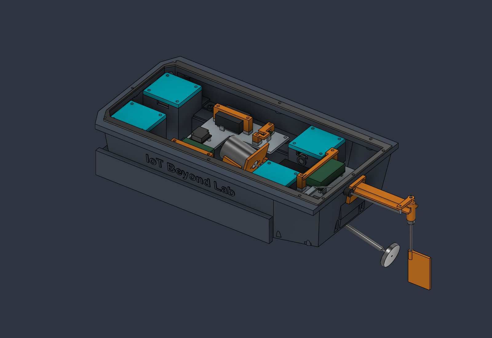
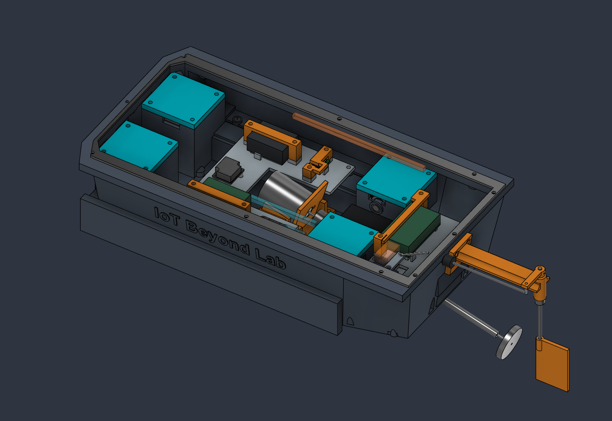
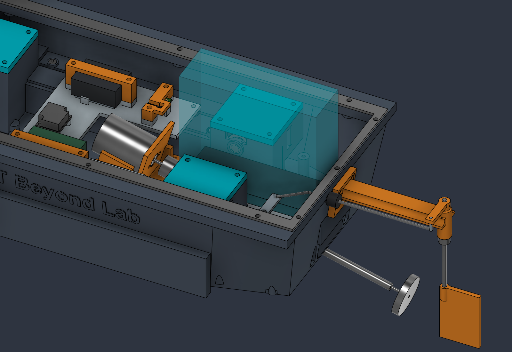

# Live Fusion mechanical and procurement audit — 1 October 2026

The active `Energized_Water_Scanner` Fusion document was inspected directly through its local MCP server. Repository documentation, scripts and the complete 79-line BOM supplied context; repository STL, STEP and Fusion archives were not read. The BOM is unchanged. This pass saves the native Fusion document and publishes only documentation and viewport photographs.

The vessel remains a fit prototype for spatial potential-gradient research. Most named supplier **nominal envelopes** agree with the live model. This does not release the transmission, waterproofing, sensing circuit or complete assembly for manufacture.

## Problems found and changes saved

| Finding | Disposition |
|---|---|
| Old USB, ESC and battery service references describe earlier electronics positions | Renamed the old component `CLEARANCES_LEGACY_service_and_wiring_DO_NOT_USE`, kept it hidden, and added `CLEARANCES_Audit_2026_10_01` at the current positions. These solids are reference allocations, not purchased or printed parts. |
| A 12 × 40 × 10 mm straight USB service box at the current controller overlaps the steering servo by 608.17 mm³ | Added a provisional 12 × 20 × 10 mm compact-plug allocation, which clears the modeled assembly. Confirm the actual connector face, plug and cable bend. Remove the complete controller bridge for a longer straight plug. |
| Claimed straight battery lift intersects the sealed rudder-mount caps | Corrected the removal path: disconnect pack; remove hatch and complete controller bridge; release both straps; lift 6 mm, slide 3 mm toward the bow (−X), then lift out. The caps extend to X190 mm; the shifted pack ends at X189 mm. **Do not cut or drill the caps.** |
| Old analog corridor intersects the front-end allocation; old power corridor intersects hull and stowed probe | Shifted the analog spine to X−20…80, Y−26…−22, Z42…46 mm. Moved the power spine above the covers to X5…130, Y59…63, Z62…66 mm. Both new 4 × 4 mm allocations clear modeled physical solids. Provide local disconnects and removable restraint before lifting covers. |
| Legacy parameters imply a 170 mm beam and 245 × 130 mm hatch; rear probe comments give the wrong stowed direction | Annotated the legacy values, added measured reference dimensions (beam 176 mm; hatch 319 × 154 mm), and corrected E2/E4 to forward folding. Existing construction expressions and operating angles were preserved. |
| Labels alone can imply supplier accuracy for smooth allocations | Added manufacturer-reference and confidence/hold attributes to relevant live components. Exact horns, pulleys, belts, coupling, boot and unspecified hardware remain allocations. |

No physical part required a defensible nominal resizing from the references obtained. The 145 physical solids have identical before/after bounds and volumes. Changes are to service geometry, annotations and reference data; no seal wall or purchased component was reshaped to fit an uncertain dimension.

The translucent cyan/orange bars and boxes are reference service/wiring allocations. They are not extra fabricated parts.

This cyan volume depicts the final lift after the pack has moved 3 mm toward the bow. The pack remains in its installed pose in the photograph; the caption and staged reference bodies define its removal sequence.

## Purchased-part reference check

“High” below means confidence in the stated nominal outline or interface, **not** fit approval for a substitute seller's part. Purchase the exact revision/brand and confirm actual hardware before printing its mount.

| BOM component | Manufacturer reference versus live model | Confidence and remaining limit |
|---|---|---|
| Hitec HS-65HB, four probe servos | [Hitec drawing](https://www.hiteccs.com/public/uploads/data_sheet/HCS_HS-65HB_Specsheetv2.2_10-1729887930.pdf): 23.6 × 11.6 mm case section, 26 mm drawing datum, 32.3 mm lug span, 28.6 mm mounting pitch, Ø2 mm lug holes, M25T/Ø5 mm output. Live case, holes and spline envelope agree. | **High nominal.** The catalog's 24 mm figure uses a different height description; shrinking the live 26 mm datum would be inappropriate. Supplied horn shape, screw, spline engagement and horn-to-pulley retention are unverified. Servo is dry equipment; IP4X does not qualify immersion. |
| Adafruit ADS1115 PID1085, STEMMA QT revision | [Adafruit](https://www.adafruit.com/product/1085) and [CAD/PCB downloads](https://learn.adafruit.com/adafruit-4-channel-adc-breakouts/downloads): 25.4 × 17.8 × approximately 4.6 mm including QT ports. Live imported board is 25.4 × 17.78 mm, approximately 4.54 mm high, with Ø2.5 mm holes on a 20.32 × 12.7 mm pattern. | **High nominal.** An older or generic ADS1115 breakout is not mechanically interchangeable. Added right-side QT service allocation is provisional; actual cable and headers remain to be checked. |
| Pololu D24V10F5 #2831 logic regulator | [Pololu](https://www.pololu.com/product/2831): approximately 18 × 13 × 3.5 mm. Live manufacturer-family model is 17.78 × 12.7 × 3.816 mm. | **Medium-high outline.** Rounded catalog height is not a reason to trim the imported component. Confirm populated F5 variant, underside support and installed header/lead height. |
| Pololu D24V50F5 #2851 probe regulator | [Dimension drawing](https://www.pololu.com/file/0J1436/d24v50f5-step-down-voltage-regulator-dimensions.pdf): 17.8 × 20.3 × 1.57 mm PCB, 6.1 mm above and 1.1 mm below, Ø2.18 mm mounting holes offset by 13.5 × 16 mm. Live dimensions and hole positions agree. | **High nominal PCB/holes; medium populated allocation.** The drawing allows outline/drill tolerance. Confirm screw heads, insulation, terminals and cooling; a generic top block does not represent every part position. |
| Espressif ESP32-DevKitC V4 | [Official dimension drawing](https://dl.espressif.com/dl/schematics/esp32_devkitc_v4_dimensions.pdf): 27.94 × 48.26 mm PCB plus 6.04 mm antenna overhang (54.30 mm total). Live outline and overhang agree. | **High outline, medium connector clearance.** Actual module, headers, USB shell and switches need confirmation. Preserve antenna clearance and access under the capture bridge. |
| Hobbywing QuicRun WP-1625 ESC | [Hobbywing manual](https://www.hobbywing.com/en/uploads/file/20240315/4806bbdbab8eb9fea0bb26da87d81b00.pdf): 34 × 24 × 14 mm body; live body agrees, on separate 3 mm foam allocation. | **High body, medium exact revision.** Confirm legacy BOM SKU30120000; current regional listings may use another SKU. Wires, switch, connectors and bend/strain relief are missing from the body envelope. No substitute was added to the BOM. |
| Gens Ace GEA222S30X6GT, 2S2200mAh | [Gens Ace](https://gensace.de/de/collections/product-exclu-uav/products/gens-ace-g-tech-soaring-2200mah-7-4v-30c-2s1p-lipo-battery-pack-with-xt60-plug): 104 × 34.5 × 14.5 mm, 126 g. Live block agrees. | **High nominal pack.** XT60, balance connector, leads, straps, padding, swelling and tolerances are excluded. Tube/coupling gaps are only 1.661/2.081 mm; staged removal has only 1 mm nominal clearance at the rudder caps. |
| TowerPro SG90 Digital steering servo | [TowerPro](https://www.towerpro.com.tw/product/sg90-7/) gives a 23 × 12.2 × 29 mm nominal case, matching the live case. | **Medium case; low lug/horn interface.** Manufacturer drawing and summary use differing dimension labels; exact lug pitch, shoulder, horn, screw and spline cannot be confidently released from the sources obtained. Use a genuine sample. Current dogleg and ±35° steering sweep remain unqualified. |
| Mabuchi RS-380PH-4045 | [Mabuchi catalog](https://product.mabuchi-motor.com/result.html?t=1487148886) confirms Ø29.2 × 37.8 mm and approximately 80 g; live can agrees. [Current winding data](https://product.mabuchi-motor.com/detail.html?id=99) identifies the exact 4045 winding. | **High can; medium mounting/shaft interface.** Live Ø2.3 mm shaft and 16 mm M2.6 mounting pitch still require the exact current outline drawing or sample, including allowable screw penetration. Do not derive screw length from a can envelope. |
| Krick65220 shaft/stern tube | [Krick listing](https://www.krickshop.de/Schiffswelle-Stevenrohr-M2-x-153mm-Eco.htm?a=article&ProdNr=65220): 153 mm tube, Ø5.5 mm tube, approximately 178 mm shaft, M2 propeller thread; live nominal allocation agrees. | **High catalog lengths, medium end details.** Confirm axial end play, bearing arrangement and thread engagement. The internal rotating-shaft leakage path is not qualified by bonding the outside of the tube. |
| Krick63800 + 63823 + 63820 coupling | [Krick](https://www.krickshop.de/Zubehoer-Ersatzteile/Zubehoer-fuer-Schiffsmodelle/Schiffswellen-Kupplungen/Stegkupplung-Verbinder-1-Stck-.htm?ProdNr=63800&a=article&p=192) identifies the connector and separate 2.3/2.0 mm inserts. | **Low overall mechanical reference.** Ø15 × 20 mm live solid is an allocation. Assembled length/diameter, insertion depths, set-screw access and misalignment allowance need a dimensioned supplier assembly or sample. |
| Krick/Graupner2307.30 propeller | Live model allocates Ø30 mm RH M2 and a swept blade volume. | **Low exact-SKU reference.** No reliable primary dimensioned reference for this exact BOM number was found. Hub length, blade envelope, thread depth and securing method are not verified. Retain the BOM number pending confirmation. |
| SKF6×16×7 HMSA10RG, four seals | [SKF size table](https://www.skf.com/mm/09433a92e9164581) supports nominal 6/16/7 mm. Live rings agree. | **High size; unqualified water duty.** Ring solids omit lips, spring and press fit. Obtain material/corrosion, oscillation, lubricant, shaft finish and seat recommendations for the operating water. |
| igus GFM-0608-06, four lower bushings | [igus G300 drawing/table](https://www.igus.com/ContentData/Products/Downloads/iglide_G300_FM_USen.pdf): Ø6 shaft, Ø8 housing, Ø12 flange, 6 mm overall length, 1 mm flange. Live dimensions agree; modeled 6.02 mm ID is the lower installed-limit value. | **High nominal.** Drawing gives installed bore 6.020…6.068 mm, housing 8.000…8.015 mm and shaft 5.970…6.000 mm. The forward cartridge has nominal Ø8 mm housing and Ø16 mm seal seats. Release machining tolerances and retention; CAD contact alone is not a press-fit specification. |

The remaining modeled procurement interfaces are intentionally **not manufacturer-accurate released parts**: protected AFE 40 × 30 × 12 mm, eight 20T/2 mm pulley and four 96 mm × 6 mm belt allocations, four upper journals, horn adapters, machined POM cartridges, custom 6 mm shafts/cross-pins, boot, collars, steering horn/pushrod, gaskets and cured-potting/lead allocations. Exact supplier drawings, a released machining drawing or a fitted sample are required as appropriate. Screw and washer solids represent nominal standard hardware; verify actual heads, engagement, retention, insulation and tool approach. The external charger is not an onboard modeled part.

## Verification and practical limits

- Fresh static Boolean checks covered **145 physical solids** at the current stowed pose. No unintended cross-component intersection exceeded 0.001 mm³; no Boolean operation failed. Three within-component intersections are intentional: SG90 case/lugs, propeller hub/shaft and steering horn/pin. Reference/hold solids were excluded.
- Corrected compact USB, QT service, analog spine and power spine allocations clear the current rigid parts. Hatch is removed for connector service. Battery movement was checked at **56 sampled translations**, excluding the removed hatch, complete controller bridge/capture and controller; the cradle remains installed.
- Physical bounds/volumes are unchanged after the reference edits, and the saved document has **1,770 timeline items**, no warning/error states, and no pending modification. The fresh probe sweep completed in Fusion after the HTTP caller timed out: **46 positions per probe, 0–90° in 2° increments**, against static physical parts, with no detected collision or Boolean failure. This is sampled rigid geometry, not a continuous or simultaneous flexible-mechanism proof. Wires, belt motion, actual steering travel, ergonomics and tolerances remain unqualified.
- The 23 modeled print bodies total **1,089.011 cm³**. At fully dense [Prusament PETG's 1.27 g/cm³](https://prusament.com/wp-content/uploads/2022/10/PETG_Prusament_TDS_2021_10_EN.pdf), that is approximately **1.383 kg of plastic**. Adding only the published battery, motor, five servos and ESC masses gives approximately **1.666 kg**, before remaining hardware. This is a conditional dense-solid estimate, not slicer or measured mass. The hull's 320 × 176 × 28 mm bounding prism displaces at most 1.577 L; flooded channels reduce hull displacement and external appendages need separate accounting. The 28 mm reference waterline therefore requires a real mass/displacement/freeboard study; do not infer loaded flotation from CAD volume alone.
- Four probe servos can demand about 3.84 A at their published 4.8 V stall point. Confirm the dedicated regulator's input/thermal/current margin and jam shutdown on hardware. The ESC's 1 A BEC does not establish adequate steering stall margin. Keep regulator outputs separate. [Espressif's guide](https://docs.espressif.com/projects/esp-dev-kits/en/latest/esp32/esp32-devkitc/user_guide.html) requires mutually exclusive USB/5 V/3.3 V power inputs: disconnect the boat supply before USB service.

Continue the [build qualification plan](Build_Qualification.md): qualify one complete actuator, all wet/dry interfaces including the internal stern-tube path, actual harness and battery handling, then loaded flotation and steering in controlled unenergized water. The protected analog front end and coherent signed acquisition remain separate electrical-development gates. This vehicle cannot establish that water is safe.

## Procurement sheet and repository scope

The [Energized Water Scanner tab](https://docs.google.com/spreadsheets/d/129cdgjaWSUko2g8DQrpoiBbZISE-RidNFI1MubGNuU8/edit?gid=372890739#gid=372890739) now contains **11 major electronics/subsystem items**: ESP32, ADS1115, protected AFE, four HS-65HB servos, two regulators, ESC, motor, steering servo, battery and external balance charger. Minor supplies and all mechanical procurement rows were removed from this summary, not from the repository BOM.

All seven columns were retained. Purpose highlights were removed; the native green-header/neutral-band table now resembles the Thermal Camera tab. Names and Taobao search keywords were shortened. Existing price estimates, quantities, currency formulas and price blanks were preserved; totals were adjusted to the retained rows. Four items remain unpriced, so the total remains partial. The Thermal Camera tab was left unchanged.

Repository updates are this report, related written guides and native viewport PNGs. `BOM.csv`, `BOM.xlsx`, CAD/print files, scripts and historical verification files remain unchanged. Use the saved live Fusion document for the current service references; this iteration produces no 3D exports.
