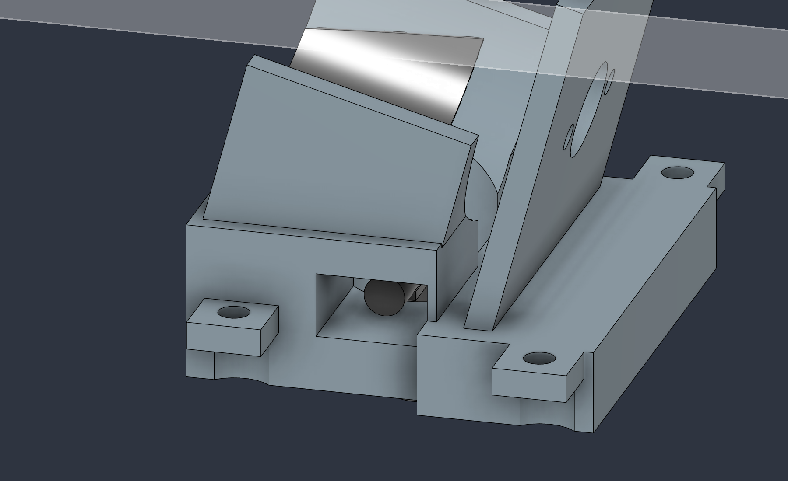
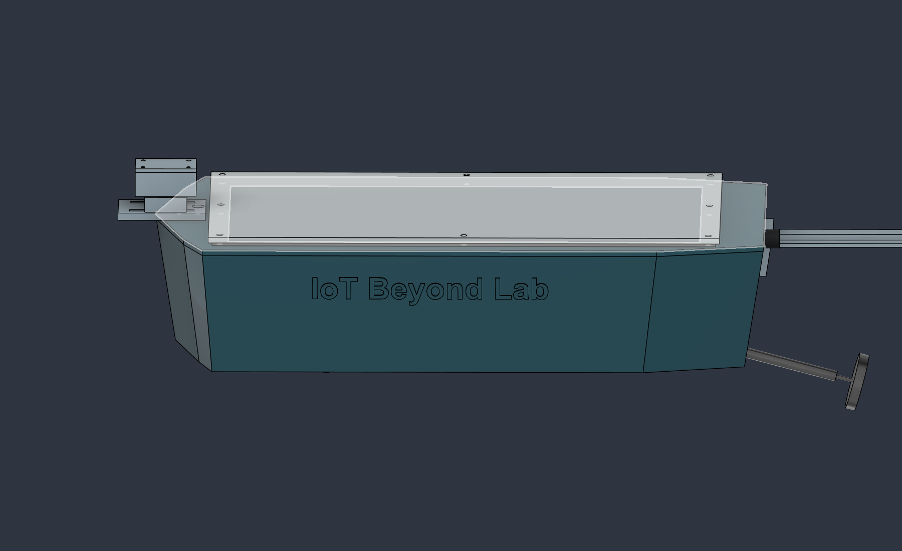

# Rev-B.2 — electrode access, retention and screw mounting

> Current revision: [Rev-B.4 component audit](RevB4_Component_Compatibility.md). Use Rev-B.4 CAD/current print ZIP; only PRINT_20 changes from Rev-B.3. E1 access is now builder-accepted; historical results below are retained. Supplier fit and sealing gates remain open.

> **Superseded in part by [Rev-B.3 assembly audit](RevB3_Assembly_Readiness.md).** Use current Rev-B.3 exports. It corrects front tray screw-head/battery-tray interference, ESP32 header obstruction and motor pilot depth, and identifies unresolved E1 tool access. Results below describe Rev-B.2, not complete assembly release.

25 September 2026. This is a limited interface revision of Rev-B.1, based on repository commit `4a6ef53fa204f29589e1c36442918048740a2d58` and the existing 1012-item Fusion design. The user's four comments define this iteration; the previous audit and historical hardware brief are reference material, not instructions to expand the project.

**Prototype fit-check revision; not a production release.** No new PCB, firmware, propulsion system or hull-size redesign. Actual hardware, printed pilots, connector bodies, seal compression and assembly trials remain release gates.

## Electrode connections and assembly order

The electrodes are four separate signal inputs. Each M4 stainless electrode connects through an internal ring lug to the **protected front end**, then to the corresponding ADS1115 input. They do not connect directly to the motor, battery, hull hardware or unprotected ADC. E1/E2 form the fore/aft pair; E3/E4 form the lateral pair. The protected circuit, bias/reference and final connector pinout still need electrical validation.

| Electrode | Bolt center X,Y (mm) | Lug direction | Route intent |
|---|---|---|---|
| E1 | -100, 0 | +X, toward the tray | Under the bow/battery tray, then to the sensor riser |
| E2 | 40, 0 | -Y | Through the new side opening in the motor cradle, then under the negative-Y tray wing |
| E3 | -30, -55 | +Y | Inboard beneath the tray, then to the sensor riser |
| E4 | -30, 55 | -Y | Inboard beneath the tray, crossing beneath the battery area, then to the sensor riser |

The former internal washer is now a **combined 1 mm ring-lug/crimp packaging envelope**, not a specified purchased lug. The modeled stack is: external bolt head Z=-4…-1, external seal -1…0, hull/boss 0…10, ring lug 10…11, nut 11…14.2, shank tip 17 mm. Lug barrel allocation is Ø4.4 mm with its axis at Z=12.2. Actual barrel, sleeve and lug dimensions must fit or trigger CAD revision. Do not silently add another washer to this stack without checking bolt length and clearance.

E2 previously had a round bolt relief but no side path for the crimp barrel. The cradle now has a **12 mm wide × 7 mm high** side exit at X=34…46, Z=9…16, opening toward negative Y. The hull electrode boss and its sealing bore are retained. Install and tighten E2 **before fitting the motor cradle and motor**. Servicing its nut requires removal of the tray and motor/supports; the new exit is a wiring path, not a socket-access claim with the motor installed.

The original power tie pair moves from (76,44)/(84,44) to **(76,50)/(84,50)**, retaining 3×4 mm openings and a 5 mm bridge, clear of the ESC pedestal. Other Rev-B.1 harness stations remain.

The tray has a **6×8 mm conductor riser** at X=-28…-22, Y=-27…-19. Bundle routes are checked as Ø4 mm corridors at nominal Z=12.2 beneath the tray, rising at (-25,-23). These are conductor allocations, not an assertion that four Ø4 mm cables fit simultaneously, and not connector passage dimensions. Choose the actual four-wire bundle, bending radius, insulation and strain relief during the dry harness build; enlarge the riser if the measured bundle requires it. Keep removable connectors above the tray on the front-end side. Do not pull connector bodies through this riser.

1. Fit the electrode seals, lugs and nuts; orient each barrel as shown. Label both ends E1–E4. Hold the bolt against rotation while tightening so the external seal and internal lead do not twist.
2. Route and secure the low-level leads before installing the drive supports. Keep insulation off sharp edges and clear of the rotating can/shaft/coupling. Fit strain relief near each termination; a crimp lug is not a cable clamp.
3. Fit the cradle and motor, checking the E2 barrel remains visible through its side exit and the leads remain loose enough for assembly without reaching rotating parts.
4. Feed conductors through the tray riser as the tray is lowered. Terminate/plug into the protected front end above the tray, with a measured service loop and restraint at the existing sensor-side tie station. Disconnect before tray removal.
5. Verify continuity, channel labels, insulation and absence of shorts with all power disconnected. The front-end schematic and input limits remain open; mechanical routing does not release the electrical design.

## Retention and fastening schedule

Printed screw pilots are intentionally smaller than the mating screw. **Ø2.5 mm for the new M3 pilots and Ø1.7 mm for M2 are coupon starting dimensions**, not qualified thread specifications. Use the intended material/printer and actual screws to establish pilot compensation, engagement and tightening limits. Modelled holes do not contain helical threads. Upper removable pieces use clearance bores so the screw draws them down onto the receiving boss.

| Assembly | Retention in this revision | Check before building |
|---|---|---|
| Motor cradle and face support → hull | Four M3 screws through added 3 mm lugs into raised hull bosses with blind Ø2.5 pilots; centers (26,±23) and (60,±27) | M3×8 is a starting length: 3 mm lug, 5 mm engagement, 0.2 mm nominal tip margin; verify actual screw length/tip and coupon. No bottom-hull penetration. Remove tray for tool access. |
| ESP32, front end, regulator, ESC → tray | Four separate printed capture bridges (PRINT_18…21), two M3 screws each; integrated tray pedestals and edge stops | Bridges stop on printed pedestals, with 0.5 mm nominal upper capture clearance. They must not be tightened onto components. Check actual board/header/connector locations and prevent sliding/rocking in a physical shake test. |
| ADS1115 → tray | Four existing board positions retained; receiving bores changed to blind Ø1.7 M2 pilots | M2×6 starting length; board 1.57 mm plus about 4.43 mm engagement. Verify head clearance and actual board holes. Do not enlarge the purchased PCB for M3. |
| SG90 → tray | Two Ø1.7 M2 pilots at (127,-39), (156,-39), replacing open support slots; Ø2.2 ear-hole representations | M2×8 starting length. Actual SG90 ear pitch, slot and supplied screw fit must be measured. The ear geometry remains an envelope. |
| Sensor rail → hull | Two flush countersunk M3 holes at (-108,0), (-98,0), blind pilots in internal deck bosses | M3×10 starting length. Use suitable nonmagnetic fasteners; install before the pod. Heads must finish flush below the sliding shoe. |
| Rudder bracket → transom | Four M3 clearance holes into blind backed hull pilots, along X at Y=±9, Z=50/58; Ø6.4 access bores through the upper gussets | Select length from actual raked wall/bracket stack; verify driver reach, seating, engagement and blind tip clearance. Upper head seat is at X=204. A Ø6 driver is checked from the stern. Access bores leave about 1.8 mm nominal material at the narrowest outer margins: inspect slicer walls and load-test the bracket. Seal the interface. |
| Main hatch | Existing eight M3 screws/inserts and gasket retained | Repeated opening requires durable threads; do not replace this interface with direct-thread pilots. |
| Electronics tray → hull | Existing four Ø2.6 M3 receiving pilots and Ø3.4 tray clearance holes retained | Verify screw engagement and removal cycles; use inserts in a future revision if repeated service damages printed threads. |
| Battery | Existing straps through both trays plus pull loop | Secure without compressing the pack; restrain main/balance leads. Battery tray is captured by the strap assembly, not glued. |
| Motor → face mount | Existing factory-compatible M2.6 screws | Do not substitute M3 into the motor. Verify maximum engagement into the can. |
| Magnetometer/pod | Existing adhesive support pad, pod rail bolts and M2 lid pilots | Nonmagnetic hardware; qualify pad retention, pod seal and cable strain relief. |
| Stern tube, rudder blade/stock, steering hardware | Existing bonded sleeve/socket, cross-pin and locking collar | Intentional exceptions to printed screw mounting; verify adhesive, pin retention, collar lock and bearing running clearance. |

Bridge screw starting lengths: M3×20 for ESP32/front-end/ESC; M3×12 for regulator. Do not assume every nominal screw reaches a safe depth: measure the printed pedestal/bridge stack and ensure the tip stays inside the blind hole. The bridges use the existing conservative package envelopes; until real electronics are fitted, they are capture prototypes, not released board-specific clamps.

No component is considered supported merely because it is grounded in Fusion. The verification records solid connectedness, component proximity, and the schedule above identifies each physical support/retention path. Running clearances at the rudder bearings, collar and pin are intentional; changing them to zero would prevent assembly or motion. Purchased multi-body electronic details are not independently mounted parts.

## Branding and motor support

“IoT Beyond Lab” is raised 0.6 mm on the negative-Y outer hull side, using 12 mm bold lettering joined into the hull solid. It adds no separate floating letters or new hull penetration.

The baseline motor had 0.4 mm radial clearance above its lower cradle. A conformal nonconductive liner envelope now bridges this gap, preserving the E2 central relief. The face screws retain the motor; the liner supports the can rather than leaving an unexplained gap. Qualify the actual liner material, thickness/compression, adhesive if used and motor temperature before use. This liner is a purchased/cut material item, not another printed part.

## Prototype-production gates, in priority order

- [ ] **Exact electrode hardware:** choose and measure the M4 lug, insulated barrel, nut/seal stack and bolt. Print the E2 cradle/exit and hull-boss coupon. Demonstrate nut tightening, barrel orientation, wire exit, insulation and removal sequence with actual tools.
- [ ] **Pilot/fastener coupons:** test Ø2.5/M3 and Ø1.7/M2 at the proposed engagement in the chosen material. Record measured hole, screw type, length, pilot compensation, stripping/loosening behavior and safe installation method. Check blind-hole floors; do not drill through the hull.
- [ ] **Capture bridges and supports:** fit actual boards, headers, motor, ESC and servo. Check bridges seat on their pedestals without loading chips, metal shields, headers or hot regulator components. Confirm no board can escape or rattle under the agreed handling test. Adjust only around measured geometry.
- [ ] **Dry harness assembly:** record conductor gauges/ODs, actual bundle cross-section, bend radii, connector mating volumes, fuse/disconnect location and cut lengths. Confirm E2 exit, common riser, separation from power wiring, strain relief, battery removal, USB insertion and tray removal. CAD routes alone do not close this item.
- [ ] **Remaining sealed cable entry:** choose and model the magnetometer's main-hull feedthrough and matching assembly process. It must not cross the hatch gasket. This earlier audit item remains open; no arbitrary unsealed hole was introduced.
- [ ] **Steering and retained hardware:** fit actual horn/spline, clevises, boot, collar and cross-pin retainers. Check full motion, loads and service access. The ideal linkage and supplier envelopes remain provisional.
- [ ] **Print/slicer review:** orient all current parts, inspect thin walls and bridge supports, remove support material, and check dimensions/flatness. Confirm the 320 mm hull fits the printer with brim margin. Do not scale parts to fit.
- [ ] **Unpowered retention/leak/float tests:** test electrode seals, new screw attachments, hatch, pod/feedthrough, stern tube and steering boot. Use representative secured ballast; record freeboard/trim and ingress over an agreed duration.
- [ ] **Electrical and integrated commissioning:** close connector/fuse selections, servo/BEC current budget, USB isolation, front-end protection, pin map and loss-of-command behavior from the Rev-B.1 audit. Bench-test before controlled water trials and record the exact hardware/CAD/firmware revision.

Do not mark a gate complete without dated measurements/photos/test evidence. A successful CAD check cannot validate screw pullout strength, water sealing, real wire bends, flotation or hazardous-water sensing.

## CAD verification results

The physical model contains 94 solids and sixteen single-solid printed parts. The current reports record zero detected cross-component volume overlaps, zero Boolean failures, zero feature warnings/errors, and no isolated component in the support-proximity check. The liner touches both the motor and cradle. Seventy-one ideal steering positions and the sampled tray-removal sequence pass. The declared Ø4 wire corridors and the checked screwdriver corridors pass after the stated removals. E2's modeled lug has minimum clearances of 1.0 mm to the cradle, 1.5 mm to the motor face mount, 5.25 mm to the tray and 5.53 mm to the driveline; these are CAD distances, not print-tolerance allowances.

Expected service-envelope intersections remain: USB insertion requires battery and battery-tray removal; the ESC allocation includes its restraints; coupling/propeller envelopes contain their corresponding hardware. The older broad linkage rectangle is not a motion proof. These are reported separately from physical-solid collisions. Historical suppressed/unknown/rolled-back timeline states are retained and listed.

## Evidence

The current assembly, service, wiring/support, STL and export reports use the `RevB2_` prefix in `verification/`. Older reports describe older CAD only. Scripts in `scripts/` document coordinates, exclusions and test methods. The API's centimeter units are converted explicitly to millimeters. Optional mast/boom, datum, reference and clearance bodies are not manufactured parts.
