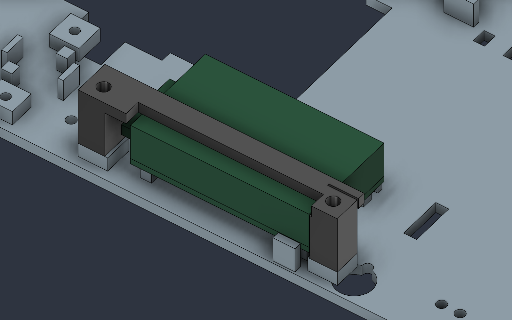
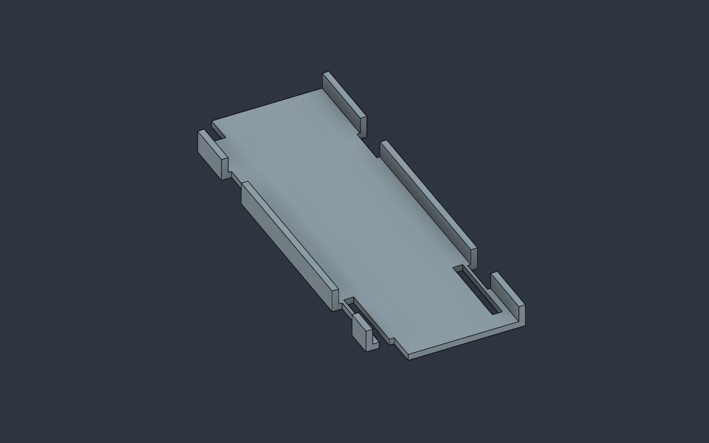

> **Historical revision.** Current geometry, BOM and sensing architecture are [Rev-C.1](RevC_Articulated_Probes.md). Fixed-electrode and magnetometer instructions below are superseded.

# Rev-B.3 — assembly access audit

> Current revision: [Rev-B.4 component audit](RevB4_Component_Compatibility.md). Use Rev-B.4 CAD/current print ZIP; only PRINT_20 changes from Rev-B.3. E1 access is now builder-accepted; historical results below are retained. Supplier fit and sealing gates remain open.

25 September 2026. Baseline: `824227bdc18a4d3c60ed47bad331b1d2a50ebcb1`, Rev-B.2, 1216 Fusion timeline items. Reviewed the repository's hardware brief, revision history, assembly/procurement instructions, scripts and verification evidence, and inspected the live `Energized_Water_Scanner` document through Fusion MCP. Document instructions are historical design context, not additional user requests. This revision changes mechanical packaging only; electronics assessment was requested read-only.

## Decision

**Not yet ready to buy the entire BOM, print everything, and expect a complete assembly.** Ready for staged procurement and interface fit trials. Three concrete CAD defects/margins were corrected below, but several critical purchased interfaces still lack exact geometry and physical evidence. The existing zero-overlap report omitted fastener heads and connected-header volumes; it was not proof of assembly readiness.

Builder context: H2D for the hull, X1 Carbon for most smaller parts; only screws, an ESP32 and basic components are currently on hand. The ESP32's exact board revision and print material have not been confirmed. Do not assume any ESP32 development board matches the modeled Espressif DevKitC V4.

## Changes applied in Fusion

All coordinates are assembly millimeters. Purchased part envelopes and electronics architecture are unchanged.

| Finding | Rev-B.3 correction | Remaining qualification |
|---|---|---|
| Front electronics-tray M3 screw heads collide with the battery tray. D5.5 × 3 mm head allocations at (-70, ±55), Z=19–22 intersect by 42.6085 and 47.9021 mm³. | Two open corner reliefs through PRINT_04: X=-75…-66, Y=-60…-51 / 51…60, Z=18.5…26.5 cutting envelopes. Opening to both edges removes the 0.5 mm peripheral lands left by a circular-only cut. The battery tray can seat over installed tray screws. | Verify actual heads/washers fit; inspect nearby strap features and shake-test the finished battery restraint. The scallops are not battery lead passages. |
| PRINT_18 crosses the ESP32 upper header connection area. The baseline leaves only 0.5 mm above its package envelope, insufficient for upward-connected leads. | Remove X=-21…29, Y=54…59 across the bridge top. Add a 2 mm inboard reinforcement at Y=48.5…50.5. The remaining crossbar is 5.5 mm wide, 3 mm thick; original screw centers remain (-24,54.5)/(38,54.5). | Header access allocations now clear, but actual connector bodies, orientation and cable bends must be checked using the owned ESP32. The bridge still captures an envelope; it must seat on pedestals and never clamp components. |
| Four M3×8 motor-support screws have only 0.2 mm nominal tip margin. | Deepen Ø2.5 receiving pilots from Z=3.8 to Z=2.0 at (26,±23)/(60,±27). Screw seat Z=12, tip Z=4: nominal margin becomes 2 mm; nominal bottom skin remains 2 mm. | These are direct-thread coupon pilots, not qualified threads. Verify screw length, actual floor thickness, print compensation and stripping resistance; never drill through the bottom. |

Reprint **PRINT_01, PRINT_04 and PRINT_18** relative to Rev-B.2. Sixteen print parts remain. Use the complete Rev-B.3 export package; historical CAD/reports retain their revision names.

## Additional blocker found: E1 tightening access

E1 at (-100,0) lies under the bow deck; the hatch begins at X=-80. A vertical Ø12 mm socket corridor hits the hull/deck and rail/pod. Removing the pod and rail does not remove the deck obstruction. A candidate low-profile wrench allocation X=-108…-60, Y=±8, Z=19…27 also clips the hull by 1.2204 mm³. The short socket allocation alone clears, but that does not establish insertion, handle sweep or torque access.

**E1 is unresolved, not passed.** Before the full hull print, select the actual M4 nut/lug and compact tool and demonstrate insertion, tightening while holding the exterior bolt, and removal under the bow deck. If that fails, revise the electrode location/access with a new sealing and sensing-spacing review. This iteration does not thin the watertight shell or add an unsealed deck hole to make an arbitrary wrench pass. The extra audit records these blocked volumes and sets `assembly_release_passed: false`.

## Printer-specific plan

The H2D's published single-nozzle build volume is 325 × 320 × 325 mm; its dual-nozzle overlap volume is 300 × 320 × 325 mm. The hull is 320 × 170 mm before print aids. Align its long axis with the single-nozzle 325 mm direction: only 5 mm total width remains (2.5 mm each side when centered). A 5 mm all-around brim would require at least 330 mm, so it cannot simply be added to that orientation. Validate the actual Bambu Studio nozzle profile, exclusion zones, support and adhesion plan before printing; no slicer project has been verified. Do not scale the hull.

The X1C is 256 × 256 × 256 mm. Use **H2D for the 269 × 154 mm hatch as well**, keeping its broad sealing face flat. Do not assume a diagonal placement fits just because the plate diagonal exceeds 269 mm: the full rectangular footprint must fit. The 235 × 122 mm electronics tray and the other smaller nominal envelopes fit within the X1C dimensions, subject to support/brim and machine exclusions. Material/nozzle/settings remain to be qualified with coupons; do not infer carbon-filled filament from the printer's name.

Manufacturer references checked for this plan: [H2D specification](https://au.store.bambulab.com/collections/h2d/products/h2d), [X1C specification](https://public-cdn.bambulab.com/store/bambulab-X1-carbon-tech-specs.pdf?v=20241019045941).

## What still prevents complete prototype assembly

| Priority | Open interface | Required evidence before full build |
|---|---|---|
| Blocker | E1 tool access | Actual nut/socket or wrench geometry and a successful under-deck tightening/removal trial. |
| Blocker | Magnetometer main-hull entry and pod cable seal | Exact gland or potted-feedthrough design, cable OD/connector assembly method, seal stack, strain relief, CAD route and leak test. Neither bare wires across the hatch seal nor an arbitrary drilled hole is an acceptable completion. |
| Blocker | Complete harness packaging | Exact fuse holder, disconnect, XT60/Tamiya adapters, motor bullets, service connectors and mating/bend volumes; locate them in CAD after selection. Existing 6×8 mm corridors are not connector/fuse bays. |
| Blocker | Steering interfaces | Actual SG90 horn spline and usable hole radius, clevises, collar lock, retained cross-pin and flexible boot. Current 17.9 mm horn radius/131 mm ideal link do not establish that a stock horn assembles. |
| Fit gate | Electrode stack and four-wire riser | Actual lug/barrel/sleeve, bolt length, seal compression and nut dimensions. Four overlapping Ø4 route tests do not prove four Ø4 cables fit together; the shared 6×8 riser must be checked with one actual combined bundle and bends. |
| Fit gate | Electronics retention/terminals | Owned ESP32 versus DevKitC V4, actual F5 regulator versus F3 proxy, headers, ESC lead exits, ADC screw heads and bridge restraint. No pressure on chips, solder joints, antenna or hot regulator components. |
| Fit gate | Every fastener and printed fit | Measured screw head/length/washer dimensions, pilot coupons on each intended printer/material, engagement, tip clearance and repeat-removal durability. Typical head envelopes are allocations, not a complete fastener BOM. |
| Test gate | Water sealing and physical loads | Main hatch compression/flatness, pod seal, electrodes, shaft tube and steering boot; liner temperature, restraint strength, mass/trim/freeboard and leak tests with secured ballast. |

The existing bill of materials still omits exact integration part numbers, quantities and qualified lengths. Buy the named drive/servo/sensor parts for measurement and bench trials in stages; do not treat the complete procurement list as an order-ready assembly kit. A carrier PCB is not necessary to resolve the present mechanical work, and no electronic redesign is included here.

## Immediate assembly sequence

1. Confirm the owned ESP32 version. Trial-print PRINT_03 and PRINT_18 on the intended small-part process; fit real header leads and USB plug before any hull print. Tighten bridge screws onto their pedestals only.
2. Obtain the motor/driveline, SG90/horn, exact electrode lugs/nuts/seals, harness connectors and feedthrough hardware. Measure the open interfaces above and close E1 access first.
3. Qualify pilot, fastener and seal coupons. The separate E2/motor-mount hull-section coupon in `coupons/` is an open section for fit testing only, not a usable hull or leak-test specimen.
4. Finish and seal the qualified hull. Install/torque electrodes before tray and drive; route E2 before motor/cradle installation. Fit the motor support M3×8 starting screws only after the deeper-pilot coupon passes.
5. Fit the wired electronics tray and its four screws **before** the battery tray. Check the two front heads sit freely inside the new scallops; fit straps, battery and restrained main/balance leads last.
6. Check actual connector mating, powered-off continuity, steering travel, and tray removal. USB still requires battery disconnection and removal of battery plus its loose tray. Main tray removal still requires disconnection of hull wiring and servo horn/linkage.
7. Complete unpowered leak/float and retention tests before powered commissioning. No CAD result demonstrates sensing accuracy or water safety.

## Verification scope

Rev-B.3 uses named additive timeline features and retains the editable design. The assembly audit checks cross-component solid intersections and 71 ideal steering positions; the service audit samples 21 tray heights. The new fastener/access audit adds typical head volumes and continuous ESP32 header connection allocations while explicitly retaining the failed E1 access cases. Wire corridor and proximity checks retain Rev-B.2's documented exclusions and limitations. No real cables, complete screw set, continuous motion, printer compensation or flexible seals are simulated.

Machine-readable results and revision-matched export hashes are in `verification/RevB3_*`. A successful regression check is distinct from assembly release: the known blocked-access list must not be hidden by a green regression status. Historical suppressed/unknown/rolled-back timeline states remain listed. Do not mark a physical gate complete without dated measurements or test evidence.
