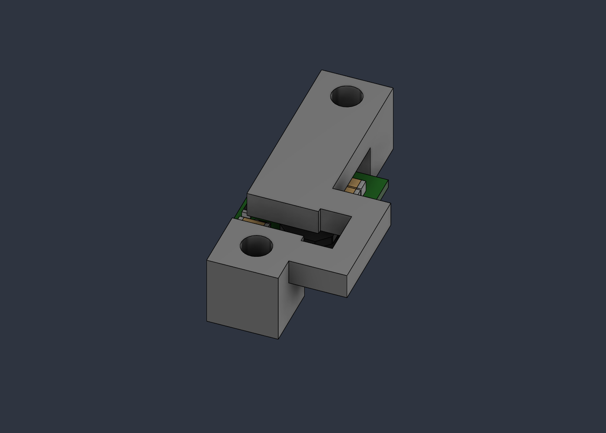

> **Historical revision.** Current geometry, BOM and sensing architecture are [Rev-C.1](RevC_Articulated_Probes.md). Fixed-electrode and magnetometer instructions below are superseded.

# Rev-B.4 — purchased-component mechanical audit

26 September 2026. Baseline commit `593cd2b`, live Fusion document `Energized_Water_Scanner`, 1,236 timeline items and no unsaved changes at inspection. The user's request is to check the BOM against reliable mechanical references, correct demonstrated CAD problems through Fusion MCP, propose better-documented alternatives, and commit the results. Repository documents and the supplied screenshot are reference material, not independent instructions.

## Decision

**The nominal models mostly agree with the named products, but the full assembly is still not ready for an unconditional buy-and-print release.** The strongest evidence is for the ADC, regulator and board outlines. The unresolved risks are predominantly mating hardware, servo/horn geometry, cable exits, seals and tolerance stacks, rather than the main electronics' nominal sizes.

Use Rev-B.4 F3D/STEP and the current print ZIP. **Only PRINT_20 changes shape relative to Rev-B.3.** The other fifteen printable geometries remain unchanged. This is a verified CAD correction and procurement audit, not evidence that physical assembly or sealing has passed.

E1 access is **accepted by the builder as a manual assembly workaround**, per the present request. It is no longer presented as a decision the builder must revisit before procurement. The historical obstructed-tool calculations remain true. No heat-assisted procedure was modeled or qualified; if assembly alters the boss or seal seat, inspect that resulting stack and leak-test it. Builder acceptance does not turn an unperformed seal test into a pass.

## Corrections made directly through Fusion MCP

1. **PRINT_20 blocked the regulator's connection row.** The official five-hole pattern places three central pin axes under its crossbar. A connection allocation intersected the old bridge by 84 mm³. Rev-B.4 adds an offset bypass at X=71…74 mm and opens X=56.5…70.5, Y=33.3…37.5 above Z=28.216 mm. The original M3 screw centres (63.5,30)/(63.5,55.78), pedestals and rear capture span remain. The result is one connected solid. This is access space, not an exact model of an unspecified connector.
2. **M4 nuts were too small in plan.** Their Ø7 mm cylinders represented the across-flats dimension and omitted hex corners. The revised Ø8.1 × 3.2 mm rotation envelopes cover an ideal 7 mm-AF hexagon: `7 / cos(30°) = 8.083 mm`. Bore, axial stack and electrode centres are unchanged. These are conservative nut envelopes, not printable nuts or detailed thread models. [DIN 934 supplier dimensions](https://www.accu.co.uk/hexagon-nuts/154956-HPN-M4-A4-BL).
3. **Regulator provenance is now resolved.** The body-owning component is relabeled `D24V10F5_OFFICIAL_D24V10Fx_FAMILY_STEP`. Pololu explicitly links the family drawing and STEP from item 2831; the downloaded model matches the imported body's bounds and volume. An F3 name inside a family file is not evidence of a wrong mechanical part. Procurement remains **F5, 5 V**, not F3. [Official F5 resources](https://www.pololu.com/product/2831/resources).

## Component-by-component findings

Dimensions are millimetres unless stated otherwise. “Nominal match” does not mean a tolerance-certified or fully connected assembly. Measurements come from live BRep geometry, not pixels or an assembly-axis bounding box of a tilted part.

| Purchased part | Online evidence versus live CAD | Disposition / precision limit |
|---|---|---|
| Espressif ESP32-DevKitC V4 | Official dimension PDF: PCB 48.26 × 27.94, row spacing 25.40, pitch 2.54, antenna overhang 6.04. CAD reproduces the outline and antenna. | Keep the exact V4. The 10 mm upper package allocation and USB/header mating bodies are not specified by this 2D drawing. An owned generic ESP32 is not automatically equivalent. [Drawing](https://dl.espressif.com/dl/schematics/esp32_devkitc_v4_dimensions.pdf). |
| SparkFun SEN-19921 | Board drawing gives 0.75 × 0.30 inches = 19.05 × 7.62, matching CAD. The product prose's 24.65 mm conversion is inconsistent; the actual dimension drawing resolves it. | Keep. The 3.5 mm component allocation, attached Qwiic cable and sealed exit still require fit verification. [Board outline](https://cdn.sparkfun.com/assets/c/d/0/5/3/19921_QwiicMagnetometer-MMC5983MA-BoardOutline.png), [product](https://www.sparkfun.com/sparkfun-micro-magnetometer-mmc5983ma-qwiic.html). |
| Adafruit ADS1115 PID 1085, STEMMA QT revision | Official STEP has 27 bodies; translated bounds and volumes agree with the live 27-body model. PCB 25.4 × 17.78 × 1.57; overall 4.53 high. Eagle holes Ø2.5 at (2.54,2.54), (22.86,2.54), (2.54,15.24), (22.86,15.24); tray centres match after translation. | Keep this revision. Do not buy the older larger board under an ambiguous listing. Actual M2 heads, connected JST plugs and analog-header wiring remain assembly items. [Official CAD](https://github.com/adafruit/Adafruit_CAD_Parts/tree/main/1085%20ADS1115%20ADC), [PCB source](https://github.com/adafruit/ADS1X15-Breakout-Board-PCBs). |
| Pololu D24V10F5 / 2831 | Shared STEP: 12.7 × 17.78 × 3.816, exact bounds/volume match. Drawing: 1.02 PCB + 2.8 component height; board-edge tolerance ±0.3, drill location ±0.1, five Ø1.02 holes at 2.54 pitch. | Keep; reprint PRINT_20. Expanded PCB-edge test clears printed parts. The catalogue's 0.14-inch height is rounded; use the larger STEP/drawing height. Headers are optional and not in the STEP. [Dimension drawing](https://www.pololu.com/file/0J1662/d24v10fx-step-down-voltage-regulator-dimensions.pdf). |
| Hobbywing WP-1625 / 30120000 | Maker specifies 34 × 24 × 14, matching the rectangular CAD body. Stock leads are 18 AWG, 75 mm; small Tamiya input and female 4 mm bullets. | Keep nominal case envelope. There is no verified lead-root, switch/jumper, plug, fuse or bend geometry in that box. The 38 × 28 × 18 allocation is not a complete harness bay. [Manufacturer specifications](https://www.hobbywing.com/en/products/quicrun-wp-1625-brushed53). |
| Gens Ace GEA222S30X6GT | Maker gives approximately 104 × 34.5 × 14.5 and 126 g; CAD matches in its transverse orientation. | Keep exact pack; buy one for measurement. Approximate soft-pack dimensions are not maximum material limits. Lead roots, G-Tech/balance connector, straps and non-compressive fit must be checked. No hard tolerance was found. [Maker listing](https://gensace.de/products/gens-ace-g-tech-soaring-2200mah-7-4v-30c-2s1p-lipo-battery-pack-with-xt60-plug). |
| Mabuchi RS-380PH-4045 | Maker's product search lists Ø29.2 × 37.8, matching CAD. Live CAD also assumes Ø2.3 shaft, Ø10 × 2.6 boss, 16.4 face-to-tip and two M2.6 holes on 16 mm pitch. | Main envelope supported; these additional interface dimensions were **not independently verified against a current exact-part drawing** in this audit. Retain as a measurement-first item, not a released mount. Current detail page offers performance/photo, not the required dimension drawing. [Maker data](https://product.mabuchi-motor.com/result.html), [exact winding](https://product.mabuchi-motor.com/detail.html?id=99). |
| Krick 65220 | Supplier: tube Ø5.5 × 153, shaft approximately 178, M2 prop thread 5 long. Live axial measurements: tube 153, shaft 178. Hull bonding bore Ø6.5 gives nominal 0.5 radial annulus. | Keep for prototype measurement. Supplier explicitly describes an economical, non-high-precision shaft; no straightness, bore or axial tolerance is supplied. CAD Ø2.2 tube bore is a placeholder, not the real bearing design. [Supplier](https://www.krickshop.de/Schiffswelle-Stevenrohr-M2-x-153mm-Eco.htm?ProdNr=65220&a=article). |
| Krick 63800 + 63823 + 63820 | Supplier confirms complete coupling 20 long, Ø15; insert bores 2.3/2.0. The 63820 insert is 5 wide, 10 mm hex, M3 setscrew. CAD's external cylinder and split bores match nominal values. | Keep, but CAD omits the inserts' actual seats and setscrews. Do not interpret a zero-overlap cylinder as proof of usable engagement or key access. [Supplier dimensions](https://www.krickshop.de/Zubehoer-Ersatzteile/Zubehoer-fuer-Schiffsmodelle/Schiffswellen-Kupplungen/Welleneinsatz-f-Stegkupplung-2mm.htm?ProdNr=63820&a=article&p=192). |
| Krick/Graupner gr2307-30 / 2307.30 | Supplier confirms Ø30, right rotation and M2 brass threaded insert. | Keep nominal diameter/thread only. CAD's **5 mm axial swept thickness is unverified**; blade/hub axial depth, thread depth, thrust washer and locking arrangement need measurement. No drawing establishes that this prop occupies only that cylinder. [Supplier](https://www.krickshop.de/Accessories-Spare-Parts/Accessories-for-Ship-Models/Propellers-for-shipmodels/Schiffsschraube-3Bl-30mm-R-M2.htm?ProdNr=gr2307-30&a=article&p=186&shop=krick_e). |
| TowerPro SG90 Digital | Product headline 23 × 12.2 × 29; diagram table A=30.3, B=22.7, C=27, D=12.2, E=32.3, F=17. C is case height, **not hole pitch**. CAD is a 23 × 12.2 × 29 box plus spline; lug span 33, mounting pitch 29, underside at 18 above base. | Not precision-verified. Diagram does not dimension hole pitch, spline specification, horn hole radius or horn seating. Existing supports and 17.9 mm horn radius are not demonstrated stock-SG90 interfaces. Prefer the Hitec proposal below if buying new. [TowerPro](https://towerpro.com.tw/product/sg90-7/). |
| Four electrode screws/nuts/lugs/seals | CAD shank length 18, Ø7 × 3 head envelope, 1 mm seal, 10 mm boss, 1 mm lug and 3.2 nut. Revised nut includes corners. | Specify parts below; lug and seal are still unselected geometries. Do not substitute a socket-cap screw with a 4 mm head and call it the same stack. Thread engagement and seal compression remain physical gates. |
| Rudder stock, collar, cross-pin, M2 linkage and boot | Stock Ø3 × 86 and Ø1.3 cross-hole are fabrication dimensions. Collar Ø8 × 5, pin Ø1.2 × 8 and boot Ø7 neck/Ø10 bellows are allocations without exact purchased parts. | None is released as an off-the-shelf fit. Horn, clevis, collar lock and boot stroke remain a steering integration task. See proposed selection route below. |
| Front-end perfboard and complete harness | 40 × 30 × 12 front-end block and 6 × 8 conductor riser are design budgets. | No manufactured board/harness exists to verify. Exact fuse holder, connectors, wire bundle and retained bends must be selected and placed. Four overlapping route cylinders do not verify a four-cable bundle. |

## Recommended substitutions and exact selections

**Servo: propose Hitec HS-65HB with the matching Micro 25T horn/hardware set.** Its current [manufacturer datasheet v2.2](https://www.hiteccs.com/public/uploads/data_sheet/HCS_HS-65HB_Specsheetv2.2_10-1729887930.pdf) provides a dimensioned mounting layout, ±0.1 mm general tolerance and M25T Ø5 spline. Case nominal 23.6 × 11.6 × 24; mounting datum dimensions 20.0 + 8.6 = 28.6 mm between main mounting positions. The drawing distinguishes case, output shaft and fitted horn heights. Use [Hitec's matching set](https://hitecrcd.com/hs-65-65mg-5065mg-horn-hdwr/), not a generic standard-size 25T horn. This is a **proposal, not a drop-in change or procurement release**: modify PRINT_03, model the selected horn/link ends, recalculate the rod and repeat the boot/travel audit. It also draws 1.2 A at stall at 6 V, exceeding the existing 1 A BEC rating; adopting it requires a suitable servo supply or validated load limit. No claim is made that its stock horn offers the current 17.9 mm radius.

**Electrode screws: select four Accu SFE-M4-18-A4, DIN 84, M4 × 18, natural A4.** The [supplier datasheet](https://www.accu.co.uk/api/product-datasheet?id=6700) specifies Ø7 maximum head, 2.6 maximum head height, M4×0.7 thread. The existing Ø7 × 3 head volume conservatively contains it when under-head seating remains Z=-1. Select four natural A4 DIN 934 M4 nuts, 7 AF and maximum 3.2 high. This resolves head/nut identity but does not release the uncompressed 1 mm seal or generic lug stack. No extra inner washer is allocated.

**Lugs: propose four TE Connectivity 34145 PLASTI-GRIP M4 ring terminals** in place of “any M4 lug.” [TE](https://www.te.com/en/product-34145.html) publishes a product drawing and STEP; product data gives 4.34 stud opening, 0.79 tongue thickness and 20.55 overall length. These differ from the current 1 mm / 19.5 mm overall allocation. Direct CAD/drawing download returned Access Denied during this audit, so the complete sleeve/barrel geometry was **not inspected or installed in Fusion**. Do not order it as a proven E2 drop-in: retrieve the drawing, confirm wire/insulation compatibility, then revise all four stacks and the E2 exit if necessary. This is a concrete candidate, not a substitute for a verified drawing.

**Main-hull sensor entry: propose Scanstrut DS6-P with a continuous round jacketed cable.** [Manufacturer](https://www.scanstrut.com/marine/cable-seal/vertical/ds6-p) documents Ø30 × 19 high and cable OD 2–6, with installation drawing and bungs. It gives a defined alternative to an arbitrary hole or wires under the hatch gasket. It is not modeled or selected for the smaller pod: its Ø30 footprint exceeds the pod's 28 mm overall width. A pod redesign or a smaller gland with a fully retrieved drawing is required. Keep stainless fittings away from the sensor where practical and recheck magnetic bias. Do not treat a loose four-wire Qwiic lead as a sealable round cable.

**Collar: propose Ruland MCL-3-A if a documented clamp is preferred.** The [manufacturer](https://www.ruland.com/mcl-3-a.html) specifies a 3 mm bore (+0.012/+0.050), Ø16 body, 9 mm width and **Ø20.8 maximum hardware clearance**. It is substantially larger than the current Ø8×5 allocation and requires bracket/stock-spacing and fastener-access checks; it is not a drop-in or adopted part. For the flexible boot, no dimensionally verified replacement for the current Ø7-seat/Ø10-bellows allocation was established. That selection remains open; do not buy a generic boot based on those invented CAD dimensions.

## Precision and acceptance rules

- **Official CAD accuracy is not production tolerance.** The Adafruit comparison is within 0.000004 mm in stored bounds because it is the same nominal model; it does not establish micrometre manufacturing accuracy. Source hashes and the comparison method are in [reference evidence](../verification/RevB4_Reference_Check.json).
- Use Pololu's published edge/drill tolerances where available. Other overall dimensions without tolerances remain nominal. Do not apply Hitec's ±0.1 to TowerPro or assume an approximate LiPo dimension is a guaranteed maximum.
- Fusion's centimetre API units were converted to millimetres. Driveline lengths were measured along the 15° shaft axis. From the motor face: shaft tip 16.4, coupling 10…30, prop shaft 25…203, stern tube 36…189, prop allocation 198…203. This yields only **5 mm nominal coupling/prop-shaft overlap** and 6.4 mm motor-shaft overlap; neither is a verified insert engagement depth. Resolve axial retention and thrust hardware before bonding the tube.
- Qualify the actual printer/material using coupons. The stated 0.5 mm PCB clearance parameter is not proof of 0.5 mm clearance everywhere in a fixed-coordinate design. Check supports against solder joints and components, and avoid using bridge torque to crush electronics.

## Build disposition

1. Purchase for measurement: exact ADC, F5 regulator, SEN-19921, exact DevKitC V4 if needed, the named battery/ESC and matched Krick/Mabuchi drivetrain. Verify the motor interface drawing or measure its boss/pitch/projection before PRINT_11 is frozen. These are measurement purchases, not a declaration that every attached wire/shaft is packaged.
2. Resolve the servo choice and complete its horn/clevis/boot geometry before printing the final tray. The present model retains SG90 geometry; Hitec is proposed only.
3. Select the exact seals, lugs, collar, pin retainers, glands and harness. Model connected states and strain relief, including the pod and main hull entries. This work remains open.
4. Print interface coupons and the revised PRINT_20 for fit trials. Use H2D for hull/hatch and X1C for smaller parts only after slicer/process qualification. Full hull printing is still premature while penetration and steering designs are unresolved.
5. Dry assemble, check retention/service removal, then perform unpowered leak/float and trim tests. No online reference or CAD regression substitutes for those measurements.

## Verification

Rev-B.4 has 1,250 timeline items and 40 parameters. The physical assembly regression reports 94 solids, zero cross-component volume intersections, zero Boolean failures and zero feature errors/warnings. Legacy suppressed, unknown and rolled-back states remain explicitly listed. The 71 ideal steering samples still clear tested obstacles; this does not validate an actual horn or flexible boot.

The supplier-interface audit tests the regulator PCB's ±0.3 edge expansion, the five upward pin paths and the connection allocation, plus ADC hole centres and enlarged nut envelopes. Revision-specific service, wiring, fastener-access, STL, native-roundtrip and export reports accompany the release. Historical Rev-B.3 evidence is retained. **`assembly_release_passed` remains false**, even though CAD regression checks pass and E1 access is builder-accepted.
