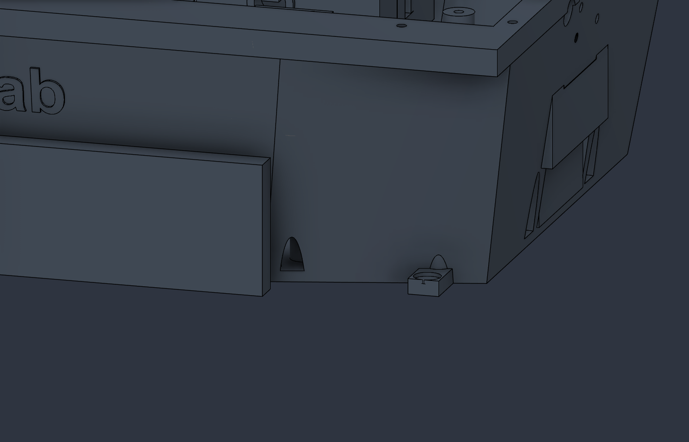
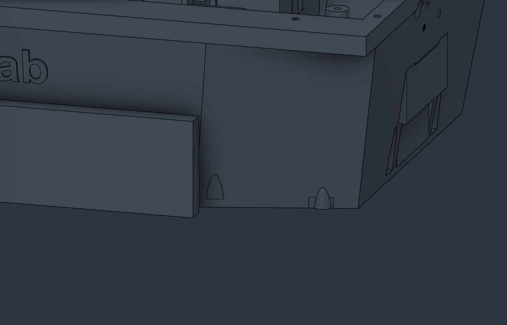
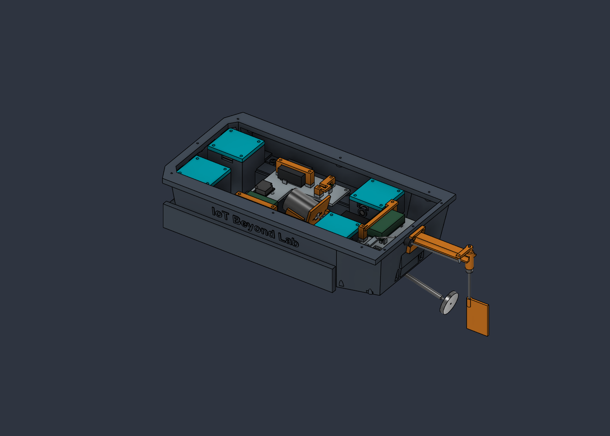

# Rev-E1 hull repairs — 29 September 2026

**1 October 2026 update:** the live physical assembly remains Rev-E1. Its service/wiring references and component-source annotations are now audited against current manufacturer information. See the [live mechanical audit](Mechanical_Audit_2026-10-01.md), including corrected battery removal and USB access. No BOM or 3D export was changed.

The live `Energized_Water_Scanner` Fusion document contains these repairs. Only the hull geometry changed. The 23-piece print inventory and 79-line assembly BOM retain their quantities. **Existing Rev-E hull STL, STEP and Fusion archive files do not contain the repairs. Export and mesh validation are deferred; do not print the old hull expecting Rev-E1.**

## What changed

Coordinates below are assembly millimetres, X longitudinal, Y transverse, Z vertical.

| Finding | CAD repair | Assembly consequence |
|---|---|---|
| Obsolete vertical mounting relief near X143, Y−72 broke through the sloped port wall | Restored the wall using the corresponding clean starboard shell shape, locally within X138.8–147.2, Y−78 to −68, Z2.5–16.6 | Removes an unintended hull opening; inspect the printed repair for porosity |
| Old mounting foot projected outside the port stern near X174–182, Y−75.5 to −60, Z0–4 | Trimmed the excess to the mirrored shell contour while protecting the current steering boss at X178, Y−62 | Removes unnecessary projecting stock without deleting the current steering mount |
| Cartridge mounting pilots were not uniformly blind to the dry hull | Added 16 Ø7 mm support bosses with Ø2.5 mm pilots, 5 mm depth from the gasket land and 3 mm solid end caps | Nominal M3×8 through 3 mm flange and 0.75 mm compressed gasket: 4.25 mm engagement, 0.75 mm bottom clearance; verify actual hardware |
| Four rudder bracket mounting pilots penetrated the transom | Added internal support and 3 mm end caps; bore ends at X193, cap extends toward X190 | Measure the real seating faces and select screws with tips at X≥193.75; upper/lower seats differ |

Front cartridge pilots: X−95/−67, Z8/24, lands at Y±59. Rear pilots: X96/124, Z8/24, lands at Y±39. Rudder pilots: Y±9, Z50/58. Do not drill or drive screws through the caps. Printed thread strength and repeated tightening remain unqualified.

The 22 named `RevE1_*` repairs append 44 timeline entries (tool base features plus join/cut features). Hull volume changes from 708.923 to 711.686 cm³, a net addition of 2.763 cm³. The hull remains one connected BRep solid. This is not a wall-porosity or pressure test.

## Before and after

The supplied attachment shows Fusion MCP settings, so it cannot identify the user's exact highlighted feature. These images document defects independently found in the actual model.

Before, port stern detail:

After, matching view:

Repaired assembly with main hatch hidden for inspection:

The inclined bored stern-tube sleeve, current rudder/steering mounts, hatch flange, and wet-channel roofs remain functional. Their intentional holes/interfaces must receive the specified installed parts and seals. Do not remove these surfaces as slicer supports.

## Verification and limits

- [Repair record](../verification/RevE1_Repair_Record.json): each volume change, temporary added-stock interference preflight, persistent one-solid result and timeline health.
- [Post-repair assembly audit](../verification/RevE1_Assembly_Audit.json): 145 physical solid envelopes, static intersections and each probe sampled over 0–90° in 2° increments. Three known construction-envelope overlaps are classified separately.
- [Persistent pilot checks](../verification/RevE1_Pilot_Check.json): all 20 end caps checked with a Ø2.48 mm cylinder through 2.98 mm of nominal 3 mm cap thickness; bores remain open at the test points.
- [Baseline comparison](../verification/RevE1_Comparison.json): unchanged non-hull volume and bounding boxes, with the hull change isolated.

These checks use nominal rigid geometry. They do not establish continuous swept clearance, tool/hand access, belt tooth engagement, flexible lead motion, tolerance stackups, seal drag, fastener strength, print quality, flotation or waterproofness. Historical service/interface reports remain baseline evidence, not new physical qualification.

## Build decisions still required

The four servos stay dry inside the shared hull, driving separate sealed shafts. Their service covers do not isolate flooding. Build and cycle one complete cartridge/transmission/lead-loop coupon before ordering four sets. Confirm water-compatible seals, shaft finish, retention, gasket compression and lead-potting bonds.

The propulsion tube needs a qualified seal/lubrication arrangement **inside the tube around the rotating shaft**, independently of the outer tube-to-hull bond. That selection remains open; the BOM flags it. Battery wiring, straps and tolerance must fit within nominal 1.661–2.081 mm drivetrain gaps. See [build qualification](Build_Qualification.md), [assembly](Wiring_and_Assembly.md) and [procurement](Print_and_Procurement.md).

The repository workbook and CSV incorporate the new screw limits, hull export hold and stern-shaft sealing hold. Prices, quantities, existing formulas and workbook formatting are preserved. The separate Google Sheet was not changed.

No STL, STEP, F3D, mesh or 3D archive was exported or uploaded in this audit.
