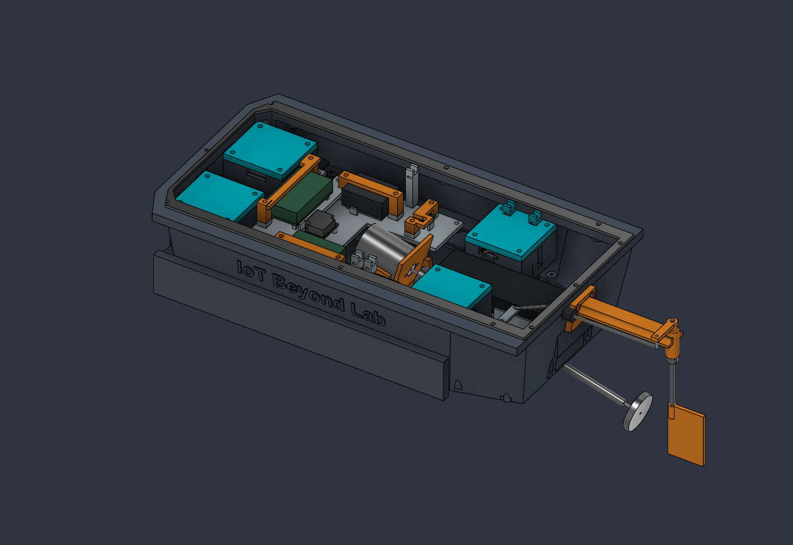
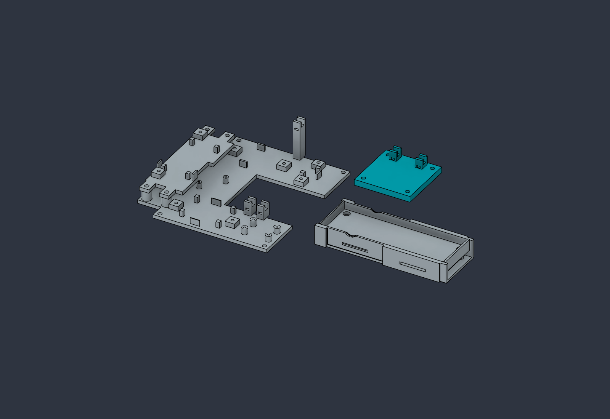
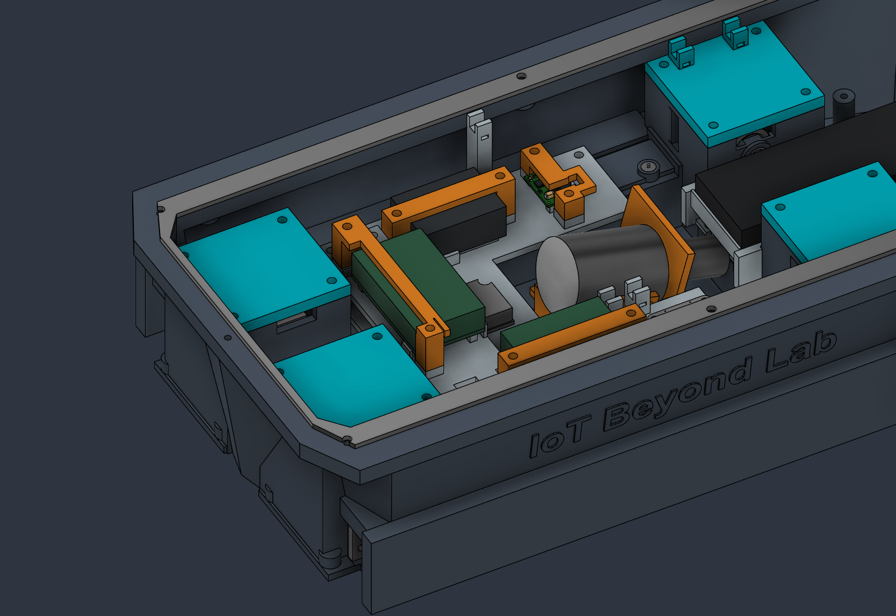
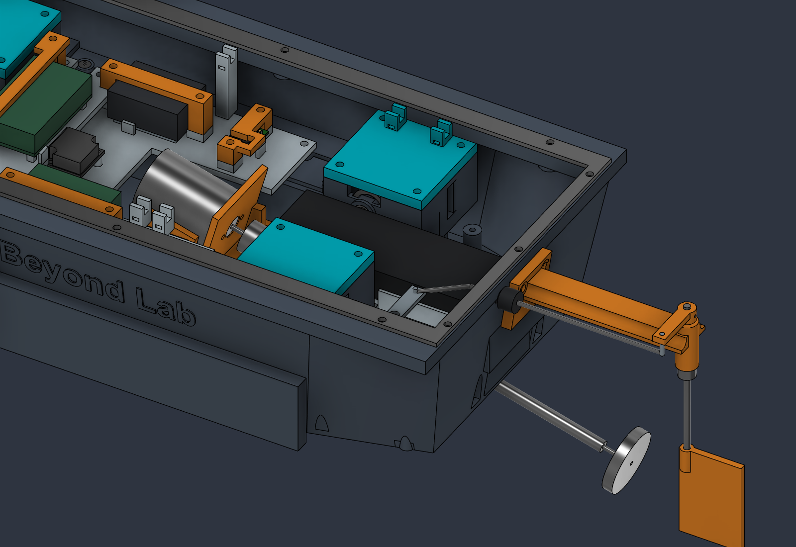

# Rev-E2 physical corrections — 1 October 2026

The live `Energized_Water_Scanner` document now contains physical corrections, beyond the earlier reference-only audit. Its prior Rev-E1 repair geometry is retained. **Save location: the existing Fusion document.** The complete 79-line BOM, 23-piece count and fastener quantities are unchanged. No STL, STEP, F3D or other 3D export was made or uploaded.

## Exact physical changes

| Part | Change and reason |
|---|---|
| PRINT_31 controller shelf, ESP32 and PRINT_18 capture | Replaced the overhead shelf with a forward removable shelf on the main cassette. Translated the controller and unchanged capture bridge **−192 mm X, +2 mm Z**, with no rotation. The PCB is now X−52…−24.06, Y±24.13, Z51…52.6 mm. Reused the existing board seats, edge lips and capture geometry. A regulator notch and ESC-capture corner relief keep adjacent parts clear. The 12 × 40 × 10 mm straight USB service allocation now clears; battery service leaves the controller installed. |
| PRINT_03 main cassette | Extended its forward edge from X−34 to X−54 mm and added four controller mounting bosses at **(−49,±45), (−32,±45)**. The existing four M3×8 shelf screws pass through 3 mm feet into 5.5 mm-deep Ø2.5 blind pilots: nominal 5 mm engagement and 0.5 mm tip margin. Added two analog tie saddles and one raised power tie saddle, away from the motor/regulator. Original cassette mounting and electronics interfaces are retained. |
| PRINT_04 battery cradle and pack | Moved the unchanged 104 × 34.5 × 14.5 mm pack **−4 mm X, +8 mm Z**, to X84…188, Y±17.25, Z33…47.5 mm. Added a raised seat, supports, higher side rails and end stops, with a **105 × 36 mm** nominal cavity at the guide regions. Narrowed the frame to **39 mm** overall, with a **35.5 mm** waist across X90…139.5 and an aft edge at **X189.5** so the cradle itself clears fixed journals, side lands and stern caps during vertical extraction. Added two **22 × 2 mm** under-seat strap tunnels for the existing two straps; use straps no larger than 20 × 1.5 mm. Added Ø5.6 mm driver-access openings. New stock is relieved around the hull; the original tube relief and front screw seating are retained. |
| PRINT_01 hull and PRINT_04 aft mounts | A Ø5 mm vertical screwdriver at the old aft cradle screws X189 collided with the sealed rudder caps. Moved the two aft cradle screw locations to **(185,±13)**, retaining four flush M2×6 screws in total. Added two dry internal Ø8 mm bosses with Ø1.7 mm blind pilots from Z23 to Z18; nominal screw-tip margin remains 1 mm. Cradle underside sockets clear these bosses. The original X189 hull pilots remain unused and blind. All 16 cartridge and four rudder caps, wet walls, hatch gasket land and stern-tube penetration are retained. |
| PRINT_25 E4 internal cover | Added two open power-wire saddles at **(102,61), (124,61)**. Existing cover outline and four screw holes remain. Together with the cassette saddles these provide physical restraint on the corrected wire routes. Each saddle has a **3 × 1.5 mm** tie tunnel for the BOM's existing ties up to 2.5 mm wide. |

**Changed print geometry: IDs 01, 03, 04, 25 and 31.** PRINT_18 changes installed position only; its printable geometry is unchanged. Supplier components were repositioned without resizing their manufacturer-based nominal envelopes. Historical overhead-controller supports inside the hull remain unused; they were not cut away from the sealing structure.

This image shows the cassette and forward shelf (left), E4 cover with ties (upper right), and raised battery cradle (lower right). They remain separate print bodies; the shelf mounts on the cassette. The hull's two added blind bosses are shown in the assembly, not this isolated view.

## Current service and wiring

- Disconnect the pack, remove the hatch, release both straps and **lift the battery vertically**. The controller remains installed. Nominal pack-to-rudder-cap clearance is 2 mm. Pack-to-stern-tube clearance is **9.661 mm**, compared with 1.661 mm previously; coupling clearance is **2.904 mm**, compared with 2.081 mm. The coupling is still an unverified supplier allocation, so its new gap is not a hardware fit guarantee.
- For cradle removal, remove the pack, hatch/gasket and four cradle screws, then lift vertically; drivetrain and actuators remain installed. Release interconnecting leads/ties before lifting the assembled electronics cassette.
- Controller USB service has a clear **12 × 40 × 10 mm** allocation at X−44.03…−32.03, Y−64.13…−24.13, Z51…61 mm. The exact plug and bend remain to be fitted. Disconnect boat power before USB power.
- Analog route: X−20…80, Y−26…−22, Z42…46 mm; saddle centers X27/38, Y−24. Power route: X5…130, Y59…63, Z63…67 mm; saddle centers X20/102/124, Y61. Nominal saddle top Z67.5 gives 2.5 mm to the hatch underside. Keep terminations, antenna space and the gasket free of wiring; actual bundle capacity and bends need checking.
- Release ties/disconnect the harness before actuator-cover service. With hatch/gasket removed, the E4 cover **slides 3 mm inward (−Y), then lifts**. A straight lift catches the hatch flange. Existing forward-cover angled removal remains a separate hardware check.
- Four cradle driver corridors clear a Ø5 mm stem with the battery removed. Controller shelf, capture, cassette and E4 cover checks use Ø6 mm stems. These allocations do not establish hand/handle clearance, torque or printed thread strength. Deburr and pad battery contact surfaces, and avoid compressing the pack.

## Verification

Fusion recomputed successfully. The final design has **1,787 timeline items**, **145 physical solids**, no warning/error features, no unintended static intersections above 0.001 mm³ and no Boolean failures. The same three construction-envelope overlaps remain intentional: SG90 case/lugs, propeller hub/shaft and steering horn/pin.

All five revised print bodies are each **one connected solid**. The nominal battery vertical swept box, USB, ADC connector, both wire corridors and **18 selected driver approaches** clear the live physical parts. Battery lift and final cradle lift were each sampled at 41 positions; E4 cover removal at 44 positions; the assembled electronics cassette at 17 positions. Probe motion was rechecked at **46 positions per probe, 0–90° in 2° increments**, with no detected rigid collision. Checks exclude only the explicitly removed service items; the controller stays installed for the battery check. Flexible belts/leads, continuous motion and hardware tolerances remain outside this digital check.

The 23 print bodies now total **1,106.542 cm³**. At fully dense PETG 1.27 g/cm³ this is approximately **1.405 kg** of plastic, plus about 0.283 kg for the documented battery/motor/five servos/ESC and further hardware. This is not a sliced mass or loaded flotation result. The revised layout changes trim; measure actual mass, displacement and freeboard.

The [component-reference audit](Mechanical_Audit_2026-10-01.md) and [build qualification](Build_Qualification.md) retain the unresolved exact horn/pulley/belt, coupling, propeller, SG90/Mabuchi interfaces, wet sealing and flotation checks. The final cradle extraction relief only subtracts stock from the fully recomputed, probe-sweep-checked model; final static and cradle extraction checks were repeated, and the subtraction cannot introduce a new probe collision. These fixes support printing fit prototypes; they do not invent missing supplier detail or establish water-ready operation.
