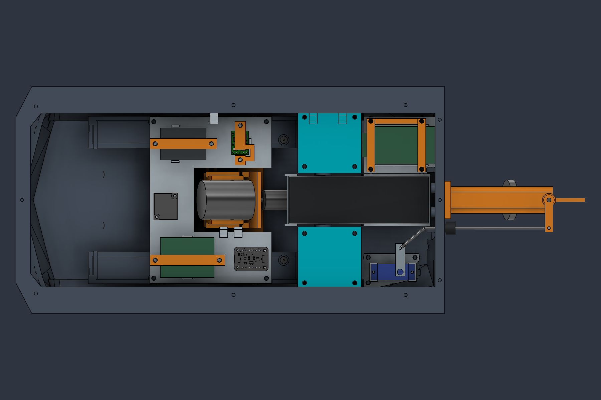
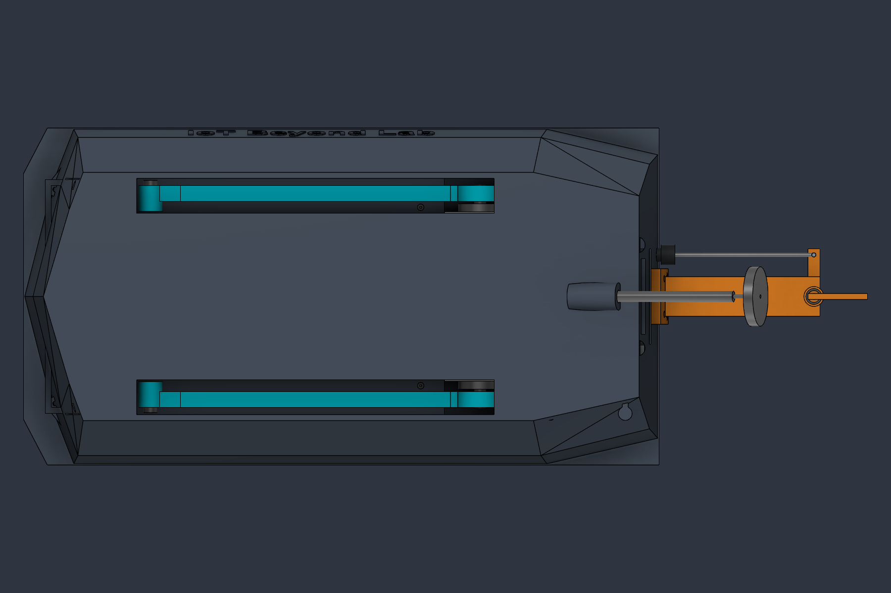
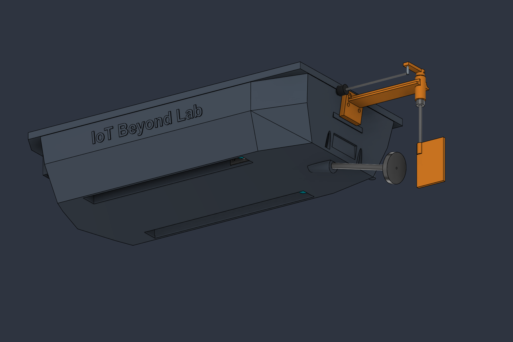
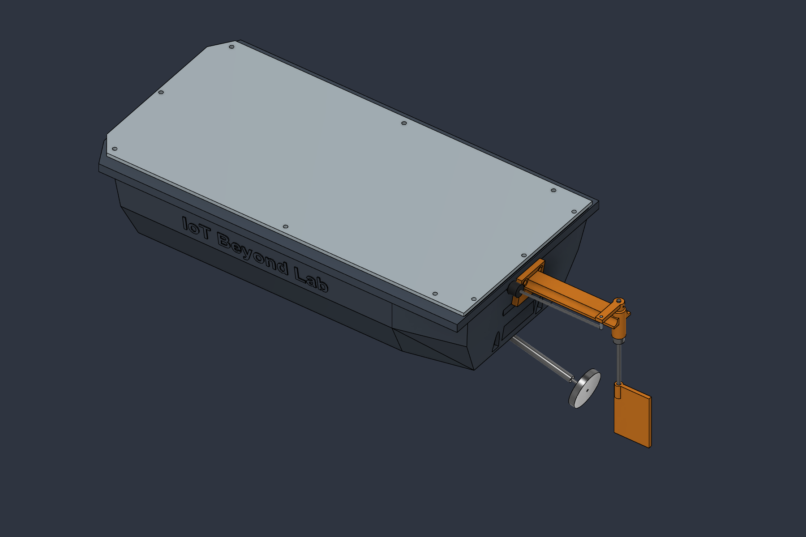

# Rev-F — two probes and rear controller

2 October 2026. The working source is the live Fusion document **Energized_Water_Scanner**. Repository CAD and print archives are historical. This revision publishes documentation and native Fusion viewport images only.

## Physical revision

- Remove the forward-driven outer **E1 and E3** mechanisms: arms, electrodes, shafts/pins, servos, timing-drive allocations, upper journals, seal cartridges, gaskets, seals/bushings, internal covers, and bonded wire-entry allocations. Retain the aft-driven inner **E2 and E4** mechanisms and their existing mounting interfaces.
- Replace the obsolete outer wet channels with continuous sloping lower hull stock. Narrow the bottom's maximum beam from 176 mm including projecting strips to **125.2 mm**. The upper hatch flange remains 170 mm wide; the unchanged cover and continuous gasket retain their interfaces. The hull remains 320 mm long. The two inner channel roofs and openings remain functional.
- Remove the forward dry servo wells, their abandoned shaft/fastener/feedthrough geometry, obsolete controller mounting posts, forward shelf bosses, and superseded reference/clearance occurrences. Timeline history remains available for recovery; removed parts are absent from the current assembly.
- Move the main cassette and its electronics **8 mm aft**, trim away the former forward controller extension, and replace its four mounting locations. The cassette's forward edge changes from X−54 to **X−20 mm**, freeing another 34 mm ahead of it. New cassette screws are at **(−17, ±58.5) and (67, ±58.5) mm**.
- Move the ESP32 to a separate rear starboard shelf, turn it **90°**, and lower it **2 mm**. Its nominal PCB is now **X144.5…192.76, Y27…54.94, Z49…50.6 mm**. The antenna faces the bow. Replace the old shelf and capture bridge with a supported rear shelf and retention frame. Their four shared screw axes are **(145,23), (145,59), (183,23), (183,59) mm**.
- Add small internal fit reliefs around the controller envelope, without opening the exterior skin. Retain the propulsion tube/boss, motor supports, rudder caps, battery cradle, steering saddle and hatch seal. Reinforce the steering saddle's lower support where the narrower chine intersects it.

The controller shelf is removable for USB connection and detailed board service. The USB socket faces the transom; an installed straight USB plug corridor is deliberately not claimed. Provide disconnectable leads and lift the shelf before plugging in USB. Disconnect boat power first.

## Assembly interfaces

The cassette uses four M3×8 screws through its 3 mm plate into nominal Ø2.5 × 5.5 mm blind pilots. Nominal engagement is 5 mm, with 0.5 mm tip margin. The new pilots stop at Z26.5 mm, above the retained wet roof at Z24 mm. Do not deepen them into the wet channels.

The rear shelf and frame share four **M3×30** screws. Nominal head seat Z64.1, shelf support Z41 and pilot bottom Z32 give 6.9 mm engagement and 2.1 mm tip margin. Test printed pilots and actual screw lengths on a coupon. The frame leaves a 0.5 mm nominal gap above the board's conservative component/header envelope; fit electrically insulating compliant pads against suitable robust surfaces of the actual board. Do not load antenna metal, connectors, delicate components or exposed pins. Pad thickness and contact points require the actual board before final tightening.

All supplier envelopes retain their original dimensions. The rearward shift applies to the protected front end, ADC, ESC/pad, logic regulator, dedicated probe regulator and their retained capture bridges. The battery's Rev-E2 position and cradle remain unchanged.

## Electrical consequence

Two electrodes provide **one signed differential voltage** along their separation. They do not retain the earlier four-electrode three-dimensional gradient reconstruction. Preserve the physical labels E2 and E4; use their existing channel assignments A1 and A3 only after the protected front-end schematic and firmware are checked. Remove E1/E3 leads and servo outputs from the active harness. Historical four-angle presets and gradient scripts are not Rev-F measurement software.

## Validation record

CAD validation is summarized below. Physical sealing, material/process qualification, actual connectors, supplier transmission interfaces and loaded flotation remain separate build gates. No slicer or 3D export is included in this revision.

The retained E2/E4 probe assemblies were checked at 46 positions each, 0–90° in 2° increments, with no detected rigid collisions. Subsequent hull cleanup removes obsolete internal stock; the final cassette fastener change is above the channel roofs. This is sampled rigid motion, not a continuous flexible-wire or belt simulation.

Cassette, controller shelf/frame/board and battery cradle vertical removal each cleared 17 sampled positions over 80 mm with the hatch/gasket removed and the relevant harnesses released. The cradle check additionally removes the battery. The battery's full nominal vertical swept box clears with the controller installed. These checks do not establish hand access, flexible lead behavior or screw torque.

The nominal analog/power corridors, ADC plug allocation, rear signal riser/crossing/run and eight Ø6 mm driver approaches were checked. The forward cassette screw pair was moved from X−14 to X−17 after finding a front-end driver obstruction. Rear-controller USB service requires lifting the shelf; an installed USB plug path is not claimed.

Three known construction-envelope intersections remain: SG90 case/lugs, propeller swept hub/shaft and steering horn/pin. They belong to nominal purchased-part/attachment representations, not independently conflicting printed parts. Hardware interfaces still require actual-part validation.

The 19 printed solids are substantially lighter than Rev-E2's 1,106.542 cm³ package. CAD volume is not slicer mass: infill, perimeters, supports, coatings and hardware must be measured. The narrowed hull and rearward controller require a new loaded flotation/trim test.
The steering saddle (PRINT_30) also receives a lower-foot fit trim to clear the sealed chine. Its servo seating and linkage datums remain unchanged. Only the connected saddle body is retained; detached trim remnants are removed.
Final recomputation: **1,844 timeline items**, **109 physical solid envelopes**, no warning/error features, and all **19 print bodies single-connected solids**. No unintended static intersection above 0.001 mm³ was found. Final print-solid volume is **885.444 cm³**, approximately **20.0% less** than Rev-E2. Final selected wiring, battery-sweep and eight driver allocations clear. No Boolean failures occurred in these completed checks.
